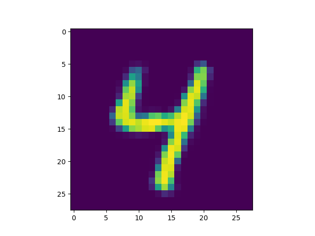

# Variational Autoencoder, Generative Adverserial Network, and learnable loss functions
Repository for Berkeley STAT 157 semester project on attaching discriminatory network onto a variational autoencoder to provide a learnable loss function to replace a pixel-by-pixel loss function commonly used by conventional VAE implementation.

## Experiments on MNIST
Below are the first ten digits taken from the test set of MNIST that are used to produce the validation images:

### Dense VAE with Binary Cross Entropy loss as PBP loss
A VAE with 5 latent variables, 3 hidden dense layers per encoder/decoder, and 400 hidden nodes per hidden layer is trained on the training set of MNIST for 50 epochs. The results are saved in `./results/DenseVAE_on_MNIST/5_3_400_bce_50/`

### Dense VAE with L2 loss as PBP loss
A VAE with 5 latent variables, 3 hidden dense layers per encoder/decoder, and 400 hidden nodes per hidden layer is trained on the training set of MNIST for 50 epochs. The results are saved in `./results/DenseVAE_on_MNIST/5_3_400_l2_50/`

### Dense VAE with BCE + dense logistic regressor
A VAE with 5 latent variables, 3 hidden dense layers per encoder/decoder, 400 hidden nodes per hidden layer, and a binary cross entropy as pbp loss is trained against a dense logistic regressor with 1 hidden dense layer and 200 nodes per hidden layer on the training set of MNIST for 50 epochs. The results are saved in `./results/images/DenseVAE_DenseLogReg_on_MNIST/5_3_400_1_200_50`

### Analysis of results from MNIST training sets
As shown from the images above, a variational autoencoder with simple architecture (consisting solely of dense layers) is already capable of reconstructing handwritten digits to reasonably satisfactory eligibility. However, by attaching even just a simple binary logistic regressor with 1 hidden dense layers, the VAE was trained with more attention to details otherwise not revealed by a pixel-by-pixel losss. Visible sharpening of handwritten digits especially around the edges can be observed.
