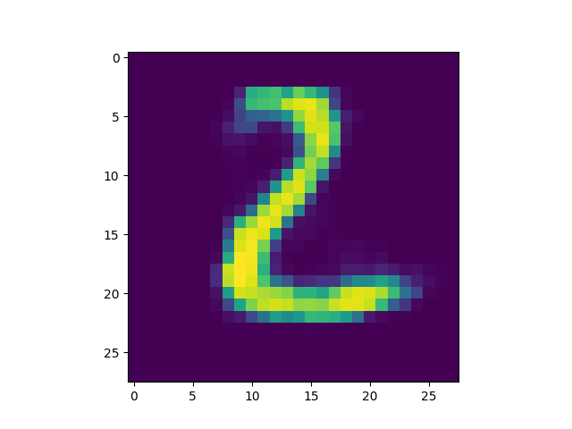
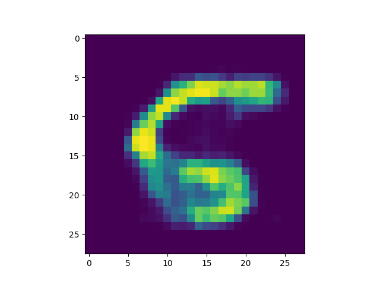
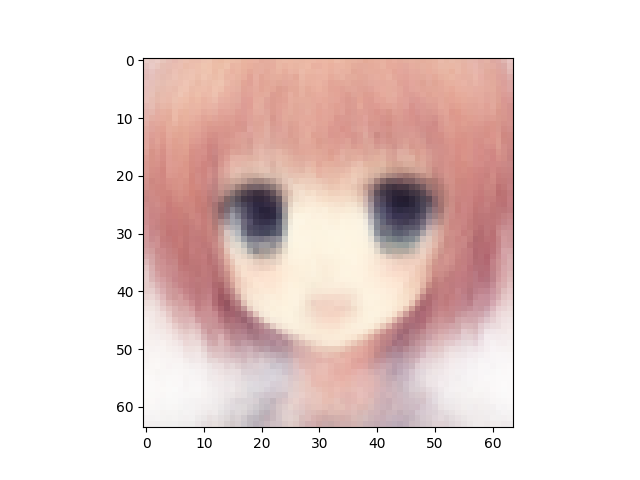
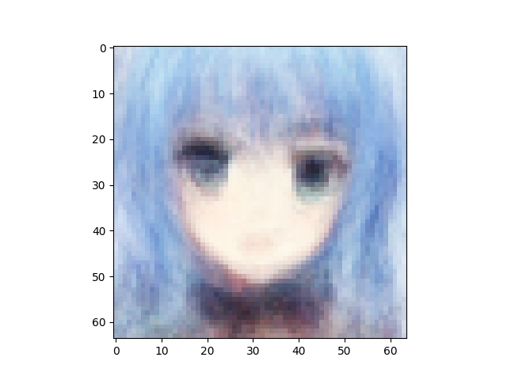
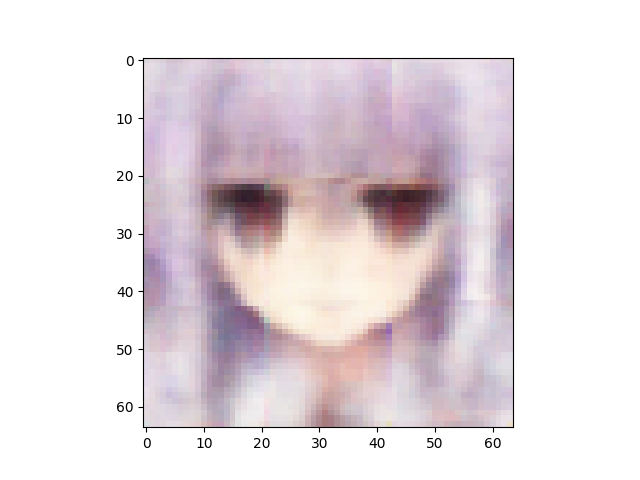
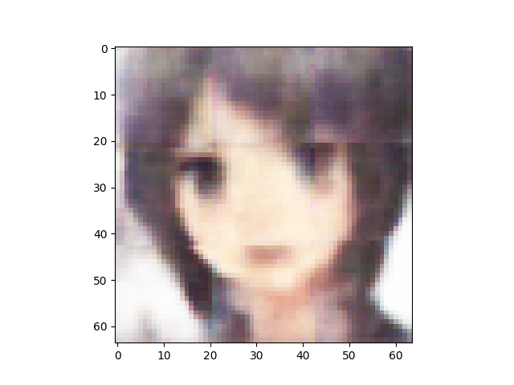
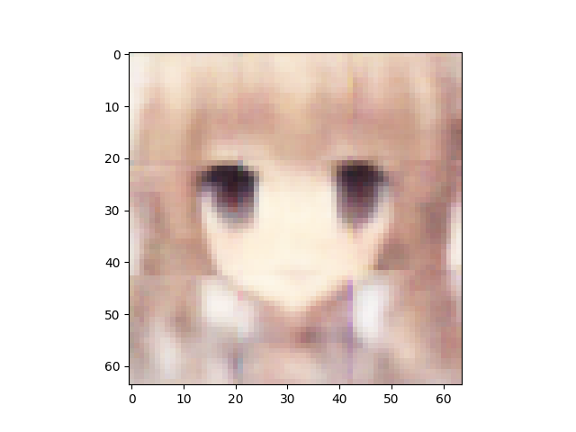

# Variational Autoencoder, Generative Adverserial Network, and learnable loss functions
Repository for Berkeley STAT 157 semester project on attaching discriminatory network onto a variational autoencoder to provide a learnable loss function to replace a pixel-by-pixel loss function commonly used by conventional VAE implementation.

## Experiments on MNIST
Below are the first ten digits taken from the test set of MNIST that are used to produce the validation images:

### Dense VAE with Binary Cross Entropy loss as PBP loss
A VAE with 5 latent variables, 3 hidden dense layers per encoder/decoder, and 400 hidden nodes per hidden layer is trained on the training set of MNIST for 50 epochs. The results are saved in `./results/DenseVAE_on_MNIST/5_3_400_bce_50/`

### Dense VAE with L2 loss as PBP loss
A VAE with 5 latent variables, 3 hidden dense layers per encoder/decoder, and 400 hidden nodes per hidden layer is trained on the training set of MNIST for 50 epochs. The results are saved in `./results/DenseVAE_on_MNIST/5_3_400_l2_50/`

### Dense VAE with BCE + dense logistic regressor
A VAE with 5 latent variables, 3 hidden dense layers per encoder/decoder, 400 hidden nodes per hidden layer, and a binary cross entropy as pbp loss is trained against a dense logistic regressor with 1 hidden dense layer and 200 nodes per hidden layer on the training set of MNIST for 50 epochs. The results are saved in `./results/images/DenseVAE_DenseLogReg_on_MNIST/5_3_400_1_200_50`

### Analysis of results from MNIST training sets
As shown from the images above, a variational autoencoder with simple architecture (consisting solely of dense layers) is already capable of reconstructing handwritten digits to reasonably satisfactory eligibility. However, by attaching even just a simple binary logistic regressor with 1 hidden dense layers, the VAE was trained with more attention to details otherwise not revealed by a pixel-by-pixel losss. Visible sharpening of handwritten digits especially around the edges can be observed.

## Experiments on anime faces
A set of [anime-styled face images](https://github.com/Mckinsey666/Anime-Face-Dataset) is used as training set to train a number of different variational autoencoders and combinations of variational autoencoder with discriminators. Below are the original validation images:

### Dense VAE with BCE loss as PBP loss
A VAE with 512 latent variables, 5 hidden dense layers per encoder/decoder, 1024 hidden nodes per hidden layer, and binary cross entropy as pixel-by-pixel loss is trained on the first 80% of the dataset for 200 epochs. The remaining 20% is used to generate the validation images. The results are stored in `./results/images/DenseVAE_on_anime/512_5_1024_200/`

### Dense VAE with BCE loss as PBP loss + Dense logistic regressor
A dense VAE with 512 latent variables, 5 hidden dense layers per encoder/decoder, 1024 nodes per hidden layer, and BCE as pixel-by-pixel loss is trained against a dense logistic regressor with 1 hidden layer and 1024 nodes per hidden layer on the first 80% of the dataset for 200 epochs. Note that because the variation in the VAE's pixel-by-pixel loss is greater in magnitude than the discriminator loss that serves as a learnable loss in the updating process of the VAE, I added a multiplier constant of 10 on to the discriminator loss. The results are stored in `./results/images/DenseVAE_DenseLogReg_on_anime/512_5_1024_1_1024_200_10/`

### Convolutional VAE with BCE loss as PBP loss
A VAE with convolutional layers used in encoder and decoder networks, 512 latent variables, and 32 base channels is trained on the first 80% of the dataset for 200 epochs. The remaining 20% is used to generate the validation images. The results are stored in `./results/images/ConvVAE_on_anime/512_32_200/`

### Convolutional VAE with BCE loss as PBP loss + Convolutional discriminator
A VAE with convolutional layers used in encoder and decoder networks, 256 latent variables, 16 base channels, and BCE as PBP loss is trained against a discriminator using convolutional layers, a LeakyReLU activation function, and 16 base channels on the first 80% of the dataset for 200 epochs. A multiplier of 10 is applied to the discriminator loss (as learnable loss) during the updating process of the VAE. The results are stored in `./results/images/ConvVAE_ConvDisc_LeakyReLU_on_anime/256_16_16_200_10/`

### Convolutional VAE with BCE loss as PBP loss + ResNet discriminator
A VAE with convolutional layers used in encoder and decoder networks, 256 latent variables, 16 base channels, and BCE as PBP loss is trained against a discriminator that is a ResNet on the first 80% of the dataset for 200 epochs. A multiplier of 10 is applied to the discriminator loss (as learnable loss) during the updating process of the VAE. The results are stored in `./results/images/ConvVAE_ResNet_on_anime/256_16_200_10/`

