# Variational Autoencoder, Generative Adverserial Network, and learnable loss functions
Repository for Berkeley STAT 157 semester project on attaching discriminatory network onto a variational autoencoder to provide a learnable loss function to replace a pixel-by-pixel loss function commonly used by conventional VAE implementation.

## Experiments on MNIST
Below are the first ten digits taken from the test set of MNIST that are used to produce the validation images:

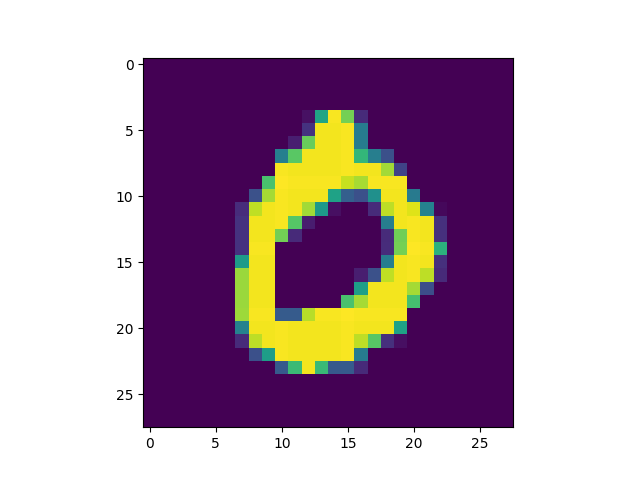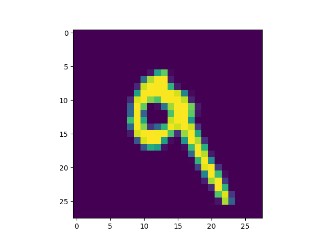

### Dense VAE with Binary Cross Entropy loss as PBP loss
A VAE with 5 latent variables, 3 hidden dense layers per encoder/decoder, and 400 hidden nodes per hidden layer is trained on the training set of MNIST for 50 epochs. The results are saved in `./results/DenseVAE_on_MNIST/5_3_400_bce_50/`

### Dense VAE with L2 loss as PBP loss
A VAE with 5 latent variables, 3 hidden dense layers per encoder/decoder, and 400 hidden nodes per hidden layer is trained on the training set of MNIST for 50 epochs. The results are saved in `./results/DenseVAE_on_MNIST/5_3_400_l2_50/`

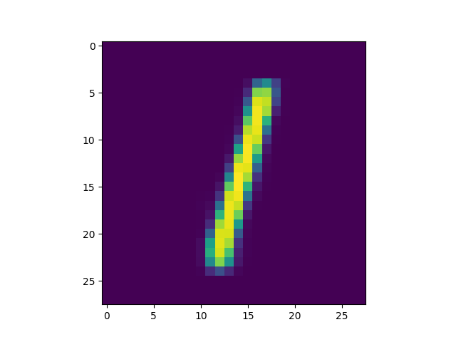

### Dense VAE with BCE + dense logistic regressor
A VAE with 5 latent variables, 3 hidden dense layers per encoder/decoder, 400 hidden nodes per hidden layer, and a binary cross entropy as pbp loss is trained against a dense logistic regressor with 1 hidden dense layer and 200 nodes per hidden layer on the training set of MNIST for 50 epochs. The results are saved in `./results/images/DenseVAE_DenseLogReg_on_MNIST/5_3_400_1_200_50`

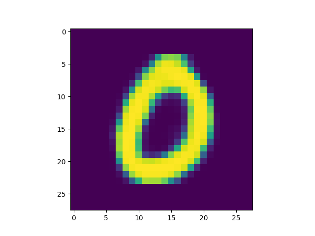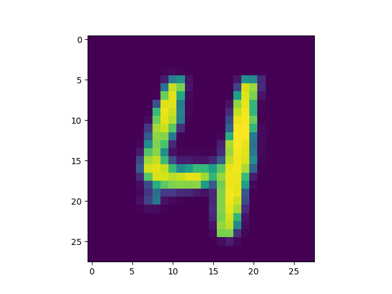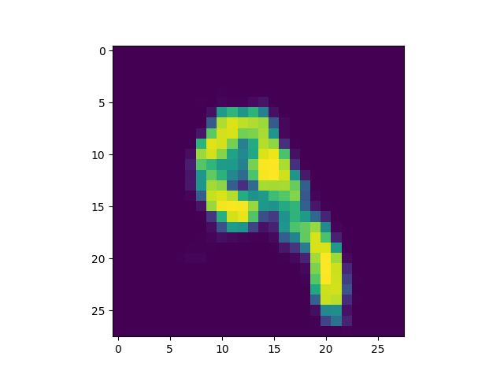

### Analysis of results from MNIST training sets
As shown from the images above, a variational autoencoder with simple architecture (consisting solely of dense layers) is already capable of reconstructing handwritten digits to reasonably satisfactory eligibility. However, by attaching even just a simple binary logistic regressor with 1 hidden dense layers, the VAE was trained with more attention to details otherwise not revealed by a pixel-by-pixel losss. Visible sharpening of handwritten digits especially around the edges can be observed.

## Experiments on anime faces
A set of [anime-styled face images](https://github.com/Mckinsey666/Anime-Face-Dataset) is used as training set to train a number of different variational autoencoders and combinations of variational autoencoder with discriminators. Below are the original validation images:

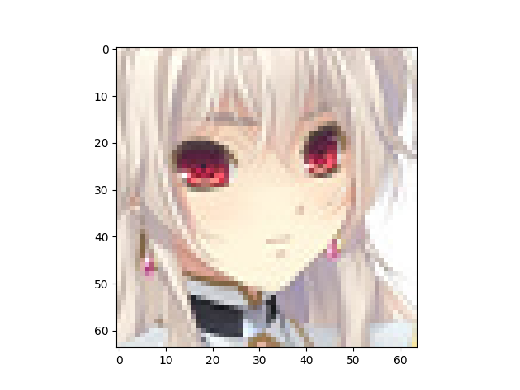

### Dense VAE with BCE loss as PBP loss
A VAE with 512 latent variables, 5 hidden dense layers per encoder/decoder, 1024 hidden nodes per hidden layer, and binary cross entropy as pixel-by-pixel loss is trained on the first 80% of the dataset for 200 epochs. The remaining 20% is used to generate the validation images. The results are stored in `./results/images/DenseVAE_on_anime/512_5_1024_200_seeded/`

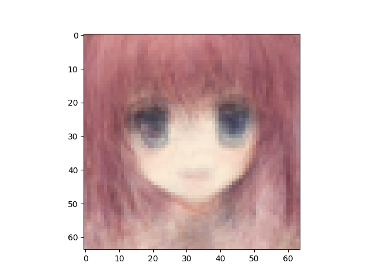

### Dense VAE with BCE loss as PBP loss + Dense logistic regressor
A dense VAE with 512 latent variables, 5 hidden dense layers per encoder/decoder, 1024 nodes per hidden layer, and BCE as pixel-by-pixel loss is trained against a dense logistic regressor with 1 hidden layer and 1024 nodes per hidden layer on the first 80% of the dataset for 200 epochs. Note that because the variation in the VAE's pixel-by-pixel loss is greater in magnitude than the discriminator loss that serves as a learnable loss in the updating process of the VAE, I added a multiplier constant of 10 on to the discriminator loss. The results are stored in `./results/images/DenseVAE_DenseLogReg_on_anime/512_5_1024_1_1024_200_10_seeded/`

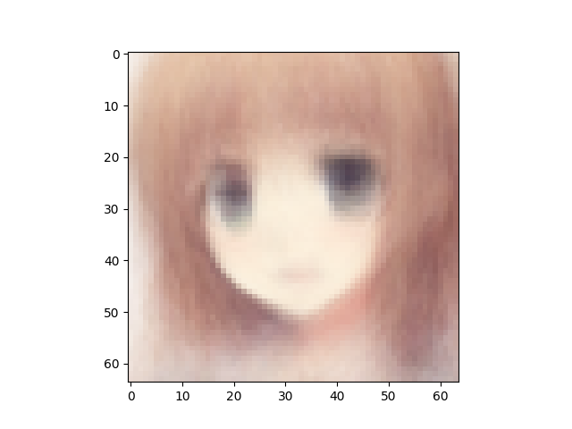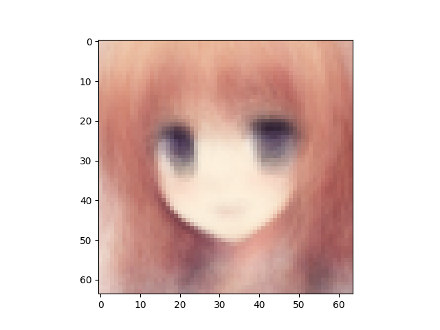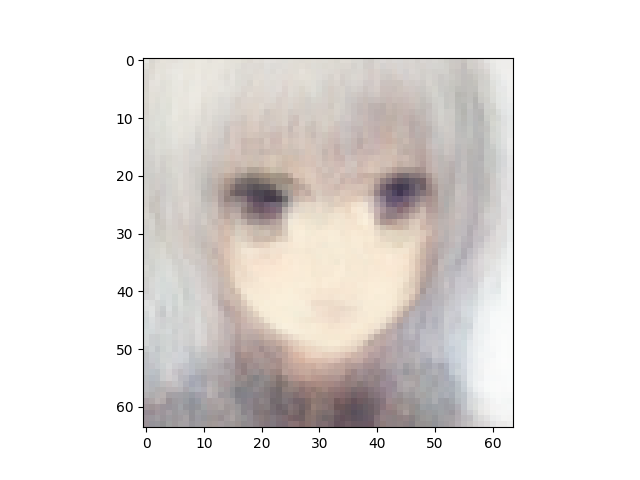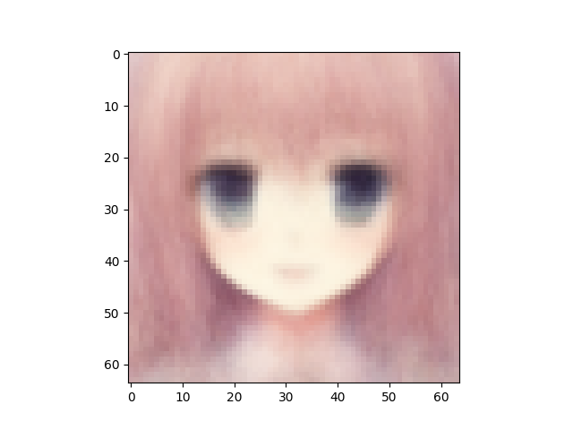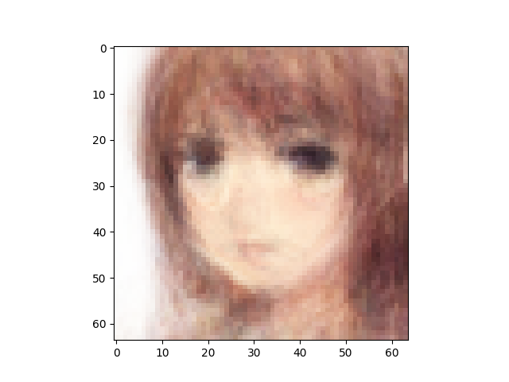

### Convolutional VAE with BCE loss as PBP loss
A VAE with convolutional layers used in encoder and decoder networks, 512 latent variables, and 32 base channels is trained on the first 80% of the dataset for 200 epochs. The remaining 20% is used to generate the validation images. The results are stored in `./results/images/ConvVAE_on_anime/512_32_200_seeded/`

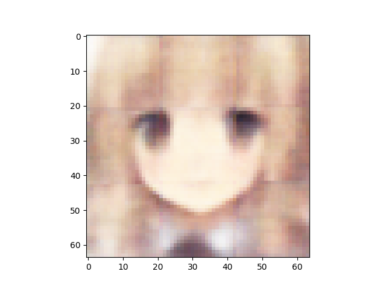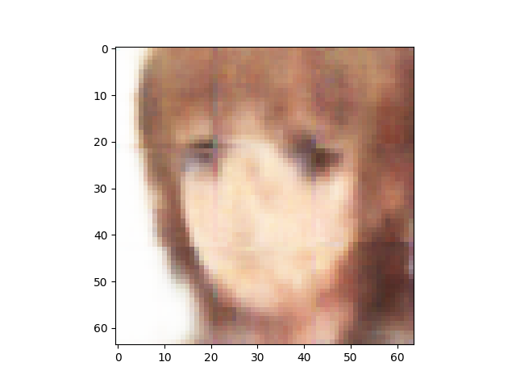

### Convolutional VAE with BCE loss as PBP loss + Convolutional discriminator
A VAE with convolutional layers used in encoder and decoder networks, 512 latent variables, 32 base channels, and BCE as PBP loss is trained against a discriminator using convolutional layers, a LeakyReLU activation function, and 32 base channels on the first 80% of the dataset for 200 epochs. A multiplier of 10 is applied to the discriminator loss (as learnable loss) during the updating process of the VAE. The results are stored in `./results/images/ConvVAE_ConvDisc_LeakyReLU_on_anime/512_32_32_200_10_seeded/`

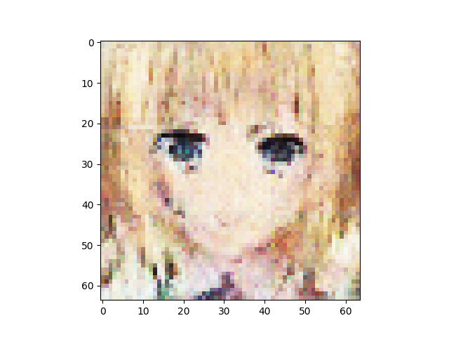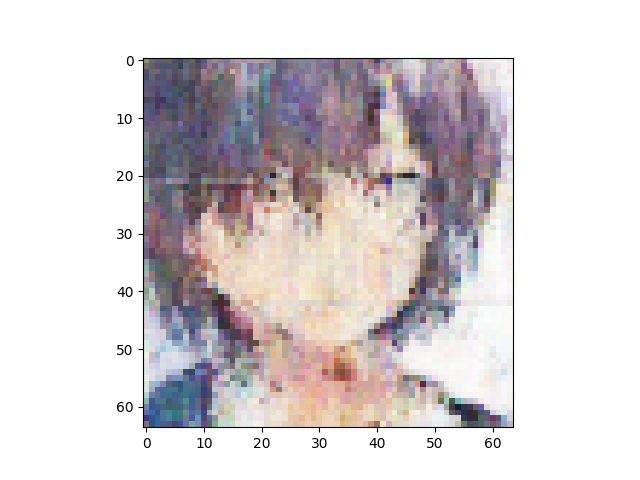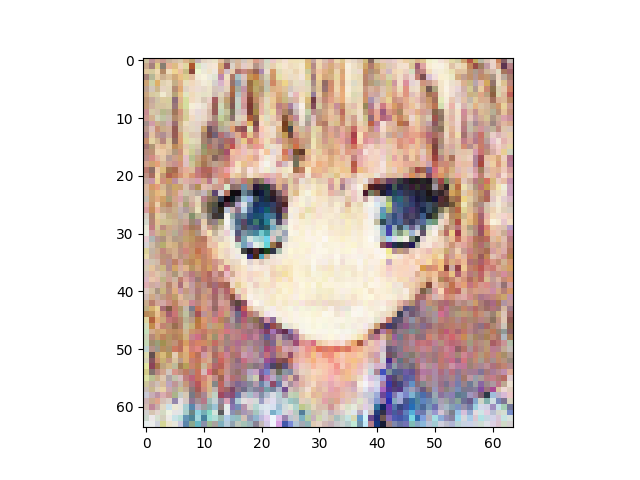

### Convolutional VAE with BCE loss as PBP loss + ResNet discriminator
A VAE with convolutional layers used in encoder and decoder networks, 512 latent variables, 32 base channels, and BCE as PBP loss is trained against a discriminator that is a ResNet on the first 80% of the dataset for 200 epochs. A multiplier of 10 is applied to the discriminator loss (as learnable loss) during the updating process of the VAE. The results are stored in `./results/images/ConvVAE_ResNet_on_anime/512_32_200_10_seeded/`

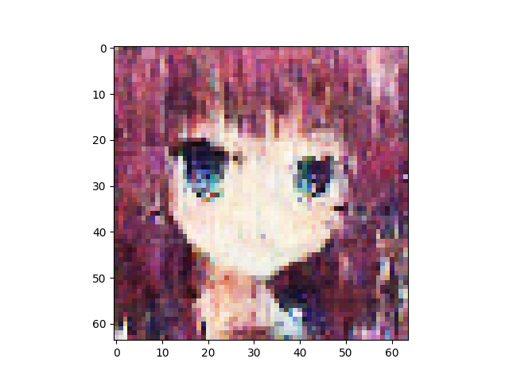

## Optimizing the VAE Discriminator training scheme: disc loss weight
Some details regarding the GAN training scheme can be tweaked to achieve higher performance. In this section we experiments with varying disc loss weight (a constant that is multiplied to the discriminator loss when updating the VAE in the generator cycle in GAN). All VAEs below are convolutional VAE with 512 latent variables, 32 base channels, and BCE as PBP loss. All discriminator below are ResNet. Training data is first 80% of the anime faces after anime faces are shuffled with `mxnet.random.seed(0)`. For convenience we display the reference test images below:

### Discriminator loss weight = 1, PBP weight = 1

### Discriminator loss weight = 10, PBP weight = 1 (Baseline)
This is the same as trained in the **Convolutional VAE with BCE loss as PBP loss + ResNet discriminator**

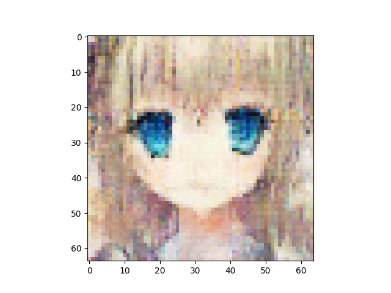

### Discriminator loss weight = 20, PBP weight = 1

### Discriminator loss weight = 50, PBP weight = 1

## Optimizing the VAE Discriminator training scheme: pixel-by-pixel loss weight
Some details regarding the GAN training scheme can be tweaked to achieve higher performance. In this section we experiments with varying pixel-by-pixel loss weight (a constant that is multiplied to the pixel-by-pixel loss in the VAE). All VAEs below are convolutional VAE with 512 latent variables, 32 base channels, and BCE as PBP loss. All discriminator below are ResNet. Training data is first 80% of the anime faces after anime faces are shuffled with `mxnet.random.seed(0)`. For convenience we display the reference test images below:

### Discriminator loss weight = 10, PBP weight = 1 (Baseline)
This is the same as trained in the **Convolutional VAE with BCE loss as PBP loss + ResNet discriminator**

### Discriminator loss weight = 10, PBP weight = 0.8

### Discriminator loss weight = 10, PBP weight = 0.5

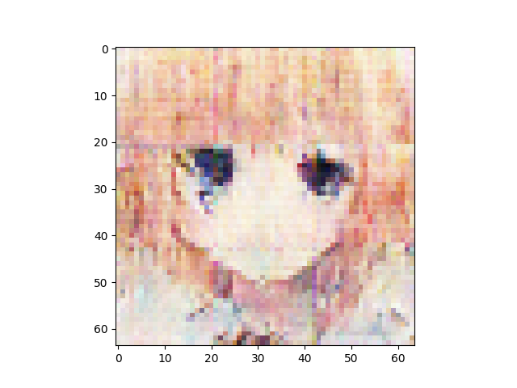

## Optimizing the VAE Discriminator training scheme: mixing VAE solo training with VAE+Disc combo training
It is possible that time and computing resources be saved by letting the VAE train by itself without the input from a discriminator for a few epochs before the discriminator kicks in. All VAEs below are convolutional VAE with 512 latent variables, 32 base channels, and BCE as PBP loss. All discriminator below are ResNet. Training data is first 80% of the anime faces after anime faces are shuffled with `mxnet.random.seed(0)`. Pixel-by-pixel loss weight and discriminator loss weight are fixed to 1 and 10 respectively. For convenience we display the reference images below

### Baseline: 200 GAN epochs
This is the same as trained in the **Convolutional VAE with BCE loss as PBP loss + ResNet discriminator**

### 50 VAE solo epochs + 150 GAN epochs

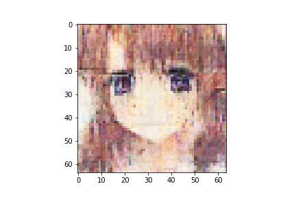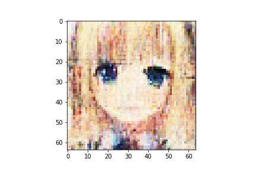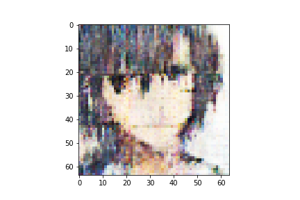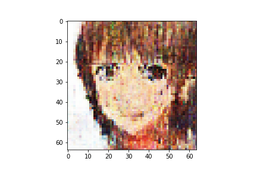

### 100 VAE solo epochs + 100 GAN epochs
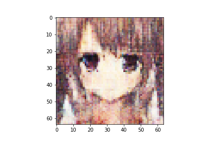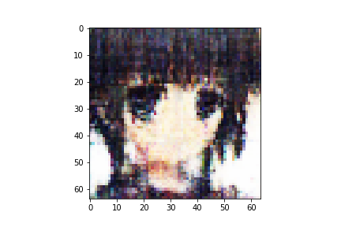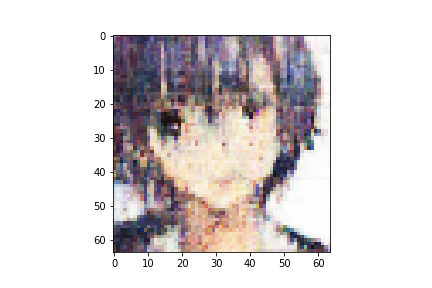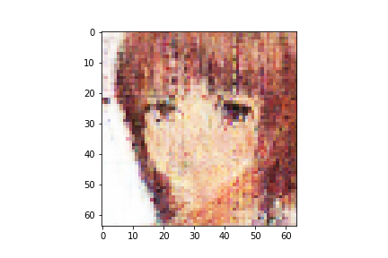

### 150 VAE solo epochs + 50 GAN epochs
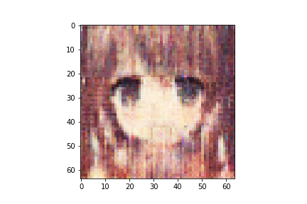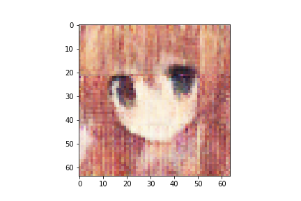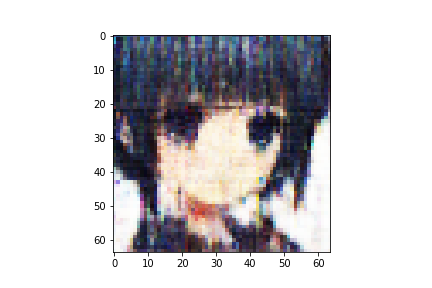

