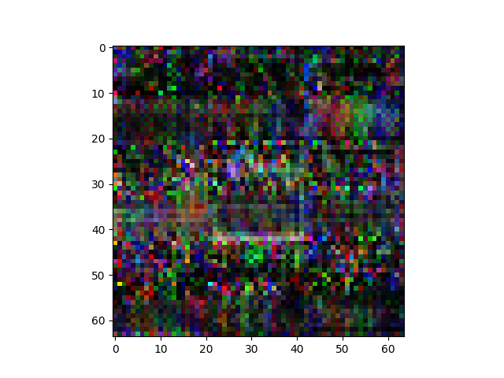
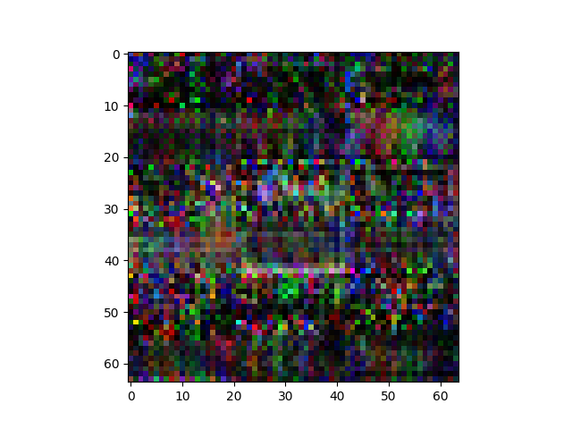

n_latent:512 

n_base_channels:32 

n_epochs:200 

Epoch0, ConvDecoder Training loss 7.52541, ResNet Training loss 0.2413215637, Time used 19.80

Epoch1, ConvDecoder Training loss 9.06225, ResNet Training loss 0.1567285806, Time used 18.11

Epoch2, ConvDecoder Training loss 6.62221, ResNet Training loss 0.2327678800, Time used 16.79

Epoch3, ConvDecoder Training loss 9.13385, ResNet Training loss 0.0724287704, Time used 17.49

Epoch4, ConvDecoder Training loss 6.76416, ResNet Training loss 0.0908472687, Time used 17.76

Epoch5, ConvDecoder Training loss 6.86023, ResNet Training loss 0.0817356557, Time used 17.51

Epoch6, ConvDecoder Training loss 7.46462, ResNet Training loss 0.0256676730, Time used 16.88

Epoch7, ConvDecoder Training loss 7.90569, ResNet Training loss 0.0392923020, Time used 18.54

Epoch8, ConvDecoder Training loss 7.29472, ResNet Training loss 0.0310737677, Time used 18.27

Epoch9, ConvDecoder Training loss 7.66238, ResNet Training loss 0.0014089595, Time used 17.42

Epoch10, ConvDecoder Training loss 7.95206, ResNet Training loss 0.0008504129, Time used 17.91

Epoch11, ConvDecoder Training loss 8.91166, ResNet Training loss 0.0008859191, Time used 17.33

Epoch12, ConvDecoder Training loss 9.34482, ResNet Training loss 0.0003127107, Time used 18.05

Epoch13, ConvDecoder Training loss 9.94823, ResNet Training loss 0.0001618179, Time used 17.32

Epoch14, ConvDecoder Training loss 10.09982, ResNet Training loss 0.0001081307, Time used 17.33

Epoch15, ConvDecoder Training loss 10.02305, ResNet Training loss 0.0000967752, Time used 17.68

Epoch16, ConvDecoder Training loss 9.79301, ResNet Training loss 0.0000899546, Time used 17.12

Epoch17, ConvDecoder Training loss 10.72697, ResNet Training loss 0.0003678083, Time used 17.74

Epoch18, ConvDecoder Training loss 9.10543, ResNet Training loss 0.0444023013, Time used 16.61

Epoch19, ConvDecoder Training loss 9.50001, ResNet Training loss 0.0398261026, Time used 17.43

Epoch20, ConvDecoder Training loss 8.77288, ResNet Training loss 0.0027290939, Time used 17.18

Epoch21, ConvDecoder Training loss 9.19806, ResNet Training loss 0.0002326759, Time used 16.59

Epoch22, ConvDecoder Training loss 9.18531, ResNet Training loss 0.0123018827, Time used 18.50

Epoch23, ConvDecoder Training loss 9.02062, ResNet Training loss 0.0002163735, Time used 16.51

Epoch24, ConvDecoder Training loss 9.55000, ResNet Training loss 0.0269519277, Time used 16.78

Epoch25, ConvDecoder Training loss 7.71420, ResNet Training loss 0.0552386828, Time used 17.84

Epoch26, ConvDecoder Training loss 8.82728, ResNet Training loss 0.0004383758, Time used 16.68

Epoch27, ConvDecoder Training loss 9.02434, ResNet Training loss 0.0002886448, Time used 17.23

Epoch28, ConvDecoder Training loss 10.03957, ResNet Training loss 0.0228439812, Time used 17.64

Epoch29, ConvDecoder Training loss 9.77001, ResNet Training loss 0.0002943152, Time used 16.59

Epoch30, ConvDecoder Training loss 9.71195, ResNet Training loss 0.0351030305, Time used 17.89

Epoch31, ConvDecoder Training loss 10.48397, ResNet Training loss 0.0002677963, Time used 16.47

Epoch32, ConvDecoder Training loss 10.85930, ResNet Training loss 0.0001250667, Time used 16.63

Epoch33, ConvDecoder Training loss 11.31828, ResNet Training loss 0.0000770871, Time used 18.79

Epoch34, ConvDecoder Training loss 11.53648, ResNet Training loss 0.0000499681, Time used 16.86

Epoch35, ConvDecoder Training loss 11.61546, ResNet Training loss 0.0000347954, Time used 16.47

Epoch36, ConvDecoder Training loss 11.74314, ResNet Training loss 0.0000276866, Time used 16.59

Epoch37, ConvDecoder Training loss 11.33551, ResNet Training loss 0.0000324875, Time used 16.86

Epoch38, ConvDecoder Training loss 11.41192, ResNet Training loss 0.0000235025, Time used 17.17

Epoch39, ConvDecoder Training loss 11.92098, ResNet Training loss 0.0000150870, Time used 17.56

Epoch40, ConvDecoder Training loss 12.21625, ResNet Training loss 0.0000116106, Time used 17.80

Epoch41, ConvDecoder Training loss 12.41227, ResNet Training loss 0.0000096993, Time used 16.91

Epoch42, ConvDecoder Training loss 12.47057, ResNet Training loss 0.0000081921, Time used 17.15

Epoch43, ConvDecoder Training loss 12.70302, ResNet Training loss 0.0000065301, Time used 16.86

Epoch44, ConvDecoder Training loss 12.91496, ResNet Training loss 0.0000052053, Time used 17.33

Epoch45, ConvDecoder Training loss 13.30289, ResNet Training loss 0.0000180303, Time used 16.62

Epoch46, ConvDecoder Training loss 13.06400, ResNet Training loss 0.0000099460, Time used 17.47

Epoch47, ConvDecoder Training loss 13.35111, ResNet Training loss 0.0000039893, Time used 17.61

Epoch48, ConvDecoder Training loss 13.40429, ResNet Training loss 0.0000031078, Time used 17.19

Epoch49, ConvDecoder Training loss 13.53551, ResNet Training loss 0.0000025313, Time used 17.63

Epoch50, ConvDecoder Training loss 13.67984, ResNet Training loss 0.0000020612, Time used 16.58

Epoch51, ConvDecoder Training loss 13.81420, ResNet Training loss 0.0000016950, Time used 16.93

Epoch52, ConvDecoder Training loss 13.94696, ResNet Training loss 0.0000014551, Time used 16.65

Epoch53, ConvDecoder Training loss 14.07953, ResNet Training loss 0.0000012384, Time used 17.17

Epoch54, ConvDecoder Training loss 14.20973, ResNet Training loss 0.0000010578, Time used 16.64

Epoch55, ConvDecoder Training loss 14.35232, ResNet Training loss 0.0000009536, Time used 16.46

Epoch56, ConvDecoder Training loss 14.34951, ResNet Training loss 0.0000008940, Time used 17.48

Epoch57, ConvDecoder Training loss 13.95887, ResNet Training loss 0.0000017984, Time used 16.57

Epoch58, ConvDecoder Training loss 14.12701, ResNet Training loss 0.0000016571, Time used 16.95

Epoch59, ConvDecoder Training loss 13.35133, ResNet Training loss 0.0001232365, Time used 16.62

Epoch60, ConvDecoder Training loss 16.99683, ResNet Training loss 0.0001364168, Time used 17.33

Epoch61, ConvDecoder Training loss 17.10279, ResNet Training loss 0.0000004477, Time used 17.94

Epoch62, ConvDecoder Training loss 17.18543, ResNet Training loss 0.0000003062, Time used 17.97

Epoch63, ConvDecoder Training loss 17.39139, ResNet Training loss 0.0000002277, Time used 17.51

Epoch64, ConvDecoder Training loss 17.55265, ResNet Training loss 0.0000001747, Time used 16.55

Epoch65, ConvDecoder Training loss 17.83889, ResNet Training loss 0.0000002434, Time used 17.66

Epoch66, ConvDecoder Training loss 17.72075, ResNet Training loss 0.0000002338, Time used 16.89

Epoch67, ConvDecoder Training loss 18.35636, ResNet Training loss 0.0000001358, Time used 16.81

Epoch68, ConvDecoder Training loss 17.68877, ResNet Training loss 0.0000001629, Time used 17.37

Epoch69, ConvDecoder Training loss 17.75039, ResNet Training loss 0.0000001418, Time used 17.32

Epoch70, ConvDecoder Training loss 18.09883, ResNet Training loss 0.0000000937, Time used 17.38

Epoch71, ConvDecoder Training loss 18.13875, ResNet Training loss 0.0000000764, Time used 16.81

Epoch72, ConvDecoder Training loss 18.27079, ResNet Training loss 0.0000000646, Time used 17.12

Epoch73, ConvDecoder Training loss 18.43005, ResNet Training loss 0.0000000523, Time used 17.53

Epoch74, ConvDecoder Training loss 18.81450, ResNet Training loss 0.0000000379, Time used 16.48

Epoch75, ConvDecoder Training loss 18.57418, ResNet Training loss 0.0000000376, Time used 16.60

Epoch76, ConvDecoder Training loss 18.92163, ResNet Training loss 0.0000000298, Time used 17.88

Epoch77, ConvDecoder Training loss 18.84205, ResNet Training loss 0.0000000288, Time used 17.12

Epoch78, ConvDecoder Training loss 18.91038, ResNet Training loss 0.0000000267, Time used 17.58

Epoch79, ConvDecoder Training loss 19.18782, ResNet Training loss 0.0000000215, Time used 18.40

Epoch80, ConvDecoder Training loss 19.23108, ResNet Training loss 0.0000000188, Time used 17.04

Epoch81, ConvDecoder Training loss 19.20780, ResNet Training loss 0.0000000179, Time used 16.51

Epoch82, ConvDecoder Training loss 19.33132, ResNet Training loss 0.0000000159, Time used 17.93

Epoch83, ConvDecoder Training loss 19.68036, ResNet Training loss 0.0000000121, Time used 17.83

Epoch84, ConvDecoder Training loss 19.50052, ResNet Training loss 0.0000000121, Time used 16.92

Epoch85, ConvDecoder Training loss 19.89153, ResNet Training loss 0.0000000095, Time used 17.65

Epoch86, ConvDecoder Training loss 19.63921, ResNet Training loss 0.0000000102, Time used 17.70

Epoch87, ConvDecoder Training loss 19.67640, ResNet Training loss 0.0000000099, Time used 16.71

Epoch88, ConvDecoder Training loss 19.81840, ResNet Training loss 0.0000000091, Time used 17.63

Epoch89, ConvDecoder Training loss 19.80549, ResNet Training loss 0.0000000088, Time used 18.01

Epoch90, ConvDecoder Training loss 20.96367, ResNet Training loss 0.0015963926, Time used 18.43

Epoch91, ConvDecoder Training loss 17.60845, ResNet Training loss 0.0237894226, Time used 16.83

Epoch92, ConvDecoder Training loss 26.56706, ResNet Training loss 0.0264614783, Time used 17.24

Epoch93, ConvDecoder Training loss 14.86109, ResNet Training loss 0.0000145303, Time used 17.22

Epoch94, ConvDecoder Training loss 15.73170, ResNet Training loss 0.0000154706, Time used 17.02

Epoch95, ConvDecoder Training loss 29.38842, ResNet Training loss 0.0633101240, Time used 16.55

Epoch96, ConvDecoder Training loss 17.59236, ResNet Training loss 0.0008392960, Time used 17.18

Epoch97, ConvDecoder Training loss 22.67802, ResNet Training loss 0.0000082840, Time used 17.18

Epoch98, ConvDecoder Training loss 17.30805, ResNet Training loss 0.0000056196, Time used 17.01

Epoch99, ConvDecoder Training loss 17.46844, ResNet Training loss 0.0000155089, Time used 18.00

Epoch100, ConvDecoder Training loss 17.22808, ResNet Training loss 0.0000015481, Time used 16.78

Epoch101, ConvDecoder Training loss 18.07735, ResNet Training loss 0.0000008838, Time used 16.85

Epoch102, ConvDecoder Training loss 18.20025, ResNet Training loss 0.0000008669, Time used 16.55

Epoch103, ConvDecoder Training loss 18.92976, ResNet Training loss 0.0001101961, Time used 17.38

Epoch104, ConvDecoder Training loss 18.72504, ResNet Training loss 0.0005127816, Time used 16.76

Epoch105, ConvDecoder Training loss 16.54736, ResNet Training loss 0.0280664787, Time used 16.78

Epoch106, ConvDecoder Training loss 18.94911, ResNet Training loss 0.3207832277, Time used 16.67

Epoch107, ConvDecoder Training loss 10.86922, ResNet Training loss 0.0014545326, Time used 17.43

Epoch108, ConvDecoder Training loss 17.25554, ResNet Training loss 0.0685400367, Time used 17.09

Epoch109, ConvDecoder Training loss 12.65573, ResNet Training loss 0.0000112254, Time used 17.36

Epoch110, ConvDecoder Training loss 14.55240, ResNet Training loss 0.0000034995, Time used 17.37

Epoch111, ConvDecoder Training loss 14.16187, ResNet Training loss 0.0000036539, Time used 17.55

Epoch112, ConvDecoder Training loss 15.08632, ResNet Training loss 0.0000014818, Time used 18.00

Epoch113, ConvDecoder Training loss 12.11197, ResNet Training loss 0.0001644979, Time used 16.67

Epoch114, ConvDecoder Training loss 11.62949, ResNet Training loss 0.0000907766, Time used 16.94

Epoch115, ConvDecoder Training loss 12.73412, ResNet Training loss 0.0000131667, Time used 17.45

Epoch116, ConvDecoder Training loss 13.37479, ResNet Training loss 0.0000086580, Time used 17.44

Epoch117, ConvDecoder Training loss 13.87096, ResNet Training loss 0.0000047689, Time used 17.03

Epoch118, ConvDecoder Training loss 14.64153, ResNet Training loss 0.0000018538, Time used 17.50

Epoch119, ConvDecoder Training loss 14.98141, ResNet Training loss 0.0000011938, Time used 16.88

Epoch120, ConvDecoder Training loss 15.24006, ResNet Training loss 0.0000007841, Time used 17.09

Epoch121, ConvDecoder Training loss 15.23377, ResNet Training loss 0.0000007826, Time used 17.02

Epoch122, ConvDecoder Training loss 15.39996, ResNet Training loss 0.0000009541, Time used 17.14

Epoch123, ConvDecoder Training loss 12.16050, ResNet Training loss 0.1897375435, Time used 17.54

Epoch124, ConvDecoder Training loss 10.23072, ResNet Training loss 0.3370002210, Time used 17.78

Epoch125, ConvDecoder Training loss 8.58922, ResNet Training loss 0.0269049555, Time used 18.37

Epoch126, ConvDecoder Training loss 10.44125, ResNet Training loss 0.0016941607, Time used 17.30

Epoch127, ConvDecoder Training loss 10.07660, ResNet Training loss 0.0001666611, Time used 17.07

Epoch128, ConvDecoder Training loss 10.47715, ResNet Training loss 0.0000548327, Time used 16.79

Epoch129, ConvDecoder Training loss 9.21966, ResNet Training loss 0.0003591014, Time used 17.10

Epoch130, ConvDecoder Training loss 10.28627, ResNet Training loss 0.0001043989, Time used 17.17

Epoch131, ConvDecoder Training loss 10.21898, ResNet Training loss 0.0001084989, Time used 16.64

Epoch132, ConvDecoder Training loss 11.17903, ResNet Training loss 0.0003501639, Time used 16.62

Epoch133, ConvDecoder Training loss 10.13986, ResNet Training loss 0.0001705686, Time used 16.64

Epoch134, ConvDecoder Training loss 11.16265, ResNet Training loss 0.0001044508, Time used 17.31

Epoch135, ConvDecoder Training loss 11.94195, ResNet Training loss 0.3562725186, Time used 18.30

Epoch136, ConvDecoder Training loss 9.20415, ResNet Training loss 0.0333772935, Time used 16.76

Epoch137, ConvDecoder Training loss 12.07787, ResNet Training loss 0.0149376336, Time used 17.20

Epoch138, ConvDecoder Training loss 20.82821, ResNet Training loss 0.1930229962, Time used 17.26

Epoch139, ConvDecoder Training loss 10.18982, ResNet Training loss 0.0001463118, Time used 18.72

Epoch140, ConvDecoder Training loss 10.82138, ResNet Training loss 0.0000396674, Time used 17.76

Epoch141, ConvDecoder Training loss 9.81903, ResNet Training loss 0.1871338934, Time used 17.66

Epoch142, ConvDecoder Training loss 6.46517, ResNet Training loss 0.2899048924, Time used 17.14

Epoch143, ConvDecoder Training loss 7.37076, ResNet Training loss 0.1906107217, Time used 16.55

Epoch144, ConvDecoder Training loss 7.58585, ResNet Training loss 0.1620837450, Time used 16.49

Epoch145, ConvDecoder Training loss 6.98088, ResNet Training loss 0.1978282481, Time used 16.67

Epoch146, ConvDecoder Training loss 9.28072, ResNet Training loss 0.3924606740, Time used 18.26

Epoch147, ConvDecoder Training loss 8.01395, ResNet Training loss 0.1288692504, Time used 16.80

Epoch148, ConvDecoder Training loss 7.14441, ResNet Training loss 0.0174708422, Time used 17.59

Epoch149, ConvDecoder Training loss 8.12888, ResNet Training loss 0.1190004423, Time used 17.57

Epoch150, ConvDecoder Training loss 9.43936, ResNet Training loss 0.1702325642, Time used 16.84

Epoch151, ConvDecoder Training loss 7.44764, ResNet Training loss 0.2279851288, Time used 16.81

Epoch152, ConvDecoder Training loss 6.93597, ResNet Training loss 0.3492943645, Time used 16.52

Epoch153, ConvDecoder Training loss 7.18085, ResNet Training loss 0.2100421041, Time used 17.16

Epoch154, ConvDecoder Training loss 5.51107, ResNet Training loss 0.1671335101, Time used 17.14

Epoch155, ConvDecoder Training loss 5.96158, ResNet Training loss 0.3207545877, Time used 18.26

Epoch156, ConvDecoder Training loss 5.24769, ResNet Training loss 0.1977272928, Time used 17.78

Epoch157, ConvDecoder Training loss 5.46803, ResNet Training loss 0.3469562531, Time used 17.74

Epoch158, ConvDecoder Training loss 5.57162, ResNet Training loss 0.3221644759, Time used 18.44

Epoch159, ConvDecoder Training loss 7.13218, ResNet Training loss 0.0319890119, Time used 16.74

Epoch160, ConvDecoder Training loss 7.08361, ResNet Training loss 0.0250345636, Time used 16.52

Epoch161, ConvDecoder Training loss 6.89917, ResNet Training loss 0.0012659177, Time used 16.64

Epoch162, ConvDecoder Training loss 6.21132, ResNet Training loss 0.3047893047, Time used 16.74

Epoch163, ConvDecoder Training loss 6.49238, ResNet Training loss 0.2111685276, Time used 16.52

Epoch164, ConvDecoder Training loss 6.07193, ResNet Training loss 0.0985108241, Time used 17.75

Epoch165, ConvDecoder Training loss 7.14179, ResNet Training loss 0.0029711693, Time used 16.95

Epoch166, ConvDecoder Training loss 9.10483, ResNet Training loss 0.0003333831, Time used 16.58

Epoch167, ConvDecoder Training loss 11.41205, ResNet Training loss 0.0590627715, Time used 16.78

Epoch168, ConvDecoder Training loss 11.38731, ResNet Training loss 0.0504427738, Time used 16.46

Epoch169, ConvDecoder Training loss 8.28108, ResNet Training loss 0.0005655590, Time used 17.23

Epoch170, ConvDecoder Training loss 8.57179, ResNet Training loss 0.0004066798, Time used 16.47

Epoch171, ConvDecoder Training loss 8.71869, ResNet Training loss 0.0003606361, Time used 16.54

Epoch172, ConvDecoder Training loss 9.27741, ResNet Training loss 0.0006709194, Time used 17.17

Epoch173, ConvDecoder Training loss 12.62457, ResNet Training loss 0.0000473439, Time used 16.92

Epoch174, ConvDecoder Training loss 15.33034, ResNet Training loss 0.0000019699, Time used 16.63

Epoch175, ConvDecoder Training loss 15.57401, ResNet Training loss 0.0000012889, Time used 16.47

Epoch176, ConvDecoder Training loss 15.89830, ResNet Training loss 0.0000011062, Time used 18.40

Epoch177, ConvDecoder Training loss 16.19759, ResNet Training loss 0.0000008218, Time used 17.16

Epoch178, ConvDecoder Training loss 15.88804, ResNet Training loss 0.0000012038, Time used 17.15

Epoch179, ConvDecoder Training loss 12.28621, ResNet Training loss 0.0097422181, Time used 16.84

Epoch180, ConvDecoder Training loss 10.92958, ResNet Training loss 0.0000341830, Time used 17.77

Epoch181, ConvDecoder Training loss 12.90727, ResNet Training loss 0.0000095765, Time used 17.81

Epoch182, ConvDecoder Training loss 15.31216, ResNet Training loss 0.0000558074, Time used 17.43

Epoch183, ConvDecoder Training loss 14.95047, ResNet Training loss 0.0000086543, Time used 16.91

Epoch184, ConvDecoder Training loss 14.52608, ResNet Training loss 0.0000035170, Time used 17.72

Epoch185, ConvDecoder Training loss 12.60949, ResNet Training loss 0.0000230673, Time used 17.14

Epoch186, ConvDecoder Training loss 12.69361, ResNet Training loss 0.0000073183, Time used 16.95

Epoch187, ConvDecoder Training loss 13.31976, ResNet Training loss 0.0000034523, Time used 16.95

Epoch188, ConvDecoder Training loss 14.03866, ResNet Training loss 0.0000020658, Time used 16.66

Epoch189, ConvDecoder Training loss 14.44126, ResNet Training loss 0.0000013496, Time used 16.81

Epoch190, ConvDecoder Training loss 14.38985, ResNet Training loss 0.0000033430, Time used 17.20

Epoch191, ConvDecoder Training loss 15.03685, ResNet Training loss 0.0000010934, Time used 16.88

Epoch192, ConvDecoder Training loss 14.74205, ResNet Training loss 0.0000011121, Time used 16.45

Epoch193, ConvDecoder Training loss 14.58184, ResNet Training loss 0.0000018076, Time used 16.54

Epoch194, ConvDecoder Training loss 14.69569, ResNet Training loss 0.0010500210, Time used 16.67

Epoch195, ConvDecoder Training loss 21.30566, ResNet Training loss 0.0001649872, Time used 17.46

Epoch196, ConvDecoder Training loss 13.77867, ResNet Training loss 0.0000015580, Time used 17.12

Epoch197, ConvDecoder Training loss 14.02143, ResNet Training loss 0.0000011878, Time used 17.56

Epoch198, ConvDecoder Training loss 14.08034, ResNet Training loss 0.0000009812, Time used 17.25

Epoch199, ConvDecoder Training loss 14.58305, ResNet Training loss 0.0000252522, Time used 17.38

