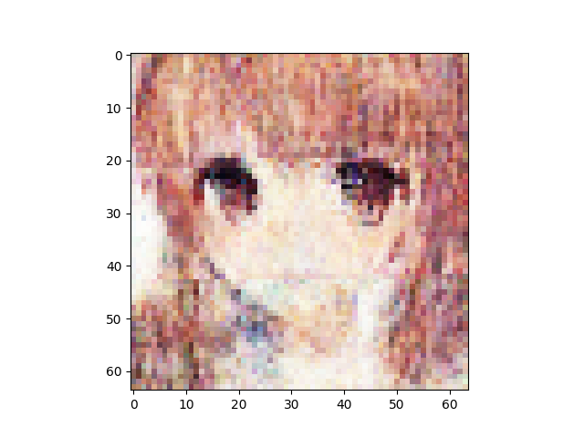
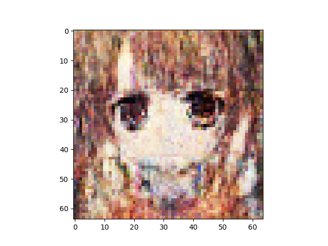
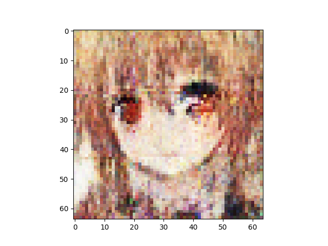
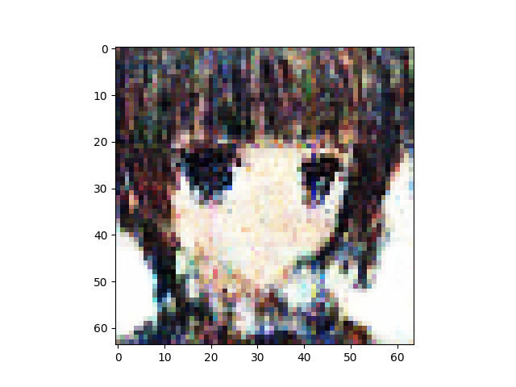
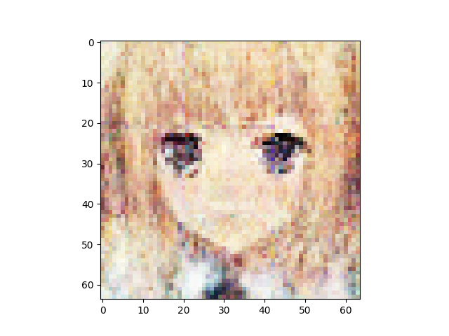
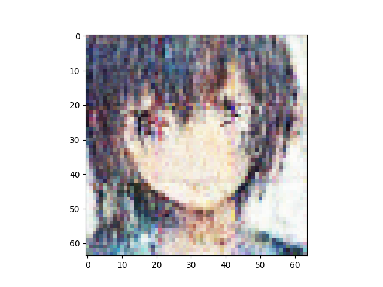
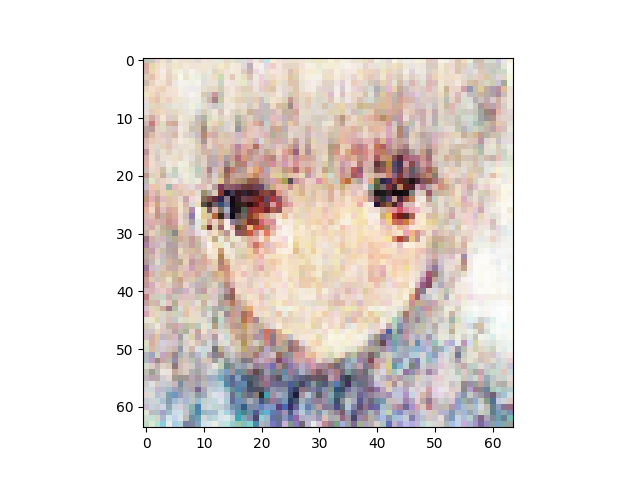
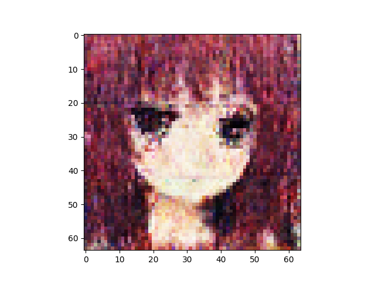
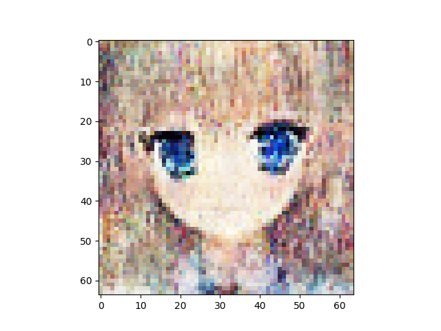
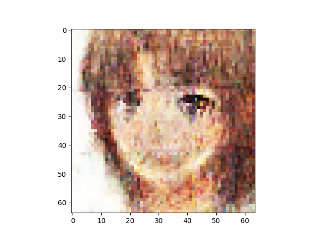

n_latent:1024 

n_base_channels:32 

pixel-by-pixel loss weight:1 

n_solo_epochs:100 

n_combo_epochs:100 

max_disc_loss :999 

Epoch0, Training loss 7538.9150390625, Time used 19.13

Epoch1, Training loss 6988.9555664062, Time used 15.66

Epoch2, Training loss 6875.7094726562, Time used 15.58

Epoch3, Training loss 6808.1401367188, Time used 15.66

Epoch4, Training loss 6766.1064453125, Time used 15.82

Epoch5, Training loss 6737.9516601562, Time used 15.87

Epoch6, Training loss 6716.7905273438, Time used 15.87

Epoch7, Training loss 6701.0136718750, Time used 15.88

Epoch8, Training loss 6688.9384765625, Time used 15.81

Epoch9, Training loss 6680.9062500000, Time used 15.76

Epoch10, Training loss 6671.0556640625, Time used 15.83

Epoch11, Training loss 6665.2436523438, Time used 15.82

Epoch12, Training loss 6658.0795898438, Time used 15.87

Epoch13, Training loss 6653.8671875000, Time used 16.03

Epoch14, Training loss 6648.3798828125, Time used 15.97

Epoch15, Training loss 6643.0185546875, Time used 15.99

Epoch16, Training loss 6640.1352539062, Time used 15.99

Epoch17, Training loss 6636.1289062500, Time used 15.93

Epoch18, Training loss 6633.4360351562, Time used 15.90

Epoch19, Training loss 6630.7900390625, Time used 15.82

Epoch20, Training loss 6627.1992187500, Time used 15.79

Epoch21, Training loss 6624.1591796875, Time used 15.59

Epoch22, Training loss 6622.1459960938, Time used 15.63

Epoch23, Training loss 6618.9028320312, Time used 15.53

Epoch24, Training loss 6617.5776367188, Time used 15.57

Epoch25, Training loss 6613.4750976562, Time used 15.60

Epoch26, Training loss 6612.0874023438, Time used 15.60

Epoch27, Training loss 6609.9482421875, Time used 15.55

Epoch28, Training loss 6608.1303710938, Time used 15.56

Epoch29, Training loss 6605.3652343750, Time used 15.57

Epoch30, Training loss 6604.4267578125, Time used 15.67

Epoch31, Training loss 6603.0458984375, Time used 15.60

Epoch32, Training loss 6601.8378906250, Time used 15.62

Epoch33, Training loss 6598.0805664062, Time used 15.63

Epoch34, Training loss 6598.2114257812, Time used 15.62

Epoch35, Training loss 6596.4824218750, Time used 15.62

Epoch36, Training loss 6594.1650390625, Time used 15.54

Epoch37, Training loss 6593.0224609375, Time used 15.61

Epoch38, Training loss 6589.9409179688, Time used 15.63

Epoch39, Training loss 6590.0991210938, Time used 15.57

Epoch40, Training loss 6588.5185546875, Time used 15.54

Epoch41, Training loss 6586.7441406250, Time used 15.62

Epoch42, Training loss 6585.0566406250, Time used 15.80

Epoch43, Training loss 6585.2509765625, Time used 15.83

Epoch44, Training loss 6584.3613281250, Time used 15.80

Epoch45, Training loss 6581.6474609375, Time used 15.79

Epoch46, Training loss 6581.0961914062, Time used 15.89

Epoch47, Training loss 6579.2685546875, Time used 15.90

Epoch48, Training loss 6577.3886718750, Time used 15.94

Epoch49, Training loss 6579.0732421875, Time used 15.95

Epoch50, Training loss 6576.0288085938, Time used 15.94

Epoch51, Training loss 6575.9824218750, Time used 15.91

Epoch52, Training loss 6575.5361328125, Time used 15.92

Epoch53, Training loss 6573.8637695312, Time used 15.92

Epoch54, Training loss 6572.1650390625, Time used 15.80

Epoch55, Training loss 6571.3500976562, Time used 15.94

Epoch56, Training loss 6570.6953125000, Time used 15.94

Epoch57, Training loss 6570.5454101562, Time used 15.66

Epoch58, Training loss 6570.1860351562, Time used 15.63

Epoch59, Training loss 6568.2470703125, Time used 15.60

Epoch60, Training loss 6568.2377929688, Time used 15.47

Epoch61, Training loss 6565.2763671875, Time used 15.57

Epoch62, Training loss 6565.4970703125, Time used 15.56

Epoch63, Training loss 6563.9902343750, Time used 15.61

Epoch64, Training loss 6566.0019531250, Time used 15.53

Epoch65, Training loss 6563.2309570312, Time used 15.54

Epoch66, Training loss 6564.6333007812, Time used 15.52

Epoch67, Training loss 6561.1684570312, Time used 15.55

Epoch68, Training loss 6560.5766601562, Time used 15.57

Epoch69, Training loss 6560.9536132812, Time used 15.52

Epoch70, Training loss 6560.4892578125, Time used 15.61

Epoch71, Training loss 6559.2753906250, Time used 15.60

Epoch72, Training loss 6558.0493164062, Time used 15.60

Epoch73, Training loss 6559.3447265625, Time used 15.60

Epoch74, Training loss 6557.5156250000, Time used 15.58

Epoch75, Training loss 6555.8535156250, Time used 15.60

Epoch76, Training loss 6555.3369140625, Time used 15.54

Epoch77, Training loss 6554.8354492188, Time used 15.61

Epoch78, Training loss 6554.3779296875, Time used 15.63

Epoch79, Training loss 6552.9462890625, Time used 15.67

Epoch80, Training loss 6553.4335937500, Time used 15.82

Epoch81, Training loss 6553.9877929688, Time used 15.97

Epoch82, Training loss 6553.8803710938, Time used 15.91

Epoch83, Training loss 6552.4609375000, Time used 15.80

Epoch84, Training loss 6551.6308593750, Time used 15.77

Epoch85, Training loss 6550.9321289062, Time used 15.95

Epoch86, Training loss 6550.5058593750, Time used 15.96

Epoch87, Training loss 6549.7099609375, Time used 15.95

Epoch88, Training loss 6548.7822265625, Time used 15.95

Epoch89, Training loss 6548.6562500000, Time used 15.93

Epoch90, Training loss 6548.6748046875, Time used 15.84

Epoch91, Training loss 6547.6875000000, Time used 15.89

Epoch92, Training loss 6546.9560546875, Time used 15.89

Epoch93, Training loss 6547.2509765625, Time used 15.76

Epoch94, Training loss 6545.5961914062, Time used 15.87

Epoch95, Training loss 6544.5732421875, Time used 15.80

Epoch96, Training loss 6544.1142578125, Time used 15.74

Epoch97, Training loss 6546.1796875000, Time used 15.59

Epoch98, Training loss 6544.2724609375, Time used 15.56

Epoch99, Training loss 6543.7729492188, Time used 15.54

Epoch100, VAE Training loss 6613.33936, ResNet Training loss 0.2428237051, Time used 33.44

Epoch101, VAE Training loss 6705.52051, ResNet Training loss 0.0771390945, Time used 33.38

Epoch102, VAE Training loss 6758.40576, ResNet Training loss 0.0756386071, Time used 33.34

Epoch103, VAE Training loss 6785.18115, ResNet Training loss 0.0775945857, Time used 33.35

Epoch104, VAE Training loss 6799.35938, ResNet Training loss 0.1132188812, Time used 33.24

Epoch105, VAE Training loss 6821.57520, ResNet Training loss 0.0794434473, Time used 33.24

Epoch106, VAE Training loss 6838.73682, ResNet Training loss 0.1005601510, Time used 33.29

Epoch107, VAE Training loss 6822.88818, ResNet Training loss 0.1328770071, Time used 33.29

Epoch108, VAE Training loss 6848.99805, ResNet Training loss 0.1105497032, Time used 33.42

Epoch109, VAE Training loss 6846.72852, ResNet Training loss 0.1150632054, Time used 33.90

Epoch110, VAE Training loss 6865.70068, ResNet Training loss 0.1151183397, Time used 33.98

Epoch111, VAE Training loss 6879.36133, ResNet Training loss 0.1019215882, Time used 34.07

Epoch112, VAE Training loss 6878.76514, ResNet Training loss 0.1834816039, Time used 33.96

Epoch113, VAE Training loss 6862.31494, ResNet Training loss 0.1036898717, Time used 33.93

Epoch114, VAE Training loss 6884.07031, ResNet Training loss 0.1278972775, Time used 33.91

Epoch115, VAE Training loss 6894.47510, ResNet Training loss 0.1158367991, Time used 33.92

Epoch116, VAE Training loss 6902.37500, ResNet Training loss 0.1473427415, Time used 33.51

Epoch117, VAE Training loss 6901.37891, ResNet Training loss 0.1567499489, Time used 33.24

Epoch118, VAE Training loss 6903.26904, ResNet Training loss 0.1374828517, Time used 33.32

Epoch119, VAE Training loss 6902.75537, ResNet Training loss 0.1308415681, Time used 33.33

Epoch120, VAE Training loss 6909.38965, ResNet Training loss 0.1514287293, Time used 33.31

Epoch121, VAE Training loss 6916.02295, ResNet Training loss 0.1449745297, Time used 33.20

Epoch122, VAE Training loss 6910.96191, ResNet Training loss 0.1437812597, Time used 33.27

Epoch123, VAE Training loss 6921.21680, ResNet Training loss 0.1300209612, Time used 33.25

Epoch124, VAE Training loss 6924.68799, ResNet Training loss 0.1446337104, Time used 33.39

Epoch125, VAE Training loss 6919.17578, ResNet Training loss 0.1256585866, Time used 33.38

Epoch126, VAE Training loss 6932.08887, ResNet Training loss 0.1509015560, Time used 33.58

Epoch127, VAE Training loss 6924.01660, ResNet Training loss 0.1384461969, Time used 33.96

Epoch128, VAE Training loss 6929.42529, ResNet Training loss 0.1633617580, Time used 34.02

Epoch129, VAE Training loss 6936.03711, ResNet Training loss 0.1216122359, Time used 33.99

Epoch130, VAE Training loss 6941.79346, ResNet Training loss 0.1332051307, Time used 33.97

Epoch131, VAE Training loss 6922.76465, ResNet Training loss 0.1646735817, Time used 34.00

Epoch132, VAE Training loss 6948.80518, ResNet Training loss 0.1774354428, Time used 33.85

Epoch133, VAE Training loss 6928.00879, ResNet Training loss 0.1274362355, Time used 33.33

Epoch134, VAE Training loss 6940.41748, ResNet Training loss 0.1510652304, Time used 33.33

Epoch135, VAE Training loss 6932.32373, ResNet Training loss 0.1582673043, Time used 33.34

Epoch136, VAE Training loss 6930.38965, ResNet Training loss 0.1207287833, Time used 33.32

Epoch137, VAE Training loss 6945.39453, ResNet Training loss 0.1552790254, Time used 33.29

Epoch138, VAE Training loss 6947.53906, ResNet Training loss 0.1477082670, Time used 33.25

Epoch139, VAE Training loss 6934.93018, ResNet Training loss 0.1569447219, Time used 33.30

Epoch140, VAE Training loss 6947.52148, ResNet Training loss 0.1285049021, Time used 33.35

Epoch141, VAE Training loss 6949.17383, ResNet Training loss 0.1465637833, Time used 33.32

Epoch142, VAE Training loss 6943.23340, ResNet Training loss 0.1708123982, Time used 33.31

Epoch143, VAE Training loss 6936.90283, ResNet Training loss 0.1330161244, Time used 33.29

Epoch144, VAE Training loss 6941.48633, ResNet Training loss 0.1264691949, Time used 33.67

Epoch145, VAE Training loss 6945.70068, ResNet Training loss 0.1261489391, Time used 34.11

Epoch146, VAE Training loss 6944.58789, ResNet Training loss 0.1822692454, Time used 33.95

Epoch147, VAE Training loss 6941.33740, ResNet Training loss 0.1491855234, Time used 33.99

Epoch148, VAE Training loss 6940.66504, ResNet Training loss 0.1137764454, Time used 33.95

Epoch149, VAE Training loss 6957.77539, ResNet Training loss 0.1547956020, Time used 33.89

Epoch150, VAE Training loss 6950.27051, ResNet Training loss 0.1481046677, Time used 34.00

Epoch151, VAE Training loss 6950.16504, ResNet Training loss 0.1395181715, Time used 33.95

Epoch152, VAE Training loss 6948.09814, ResNet Training loss 0.1731124520, Time used 33.49

Epoch153, VAE Training loss 6947.18164, ResNet Training loss 0.1321739405, Time used 33.37

Epoch154, VAE Training loss 6959.74268, ResNet Training loss 0.1632239521, Time used 33.33

Epoch155, VAE Training loss 6950.08691, ResNet Training loss 0.1174252853, Time used 33.32

Epoch156, VAE Training loss 6959.51465, ResNet Training loss 0.1671413779, Time used 33.27

Epoch157, VAE Training loss 6954.41357, ResNet Training loss 0.1228870824, Time used 33.23

Epoch158, VAE Training loss 6963.69092, ResNet Training loss 0.1404632032, Time used 33.29

Epoch159, VAE Training loss 6957.02930, ResNet Training loss 0.1626704335, Time used 33.26

Epoch160, VAE Training loss 6959.70996, ResNet Training loss 0.1300238222, Time used 33.38

Epoch161, VAE Training loss 6955.04150, ResNet Training loss 0.1533824950, Time used 33.46

Epoch162, VAE Training loss 6954.42871, ResNet Training loss 0.1284306347, Time used 33.76

Epoch163, VAE Training loss 6953.61035, ResNet Training loss 0.1172898710, Time used 34.00

Epoch164, VAE Training loss 6962.87451, ResNet Training loss 0.1716989577, Time used 33.99

Epoch165, VAE Training loss 6954.86768, ResNet Training loss 0.1396177560, Time used 34.03

Epoch166, VAE Training loss 6951.76367, ResNet Training loss 0.1393234283, Time used 33.90

Epoch167, VAE Training loss 6958.04736, ResNet Training loss 0.1213580668, Time used 33.94

Epoch168, VAE Training loss 6957.08496, ResNet Training loss 0.1461056024, Time used 33.93

Epoch169, VAE Training loss 6953.50000, ResNet Training loss 0.1176618412, Time used 33.56

Epoch170, VAE Training loss 6960.64941, ResNet Training loss 0.1089754775, Time used 33.32

Epoch171, VAE Training loss 6957.17139, ResNet Training loss 0.1380415410, Time used 33.32

Epoch172, VAE Training loss 6960.89648, ResNet Training loss 0.1181721687, Time used 33.38

Epoch173, VAE Training loss 6957.42090, ResNet Training loss 0.1427179128, Time used 33.23

Epoch174, VAE Training loss 6964.93750, ResNet Training loss 0.0962127149, Time used 33.44

Epoch175, VAE Training loss 6967.27979, ResNet Training loss 0.1610035598, Time used 33.33

Epoch176, VAE Training loss 6948.86621, ResNet Training loss 0.1295431852, Time used 33.32

Epoch177, VAE Training loss 6959.07178, ResNet Training loss 0.1017951295, Time used 33.35

Epoch178, VAE Training loss 6955.42188, ResNet Training loss 0.1066083163, Time used 33.30

Epoch179, VAE Training loss 6966.47510, ResNet Training loss 0.1109130308, Time used 33.35

Epoch180, VAE Training loss 6956.03564, ResNet Training loss 0.1501112133, Time used 33.83

Epoch181, VAE Training loss 6950.04004, ResNet Training loss 0.1108304411, Time used 34.02

Epoch182, VAE Training loss 6954.10205, ResNet Training loss 0.1060078070, Time used 34.04

Epoch183, VAE Training loss 6957.39746, ResNet Training loss 0.1341755390, Time used 34.10

Epoch184, VAE Training loss 6947.43164, ResNet Training loss 0.1054399610, Time used 34.03

Epoch185, VAE Training loss 6962.56104, ResNet Training loss 0.0982502773, Time used 33.93

Epoch186, VAE Training loss 6959.42236, ResNet Training loss 0.1018513888, Time used 33.95

Epoch187, VAE Training loss 6963.34863, ResNet Training loss 0.1493589580, Time used 33.93

Epoch188, VAE Training loss 6949.56299, ResNet Training loss 0.1274960935, Time used 33.49

Epoch189, VAE Training loss 6944.61816, ResNet Training loss 0.1071221903, Time used 33.39

Epoch190, VAE Training loss 6957.60547, ResNet Training loss 0.0961500481, Time used 33.37

Epoch191, VAE Training loss 6957.70703, ResNet Training loss 0.1053943485, Time used 33.37

Epoch192, VAE Training loss 6953.92676, ResNet Training loss 0.1228070259, Time used 33.37

Epoch193, VAE Training loss 6954.86670, ResNet Training loss 0.0988585725, Time used 33.39

Epoch194, VAE Training loss 6951.83984, ResNet Training loss 0.1145968661, Time used 33.22

Epoch195, VAE Training loss 6953.95117, ResNet Training loss 0.0916882008, Time used 33.28

Epoch196, VAE Training loss 6957.33643, ResNet Training loss 0.1101246998, Time used 33.30

Epoch197, VAE Training loss 6950.15820, ResNet Training loss 0.1191841438, Time used 33.32

Epoch198, VAE Training loss 6945.04346, ResNet Training loss 0.0817948133, Time used 33.89

Epoch199, VAE Training loss 6954.58350, ResNet Training loss 0.0945336297, Time used 34.00

