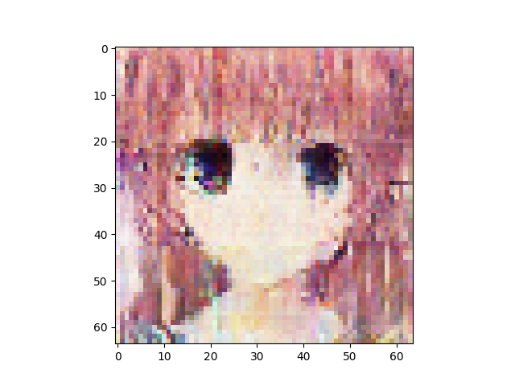
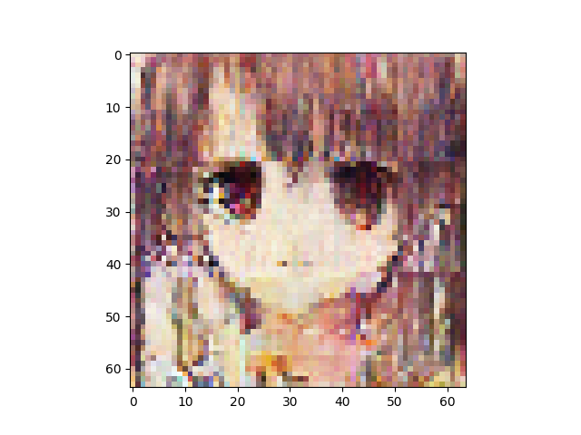
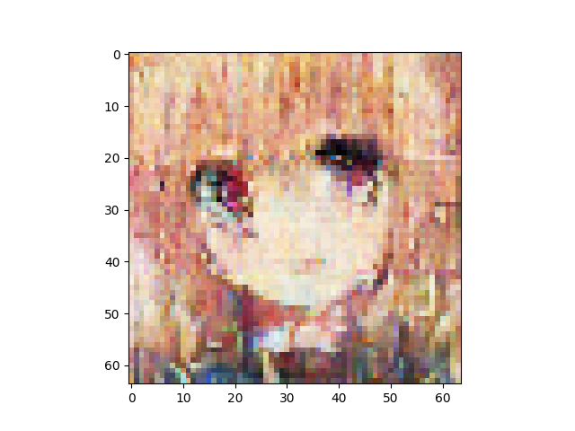
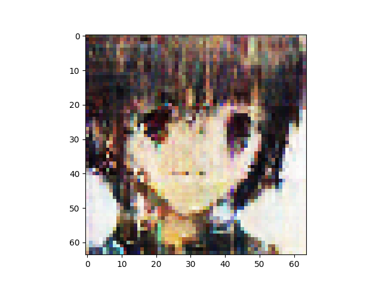
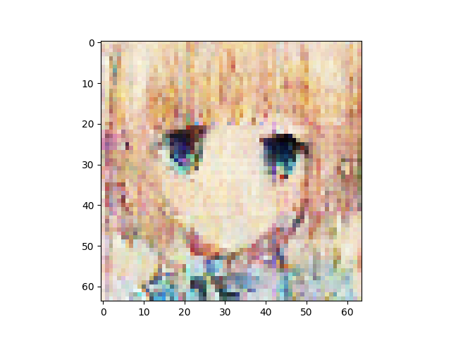
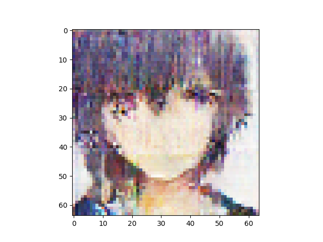
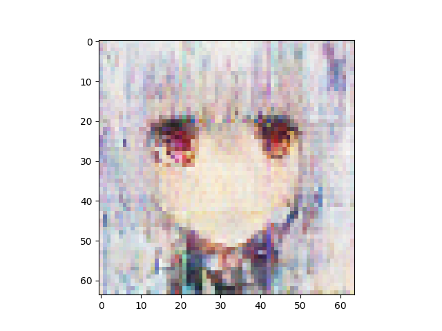
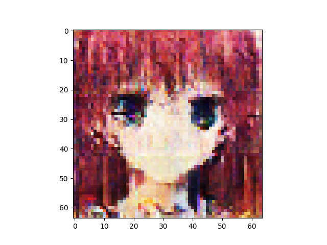
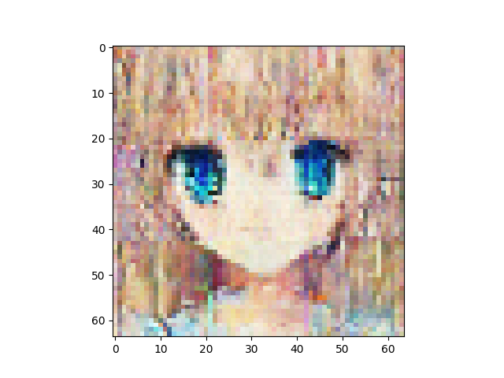
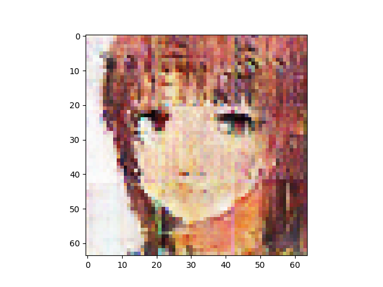

n_latent:1024 

n_base_channels:32 

pixel-by-pixel loss weight initially 1 and decay by 0.95 every 25 combo epochs 

n_solo_epochs:200 

n_combo_epochs:200 

max_disc_loss :999 

Epoch0, Training loss 7047.7656250000, Time used 54.59

Epoch1, Training loss 6824.1899414062, Time used 50.72

Epoch2, Training loss 6784.4970703125, Time used 50.94

Epoch3, Training loss 6760.9243164062, Time used 50.66

Epoch4, Training loss 6744.2265625000, Time used 51.09

Epoch5, Training loss 6730.7133789062, Time used 50.92

Epoch6, Training loss 6721.8554687500, Time used 51.03

Epoch7, Training loss 6711.5659179688, Time used 50.80

Epoch8, Training loss 6704.4223632812, Time used 50.47

Epoch9, Training loss 6697.8935546875, Time used 50.84

Epoch10, Training loss 6692.1586914062, Time used 50.88

Epoch11, Training loss 6686.3193359375, Time used 50.76

Epoch12, Training loss 6679.5898437500, Time used 50.78

Epoch13, Training loss 6678.6455078125, Time used 51.02

Epoch14, Training loss 6673.2617187500, Time used 50.78

Epoch15, Training loss 6671.7578125000, Time used 50.63

Epoch16, Training loss 6666.1689453125, Time used 50.72

Epoch17, Training loss 6660.7514648438, Time used 51.01

Epoch18, Training loss 6660.5175781250, Time used 50.74

Epoch19, Training loss 6657.0874023438, Time used 50.77

Epoch20, Training loss 6653.1577148438, Time used 50.91

Epoch21, Training loss 6650.5556640625, Time used 50.79

Epoch22, Training loss 6648.6254882812, Time used 50.96

Epoch23, Training loss 6645.2348632812, Time used 50.98

Epoch24, Training loss 6642.4892578125, Time used 50.86

Epoch25, Training loss 6641.7153320312, Time used 50.93

Epoch26, Training loss 6640.5410156250, Time used 50.67

Epoch27, Training loss 6638.1884765625, Time used 51.09

Epoch28, Training loss 6636.6870117188, Time used 50.85

Epoch29, Training loss 6634.0493164062, Time used 51.04

Epoch30, Training loss 6631.0639648438, Time used 51.12

Epoch31, Training loss 6630.5659179688, Time used 50.70

Epoch32, Training loss 6629.1816406250, Time used 50.95

Epoch33, Training loss 6627.7368164062, Time used 50.85

Epoch34, Training loss 6626.2172851562, Time used 50.83

Epoch35, Training loss 6624.7001953125, Time used 50.92

Epoch36, Training loss 6623.1997070312, Time used 50.89

Epoch37, Training loss 6620.2729492188, Time used 51.02

Epoch38, Training loss 6620.0273437500, Time used 50.95

Epoch39, Training loss 6617.4804687500, Time used 50.98

Epoch40, Training loss 6617.1318359375, Time used 51.07

Epoch41, Training loss 6617.6484375000, Time used 50.97

Epoch42, Training loss 6615.3735351562, Time used 50.94

Epoch43, Training loss 6613.1103515625, Time used 50.88

Epoch44, Training loss 6613.4018554688, Time used 51.00

Epoch45, Training loss 6610.8500976562, Time used 50.96

Epoch46, Training loss 6612.3833007812, Time used 50.71

Epoch47, Training loss 6608.3359375000, Time used 50.87

Epoch48, Training loss 6608.7998046875, Time used 51.05

Epoch49, Training loss 6608.7651367188, Time used 50.83

Epoch50, Training loss 6607.5961914062, Time used 50.74

Epoch51, Training loss 6605.2338867188, Time used 50.99

Epoch52, Training loss 6606.1533203125, Time used 50.83

Epoch53, Training loss 6605.5927734375, Time used 50.88

Epoch54, Training loss 6603.8525390625, Time used 50.67

Epoch55, Training loss 6602.9111328125, Time used 50.73

Epoch56, Training loss 6601.5249023438, Time used 50.69

Epoch57, Training loss 6599.8701171875, Time used 50.63

Epoch58, Training loss 6600.3676757812, Time used 50.95

Epoch59, Training loss 6600.0341796875, Time used 50.78

Epoch60, Training loss 6598.6538085938, Time used 50.53

Epoch61, Training loss 6597.2202148438, Time used 50.91

Epoch62, Training loss 6597.2358398438, Time used 50.97

Epoch63, Training loss 6598.0815429688, Time used 50.66

Epoch64, Training loss 6596.4946289062, Time used 51.04

Epoch65, Training loss 6594.7153320312, Time used 50.67

Epoch66, Training loss 6595.1010742188, Time used 50.91

Epoch67, Training loss 6593.8193359375, Time used 50.66

Epoch68, Training loss 6593.0844726562, Time used 50.90

Epoch69, Training loss 6592.9516601562, Time used 50.85

Epoch70, Training loss 6592.1586914062, Time used 50.97

Epoch71, Training loss 6591.2968750000, Time used 50.72

Epoch72, Training loss 6590.6196289062, Time used 50.86

Epoch73, Training loss 6589.2753906250, Time used 50.92

Epoch74, Training loss 6589.5205078125, Time used 51.00

Epoch75, Training loss 6588.3764648438, Time used 50.96

Epoch76, Training loss 6588.2495117188, Time used 50.88

Epoch77, Training loss 6588.2016601562, Time used 51.03

Epoch78, Training loss 6587.3657226562, Time used 50.77

Epoch79, Training loss 6586.4692382812, Time used 50.80

Epoch80, Training loss 6585.9497070312, Time used 51.05

Epoch81, Training loss 6585.2768554688, Time used 50.95

Epoch82, Training loss 6584.2421875000, Time used 50.56

Epoch83, Training loss 6583.8579101562, Time used 50.73

Epoch84, Training loss 6583.2802734375, Time used 51.22

Epoch85, Training loss 6583.4321289062, Time used 50.80

Epoch86, Training loss 6583.0668945312, Time used 50.87

Epoch87, Training loss 6582.9526367188, Time used 50.98

Epoch88, Training loss 6581.8071289062, Time used 50.97

Epoch89, Training loss 6582.1474609375, Time used 51.27

Epoch90, Training loss 6581.5371093750, Time used 51.00

Epoch91, Training loss 6580.6152343750, Time used 51.02

Epoch92, Training loss 6579.6850585938, Time used 50.98

Epoch93, Training loss 6579.4277343750, Time used 50.81

Epoch94, Training loss 6579.5551757812, Time used 50.93

Epoch95, Training loss 6578.6245117188, Time used 50.85

Epoch96, Training loss 6577.9658203125, Time used 51.05

Epoch97, Training loss 6577.3769531250, Time used 50.85

Epoch98, Training loss 6577.0610351562, Time used 50.99

Epoch99, Training loss 6577.2280273438, Time used 50.85

Epoch100, Training loss 6576.8452148438, Time used 50.87

Epoch101, Training loss 6576.3222656250, Time used 51.20

Epoch102, Training loss 6575.6381835938, Time used 50.69

Epoch103, Training loss 6574.6772460938, Time used 50.97

Epoch104, Training loss 6574.7524414062, Time used 51.07

Epoch105, Training loss 6573.9760742188, Time used 50.82

Epoch106, Training loss 6574.4199218750, Time used 50.87

Epoch107, Training loss 6573.8730468750, Time used 50.82

Epoch108, Training loss 6573.2998046875, Time used 50.73

Epoch109, Training loss 6573.0864257812, Time used 50.88

Epoch110, Training loss 6573.0625000000, Time used 50.91

Epoch111, Training loss 6571.4794921875, Time used 50.72

Epoch112, Training loss 6571.5771484375, Time used 50.84

Epoch113, Training loss 6571.9125976562, Time used 50.81

Epoch114, Training loss 6570.3750000000, Time used 50.85

Epoch115, Training loss 6569.5390625000, Time used 50.72

Epoch116, Training loss 6570.6367187500, Time used 50.88

Epoch117, Training loss 6570.0454101562, Time used 50.86

Epoch118, Training loss 6569.4594726562, Time used 50.84

Epoch119, Training loss 6568.4584960938, Time used 50.79

Epoch120, Training loss 6568.9516601562, Time used 50.96

Epoch121, Training loss 6568.8515625000, Time used 50.88

Epoch122, Training loss 6568.1455078125, Time used 50.72

Epoch123, Training loss 6566.4638671875, Time used 50.88

Epoch124, Training loss 6567.8037109375, Time used 51.07

Epoch125, Training loss 6567.3090820312, Time used 50.64

Epoch126, Training loss 6567.6586914062, Time used 51.10

Epoch127, Training loss 6567.8588867188, Time used 50.95

Epoch128, Training loss 6565.9985351562, Time used 50.76

Epoch129, Training loss 6567.0483398438, Time used 50.74

Epoch130, Training loss 6566.5795898438, Time used 50.85

Epoch131, Training loss 6565.3608398438, Time used 50.75

Epoch132, Training loss 6566.1464843750, Time used 50.95

Epoch133, Training loss 6565.5322265625, Time used 51.07

Epoch134, Training loss 6565.2910156250, Time used 50.86

Epoch135, Training loss 6564.2978515625, Time used 51.04

Epoch136, Training loss 6562.9379882812, Time used 50.91

Epoch137, Training loss 6564.1333007812, Time used 50.77

Epoch138, Training loss 6562.6606445312, Time used 50.85

Epoch139, Training loss 6562.9331054688, Time used 50.97

Epoch140, Training loss 6562.4716796875, Time used 50.74

Epoch141, Training loss 6562.3398437500, Time used 50.92

Epoch142, Training loss 6563.1040039062, Time used 50.65

Epoch143, Training loss 6562.1269531250, Time used 50.77

Epoch144, Training loss 6562.4824218750, Time used 50.68

Epoch145, Training loss 6560.8154296875, Time used 50.83

Epoch146, Training loss 6560.8305664062, Time used 50.80

Epoch147, Training loss 6561.4335937500, Time used 51.10

Epoch148, Training loss 6560.4423828125, Time used 50.88

Epoch149, Training loss 6560.5566406250, Time used 50.79

Epoch150, Training loss 6560.0332031250, Time used 50.88

Epoch151, Training loss 6560.1713867188, Time used 51.05

Epoch152, Training loss 6559.1621093750, Time used 50.87

Epoch153, Training loss 6559.6435546875, Time used 50.93

Epoch154, Training loss 6560.3295898438, Time used 50.92

Epoch155, Training loss 6560.0917968750, Time used 50.91

Epoch156, Training loss 6559.5087890625, Time used 50.98

Epoch157, Training loss 6557.5205078125, Time used 51.30

Epoch158, Training loss 6558.5151367188, Time used 51.18

Epoch159, Training loss 6557.7080078125, Time used 50.88

Epoch160, Training loss 6558.5615234375, Time used 50.75

Epoch161, Training loss 6558.4121093750, Time used 50.71

Epoch162, Training loss 6558.3168945312, Time used 50.90

Epoch163, Training loss 6558.8496093750, Time used 50.80

Epoch164, Training loss 6556.6938476562, Time used 51.04

Epoch165, Training loss 6557.0000000000, Time used 50.91

Epoch166, Training loss 6556.0131835938, Time used 51.12

Epoch167, Training loss 6556.9482421875, Time used 50.93

Epoch168, Training loss 6556.0512695312, Time used 50.87

Epoch169, Training loss 6556.2924804688, Time used 50.96

Epoch170, Training loss 6555.7651367188, Time used 50.91

Epoch171, Training loss 6555.5590820312, Time used 50.89

Epoch172, Training loss 6554.2114257812, Time used 51.15

Epoch173, Training loss 6555.0278320312, Time used 50.98

Epoch174, Training loss 6554.0224609375, Time used 51.05

Epoch175, Training loss 6554.1708984375, Time used 51.08

Epoch176, Training loss 6554.9355468750, Time used 50.94

Epoch177, Training loss 6554.7744140625, Time used 51.11

Epoch178, Training loss 6553.9853515625, Time used 51.03

Epoch179, Training loss 6552.9946289062, Time used 51.06

Epoch180, Training loss 6552.7749023438, Time used 50.77

Epoch181, Training loss 6554.0361328125, Time used 50.99

Epoch182, Training loss 6552.1508789062, Time used 51.04

Epoch183, Training loss 6552.7041015625, Time used 51.07

Epoch184, Training loss 6552.1586914062, Time used 50.96

Epoch185, Training loss 6551.7788085938, Time used 50.78

Epoch186, Training loss 6552.0454101562, Time used 50.85

Epoch187, Training loss 6552.3608398438, Time used 50.89

Epoch188, Training loss 6551.5229492188, Time used 50.94

Epoch189, Training loss 6551.5297851562, Time used 51.01

Epoch190, Training loss 6551.0078125000, Time used 50.91

Epoch191, Training loss 6551.1464843750, Time used 50.75

Epoch192, Training loss 6550.2978515625, Time used 50.83

Epoch193, Training loss 6550.2919921875, Time used 50.87

Epoch194, Training loss 6549.7431640625, Time used 50.86

Epoch195, Training loss 6550.3037109375, Time used 51.15

Epoch196, Training loss 6550.1713867188, Time used 50.94

Epoch197, Training loss 6548.8271484375, Time used 51.08

Epoch198, Training loss 6550.6835937500, Time used 50.71

Epoch199, Training loss 6549.6435546875, Time used 51.07

Epoch200, VAE Training loss 6661.97217, ResNet Training loss 0.3039558828, Time used 128.24

Epoch201, VAE Training loss 6689.55176, ResNet Training loss 0.2049631625, Time used 128.18

Epoch202, VAE Training loss 6728.18359, ResNet Training loss 0.2214955986, Time used 128.58

Epoch203, VAE Training loss 6721.95264, ResNet Training loss 0.1892660856, Time used 127.19

Epoch204, VAE Training loss 6747.32031, ResNet Training loss 0.2321577817, Time used 126.11

Epoch205, VAE Training loss 6792.17432, ResNet Training loss 0.2380212545, Time used 127.54

Epoch206, VAE Training loss 6794.45703, ResNet Training loss 0.1868075281, Time used 128.66

Epoch207, VAE Training loss 6771.42578, ResNet Training loss 0.1495012790, Time used 127.61

Epoch208, VAE Training loss 6798.60938, ResNet Training loss 0.2020403445, Time used 128.05

Epoch209, VAE Training loss 6825.50635, ResNet Training loss 0.2260367572, Time used 128.15

Epoch210, VAE Training loss 6810.39648, ResNet Training loss 0.1755365431, Time used 127.38

Epoch211, VAE Training loss 6805.50439, ResNet Training loss 0.1578084975, Time used 127.05

Epoch212, VAE Training loss 6794.54541, ResNet Training loss 0.1758565009, Time used 127.47

Epoch213, VAE Training loss 6746.26221, ResNet Training loss 0.0746829435, Time used 127.64

Epoch214, VAE Training loss 6791.14746, ResNet Training loss 0.1137344018, Time used 128.02

Epoch215, VAE Training loss 6824.34131, ResNet Training loss 0.1540280432, Time used 128.47

Epoch216, VAE Training loss 6831.63623, ResNet Training loss 0.1586083174, Time used 127.59

Epoch217, VAE Training loss 6833.95361, ResNet Training loss 0.1735104322, Time used 128.61

Epoch218, VAE Training loss 6850.04004, ResNet Training loss 0.1678984314, Time used 127.29

Epoch219, VAE Training loss 6839.51758, ResNet Training loss 0.1261122376, Time used 127.27

Epoch220, VAE Training loss 6846.69678, ResNet Training loss 0.1549990475, Time used 126.38

Epoch221, VAE Training loss 6837.80811, ResNet Training loss 0.1540296972, Time used 127.53

Epoch222, VAE Training loss 6846.53223, ResNet Training loss 0.1139729917, Time used 127.36

Epoch223, VAE Training loss 6855.42578, ResNet Training loss 0.1172518730, Time used 127.25

Epoch224, VAE Training loss 6830.72021, ResNet Training loss 0.1001762450, Time used 127.63

Epoch225, VAE Training loss 6529.02295, ResNet Training loss 0.1379154325, Time used 127.44

Epoch226, VAE Training loss 6528.30273, ResNet Training loss 0.1155507416, Time used 127.60

Epoch227, VAE Training loss 6527.23779, ResNet Training loss 0.1432195157, Time used 127.59

Epoch228, VAE Training loss 6543.14941, ResNet Training loss 0.1245773807, Time used 126.46

Epoch229, VAE Training loss 6576.52686, ResNet Training loss 0.1786277294, Time used 128.36

Epoch230, VAE Training loss 6541.15771, ResNet Training loss 0.1440765560, Time used 127.60

Epoch231, VAE Training loss 6547.73193, ResNet Training loss 0.1527329683, Time used 126.90

Epoch232, VAE Training loss 6508.90186, ResNet Training loss 0.0735950470, Time used 127.56

Epoch233, VAE Training loss 6581.16992, ResNet Training loss 0.1591661572, Time used 127.11

Epoch234, VAE Training loss 6573.87744, ResNet Training loss 0.1407898962, Time used 127.18

Epoch235, VAE Training loss 6585.83252, ResNet Training loss 0.1379892230, Time used 127.90

Epoch236, VAE Training loss 6557.74512, ResNet Training loss 0.1239869893, Time used 127.61

Epoch237, VAE Training loss 6538.30029, ResNet Training loss 0.0979960188, Time used 127.37

Epoch238, VAE Training loss 6578.81885, ResNet Training loss 0.1354842335, Time used 128.01

Epoch239, VAE Training loss 6513.47803, ResNet Training loss 0.0705966130, Time used 127.69

Epoch240, VAE Training loss 6566.04785, ResNet Training loss 0.1140008569, Time used 128.12

Epoch241, VAE Training loss 6553.29932, ResNet Training loss 0.1077810675, Time used 126.94

Epoch242, VAE Training loss 6508.07568, ResNet Training loss 0.0717527866, Time used 127.08

Epoch243, VAE Training loss 6548.74756, ResNet Training loss 0.1243379265, Time used 127.96

Epoch244, VAE Training loss 6561.83203, ResNet Training loss 0.1020217910, Time used 127.06

Epoch245, VAE Training loss 6548.59326, ResNet Training loss 0.0842437074, Time used 128.17

Epoch246, VAE Training loss 6529.11133, ResNet Training loss 0.0811298862, Time used 128.12

Epoch247, VAE Training loss 6554.37598, ResNet Training loss 0.1164119095, Time used 127.84

Epoch248, VAE Training loss 6575.20361, ResNet Training loss 0.1272700429, Time used 128.69

Epoch249, VAE Training loss 6570.51123, ResNet Training loss 0.1224337742, Time used 127.35

Epoch250, VAE Training loss 6260.55127, ResNet Training loss 0.1205619276, Time used 127.59

Epoch251, VAE Training loss 6226.42773, ResNet Training loss 0.0874039680, Time used 126.16

Epoch252, VAE Training loss 6263.18262, ResNet Training loss 0.1312675476, Time used 127.95

Epoch253, VAE Training loss 6283.24756, ResNet Training loss 0.1152141020, Time used 128.65

Epoch254, VAE Training loss 6277.78125, ResNet Training loss 0.1128650308, Time used 127.79

Epoch255, VAE Training loss 6234.46338, ResNet Training loss 0.0734099224, Time used 127.77

Epoch256, VAE Training loss 6254.43213, ResNet Training loss 0.0992295444, Time used 126.76

Epoch257, VAE Training loss 6263.57520, ResNet Training loss 0.1316420436, Time used 126.86

Epoch258, VAE Training loss 6254.05371, ResNet Training loss 0.0971774533, Time used 128.88

Epoch259, VAE Training loss 6287.93359, ResNet Training loss 0.1299938112, Time used 127.37

Epoch260, VAE Training loss 6235.89307, ResNet Training loss 0.0879037753, Time used 128.88

Epoch261, VAE Training loss 6263.09814, ResNet Training loss 0.1074065194, Time used 126.56

Epoch262, VAE Training loss 6289.08154, ResNet Training loss 0.1451359391, Time used 127.08

Epoch263, VAE Training loss 6307.29688, ResNet Training loss 0.1367904246, Time used 127.49

Epoch264, VAE Training loss 6316.25830, ResNet Training loss 0.1332734227, Time used 127.63

Epoch265, VAE Training loss 6306.41553, ResNet Training loss 0.1219359562, Time used 126.43

Epoch266, VAE Training loss 6274.31982, ResNet Training loss 0.0866983980, Time used 128.02

Epoch267, VAE Training loss 6281.20801, ResNet Training loss 0.0943527892, Time used 127.87

Epoch268, VAE Training loss 6281.03662, ResNet Training loss 0.0899489895, Time used 127.87

Epoch269, VAE Training loss 6281.95996, ResNet Training loss 0.1071496382, Time used 127.98

Epoch270, VAE Training loss 6312.66211, ResNet Training loss 0.1380546838, Time used 127.53

Epoch271, VAE Training loss 6295.28369, ResNet Training loss 0.0986511707, Time used 127.30

Epoch272, VAE Training loss 6267.96484, ResNet Training loss 0.0945376232, Time used 127.78

Epoch273, VAE Training loss 6321.92090, ResNet Training loss 0.1147572175, Time used 128.02

Epoch274, VAE Training loss 6314.49902, ResNet Training loss 0.0973990038, Time used 128.37

Epoch275, VAE Training loss 6017.73193, ResNet Training loss 0.1077521518, Time used 127.18

Epoch276, VAE Training loss 6001.57959, ResNet Training loss 0.0982688367, Time used 127.27

Epoch277, VAE Training loss 5968.02344, ResNet Training loss 0.0789429098, Time used 127.32

Epoch278, VAE Training loss 5978.45947, ResNet Training loss 0.0625078231, Time used 126.94

Epoch279, VAE Training loss 5970.01025, ResNet Training loss 0.0989077017, Time used 127.79

Epoch280, VAE Training loss 6002.94092, ResNet Training loss 0.0774314031, Time used 127.85

Epoch281, VAE Training loss 6020.47852, ResNet Training loss 0.1032751799, Time used 128.40

Epoch282, VAE Training loss 6043.14453, ResNet Training loss 0.1215871572, Time used 127.15

Epoch283, VAE Training loss 6012.58984, ResNet Training loss 0.0764145702, Time used 126.85

Epoch284, VAE Training loss 6035.96094, ResNet Training loss 0.0996145979, Time used 127.02

Epoch285, VAE Training loss 6015.22656, ResNet Training loss 0.0736229792, Time used 127.21

Epoch286, VAE Training loss 6028.06299, ResNet Training loss 0.0787760168, Time used 127.40

Epoch287, VAE Training loss 6012.11230, ResNet Training loss 0.0831656680, Time used 126.73

Epoch288, VAE Training loss 6024.86475, ResNet Training loss 0.0800719559, Time used 127.13

Epoch289, VAE Training loss 6048.04492, ResNet Training loss 0.0853239223, Time used 126.83

Epoch290, VAE Training loss 6008.18311, ResNet Training loss 0.0580122322, Time used 127.86

Epoch291, VAE Training loss 6046.10205, ResNet Training loss 0.0962494463, Time used 127.16

Epoch292, VAE Training loss 6020.80225, ResNet Training loss 0.0832557455, Time used 127.66

Epoch293, VAE Training loss 6021.76367, ResNet Training loss 0.0757756755, Time used 127.85

Epoch294, VAE Training loss 6053.53906, ResNet Training loss 0.1067767590, Time used 127.61

Epoch295, VAE Training loss 5999.58740, ResNet Training loss 0.0986852273, Time used 126.26

Epoch296, VAE Training loss 6017.59717, ResNet Training loss 0.0536392517, Time used 126.73

Epoch297, VAE Training loss 6064.02051, ResNet Training loss 0.1016390026, Time used 127.70

Epoch298, VAE Training loss 6036.05615, ResNet Training loss 0.0965347812, Time used 127.68

Epoch299, VAE Training loss 6014.23926, ResNet Training loss 0.0733360723, Time used 127.65

Epoch300, VAE Training loss 5790.69287, ResNet Training loss 0.0851314291, Time used 127.18

Epoch301, VAE Training loss 5758.81348, ResNet Training loss 0.0858283639, Time used 127.02

Epoch302, VAE Training loss 5770.09082, ResNet Training loss 0.1062670052, Time used 127.87

Epoch303, VAE Training loss 5762.99561, ResNet Training loss 0.0730077252, Time used 127.24

Epoch304, VAE Training loss 5780.06934, ResNet Training loss 0.0758651569, Time used 127.08

Epoch305, VAE Training loss 5732.22998, ResNet Training loss 0.0699894205, Time used 126.86

Epoch306, VAE Training loss 5771.73389, ResNet Training loss 0.0868713483, Time used 128.17

Epoch307, VAE Training loss 5748.13574, ResNet Training loss 0.0791419297, Time used 128.39

Epoch308, VAE Training loss 5748.09180, ResNet Training loss 0.0549465269, Time used 126.86

Epoch309, VAE Training loss 5724.92383, ResNet Training loss 0.0555645823, Time used 127.27

Epoch310, VAE Training loss 5680.88721, ResNet Training loss 0.0291008856, Time used 127.81

Epoch311, VAE Training loss 5810.61377, ResNet Training loss 0.0940415934, Time used 127.44

Epoch312, VAE Training loss 5767.14404, ResNet Training loss 0.0875850692, Time used 127.08

Epoch313, VAE Training loss 5785.42041, ResNet Training loss 0.0767471120, Time used 127.39

Epoch314, VAE Training loss 5810.75586, ResNet Training loss 0.0871303454, Time used 127.43

Epoch315, VAE Training loss 5748.16992, ResNet Training loss 0.0646969378, Time used 126.64

Epoch316, VAE Training loss 5787.31836, ResNet Training loss 0.0990476385, Time used 127.12

Epoch317, VAE Training loss 5729.84375, ResNet Training loss 0.0378277488, Time used 127.81

Epoch318, VAE Training loss 5748.36377, ResNet Training loss 0.0448918603, Time used 127.09

Epoch319, VAE Training loss 5761.95752, ResNet Training loss 0.0498212725, Time used 126.93

Epoch320, VAE Training loss 5767.51465, ResNet Training loss 0.0832652375, Time used 127.62

Epoch321, VAE Training loss 5786.42188, ResNet Training loss 0.0631772876, Time used 128.60

Epoch322, VAE Training loss 5803.05078, ResNet Training loss 0.0908604860, Time used 128.14

Epoch323, VAE Training loss 5760.35693, ResNet Training loss 0.0542646982, Time used 127.34

Epoch324, VAE Training loss 5780.49072, ResNet Training loss 0.0807125792, Time used 127.57

Epoch325, VAE Training loss 5525.15186, ResNet Training loss 0.0810592547, Time used 127.33

Epoch326, VAE Training loss 5461.65869, ResNet Training loss 0.0477250777, Time used 127.50

Epoch327, VAE Training loss 5493.93408, ResNet Training loss 0.0601204485, Time used 127.34

Epoch328, VAE Training loss 5454.78662, ResNet Training loss 0.0811425894, Time used 127.35

Epoch329, VAE Training loss 5385.25342, ResNet Training loss 0.0140184425, Time used 128.62

Epoch330, VAE Training loss 5394.68164, ResNet Training loss 0.0138541833, Time used 127.02

Epoch331, VAE Training loss 5368.16602, ResNet Training loss 0.0299888253, Time used 127.72

Epoch332, VAE Training loss 5499.43115, ResNet Training loss 0.1341613531, Time used 128.45

Epoch333, VAE Training loss 5542.82861, ResNet Training loss 0.1067393795, Time used 127.22

Epoch334, VAE Training loss 5537.61719, ResNet Training loss 0.0947645009, Time used 127.58

Epoch335, VAE Training loss 5517.58887, ResNet Training loss 0.0706783980, Time used 127.65

Epoch336, VAE Training loss 5454.59717, ResNet Training loss 0.0471565798, Time used 126.61

Epoch337, VAE Training loss 5485.28809, ResNet Training loss 0.0631919131, Time used 127.49

Epoch338, VAE Training loss 5449.23291, ResNet Training loss 0.0401917510, Time used 127.07

Epoch339, VAE Training loss 5505.07178, ResNet Training loss 0.0679348484, Time used 126.91

Epoch340, VAE Training loss 5497.47705, ResNet Training loss 0.0753266364, Time used 127.87

Epoch341, VAE Training loss 5428.16992, ResNet Training loss 0.0096572638, Time used 127.59

Epoch342, VAE Training loss 5499.14551, ResNet Training loss 0.0411217585, Time used 126.94

Epoch343, VAE Training loss 5475.11035, ResNet Training loss 0.0498942137, Time used 126.89

Epoch344, VAE Training loss 5485.71680, ResNet Training loss 0.0758183897, Time used 128.00

Epoch345, VAE Training loss 5484.75684, ResNet Training loss 0.0516789220, Time used 127.52

Epoch346, VAE Training loss 5463.30957, ResNet Training loss 0.0472628549, Time used 128.44

Epoch347, VAE Training loss 5408.70312, ResNet Training loss 0.0115894834, Time used 126.69

Epoch348, VAE Training loss 5540.72412, ResNet Training loss 0.0928114206, Time used 127.24

Epoch349, VAE Training loss 5503.47852, ResNet Training loss 0.0845913216, Time used 126.81

Epoch350, VAE Training loss 5232.62207, ResNet Training loss 0.0557608977, Time used 126.81

Epoch351, VAE Training loss 5254.75781, ResNet Training loss 0.0573413335, Time used 127.36

Epoch352, VAE Training loss 5245.37695, ResNet Training loss 0.0817045644, Time used 127.24

Epoch353, VAE Training loss 5238.46777, ResNet Training loss 0.0809429660, Time used 127.72

Epoch354, VAE Training loss 5235.15820, ResNet Training loss 0.0291131828, Time used 127.48

Epoch355, VAE Training loss 5285.20020, ResNet Training loss 0.0661418661, Time used 126.88

Epoch356, VAE Training loss 5282.84961, ResNet Training loss 0.0574925654, Time used 126.86

Epoch357, VAE Training loss 5302.76709, ResNet Training loss 0.0631056651, Time used 127.56

Epoch358, VAE Training loss 5257.13721, ResNet Training loss 0.0564390458, Time used 126.15

Epoch359, VAE Training loss 5283.39062, ResNet Training loss 0.0874897540, Time used 127.46

Epoch360, VAE Training loss 5179.36914, ResNet Training loss 0.0138232168, Time used 126.56

Epoch361, VAE Training loss 5238.14307, ResNet Training loss 0.0389947891, Time used 127.51

Epoch362, VAE Training loss 5227.35986, ResNet Training loss 0.0290844627, Time used 128.16

Epoch363, VAE Training loss 5275.14746, ResNet Training loss 0.0642512068, Time used 127.65

Epoch364, VAE Training loss 5258.41504, ResNet Training loss 0.0807195529, Time used 127.68

Epoch365, VAE Training loss 5278.51660, ResNet Training loss 0.0861477777, Time used 127.79

Epoch366, VAE Training loss 5247.61084, ResNet Training loss 0.0779584721, Time used 127.55

Epoch367, VAE Training loss 5236.78564, ResNet Training loss 0.0520770736, Time used 128.26

Epoch368, VAE Training loss 5264.93799, ResNet Training loss 0.0479933061, Time used 128.57

Epoch369, VAE Training loss 5298.45654, ResNet Training loss 0.0744131580, Time used 125.64

Epoch370, VAE Training loss 5310.79883, ResNet Training loss 0.0735631883, Time used 127.79

Epoch371, VAE Training loss 5270.09961, ResNet Training loss 0.0584406555, Time used 127.94

Epoch372, VAE Training loss 5276.90039, ResNet Training loss 0.0420351624, Time used 127.08

Epoch373, VAE Training loss 5209.60938, ResNet Training loss 0.0410009734, Time used 127.05

Epoch374, VAE Training loss 5272.66309, ResNet Training loss 0.0661088228, Time used 129.31

Epoch375, VAE Training loss 5033.95850, ResNet Training loss 0.0747797936, Time used 127.93

Epoch376, VAE Training loss 5011.92529, ResNet Training loss 0.0505882204, Time used 126.95

Epoch377, VAE Training loss 5036.41895, ResNet Training loss 0.0788599551, Time used 127.40

Epoch378, VAE Training loss 5026.08057, ResNet Training loss 0.0530422851, Time used 128.03

Epoch379, VAE Training loss 5038.89209, ResNet Training loss 0.0666885525, Time used 127.44

Epoch380, VAE Training loss 5011.05322, ResNet Training loss 0.0685173571, Time used 128.38

Epoch381, VAE Training loss 5057.76367, ResNet Training loss 0.0510775484, Time used 126.90

Epoch382, VAE Training loss 5054.12061, ResNet Training loss 0.0678488165, Time used 127.22

Epoch383, VAE Training loss 5036.91455, ResNet Training loss 0.0472584516, Time used 127.40

Epoch384, VAE Training loss 5003.97900, ResNet Training loss 0.0537142605, Time used 126.67

Epoch385, VAE Training loss 5008.70459, ResNet Training loss 0.0432407223, Time used 126.58

Epoch386, VAE Training loss 5015.63574, ResNet Training loss 0.0669474900, Time used 128.42

Epoch387, VAE Training loss 5012.31934, ResNet Training loss 0.0636860579, Time used 128.24

Epoch388, VAE Training loss 5010.89600, ResNet Training loss 0.0566332638, Time used 127.76

Epoch389, VAE Training loss 5004.33594, ResNet Training loss 0.0596101731, Time used 126.95

Epoch390, VAE Training loss 5034.30225, ResNet Training loss 0.0751307681, Time used 127.19

Epoch391, VAE Training loss 5008.24316, ResNet Training loss 0.0521150865, Time used 127.69

Epoch392, VAE Training loss 5035.44238, ResNet Training loss 0.0564635694, Time used 128.65

Epoch393, VAE Training loss 5010.87354, ResNet Training loss 0.0340400003, Time used 127.40

Epoch394, VAE Training loss 5006.18555, ResNet Training loss 0.0394880697, Time used 127.09

Epoch395, VAE Training loss 5035.29688, ResNet Training loss 0.0356639214, Time used 127.11

Epoch396, VAE Training loss 5016.44922, ResNet Training loss 0.0399844907, Time used 127.87

Epoch397, VAE Training loss 5074.05469, ResNet Training loss 0.0742976218, Time used 127.01

Epoch398, VAE Training loss 5025.63281, ResNet Training loss 0.0688733906, Time used 127.71

Epoch399, VAE Training loss 5014.65771, ResNet Training loss 0.0384727046, Time used 127.79

