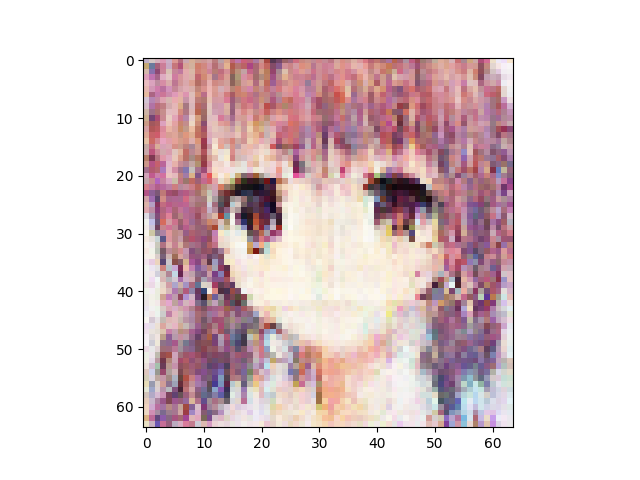
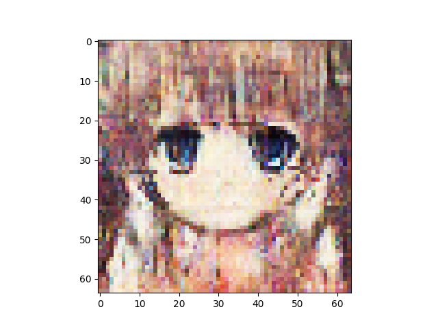
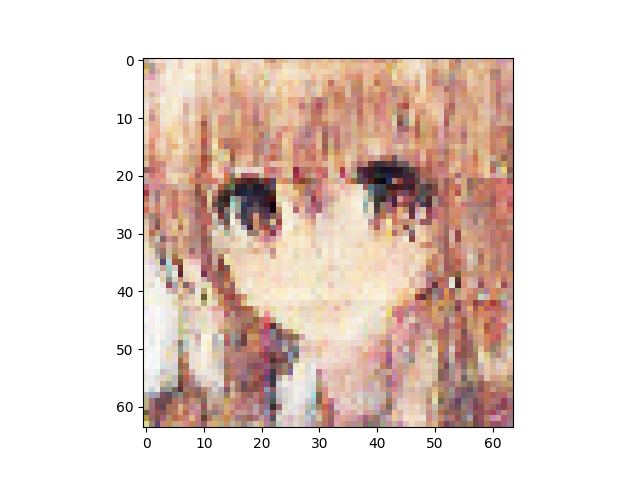
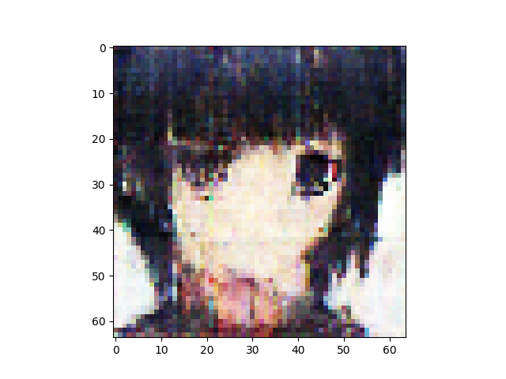
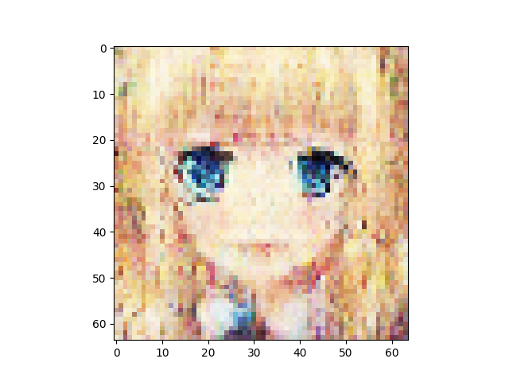
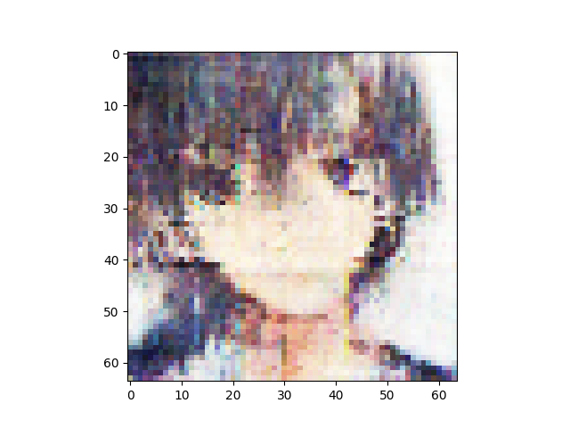
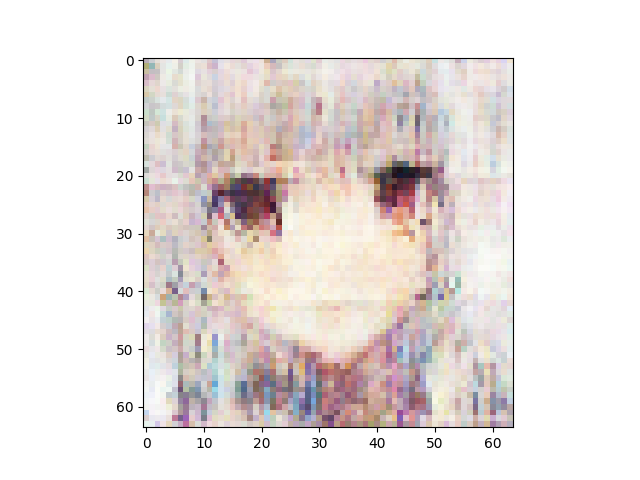
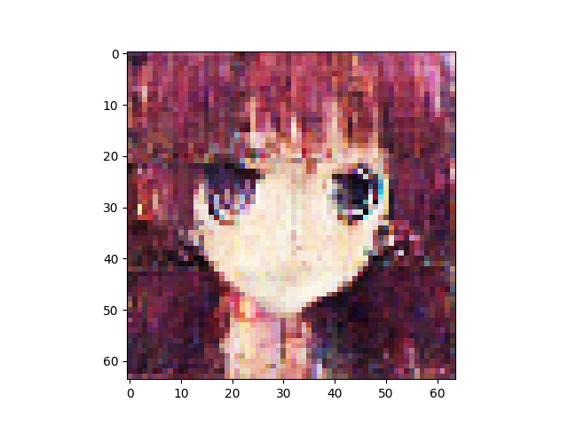
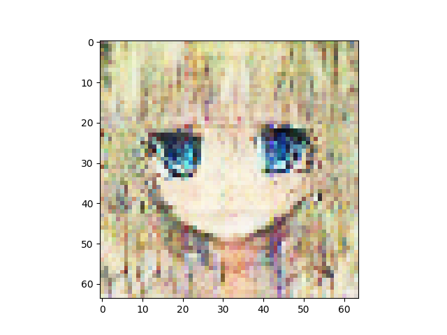
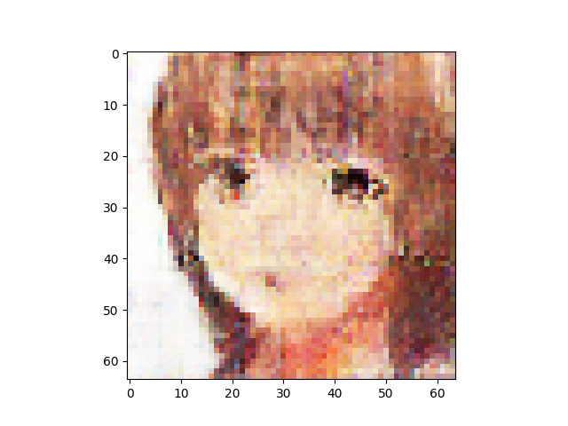

n_latent:1024 

n_base_channels:32 

pixel-by-pixel loss weight:1 

n_solo_epochs:100 

n_combo_epochs:100 

max_disc_loss :999 

Epoch0, Training loss 7191.7573242188, Time used 19.51

Epoch1, Training loss 6817.8681640625, Time used 16.03

Epoch2, Training loss 6745.5195312500, Time used 16.01

Epoch3, Training loss 6711.6782226562, Time used 16.08

Epoch4, Training loss 6691.7065429688, Time used 15.98

Epoch5, Training loss 6679.7519531250, Time used 16.03

Epoch6, Training loss 6671.3247070312, Time used 16.05

Epoch7, Training loss 6658.0766601562, Time used 15.97

Epoch8, Training loss 6650.9174804688, Time used 15.94

Epoch9, Training loss 6647.3076171875, Time used 16.11

Epoch10, Training loss 6640.7705078125, Time used 16.06

Epoch11, Training loss 6634.6289062500, Time used 16.04

Epoch12, Training loss 6629.9716796875, Time used 16.07

Epoch13, Training loss 6625.7880859375, Time used 16.05

Epoch14, Training loss 6622.8066406250, Time used 16.05

Epoch15, Training loss 6618.7758789062, Time used 16.05

Epoch16, Training loss 6615.3037109375, Time used 16.07

Epoch17, Training loss 6609.6313476562, Time used 16.10

Epoch18, Training loss 6611.3911132812, Time used 15.97

Epoch19, Training loss 6608.4106445312, Time used 15.96

Epoch20, Training loss 6604.2656250000, Time used 15.94

Epoch21, Training loss 6601.6796875000, Time used 16.03

Epoch22, Training loss 6598.5991210938, Time used 16.04

Epoch23, Training loss 6597.6328125000, Time used 15.98

Epoch24, Training loss 6595.4941406250, Time used 15.94

Epoch25, Training loss 6592.3017578125, Time used 16.05

Epoch26, Training loss 6592.1938476562, Time used 16.07

Epoch27, Training loss 6587.3168945312, Time used 16.07

Epoch28, Training loss 6584.8032226562, Time used 16.01

Epoch29, Training loss 6585.9472656250, Time used 15.94

Epoch30, Training loss 6583.6586914062, Time used 16.04

Epoch31, Training loss 6580.0126953125, Time used 16.06

Epoch32, Training loss 6580.2363281250, Time used 16.06

Epoch33, Training loss 6578.7646484375, Time used 16.08

Epoch34, Training loss 6577.4277343750, Time used 16.08

Epoch35, Training loss 6575.5927734375, Time used 16.05

Epoch36, Training loss 6574.4472656250, Time used 16.07

Epoch37, Training loss 6573.0537109375, Time used 16.06

Epoch38, Training loss 6572.9863281250, Time used 16.04

Epoch39, Training loss 6569.8457031250, Time used 15.99

Epoch40, Training loss 6572.4853515625, Time used 15.93

Epoch41, Training loss 6567.2377929688, Time used 15.94

Epoch42, Training loss 6566.5781250000, Time used 15.97

Epoch43, Training loss 6565.7592773438, Time used 16.01

Epoch44, Training loss 6566.1479492188, Time used 15.94

Epoch45, Training loss 6565.5229492188, Time used 15.92

Epoch46, Training loss 6561.8286132812, Time used 16.01

Epoch47, Training loss 6561.4062500000, Time used 15.94

Epoch48, Training loss 6560.8403320312, Time used 15.97

Epoch49, Training loss 6559.1396484375, Time used 16.02

Epoch50, Training loss 6558.8066406250, Time used 15.93

Epoch51, Training loss 6557.4169921875, Time used 15.93

Epoch52, Training loss 6557.6884765625, Time used 15.93

Epoch53, Training loss 6555.8627929688, Time used 15.91

Epoch54, Training loss 6554.3027343750, Time used 15.93

Epoch55, Training loss 6555.8808593750, Time used 15.94

Epoch56, Training loss 6553.2343750000, Time used 15.95

Epoch57, Training loss 6553.3120117188, Time used 15.96

Epoch58, Training loss 6552.3906250000, Time used 16.01

Epoch59, Training loss 6552.3837890625, Time used 15.94

Epoch60, Training loss 6550.8295898438, Time used 15.94

Epoch61, Training loss 6550.4589843750, Time used 16.00

Epoch62, Training loss 6548.9223632812, Time used 16.02

Epoch63, Training loss 6549.8271484375, Time used 16.00

Epoch64, Training loss 6548.8559570312, Time used 15.92

Epoch65, Training loss 6546.2036132812, Time used 15.93

Epoch66, Training loss 6545.0546875000, Time used 15.92

Epoch67, Training loss 6545.7255859375, Time used 15.92

Epoch68, Training loss 6545.9741210938, Time used 15.93

Epoch69, Training loss 6542.1503906250, Time used 16.06

Epoch70, Training loss 6541.9868164062, Time used 16.05

Epoch71, Training loss 6542.8305664062, Time used 15.94

Epoch72, Training loss 6541.1909179688, Time used 15.98

Epoch73, Training loss 6543.6806640625, Time used 16.00

Epoch74, Training loss 6542.3310546875, Time used 15.99

Epoch75, Training loss 6540.0146484375, Time used 16.03

Epoch76, Training loss 6540.1323242188, Time used 16.02

Epoch77, Training loss 6539.9111328125, Time used 16.04

Epoch78, Training loss 6539.5229492188, Time used 15.92

Epoch79, Training loss 6537.0117187500, Time used 16.03

Epoch80, Training loss 6535.7368164062, Time used 15.94

Epoch81, Training loss 6537.6855468750, Time used 15.93

Epoch82, Training loss 6536.5053710938, Time used 15.93

Epoch83, Training loss 6535.9418945312, Time used 15.94

Epoch84, Training loss 6535.3300781250, Time used 15.97

Epoch85, Training loss 6534.1137695312, Time used 15.96

Epoch86, Training loss 6535.1127929688, Time used 16.03

Epoch87, Training loss 6534.4306640625, Time used 16.08

Epoch88, Training loss 6533.0878906250, Time used 16.08

Epoch89, Training loss 6534.0112304688, Time used 16.04

Epoch90, Training loss 6533.3408203125, Time used 16.04

Epoch91, Training loss 6530.4560546875, Time used 16.05

Epoch92, Training loss 6531.6518554688, Time used 15.99

Epoch93, Training loss 6531.7182617188, Time used 16.04

Epoch94, Training loss 6531.7060546875, Time used 16.04

Epoch95, Training loss 6531.1220703125, Time used 15.99

Epoch96, Training loss 6530.0034179688, Time used 15.94

Epoch97, Training loss 6529.4916992188, Time used 15.94

Epoch98, Training loss 6528.6469726562, Time used 15.98

Epoch99, Training loss 6528.4760742188, Time used 15.92

Epoch100, VAE Training loss 6591.67578, ResNet Training loss 0.7314934731, ResNet Validation accuracy 1.00, Time used 43.70

Epoch101, VAE Training loss 6650.72754, ResNet Training loss 0.4096334875, ResNet Validation accuracy 1.00, Time used 42.88

Epoch102, VAE Training loss 6694.86084, ResNet Training loss 0.3368493021, ResNet Validation accuracy 1.00, Time used 42.81

Epoch103, VAE Training loss 6688.06934, ResNet Training loss 0.5126234293, ResNet Validation accuracy 1.00, Time used 42.96

Epoch104, VAE Training loss 6701.47314, ResNet Training loss 0.3138141334, ResNet Validation accuracy 1.00, Time used 42.89

Epoch105, VAE Training loss 6732.28271, ResNet Training loss 0.3681441844, ResNet Validation accuracy 1.00, Time used 42.86

Epoch106, VAE Training loss 6703.86963, ResNet Training loss 0.4182190001, ResNet Validation accuracy 1.00, Time used 42.99

Epoch107, VAE Training loss 6740.97021, ResNet Training loss 0.4772810340, ResNet Validation accuracy 1.00, Time used 42.92

Epoch108, VAE Training loss 6742.77148, ResNet Training loss 0.5162762403, ResNet Validation accuracy 1.00, Time used 42.98

Epoch109, VAE Training loss 6774.33154, ResNet Training loss 0.3713820875, ResNet Validation accuracy 1.00, Time used 42.98

Epoch110, VAE Training loss 6797.45996, ResNet Training loss 0.4406937063, ResNet Validation accuracy 0.69, Time used 43.00

Epoch111, VAE Training loss 6774.02197, ResNet Training loss 0.2454729378, ResNet Validation accuracy 1.00, Time used 42.85

Epoch112, VAE Training loss 6786.34961, ResNet Training loss 0.3269204497, ResNet Validation accuracy 1.00, Time used 42.86

Epoch113, VAE Training loss 6765.35107, ResNet Training loss 0.2990727723, ResNet Validation accuracy 1.00, Time used 43.14

Epoch114, VAE Training loss 6790.78809, ResNet Training loss 0.2994167805, ResNet Validation accuracy 1.00, Time used 42.71

Epoch115, VAE Training loss 6759.27051, ResNet Training loss 0.2692041695, ResNet Validation accuracy 1.00, Time used 42.96

Epoch116, VAE Training loss 6758.67578, ResNet Training loss 0.1865950823, ResNet Validation accuracy 1.00, Time used 42.87

Epoch117, VAE Training loss 6796.54639, ResNet Training loss 0.3402625322, ResNet Validation accuracy 1.00, Time used 42.81

Epoch118, VAE Training loss 6813.52051, ResNet Training loss 0.3819817007, ResNet Validation accuracy 1.00, Time used 42.97

Epoch119, VAE Training loss 6804.31396, ResNet Training loss 0.3415329158, ResNet Validation accuracy 1.00, Time used 42.93

Epoch120, VAE Training loss 6821.03418, ResNet Training loss 0.2854770422, ResNet Validation accuracy 1.00, Time used 43.12

Epoch121, VAE Training loss 6780.12012, ResNet Training loss 0.2270352393, ResNet Validation accuracy 1.00, Time used 42.79

Epoch122, VAE Training loss 6818.13232, ResNet Training loss 0.2855199277, ResNet Validation accuracy 0.35, Time used 42.87

Epoch123, VAE Training loss 6836.03613, ResNet Training loss 0.3394128978, ResNet Validation accuracy 1.00, Time used 43.06

Epoch124, VAE Training loss 6827.52393, ResNet Training loss 0.2999321818, ResNet Validation accuracy 0.99, Time used 42.83

Epoch125, VAE Training loss 6855.71191, ResNet Training loss 0.3714291751, ResNet Validation accuracy 1.00, Time used 42.84

Epoch126, VAE Training loss 6767.47900, ResNet Training loss 0.1565062553, ResNet Validation accuracy 1.00, Time used 42.82

Epoch127, VAE Training loss 6823.12109, ResNet Training loss 0.2716175318, ResNet Validation accuracy 0.48, Time used 42.83

Epoch128, VAE Training loss 6812.08740, ResNet Training loss 0.2319165021, ResNet Validation accuracy 1.00, Time used 42.83

Epoch129, VAE Training loss 6863.57520, ResNet Training loss 0.3136180639, ResNet Validation accuracy 1.00, Time used 43.21

Epoch130, VAE Training loss 6864.31494, ResNet Training loss 0.3606492281, ResNet Validation accuracy 1.00, Time used 43.02

Epoch131, VAE Training loss 6867.17432, ResNet Training loss 0.3526689410, ResNet Validation accuracy 1.00, Time used 42.79

Epoch132, VAE Training loss 6852.01709, ResNet Training loss 0.2398198694, ResNet Validation accuracy 1.00, Time used 42.67

Epoch133, VAE Training loss 6861.47900, ResNet Training loss 0.3237215579, ResNet Validation accuracy 1.00, Time used 42.83

Epoch134, VAE Training loss 6860.97656, ResNet Training loss 0.3035171032, ResNet Validation accuracy 0.57, Time used 42.67

Epoch135, VAE Training loss 6816.39453, ResNet Training loss 0.2393753082, ResNet Validation accuracy 1.00, Time used 42.86

Epoch136, VAE Training loss 6870.71094, ResNet Training loss 0.2757007778, ResNet Validation accuracy 1.00, Time used 42.78

Epoch137, VAE Training loss 6876.16846, ResNet Training loss 0.2682123780, ResNet Validation accuracy 1.00, Time used 42.87

Epoch138, VAE Training loss 6875.52490, ResNet Training loss 0.3030497730, ResNet Validation accuracy 1.00, Time used 42.89

Epoch139, VAE Training loss 6876.84375, ResNet Training loss 0.3175034523, ResNet Validation accuracy 1.00, Time used 42.79

Epoch140, VAE Training loss 6893.15820, ResNet Training loss 0.2671124637, ResNet Validation accuracy 1.00, Time used 42.91

Epoch141, VAE Training loss 6890.64893, ResNet Training loss 0.2456203103, ResNet Validation accuracy 1.00, Time used 43.09

Epoch142, VAE Training loss 6879.49072, ResNet Training loss 0.3031790257, ResNet Validation accuracy 0.98, Time used 42.71

Epoch143, VAE Training loss 6898.49463, ResNet Training loss 0.3010416627, ResNet Validation accuracy 1.00, Time used 42.83

Epoch144, VAE Training loss 6860.66650, ResNet Training loss 0.2582917809, ResNet Validation accuracy 1.00, Time used 42.93

Epoch145, VAE Training loss 6899.00977, ResNet Training loss 0.2854435146, ResNet Validation accuracy 1.00, Time used 42.78

Epoch146, VAE Training loss 6871.27686, ResNet Training loss 0.2826339602, ResNet Validation accuracy 1.00, Time used 42.89

Epoch147, VAE Training loss 6884.27393, ResNet Training loss 0.1934805363, ResNet Validation accuracy 1.00, Time used 43.08

Epoch148, VAE Training loss 6914.98682, ResNet Training loss 0.2567334473, ResNet Validation accuracy 1.00, Time used 42.88

Epoch149, VAE Training loss 6858.82959, ResNet Training loss 0.2452670932, ResNet Validation accuracy 1.00, Time used 42.93

Epoch150, VAE Training loss 6913.77393, ResNet Training loss 0.2713603377, ResNet Validation accuracy 1.00, Time used 42.90

Epoch151, VAE Training loss 6914.25977, ResNet Training loss 0.2750588953, ResNet Validation accuracy 1.00, Time used 42.81

Epoch152, VAE Training loss 6912.14502, ResNet Training loss 0.2651752532, ResNet Validation accuracy 0.08, Time used 42.92

Epoch153, VAE Training loss 6912.25879, ResNet Training loss 0.2211924493, ResNet Validation accuracy 0.85, Time used 43.05

Epoch154, VAE Training loss 6928.44531, ResNet Training loss 0.2613416314, ResNet Validation accuracy 1.00, Time used 42.95

Epoch155, VAE Training loss 6901.94092, ResNet Training loss 0.2759690881, ResNet Validation accuracy 0.95, Time used 42.95

Epoch156, VAE Training loss 6909.94727, ResNet Training loss 0.2782109380, ResNet Validation accuracy 1.00, Time used 42.72

Epoch157, VAE Training loss 6922.66553, ResNet Training loss 0.2918731272, ResNet Validation accuracy 1.00, Time used 42.87

Epoch158, VAE Training loss 6920.64551, ResNet Training loss 0.2079986483, ResNet Validation accuracy 1.00, Time used 42.96

Epoch159, VAE Training loss 6930.12598, ResNet Training loss 0.2679953277, ResNet Validation accuracy 0.55, Time used 42.94

Epoch160, VAE Training loss 6951.63525, ResNet Training loss 0.2804301083, ResNet Validation accuracy 1.00, Time used 43.05

Epoch161, VAE Training loss 6915.32373, ResNet Training loss 0.2255059928, ResNet Validation accuracy 0.99, Time used 42.99

Epoch162, VAE Training loss 6924.21094, ResNet Training loss 0.2938828468, ResNet Validation accuracy 1.00, Time used 42.91

Epoch163, VAE Training loss 6914.83643, ResNet Training loss 0.2225393206, ResNet Validation accuracy 1.00, Time used 42.86

Epoch164, VAE Training loss 6942.43994, ResNet Training loss 0.2978503108, ResNet Validation accuracy 0.14, Time used 42.93

Epoch165, VAE Training loss 6939.76367, ResNet Training loss 0.2184852660, ResNet Validation accuracy 1.00, Time used 42.99

Epoch166, VAE Training loss 6946.65723, ResNet Training loss 0.2946064472, ResNet Validation accuracy 1.00, Time used 43.12

Epoch167, VAE Training loss 6919.01416, ResNet Training loss 0.1833931357, ResNet Validation accuracy 0.39, Time used 42.91

Epoch168, VAE Training loss 6948.87061, ResNet Training loss 0.2757627666, ResNet Validation accuracy 1.00, Time used 42.97

Epoch169, VAE Training loss 6950.71191, ResNet Training loss 0.2291433811, ResNet Validation accuracy 1.00, Time used 42.93

Epoch170, VAE Training loss 6895.17920, ResNet Training loss 0.2044801265, ResNet Validation accuracy 0.98, Time used 42.79

Epoch171, VAE Training loss 6932.98389, ResNet Training loss 0.1950090379, ResNet Validation accuracy 1.00, Time used 42.66

Epoch172, VAE Training loss 6937.22803, ResNet Training loss 0.2094063014, ResNet Validation accuracy 0.99, Time used 42.94

Epoch173, VAE Training loss 6949.68262, ResNet Training loss 0.2432638109, ResNet Validation accuracy 1.00, Time used 42.77

Epoch174, VAE Training loss 6897.53564, ResNet Training loss 0.1981446743, ResNet Validation accuracy 1.00, Time used 42.63

Epoch175, VAE Training loss 6938.04785, ResNet Training loss 0.1975381374, ResNet Validation accuracy 1.00, Time used 42.87

Epoch176, VAE Training loss 6942.57861, ResNet Training loss 0.2075654417, ResNet Validation accuracy 1.00, Time used 42.86

Epoch177, VAE Training loss 6938.81152, ResNet Training loss 0.1975228190, ResNet Validation accuracy 1.00, Time used 42.99

Epoch178, VAE Training loss 6922.59814, ResNet Training loss 0.2187281847, ResNet Validation accuracy 1.00, Time used 42.96

Epoch179, VAE Training loss 6926.02051, ResNet Training loss 0.2042010128, ResNet Validation accuracy 0.79, Time used 42.76

Epoch180, VAE Training loss 6898.35547, ResNet Training loss 0.2144080102, ResNet Validation accuracy 0.99, Time used 42.80

Epoch181, VAE Training loss 6920.06104, ResNet Training loss 0.2357624471, ResNet Validation accuracy 1.00, Time used 42.85

Epoch182, VAE Training loss 6947.15625, ResNet Training loss 0.2625253797, ResNet Validation accuracy 1.00, Time used 42.83

Epoch183, VAE Training loss 6910.35205, ResNet Training loss 0.1000069082, ResNet Validation accuracy 1.00, Time used 42.90

Epoch184, VAE Training loss 6943.41602, ResNet Training loss 0.1940612197, ResNet Validation accuracy 1.00, Time used 43.07

Epoch185, VAE Training loss 6941.93408, ResNet Training loss 0.1971507668, ResNet Validation accuracy 1.00, Time used 42.91

Epoch186, VAE Training loss 6947.21533, ResNet Training loss 0.2161137760, ResNet Validation accuracy 1.00, Time used 42.97

Epoch187, VAE Training loss 6906.27881, ResNet Training loss 0.2069038600, ResNet Validation accuracy 1.00, Time used 42.75

Epoch188, VAE Training loss 6913.42676, ResNet Training loss 0.1228889152, ResNet Validation accuracy 1.00, Time used 42.80

Epoch189, VAE Training loss 6912.76660, ResNet Training loss 0.1447793245, ResNet Validation accuracy 1.00, Time used 42.70

Epoch190, VAE Training loss 6920.48877, ResNet Training loss 0.1427216232, ResNet Validation accuracy 1.00, Time used 42.71

Epoch191, VAE Training loss 6949.97949, ResNet Training loss 0.1967623085, ResNet Validation accuracy 1.00, Time used 42.89

Epoch192, VAE Training loss 6934.58789, ResNet Training loss 0.1687644422, ResNet Validation accuracy 1.00, Time used 42.82

Epoch193, VAE Training loss 6911.82324, ResNet Training loss 0.1199808493, ResNet Validation accuracy 0.88, Time used 42.90

Epoch194, VAE Training loss 6883.35498, ResNet Training loss 0.2388855517, ResNet Validation accuracy 1.00, Time used 42.85

Epoch195, VAE Training loss 6969.25195, ResNet Training loss 0.2030280530, ResNet Validation accuracy 1.00, Time used 42.87

Epoch196, VAE Training loss 6931.49365, ResNet Training loss 0.1657009572, ResNet Validation accuracy 0.42, Time used 42.83

Epoch197, VAE Training loss 6942.16211, ResNet Training loss 0.1359015852, ResNet Validation accuracy 1.00, Time used 42.86

Epoch198, VAE Training loss 6914.08496, ResNet Training loss 0.1619879305, ResNet Validation accuracy 1.00, Time used 42.92

Epoch199, VAE Training loss 6947.23828, ResNet Training loss 0.1224163026, ResNet Validation accuracy 1.00, Time used 42.86

