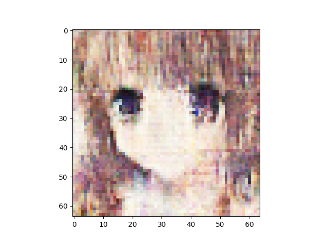
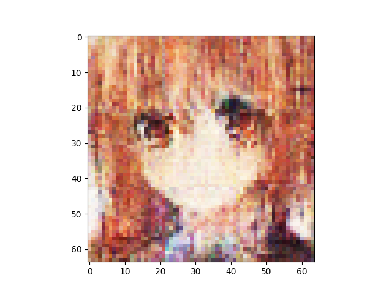
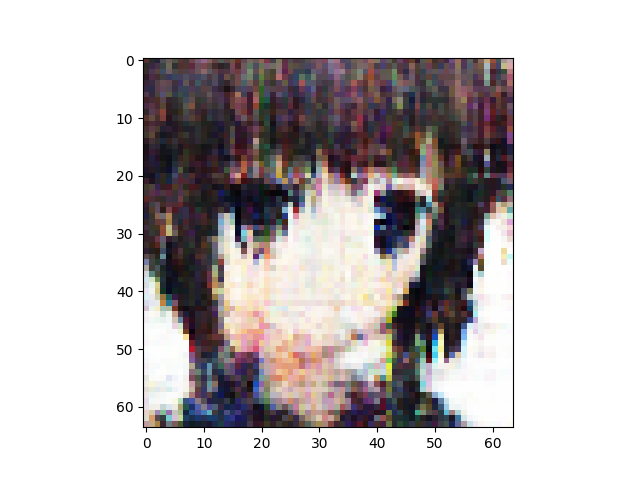
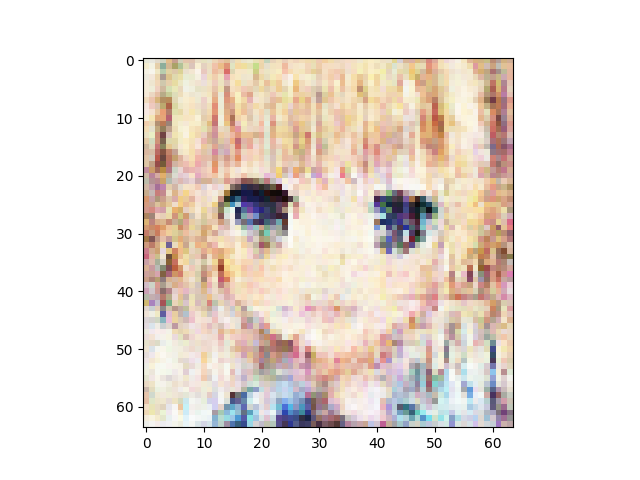
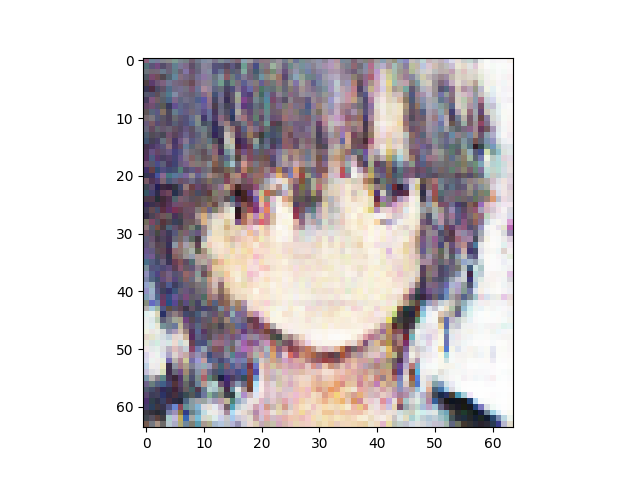
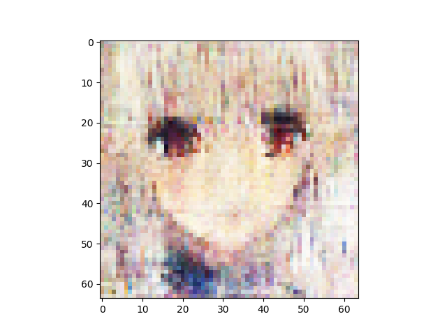

n_latent:1024 

n_base_channels:32 

pixel-by-pixel loss weight:1 

n_solo_epochs:100 

n_combo_epochs:100 

max_disc_loss :999 

Epoch0, Training loss 7537.9091796875, Time used 19.44

Epoch1, Training loss 6986.6118164062, Time used 16.01

Epoch2, Training loss 6872.2324218750, Time used 15.98

Epoch3, Training loss 6808.0346679688, Time used 15.84

Epoch4, Training loss 6766.0073242188, Time used 15.64

Epoch5, Training loss 6735.4443359375, Time used 15.65

Epoch6, Training loss 6716.2407226562, Time used 15.67

Epoch7, Training loss 6700.6708984375, Time used 15.63

Epoch8, Training loss 6689.7138671875, Time used 15.60

Epoch9, Training loss 6679.7246093750, Time used 15.64

Epoch10, Training loss 6671.0043945312, Time used 15.65

Epoch11, Training loss 6663.7851562500, Time used 15.66

Epoch12, Training loss 6658.8149414062, Time used 15.65

Epoch13, Training loss 6654.1582031250, Time used 15.65

Epoch14, Training loss 6648.0756835938, Time used 15.66

Epoch15, Training loss 6645.0229492188, Time used 15.65

Epoch16, Training loss 6641.0810546875, Time used 15.65

Epoch17, Training loss 6637.2099609375, Time used 15.70

Epoch18, Training loss 6634.2954101562, Time used 15.69

Epoch19, Training loss 6630.8437500000, Time used 15.57

Epoch20, Training loss 6628.5444335938, Time used 15.61

Epoch21, Training loss 6625.0009765625, Time used 15.60

Epoch22, Training loss 6621.8725585938, Time used 15.64

Epoch23, Training loss 6618.6020507812, Time used 15.68

Epoch24, Training loss 6616.8549804688, Time used 15.90

Epoch25, Training loss 6613.1850585938, Time used 15.99

Epoch26, Training loss 6612.9526367188, Time used 15.96

Epoch27, Training loss 6610.5297851562, Time used 15.95

Epoch28, Training loss 6608.5678710938, Time used 15.98

Epoch29, Training loss 6606.7885742188, Time used 16.00

Epoch30, Training loss 6603.7006835938, Time used 15.94

Epoch31, Training loss 6601.6191406250, Time used 15.82

Epoch32, Training loss 6601.2192382812, Time used 15.90

Epoch33, Training loss 6600.5917968750, Time used 15.94

Epoch34, Training loss 6597.5849609375, Time used 16.02

Epoch35, Training loss 6593.7285156250, Time used 15.99

Epoch36, Training loss 6593.7407226562, Time used 15.87

Epoch37, Training loss 6591.9829101562, Time used 15.94

Epoch38, Training loss 6589.3183593750, Time used 15.89

Epoch39, Training loss 6590.3544921875, Time used 15.88

Epoch40, Training loss 6588.3701171875, Time used 15.70

Epoch41, Training loss 6585.4028320312, Time used 15.58

Epoch42, Training loss 6587.3339843750, Time used 15.63

Epoch43, Training loss 6583.2812500000, Time used 15.64

Epoch44, Training loss 6582.9970703125, Time used 15.65

Epoch45, Training loss 6581.0244140625, Time used 15.63

Epoch46, Training loss 6581.3613281250, Time used 15.59

Epoch47, Training loss 6579.2431640625, Time used 15.63

Epoch48, Training loss 6579.4858398438, Time used 15.63

Epoch49, Training loss 6577.8232421875, Time used 15.64

Epoch50, Training loss 6576.9531250000, Time used 15.63

Epoch51, Training loss 6575.8037109375, Time used 15.63

Epoch52, Training loss 6573.2812500000, Time used 15.59

Epoch53, Training loss 6574.4018554688, Time used 15.53

Epoch54, Training loss 6572.8266601562, Time used 15.53

Epoch55, Training loss 6571.3471679688, Time used 15.55

Epoch56, Training loss 6571.7006835938, Time used 15.60

Epoch57, Training loss 6569.0112304688, Time used 15.62

Epoch58, Training loss 6568.9882812500, Time used 15.60

Epoch59, Training loss 6567.1279296875, Time used 15.56

Epoch60, Training loss 6567.9721679688, Time used 15.60

Epoch61, Training loss 6566.9091796875, Time used 15.60

Epoch62, Training loss 6565.1503906250, Time used 15.79

Epoch63, Training loss 6565.9458007812, Time used 15.94

Epoch64, Training loss 6564.2905273438, Time used 15.92

Epoch65, Training loss 6564.0136718750, Time used 15.96

Epoch66, Training loss 6561.9340820312, Time used 15.92

Epoch67, Training loss 6560.5410156250, Time used 15.93

Epoch68, Training loss 6559.0415039062, Time used 15.93

Epoch69, Training loss 6561.3901367188, Time used 15.99

Epoch70, Training loss 6560.1640625000, Time used 15.95

Epoch71, Training loss 6558.5878906250, Time used 15.90

Epoch72, Training loss 6558.3916015625, Time used 15.93

Epoch73, Training loss 6556.7734375000, Time used 15.95

Epoch74, Training loss 6556.3793945312, Time used 15.96

Epoch75, Training loss 6556.8911132812, Time used 15.86

Epoch76, Training loss 6555.5249023438, Time used 15.86

Epoch77, Training loss 6555.3247070312, Time used 15.63

Epoch78, Training loss 6555.6303710938, Time used 15.58

Epoch79, Training loss 6552.9677734375, Time used 15.64

Epoch80, Training loss 6552.7553710938, Time used 15.63

Epoch81, Training loss 6552.4233398438, Time used 15.59

Epoch82, Training loss 6552.5981445312, Time used 15.66

Epoch83, Training loss 6551.8242187500, Time used 15.65

Epoch84, Training loss 6551.3618164062, Time used 15.65

Epoch85, Training loss 6550.7167968750, Time used 15.65

Epoch86, Training loss 6549.5449218750, Time used 15.64

Epoch87, Training loss 6549.2612304688, Time used 15.66

Epoch88, Training loss 6548.4370117188, Time used 15.67

Epoch89, Training loss 6548.1557617188, Time used 15.67

Epoch90, Training loss 6547.0258789062, Time used 15.67

Epoch91, Training loss 6547.0224609375, Time used 15.66

Epoch92, Training loss 6547.1860351562, Time used 15.67

Epoch93, Training loss 6545.8740234375, Time used 15.55

Epoch94, Training loss 6544.9628906250, Time used 15.53

Epoch95, Training loss 6546.2724609375, Time used 15.60

Epoch96, Training loss 6544.5844726562, Time used 15.55

Epoch97, Training loss 6543.5117187500, Time used 15.60

Epoch98, Training loss 6542.9511718750, Time used 15.52

Epoch99, Training loss 6542.8325195312, Time used 15.56

Epoch100, VAE Training loss 6668.84082, ResNet Training loss 0.4390208721, Time used 43.50

Epoch101, VAE Training loss 6763.45166, ResNet Training loss 0.4938039780, Time used 43.32

Epoch102, VAE Training loss 6762.52393, ResNet Training loss 0.4493778944, Time used 43.01

Epoch103, VAE Training loss 6731.26123, ResNet Training loss 0.2096664608, Time used 43.10

Epoch104, VAE Training loss 6774.17871, ResNet Training loss 0.3539658785, Time used 43.19

Epoch105, VAE Training loss 6747.61768, ResNet Training loss 0.2167822421, Time used 43.57

Epoch106, VAE Training loss 6786.52295, ResNet Training loss 0.3016934395, Time used 42.87

Epoch107, VAE Training loss 6729.59424, ResNet Training loss 0.1945495307, Time used 42.25

Epoch108, VAE Training loss 6767.87842, ResNet Training loss 0.2220566124, Time used 41.95

Epoch109, VAE Training loss 6749.75439, ResNet Training loss 0.2509734631, Time used 41.93

Epoch110, VAE Training loss 6783.19434, ResNet Training loss 0.3133318722, Time used 41.84

Epoch111, VAE Training loss 6781.85254, ResNet Training loss 0.2801194787, Time used 41.95

Epoch112, VAE Training loss 6795.30908, ResNet Training loss 0.2778993547, Time used 42.18

Epoch113, VAE Training loss 6817.50195, ResNet Training loss 0.3904596567, Time used 42.00

Epoch114, VAE Training loss 6812.45166, ResNet Training loss 0.2529148757, Time used 43.21

Epoch115, VAE Training loss 6846.54932, ResNet Training loss 0.3125664890, Time used 42.78

Epoch116, VAE Training loss 6846.03076, ResNet Training loss 0.3071918786, Time used 42.95

Epoch117, VAE Training loss 6872.26953, ResNet Training loss 0.3198518455, Time used 42.97

Epoch118, VAE Training loss 6841.03564, ResNet Training loss 0.2812136710, Time used 42.91

Epoch119, VAE Training loss 6829.24561, ResNet Training loss 0.3231312931, Time used 43.04

Epoch120, VAE Training loss 6854.70850, ResNet Training loss 0.2935189605, Time used 41.98

Epoch121, VAE Training loss 6856.91553, ResNet Training loss 0.2456793934, Time used 42.25

Epoch122, VAE Training loss 6838.40918, ResNet Training loss 0.2673426569, Time used 42.28

Epoch123, VAE Training loss 6826.36963, ResNet Training loss 0.2459809780, Time used 41.85

Epoch124, VAE Training loss 6869.09326, ResNet Training loss 0.2583290935, Time used 41.97

Epoch125, VAE Training loss 6875.02490, ResNet Training loss 0.2959581316, Time used 41.69

Epoch126, VAE Training loss 6874.82617, ResNet Training loss 0.2826521099, Time used 42.26

Epoch127, VAE Training loss 6894.06885, ResNet Training loss 0.3212627769, Time used 42.15

Epoch128, VAE Training loss 6883.63623, ResNet Training loss 0.2658601403, Time used 42.69

Epoch129, VAE Training loss 6869.63428, ResNet Training loss 0.2390890270, Time used 42.70

Epoch130, VAE Training loss 6896.48877, ResNet Training loss 0.2337022722, Time used 43.21

Epoch131, VAE Training loss 6894.21875, ResNet Training loss 0.2847691476, Time used 43.10

Epoch132, VAE Training loss 6889.20850, ResNet Training loss 0.2912302017, Time used 43.03

Epoch133, VAE Training loss 6846.00146, ResNet Training loss 0.1458028108, Time used 43.06

Epoch134, VAE Training loss 6881.07227, ResNet Training loss 0.2404671609, Time used 43.26

Epoch135, VAE Training loss 6845.78516, ResNet Training loss 0.1679825187, Time used 42.48

Epoch136, VAE Training loss 6912.83496, ResNet Training loss 0.2114703804, Time used 42.04

Epoch137, VAE Training loss 6843.85889, ResNet Training loss 0.2401485294, Time used 42.46

Epoch138, VAE Training loss 6871.27002, ResNet Training loss 0.1688867062, Time used 41.97

Epoch139, VAE Training loss 6889.83887, ResNet Training loss 0.2294466197, Time used 42.00

Epoch140, VAE Training loss 6863.80127, ResNet Training loss 0.1921512187, Time used 42.17

Epoch141, VAE Training loss 6874.53955, ResNet Training loss 0.2027750313, Time used 42.13

Epoch142, VAE Training loss 6876.63721, ResNet Training loss 0.2065620571, Time used 42.76

Epoch143, VAE Training loss 6855.84619, ResNet Training loss 0.1793324500, Time used 43.06

Epoch144, VAE Training loss 6894.01318, ResNet Training loss 0.1768341362, Time used 42.83

Epoch145, VAE Training loss 6884.12109, ResNet Training loss 0.1920956969, Time used 42.86

Epoch146, VAE Training loss 6847.66797, ResNet Training loss 0.1610556990, Time used 42.97

Epoch147, VAE Training loss 6895.39600, ResNet Training loss 0.2034057975, Time used 42.69

Epoch148, VAE Training loss 6868.54932, ResNet Training loss 0.1831849515, Time used 41.72

Epoch149, VAE Training loss 6885.78711, ResNet Training loss 0.1835175753, Time used 42.09

Epoch150, VAE Training loss 6837.69678, ResNet Training loss 0.1053674594, Time used 41.96

Epoch151, VAE Training loss 6903.02295, ResNet Training loss 0.2054492980, Time used 42.00

Epoch152, VAE Training loss 6859.46924, ResNet Training loss 0.1858197004, Time used 42.18

Epoch153, VAE Training loss 6837.28613, ResNet Training loss 0.0999635532, Time used 41.99

Epoch154, VAE Training loss 6869.68896, ResNet Training loss 0.1122363880, Time used 42.08

Epoch155, VAE Training loss 6883.54346, ResNet Training loss 0.1715753824, Time used 42.17

Epoch156, VAE Training loss 6861.09912, ResNet Training loss 0.1295188963, Time used 42.42

Epoch157, VAE Training loss 6862.62402, ResNet Training loss 0.0192274135, Time used 43.10

Epoch158, VAE Training loss 6892.40088, ResNet Training loss 0.2241854966, Time used 43.16

Epoch159, VAE Training loss 6914.63135, ResNet Training loss 0.1743435562, Time used 43.24

Epoch160, VAE Training loss 6903.97754, ResNet Training loss 0.2256283462, Time used 42.88

Epoch161, VAE Training loss 6858.99072, ResNet Training loss 0.1569452286, Time used 43.07

Epoch162, VAE Training loss 6885.29199, ResNet Training loss 0.1630932540, Time used 42.19

Epoch163, VAE Training loss 6886.10742, ResNet Training loss 0.1448612511, Time used 42.39

Epoch164, VAE Training loss 6896.21631, ResNet Training loss 0.1670722365, Time used 42.21

Epoch165, VAE Training loss 6902.83936, ResNet Training loss 0.1699130386, Time used 42.04

Epoch166, VAE Training loss 6921.89404, ResNet Training loss 0.1939470321, Time used 42.09

Epoch167, VAE Training loss 6858.93945, ResNet Training loss 0.2163542807, Time used 41.91

Epoch168, VAE Training loss 6850.47217, ResNet Training loss 0.1056063175, Time used 42.20

Epoch169, VAE Training loss 6862.91211, ResNet Training loss 0.1583228558, Time used 41.77

Epoch170, VAE Training loss 6904.21924, ResNet Training loss 0.1450106353, Time used 42.40

Epoch171, VAE Training loss 6920.82910, ResNet Training loss 0.1612260342, Time used 42.94

Epoch172, VAE Training loss 6897.12109, ResNet Training loss 0.1081609428, Time used 43.05

Epoch173, VAE Training loss 6924.77881, ResNet Training loss 0.2387352586, Time used 42.93

Epoch174, VAE Training loss 6859.15625, ResNet Training loss 0.1086939573, Time used 43.16

Epoch175, VAE Training loss 6914.14160, ResNet Training loss 0.1610945463, Time used 43.35

Epoch176, VAE Training loss 6907.60742, ResNet Training loss 0.1272764951, Time used 43.60

Epoch177, VAE Training loss 6935.88184, ResNet Training loss 0.1697374135, Time used 42.35

Epoch178, VAE Training loss 6881.84912, ResNet Training loss 0.2292362005, Time used 41.79

Epoch179, VAE Training loss 6911.40625, ResNet Training loss 0.1534602791, Time used 42.29

Epoch180, VAE Training loss 6920.53076, ResNet Training loss 0.1484816372, Time used 41.91

Epoch181, VAE Training loss 6915.64746, ResNet Training loss 0.1977886856, Time used 42.31

Epoch182, VAE Training loss 6838.61475, ResNet Training loss 0.0665861592, Time used 42.10

Epoch183, VAE Training loss 6850.66113, ResNet Training loss 0.1356893480, Time used 42.00

Epoch184, VAE Training loss 6878.35205, ResNet Training loss 0.1031902730, Time used 42.20

Epoch185, VAE Training loss 6905.70801, ResNet Training loss 0.1480435729, Time used 43.49

Epoch186, VAE Training loss 6914.45166, ResNet Training loss 0.1076820642, Time used 43.25

Epoch187, VAE Training loss 6921.14941, ResNet Training loss 0.2038449496, Time used 42.78

Epoch188, VAE Training loss 6901.06787, ResNet Training loss 0.2341433018, Time used 43.38

Epoch189, VAE Training loss 6895.48975, ResNet Training loss 0.0932347775, Time used 42.98

Epoch190, VAE Training loss 6930.93262, ResNet Training loss 0.1656189412, Time used 42.77

Epoch191, VAE Training loss 6894.58984, ResNet Training loss 0.1810687780, Time used 42.13

Epoch192, VAE Training loss 6911.31836, ResNet Training loss 0.1410157084, Time used 41.95

Epoch193, VAE Training loss 6908.99561, ResNet Training loss 0.1247600392, Time used 42.12

Epoch194, VAE Training loss 6945.51367, ResNet Training loss 0.1594844908, Time used 42.41

Epoch195, VAE Training loss 6926.61768, ResNet Training loss 0.1801098585, Time used 42.07

Epoch196, VAE Training loss 6919.87402, ResNet Training loss 0.1422010213, Time used 42.01

Epoch197, VAE Training loss 6919.87939, ResNet Training loss 0.1557811350, Time used 41.92

Epoch198, VAE Training loss 6875.32568, ResNet Training loss 0.0630129948, Time used 42.27

Epoch199, VAE Training loss 6927.16113, ResNet Training loss 0.1182181463, Time used 42.94

