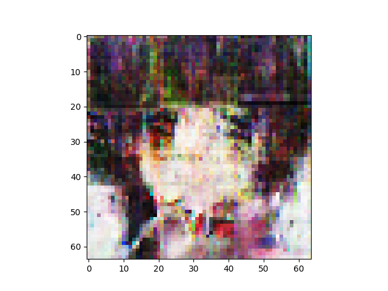

n_latent:1200 

n_base_channels:32 

pixel-by-pixel loss weight initially 1 and decay by 0.95 every 25 combo epochs 

n_solo_epochs:0 

n_combo_epochs:600 

max_disc_loss :999 

Epoch0, VAE Training loss 7305.12793, ResNet Training loss 0.3423895538, Time used 50.33

Epoch1, VAE Training loss 6948.64746, ResNet Training loss 0.5226600170, Time used 45.42

Epoch2, VAE Training loss 6882.78564, ResNet Training loss 0.2652734816, Time used 45.26

Epoch3, VAE Training loss 6838.77295, ResNet Training loss 0.1592676193, Time used 45.57

Epoch4, VAE Training loss 6878.29150, ResNet Training loss 0.3269093931, Time used 45.46

Epoch5, VAE Training loss 6834.23926, ResNet Training loss 0.1401608139, Time used 45.31

Epoch6, VAE Training loss 6878.84033, ResNet Training loss 0.2325797975, Time used 45.49

Epoch7, VAE Training loss 6868.95996, ResNet Training loss 0.2204188406, Time used 45.31

Epoch8, VAE Training loss 6883.24805, ResNet Training loss 0.2432475090, Time used 45.44

Epoch9, VAE Training loss 6875.96387, ResNet Training loss 0.1542852074, Time used 45.54

Epoch10, VAE Training loss 6891.00684, ResNet Training loss 0.2858581245, Time used 45.46

Epoch11, VAE Training loss 6845.61816, ResNet Training loss 0.1184075102, Time used 45.08

Epoch12, VAE Training loss 6876.46631, ResNet Training loss 0.2225715667, Time used 45.02

Epoch13, VAE Training loss 6890.57275, ResNet Training loss 0.2408475578, Time used 44.97

Epoch14, VAE Training loss 6854.03418, ResNet Training loss 0.1607684344, Time used 45.07

Epoch15, VAE Training loss 6852.00293, ResNet Training loss 0.1715508401, Time used 45.55

Epoch16, VAE Training loss 6850.82617, ResNet Training loss 0.2636310756, Time used 45.45

Epoch17, VAE Training loss 6814.71436, ResNet Training loss 0.1342458278, Time used 45.54

Epoch18, VAE Training loss 6830.19043, ResNet Training loss 0.1219456419, Time used 45.38

Epoch19, VAE Training loss 6867.65088, ResNet Training loss 0.1743935496, Time used 45.29

Epoch20, VAE Training loss 6832.33887, ResNet Training loss 0.1206709668, Time used 45.29

Epoch21, VAE Training loss 6811.83252, ResNet Training loss 0.0274446085, Time used 45.15

Epoch22, VAE Training loss 6819.71289, ResNet Training loss 0.1162941977, Time used 45.54

Epoch23, VAE Training loss 6847.67188, ResNet Training loss 0.1715570539, Time used 45.39

Epoch24, VAE Training loss 6843.85205, ResNet Training loss 0.1829054505, Time used 45.14

Epoch25, VAE Training loss 6524.24756, ResNet Training loss 0.2250104696, Time used 45.23

Epoch26, VAE Training loss 6487.65186, ResNet Training loss 0.0688866973, Time used 45.14

Epoch27, VAE Training loss 6524.52783, ResNet Training loss 0.1667308956, Time used 45.21

Epoch28, VAE Training loss 6498.55127, ResNet Training loss 0.1403320581, Time used 45.37

Epoch29, VAE Training loss 6435.87598, ResNet Training loss 0.1405460536, Time used 45.36

Epoch30, VAE Training loss 6474.68896, ResNet Training loss 0.0976999328, Time used 45.39

Epoch31, VAE Training loss 6521.35303, ResNet Training loss 0.2302937508, Time used 45.45

Epoch32, VAE Training loss 6516.30908, ResNet Training loss 0.1431022584, Time used 45.26

Epoch33, VAE Training loss 6519.46924, ResNet Training loss 0.2227256745, Time used 44.93

Epoch34, VAE Training loss 6503.39160, ResNet Training loss 0.2035609633, Time used 45.00

Epoch35, VAE Training loss 6509.71387, ResNet Training loss 0.2517713904, Time used 45.22

Epoch36, VAE Training loss 6509.65381, ResNet Training loss 0.2530433834, Time used 45.26

Epoch37, VAE Training loss 6432.76660, ResNet Training loss 0.0345879234, Time used 45.35

Epoch38, VAE Training loss 6485.79395, ResNet Training loss 0.1296573728, Time used 45.19

Epoch39, VAE Training loss 6464.97656, ResNet Training loss 0.1609123945, Time used 45.30

Epoch40, VAE Training loss 6438.91211, ResNet Training loss 0.0055551366, Time used 44.97

Epoch41, VAE Training loss 6434.50146, ResNet Training loss 0.0004409810, Time used 45.26

Epoch42, VAE Training loss 6484.89453, ResNet Training loss 0.0441540368, Time used 45.31

Epoch43, VAE Training loss 6495.06689, ResNet Training loss 0.1698642522, Time used 45.46

Epoch44, VAE Training loss 6488.59082, ResNet Training loss 0.1316368282, Time used 45.27

Epoch45, VAE Training loss 6450.30566, ResNet Training loss 0.1725929826, Time used 45.34

Epoch46, VAE Training loss 6484.00781, ResNet Training loss 0.1538381875, Time used 45.30

Epoch47, VAE Training loss 6465.90186, ResNet Training loss 0.1005211249, Time used 45.29

Epoch48, VAE Training loss 6471.69189, ResNet Training loss 0.1309539825, Time used 45.17

Epoch49, VAE Training loss 6512.37695, ResNet Training loss 0.3594351709, Time used 44.90

Epoch50, VAE Training loss 6190.86523, ResNet Training loss 0.3793535531, Time used 45.13

Epoch51, VAE Training loss 6186.15088, ResNet Training loss 0.2728960812, Time used 45.10

Epoch52, VAE Training loss 6199.80811, ResNet Training loss 0.3387387693, Time used 45.10

Epoch53, VAE Training loss 6218.86914, ResNet Training loss 0.3546747863, Time used 45.01

Epoch54, VAE Training loss 6197.40479, ResNet Training loss 0.3041302860, Time used 45.12

Epoch55, VAE Training loss 6196.64404, ResNet Training loss 0.1911907792, Time used 45.42

Epoch56, VAE Training loss 6201.03125, ResNet Training loss 0.2961440980, Time used 45.33

Epoch57, VAE Training loss 6181.15918, ResNet Training loss 0.2024702728, Time used 45.14

Epoch58, VAE Training loss 6182.89746, ResNet Training loss 0.1920044422, Time used 45.27

Epoch59, VAE Training loss 6207.13135, ResNet Training loss 0.2719587684, Time used 45.32

Epoch60, VAE Training loss 6217.88818, ResNet Training loss 0.2972636819, Time used 45.04

Epoch61, VAE Training loss 6208.02881, ResNet Training loss 0.3426045179, Time used 44.94

Epoch62, VAE Training loss 6154.34424, ResNet Training loss 0.0672840178, Time used 45.16

Epoch63, VAE Training loss 6224.39111, ResNet Training loss 0.3418507874, Time used 45.05

Epoch64, VAE Training loss 6211.70898, ResNet Training loss 0.3013299406, Time used 45.25

Epoch65, VAE Training loss 6121.77246, ResNet Training loss 0.1445601434, Time used 45.64

Epoch66, VAE Training loss 6205.70020, ResNet Training loss 0.2627701461, Time used 45.30

Epoch67, VAE Training loss 6225.28223, ResNet Training loss 0.4486102164, Time used 45.16

Epoch68, VAE Training loss 6243.81250, ResNet Training loss 0.4461641610, Time used 45.20

Epoch69, VAE Training loss 6236.69189, ResNet Training loss 0.3720400035, Time used 45.35

Epoch70, VAE Training loss 6243.44873, ResNet Training loss 0.4250746965, Time used 45.16

Epoch71, VAE Training loss 6180.12793, ResNet Training loss 0.0858024806, Time used 45.29

Epoch72, VAE Training loss 6223.30908, ResNet Training loss 0.3449340761, Time used 45.23

Epoch73, VAE Training loss 6229.89893, ResNet Training loss 0.4048647285, Time used 45.45

Epoch74, VAE Training loss 6239.89844, ResNet Training loss 0.3654614389, Time used 45.41

Epoch75, VAE Training loss 5929.85742, ResNet Training loss 0.3454222977, Time used 45.29

Epoch76, VAE Training loss 5932.49561, ResNet Training loss 0.3199770749, Time used 45.47

Epoch77, VAE Training loss 5942.55078, ResNet Training loss 0.3974883556, Time used 45.31

Epoch78, VAE Training loss 5908.08887, ResNet Training loss 0.1756701171, Time used 45.34

Epoch79, VAE Training loss 5930.92236, ResNet Training loss 0.3840951920, Time used 45.30

Epoch80, VAE Training loss 5908.02832, ResNet Training loss 0.2098523527, Time used 45.10

Epoch81, VAE Training loss 5908.49805, ResNet Training loss 0.2497742474, Time used 44.97

Epoch82, VAE Training loss 5931.92090, ResNet Training loss 0.4333066642, Time used 45.34

Epoch83, VAE Training loss 5917.35742, ResNet Training loss 0.2810973227, Time used 44.96

Epoch84, VAE Training loss 5931.60547, ResNet Training loss 0.2938155830, Time used 44.94

Epoch85, VAE Training loss 5910.12598, ResNet Training loss 0.3188538849, Time used 44.92

Epoch86, VAE Training loss 5926.43164, ResNet Training loss 0.3420906961, Time used 45.19

Epoch87, VAE Training loss 5943.88086, ResNet Training loss 0.3236086667, Time used 45.28

Epoch88, VAE Training loss 5944.39844, ResNet Training loss 0.3482200503, Time used 45.28

Epoch89, VAE Training loss 5917.56787, ResNet Training loss 0.3084196448, Time used 45.21

Epoch90, VAE Training loss 5891.45459, ResNet Training loss 0.2579711378, Time used 45.40

Epoch91, VAE Training loss 5876.77539, ResNet Training loss 0.0764803439, Time used 45.33

Epoch92, VAE Training loss 5935.15088, ResNet Training loss 0.3520649374, Time used 45.15

Epoch93, VAE Training loss 5952.10547, ResNet Training loss 0.4047185779, Time used 45.07

Epoch94, VAE Training loss 5949.43555, ResNet Training loss 0.3397867084, Time used 45.08

Epoch95, VAE Training loss 5867.66211, ResNet Training loss 0.1123764142, Time used 45.11

Epoch96, VAE Training loss 5865.25879, ResNet Training loss 0.0911195353, Time used 45.39

Epoch97, VAE Training loss 5907.01367, ResNet Training loss 0.1955541521, Time used 45.19

Epoch98, VAE Training loss 5947.74072, ResNet Training loss 0.3619008660, Time used 45.37

Epoch99, VAE Training loss 5889.60352, ResNet Training loss 0.2248211503, Time used 45.23

Epoch100, VAE Training loss 5651.92432, ResNet Training loss 0.3407669663, Time used 45.30

Epoch101, VAE Training loss 5655.54004, ResNet Training loss 0.3695407808, Time used 45.29

Epoch102, VAE Training loss 5650.11768, ResNet Training loss 0.3583779931, Time used 45.30

Epoch103, VAE Training loss 5621.77686, ResNet Training loss 0.1886860877, Time used 45.61

Epoch104, VAE Training loss 5677.66846, ResNet Training loss 0.4276855588, Time used 45.38

Epoch105, VAE Training loss 5670.37891, ResNet Training loss 0.4297477901, Time used 45.43

Epoch106, VAE Training loss 5660.45752, ResNet Training loss 0.3716260195, Time used 45.19

Epoch107, VAE Training loss 5680.73926, ResNet Training loss 0.3962250650, Time used 45.06

Epoch108, VAE Training loss 5681.02051, ResNet Training loss 0.3851286769, Time used 44.90

Epoch109, VAE Training loss 5673.58594, ResNet Training loss 0.3670901954, Time used 45.20

Epoch110, VAE Training loss 5671.98340, ResNet Training loss 0.3566094935, Time used 45.52

Epoch111, VAE Training loss 5660.66016, ResNet Training loss 0.2828666270, Time used 45.31

Epoch112, VAE Training loss 5667.87695, ResNet Training loss 0.2696009278, Time used 45.13

Epoch113, VAE Training loss 5648.00244, ResNet Training loss 0.2158887535, Time used 45.62

Epoch114, VAE Training loss 5657.92041, ResNet Training loss 0.2559463084, Time used 45.21

Epoch115, VAE Training loss 5652.84521, ResNet Training loss 0.3116133511, Time used 45.07

Epoch116, VAE Training loss 5670.83496, ResNet Training loss 0.2928414941, Time used 45.33

Epoch117, VAE Training loss 5669.17139, ResNet Training loss 0.2756264508, Time used 45.29

Epoch118, VAE Training loss 5686.57031, ResNet Training loss 0.3549659252, Time used 45.15

Epoch119, VAE Training loss 5665.10254, ResNet Training loss 0.2383563221, Time used 45.18

Epoch120, VAE Training loss 5677.76660, ResNet Training loss 0.3153312802, Time used 45.07

Epoch121, VAE Training loss 5671.71631, ResNet Training loss 0.2573353052, Time used 44.99

Epoch122, VAE Training loss 5646.39990, ResNet Training loss 0.1646128297, Time used 45.25

Epoch123, VAE Training loss 5667.38965, ResNet Training loss 0.2539636195, Time used 45.39

Epoch124, VAE Training loss 5642.80078, ResNet Training loss 0.2367842197, Time used 45.18

Epoch125, VAE Training loss 5395.56104, ResNet Training loss 0.3234899938, Time used 45.33

Epoch126, VAE Training loss 5406.00635, ResNet Training loss 0.3476558924, Time used 45.30

Epoch127, VAE Training loss 5423.64062, ResNet Training loss 0.3078957200, Time used 45.41

Epoch128, VAE Training loss 5352.23340, ResNet Training loss 0.1740007401, Time used 45.28

Epoch129, VAE Training loss 5347.32764, ResNet Training loss 0.1447771639, Time used 45.37

Epoch130, VAE Training loss 5351.96094, ResNet Training loss 0.1836930066, Time used 45.44

Epoch131, VAE Training loss 5349.56299, ResNet Training loss 0.1228233650, Time used 45.22

Epoch132, VAE Training loss 5381.22461, ResNet Training loss 0.2196777463, Time used 45.32

Epoch133, VAE Training loss 5420.15283, ResNet Training loss 0.3081713319, Time used 45.44

Epoch134, VAE Training loss 5376.56250, ResNet Training loss 0.1667110920, Time used 45.47

Epoch135, VAE Training loss 5422.27686, ResNet Training loss 0.3219419718, Time used 45.33

Epoch136, VAE Training loss 5433.23389, ResNet Training loss 0.2992472351, Time used 45.16

Epoch137, VAE Training loss 5434.15186, ResNet Training loss 0.2843981981, Time used 45.25

Epoch138, VAE Training loss 5411.83057, ResNet Training loss 0.2329631597, Time used 45.14

Epoch139, VAE Training loss 5401.19043, ResNet Training loss 0.2268780172, Time used 45.40

Epoch140, VAE Training loss 5431.80957, ResNet Training loss 0.2486785352, Time used 45.40

Epoch141, VAE Training loss 5362.31104, ResNet Training loss 0.1439128369, Time used 45.37

Epoch142, VAE Training loss 5418.20850, ResNet Training loss 0.1978420168, Time used 45.31

Epoch143, VAE Training loss 5363.91650, ResNet Training loss 0.0849699527, Time used 45.25

Epoch144, VAE Training loss 5379.68262, ResNet Training loss 0.1748850793, Time used 45.40

Epoch145, VAE Training loss 5422.53955, ResNet Training loss 0.2760874927, Time used 45.18

Epoch146, VAE Training loss 5378.89209, ResNet Training loss 0.2168089449, Time used 45.32

Epoch147, VAE Training loss 5412.61475, ResNet Training loss 0.2594356537, Time used 45.01

Epoch148, VAE Training loss 5365.07959, ResNet Training loss 0.0782908499, Time used 45.39

Epoch149, VAE Training loss 5400.56641, ResNet Training loss 0.3202247024, Time used 45.08

Epoch150, VAE Training loss 5174.78027, ResNet Training loss 0.3138782680, Time used 45.17

Epoch151, VAE Training loss 5165.18652, ResNet Training loss 0.2308048606, Time used 45.28

Epoch152, VAE Training loss 5170.24121, ResNet Training loss 0.2378527671, Time used 45.20

Epoch153, VAE Training loss 5145.68994, ResNet Training loss 0.2522544861, Time used 45.35

Epoch154, VAE Training loss 5051.82666, ResNet Training loss 0.0033315094, Time used 45.23

Epoch155, VAE Training loss 5037.06982, ResNet Training loss 0.0090680392, Time used 45.31

Epoch156, VAE Training loss 5129.80469, ResNet Training loss 0.1198076010, Time used 44.98

Epoch157, VAE Training loss 5094.20752, ResNet Training loss 0.1333192736, Time used 44.90

Epoch158, VAE Training loss 5038.31689, ResNet Training loss 0.0109696658, Time used 44.88

Epoch159, VAE Training loss 5116.42578, ResNet Training loss 0.0877966285, Time used 44.93

Epoch160, VAE Training loss 5096.25879, ResNet Training loss 0.0016704217, Time used 44.87

Epoch161, VAE Training loss 5132.84424, ResNet Training loss 0.3612140715, Time used 44.96

Epoch162, VAE Training loss 5114.45752, ResNet Training loss 0.1086704805, Time used 45.32

Epoch163, VAE Training loss 5080.30859, ResNet Training loss 0.1053448319, Time used 45.32

Epoch164, VAE Training loss 5166.48047, ResNet Training loss 0.2628044188, Time used 45.26

Epoch165, VAE Training loss 5194.71826, ResNet Training loss 0.3424123824, Time used 45.35

Epoch166, VAE Training loss 5155.00830, ResNet Training loss 0.1924392283, Time used 45.19

Epoch167, VAE Training loss 5181.26025, ResNet Training loss 0.3031973541, Time used 45.15

Epoch168, VAE Training loss 5150.33447, ResNet Training loss 0.1935569644, Time used 45.26

Epoch169, VAE Training loss 5170.88623, ResNet Training loss 0.2326575965, Time used 45.43

Epoch170, VAE Training loss 5184.89648, ResNet Training loss 0.2428004444, Time used 45.06

Epoch171, VAE Training loss 5170.50830, ResNet Training loss 0.2006001174, Time used 44.87

Epoch172, VAE Training loss 5189.62939, ResNet Training loss 0.1759558767, Time used 45.11

Epoch173, VAE Training loss 5165.89648, ResNet Training loss 0.2036429197, Time used 45.12

Epoch174, VAE Training loss 5151.70752, ResNet Training loss 0.1169777736, Time used 45.15

Epoch175, VAE Training loss 4925.03125, ResNet Training loss 0.1853614599, Time used 45.31

Epoch176, VAE Training loss 4937.94922, ResNet Training loss 0.1893753111, Time used 45.08

Epoch177, VAE Training loss 4953.04932, ResNet Training loss 0.2154408544, Time used 45.35

Epoch178, VAE Training loss 4961.03809, ResNet Training loss 0.1759487242, Time used 45.47

Epoch179, VAE Training loss 4952.54004, ResNet Training loss 0.1949431002, Time used 45.21

Epoch180, VAE Training loss 4944.20020, ResNet Training loss 0.1788233370, Time used 45.20

Epoch181, VAE Training loss 4953.37988, ResNet Training loss 0.1585126519, Time used 45.14

Epoch182, VAE Training loss 4978.52686, ResNet Training loss 0.1680114418, Time used 45.40

Epoch183, VAE Training loss 4961.68799, ResNet Training loss 0.1702613384, Time used 45.07

Epoch184, VAE Training loss 4908.05664, ResNet Training loss 0.1478691101, Time used 45.06

Epoch185, VAE Training loss 4934.90527, ResNet Training loss 0.2023376971, Time used 44.96

Epoch186, VAE Training loss 4954.83057, ResNet Training loss 0.1738615036, Time used 44.90

Epoch187, VAE Training loss 4961.20703, ResNet Training loss 0.1242607385, Time used 44.85

Epoch188, VAE Training loss 4953.78809, ResNet Training loss 0.1485583484, Time used 44.85

Epoch189, VAE Training loss 4939.14014, ResNet Training loss 0.1891440749, Time used 44.92

Epoch190, VAE Training loss 4952.66602, ResNet Training loss 0.1441859454, Time used 44.90

Epoch191, VAE Training loss 4958.97803, ResNet Training loss 0.2107636631, Time used 44.91

Epoch192, VAE Training loss 4976.34229, ResNet Training loss 0.2048386484, Time used 44.87

Epoch193, VAE Training loss 4938.62939, ResNet Training loss 0.0738848969, Time used 44.91

Epoch194, VAE Training loss 4918.94922, ResNet Training loss 0.0825443342, Time used 44.96

Epoch195, VAE Training loss 4886.63330, ResNet Training loss 0.1145735756, Time used 44.86

Epoch196, VAE Training loss 4911.23486, ResNet Training loss 0.1689023525, Time used 44.89

Epoch197, VAE Training loss 4973.16455, ResNet Training loss 0.1571855098, Time used 44.99

Epoch198, VAE Training loss 4977.28271, ResNet Training loss 0.1808299273, Time used 45.14

Epoch199, VAE Training loss 4985.98682, ResNet Training loss 0.1029230282, Time used 45.04

Epoch200, VAE Training loss 4747.76855, ResNet Training loss 0.2044592351, Time used 44.89

Epoch201, VAE Training loss 4697.17871, ResNet Training loss 0.1601111740, Time used 45.02

Epoch202, VAE Training loss 4686.49707, ResNet Training loss 0.1435110420, Time used 45.21

Epoch203, VAE Training loss 4638.72119, ResNet Training loss 0.1039667130, Time used 45.16

Epoch204, VAE Training loss 4644.81592, ResNet Training loss 0.0598411560, Time used 45.12

Epoch205, VAE Training loss 4682.07520, ResNet Training loss 0.0657203645, Time used 45.32

Epoch206, VAE Training loss 4680.69727, ResNet Training loss 0.1394385397, Time used 45.42

Epoch207, VAE Training loss 4718.63623, ResNet Training loss 0.1861961633, Time used 45.48

Epoch208, VAE Training loss 4725.75391, ResNet Training loss 0.2029109299, Time used 45.30

Epoch209, VAE Training loss 4738.64355, ResNet Training loss 0.1511060297, Time used 45.19

Epoch210, VAE Training loss 4726.93359, ResNet Training loss 0.1300609261, Time used 44.94

Epoch211, VAE Training loss 4674.31299, ResNet Training loss 0.1150517911, Time used 44.93

Epoch212, VAE Training loss 4696.34961, ResNet Training loss 0.0794726014, Time used 45.09

Epoch213, VAE Training loss 4684.40430, ResNet Training loss 0.1649317443, Time used 44.93

Epoch214, VAE Training loss 4689.73828, ResNet Training loss 0.1286012083, Time used 44.93

Epoch215, VAE Training loss 4700.24707, ResNet Training loss 0.1166304126, Time used 44.86

Epoch216, VAE Training loss 4719.64746, ResNet Training loss 0.1170600578, Time used 44.93

Epoch217, VAE Training loss 4699.04980, ResNet Training loss 0.1266138852, Time used 45.12

Epoch218, VAE Training loss 4667.48779, ResNet Training loss 0.0510335229, Time used 45.39

Epoch219, VAE Training loss 4719.24365, ResNet Training loss 0.1537382752, Time used 45.41

Epoch220, VAE Training loss 4771.29834, ResNet Training loss 0.1978547871, Time used 45.33

Epoch221, VAE Training loss 4728.34375, ResNet Training loss 0.0899892002, Time used 45.12

Epoch222, VAE Training loss 4749.02881, ResNet Training loss 0.1351986676, Time used 45.07

Epoch223, VAE Training loss 4761.03760, ResNet Training loss 0.1154866517, Time used 45.24

Epoch224, VAE Training loss 4723.10938, ResNet Training loss 0.1364202201, Time used 45.29

Epoch225, VAE Training loss 4556.58789, ResNet Training loss 0.1120073646, Time used 45.42

Epoch226, VAE Training loss 4576.28711, ResNet Training loss 0.1563092619, Time used 45.19

Epoch227, VAE Training loss 4540.39355, ResNet Training loss 0.1436668485, Time used 45.23

Epoch228, VAE Training loss 4488.44824, ResNet Training loss 0.2379879951, Time used 45.26

Epoch229, VAE Training loss 4497.97119, ResNet Training loss 0.1241705865, Time used 45.22

Epoch230, VAE Training loss 4505.23682, ResNet Training loss 0.1294462681, Time used 45.17

Epoch231, VAE Training loss 4527.74170, ResNet Training loss 0.1241686195, Time used 45.47

Epoch232, VAE Training loss 4511.85889, ResNet Training loss 0.0741021261, Time used 45.26

Epoch233, VAE Training loss 4531.94434, ResNet Training loss 0.1077432036, Time used 45.19

Epoch234, VAE Training loss 4508.89746, ResNet Training loss 0.1278065294, Time used 45.33

Epoch235, VAE Training loss 4523.80176, ResNet Training loss 0.1260225028, Time used 45.22

Epoch236, VAE Training loss 4491.17773, ResNet Training loss 0.1557416916, Time used 45.24

Epoch237, VAE Training loss 4475.82324, ResNet Training loss 0.0903999209, Time used 45.34

Epoch238, VAE Training loss 4473.37354, ResNet Training loss 0.0410380252, Time used 45.24

Epoch239, VAE Training loss 4432.09180, ResNet Training loss 0.0419427752, Time used 45.13

Epoch240, VAE Training loss 4485.81836, ResNet Training loss 0.1177439392, Time used 45.01

Epoch241, VAE Training loss 4489.98877, ResNet Training loss 0.1443463713, Time used 45.44

Epoch242, VAE Training loss 4522.26562, ResNet Training loss 0.1247640550, Time used 45.42

Epoch243, VAE Training loss 4507.69092, ResNet Training loss 0.1360633820, Time used 45.18

Epoch244, VAE Training loss 4498.14795, ResNet Training loss 0.1173655987, Time used 45.30

Epoch245, VAE Training loss 4534.08643, ResNet Training loss 0.1005120501, Time used 45.21

Epoch246, VAE Training loss 4491.61182, ResNet Training loss 0.0707405657, Time used 44.96

Epoch247, VAE Training loss 4501.52490, ResNet Training loss 0.1380874366, Time used 45.06

Epoch248, VAE Training loss 4524.58008, ResNet Training loss 0.1500344425, Time used 45.05

Epoch249, VAE Training loss 4521.99902, ResNet Training loss 0.1418451667, Time used 44.91

Epoch250, VAE Training loss 4326.69238, ResNet Training loss 0.1000294983, Time used 45.04

Epoch251, VAE Training loss 4343.50391, ResNet Training loss 0.1120516285, Time used 45.09

Epoch252, VAE Training loss 4319.36963, ResNet Training loss 0.1165351123, Time used 45.44

Epoch253, VAE Training loss 4300.19922, ResNet Training loss 0.1066974923, Time used 45.25

Epoch254, VAE Training loss 4288.60400, ResNet Training loss 0.0927852988, Time used 45.16

Epoch255, VAE Training loss 4322.22754, ResNet Training loss 0.0855567381, Time used 45.20

Epoch256, VAE Training loss 4335.93604, ResNet Training loss 0.1145680100, Time used 45.20

Epoch257, VAE Training loss 4333.89209, ResNet Training loss 0.0757549480, Time used 45.34

Epoch258, VAE Training loss 4316.73975, ResNet Training loss 0.0705647543, Time used 45.39

Epoch259, VAE Training loss 4319.36377, ResNet Training loss 0.0846213102, Time used 45.29

Epoch260, VAE Training loss 4342.48730, ResNet Training loss 0.0779325292, Time used 45.27

Epoch261, VAE Training loss 4353.15967, ResNet Training loss 0.1774900109, Time used 45.35

Epoch262, VAE Training loss 4297.93359, ResNet Training loss 0.0628613085, Time used 45.37

Epoch263, VAE Training loss 4284.02197, ResNet Training loss 0.1571803093, Time used 45.29

Epoch264, VAE Training loss 4314.25342, ResNet Training loss 0.0672999099, Time used 45.09

Epoch265, VAE Training loss 4293.30273, ResNet Training loss 0.0999440327, Time used 45.30

Epoch266, VAE Training loss 4329.34082, ResNet Training loss 0.1426854134, Time used 45.12

Epoch267, VAE Training loss 4285.35400, ResNet Training loss 0.0889171660, Time used 45.34

Epoch268, VAE Training loss 4298.22754, ResNet Training loss 0.1083496436, Time used 45.14

Epoch269, VAE Training loss 4299.32666, ResNet Training loss 0.0933539495, Time used 45.05

Epoch270, VAE Training loss 4292.78418, ResNet Training loss 0.0522154085, Time used 44.93

Epoch271, VAE Training loss 4283.87451, ResNet Training loss 0.1031173319, Time used 44.91

Epoch272, VAE Training loss 4297.10059, ResNet Training loss 0.0994339287, Time used 44.92

Epoch273, VAE Training loss 4290.57080, ResNet Training loss 0.1217489466, Time used 45.31

Epoch274, VAE Training loss 4266.14795, ResNet Training loss 0.1119355485, Time used 45.20

Epoch275, VAE Training loss 4110.24707, ResNet Training loss 0.0924948826, Time used 45.23

Epoch276, VAE Training loss 4094.93750, ResNet Training loss 0.0857390165, Time used 45.16

Epoch277, VAE Training loss 4100.41309, ResNet Training loss 0.1408098787, Time used 45.37

Epoch278, VAE Training loss 4065.94775, ResNet Training loss 0.0676188543, Time used 45.07

Epoch279, VAE Training loss 4096.21094, ResNet Training loss 0.0685309991, Time used 45.33

Epoch280, VAE Training loss 4099.74902, ResNet Training loss 0.0567330047, Time used 45.24

Epoch281, VAE Training loss 4109.06836, ResNet Training loss 0.0619910620, Time used 45.41

Epoch282, VAE Training loss 4055.95972, ResNet Training loss 0.0787143111, Time used 45.36

Epoch283, VAE Training loss 4089.66577, ResNet Training loss 0.0681948885, Time used 45.27

Epoch284, VAE Training loss 4062.12549, ResNet Training loss 0.0358028896, Time used 45.12

Epoch285, VAE Training loss 4109.62305, ResNet Training loss 0.1195457354, Time used 45.40

Epoch286, VAE Training loss 4104.46240, ResNet Training loss 0.1573181897, Time used 45.11

Epoch287, VAE Training loss 4107.33350, ResNet Training loss 0.0972098410, Time used 44.98

Epoch288, VAE Training loss 4094.52954, ResNet Training loss 0.1010826454, Time used 44.97

Epoch289, VAE Training loss 4113.71631, ResNet Training loss 0.0892367437, Time used 45.34

Epoch290, VAE Training loss 4130.36035, ResNet Training loss 0.1202046424, Time used 45.43

Epoch291, VAE Training loss 4139.12207, ResNet Training loss 0.0690905377, Time used 45.36

Epoch292, VAE Training loss 4163.54932, ResNet Training loss 0.0958940983, Time used 45.18

Epoch293, VAE Training loss 4112.03418, ResNet Training loss 0.0355040543, Time used 45.27

Epoch294, VAE Training loss 4107.27588, ResNet Training loss 0.0813621134, Time used 45.26

Epoch295, VAE Training loss 4059.82129, ResNet Training loss 0.0893879756, Time used 45.41

Epoch296, VAE Training loss 4053.29688, ResNet Training loss 0.0587939322, Time used 45.32

Epoch297, VAE Training loss 4087.89453, ResNet Training loss 0.1115010753, Time used 45.31

Epoch298, VAE Training loss 4140.66650, ResNet Training loss 0.0863953978, Time used 45.22

Epoch299, VAE Training loss 4140.22021, ResNet Training loss 0.1186993197, Time used 45.31

Epoch300, VAE Training loss 3894.90454, ResNet Training loss 0.1115623415, Time used 45.14

Epoch301, VAE Training loss 3862.95093, ResNet Training loss 0.0593796968, Time used 45.18

Epoch302, VAE Training loss 3848.98340, ResNet Training loss 0.1132321358, Time used 45.14

Epoch303, VAE Training loss 3859.16748, ResNet Training loss 0.0589626506, Time used 44.84

Epoch304, VAE Training loss 3879.71216, ResNet Training loss 0.0409868434, Time used 45.18

Epoch305, VAE Training loss 3901.61108, ResNet Training loss 0.0875152871, Time used 45.15

Epoch306, VAE Training loss 3894.63940, ResNet Training loss 0.0713910833, Time used 45.48

Epoch307, VAE Training loss 3855.51562, ResNet Training loss 0.0710285753, Time used 45.23

Epoch308, VAE Training loss 3876.72534, ResNet Training loss 0.1055836976, Time used 45.44

Epoch309, VAE Training loss 3887.55420, ResNet Training loss 0.1541534662, Time used 45.19

Epoch310, VAE Training loss 3914.10742, ResNet Training loss 0.0844334811, Time used 45.34

Epoch311, VAE Training loss 3895.87231, ResNet Training loss 0.0901520699, Time used 45.36

Epoch312, VAE Training loss 3916.13159, ResNet Training loss 0.0699386597, Time used 44.96

Epoch313, VAE Training loss 3896.63843, ResNet Training loss 0.1051699445, Time used 45.00

Epoch314, VAE Training loss 3881.27856, ResNet Training loss 0.0171278585, Time used 44.90

Epoch315, VAE Training loss 3872.28711, ResNet Training loss 0.0632652417, Time used 44.89

Epoch316, VAE Training loss 3920.08325, ResNet Training loss 0.0949201658, Time used 44.95

Epoch317, VAE Training loss 3903.46753, ResNet Training loss 0.0755387321, Time used 45.10

Epoch318, VAE Training loss 3948.63745, ResNet Training loss 0.0756553486, Time used 45.13

Epoch319, VAE Training loss 3927.61475, ResNet Training loss 0.1242624372, Time used 44.95

Epoch320, VAE Training loss 3956.54443, ResNet Training loss 0.0692493618, Time used 45.38

Epoch321, VAE Training loss 3942.56201, ResNet Training loss 0.1184020415, Time used 45.23

Epoch322, VAE Training loss 3957.35327, ResNet Training loss 0.0722130537, Time used 44.84

Epoch323, VAE Training loss 3922.50830, ResNet Training loss 0.0404170565, Time used 44.93

Epoch324, VAE Training loss 3915.57788, ResNet Training loss 0.0217884090, Time used 45.24

Epoch325, VAE Training loss 3788.93945, ResNet Training loss 0.1032725796, Time used 45.36

Epoch326, VAE Training loss 3761.94043, ResNet Training loss 0.0612378791, Time used 45.25

Epoch327, VAE Training loss 3716.34497, ResNet Training loss 0.1175969541, Time used 45.17

Epoch328, VAE Training loss 3741.05811, ResNet Training loss 0.0740102008, Time used 45.39

Epoch329, VAE Training loss 3736.93677, ResNet Training loss 0.1266941726, Time used 45.42

Epoch330, VAE Training loss 3752.76343, ResNet Training loss 0.0744348913, Time used 45.08

Epoch331, VAE Training loss 3758.19775, ResNet Training loss 0.0623686314, Time used 45.30

Epoch332, VAE Training loss 3764.74854, ResNet Training loss 0.1043613777, Time used 45.08

Epoch333, VAE Training loss 3771.70508, ResNet Training loss 0.0600472353, Time used 45.38

Epoch334, VAE Training loss 3751.46313, ResNet Training loss 0.1165220067, Time used 45.04

Epoch335, VAE Training loss 3725.28345, ResNet Training loss 0.0563352592, Time used 45.10

Epoch336, VAE Training loss 3710.99121, ResNet Training loss 0.0388164148, Time used 45.06

Epoch337, VAE Training loss 3740.57373, ResNet Training loss 0.0335390009, Time used 45.14

Epoch338, VAE Training loss 3756.04028, ResNet Training loss 0.0777532235, Time used 45.24

Epoch339, VAE Training loss 3757.00122, ResNet Training loss 0.0808698609, Time used 45.39

Epoch340, VAE Training loss 3749.79346, ResNet Training loss 0.0902831182, Time used 45.21

Epoch341, VAE Training loss 3743.85034, ResNet Training loss 0.0531433299, Time used 45.30

Epoch342, VAE Training loss 3675.35547, ResNet Training loss 0.0071033537, Time used 45.19

Epoch343, VAE Training loss 3728.83716, ResNet Training loss 0.0129376315, Time used 45.25

Epoch344, VAE Training loss 3682.00781, ResNet Training loss 0.0419005565, Time used 45.20

Epoch345, VAE Training loss 3762.81714, ResNet Training loss 0.0415333919, Time used 45.30

Epoch346, VAE Training loss 3798.50269, ResNet Training loss 0.0431600921, Time used 45.09

Epoch347, VAE Training loss 3788.49634, ResNet Training loss 0.0245325640, Time used 45.01

Epoch348, VAE Training loss 3805.79346, ResNet Training loss 0.0528352745, Time used 44.92

Epoch349, VAE Training loss 3730.35034, ResNet Training loss 0.0359185748, Time used 45.19

Epoch350, VAE Training loss 3600.97461, ResNet Training loss 0.1391622126, Time used 44.98

Epoch351, VAE Training loss 3666.91016, ResNet Training loss 0.0944708735, Time used 44.96

Epoch352, VAE Training loss 3658.19873, ResNet Training loss 0.0271614250, Time used 45.19

Epoch353, VAE Training loss 3626.04028, ResNet Training loss 0.0903978795, Time used 44.94

Epoch354, VAE Training loss 3614.57031, ResNet Training loss 0.0798043981, Time used 45.30

Epoch355, VAE Training loss 3632.50781, ResNet Training loss 0.0415536948, Time used 45.29

Epoch356, VAE Training loss 3596.58887, ResNet Training loss 0.0408073366, Time used 44.89

Epoch357, VAE Training loss 3616.04907, ResNet Training loss 0.0873020366, Time used 45.25

Epoch358, VAE Training loss 3632.17993, ResNet Training loss 0.0975316614, Time used 45.06

Epoch359, VAE Training loss 3625.37329, ResNet Training loss 0.0831717178, Time used 45.16

Epoch360, VAE Training loss 3570.20654, ResNet Training loss 0.1032898352, Time used 45.52

Epoch361, VAE Training loss 3583.46387, ResNet Training loss 0.0673531145, Time used 45.27

Epoch362, VAE Training loss 3579.69995, ResNet Training loss 0.0751745105, Time used 45.29

Epoch363, VAE Training loss 3559.34155, ResNet Training loss 0.0450042002, Time used 45.50

Epoch364, VAE Training loss 3637.14258, ResNet Training loss 0.0532262288, Time used 45.34

Epoch365, VAE Training loss 3622.94482, ResNet Training loss 0.0836341754, Time used 45.45

Epoch366, VAE Training loss 3560.50610, ResNet Training loss 0.0288464800, Time used 45.43

Epoch367, VAE Training loss 3541.19409, ResNet Training loss 0.0417158194, Time used 45.31

Epoch368, VAE Training loss 3608.78418, ResNet Training loss 0.0429228283, Time used 45.55

Epoch369, VAE Training loss 3630.95605, ResNet Training loss 0.1168732643, Time used 45.32

Epoch370, VAE Training loss 3606.10107, ResNet Training loss 0.0728834942, Time used 45.10

Epoch371, VAE Training loss 3564.81934, ResNet Training loss 0.1370498389, Time used 45.33

Epoch372, VAE Training loss 3549.42090, ResNet Training loss 0.0506205112, Time used 45.17

Epoch373, VAE Training loss 3560.37183, ResNet Training loss 0.0628040060, Time used 45.04

Epoch374, VAE Training loss 3581.46655, ResNet Training loss 0.1493019313, Time used 44.99

Epoch375, VAE Training loss 3428.08423, ResNet Training loss 0.0583402626, Time used 45.02

Epoch376, VAE Training loss 3432.76807, ResNet Training loss 0.1010755822, Time used 44.97

Epoch377, VAE Training loss 3391.77832, ResNet Training loss 0.0968730450, Time used 45.12

Epoch378, VAE Training loss 3404.94434, ResNet Training loss 0.0482541136, Time used 45.33

Epoch379, VAE Training loss 3372.72095, ResNet Training loss 0.1066468358, Time used 45.12

Epoch380, VAE Training loss 3401.64307, ResNet Training loss 0.0882888958, Time used 45.16

Epoch381, VAE Training loss 3393.13647, ResNet Training loss 0.0462246686, Time used 45.22

Epoch382, VAE Training loss 3449.45654, ResNet Training loss 0.0549699441, Time used 45.29

Epoch383, VAE Training loss 3478.78442, ResNet Training loss 0.0365252048, Time used 45.33

Epoch384, VAE Training loss 3466.27393, ResNet Training loss 0.0222693831, Time used 45.27

Epoch385, VAE Training loss 3319.66284, ResNet Training loss 0.0063484772, Time used 45.24

Epoch386, VAE Training loss 3416.24292, ResNet Training loss 0.0546477549, Time used 45.24

Epoch387, VAE Training loss 3451.83301, ResNet Training loss 0.0237517320, Time used 45.25

Epoch388, VAE Training loss 3477.52637, ResNet Training loss 0.0399818979, Time used 45.16

Epoch389, VAE Training loss 3504.98291, ResNet Training loss 0.0773983523, Time used 45.10

Epoch390, VAE Training loss 3498.92505, ResNet Training loss 0.0701442882, Time used 45.13

Epoch391, VAE Training loss 3485.59814, ResNet Training loss 0.0826020017, Time used 44.95

Epoch392, VAE Training loss 3506.73657, ResNet Training loss 0.0559388138, Time used 44.86

Epoch393, VAE Training loss 3456.81079, ResNet Training loss 0.0795584843, Time used 45.07

Epoch394, VAE Training loss 3486.35962, ResNet Training loss 0.0815286860, Time used 45.26

Epoch395, VAE Training loss 3498.65747, ResNet Training loss 0.0417814590, Time used 45.48

Epoch396, VAE Training loss 3461.89819, ResNet Training loss 0.0624482967, Time used 45.21

Epoch397, VAE Training loss 3443.34863, ResNet Training loss 0.1527876705, Time used 45.11

Epoch398, VAE Training loss 3465.35181, ResNet Training loss 0.0800312608, Time used 45.22

Epoch399, VAE Training loss 3461.85425, ResNet Training loss 0.0779212937, Time used 45.23

Epoch400, VAE Training loss 3352.69019, ResNet Training loss 0.0415459536, Time used 45.05

Epoch401, VAE Training loss 3363.14233, ResNet Training loss 0.0618387274, Time used 45.43

Epoch402, VAE Training loss 3366.04077, ResNet Training loss 0.0792417228, Time used 45.14

Epoch403, VAE Training loss 3319.87231, ResNet Training loss 0.0733566880, Time used 45.33

Epoch404, VAE Training loss 3303.94800, ResNet Training loss 0.0424259193, Time used 45.33

Epoch405, VAE Training loss 3332.31348, ResNet Training loss 0.0258294288, Time used 45.07

Epoch406, VAE Training loss 3295.50659, ResNet Training loss 0.0511986054, Time used 45.03

Epoch407, VAE Training loss 3292.12646, ResNet Training loss 0.0442830846, Time used 44.91

Epoch408, VAE Training loss 3347.64453, ResNet Training loss 0.0763880536, Time used 45.15

Epoch409, VAE Training loss 3355.79858, ResNet Training loss 0.0867725536, Time used 45.47

Epoch410, VAE Training loss 3340.27905, ResNet Training loss 0.0723064840, Time used 45.26

Epoch411, VAE Training loss 3313.88916, ResNet Training loss 0.0743887126, Time used 45.32

Epoch412, VAE Training loss 3315.54297, ResNet Training loss 0.0333515592, Time used 45.28

Epoch413, VAE Training loss 3368.64111, ResNet Training loss 0.0754138231, Time used 45.28

Epoch414, VAE Training loss 3314.15283, ResNet Training loss 0.0358424075, Time used 45.09

Epoch415, VAE Training loss 3285.38013, ResNet Training loss 0.0353015848, Time used 44.92

Epoch416, VAE Training loss 3307.56006, ResNet Training loss 0.0548530668, Time used 45.18

Epoch417, VAE Training loss 3329.04907, ResNet Training loss 0.0509302728, Time used 45.41

Epoch418, VAE Training loss 3311.75000, ResNet Training loss 0.0851910189, Time used 45.25

Epoch419, VAE Training loss 3336.89111, ResNet Training loss 0.0343001299, Time used 45.30

Epoch420, VAE Training loss 3280.75732, ResNet Training loss 0.0704659373, Time used 45.18

Epoch421, VAE Training loss 3339.30811, ResNet Training loss 0.0433426090, Time used 45.20

Epoch422, VAE Training loss 3323.20972, ResNet Training loss 0.0895936266, Time used 45.31

Epoch423, VAE Training loss 3362.43750, ResNet Training loss 0.0534648448, Time used 45.43

Epoch424, VAE Training loss 3342.94873, ResNet Training loss 0.0559083857, Time used 45.16

Epoch425, VAE Training loss 3222.22974, ResNet Training loss 0.0757881552, Time used 45.05

Epoch426, VAE Training loss 3196.43481, ResNet Training loss 0.1006943136, Time used 45.26

Epoch427, VAE Training loss 3177.58252, ResNet Training loss 0.1375364810, Time used 44.91

Epoch428, VAE Training loss 3209.93237, ResNet Training loss 0.0619515739, Time used 45.04

Epoch429, VAE Training loss 3181.45068, ResNet Training loss 0.0649289191, Time used 45.26

Epoch430, VAE Training loss 3150.58618, ResNet Training loss 0.0438458510, Time used 45.33

Epoch431, VAE Training loss 3126.18872, ResNet Training loss 0.0292830709, Time used 45.38

Epoch432, VAE Training loss 3126.97681, ResNet Training loss 0.0226671435, Time used 45.39

Epoch433, VAE Training loss 3160.97095, ResNet Training loss 0.0170550514, Time used 45.47

Epoch434, VAE Training loss 3196.80347, ResNet Training loss 0.0129063567, Time used 45.41

Epoch435, VAE Training loss 3197.17554, ResNet Training loss 0.0122812809, Time used 45.07

Epoch436, VAE Training loss 3128.16528, ResNet Training loss 0.0056117177, Time used 44.91

Epoch437, VAE Training loss 3157.31567, ResNet Training loss 0.0035014788, Time used 45.26

Epoch438, VAE Training loss 3157.90527, ResNet Training loss 0.0763170272, Time used 45.30

Epoch439, VAE Training loss 3189.77417, ResNet Training loss 0.0323151425, Time used 45.20

Epoch440, VAE Training loss 3203.73975, ResNet Training loss 0.0506555997, Time used 45.44

Epoch441, VAE Training loss 3217.57031, ResNet Training loss 0.0170961302, Time used 44.93

Epoch442, VAE Training loss 3306.67383, ResNet Training loss 0.0267824605, Time used 44.88

Epoch443, VAE Training loss 3261.70874, ResNet Training loss 0.0278430451, Time used 45.04

Epoch444, VAE Training loss 3249.51147, ResNet Training loss 0.0126470039, Time used 44.97

Epoch445, VAE Training loss 3262.00684, ResNet Training loss 0.0134937102, Time used 44.94

Epoch446, VAE Training loss 3239.96655, ResNet Training loss 0.0138332276, Time used 44.86

Epoch447, VAE Training loss 3159.12695, ResNet Training loss 0.0202757549, Time used 44.92

Epoch448, VAE Training loss 3350.58618, ResNet Training loss 0.0236551575, Time used 45.08

Epoch449, VAE Training loss 3323.85742, ResNet Training loss 0.0114073930, Time used 45.03

Epoch450, VAE Training loss 3148.72632, ResNet Training loss 0.0866850242, Time used 45.35

Epoch451, VAE Training loss 3043.96338, ResNet Training loss 0.1155218631, Time used 45.40

Epoch452, VAE Training loss 3031.83521, ResNet Training loss 0.0922879800, Time used 44.97

Epoch453, VAE Training loss 3084.67993, ResNet Training loss 0.0635170862, Time used 45.29

Epoch454, VAE Training loss 3065.83936, ResNet Training loss 0.0663657933, Time used 45.05

Epoch455, VAE Training loss 3049.33789, ResNet Training loss 0.0245385766, Time used 45.25

Epoch456, VAE Training loss 3216.95459, ResNet Training loss 0.0655496791, Time used 45.13

Epoch457, VAE Training loss 3136.90283, ResNet Training loss 0.0345357433, Time used 45.37

Epoch458, VAE Training loss 3064.54175, ResNet Training loss 0.0206800736, Time used 45.25

Epoch459, VAE Training loss 3064.96436, ResNet Training loss 0.2067915350, Time used 45.49

Epoch460, VAE Training loss 3106.22241, ResNet Training loss 0.0453084372, Time used 45.38

Epoch461, VAE Training loss 3111.42871, ResNet Training loss 0.0287165102, Time used 44.89

Epoch462, VAE Training loss 3141.97876, ResNet Training loss 0.0250063445, Time used 45.30

Epoch463, VAE Training loss 3117.55225, ResNet Training loss 0.0319604054, Time used 45.19

Epoch464, VAE Training loss 3088.11401, ResNet Training loss 0.0578534193, Time used 45.11

Epoch465, VAE Training loss 3060.69165, ResNet Training loss 0.0473570749, Time used 45.29

Epoch466, VAE Training loss 3119.75269, ResNet Training loss 0.0712789446, Time used 45.41

Epoch467, VAE Training loss 3180.21924, ResNet Training loss 0.0600722358, Time used 45.22

Epoch468, VAE Training loss 3204.32935, ResNet Training loss 0.0411408059, Time used 45.34

Epoch469, VAE Training loss 3164.68066, ResNet Training loss 0.0595977940, Time used 45.23

Epoch470, VAE Training loss 3113.38232, ResNet Training loss 0.0337584801, Time used 45.07

Epoch471, VAE Training loss 3094.89404, ResNet Training loss 0.0510239154, Time used 45.21

Epoch472, VAE Training loss 3145.06104, ResNet Training loss 0.0339502096, Time used 45.28

Epoch473, VAE Training loss 3130.84521, ResNet Training loss 0.0627410784, Time used 45.15

Epoch474, VAE Training loss 3204.03613, ResNet Training loss 0.0603215098, Time used 45.46

Epoch475, VAE Training loss 3058.26489, ResNet Training loss 0.0395087637, Time used 45.39

Epoch476, VAE Training loss 2986.74341, ResNet Training loss 0.0458736569, Time used 45.26

Epoch477, VAE Training loss 3089.06763, ResNet Training loss 0.0296751559, Time used 45.34

Epoch478, VAE Training loss 3103.73804, ResNet Training loss 0.0411868356, Time used 45.28

Epoch479, VAE Training loss 3083.95752, ResNet Training loss 0.0595378168, Time used 45.19

Epoch480, VAE Training loss 3075.52075, ResNet Training loss 0.0429200158, Time used 45.43

Epoch481, VAE Training loss 2963.18091, ResNet Training loss 0.0202299170, Time used 45.43

Epoch482, VAE Training loss 2984.64160, ResNet Training loss 0.0280025229, Time used 45.42

Epoch483, VAE Training loss 3041.76001, ResNet Training loss 0.0407057591, Time used 45.11

Epoch484, VAE Training loss 3071.33691, ResNet Training loss 0.0204595253, Time used 45.21

Epoch485, VAE Training loss 3041.68311, ResNet Training loss 0.0327245444, Time used 45.23

Epoch486, VAE Training loss 3114.54541, ResNet Training loss 0.0293609388, Time used 45.31

Epoch487, VAE Training loss 3000.09497, ResNet Training loss 0.0309819002, Time used 45.37

Epoch488, VAE Training loss 3029.05688, ResNet Training loss 0.0424256139, Time used 45.24

Epoch489, VAE Training loss 3045.19531, ResNet Training loss 0.0670767203, Time used 45.03

Epoch490, VAE Training loss 2971.42456, ResNet Training loss 0.0283382349, Time used 44.90

Epoch491, VAE Training loss 2877.25659, ResNet Training loss 0.0653767809, Time used 44.97

Epoch492, VAE Training loss 2937.17920, ResNet Training loss 0.0626857728, Time used 45.05

Epoch493, VAE Training loss 2977.21826, ResNet Training loss 0.0537334159, Time used 45.29

Epoch494, VAE Training loss 2980.70825, ResNet Training loss 0.0424631834, Time used 45.26

Epoch495, VAE Training loss 2996.60229, ResNet Training loss 0.0708558634, Time used 45.17

Epoch496, VAE Training loss 3037.34424, ResNet Training loss 0.0364654176, Time used 45.08

Epoch497, VAE Training loss 3043.18066, ResNet Training loss 0.0460792966, Time used 44.91

Epoch498, VAE Training loss 3014.87769, ResNet Training loss 0.0458174646, Time used 44.96

Epoch499, VAE Training loss 3010.59082, ResNet Training loss 0.0519505553, Time used 44.93

Epoch500, VAE Training loss 2805.62793, ResNet Training loss 0.0296075363, Time used 45.17

Epoch501, VAE Training loss 2937.67407, ResNet Training loss 0.0386977084, Time used 45.11

Epoch502, VAE Training loss 3003.66797, ResNet Training loss 0.0557195507, Time used 44.94

Epoch503, VAE Training loss 2915.03809, ResNet Training loss 0.0722806975, Time used 45.01

Epoch504, VAE Training loss 2925.32495, ResNet Training loss 0.0385939628, Time used 45.00

Epoch505, VAE Training loss 2901.26587, ResNet Training loss 0.0312023442, Time used 45.25

Epoch506, VAE Training loss 2814.27734, ResNet Training loss 0.0765176341, Time used 45.43

Epoch507, VAE Training loss 2790.51758, ResNet Training loss 0.0156005574, Time used 45.21

Epoch508, VAE Training loss 2772.04175, ResNet Training loss 0.0414017290, Time used 45.25

Epoch509, VAE Training loss 2797.43237, ResNet Training loss 0.1302445978, Time used 45.32

Epoch510, VAE Training loss 2764.75562, ResNet Training loss 0.0414091311, Time used 45.07

Epoch511, VAE Training loss 2895.43848, ResNet Training loss 0.0680691451, Time used 45.23

Epoch512, VAE Training loss 2835.81201, ResNet Training loss 0.0345627181, Time used 45.25

Epoch513, VAE Training loss 2905.32397, ResNet Training loss 0.0413172469, Time used 45.35

Epoch514, VAE Training loss 2803.75220, ResNet Training loss 0.0447881483, Time used 45.22

Epoch515, VAE Training loss 2943.82153, ResNet Training loss 0.0787207708, Time used 45.18

Epoch516, VAE Training loss 2892.30127, ResNet Training loss 0.0570881590, Time used 45.31

Epoch517, VAE Training loss 2925.59351, ResNet Training loss 0.0266781431, Time used 45.41

Epoch518, VAE Training loss 2947.69800, ResNet Training loss 0.0924075544, Time used 45.42

Epoch519, VAE Training loss 2924.49951, ResNet Training loss 0.0832014158, Time used 45.29

Epoch520, VAE Training loss 2940.37256, ResNet Training loss 0.0619032681, Time used 45.49

Epoch521, VAE Training loss 2926.42969, ResNet Training loss 0.0651928782, Time used 45.45

Epoch522, VAE Training loss 2962.44702, ResNet Training loss 0.0439699255, Time used 45.24

Epoch523, VAE Training loss 2825.02466, ResNet Training loss 0.0004368048, Time used 45.38

Epoch524, VAE Training loss 2761.65283, ResNet Training loss 0.0049175415, Time used 45.58

Epoch525, VAE Training loss 2652.58057, ResNet Training loss 0.0033804872, Time used 45.24

Epoch526, VAE Training loss 2702.59619, ResNet Training loss 0.0551636480, Time used 45.24

Epoch527, VAE Training loss 2803.61279, ResNet Training loss 0.0163212456, Time used 45.55

Epoch528, VAE Training loss 2656.78223, ResNet Training loss 0.0043258821, Time used 45.43

Epoch529, VAE Training loss 2707.64526, ResNet Training loss 0.0052436804, Time used 45.34

Epoch530, VAE Training loss 2781.53149, ResNet Training loss 0.0366412401, Time used 45.32

Epoch531, VAE Training loss 2813.47046, ResNet Training loss 0.0927475467, Time used 44.97

Epoch532, VAE Training loss 2767.23560, ResNet Training loss 0.1121865734, Time used 45.23

Epoch533, VAE Training loss 2814.42188, ResNet Training loss 0.0265184585, Time used 45.45

Epoch534, VAE Training loss 2894.68018, ResNet Training loss 0.0518390313, Time used 45.46

Epoch535, VAE Training loss 2836.79175, ResNet Training loss 0.0455672853, Time used 45.24

Epoch536, VAE Training loss 2924.79639, ResNet Training loss 0.0365824252, Time used 45.39

Epoch537, VAE Training loss 2776.10229, ResNet Training loss 0.0113498066, Time used 45.16

Epoch538, VAE Training loss 2740.34448, ResNet Training loss 0.0121948896, Time used 44.99

Epoch539, VAE Training loss 2770.32812, ResNet Training loss 0.0339448154, Time used 45.21

Epoch540, VAE Training loss 2819.58081, ResNet Training loss 0.0100172032, Time used 45.34

Epoch541, VAE Training loss 2765.99390, ResNet Training loss 0.0798728988, Time used 45.27

Epoch542, VAE Training loss 2744.96069, ResNet Training loss 0.0129062086, Time used 45.11

Epoch543, VAE Training loss 2841.99268, ResNet Training loss 0.0780959949, Time used 45.34

Epoch544, VAE Training loss 2767.35400, ResNet Training loss 0.0151626654, Time used 45.21

Epoch545, VAE Training loss 2950.72510, ResNet Training loss 0.0136515498, Time used 45.10

Epoch546, VAE Training loss 2744.53687, ResNet Training loss 0.0163347628, Time used 45.28

Epoch547, VAE Training loss 2734.62402, ResNet Training loss 0.0839785859, Time used 45.09

Epoch548, VAE Training loss 2758.55908, ResNet Training loss 0.0180021618, Time used 45.12

Epoch549, VAE Training loss 2821.89062, ResNet Training loss 0.0236178860, Time used 45.08

Epoch550, VAE Training loss 2740.67041, ResNet Training loss 0.1071046069, Time used 45.00

Epoch551, VAE Training loss 2691.04126, ResNet Training loss 0.0353827290, Time used 45.00

Epoch552, VAE Training loss 2782.71289, ResNet Training loss 0.0205871258, Time used 45.07

Epoch553, VAE Training loss 2581.62085, ResNet Training loss 0.0190781727, Time used 44.96

Epoch554, VAE Training loss 2565.39185, ResNet Training loss 0.0273689292, Time used 45.03

Epoch555, VAE Training loss 2475.67188, ResNet Training loss 0.0979058072, Time used 45.48

Epoch556, VAE Training loss 2623.61206, ResNet Training loss 0.0381717533, Time used 45.44

Epoch557, VAE Training loss 2751.48193, ResNet Training loss 0.0985376835, Time used 45.26

Epoch558, VAE Training loss 2590.71851, ResNet Training loss 0.0085477997, Time used 45.33

Epoch559, VAE Training loss 2555.71143, ResNet Training loss 0.0240750425, Time used 45.11

Epoch560, VAE Training loss 2672.02173, ResNet Training loss 0.0376426838, Time used 45.22

Epoch561, VAE Training loss 2767.93359, ResNet Training loss 0.0279729180, Time used 45.26

Epoch562, VAE Training loss 2761.77783, ResNet Training loss 0.0096268691, Time used 45.16

Epoch563, VAE Training loss 2657.72876, ResNet Training loss 0.1109379306, Time used 45.19

Epoch564, VAE Training loss 2481.28003, ResNet Training loss 0.0220418666, Time used 45.21

Epoch565, VAE Training loss 2554.48608, ResNet Training loss 0.0391147695, Time used 45.24

Epoch566, VAE Training loss 2578.06812, ResNet Training loss 0.0606538057, Time used 45.31

Epoch567, VAE Training loss 2715.94580, ResNet Training loss 0.0431060977, Time used 45.36

Epoch568, VAE Training loss 2724.34814, ResNet Training loss 0.0582915843, Time used 45.11

Epoch569, VAE Training loss 2678.87451, ResNet Training loss 0.0121935010, Time used 45.38

Epoch570, VAE Training loss 2641.92676, ResNet Training loss 0.0186215304, Time used 45.57

Epoch571, VAE Training loss 2780.47607, ResNet Training loss 0.0344081558, Time used 44.96

Epoch572, VAE Training loss 2752.49341, ResNet Training loss 0.0261114109, Time used 45.35

Epoch573, VAE Training loss 2687.02490, ResNet Training loss 0.0239527673, Time used 45.39

Epoch574, VAE Training loss 2736.81909, ResNet Training loss 0.0458834581, Time used 45.27

Epoch575, VAE Training loss 2596.73120, ResNet Training loss 0.0760999024, Time used 45.33

Epoch576, VAE Training loss 2583.48511, ResNet Training loss 0.0259841569, Time used 45.34

Epoch577, VAE Training loss 2529.40088, ResNet Training loss 0.0379632227, Time used 45.24

Epoch578, VAE Training loss 2533.80103, ResNet Training loss 0.0256791823, Time used 45.28

Epoch579, VAE Training loss 2639.20239, ResNet Training loss 0.0093834698, Time used 45.18

Epoch580, VAE Training loss 2675.29639, ResNet Training loss 0.0305211730, Time used 45.07

Epoch581, VAE Training loss 2616.99731, ResNet Training loss 0.0179760102, Time used 45.03

Epoch582, VAE Training loss 2631.78345, ResNet Training loss 0.0130933775, Time used 45.00

Epoch583, VAE Training loss 2477.83667, ResNet Training loss 0.0034122674, Time used 44.90

Epoch584, VAE Training loss 2575.12085, ResNet Training loss 0.0159880072, Time used 44.95

Epoch585, VAE Training loss 2620.06519, ResNet Training loss 0.0609637313, Time used 44.96

Epoch586, VAE Training loss 2603.24414, ResNet Training loss 0.0277619697, Time used 44.91

Epoch587, VAE Training loss 2660.37769, ResNet Training loss 0.0516291671, Time used 44.94

Epoch588, VAE Training loss 2673.26147, ResNet Training loss 0.0547066219, Time used 45.09

Epoch589, VAE Training loss 2549.31982, ResNet Training loss 0.0234591905, Time used 45.10

Epoch590, VAE Training loss 2617.48828, ResNet Training loss 0.0465887636, Time used 45.02

Epoch591, VAE Training loss 2667.25146, ResNet Training loss 0.0226376839, Time used 44.99

Epoch592, VAE Training loss 2709.85742, ResNet Training loss 0.0539541095, Time used 45.22

Epoch593, VAE Training loss 2694.91040, ResNet Training loss 0.0565844513, Time used 45.23

Epoch594, VAE Training loss 2563.28564, ResNet Training loss 0.0207876191, Time used 45.23

Epoch595, VAE Training loss 2569.23804, ResNet Training loss 0.0206269063, Time used 45.05

Epoch596, VAE Training loss 2594.75513, ResNet Training loss 0.0728689283, Time used 45.37

Epoch597, VAE Training loss 2499.64673, ResNet Training loss 0.0113054765, Time used 44.95

Epoch598, VAE Training loss 2555.64502, ResNet Training loss 0.0375063010, Time used 45.19

Epoch599, VAE Training loss 2573.18726, ResNet Training loss 0.0174652338, Time used 45.23

