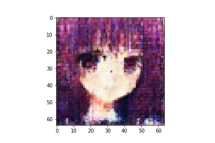

n_latent:512 

n_base_channels:32 

PBP weight:1 

n_solo_epochs:100 

n_combo_epochs:100 

max_disc_loss :999 

Epoch0, Training loss 7175.6943359375, Time used 11.30

Epoch1, Training loss 6815.9062500000, Time used 9.64

Epoch2, Training loss 6744.0610351562, Time used 9.66

Epoch3, Training loss 6712.1655273438, Time used 9.63

Epoch4, Training loss 6691.2622070312, Time used 9.64

Epoch5, Training loss 6678.0361328125, Time used 9.63

Epoch6, Training loss 6667.2143554688, Time used 9.63

Epoch7, Training loss 6657.9536132812, Time used 9.64

Epoch8, Training loss 6650.6674804688, Time used 9.64

Epoch9, Training loss 6644.1499023438, Time used 9.63

Epoch10, Training loss 6637.6074218750, Time used 9.66

Epoch11, Training loss 6634.5668945312, Time used 9.65

Epoch12, Training loss 6628.9472656250, Time used 9.64

Epoch13, Training loss 6626.0336914062, Time used 9.67

Epoch14, Training loss 6621.1352539062, Time used 9.67

Epoch15, Training loss 6617.5493164062, Time used 9.63

Epoch16, Training loss 6614.5102539062, Time used 9.64

Epoch17, Training loss 6611.9775390625, Time used 9.65

Epoch18, Training loss 6610.5712890625, Time used 9.66

Epoch19, Training loss 6606.5654296875, Time used 9.65

Epoch20, Training loss 6604.1137695312, Time used 9.64

Epoch21, Training loss 6600.4077148438, Time used 9.68

Epoch22, Training loss 6597.6992187500, Time used 9.63

Epoch23, Training loss 6598.1899414062, Time used 9.62

Epoch24, Training loss 6593.6811523438, Time used 9.63

Epoch25, Training loss 6591.5170898438, Time used 9.65

Epoch26, Training loss 6589.9785156250, Time used 9.68

Epoch27, Training loss 6588.4628906250, Time used 9.65

Epoch28, Training loss 6587.0351562500, Time used 9.63

Epoch29, Training loss 6585.7729492188, Time used 9.64

Epoch30, Training loss 6584.1962890625, Time used 9.63

Epoch31, Training loss 6581.0732421875, Time used 9.64

Epoch32, Training loss 6579.1567382812, Time used 9.65

Epoch33, Training loss 6579.5546875000, Time used 9.64

Epoch34, Training loss 6576.1269531250, Time used 9.66

Epoch35, Training loss 6577.4765625000, Time used 9.69

Epoch36, Training loss 6573.7065429688, Time used 9.68

Epoch37, Training loss 6574.6469726562, Time used 9.67

Epoch38, Training loss 6571.5307617188, Time used 9.66

Epoch39, Training loss 6571.5039062500, Time used 9.71

Epoch40, Training loss 6571.1772460938, Time used 9.66

Epoch41, Training loss 6570.0249023438, Time used 9.64

Epoch42, Training loss 6568.3964843750, Time used 9.66

Epoch43, Training loss 6567.8833007812, Time used 9.66

Epoch44, Training loss 6566.1757812500, Time used 9.67

Epoch45, Training loss 6563.8759765625, Time used 9.66

Epoch46, Training loss 6564.2275390625, Time used 9.65

Epoch47, Training loss 6561.7758789062, Time used 9.66

Epoch48, Training loss 6561.5727539062, Time used 9.66

Epoch49, Training loss 6560.6914062500, Time used 9.68

Epoch50, Training loss 6559.4213867188, Time used 9.67

Epoch51, Training loss 6557.6894531250, Time used 9.65

Epoch52, Training loss 6557.7968750000, Time used 9.67

Epoch53, Training loss 6558.6547851562, Time used 9.67

Epoch54, Training loss 6556.9731445312, Time used 9.66

Epoch55, Training loss 6556.1464843750, Time used 9.66

Epoch56, Training loss 6553.5649414062, Time used 9.68

Epoch57, Training loss 6553.4316406250, Time used 9.66

Epoch58, Training loss 6552.1469726562, Time used 9.70

Epoch59, Training loss 6551.9580078125, Time used 9.68

Epoch60, Training loss 6553.3120117188, Time used 9.67

Epoch61, Training loss 6551.6245117188, Time used 9.66

Epoch62, Training loss 6550.7163085938, Time used 9.66

Epoch63, Training loss 6548.6044921875, Time used 9.67

Epoch64, Training loss 6548.7529296875, Time used 9.68

Epoch65, Training loss 6548.7934570312, Time used 9.66

Epoch66, Training loss 6548.5307617188, Time used 9.68

Epoch67, Training loss 6547.8950195312, Time used 9.69

Epoch68, Training loss 6547.2543945312, Time used 9.68

Epoch69, Training loss 6546.5776367188, Time used 9.67

Epoch70, Training loss 6544.4243164062, Time used 9.66

Epoch71, Training loss 6544.8554687500, Time used 9.67

Epoch72, Training loss 6542.7119140625, Time used 9.67

Epoch73, Training loss 6541.9438476562, Time used 9.66

Epoch74, Training loss 6540.9892578125, Time used 9.65

Epoch75, Training loss 6541.5527343750, Time used 9.66

Epoch76, Training loss 6541.8618164062, Time used 9.67

Epoch77, Training loss 6540.7900390625, Time used 9.68

Epoch78, Training loss 6539.8740234375, Time used 9.67

Epoch79, Training loss 6538.9106445312, Time used 9.66

Epoch80, Training loss 6539.4038085938, Time used 9.69

Epoch81, Training loss 6538.3378906250, Time used 9.66

Epoch82, Training loss 6539.3212890625, Time used 9.65

Epoch83, Training loss 6536.9482421875, Time used 9.68

Epoch84, Training loss 6537.4404296875, Time used 9.66

Epoch85, Training loss 6536.3427734375, Time used 9.65

Epoch86, Training loss 6535.5322265625, Time used 9.65

Epoch87, Training loss 6536.2856445312, Time used 9.66

Epoch88, Training loss 6536.3076171875, Time used 9.65

Epoch89, Training loss 6533.7407226562, Time used 9.66

Epoch90, Training loss 6536.1489257812, Time used 9.68

Epoch91, Training loss 6533.4545898438, Time used 9.68

Epoch92, Training loss 6533.3149414062, Time used 9.71

Epoch93, Training loss 6532.0258789062, Time used 9.68

Epoch94, Training loss 6532.3378906250, Time used 9.65

Epoch95, Training loss 6532.0083007812, Time used 9.70

Epoch96, Training loss 6533.0942382812, Time used 9.68

Epoch97, Training loss 6529.1889648438, Time used 9.67

Epoch98, Training loss 6531.5195312500, Time used 9.66

Epoch99, Training loss 6529.7270507812, Time used 9.69

Epoch100, VAE Training loss 6572.23096, ResNet Training loss 1.0098763704, Time used 33.53

Epoch101, VAE Training loss 6600.68896, ResNet Training loss 0.6039382219, Time used 33.35

Epoch102, VAE Training loss 6672.15918, ResNet Training loss 0.3074519634, Time used 33.23

Epoch103, VAE Training loss 6640.01074, ResNet Training loss 0.2650324702, Time used 33.37

Epoch104, VAE Training loss 6674.75732, ResNet Training loss 0.5323897600, Time used 33.77

Epoch105, VAE Training loss 6685.57227, ResNet Training loss 0.2424683720, Time used 33.52

Epoch106, VAE Training loss 6713.91162, ResNet Training loss 0.2550667226, Time used 33.56

Epoch107, VAE Training loss 6739.63623, ResNet Training loss 0.2561014891, Time used 33.59

Epoch108, VAE Training loss 6734.70459, ResNet Training loss 0.2827541828, Time used 33.54

Epoch109, VAE Training loss 6739.16650, ResNet Training loss 0.3216084838, Time used 33.62

Epoch110, VAE Training loss 6690.28271, ResNet Training loss 0.0582471900, Time used 33.46

Epoch111, VAE Training loss 6737.57715, ResNet Training loss 0.2411226034, Time used 33.56

Epoch112, VAE Training loss 6683.76660, ResNet Training loss 0.0513294153, Time used 33.44

Epoch113, VAE Training loss 6712.37109, ResNet Training loss 0.1395744383, Time used 33.38

Epoch114, VAE Training loss 6723.15234, ResNet Training loss 0.1911110431, Time used 33.42

Epoch115, VAE Training loss 6658.04980, ResNet Training loss 0.0003802188, Time used 33.24

Epoch116, VAE Training loss 6682.98242, ResNet Training loss 0.0209799614, Time used 33.23

Epoch117, VAE Training loss 6673.51025, ResNet Training loss 0.0648558214, Time used 33.37

Epoch118, VAE Training loss 6666.12158, ResNet Training loss 0.0003970832, Time used 33.27

Epoch119, VAE Training loss 6684.23145, ResNet Training loss 0.0816046298, Time used 33.41

Epoch120, VAE Training loss 6711.83936, ResNet Training loss 0.2733206451, Time used 33.50

Epoch121, VAE Training loss 6669.08008, ResNet Training loss 0.0320876241, Time used 33.50

Epoch122, VAE Training loss 6668.69629, ResNet Training loss 0.0238233861, Time used 33.37

Epoch123, VAE Training loss 6668.80566, ResNet Training loss 0.0975308269, Time used 33.61

Epoch124, VAE Training loss 6721.55859, ResNet Training loss 0.2412901968, Time used 33.55

Epoch125, VAE Training loss 6679.29590, ResNet Training loss 0.1105087996, Time used 33.55

Epoch126, VAE Training loss 6695.82666, ResNet Training loss 0.1463787705, Time used 33.48

Epoch127, VAE Training loss 6712.82959, ResNet Training loss 0.1532069445, Time used 33.43

Epoch128, VAE Training loss 6725.05371, ResNet Training loss 0.2817503512, Time used 33.37

Epoch129, VAE Training loss 6710.09717, ResNet Training loss 0.0593424775, Time used 33.36

Epoch130, VAE Training loss 6696.20020, ResNet Training loss 0.1035751924, Time used 34.24

Epoch131, VAE Training loss 6690.93311, ResNet Training loss 0.1220154688, Time used 34.99

Epoch132, VAE Training loss 6676.88818, ResNet Training loss 0.0947089344, Time used 33.43

Epoch133, VAE Training loss 6679.09912, ResNet Training loss 0.0025012526, Time used 34.55

Epoch134, VAE Training loss 6718.91357, ResNet Training loss 0.1172093526, Time used 34.83

Epoch135, VAE Training loss 6725.80029, ResNet Training loss 0.1337569654, Time used 34.15

Epoch136, VAE Training loss 6747.99463, ResNet Training loss 0.1553951204, Time used 35.09

Epoch137, VAE Training loss 6780.12109, ResNet Training loss 0.2851800919, Time used 34.23

Epoch138, VAE Training loss 6773.15674, ResNet Training loss 0.2686108947, Time used 33.55

Epoch139, VAE Training loss 6786.76025, ResNet Training loss 0.2365584821, Time used 33.44

Epoch140, VAE Training loss 6737.61670, ResNet Training loss 0.1047813222, Time used 33.43

Epoch141, VAE Training loss 6736.28662, ResNet Training loss 0.1114938557, Time used 35.05

Epoch142, VAE Training loss 6734.83838, ResNet Training loss 0.1512107998, Time used 34.85

Epoch143, VAE Training loss 6766.50391, ResNet Training loss 0.1945119500, Time used 34.16

Epoch144, VAE Training loss 6779.14990, ResNet Training loss 0.2229804844, Time used 35.03

Epoch145, VAE Training loss 6771.42773, ResNet Training loss 0.2208008021, Time used 33.94

Epoch146, VAE Training loss 6767.99951, ResNet Training loss 0.2268617749, Time used 33.44

Epoch147, VAE Training loss 6802.15625, ResNet Training loss 0.2661883831, Time used 33.36

Epoch148, VAE Training loss 6766.57422, ResNet Training loss 0.2147888243, Time used 33.41

Epoch149, VAE Training loss 6790.35254, ResNet Training loss 0.2502465844, Time used 33.54

Epoch150, VAE Training loss 6771.63867, ResNet Training loss 0.1697474420, Time used 33.54

Epoch151, VAE Training loss 6788.15820, ResNet Training loss 0.2078737915, Time used 33.48

Epoch152, VAE Training loss 6778.70752, ResNet Training loss 0.1693098247, Time used 33.52

Epoch153, VAE Training loss 6741.41113, ResNet Training loss 0.1442932338, Time used 33.40

Epoch154, VAE Training loss 6778.68408, ResNet Training loss 0.1798435897, Time used 33.49

Epoch155, VAE Training loss 6793.90723, ResNet Training loss 0.1683511287, Time used 33.49

Epoch156, VAE Training loss 6795.78320, ResNet Training loss 0.3499542177, Time used 33.57

Epoch157, VAE Training loss 6763.41455, ResNet Training loss 0.1401581317, Time used 33.60

Epoch158, VAE Training loss 6787.64111, ResNet Training loss 0.1721108109, Time used 33.18

Epoch159, VAE Training loss 6799.79248, ResNet Training loss 0.2394488901, Time used 33.23

Epoch160, VAE Training loss 6785.48047, ResNet Training loss 0.1303279102, Time used 33.08

Epoch161, VAE Training loss 6796.14258, ResNet Training loss 0.2702571154, Time used 33.36

Epoch162, VAE Training loss 6778.30664, ResNet Training loss 0.2542375922, Time used 33.55

Epoch163, VAE Training loss 6778.55322, ResNet Training loss 0.1534148604, Time used 33.67

Epoch164, VAE Training loss 6787.14111, ResNet Training loss 0.2200999856, Time used 33.52

Epoch165, VAE Training loss 6762.67529, ResNet Training loss 0.1542812735, Time used 33.40

Epoch166, VAE Training loss 6819.16406, ResNet Training loss 0.2284871638, Time used 33.43

Epoch167, VAE Training loss 6782.11572, ResNet Training loss 0.1782643199, Time used 33.58

Epoch168, VAE Training loss 6814.55762, ResNet Training loss 0.3031762540, Time used 33.56

Epoch169, VAE Training loss 6811.15820, ResNet Training loss 0.2465451509, Time used 33.51

Epoch170, VAE Training loss 6828.07129, ResNet Training loss 0.3166449070, Time used 33.54

Epoch171, VAE Training loss 6737.45166, ResNet Training loss 0.1512355506, Time used 33.48

Epoch172, VAE Training loss 6689.66846, ResNet Training loss 0.0011137255, Time used 33.25

Epoch173, VAE Training loss 6795.88770, ResNet Training loss 0.1760405153, Time used 33.22

Epoch174, VAE Training loss 6789.13232, ResNet Training loss 0.1824311465, Time used 33.52

Epoch175, VAE Training loss 6813.58154, ResNet Training loss 0.2926466465, Time used 33.36

Epoch176, VAE Training loss 6778.01953, ResNet Training loss 0.1368166953, Time used 33.34

Epoch177, VAE Training loss 6799.28125, ResNet Training loss 0.2307862043, Time used 33.24

Epoch178, VAE Training loss 6789.18408, ResNet Training loss 0.1803880036, Time used 33.39

Epoch179, VAE Training loss 6734.19922, ResNet Training loss 0.1786864698, Time used 33.29

Epoch180, VAE Training loss 6765.21191, ResNet Training loss 0.1437111646, Time used 33.22

Epoch181, VAE Training loss 6800.49902, ResNet Training loss 0.1773439199, Time used 33.13

Epoch182, VAE Training loss 6784.26221, ResNet Training loss 0.0918177143, Time used 33.07

Epoch183, VAE Training loss 6796.64551, ResNet Training loss 0.1239145622, Time used 33.41

Epoch184, VAE Training loss 6805.18164, ResNet Training loss 0.2234017253, Time used 33.80

Epoch185, VAE Training loss 6800.33057, ResNet Training loss 0.1446812600, Time used 33.39

Epoch186, VAE Training loss 6799.50586, ResNet Training loss 0.2079948485, Time used 33.49

Epoch187, VAE Training loss 6799.49170, ResNet Training loss 0.3844271302, Time used 33.41

Epoch188, VAE Training loss 6823.68359, ResNet Training loss 0.2630229592, Time used 33.45

Epoch189, VAE Training loss 6856.10352, ResNet Training loss 0.2965834439, Time used 33.35

Epoch190, VAE Training loss 6805.00879, ResNet Training loss 0.1596146226, Time used 33.41

Epoch191, VAE Training loss 6827.65918, ResNet Training loss 0.2163850069, Time used 33.55

Epoch192, VAE Training loss 6841.90771, ResNet Training loss 0.3304932714, Time used 33.61

Epoch193, VAE Training loss 6799.65625, ResNet Training loss 0.1218407676, Time used 33.54

Epoch194, VAE Training loss 6839.04443, ResNet Training loss 0.2283515483, Time used 33.53

Epoch195, VAE Training loss 6876.38916, ResNet Training loss 0.4109185636, Time used 33.65

Epoch196, VAE Training loss 6838.92773, ResNet Training loss 0.3173148334, Time used 33.57

Epoch197, VAE Training loss 6821.93408, ResNet Training loss 0.2274711281, Time used 33.58

Epoch198, VAE Training loss 6801.23633, ResNet Training loss 0.1724986583, Time used 33.40

Epoch199, VAE Training loss 6796.59473, ResNet Training loss 0.1122059524, Time used 33.50

