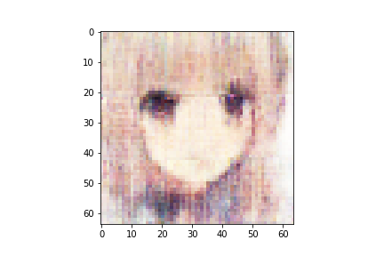

n_latent:512 

n_base_channels:32 

PBP weight:1 

n_solo_epochs:150 

n_combo_epochs:50 

max_disc_loss :999 

Epoch0, Training loss 7261.6679687500, Time used 11.28

Epoch1, Training loss 6836.2954101562, Time used 9.64

Epoch2, Training loss 6754.6669921875, Time used 9.66

Epoch3, Training loss 6716.6044921875, Time used 9.65

Epoch4, Training loss 6695.1708984375, Time used 9.65

Epoch5, Training loss 6682.8784179688, Time used 9.62

Epoch6, Training loss 6670.4755859375, Time used 9.61

Epoch7, Training loss 6663.6508789062, Time used 9.64

Epoch8, Training loss 6655.0400390625, Time used 9.66

Epoch9, Training loss 6648.1992187500, Time used 9.68

Epoch10, Training loss 6641.1035156250, Time used 9.67

Epoch11, Training loss 6639.2519531250, Time used 9.63

Epoch12, Training loss 6631.5668945312, Time used 9.66

Epoch13, Training loss 6627.2500000000, Time used 9.65

Epoch14, Training loss 6624.8041992188, Time used 9.64

Epoch15, Training loss 6620.3227539062, Time used 9.63

Epoch16, Training loss 6619.6953125000, Time used 9.64

Epoch17, Training loss 6613.9936523438, Time used 9.64

Epoch18, Training loss 6612.6313476562, Time used 9.66

Epoch19, Training loss 6607.6777343750, Time used 9.65

Epoch20, Training loss 6607.2451171875, Time used 9.64

Epoch21, Training loss 6604.1020507812, Time used 9.64

Epoch22, Training loss 6600.3740234375, Time used 9.64

Epoch23, Training loss 6596.9082031250, Time used 9.61

Epoch24, Training loss 6596.8959960938, Time used 9.66

Epoch25, Training loss 6593.4125976562, Time used 9.65

Epoch26, Training loss 6591.6064453125, Time used 9.65

Epoch27, Training loss 6590.8618164062, Time used 9.67

Epoch28, Training loss 6587.9472656250, Time used 9.67

Epoch29, Training loss 6587.7563476562, Time used 9.63

Epoch30, Training loss 6584.0952148438, Time used 9.65

Epoch31, Training loss 6583.5878906250, Time used 9.63

Epoch32, Training loss 6580.0312500000, Time used 9.65

Epoch33, Training loss 6578.9389648438, Time used 9.63

Epoch34, Training loss 6579.0136718750, Time used 9.63

Epoch35, Training loss 6578.4599609375, Time used 9.64

Epoch36, Training loss 6575.3339843750, Time used 9.62

Epoch37, Training loss 6574.3437500000, Time used 9.61

Epoch38, Training loss 6572.2036132812, Time used 9.64

Epoch39, Training loss 6572.3471679688, Time used 9.61

Epoch40, Training loss 6571.4624023438, Time used 9.62

Epoch41, Training loss 6570.1186523438, Time used 9.63

Epoch42, Training loss 6566.6503906250, Time used 9.64

Epoch43, Training loss 6567.6279296875, Time used 9.63

Epoch44, Training loss 6567.6010742188, Time used 9.64

Epoch45, Training loss 6564.8852539062, Time used 9.65

Epoch46, Training loss 6564.9101562500, Time used 9.66

Epoch47, Training loss 6563.1425781250, Time used 9.67

Epoch48, Training loss 6562.0288085938, Time used 9.65

Epoch49, Training loss 6562.7177734375, Time used 9.64

Epoch50, Training loss 6560.8305664062, Time used 9.65

Epoch51, Training loss 6558.5917968750, Time used 9.64

Epoch52, Training loss 6559.4213867188, Time used 9.64

Epoch53, Training loss 6558.0043945312, Time used 9.63

Epoch54, Training loss 6556.5566406250, Time used 9.62

Epoch55, Training loss 6555.3964843750, Time used 9.63

Epoch56, Training loss 6554.6962890625, Time used 9.67

Epoch57, Training loss 6554.5751953125, Time used 9.67

Epoch58, Training loss 6554.8798828125, Time used 9.68

Epoch59, Training loss 6550.6704101562, Time used 9.69

Epoch60, Training loss 6551.2500000000, Time used 9.64

Epoch61, Training loss 6551.2905273438, Time used 9.65

Epoch62, Training loss 6550.6362304688, Time used 9.64

Epoch63, Training loss 6548.7485351562, Time used 9.67

Epoch64, Training loss 6547.4399414062, Time used 9.66

Epoch65, Training loss 6548.6958007812, Time used 9.66

Epoch66, Training loss 6548.5825195312, Time used 9.73

Epoch67, Training loss 6547.7866210938, Time used 9.66

Epoch68, Training loss 6545.1713867188, Time used 9.66

Epoch69, Training loss 6544.2412109375, Time used 9.69

Epoch70, Training loss 6543.2939453125, Time used 9.67

Epoch71, Training loss 6544.4501953125, Time used 9.65

Epoch72, Training loss 6547.2387695312, Time used 9.65

Epoch73, Training loss 6544.4946289062, Time used 9.66

Epoch74, Training loss 6542.0156250000, Time used 9.66

Epoch75, Training loss 6540.6455078125, Time used 9.65

Epoch76, Training loss 6543.9726562500, Time used 9.65

Epoch77, Training loss 6540.0405273438, Time used 9.63

Epoch78, Training loss 6541.3041992188, Time used 9.64

Epoch79, Training loss 6539.2871093750, Time used 9.63

Epoch80, Training loss 6538.3437500000, Time used 9.64

Epoch81, Training loss 6537.6333007812, Time used 9.64

Epoch82, Training loss 6537.7998046875, Time used 9.66

Epoch83, Training loss 6539.0000000000, Time used 9.63

Epoch84, Training loss 6537.3945312500, Time used 9.72

Epoch85, Training loss 6537.1176757812, Time used 9.64

Epoch86, Training loss 6536.3164062500, Time used 9.65

Epoch87, Training loss 6535.7446289062, Time used 9.63

Epoch88, Training loss 6535.2158203125, Time used 9.66

Epoch89, Training loss 6535.7714843750, Time used 9.66

Epoch90, Training loss 6534.2539062500, Time used 9.66

Epoch91, Training loss 6534.7636718750, Time used 9.66

Epoch92, Training loss 6534.4155273438, Time used 9.66

Epoch93, Training loss 6534.5712890625, Time used 9.68

Epoch94, Training loss 6532.3706054688, Time used 9.66

Epoch95, Training loss 6532.0483398438, Time used 9.66

Epoch96, Training loss 6532.7934570312, Time used 9.65

Epoch97, Training loss 6530.0903320312, Time used 9.66

Epoch98, Training loss 6530.1455078125, Time used 9.67

Epoch99, Training loss 6532.7065429688, Time used 9.67

Epoch100, Training loss 6530.0937500000, Time used 9.67

Epoch101, Training loss 6529.7553710938, Time used 9.68

Epoch102, Training loss 6529.3710937500, Time used 9.65

Epoch103, Training loss 6526.7993164062, Time used 9.69

Epoch104, Training loss 6529.0092773438, Time used 9.66

Epoch105, Training loss 6528.1293945312, Time used 9.66

Epoch106, Training loss 6526.5727539062, Time used 9.67

Epoch107, Training loss 6527.0673828125, Time used 9.68

Epoch108, Training loss 6527.1064453125, Time used 9.69

Epoch109, Training loss 6527.6547851562, Time used 9.70

Epoch110, Training loss 6526.3100585938, Time used 9.65

Epoch111, Training loss 6525.2856445312, Time used 9.65

Epoch112, Training loss 6527.2260742188, Time used 9.65

Epoch113, Training loss 6524.0385742188, Time used 9.67

Epoch114, Training loss 6524.6630859375, Time used 9.66

Epoch115, Training loss 6524.3730468750, Time used 9.65

Epoch116, Training loss 6523.6176757812, Time used 9.67

Epoch117, Training loss 6523.0083007812, Time used 9.66

Epoch118, Training loss 6524.0507812500, Time used 9.66

Epoch119, Training loss 6524.1523437500, Time used 9.68

Epoch120, Training loss 6522.8325195312, Time used 9.68

Epoch121, Training loss 6523.3066406250, Time used 9.71

Epoch122, Training loss 6522.6464843750, Time used 9.71

Epoch123, Training loss 6521.1777343750, Time used 9.66

Epoch124, Training loss 6522.1645507812, Time used 9.66

Epoch125, Training loss 6522.5146484375, Time used 9.67

Epoch126, Training loss 6522.4970703125, Time used 9.67

Epoch127, Training loss 6520.6943359375, Time used 9.66

Epoch128, Training loss 6519.7558593750, Time used 9.67

Epoch129, Training loss 6519.5122070312, Time used 9.66

Epoch130, Training loss 6520.2675781250, Time used 9.68

Epoch131, Training loss 6518.5058593750, Time used 9.67

Epoch132, Training loss 6517.7167968750, Time used 9.67

Epoch133, Training loss 6518.1518554688, Time used 9.67

Epoch134, Training loss 6517.8408203125, Time used 9.67

Epoch135, Training loss 6517.3901367188, Time used 9.65

Epoch136, Training loss 6517.5488281250, Time used 9.68

Epoch137, Training loss 6516.2788085938, Time used 9.70

Epoch138, Training loss 6516.3383789062, Time used 9.67

Epoch139, Training loss 6515.7187500000, Time used 9.66

Epoch140, Training loss 6516.4614257812, Time used 9.71

Epoch141, Training loss 6516.5224609375, Time used 9.71

Epoch142, Training loss 6515.7915039062, Time used 9.65

Epoch143, Training loss 6516.1401367188, Time used 9.69

Epoch144, Training loss 6514.8779296875, Time used 9.66

Epoch145, Training loss 6515.2807617188, Time used 9.67

Epoch146, Training loss 6514.6997070312, Time used 9.66

Epoch147, Training loss 6513.2285156250, Time used 9.66

Epoch148, Training loss 6513.1850585938, Time used 9.66

Epoch149, Training loss 6514.0512695312, Time used 9.66

Epoch150, VAE Training loss 6605.13037, ResNet Training loss 0.6096191406, Time used 33.69

Epoch151, VAE Training loss 6653.57568, ResNet Training loss 0.3772335947, Time used 33.48

Epoch152, VAE Training loss 6643.89111, ResNet Training loss 0.3398353159, Time used 33.57

Epoch153, VAE Training loss 6687.32959, ResNet Training loss 0.2756565511, Time used 33.52

Epoch154, VAE Training loss 6672.70312, ResNet Training loss 0.2475805432, Time used 33.67

Epoch155, VAE Training loss 6687.46973, ResNet Training loss 0.2627274096, Time used 33.44

Epoch156, VAE Training loss 6706.26221, ResNet Training loss 0.3190584481, Time used 33.25

Epoch157, VAE Training loss 6720.72949, ResNet Training loss 0.3506752849, Time used 33.47

Epoch158, VAE Training loss 6735.68945, ResNet Training loss 0.2694361806, Time used 33.49

Epoch159, VAE Training loss 6719.19824, ResNet Training loss 0.2570782602, Time used 33.45

Epoch160, VAE Training loss 6734.62402, ResNet Training loss 0.3270501792, Time used 33.47

Epoch161, VAE Training loss 6728.84131, ResNet Training loss 0.2059027851, Time used 33.36

Epoch162, VAE Training loss 6761.26758, ResNet Training loss 0.2865820229, Time used 33.20

Epoch163, VAE Training loss 6750.03564, ResNet Training loss 0.3102109134, Time used 33.35

Epoch164, VAE Training loss 6759.66992, ResNet Training loss 0.2499022037, Time used 33.41

Epoch165, VAE Training loss 6782.00928, ResNet Training loss 0.2820581794, Time used 33.29

Epoch166, VAE Training loss 6788.04639, ResNet Training loss 0.2757676542, Time used 33.48

Epoch167, VAE Training loss 6796.66992, ResNet Training loss 0.3114419878, Time used 33.48

Epoch168, VAE Training loss 6747.59814, ResNet Training loss 0.1587944925, Time used 33.55

Epoch169, VAE Training loss 6799.45850, ResNet Training loss 0.3265716434, Time used 33.37

Epoch170, VAE Training loss 6814.25684, ResNet Training loss 0.3261242807, Time used 33.49

Epoch171, VAE Training loss 6803.37061, ResNet Training loss 0.3077632189, Time used 33.52

Epoch172, VAE Training loss 6813.18164, ResNet Training loss 0.2056037784, Time used 33.48

Epoch173, VAE Training loss 6814.38623, ResNet Training loss 0.3306363821, Time used 33.43

Epoch174, VAE Training loss 6811.23682, ResNet Training loss 0.2152482867, Time used 33.70

Epoch175, VAE Training loss 6809.31104, ResNet Training loss 0.2760930657, Time used 33.38

Epoch176, VAE Training loss 6797.54639, ResNet Training loss 0.2267053127, Time used 33.33

Epoch177, VAE Training loss 6811.99951, ResNet Training loss 0.2660616934, Time used 33.35

Epoch178, VAE Training loss 6801.25098, ResNet Training loss 0.1918835193, Time used 33.22

Epoch179, VAE Training loss 6802.01172, ResNet Training loss 0.1795080602, Time used 33.32

Epoch180, VAE Training loss 6816.40430, ResNet Training loss 0.2225172818, Time used 33.20

Epoch181, VAE Training loss 6798.61377, ResNet Training loss 0.2314210385, Time used 33.28

Epoch182, VAE Training loss 6752.84863, ResNet Training loss 0.1011887118, Time used 33.26

Epoch183, VAE Training loss 6814.05811, ResNet Training loss 0.2348123938, Time used 33.16

Epoch184, VAE Training loss 6801.61719, ResNet Training loss 0.2280309498, Time used 33.53

Epoch185, VAE Training loss 6809.50439, ResNet Training loss 0.2080839872, Time used 33.46

Epoch186, VAE Training loss 6765.11963, ResNet Training loss 0.1443529129, Time used 33.45

Epoch187, VAE Training loss 6732.31738, ResNet Training loss 0.1264992505, Time used 33.46

Epoch188, VAE Training loss 6717.84229, ResNet Training loss 0.0607606322, Time used 33.52

Epoch189, VAE Training loss 6735.23096, ResNet Training loss 0.1622302383, Time used 33.53

Epoch190, VAE Training loss 6759.59082, ResNet Training loss 0.1682851762, Time used 33.64

Epoch191, VAE Training loss 6784.11768, ResNet Training loss 0.1356474459, Time used 33.42

Epoch192, VAE Training loss 6825.82861, ResNet Training loss 0.2596694529, Time used 33.32

Epoch193, VAE Training loss 6811.66211, ResNet Training loss 0.2407142371, Time used 33.36

Epoch194, VAE Training loss 6750.15820, ResNet Training loss 0.1025736630, Time used 33.23

Epoch195, VAE Training loss 6782.65918, ResNet Training loss 0.1071685478, Time used 33.36

Epoch196, VAE Training loss 6742.81396, ResNet Training loss 0.1811880767, Time used 33.43

Epoch197, VAE Training loss 6793.38770, ResNet Training loss 0.2440130115, Time used 33.10

Epoch198, VAE Training loss 6746.64893, ResNet Training loss 0.0779153034, Time used 33.36

Epoch199, VAE Training loss 6772.90625, ResNet Training loss 0.1881603897, Time used 33.11

