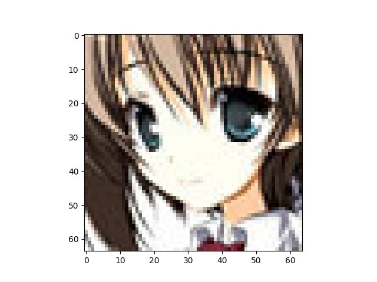
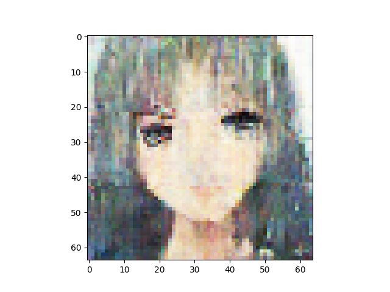
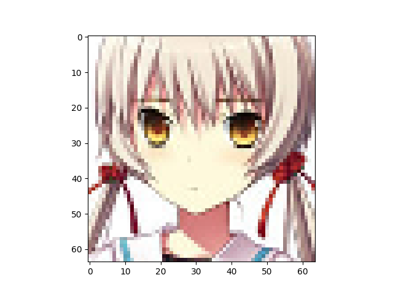
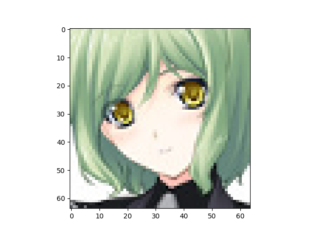

VAE number of latent variables 	512

VAE number of base channels 	32

Discriminator is ResNetNumber of epochs trained 	200

Epoch0, VAE Training loss 7260.94727, ResNet Training loss 0.4470510483, Time used 36.44

Epoch1, VAE Training loss 6944.40479, ResNet Training loss 0.3791684806, Time used 34.06

Epoch2, VAE Training loss 6866.36816, ResNet Training loss 0.3952598870, Time used 33.75

Epoch3, VAE Training loss 6878.70361, ResNet Training loss 0.4722237289, Time used 33.84

Epoch4, VAE Training loss 6841.25537, ResNet Training loss 0.3931364715, Time used 33.90

Epoch5, VAE Training loss 6902.43604, ResNet Training loss 0.3548175991, Time used 34.18

Epoch6, VAE Training loss 6901.49707, ResNet Training loss 0.3336477876, Time used 33.76

Epoch7, VAE Training loss 6891.95361, ResNet Training loss 0.2403125912, Time used 33.77

Epoch8, VAE Training loss 6838.57715, ResNet Training loss 0.0714865997, Time used 33.76

Epoch9, VAE Training loss 6795.64160, ResNet Training loss 0.0000793006, Time used 34.10

Epoch10, VAE Training loss 6785.92969, ResNet Training loss 0.0001917871, Time used 34.16

Epoch11, VAE Training loss 6813.54004, ResNet Training loss 0.1270957887, Time used 34.20

Epoch12, VAE Training loss 6811.27588, ResNet Training loss 0.1171943098, Time used 33.78

Epoch13, VAE Training loss 6816.73535, ResNet Training loss 0.2301699221, Time used 33.75

Epoch14, VAE Training loss 6784.43896, ResNet Training loss 0.1220498830, Time used 33.90

Epoch15, VAE Training loss 6822.84619, ResNet Training loss 0.2324067205, Time used 33.75

Epoch16, VAE Training loss 6871.19336, ResNet Training loss 0.3214302361, Time used 33.73

Epoch17, VAE Training loss 6776.47461, ResNet Training loss 0.0342968553, Time used 33.80

Epoch18, VAE Training loss 6755.49463, ResNet Training loss 0.0001627453, Time used 33.73

Epoch19, VAE Training loss 6756.97119, ResNet Training loss 0.0003621061, Time used 33.80

Epoch20, VAE Training loss 6795.81006, ResNet Training loss 0.1056563184, Time used 33.98

Epoch21, VAE Training loss 6787.84424, ResNet Training loss 0.1961965561, Time used 34.04

Epoch22, VAE Training loss 6821.09326, ResNet Training loss 0.2299128175, Time used 33.77

Epoch23, VAE Training loss 6831.87207, ResNet Training loss 0.2374101728, Time used 33.74

Epoch24, VAE Training loss 6865.98779, ResNet Training loss 0.3486913741, Time used 33.93

Epoch25, VAE Training loss 6854.64160, ResNet Training loss 0.2448592335, Time used 33.84

Epoch26, VAE Training loss 6846.79102, ResNet Training loss 0.2437898368, Time used 33.68

Epoch27, VAE Training loss 6866.77295, ResNet Training loss 0.2554627061, Time used 34.45

Epoch28, VAE Training loss 6838.01562, ResNet Training loss 0.2515287101, Time used 33.66

Epoch29, VAE Training loss 6802.59814, ResNet Training loss 0.1189038903, Time used 33.66

Epoch30, VAE Training loss 6783.77148, ResNet Training loss 0.0210519023, Time used 34.33

Epoch31, VAE Training loss 6868.32324, ResNet Training loss 0.2888145149, Time used 33.77

Epoch32, VAE Training loss 6834.02881, ResNet Training loss 0.2302260548, Time used 33.69

Epoch33, VAE Training loss 6846.21777, ResNet Training loss 0.2702642977, Time used 33.64

Epoch34, VAE Training loss 6809.08252, ResNet Training loss 0.1604165733, Time used 33.65

Epoch35, VAE Training loss 6840.68213, ResNet Training loss 0.2394269854, Time used 33.74

Epoch36, VAE Training loss 6773.16797, ResNet Training loss 0.1509380490, Time used 33.75

Epoch37, VAE Training loss 6777.91504, ResNet Training loss 0.1115399599, Time used 33.67

Epoch38, VAE Training loss 6793.73779, ResNet Training loss 0.1093291342, Time used 34.43

Epoch39, VAE Training loss 6846.21582, ResNet Training loss 0.2685324848, Time used 33.65

Epoch40, VAE Training loss 6734.25830, ResNet Training loss 0.0046005035, Time used 33.65

Epoch41, VAE Training loss 6846.55957, ResNet Training loss 0.1448964775, Time used 33.77

Epoch42, VAE Training loss 6865.63867, ResNet Training loss 0.3591586649, Time used 34.26

Epoch43, VAE Training loss 6864.01318, ResNet Training loss 0.2969663739, Time used 34.28

Epoch44, VAE Training loss 6840.21289, ResNet Training loss 0.2643557489, Time used 33.69

Epoch45, VAE Training loss 6794.22754, ResNet Training loss 0.1069805399, Time used 34.52

Epoch46, VAE Training loss 6806.60791, ResNet Training loss 0.1056956872, Time used 34.33

Epoch47, VAE Training loss 6832.09863, ResNet Training loss 0.2268806100, Time used 33.86

Epoch48, VAE Training loss 6823.08057, ResNet Training loss 0.2200873196, Time used 34.58

Epoch49, VAE Training loss 6824.51465, ResNet Training loss 0.1514428258, Time used 34.56

Epoch50, VAE Training loss 6830.09326, ResNet Training loss 0.3092182875, Time used 33.65

Epoch51, VAE Training loss 6835.48730, ResNet Training loss 0.2559059262, Time used 33.92

Epoch52, VAE Training loss 6862.30469, ResNet Training loss 0.2867463231, Time used 33.73

Epoch53, VAE Training loss 6873.37256, ResNet Training loss 0.3645706475, Time used 33.91

Epoch54, VAE Training loss 6774.50195, ResNet Training loss 0.0859906450, Time used 33.63

Epoch55, VAE Training loss 6833.39746, ResNet Training loss 0.1730419546, Time used 33.69

Epoch56, VAE Training loss 6884.14209, ResNet Training loss 0.3859476149, Time used 34.25

Epoch57, VAE Training loss 6892.64258, ResNet Training loss 0.4080161154, Time used 34.51

Epoch58, VAE Training loss 6883.89355, ResNet Training loss 0.2976420820, Time used 33.64

Epoch59, VAE Training loss 6875.89502, ResNet Training loss 0.3328771591, Time used 34.20

Epoch60, VAE Training loss 6888.82764, ResNet Training loss 0.3616409302, Time used 34.54

Epoch61, VAE Training loss 6895.39746, ResNet Training loss 0.4171039760, Time used 34.54

Epoch62, VAE Training loss 6879.81006, ResNet Training loss 0.3276560009, Time used 33.92

Epoch63, VAE Training loss 6884.11182, ResNet Training loss 0.2761365473, Time used 33.74

Epoch64, VAE Training loss 6873.74902, ResNet Training loss 0.2679164708, Time used 34.38

Epoch65, VAE Training loss 6875.48633, ResNet Training loss 0.2640948892, Time used 34.11

Epoch66, VAE Training loss 6882.99561, ResNet Training loss 0.3362861574, Time used 33.75

Epoch67, VAE Training loss 6842.29297, ResNet Training loss 0.1908395141, Time used 34.05

Epoch68, VAE Training loss 6887.11816, ResNet Training loss 0.2596496642, Time used 34.06

Epoch69, VAE Training loss 6868.91650, ResNet Training loss 0.2709750235, Time used 33.88

Epoch70, VAE Training loss 6891.16895, ResNet Training loss 0.2918252945, Time used 34.14

Epoch71, VAE Training loss 6819.09082, ResNet Training loss 0.0950424373, Time used 33.64

Epoch72, VAE Training loss 6798.46289, ResNet Training loss 0.0675962418, Time used 34.01

Epoch73, VAE Training loss 6879.74463, ResNet Training loss 0.2528719604, Time used 33.91

Epoch74, VAE Training loss 6869.36865, ResNet Training loss 0.2159633189, Time used 33.71

Epoch75, VAE Training loss 6813.20312, ResNet Training loss 0.1201552749, Time used 33.64

Epoch76, VAE Training loss 6828.21631, ResNet Training loss 0.1465186030, Time used 33.72

Epoch77, VAE Training loss 6854.91406, ResNet Training loss 0.2155847698, Time used 33.67

Epoch78, VAE Training loss 6856.78320, ResNet Training loss 0.2140495181, Time used 33.81

Epoch79, VAE Training loss 6858.87793, ResNet Training loss 0.2338894755, Time used 33.64

Epoch80, VAE Training loss 6842.75928, ResNet Training loss 0.2500051856, Time used 33.66

Epoch81, VAE Training loss 6863.51172, ResNet Training loss 0.2080620378, Time used 33.65

Epoch82, VAE Training loss 6842.92432, ResNet Training loss 0.2353266329, Time used 34.55

Epoch83, VAE Training loss 6863.02881, ResNet Training loss 0.1956255585, Time used 34.31

Epoch84, VAE Training loss 6833.85107, ResNet Training loss 0.1369995326, Time used 33.67

Epoch85, VAE Training loss 6875.83691, ResNet Training loss 0.2190941870, Time used 33.80

Epoch86, VAE Training loss 6876.06689, ResNet Training loss 0.2656866610, Time used 33.66

Epoch87, VAE Training loss 6886.16846, ResNet Training loss 0.3041899502, Time used 34.09

Epoch88, VAE Training loss 6887.75146, ResNet Training loss 0.2790072858, Time used 33.84

Epoch89, VAE Training loss 6857.29248, ResNet Training loss 0.1970880032, Time used 34.24

Epoch90, VAE Training loss 6847.94922, ResNet Training loss 0.1267313957, Time used 34.49

Epoch91, VAE Training loss 6857.83691, ResNet Training loss 0.1595038623, Time used 33.98

Epoch92, VAE Training loss 6868.31592, ResNet Training loss 0.2261071354, Time used 33.64

Epoch93, VAE Training loss 6862.38721, ResNet Training loss 0.2266631424, Time used 33.66

Epoch94, VAE Training loss 6882.05664, ResNet Training loss 0.2387625277, Time used 34.11

Epoch95, VAE Training loss 6845.39062, ResNet Training loss 0.1627514958, Time used 33.81

Epoch96, VAE Training loss 6849.68799, ResNet Training loss 0.2108528316, Time used 34.36

Epoch97, VAE Training loss 6849.33350, ResNet Training loss 0.1885333061, Time used 34.48

Epoch98, VAE Training loss 6854.94629, ResNet Training loss 0.1820405424, Time used 33.75

Epoch99, VAE Training loss 6853.40430, ResNet Training loss 0.2000519782, Time used 33.72

Epoch100, VAE Training loss 6872.41504, ResNet Training loss 0.2540665865, Time used 33.70

Epoch101, VAE Training loss 6826.66992, ResNet Training loss 0.1418539286, Time used 33.71

Epoch102, VAE Training loss 6844.73828, ResNet Training loss 0.1440883428, Time used 34.54

Epoch103, VAE Training loss 6868.67334, ResNet Training loss 0.1901223511, Time used 33.79

Epoch104, VAE Training loss 6872.12988, ResNet Training loss 0.1673209518, Time used 33.89

Epoch105, VAE Training loss 6875.69922, ResNet Training loss 0.2885260284, Time used 33.96

Epoch106, VAE Training loss 6824.00879, ResNet Training loss 0.0407486595, Time used 33.70

Epoch107, VAE Training loss 6826.23633, ResNet Training loss 0.1695345044, Time used 33.67

Epoch108, VAE Training loss 6825.17871, ResNet Training loss 0.1723756939, Time used 33.91

Epoch109, VAE Training loss 6799.61572, ResNet Training loss 0.0952184796, Time used 33.74

Epoch110, VAE Training loss 6864.51904, ResNet Training loss 0.1824086457, Time used 34.41

Epoch111, VAE Training loss 6850.20654, ResNet Training loss 0.2412955910, Time used 34.55

Epoch112, VAE Training loss 6847.10645, ResNet Training loss 0.1748110950, Time used 33.77

Epoch113, VAE Training loss 6851.94629, ResNet Training loss 0.1644027531, Time used 34.45

Epoch114, VAE Training loss 6795.77881, ResNet Training loss 0.0906788409, Time used 33.76

Epoch115, VAE Training loss 6893.19238, ResNet Training loss 0.2948911190, Time used 34.07

Epoch116, VAE Training loss 6841.54590, ResNet Training loss 0.2343255430, Time used 33.87

Epoch117, VAE Training loss 6826.94922, ResNet Training loss 0.1479233801, Time used 33.82

Epoch118, VAE Training loss 6807.54834, ResNet Training loss 0.0818562955, Time used 33.74

Epoch119, VAE Training loss 6833.15625, ResNet Training loss 0.1792524904, Time used 34.20

Epoch120, VAE Training loss 6815.80322, ResNet Training loss 0.1128398776, Time used 34.25

Epoch121, VAE Training loss 6869.11719, ResNet Training loss 0.2071655840, Time used 33.68

Epoch122, VAE Training loss 6844.69482, ResNet Training loss 0.1664205492, Time used 33.72

Epoch123, VAE Training loss 6837.09814, ResNet Training loss 0.1228090376, Time used 33.72

Epoch124, VAE Training loss 6839.91309, ResNet Training loss 0.1329804957, Time used 34.54

Epoch125, VAE Training loss 6768.39551, ResNet Training loss 0.1033435762, Time used 33.68

Epoch126, VAE Training loss 6812.14893, ResNet Training loss 0.0872912332, Time used 34.02

Epoch127, VAE Training loss 6820.23242, ResNet Training loss 0.1279895008, Time used 33.67

Epoch128, VAE Training loss 6819.14893, ResNet Training loss 0.1296191514, Time used 33.65

Epoch129, VAE Training loss 6846.94189, ResNet Training loss 0.1291306466, Time used 33.77

Epoch130, VAE Training loss 6854.58887, ResNet Training loss 0.1831198335, Time used 34.63

Epoch131, VAE Training loss 6851.67236, ResNet Training loss 0.1936014742, Time used 34.68

Epoch132, VAE Training loss 6866.53662, ResNet Training loss 0.2202156186, Time used 34.46

Epoch133, VAE Training loss 6840.52930, ResNet Training loss 0.1505451053, Time used 34.31

Epoch134, VAE Training loss 6844.07910, ResNet Training loss 0.1574166715, Time used 33.69

Epoch135, VAE Training loss 6838.97754, ResNet Training loss 0.1654722393, Time used 33.78

Epoch136, VAE Training loss 6797.32861, ResNet Training loss 0.1175923645, Time used 34.11

Epoch137, VAE Training loss 6762.87939, ResNet Training loss 0.0595706217, Time used 34.27

Epoch138, VAE Training loss 6802.79004, ResNet Training loss 0.0596266836, Time used 34.05

Epoch139, VAE Training loss 6781.12500, ResNet Training loss 0.1103978157, Time used 33.63

Epoch140, VAE Training loss 6810.45166, ResNet Training loss 0.1083495393, Time used 33.62

Epoch141, VAE Training loss 6822.65186, ResNet Training loss 0.1259688437, Time used 34.33

Epoch142, VAE Training loss 6850.70166, ResNet Training loss 0.1235724837, Time used 33.67

Epoch143, VAE Training loss 6834.91553, ResNet Training loss 0.1923500448, Time used 34.37

Epoch144, VAE Training loss 6843.34912, ResNet Training loss 0.1666988283, Time used 34.56

Epoch145, VAE Training loss 6783.18408, ResNet Training loss 0.0891915709, Time used 33.90

Epoch146, VAE Training loss 6789.86768, ResNet Training loss 0.0555681102, Time used 34.04

Epoch147, VAE Training loss 6804.27441, ResNet Training loss 0.1089436859, Time used 34.57

Epoch148, VAE Training loss 6827.97607, ResNet Training loss 0.1808327734, Time used 34.24

Epoch149, VAE Training loss 6755.70068, ResNet Training loss 0.0019091542, Time used 33.88

Epoch150, VAE Training loss 6744.75830, ResNet Training loss 0.0020026579, Time used 34.32

Epoch151, VAE Training loss 6807.84424, ResNet Training loss 0.0822536498, Time used 34.07

Epoch152, VAE Training loss 6794.34521, ResNet Training loss 0.2513272464, Time used 33.74

Epoch153, VAE Training loss 6859.31348, ResNet Training loss 0.2624408901, Time used 34.16

Epoch154, VAE Training loss 6869.05762, ResNet Training loss 0.3017598391, Time used 34.30

Epoch155, VAE Training loss 6843.78418, ResNet Training loss 0.1565206498, Time used 33.82

Epoch156, VAE Training loss 6860.79932, ResNet Training loss 0.2062010169, Time used 33.61

Epoch157, VAE Training loss 6866.00000, ResNet Training loss 0.2212019861, Time used 33.74

Epoch158, VAE Training loss 6821.84814, ResNet Training loss 0.1413413584, Time used 33.80

Epoch159, VAE Training loss 6842.29541, ResNet Training loss 0.1283326149, Time used 33.97

Epoch160, VAE Training loss 6835.07568, ResNet Training loss 0.1098855361, Time used 34.47

Epoch161, VAE Training loss 6831.64746, ResNet Training loss 0.1363731325, Time used 34.31

Epoch162, VAE Training loss 6849.77246, ResNet Training loss 0.1599095166, Time used 34.49

Epoch163, VAE Training loss 6855.92871, ResNet Training loss 0.2402604818, Time used 34.52

Epoch164, VAE Training loss 6745.66211, ResNet Training loss 0.0256419685, Time used 33.84

Epoch165, VAE Training loss 6872.06006, ResNet Training loss 0.1815110147, Time used 34.04

Epoch166, VAE Training loss 6879.62207, ResNet Training loss 0.2389047146, Time used 34.34

Epoch167, VAE Training loss 6875.63232, ResNet Training loss 0.2309923172, Time used 33.63

Epoch168, VAE Training loss 6872.08105, ResNet Training loss 0.1703084409, Time used 34.61

Epoch169, VAE Training loss 6867.59521, ResNet Training loss 0.1999928504, Time used 33.72

Epoch170, VAE Training loss 6868.26514, ResNet Training loss 0.1106738672, Time used 33.64

Epoch171, VAE Training loss 6836.33887, ResNet Training loss 0.1379031092, Time used 33.85

Epoch172, VAE Training loss 6854.66797, ResNet Training loss 0.0967000350, Time used 33.94

Epoch173, VAE Training loss 6866.32227, ResNet Training loss 0.1648997664, Time used 34.17

Epoch174, VAE Training loss 6847.27295, ResNet Training loss 0.1277873218, Time used 33.64

Epoch175, VAE Training loss 6818.48193, ResNet Training loss 0.0486033633, Time used 33.74

Epoch176, VAE Training loss 6859.82227, ResNet Training loss 0.1315157861, Time used 33.86

Epoch177, VAE Training loss 6857.67432, ResNet Training loss 0.2317408025, Time used 33.68

Epoch178, VAE Training loss 6863.91016, ResNet Training loss 0.1487376988, Time used 34.41

Epoch179, VAE Training loss 6885.19189, ResNet Training loss 0.1513668448, Time used 33.63

Epoch180, VAE Training loss 6842.83154, ResNet Training loss 0.1057388037, Time used 33.65

Epoch181, VAE Training loss 6879.71289, ResNet Training loss 0.1874104887, Time used 33.66

Epoch182, VAE Training loss 6875.22949, ResNet Training loss 0.1336011589, Time used 33.64

Epoch183, VAE Training loss 6875.37695, ResNet Training loss 0.1351178735, Time used 33.65

Epoch184, VAE Training loss 6853.85303, ResNet Training loss 0.0684698150, Time used 33.70

Epoch185, VAE Training loss 6863.48438, ResNet Training loss 0.1395310163, Time used 33.60

Epoch186, VAE Training loss 6870.04736, ResNet Training loss 0.0996729955, Time used 34.05

Epoch187, VAE Training loss 6855.00586, ResNet Training loss 0.1633669734, Time used 34.60

Epoch188, VAE Training loss 6864.82471, ResNet Training loss 0.1614556909, Time used 33.66

Epoch189, VAE Training loss 6857.83350, ResNet Training loss 0.1274911165, Time used 33.69

Epoch190, VAE Training loss 6756.62061, ResNet Training loss 0.0037884703, Time used 34.20

Epoch191, VAE Training loss 6851.90625, ResNet Training loss 0.1035157144, Time used 34.09

Epoch192, VAE Training loss 6856.93164, ResNet Training loss 0.1433436424, Time used 33.99

Epoch193, VAE Training loss 6862.86475, ResNet Training loss 0.1776578873, Time used 33.71

Epoch194, VAE Training loss 6890.06104, ResNet Training loss 0.1761139184, Time used 33.71

Epoch195, VAE Training loss 6879.00732, ResNet Training loss 0.1306596547, Time used 33.74

Epoch196, VAE Training loss 6896.42822, ResNet Training loss 0.1307251006, Time used 33.69

Epoch197, VAE Training loss 6908.09619, ResNet Training loss 0.1921162903, Time used 33.65

Epoch198, VAE Training loss 6921.37891, ResNet Training loss 0.1445761472, Time used 33.65

Epoch199, VAE Training loss 6892.11279, ResNet Training loss 0.1465303451, Time used 33.67

