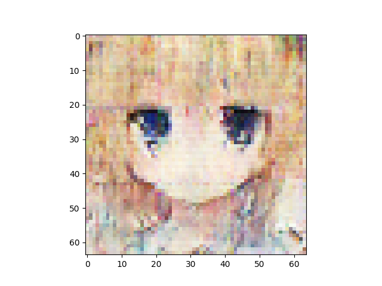
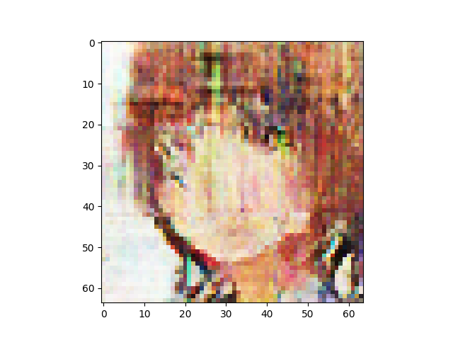

n_latent:512 

n_base_channels:32 

PBP weight:0.5 

n_solo_epochs:0 

n_combo_epochs:200 

max_disc_loss :999 

Epoch0, VAE Training loss 3759.65210, ResNet Training loss 0.5598893166, Time used 36.29

Epoch1, VAE Training loss 3607.80786, ResNet Training loss 0.4275985956, Time used 33.50

Epoch2, VAE Training loss 3542.45605, ResNet Training loss 0.3826678097, Time used 33.85

Epoch3, VAE Training loss 3556.95972, ResNet Training loss 0.4852162004, Time used 33.55

Epoch4, VAE Training loss 3546.16479, ResNet Training loss 0.4428040683, Time used 34.13

Epoch5, VAE Training loss 3525.00244, ResNet Training loss 0.3391947746, Time used 34.13

Epoch6, VAE Training loss 3545.34082, ResNet Training loss 0.4406343699, Time used 34.03

Epoch7, VAE Training loss 3555.45312, ResNet Training loss 0.4219080806, Time used 33.78

Epoch8, VAE Training loss 3552.61157, ResNet Training loss 0.4087575674, Time used 33.74

Epoch9, VAE Training loss 3572.39722, ResNet Training loss 0.4920203388, Time used 34.12

Epoch10, VAE Training loss 3553.68066, ResNet Training loss 0.3186048865, Time used 33.89

Epoch11, VAE Training loss 3547.23877, ResNet Training loss 0.3922239542, Time used 33.86

Epoch12, VAE Training loss 3550.88257, ResNet Training loss 0.4373577535, Time used 33.62

Epoch13, VAE Training loss 3529.08228, ResNet Training loss 0.2933416069, Time used 33.83

Epoch14, VAE Training loss 3478.48315, ResNet Training loss 0.0035931929, Time used 34.04

Epoch15, VAE Training loss 3504.72949, ResNet Training loss 0.2594875097, Time used 34.25

Epoch16, VAE Training loss 3548.56348, ResNet Training loss 0.4010741413, Time used 33.70

Epoch17, VAE Training loss 3570.95312, ResNet Training loss 0.4897896051, Time used 33.95

Epoch18, VAE Training loss 3578.65381, ResNet Training loss 0.5131846070, Time used 33.82

Epoch19, VAE Training loss 3546.89771, ResNet Training loss 0.4384815395, Time used 33.86

Epoch20, VAE Training loss 3585.35474, ResNet Training loss 0.5954399705, Time used 33.74

Epoch21, VAE Training loss 3558.52466, ResNet Training loss 0.4767208099, Time used 33.49

Epoch22, VAE Training loss 3577.70239, ResNet Training loss 0.4313716590, Time used 33.52

Epoch23, VAE Training loss 3580.45166, ResNet Training loss 0.5187699795, Time used 33.89

Epoch24, VAE Training loss 3568.45972, ResNet Training loss 0.4092366993, Time used 33.65

Epoch25, VAE Training loss 3572.36621, ResNet Training loss 0.4848050177, Time used 33.68

Epoch26, VAE Training loss 3569.38330, ResNet Training loss 0.4731723368, Time used 33.81

Epoch27, VAE Training loss 3547.26147, ResNet Training loss 0.3904606104, Time used 33.55

Epoch28, VAE Training loss 3587.53833, ResNet Training loss 0.4820581377, Time used 33.83

Epoch29, VAE Training loss 3585.11572, ResNet Training loss 0.3773268759, Time used 33.93

Epoch30, VAE Training loss 3589.67822, ResNet Training loss 0.4809027910, Time used 33.87

Epoch31, VAE Training loss 3578.27856, ResNet Training loss 0.3441582322, Time used 33.70

Epoch32, VAE Training loss 3558.96924, ResNet Training loss 0.4467931390, Time used 33.82

Epoch33, VAE Training loss 3594.61841, ResNet Training loss 0.4347126782, Time used 33.49

Epoch34, VAE Training loss 3593.55640, ResNet Training loss 0.4186801016, Time used 33.69

Epoch35, VAE Training loss 3605.22314, ResNet Training loss 0.4413735867, Time used 34.25

Epoch36, VAE Training loss 3595.91821, ResNet Training loss 0.4108430147, Time used 33.91

Epoch37, VAE Training loss 3602.74805, ResNet Training loss 0.4333634377, Time used 33.49

Epoch38, VAE Training loss 3581.60596, ResNet Training loss 0.4272940457, Time used 33.33

Epoch39, VAE Training loss 3570.82837, ResNet Training loss 0.3735587001, Time used 33.45

Epoch40, VAE Training loss 3595.89453, ResNet Training loss 0.4741514921, Time used 33.59

Epoch41, VAE Training loss 3587.61987, ResNet Training loss 0.3987540603, Time used 34.08

Epoch42, VAE Training loss 3587.87671, ResNet Training loss 0.3465892673, Time used 33.64

Epoch43, VAE Training loss 3587.21094, ResNet Training loss 0.3279567659, Time used 33.68

Epoch44, VAE Training loss 3608.87524, ResNet Training loss 0.4165357053, Time used 33.47

Epoch45, VAE Training loss 3588.70459, ResNet Training loss 0.3454045057, Time used 33.36

Epoch46, VAE Training loss 3603.15820, ResNet Training loss 0.3361082375, Time used 33.66

Epoch47, VAE Training loss 3629.03760, ResNet Training loss 0.3943882585, Time used 33.61

Epoch48, VAE Training loss 3641.86426, ResNet Training loss 0.3599836230, Time used 33.73

Epoch49, VAE Training loss 3625.22510, ResNet Training loss 0.3010781705, Time used 33.52

Epoch50, VAE Training loss 3623.80127, ResNet Training loss 0.3503077626, Time used 33.37

Epoch51, VAE Training loss 3613.90967, ResNet Training loss 0.3701995611, Time used 33.63

Epoch52, VAE Training loss 3650.62231, ResNet Training loss 0.2871521115, Time used 33.48

Epoch53, VAE Training loss 3650.02661, ResNet Training loss 0.3268276751, Time used 33.80

Epoch54, VAE Training loss 3644.44873, ResNet Training loss 0.3129015863, Time used 33.53

Epoch55, VAE Training loss 3643.72412, ResNet Training loss 0.3078985214, Time used 33.82

Epoch56, VAE Training loss 3626.41064, ResNet Training loss 0.3088670373, Time used 33.67

Epoch57, VAE Training loss 3653.94263, ResNet Training loss 0.2785503864, Time used 33.88

Epoch58, VAE Training loss 3626.66162, ResNet Training loss 0.2540096045, Time used 33.65

Epoch59, VAE Training loss 3641.99707, ResNet Training loss 0.3263842463, Time used 33.60

Epoch60, VAE Training loss 3634.51074, ResNet Training loss 0.2290996462, Time used 33.43

Epoch61, VAE Training loss 3643.49536, ResNet Training loss 0.2428097427, Time used 33.75

Epoch62, VAE Training loss 3658.06348, ResNet Training loss 0.2984636128, Time used 33.64

Epoch63, VAE Training loss 3635.49438, ResNet Training loss 0.2469816357, Time used 33.63

Epoch64, VAE Training loss 3660.13184, ResNet Training loss 0.2724785805, Time used 33.40

Epoch65, VAE Training loss 3671.07812, ResNet Training loss 0.2753242850, Time used 33.92

Epoch66, VAE Training loss 3656.86035, ResNet Training loss 0.2431267947, Time used 33.78

Epoch67, VAE Training loss 3677.29199, ResNet Training loss 0.1899446547, Time used 33.72

Epoch68, VAE Training loss 3677.96387, ResNet Training loss 0.2487243116, Time used 33.49

Epoch69, VAE Training loss 3684.42456, ResNet Training loss 0.2572985291, Time used 33.51

Epoch70, VAE Training loss 3660.54688, ResNet Training loss 0.2399550229, Time used 33.95

Epoch71, VAE Training loss 3658.39624, ResNet Training loss 0.1807961911, Time used 33.63

Epoch72, VAE Training loss 3652.68213, ResNet Training loss 0.1848243177, Time used 33.63

Epoch73, VAE Training loss 3666.23853, ResNet Training loss 0.1762397736, Time used 33.52

Epoch74, VAE Training loss 3682.07178, ResNet Training loss 0.2485373020, Time used 33.89

Epoch75, VAE Training loss 3686.30273, ResNet Training loss 0.2122536004, Time used 33.75

Epoch76, VAE Training loss 3689.94775, ResNet Training loss 0.2116673738, Time used 33.65

Epoch77, VAE Training loss 3701.34790, ResNet Training loss 0.1699130237, Time used 33.41

Epoch78, VAE Training loss 3673.35645, ResNet Training loss 0.1947652698, Time used 33.89

Epoch79, VAE Training loss 3691.64502, ResNet Training loss 0.1417190284, Time used 33.81

Epoch80, VAE Training loss 3715.11475, ResNet Training loss 0.1576967835, Time used 33.61

Epoch81, VAE Training loss 3715.71411, ResNet Training loss 0.1801730245, Time used 33.60

Epoch82, VAE Training loss 3716.77002, ResNet Training loss 0.1952398270, Time used 33.78

Epoch83, VAE Training loss 3699.58423, ResNet Training loss 0.1849177033, Time used 34.12

Epoch84, VAE Training loss 3680.71802, ResNet Training loss 0.1409908235, Time used 33.58

Epoch85, VAE Training loss 3680.58252, ResNet Training loss 0.1369930208, Time used 33.64

Epoch86, VAE Training loss 3693.71704, ResNet Training loss 0.1367583275, Time used 33.95

Epoch87, VAE Training loss 3676.59814, ResNet Training loss 0.1730449945, Time used 33.61

Epoch88, VAE Training loss 3672.12280, ResNet Training loss 0.1814402044, Time used 33.85

Epoch89, VAE Training loss 3671.47974, ResNet Training loss 0.1691530049, Time used 34.36

Epoch90, VAE Training loss 3688.50732, ResNet Training loss 0.1126616150, Time used 33.83

Epoch91, VAE Training loss 3687.73877, ResNet Training loss 0.1596377939, Time used 33.45

Epoch92, VAE Training loss 3687.18140, ResNet Training loss 0.1771018207, Time used 33.78

Epoch93, VAE Training loss 3680.33887, ResNet Training loss 0.2038662434, Time used 33.42

Epoch94, VAE Training loss 3706.14404, ResNet Training loss 0.2172228247, Time used 33.50

Epoch95, VAE Training loss 3708.33569, ResNet Training loss 0.1840403825, Time used 33.68

Epoch96, VAE Training loss 3668.33276, ResNet Training loss 0.1901882589, Time used 33.48

Epoch97, VAE Training loss 3679.43774, ResNet Training loss 0.1791004241, Time used 33.56

Epoch98, VAE Training loss 3686.94995, ResNet Training loss 0.1374319792, Time used 33.57

Epoch99, VAE Training loss 3734.12402, ResNet Training loss 0.1183946580, Time used 33.89

Epoch100, VAE Training loss 3712.95312, ResNet Training loss 0.1078914329, Time used 33.42

Epoch101, VAE Training loss 3692.18774, ResNet Training loss 0.1369668245, Time used 33.43

Epoch102, VAE Training loss 3704.15527, ResNet Training loss 0.1607001424, Time used 33.65

Epoch103, VAE Training loss 3702.03784, ResNet Training loss 0.1508190632, Time used 33.66

Epoch104, VAE Training loss 3701.84253, ResNet Training loss 0.0785425529, Time used 33.48

Epoch105, VAE Training loss 3698.61011, ResNet Training loss 0.1835230440, Time used 34.02

Epoch106, VAE Training loss 3674.98804, ResNet Training loss 0.1083881631, Time used 33.97

Epoch107, VAE Training loss 3691.62720, ResNet Training loss 0.1176889762, Time used 33.93

Epoch108, VAE Training loss 3686.17310, ResNet Training loss 0.2354615480, Time used 33.41

Epoch109, VAE Training loss 3675.93652, ResNet Training loss 0.1109472066, Time used 33.63

Epoch110, VAE Training loss 3722.21387, ResNet Training loss 0.1411842704, Time used 33.56

Epoch111, VAE Training loss 3697.88525, ResNet Training loss 0.1436779499, Time used 33.98

Epoch112, VAE Training loss 3682.72876, ResNet Training loss 0.1489083022, Time used 33.73

Epoch113, VAE Training loss 3672.91602, ResNet Training loss 0.1556218117, Time used 33.58

Epoch114, VAE Training loss 3700.19019, ResNet Training loss 0.1286580414, Time used 33.76

Epoch115, VAE Training loss 3718.23096, ResNet Training loss 0.1504070461, Time used 33.46

Epoch116, VAE Training loss 3680.34253, ResNet Training loss 0.1956001818, Time used 33.53

Epoch117, VAE Training loss 3690.79907, ResNet Training loss 0.1394177079, Time used 33.85

Epoch118, VAE Training loss 3705.67603, ResNet Training loss 0.0848425925, Time used 33.63

Epoch119, VAE Training loss 3714.73853, ResNet Training loss 0.1841463298, Time used 33.80

Epoch120, VAE Training loss 3669.62964, ResNet Training loss 0.1733218431, Time used 34.17

Epoch121, VAE Training loss 3639.80786, ResNet Training loss 0.0801292434, Time used 33.97

Epoch122, VAE Training loss 3683.31152, ResNet Training loss 0.0903779045, Time used 33.96

Epoch123, VAE Training loss 3696.39624, ResNet Training loss 0.1612371057, Time used 33.77

Epoch124, VAE Training loss 3685.38647, ResNet Training loss 0.1469726562, Time used 33.59

Epoch125, VAE Training loss 3672.80176, ResNet Training loss 0.1640795916, Time used 33.72

Epoch126, VAE Training loss 3705.53687, ResNet Training loss 0.1641357392, Time used 33.76

Epoch127, VAE Training loss 3667.64575, ResNet Training loss 0.1684724540, Time used 33.58

Epoch128, VAE Training loss 3692.67310, ResNet Training loss 0.1134750396, Time used 33.53

Epoch129, VAE Training loss 3692.69189, ResNet Training loss 0.1583885998, Time used 33.32

Epoch130, VAE Training loss 3708.27222, ResNet Training loss 0.1272376180, Time used 33.57

Epoch131, VAE Training loss 3683.03613, ResNet Training loss 0.0731828660, Time used 33.29

Epoch132, VAE Training loss 3668.49780, ResNet Training loss 0.1480571181, Time used 33.94

Epoch133, VAE Training loss 3717.05786, ResNet Training loss 0.0892743915, Time used 33.79

Epoch134, VAE Training loss 3706.79297, ResNet Training loss 0.1050419733, Time used 33.69

Epoch135, VAE Training loss 3711.63159, ResNet Training loss 0.1321296692, Time used 33.49

Epoch136, VAE Training loss 3742.35327, ResNet Training loss 0.1703240573, Time used 33.54

Epoch137, VAE Training loss 3691.94580, ResNet Training loss 0.1664035916, Time used 33.87

Epoch138, VAE Training loss 3731.89575, ResNet Training loss 0.1004586369, Time used 33.55

Epoch139, VAE Training loss 3738.87451, ResNet Training loss 0.1272016913, Time used 33.36

Epoch140, VAE Training loss 3726.24146, ResNet Training loss 0.1391033083, Time used 33.62

Epoch141, VAE Training loss 3740.38452, ResNet Training loss 0.0910961628, Time used 33.76

Epoch142, VAE Training loss 3721.18042, ResNet Training loss 0.1694128215, Time used 33.71

Epoch143, VAE Training loss 3719.69922, ResNet Training loss 0.0778849497, Time used 33.56

Epoch144, VAE Training loss 3750.08887, ResNet Training loss 0.1107084900, Time used 33.79

Epoch145, VAE Training loss 3701.07568, ResNet Training loss 0.0917781442, Time used 33.69

Epoch146, VAE Training loss 3711.98438, ResNet Training loss 0.1170311719, Time used 33.37

Epoch147, VAE Training loss 3723.59399, ResNet Training loss 0.1553079039, Time used 34.01

Epoch148, VAE Training loss 3726.22070, ResNet Training loss 0.1366388947, Time used 33.47

Epoch149, VAE Training loss 3667.97607, ResNet Training loss 0.0710854381, Time used 33.46

Epoch150, VAE Training loss 3716.31763, ResNet Training loss 0.1044486612, Time used 33.49

Epoch151, VAE Training loss 3774.50220, ResNet Training loss 0.0894028172, Time used 33.68

Epoch152, VAE Training loss 3702.31055, ResNet Training loss 0.0800319090, Time used 33.64

Epoch153, VAE Training loss 3718.17993, ResNet Training loss 0.1319878250, Time used 33.79

Epoch154, VAE Training loss 3726.41895, ResNet Training loss 0.0911954716, Time used 33.26

Epoch155, VAE Training loss 3730.86572, ResNet Training loss 0.1082201079, Time used 33.34

Epoch156, VAE Training loss 3740.37354, ResNet Training loss 0.1544253379, Time used 33.82

Epoch157, VAE Training loss 3773.66211, ResNet Training loss 0.0761932060, Time used 33.76

Epoch158, VAE Training loss 3775.40991, ResNet Training loss 0.1327231526, Time used 33.61

Epoch159, VAE Training loss 3763.48242, ResNet Training loss 0.1177916378, Time used 33.92

Epoch160, VAE Training loss 3741.70776, ResNet Training loss 0.1146888062, Time used 33.84

Epoch161, VAE Training loss 3740.99268, ResNet Training loss 0.1228932962, Time used 34.17

Epoch162, VAE Training loss 3739.75977, ResNet Training loss 0.1073002666, Time used 33.58

Epoch163, VAE Training loss 3733.50220, ResNet Training loss 0.0836213231, Time used 33.97

Epoch164, VAE Training loss 3742.29224, ResNet Training loss 0.1378504485, Time used 33.55

Epoch165, VAE Training loss 3728.59937, ResNet Training loss 0.0855233967, Time used 34.15

Epoch166, VAE Training loss 3727.45703, ResNet Training loss 0.0477074459, Time used 34.28

Epoch167, VAE Training loss 3715.58057, ResNet Training loss 0.1069212407, Time used 33.66

Epoch168, VAE Training loss 3722.82153, ResNet Training loss 0.0942174494, Time used 33.32

Epoch169, VAE Training loss 3759.70703, ResNet Training loss 0.1141902953, Time used 33.45

Epoch170, VAE Training loss 3769.18799, ResNet Training loss 0.2110574543, Time used 33.69

Epoch171, VAE Training loss 3751.06787, ResNet Training loss 0.0888281092, Time used 33.81

Epoch172, VAE Training loss 3772.08911, ResNet Training loss 0.0863786042, Time used 33.34

Epoch173, VAE Training loss 3751.74731, ResNet Training loss 0.0594759211, Time used 33.37

Epoch174, VAE Training loss 3756.44531, ResNet Training loss 0.0930401757, Time used 33.48

Epoch175, VAE Training loss 3759.51123, ResNet Training loss 0.1292978376, Time used 33.39

Epoch176, VAE Training loss 3765.51465, ResNet Training loss 0.1897029281, Time used 33.81

Epoch177, VAE Training loss 3780.10498, ResNet Training loss 0.0830677450, Time used 33.61

Epoch178, VAE Training loss 3726.61890, ResNet Training loss 0.0742243826, Time used 33.69

Epoch179, VAE Training loss 3695.75293, ResNet Training loss 0.1962890029, Time used 33.31

Epoch180, VAE Training loss 3729.22632, ResNet Training loss 0.1429655999, Time used 33.57

Epoch181, VAE Training loss 3707.53394, ResNet Training loss 0.0662643537, Time used 34.15

Epoch182, VAE Training loss 3765.10889, ResNet Training loss 0.0301043224, Time used 34.17

Epoch183, VAE Training loss 3730.93066, ResNet Training loss 0.0362855718, Time used 33.84

Epoch184, VAE Training loss 3745.15332, ResNet Training loss 0.1232108250, Time used 33.98

Epoch185, VAE Training loss 3721.66943, ResNet Training loss 0.1005598456, Time used 33.59

Epoch186, VAE Training loss 3744.00977, ResNet Training loss 0.1329116374, Time used 33.70

Epoch187, VAE Training loss 3751.13135, ResNet Training loss 0.0947830155, Time used 33.48

Epoch188, VAE Training loss 3744.38062, ResNet Training loss 0.1063312590, Time used 33.77

Epoch189, VAE Training loss 3724.23193, ResNet Training loss 0.1113695949, Time used 33.45

Epoch190, VAE Training loss 3693.77612, ResNet Training loss 0.0842829347, Time used 34.05

Epoch191, VAE Training loss 3778.39795, ResNet Training loss 0.1591001451, Time used 33.77

Epoch192, VAE Training loss 3753.61206, ResNet Training loss 0.0911987871, Time used 34.11

Epoch193, VAE Training loss 3806.31665, ResNet Training loss 0.1484734416, Time used 33.79

Epoch194, VAE Training loss 3767.17676, ResNet Training loss 0.0830494240, Time used 34.10

Epoch195, VAE Training loss 3797.68286, ResNet Training loss 0.1000538543, Time used 33.65

Epoch196, VAE Training loss 3786.59546, ResNet Training loss 0.1245673597, Time used 33.65

Epoch197, VAE Training loss 3805.53174, ResNet Training loss 0.0780309290, Time used 33.83

Epoch198, VAE Training loss 3757.70996, ResNet Training loss 0.1052594930, Time used 33.55

Epoch199, VAE Training loss 3781.69360, ResNet Training loss 0.0725253746, Time used 33.39

