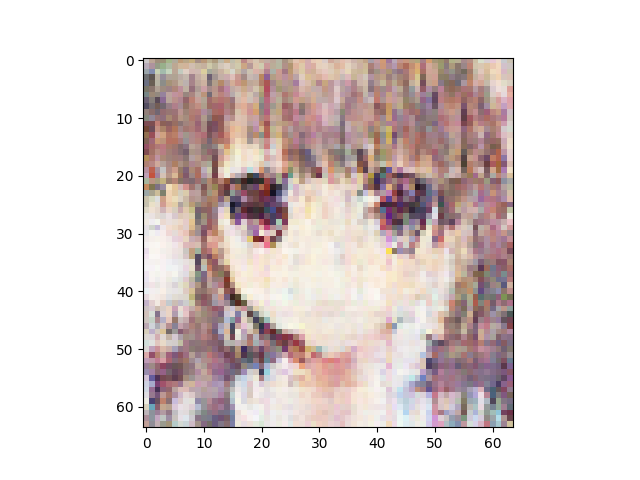
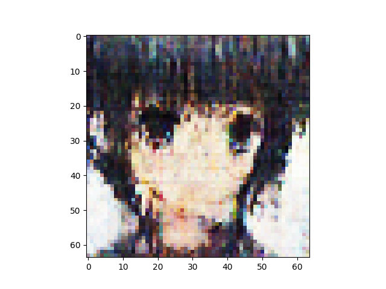
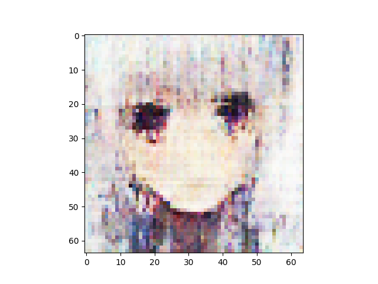
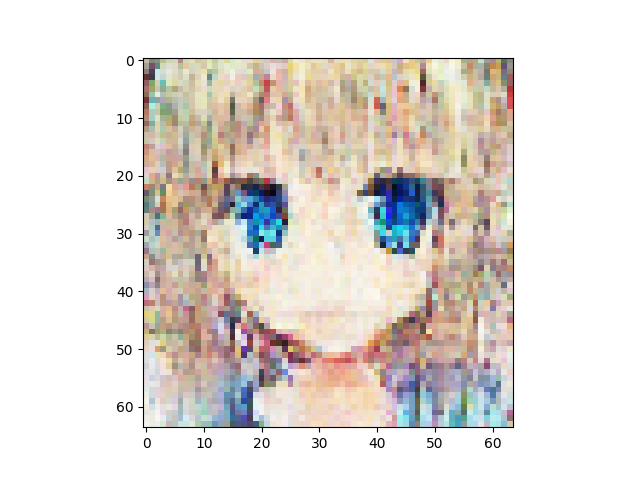

n_latent:512 

n_base_channels:32 

PBP weight:0.8 

n_solo_epochs:0 

n_combo_epochs:200 

max_disc_loss :999 

Epoch0, VAE Training loss 5825.90234, ResNet Training loss 0.6918135881, Time used 35.90

Epoch1, VAE Training loss 5551.62744, ResNet Training loss 0.1726519763, Time used 33.95

Epoch2, VAE Training loss 5514.16650, ResNet Training loss 0.3135704100, Time used 33.85

Epoch3, VAE Training loss 5489.95654, ResNet Training loss 0.3817842305, Time used 33.81

Epoch4, VAE Training loss 5547.21289, ResNet Training loss 0.3600354791, Time used 33.84

Epoch5, VAE Training loss 5520.55664, ResNet Training loss 0.2402470559, Time used 34.02

Epoch6, VAE Training loss 5496.55273, ResNet Training loss 0.0240674149, Time used 34.10

Epoch7, VAE Training loss 5491.46338, ResNet Training loss 0.0145291332, Time used 34.03

Epoch8, VAE Training loss 5524.46680, ResNet Training loss 0.3818379939, Time used 34.05

Epoch9, VAE Training loss 5493.43213, ResNet Training loss 0.1976986825, Time used 34.36

Epoch10, VAE Training loss 5497.86377, ResNet Training loss 0.1726439446, Time used 34.07

Epoch11, VAE Training loss 5486.13232, ResNet Training loss 0.0927533433, Time used 33.87

Epoch12, VAE Training loss 5471.65039, ResNet Training loss 0.1992654800, Time used 34.13

Epoch13, VAE Training loss 5503.91748, ResNet Training loss 0.1383408457, Time used 34.08

Epoch14, VAE Training loss 5535.78711, ResNet Training loss 0.3146680593, Time used 34.03

Epoch15, VAE Training loss 5510.55078, ResNet Training loss 0.1745317429, Time used 33.90

Epoch16, VAE Training loss 5544.93408, ResNet Training loss 0.2902565598, Time used 33.66

Epoch17, VAE Training loss 5512.97119, ResNet Training loss 0.3569297194, Time used 33.83

Epoch18, VAE Training loss 5476.04248, ResNet Training loss 0.1457121968, Time used 33.86

Epoch19, VAE Training loss 5551.15234, ResNet Training loss 0.3161358237, Time used 33.97

Epoch20, VAE Training loss 5538.54248, ResNet Training loss 0.3579401374, Time used 33.85

Epoch21, VAE Training loss 5543.33008, ResNet Training loss 0.2782769799, Time used 34.03

Epoch22, VAE Training loss 5535.86328, ResNet Training loss 0.2846784890, Time used 34.03

Epoch23, VAE Training loss 5539.99561, ResNet Training loss 0.2243303359, Time used 33.78

Epoch24, VAE Training loss 5545.81689, ResNet Training loss 0.2536585629, Time used 34.21

Epoch25, VAE Training loss 5557.71094, ResNet Training loss 0.3948074281, Time used 33.91

Epoch26, VAE Training loss 5547.86670, ResNet Training loss 0.3512055576, Time used 34.07

Epoch27, VAE Training loss 5489.76025, ResNet Training loss 0.1401786953, Time used 33.80

Epoch28, VAE Training loss 5503.21582, ResNet Training loss 0.1323719323, Time used 33.98

Epoch29, VAE Training loss 5531.69434, ResNet Training loss 0.2541338801, Time used 34.02

Epoch30, VAE Training loss 5545.72363, ResNet Training loss 0.2651439011, Time used 34.06

Epoch31, VAE Training loss 5514.08154, ResNet Training loss 0.1786011010, Time used 33.82

Epoch32, VAE Training loss 5523.47510, ResNet Training loss 0.1491264254, Time used 33.93

Epoch33, VAE Training loss 5511.87744, ResNet Training loss 0.1567250341, Time used 34.01

Epoch34, VAE Training loss 5536.58350, ResNet Training loss 0.3061925769, Time used 33.85

Epoch35, VAE Training loss 5523.29443, ResNet Training loss 0.3336699009, Time used 33.93

Epoch36, VAE Training loss 5476.16455, ResNet Training loss 0.2904602885, Time used 34.24

Epoch37, VAE Training loss 5522.52686, ResNet Training loss 0.2936718762, Time used 33.81

Epoch38, VAE Training loss 5550.73633, ResNet Training loss 0.2784390450, Time used 33.93

Epoch39, VAE Training loss 5570.04443, ResNet Training loss 0.4034991860, Time used 33.75

Epoch40, VAE Training loss 5564.67236, ResNet Training loss 0.3706996441, Time used 34.02

Epoch41, VAE Training loss 5545.45557, ResNet Training loss 0.2498574108, Time used 33.91

Epoch42, VAE Training loss 5548.47412, ResNet Training loss 0.2415287942, Time used 34.05

Epoch43, VAE Training loss 5559.96387, ResNet Training loss 0.3462565541, Time used 33.98

Epoch44, VAE Training loss 5508.22607, ResNet Training loss 0.1610369682, Time used 33.88

Epoch45, VAE Training loss 5550.60938, ResNet Training loss 0.2471711934, Time used 33.84

Epoch46, VAE Training loss 5531.33447, ResNet Training loss 0.2354864329, Time used 34.13

Epoch47, VAE Training loss 5562.88574, ResNet Training loss 0.4437013268, Time used 33.99

Epoch48, VAE Training loss 5501.09961, ResNet Training loss 0.0844762698, Time used 34.00

Epoch49, VAE Training loss 5541.42969, ResNet Training loss 0.2128266543, Time used 34.28

Epoch50, VAE Training loss 5540.28027, ResNet Training loss 0.2617910802, Time used 33.86

Epoch51, VAE Training loss 5535.57764, ResNet Training loss 0.3184201419, Time used 34.07

Epoch52, VAE Training loss 5515.99023, ResNet Training loss 0.1803752035, Time used 33.72

Epoch53, VAE Training loss 5540.61523, ResNet Training loss 0.3030925393, Time used 33.82

Epoch54, VAE Training loss 5526.10645, ResNet Training loss 0.2494265288, Time used 33.84

Epoch55, VAE Training loss 5539.18213, ResNet Training loss 0.2926267982, Time used 34.00

Epoch56, VAE Training loss 5542.35205, ResNet Training loss 0.3142510951, Time used 34.28

Epoch57, VAE Training loss 5540.00000, ResNet Training loss 0.2774895430, Time used 34.01

Epoch58, VAE Training loss 5540.11719, ResNet Training loss 0.2476909161, Time used 34.00

Epoch59, VAE Training loss 5544.20752, ResNet Training loss 0.3188593984, Time used 33.85

Epoch60, VAE Training loss 5550.83984, ResNet Training loss 0.2899285257, Time used 33.92

Epoch61, VAE Training loss 5537.44238, ResNet Training loss 0.2275205851, Time used 33.90

Epoch62, VAE Training loss 5525.75195, ResNet Training loss 0.2351777107, Time used 33.85

Epoch63, VAE Training loss 5525.81934, ResNet Training loss 0.2806850076, Time used 33.98

Epoch64, VAE Training loss 5535.18115, ResNet Training loss 0.2680726945, Time used 33.58

Epoch65, VAE Training loss 5532.30713, ResNet Training loss 0.2260469198, Time used 33.77

Epoch66, VAE Training loss 5531.34668, ResNet Training loss 0.2617198825, Time used 33.71

Epoch67, VAE Training loss 5512.31543, ResNet Training loss 0.1979976892, Time used 33.80

Epoch68, VAE Training loss 5536.52246, ResNet Training loss 0.3289490342, Time used 33.89

Epoch69, VAE Training loss 5536.50195, ResNet Training loss 0.2372182459, Time used 33.84

Epoch70, VAE Training loss 5560.58984, ResNet Training loss 0.4352850914, Time used 33.87

Epoch71, VAE Training loss 5513.98779, ResNet Training loss 0.2457222790, Time used 33.64

Epoch72, VAE Training loss 5515.38721, ResNet Training loss 0.1795320362, Time used 34.16

Epoch73, VAE Training loss 5531.75977, ResNet Training loss 0.2107144892, Time used 33.68

Epoch74, VAE Training loss 5546.56738, ResNet Training loss 0.4197760522, Time used 33.85

Epoch75, VAE Training loss 5549.01123, ResNet Training loss 0.3729566634, Time used 33.85

Epoch76, VAE Training loss 5544.69922, ResNet Training loss 0.2890195549, Time used 33.95

Epoch77, VAE Training loss 5557.06299, ResNet Training loss 0.3975558281, Time used 33.74

Epoch78, VAE Training loss 5553.14551, ResNet Training loss 0.3406207263, Time used 33.71

Epoch79, VAE Training loss 5568.58203, ResNet Training loss 0.4321096539, Time used 33.83

Epoch80, VAE Training loss 5537.05225, ResNet Training loss 0.1757615209, Time used 34.01

Epoch81, VAE Training loss 5525.98438, ResNet Training loss 0.2053945214, Time used 33.74

Epoch82, VAE Training loss 5537.44531, ResNet Training loss 0.2239430398, Time used 33.92

Epoch83, VAE Training loss 5544.38623, ResNet Training loss 0.3133814335, Time used 33.80

Epoch84, VAE Training loss 5527.89746, ResNet Training loss 0.2460236996, Time used 33.86

Epoch85, VAE Training loss 5561.22461, ResNet Training loss 0.3881342709, Time used 34.26

Epoch86, VAE Training loss 5498.86865, ResNet Training loss 0.2029222548, Time used 34.13

Epoch87, VAE Training loss 5537.03125, ResNet Training loss 0.2582776248, Time used 33.95

Epoch88, VAE Training loss 5567.91309, ResNet Training loss 0.3510767221, Time used 33.95

Epoch89, VAE Training loss 5534.28223, ResNet Training loss 0.2852880359, Time used 34.26

Epoch90, VAE Training loss 5534.83350, ResNet Training loss 0.2495189011, Time used 33.88

Epoch91, VAE Training loss 5539.82861, ResNet Training loss 0.2916647494, Time used 33.97

Epoch92, VAE Training loss 5540.06934, ResNet Training loss 0.2784023285, Time used 33.90

Epoch93, VAE Training loss 5549.29688, ResNet Training loss 0.2639204860, Time used 34.04

Epoch94, VAE Training loss 5541.20850, ResNet Training loss 0.2154456824, Time used 33.91

Epoch95, VAE Training loss 5569.31836, ResNet Training loss 0.4280503392, Time used 33.93

Epoch96, VAE Training loss 5548.28467, ResNet Training loss 0.2547389269, Time used 33.73

Epoch97, VAE Training loss 5558.24170, ResNet Training loss 0.3338571191, Time used 33.98

Epoch98, VAE Training loss 5564.94678, ResNet Training loss 0.3246780038, Time used 33.98

Epoch99, VAE Training loss 5562.08594, ResNet Training loss 0.3841588795, Time used 34.08

Epoch100, VAE Training loss 5540.66846, ResNet Training loss 0.2034450322, Time used 33.78

Epoch101, VAE Training loss 5567.43896, ResNet Training loss 0.3667646050, Time used 33.90

Epoch102, VAE Training loss 5556.16309, ResNet Training loss 0.2698662281, Time used 34.11

Epoch103, VAE Training loss 5543.61377, ResNet Training loss 0.2466145307, Time used 33.89

Epoch104, VAE Training loss 5556.48975, ResNet Training loss 0.2984945774, Time used 33.75

Epoch105, VAE Training loss 5549.03027, ResNet Training loss 0.2924689353, Time used 33.76

Epoch106, VAE Training loss 5550.24365, ResNet Training loss 0.2426652163, Time used 33.67

Epoch107, VAE Training loss 5528.85107, ResNet Training loss 0.1885696948, Time used 33.90

Epoch108, VAE Training loss 5563.74707, ResNet Training loss 0.3477829099, Time used 33.76

Epoch109, VAE Training loss 5547.03613, ResNet Training loss 0.2642384171, Time used 33.94

Epoch110, VAE Training loss 5559.28516, ResNet Training loss 0.2966544628, Time used 33.88

Epoch111, VAE Training loss 5570.85840, ResNet Training loss 0.2864249349, Time used 33.73

Epoch112, VAE Training loss 5557.93701, ResNet Training loss 0.2792177200, Time used 33.81

Epoch113, VAE Training loss 5586.70752, ResNet Training loss 0.4151976407, Time used 33.77

Epoch114, VAE Training loss 5554.78125, ResNet Training loss 0.2035346478, Time used 34.00

Epoch115, VAE Training loss 5571.63330, ResNet Training loss 0.2936240435, Time used 34.06

Epoch116, VAE Training loss 5583.18604, ResNet Training loss 0.3299998045, Time used 33.99

Epoch117, VAE Training loss 5568.97070, ResNet Training loss 0.2766465843, Time used 34.19

Epoch118, VAE Training loss 5580.26318, ResNet Training loss 0.3212788999, Time used 33.78

Epoch119, VAE Training loss 5554.63965, ResNet Training loss 0.3049622178, Time used 33.78

Epoch120, VAE Training loss 5559.54102, ResNet Training loss 0.2399870455, Time used 33.81

Epoch121, VAE Training loss 5578.64795, ResNet Training loss 0.2947905958, Time used 33.79

Epoch122, VAE Training loss 5578.01709, ResNet Training loss 0.2326360941, Time used 33.90

Epoch123, VAE Training loss 5590.49805, ResNet Training loss 0.2981355488, Time used 34.20

Epoch124, VAE Training loss 5563.02197, ResNet Training loss 0.1959012896, Time used 33.80

Epoch125, VAE Training loss 5580.81250, ResNet Training loss 0.3140000999, Time used 33.94

Epoch126, VAE Training loss 5586.32275, ResNet Training loss 0.2889135182, Time used 34.05

Epoch127, VAE Training loss 5568.50977, ResNet Training loss 0.2514402568, Time used 33.62

Epoch128, VAE Training loss 5582.03223, ResNet Training loss 0.2349953800, Time used 33.77

Epoch129, VAE Training loss 5567.92529, ResNet Training loss 0.2391885519, Time used 34.00

Epoch130, VAE Training loss 5593.56738, ResNet Training loss 0.3031813204, Time used 33.93

Epoch131, VAE Training loss 5606.25635, ResNet Training loss 0.2648940682, Time used 33.98

Epoch132, VAE Training loss 5562.50098, ResNet Training loss 0.2224403322, Time used 33.78

Epoch133, VAE Training loss 5558.37939, ResNet Training loss 0.1805207729, Time used 33.84

Epoch134, VAE Training loss 5573.70703, ResNet Training loss 0.2133779824, Time used 33.90

Epoch135, VAE Training loss 5581.23633, ResNet Training loss 0.2194793820, Time used 34.05

Epoch136, VAE Training loss 5583.76953, ResNet Training loss 0.2278324813, Time used 33.90

Epoch137, VAE Training loss 5583.70703, ResNet Training loss 0.2635793388, Time used 33.81

Epoch138, VAE Training loss 5607.23340, ResNet Training loss 0.2352233380, Time used 33.85

Epoch139, VAE Training loss 5595.70361, ResNet Training loss 0.2516480684, Time used 33.81

Epoch140, VAE Training loss 5600.66553, ResNet Training loss 0.2689545751, Time used 33.72

Epoch141, VAE Training loss 5582.11816, ResNet Training loss 0.2350531667, Time used 34.03

Epoch142, VAE Training loss 5562.46387, ResNet Training loss 0.1294382662, Time used 33.75

Epoch143, VAE Training loss 5597.70264, ResNet Training loss 0.1996588558, Time used 33.90

Epoch144, VAE Training loss 5598.18896, ResNet Training loss 0.2200412005, Time used 33.93

Epoch145, VAE Training loss 5558.29004, ResNet Training loss 0.2033703327, Time used 33.77

Epoch146, VAE Training loss 5475.20898, ResNet Training loss 0.0142451050, Time used 33.62

Epoch147, VAE Training loss 5576.94141, ResNet Training loss 0.1359630674, Time used 33.94

Epoch148, VAE Training loss 5587.05811, ResNet Training loss 0.2224672586, Time used 34.20

Epoch149, VAE Training loss 5583.78320, ResNet Training loss 0.1530327052, Time used 33.84

Epoch150, VAE Training loss 5599.06201, ResNet Training loss 0.2137500942, Time used 33.91

Epoch151, VAE Training loss 5577.80713, ResNet Training loss 0.1500535160, Time used 34.03

Epoch152, VAE Training loss 5563.86475, ResNet Training loss 0.1614092290, Time used 34.16

Epoch153, VAE Training loss 5580.24414, ResNet Training loss 0.1775652170, Time used 33.97

Epoch154, VAE Training loss 5578.51221, ResNet Training loss 0.1589762717, Time used 33.89

Epoch155, VAE Training loss 5581.39746, ResNet Training loss 0.1588756144, Time used 33.99

Epoch156, VAE Training loss 5572.32568, ResNet Training loss 0.1279249638, Time used 34.17

Epoch157, VAE Training loss 5589.71533, ResNet Training loss 0.1982257366, Time used 34.09

Epoch158, VAE Training loss 5574.35889, ResNet Training loss 0.1835625470, Time used 33.97

Epoch159, VAE Training loss 5582.24365, ResNet Training loss 0.1746318936, Time used 34.12

Epoch160, VAE Training loss 5593.17236, ResNet Training loss 0.1888460815, Time used 34.14

Epoch161, VAE Training loss 5608.42627, ResNet Training loss 0.1500034630, Time used 34.15

Epoch162, VAE Training loss 5607.57227, ResNet Training loss 0.2120306343, Time used 34.34

Epoch163, VAE Training loss 5595.95361, ResNet Training loss 0.1954893321, Time used 34.26

Epoch164, VAE Training loss 5599.98438, ResNet Training loss 0.1649735421, Time used 34.04

Epoch165, VAE Training loss 5601.59912, ResNet Training loss 0.1443279237, Time used 33.96

Epoch166, VAE Training loss 5598.03711, ResNet Training loss 0.1104172319, Time used 34.13

Epoch167, VAE Training loss 5612.54053, ResNet Training loss 0.1940043718, Time used 34.43

Epoch168, VAE Training loss 5583.82520, ResNet Training loss 0.1579690427, Time used 34.14

Epoch169, VAE Training loss 5583.22266, ResNet Training loss 0.1737930626, Time used 33.78

Epoch170, VAE Training loss 5606.02295, ResNet Training loss 0.1636494100, Time used 33.81

Epoch171, VAE Training loss 5601.34473, ResNet Training loss 0.1120828837, Time used 34.04

Epoch172, VAE Training loss 5591.37207, ResNet Training loss 0.1569894850, Time used 33.76

Epoch173, VAE Training loss 5583.83496, ResNet Training loss 0.1031440049, Time used 33.89

Epoch174, VAE Training loss 5582.69287, ResNet Training loss 0.1843179166, Time used 33.88

Epoch175, VAE Training loss 5586.27148, ResNet Training loss 0.1119617298, Time used 33.72

Epoch176, VAE Training loss 5598.62695, ResNet Training loss 0.1533510834, Time used 33.93

Epoch177, VAE Training loss 5580.46387, ResNet Training loss 0.1401515305, Time used 33.83

Epoch178, VAE Training loss 5587.32373, ResNet Training loss 0.1156998128, Time used 33.77

Epoch179, VAE Training loss 5579.61523, ResNet Training loss 0.1359973103, Time used 33.81

Epoch180, VAE Training loss 5505.46680, ResNet Training loss 0.0273724347, Time used 33.91

Epoch181, VAE Training loss 5531.34424, ResNet Training loss 0.0523626804, Time used 33.60

Epoch182, VAE Training loss 5549.31299, ResNet Training loss 0.0456723236, Time used 33.92

Epoch183, VAE Training loss 5522.27393, ResNet Training loss 0.2697744370, Time used 33.81

Epoch184, VAE Training loss 5604.12012, ResNet Training loss 0.1984335929, Time used 33.94

Epoch185, VAE Training loss 5610.74609, ResNet Training loss 0.1813679487, Time used 33.95

Epoch186, VAE Training loss 5605.01123, ResNet Training loss 0.1235842109, Time used 33.84

Epoch187, VAE Training loss 5610.19531, ResNet Training loss 0.1487565488, Time used 33.61

Epoch188, VAE Training loss 5552.84424, ResNet Training loss 0.0558740087, Time used 33.87

Epoch189, VAE Training loss 5575.99170, ResNet Training loss 0.1039831042, Time used 34.04

Epoch190, VAE Training loss 5590.37939, ResNet Training loss 0.0901130438, Time used 33.62

Epoch191, VAE Training loss 5582.48975, ResNet Training loss 0.1417111754, Time used 33.92

Epoch192, VAE Training loss 5568.86035, ResNet Training loss 0.1451613307, Time used 33.94

Epoch193, VAE Training loss 5592.10254, ResNet Training loss 0.1077530533, Time used 34.00

Epoch194, VAE Training loss 5599.09521, ResNet Training loss 0.1629676372, Time used 34.19

Epoch195, VAE Training loss 5599.66357, ResNet Training loss 0.1454993337, Time used 33.99

Epoch196, VAE Training loss 5601.98682, ResNet Training loss 0.1062725484, Time used 34.02

Epoch197, VAE Training loss 5620.09277, ResNet Training loss 0.1317066699, Time used 33.88

Epoch198, VAE Training loss 5619.27148, ResNet Training loss 0.1358645260, Time used 33.95

Epoch199, VAE Training loss 5630.57031, ResNet Training loss 0.0977293551, Time used 33.89

