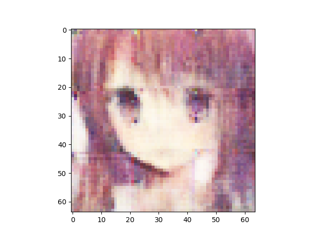

n_latent:512 

n_base_channels:32 

PBP weight:1.2 

n_solo_epochs:0 

n_combo_epochs:200 

max_disc_loss :999 

Epoch0, VAE Training loss 8607.50195, ResNet Training loss 0.8329288960, Time used 34.03

Epoch1, VAE Training loss 8205.87988, ResNet Training loss 0.5993906856, Time used 31.09

Epoch2, VAE Training loss 8166.12793, ResNet Training loss 0.2907071412, Time used 31.43

Epoch3, VAE Training loss 8116.96875, ResNet Training loss 0.1814072132, Time used 31.01

Epoch4, VAE Training loss 8118.55176, ResNet Training loss 0.0851030722, Time used 31.26

Epoch5, VAE Training loss 8136.62793, ResNet Training loss 0.1360401064, Time used 31.18

Epoch6, VAE Training loss 8106.23047, ResNet Training loss 0.2036975175, Time used 31.40

Epoch7, VAE Training loss 8099.09814, ResNet Training loss 0.0076984018, Time used 31.26

Epoch8, VAE Training loss 8093.86865, ResNet Training loss 0.0006117247, Time used 31.16

Epoch9, VAE Training loss 8101.02783, ResNet Training loss 0.0005131967, Time used 31.01

Epoch10, VAE Training loss 8023.49170, ResNet Training loss 0.4938746095, Time used 31.06

Epoch11, VAE Training loss 8048.36133, ResNet Training loss 0.0671660677, Time used 31.20

Epoch12, VAE Training loss 8093.19336, ResNet Training loss 0.1583919674, Time used 31.17

Epoch13, VAE Training loss 8079.70557, ResNet Training loss 0.1219893843, Time used 31.07

Epoch14, VAE Training loss 8082.15186, ResNet Training loss 0.2311953157, Time used 31.75

Epoch15, VAE Training loss 8014.43311, ResNet Training loss 0.0022636580, Time used 31.04

Epoch16, VAE Training loss 8038.17773, ResNet Training loss 0.0374182947, Time used 31.31

Epoch17, VAE Training loss 8047.59424, ResNet Training loss 0.1910263598, Time used 30.79

Epoch18, VAE Training loss 8065.72510, ResNet Training loss 0.2506277561, Time used 30.93

Epoch19, VAE Training loss 8072.09619, ResNet Training loss 0.1419205219, Time used 30.89

Epoch20, VAE Training loss 8100.93262, ResNet Training loss 0.1273561418, Time used 31.03

Epoch21, VAE Training loss 8067.38867, ResNet Training loss 0.1681433767, Time used 30.86

Epoch22, VAE Training loss 8061.92236, ResNet Training loss 0.1184751019, Time used 31.13

Epoch23, VAE Training loss 8092.66650, ResNet Training loss 0.1710585058, Time used 30.95

Epoch24, VAE Training loss 8110.84814, ResNet Training loss 0.1995777935, Time used 30.83

Epoch25, VAE Training loss 8070.08447, ResNet Training loss 0.1643931419, Time used 30.93

Epoch26, VAE Training loss 7982.36377, ResNet Training loss 0.0015037429, Time used 31.48

Epoch27, VAE Training loss 7997.37695, ResNet Training loss 0.0007271460, Time used 31.16

Epoch28, VAE Training loss 8015.97607, ResNet Training loss 0.0004982320, Time used 31.29

Epoch29, VAE Training loss 8047.70166, ResNet Training loss 0.0007045132, Time used 31.38

Epoch30, VAE Training loss 8091.92969, ResNet Training loss 0.0832664743, Time used 31.03

Epoch31, VAE Training loss 8062.35107, ResNet Training loss 0.0000764240, Time used 31.19

Epoch32, VAE Training loss 8051.44092, ResNet Training loss 0.0000209982, Time used 31.36

Epoch33, VAE Training loss 8044.67041, ResNet Training loss 0.0000193622, Time used 31.11

Epoch34, VAE Training loss 8041.64160, ResNet Training loss 0.0000211688, Time used 31.19

Epoch35, VAE Training loss 8041.13330, ResNet Training loss 0.0000285467, Time used 31.21

Epoch36, VAE Training loss 8040.74609, ResNet Training loss 0.0000334729, Time used 31.22

Epoch37, VAE Training loss 8044.17969, ResNet Training loss 0.0529115871, Time used 31.12

Epoch38, VAE Training loss 8006.65186, ResNet Training loss 0.1444518268, Time used 31.07

Epoch39, VAE Training loss 8010.15576, ResNet Training loss 0.1468350738, Time used 30.97

Epoch40, VAE Training loss 8034.57520, ResNet Training loss 0.1207643449, Time used 31.21

Epoch41, VAE Training loss 8062.73340, ResNet Training loss 0.0844764560, Time used 31.21

Epoch42, VAE Training loss 8038.57666, ResNet Training loss 0.1079928353, Time used 31.15

Epoch43, VAE Training loss 8055.78516, ResNet Training loss 0.2486924976, Time used 31.11

Epoch44, VAE Training loss 7993.53223, ResNet Training loss 0.1554722190, Time used 31.13

Epoch45, VAE Training loss 8040.48975, ResNet Training loss 0.0027637114, Time used 30.94

Epoch46, VAE Training loss 8031.84277, ResNet Training loss 0.0001259501, Time used 31.12

Epoch47, VAE Training loss 8046.40625, ResNet Training loss 0.0003163727, Time used 31.22

Epoch48, VAE Training loss 8006.83154, ResNet Training loss 0.1289639175, Time used 31.12

Epoch49, VAE Training loss 8033.23682, ResNet Training loss 0.1496264488, Time used 31.14

Epoch50, VAE Training loss 7962.89648, ResNet Training loss 0.1117339134, Time used 31.10

Epoch51, VAE Training loss 7998.93701, ResNet Training loss 0.2353287637, Time used 31.11

Epoch52, VAE Training loss 8004.57764, ResNet Training loss 0.0450504497, Time used 31.04

Epoch53, VAE Training loss 8020.12939, ResNet Training loss 0.1443821490, Time used 31.23

Epoch54, VAE Training loss 8001.30566, ResNet Training loss 0.1018517092, Time used 31.00

Epoch55, VAE Training loss 7982.77051, ResNet Training loss 0.0034137450, Time used 31.14

Epoch56, VAE Training loss 8053.53125, ResNet Training loss 0.1879993081, Time used 31.13

Epoch57, VAE Training loss 8012.67334, ResNet Training loss 0.0042137280, Time used 31.17

Epoch58, VAE Training loss 8028.53223, ResNet Training loss 0.1307078898, Time used 31.13

Epoch59, VAE Training loss 8031.36670, ResNet Training loss 0.1193915159, Time used 30.92

Epoch60, VAE Training loss 8032.10547, ResNet Training loss 0.0493229814, Time used 31.63

Epoch61, VAE Training loss 8046.52148, ResNet Training loss 0.0824031830, Time used 32.13

Epoch62, VAE Training loss 8043.58691, ResNet Training loss 0.1457563043, Time used 32.44

Epoch63, VAE Training loss 7972.22217, ResNet Training loss 0.1284779012, Time used 32.50

Epoch64, VAE Training loss 8019.19092, ResNet Training loss 0.0849005133, Time used 32.46

Epoch65, VAE Training loss 8039.66309, ResNet Training loss 0.1406181306, Time used 31.31

Epoch66, VAE Training loss 8000.67578, ResNet Training loss 0.0791416988, Time used 31.07

Epoch67, VAE Training loss 8037.21289, ResNet Training loss 0.0827937871, Time used 31.14

Epoch68, VAE Training loss 8021.53809, ResNet Training loss 0.2236905396, Time used 31.45

Epoch69, VAE Training loss 7994.96777, ResNet Training loss 0.0864190534, Time used 31.21

Epoch70, VAE Training loss 8057.71680, ResNet Training loss 0.2660690844, Time used 30.87

Epoch71, VAE Training loss 8032.66309, ResNet Training loss 0.1291581690, Time used 31.18

Epoch72, VAE Training loss 8045.83447, ResNet Training loss 0.0968668908, Time used 30.89

Epoch73, VAE Training loss 8075.12939, ResNet Training loss 0.2664969862, Time used 31.48

Epoch74, VAE Training loss 8059.05908, ResNet Training loss 0.1043930501, Time used 31.34

Epoch75, VAE Training loss 8074.78613, ResNet Training loss 0.1908467859, Time used 30.89

Epoch76, VAE Training loss 8071.09082, ResNet Training loss 0.1259349287, Time used 31.20

Epoch77, VAE Training loss 8095.03418, ResNet Training loss 0.2511969805, Time used 31.18

Epoch78, VAE Training loss 7948.89453, ResNet Training loss 0.0510810427, Time used 31.06

Epoch79, VAE Training loss 7979.04932, ResNet Training loss 0.0001490537, Time used 31.71

Epoch80, VAE Training loss 8002.17773, ResNet Training loss 0.0000700991, Time used 31.21

Epoch81, VAE Training loss 8059.80811, ResNet Training loss 0.1274248958, Time used 30.90

Epoch82, VAE Training loss 8063.97510, ResNet Training loss 0.2083095759, Time used 30.96

Epoch83, VAE Training loss 8041.69922, ResNet Training loss 0.1589196920, Time used 31.27

Epoch84, VAE Training loss 8072.34180, ResNet Training loss 0.2522176504, Time used 31.24

Epoch85, VAE Training loss 8079.25293, ResNet Training loss 0.0873033702, Time used 31.21

Epoch86, VAE Training loss 8053.19824, ResNet Training loss 0.0817325339, Time used 31.09

Epoch87, VAE Training loss 8063.10449, ResNet Training loss 0.1317642778, Time used 30.98

Epoch88, VAE Training loss 8030.78906, ResNet Training loss 0.0673717931, Time used 30.91

Epoch89, VAE Training loss 8025.61963, ResNet Training loss 0.0021294036, Time used 31.26

Epoch90, VAE Training loss 8069.46094, ResNet Training loss 0.2062879652, Time used 31.13

Epoch91, VAE Training loss 8058.04443, ResNet Training loss 0.1701682210, Time used 30.96

Epoch92, VAE Training loss 8025.76025, ResNet Training loss 0.2013543993, Time used 31.20

Epoch93, VAE Training loss 8081.62207, ResNet Training loss 0.1517503262, Time used 31.29

Epoch94, VAE Training loss 8067.51025, ResNet Training loss 0.1453110427, Time used 31.35

Epoch95, VAE Training loss 8077.02979, ResNet Training loss 0.2040981948, Time used 31.22

Epoch96, VAE Training loss 8092.65820, ResNet Training loss 0.1661456078, Time used 30.88

Epoch97, VAE Training loss 8073.69629, ResNet Training loss 0.0938487202, Time used 31.55

Epoch98, VAE Training loss 8088.13867, ResNet Training loss 0.1890898049, Time used 31.38

Epoch99, VAE Training loss 7962.60938, ResNet Training loss 0.1869082153, Time used 31.43

Epoch100, VAE Training loss 8039.37109, ResNet Training loss 0.1875311136, Time used 31.44

Epoch101, VAE Training loss 8054.07227, ResNet Training loss 0.1544773877, Time used 31.32

Epoch102, VAE Training loss 8062.73877, ResNet Training loss 0.0492468439, Time used 31.36

Epoch103, VAE Training loss 8057.08496, ResNet Training loss 0.1883870214, Time used 31.23

Epoch104, VAE Training loss 8093.42041, ResNet Training loss 0.2600885928, Time used 31.61

Epoch105, VAE Training loss 8072.65186, ResNet Training loss 0.1241477132, Time used 31.34

Epoch106, VAE Training loss 8078.56836, ResNet Training loss 0.0393441543, Time used 31.28

Epoch107, VAE Training loss 8064.42773, ResNet Training loss 0.1105527207, Time used 30.96

Epoch108, VAE Training loss 8049.15625, ResNet Training loss 0.1233930215, Time used 30.88

Epoch109, VAE Training loss 8067.77686, ResNet Training loss 0.1372943223, Time used 31.55

Epoch110, VAE Training loss 8052.40723, ResNet Training loss 0.0808647946, Time used 31.18

Epoch111, VAE Training loss 8052.30908, ResNet Training loss 0.0380587429, Time used 31.21

Epoch112, VAE Training loss 8094.27588, ResNet Training loss 0.0977621898, Time used 31.38

Epoch113, VAE Training loss 8028.54541, ResNet Training loss 0.2236687392, Time used 31.39

Epoch114, VAE Training loss 7929.62402, ResNet Training loss 0.0007368251, Time used 31.25

Epoch115, VAE Training loss 7952.76123, ResNet Training loss 0.0000473141, Time used 31.45

Epoch116, VAE Training loss 7950.77246, ResNet Training loss 0.0879470035, Time used 31.44

Epoch117, VAE Training loss 7962.80811, ResNet Training loss 0.0002776191, Time used 31.27

Epoch118, VAE Training loss 8004.70654, ResNet Training loss 0.0268101934, Time used 31.36

Epoch119, VAE Training loss 8038.47754, ResNet Training loss 0.1824974120, Time used 31.29

Epoch120, VAE Training loss 8082.65186, ResNet Training loss 0.2226482779, Time used 31.30

Epoch121, VAE Training loss 8066.64551, ResNet Training loss 0.1552067697, Time used 31.25

Epoch122, VAE Training loss 8049.89355, ResNet Training loss 0.1036188304, Time used 31.38

Epoch123, VAE Training loss 8095.96191, ResNet Training loss 0.2730700970, Time used 31.25

Epoch124, VAE Training loss 8076.20166, ResNet Training loss 0.1564892828, Time used 31.09

Epoch125, VAE Training loss 8012.52588, ResNet Training loss 0.0029780248, Time used 31.08

Epoch126, VAE Training loss 8074.62695, ResNet Training loss 0.2083173245, Time used 31.34

Epoch127, VAE Training loss 8063.85205, ResNet Training loss 0.1612934321, Time used 31.19

Epoch128, VAE Training loss 8101.35205, ResNet Training loss 0.2783870399, Time used 31.17

Epoch129, VAE Training loss 8040.86865, ResNet Training loss 0.0241144206, Time used 31.11

Epoch130, VAE Training loss 8064.67236, ResNet Training loss 0.0808642358, Time used 31.16

Epoch131, VAE Training loss 8074.57031, ResNet Training loss 0.1440117657, Time used 31.34

Epoch132, VAE Training loss 8091.07959, ResNet Training loss 0.2189693600, Time used 30.94

Epoch133, VAE Training loss 8070.20850, ResNet Training loss 0.1604124904, Time used 30.86

Epoch134, VAE Training loss 8078.47217, ResNet Training loss 0.1950782239, Time used 31.06

Epoch135, VAE Training loss 8001.26855, ResNet Training loss 0.0007037928, Time used 30.98

Epoch136, VAE Training loss 8035.70752, ResNet Training loss 0.0010033729, Time used 31.25

Epoch137, VAE Training loss 8039.70361, ResNet Training loss 0.0001476401, Time used 31.14

Epoch138, VAE Training loss 8041.51660, ResNet Training loss 0.0001075297, Time used 31.11

Epoch139, VAE Training loss 8045.84277, ResNet Training loss 0.0000630797, Time used 30.84

Epoch140, VAE Training loss 8047.01562, ResNet Training loss 0.0198521707, Time used 30.88

Epoch141, VAE Training loss 8000.38330, ResNet Training loss 0.1537712812, Time used 31.17

Epoch142, VAE Training loss 7993.18506, ResNet Training loss 0.0504589938, Time used 31.06

Epoch143, VAE Training loss 7996.26953, ResNet Training loss 0.0905746892, Time used 31.22

Epoch144, VAE Training loss 7977.68701, ResNet Training loss 0.0013139391, Time used 31.10

Epoch145, VAE Training loss 8023.82568, ResNet Training loss 0.2594593763, Time used 31.28

Epoch146, VAE Training loss 8052.33447, ResNet Training loss 0.0260224380, Time used 31.22

Epoch147, VAE Training loss 8039.09424, ResNet Training loss 0.2352401465, Time used 31.34

Epoch148, VAE Training loss 7926.93701, ResNet Training loss 0.0016722271, Time used 30.91

Epoch149, VAE Training loss 7953.01855, ResNet Training loss 0.0014743881, Time used 31.22

Epoch150, VAE Training loss 7983.52246, ResNet Training loss 0.0002850396, Time used 30.85

Epoch151, VAE Training loss 7994.34912, ResNet Training loss 0.0001763756, Time used 31.46

Epoch152, VAE Training loss 7991.60449, ResNet Training loss 0.1631584764, Time used 31.62

Epoch153, VAE Training loss 8030.25732, ResNet Training loss 0.0601571538, Time used 31.11

Epoch154, VAE Training loss 8018.32959, ResNet Training loss 0.0796630159, Time used 31.29

Epoch155, VAE Training loss 7949.92578, ResNet Training loss 0.0029166427, Time used 30.78

Epoch156, VAE Training loss 8037.10352, ResNet Training loss 0.2567147613, Time used 31.15

Epoch157, VAE Training loss 7994.35352, ResNet Training loss 0.0971955582, Time used 31.20

Epoch158, VAE Training loss 8009.03809, ResNet Training loss 0.0040998752, Time used 30.76

Epoch159, VAE Training loss 8076.59717, ResNet Training loss 0.1997774541, Time used 30.97

Epoch160, VAE Training loss 8025.59619, ResNet Training loss 0.1536033601, Time used 31.20

Epoch161, VAE Training loss 8063.74463, ResNet Training loss 0.1171122268, Time used 30.84

Epoch162, VAE Training loss 8082.16504, ResNet Training loss 0.2184520960, Time used 31.46

Epoch163, VAE Training loss 8052.10010, ResNet Training loss 0.1442535222, Time used 30.99

Epoch164, VAE Training loss 8056.90723, ResNet Training loss 0.0691500306, Time used 31.19

Epoch165, VAE Training loss 8044.88330, ResNet Training loss 0.1343154311, Time used 31.36

Epoch166, VAE Training loss 8049.50928, ResNet Training loss 0.0125493063, Time used 31.08

Epoch167, VAE Training loss 8028.11035, ResNet Training loss 0.1461808085, Time used 31.03

Epoch168, VAE Training loss 8031.86133, ResNet Training loss 0.1905795932, Time used 30.95

Epoch169, VAE Training loss 8000.68066, ResNet Training loss 0.0014784404, Time used 31.07

Epoch170, VAE Training loss 7988.40820, ResNet Training loss 0.0004056789, Time used 31.23

Epoch171, VAE Training loss 7993.96094, ResNet Training loss 0.0003421222, Time used 31.06

Epoch172, VAE Training loss 8009.48633, ResNet Training loss 0.0497964248, Time used 31.00

Epoch173, VAE Training loss 8041.28125, ResNet Training loss 0.1511629075, Time used 31.35

Epoch174, VAE Training loss 7957.11768, ResNet Training loss 0.0031409697, Time used 31.21

Epoch175, VAE Training loss 8012.15918, ResNet Training loss 0.0471236631, Time used 31.45

Epoch176, VAE Training loss 8063.54346, ResNet Training loss 0.1036712900, Time used 31.52

Epoch177, VAE Training loss 8067.79150, ResNet Training loss 0.0856345594, Time used 31.19

Epoch178, VAE Training loss 8056.10449, ResNet Training loss 0.2012530565, Time used 31.21

Epoch179, VAE Training loss 8042.86475, ResNet Training loss 0.0698978379, Time used 30.99

Epoch180, VAE Training loss 7967.83154, ResNet Training loss 0.0021056070, Time used 31.23

Epoch181, VAE Training loss 8006.03076, ResNet Training loss 0.0585613735, Time used 31.50

Epoch182, VAE Training loss 8044.66016, ResNet Training loss 0.2461639345, Time used 31.36

Epoch183, VAE Training loss 7967.16309, ResNet Training loss 0.0042421441, Time used 31.30

Epoch184, VAE Training loss 8015.88135, ResNet Training loss 0.0226514041, Time used 31.04

Epoch185, VAE Training loss 8004.04248, ResNet Training loss 0.0005397711, Time used 31.13

Epoch186, VAE Training loss 8036.37305, ResNet Training loss 0.1222946718, Time used 30.76

Epoch187, VAE Training loss 7981.29443, ResNet Training loss 0.0018134974, Time used 31.37

Epoch188, VAE Training loss 8018.12598, ResNet Training loss 0.0520393625, Time used 31.00

Epoch189, VAE Training loss 8039.42969, ResNet Training loss 0.1028258577, Time used 30.88

Epoch190, VAE Training loss 8008.74072, ResNet Training loss 0.1417655498, Time used 31.17

Epoch191, VAE Training loss 7999.35645, ResNet Training loss 0.0022920251, Time used 31.15

Epoch192, VAE Training loss 8015.26855, ResNet Training loss 0.0004363638, Time used 31.28

Epoch193, VAE Training loss 8019.07227, ResNet Training loss 0.0002754498, Time used 31.30

Epoch194, VAE Training loss 8026.98340, ResNet Training loss 0.0001336850, Time used 30.96

Epoch195, VAE Training loss 8026.60742, ResNet Training loss 0.0001130723, Time used 31.29

Epoch196, VAE Training loss 8035.34277, ResNet Training loss 0.0668644011, Time used 30.94

Epoch197, VAE Training loss 7998.55371, ResNet Training loss 0.0874187797, Time used 31.00

Epoch198, VAE Training loss 7983.14453, ResNet Training loss 0.0011555440, Time used 31.02

Epoch199, VAE Training loss 7969.63232, ResNet Training loss 0.0666321665, Time used 31.03

