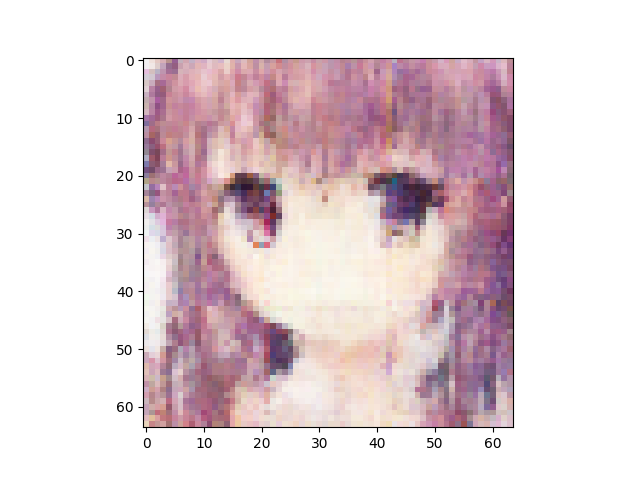
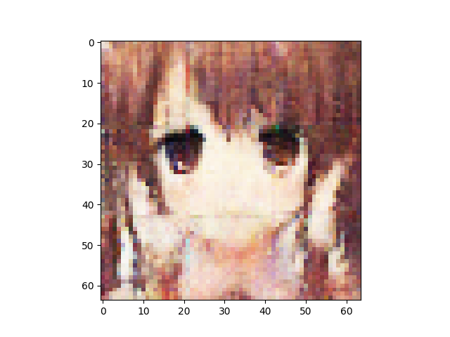
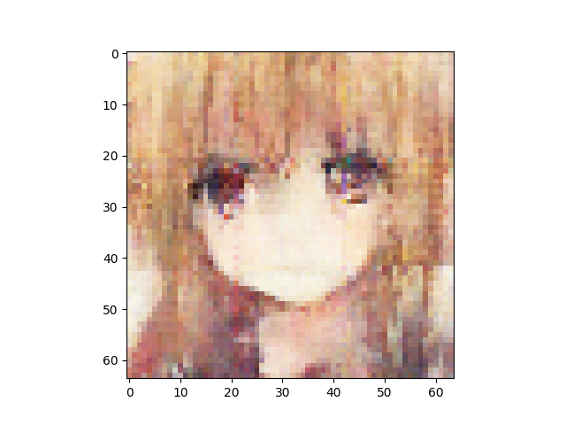
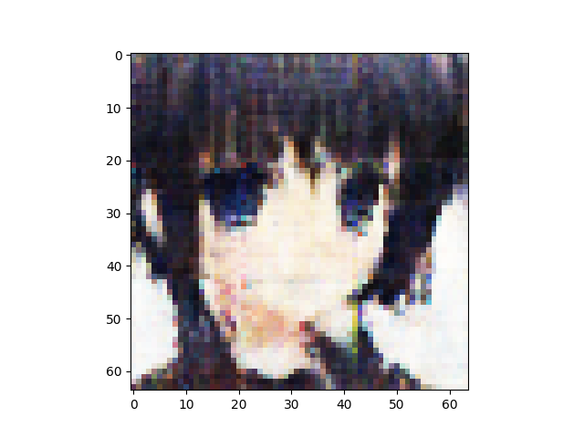
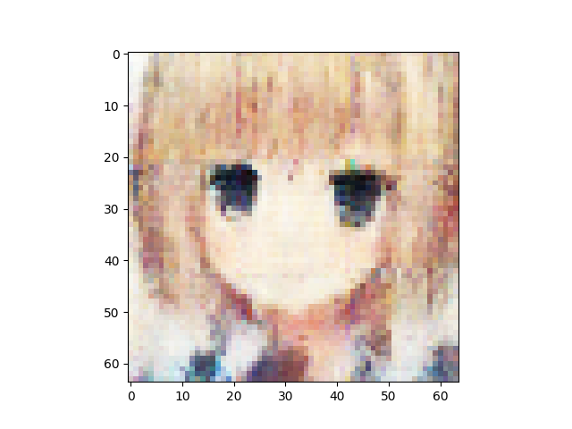
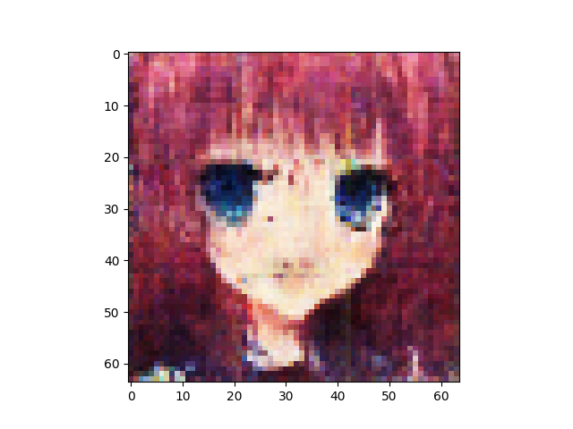

n_latent:512 

n_base_channels:32 

PBP weight:1 

n_solo_epochs:10 

n_combo_epochs:10 

max_disc_loss :999 

Epoch0, Training loss 8213.7119140625, Time used 2.84

Epoch1, Training loss 7669.9375000000, Time used 0.58

Epoch2, Training loss 7461.9121093750, Time used 0.58

Epoch3, Training loss 7338.4145507812, Time used 0.58

Epoch4, Training loss 7241.8144531250, Time used 0.58

Epoch5, Training loss 7170.7177734375, Time used 0.58

Epoch6, Training loss 7096.0249023438, Time used 0.58

Epoch7, Training loss 7047.1303710938, Time used 0.58

Epoch8, Training loss 7003.7973632812, Time used 0.58

Epoch9, Training loss 6979.2675781250, Time used 0.58

Epoch10, VAE Training loss 6970.61426, ResNet Training loss 1.8378292322, Time used 2.33

Epoch11, VAE Training loss 6992.43945, ResNet Training loss 0.1072506234, Time used 1.96

Epoch12, VAE Training loss 7023.92383, ResNet Training loss 0.0016653282, Time used 1.98

Epoch13, VAE Training loss 7010.49316, ResNet Training loss 0.0005059702, Time used 1.96

Epoch14, VAE Training loss 6994.60352, ResNet Training loss 0.0002073081, Time used 1.96

Epoch15, VAE Training loss 6948.67773, ResNet Training loss 1.1824649572, Time used 1.96

Epoch16, VAE Training loss 6896.94727, ResNet Training loss 0.2642546892, Time used 1.96

Epoch17, VAE Training loss 6926.56201, ResNet Training loss 0.0044160690, Time used 1.96

Epoch18, VAE Training loss 6889.95801, ResNet Training loss 1.9417238235, Time used 1.96

Epoch19, VAE Training loss 6831.39697, ResNet Training loss 1.3109097481, Time used 1.96

