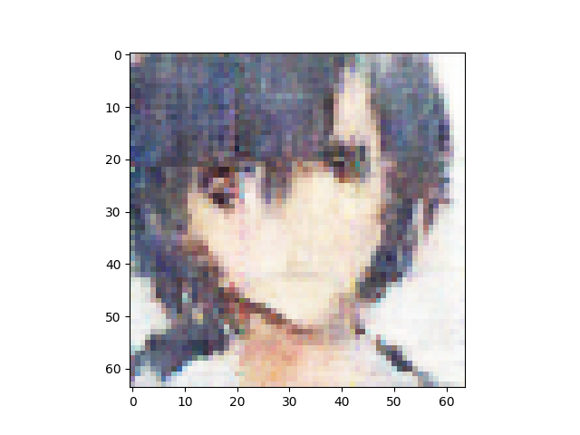
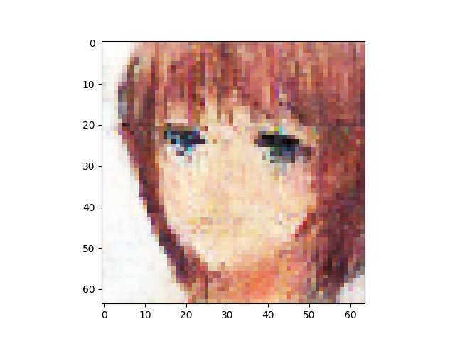

n_latent:512 

n_base_channels:32 

PBP weight:1 

n_solo_epochs:0 

n_combo_epochs:200 

max_disc_loss :999 

Epoch0, VAE Training loss 7238.25635, ResNet Training loss 0.6424872279, Time used 35.42

Epoch1, VAE Training loss 6919.60645, ResNet Training loss 0.1047782302, Time used 33.90

Epoch2, VAE Training loss 6838.37793, ResNet Training loss 0.0799300596, Time used 33.82

Epoch3, VAE Training loss 6818.59424, ResNet Training loss 0.2421190292, Time used 34.09

Epoch4, VAE Training loss 6848.07227, ResNet Training loss 0.3154396415, Time used 34.02

Epoch5, VAE Training loss 6817.00439, ResNet Training loss 0.1667241156, Time used 33.97

Epoch6, VAE Training loss 6825.47705, ResNet Training loss 0.1911583990, Time used 33.69

Epoch7, VAE Training loss 6849.10449, ResNet Training loss 0.2131558508, Time used 33.93

Epoch8, VAE Training loss 6812.87549, ResNet Training loss 0.0329609104, Time used 33.73

Epoch9, VAE Training loss 6829.75439, ResNet Training loss 0.1541940123, Time used 33.91

Epoch10, VAE Training loss 6826.50439, ResNet Training loss 0.2196213007, Time used 34.21

Epoch11, VAE Training loss 6861.96338, ResNet Training loss 0.2152284980, Time used 33.87

Epoch12, VAE Training loss 6862.65479, ResNet Training loss 0.3497391939, Time used 33.72

Epoch13, VAE Training loss 6868.83594, ResNet Training loss 0.2179337144, Time used 34.00

Epoch14, VAE Training loss 6855.34912, ResNet Training loss 0.2101918608, Time used 33.92

Epoch15, VAE Training loss 6866.43506, ResNet Training loss 0.2762970030, Time used 33.69

Epoch16, VAE Training loss 6879.62988, ResNet Training loss 0.2586759925, Time used 33.72

Epoch17, VAE Training loss 6879.59521, ResNet Training loss 0.2494831830, Time used 33.60

Epoch18, VAE Training loss 6834.99072, ResNet Training loss 0.1577913910, Time used 33.94

Epoch19, VAE Training loss 6763.21484, ResNet Training loss 0.0001259752, Time used 34.00

Epoch20, VAE Training loss 6763.17773, ResNet Training loss 0.0006077443, Time used 33.98

Epoch21, VAE Training loss 6838.75195, ResNet Training loss 0.1697188765, Time used 33.81

Epoch22, VAE Training loss 6831.48779, ResNet Training loss 0.2378917485, Time used 34.34

Epoch23, VAE Training loss 6751.76172, ResNet Training loss 0.0968146920, Time used 34.28

Epoch24, VAE Training loss 6795.56689, ResNet Training loss 0.1907440424, Time used 34.08

Epoch25, VAE Training loss 6749.04248, ResNet Training loss 0.0153902704, Time used 34.21

Epoch26, VAE Training loss 6843.04492, ResNet Training loss 0.2452356368, Time used 34.62

Epoch27, VAE Training loss 6819.51416, ResNet Training loss 0.1470708996, Time used 34.39

Epoch28, VAE Training loss 6866.71289, ResNet Training loss 0.2732465267, Time used 34.52

Epoch29, VAE Training loss 6879.43408, ResNet Training loss 0.2837159932, Time used 34.52

Epoch30, VAE Training loss 6871.73877, ResNet Training loss 0.2569252253, Time used 34.79

Epoch31, VAE Training loss 6853.65479, ResNet Training loss 0.2063507289, Time used 34.30

Epoch32, VAE Training loss 6890.33154, ResNet Training loss 0.3081587553, Time used 34.61

Epoch33, VAE Training loss 6838.93311, ResNet Training loss 0.2532736361, Time used 34.68

Epoch34, VAE Training loss 6726.19629, ResNet Training loss 0.0016582781, Time used 34.35

Epoch35, VAE Training loss 6720.37939, ResNet Training loss 0.0004194394, Time used 34.56

Epoch36, VAE Training loss 6758.54443, ResNet Training loss 0.0196854025, Time used 34.50

Epoch37, VAE Training loss 6853.92773, ResNet Training loss 0.1938911378, Time used 34.40

Epoch38, VAE Training loss 6890.31152, ResNet Training loss 0.2663882077, Time used 34.32

Epoch39, VAE Training loss 6869.17041, ResNet Training loss 0.2264780849, Time used 34.43

Epoch40, VAE Training loss 6884.89893, ResNet Training loss 0.2438288331, Time used 34.62

Epoch41, VAE Training loss 6874.04248, ResNet Training loss 0.2434737831, Time used 34.53

Epoch42, VAE Training loss 6873.09863, ResNet Training loss 0.2575953007, Time used 34.45

Epoch43, VAE Training loss 6834.33154, ResNet Training loss 0.1465705335, Time used 34.94

Epoch44, VAE Training loss 6857.75879, ResNet Training loss 0.1766663343, Time used 34.54

Epoch45, VAE Training loss 6846.42334, ResNet Training loss 0.1369727552, Time used 34.22

Epoch46, VAE Training loss 6854.07324, ResNet Training loss 0.2601259649, Time used 34.26

Epoch47, VAE Training loss 6834.14990, ResNet Training loss 0.1728233546, Time used 34.23

Epoch48, VAE Training loss 6855.76416, ResNet Training loss 0.2314279974, Time used 34.89

Epoch49, VAE Training loss 6875.52148, ResNet Training loss 0.2296174169, Time used 34.57

Epoch50, VAE Training loss 6881.90381, ResNet Training loss 0.2944828570, Time used 34.83

Epoch51, VAE Training loss 6881.50830, ResNet Training loss 0.2853084505, Time used 34.83

Epoch52, VAE Training loss 6881.90479, ResNet Training loss 0.2208744437, Time used 34.73

Epoch53, VAE Training loss 6826.56396, ResNet Training loss 0.1679141521, Time used 34.21

Epoch54, VAE Training loss 6839.31787, ResNet Training loss 0.1132875755, Time used 33.82

Epoch55, VAE Training loss 6868.23486, ResNet Training loss 0.2330887914, Time used 33.47

Epoch56, VAE Training loss 6864.15430, ResNet Training loss 0.2032018006, Time used 33.57

Epoch57, VAE Training loss 6861.67041, ResNet Training loss 0.1919632256, Time used 33.97

Epoch58, VAE Training loss 6795.12598, ResNet Training loss 0.1687862575, Time used 33.44

Epoch59, VAE Training loss 6866.47754, ResNet Training loss 0.2307881713, Time used 33.82

Epoch60, VAE Training loss 6811.36670, ResNet Training loss 0.2504820526, Time used 33.89

Epoch61, VAE Training loss 6750.98779, ResNet Training loss 0.0012083916, Time used 33.57

Epoch62, VAE Training loss 6787.27686, ResNet Training loss 0.1474913657, Time used 33.79

Epoch63, VAE Training loss 6814.37305, ResNet Training loss 0.1488427520, Time used 33.95

Epoch64, VAE Training loss 6831.29980, ResNet Training loss 0.1847265959, Time used 34.08

Epoch65, VAE Training loss 6807.38818, ResNet Training loss 0.1432891339, Time used 34.02

Epoch66, VAE Training loss 6842.35352, ResNet Training loss 0.1931062192, Time used 33.47

Epoch67, VAE Training loss 6855.23584, ResNet Training loss 0.2745539844, Time used 33.61

Epoch68, VAE Training loss 6789.70703, ResNet Training loss 0.1031623110, Time used 33.99

Epoch69, VAE Training loss 6847.55615, ResNet Training loss 0.1712860316, Time used 33.55

Epoch70, VAE Training loss 6856.47949, ResNet Training loss 0.1977082640, Time used 33.96

Epoch71, VAE Training loss 6841.44238, ResNet Training loss 0.2103299946, Time used 33.76

Epoch72, VAE Training loss 6870.76904, ResNet Training loss 0.2464056015, Time used 33.83

Epoch73, VAE Training loss 6845.14990, ResNet Training loss 0.2156885415, Time used 33.53

Epoch74, VAE Training loss 6861.17041, ResNet Training loss 0.1946169883, Time used 33.68

Epoch75, VAE Training loss 6870.75635, ResNet Training loss 0.2532794476, Time used 33.87

Epoch76, VAE Training loss 6847.69580, ResNet Training loss 0.1924368590, Time used 33.97

Epoch77, VAE Training loss 6877.13818, ResNet Training loss 0.2492960840, Time used 33.46

Epoch78, VAE Training loss 6879.68604, ResNet Training loss 0.2703467906, Time used 33.80

Epoch79, VAE Training loss 6867.58984, ResNet Training loss 0.2779673338, Time used 33.90

Epoch80, VAE Training loss 6845.11719, ResNet Training loss 0.1750508845, Time used 33.71

Epoch81, VAE Training loss 6888.51025, ResNet Training loss 0.2665654421, Time used 33.71

Epoch82, VAE Training loss 6881.04248, ResNet Training loss 0.2619188726, Time used 33.83

Epoch83, VAE Training loss 6845.12646, ResNet Training loss 0.1739512831, Time used 33.58

Epoch84, VAE Training loss 6804.17139, ResNet Training loss 0.1151965782, Time used 33.71

Epoch85, VAE Training loss 6856.61865, ResNet Training loss 0.2180516869, Time used 33.59

Epoch86, VAE Training loss 6881.05762, ResNet Training loss 0.2644966841, Time used 33.91

Epoch87, VAE Training loss 6891.05469, ResNet Training loss 0.2285321951, Time used 33.92

Epoch88, VAE Training loss 6850.07910, ResNet Training loss 0.1681249738, Time used 34.04

Epoch89, VAE Training loss 6843.26074, ResNet Training loss 0.2489630878, Time used 33.65

Epoch90, VAE Training loss 6832.36572, ResNet Training loss 0.1804512888, Time used 33.65

Epoch91, VAE Training loss 6876.90381, ResNet Training loss 0.2037972659, Time used 34.15

Epoch92, VAE Training loss 6838.35645, ResNet Training loss 0.1861546338, Time used 34.01

Epoch93, VAE Training loss 6858.85352, ResNet Training loss 0.1896335781, Time used 34.38

Epoch94, VAE Training loss 6877.87012, ResNet Training loss 0.2646718323, Time used 33.71

Epoch95, VAE Training loss 6866.36719, ResNet Training loss 0.2400946468, Time used 33.52

Epoch96, VAE Training loss 6861.91016, ResNet Training loss 0.1590422541, Time used 34.10

Epoch97, VAE Training loss 6899.01221, ResNet Training loss 0.2936536968, Time used 33.80

Epoch98, VAE Training loss 6862.13428, ResNet Training loss 0.1709955484, Time used 33.57

Epoch99, VAE Training loss 6834.57861, ResNet Training loss 0.2120033950, Time used 33.77

Epoch100, VAE Training loss 6823.68457, ResNet Training loss 0.0849803761, Time used 33.71

Epoch101, VAE Training loss 6868.62939, ResNet Training loss 0.1983796954, Time used 33.70

Epoch102, VAE Training loss 6817.57861, ResNet Training loss 0.1639417708, Time used 33.77

Epoch103, VAE Training loss 6862.20410, ResNet Training loss 0.2011204511, Time used 33.91

Epoch104, VAE Training loss 6869.70850, ResNet Training loss 0.2187696695, Time used 34.12

Epoch105, VAE Training loss 6848.32764, ResNet Training loss 0.1561594009, Time used 34.23

Epoch106, VAE Training loss 6836.13965, ResNet Training loss 0.1367861480, Time used 34.34

Epoch107, VAE Training loss 6839.01758, ResNet Training loss 0.1633549035, Time used 33.76

Epoch108, VAE Training loss 6874.56592, ResNet Training loss 0.1916797161, Time used 33.59

Epoch109, VAE Training loss 6864.36768, ResNet Training loss 0.2505304813, Time used 33.82

Epoch110, VAE Training loss 6853.27490, ResNet Training loss 0.1588650793, Time used 34.05

Epoch111, VAE Training loss 6856.36719, ResNet Training loss 0.1583336443, Time used 34.16

Epoch112, VAE Training loss 6880.29785, ResNet Training loss 0.2415404767, Time used 33.88

Epoch113, VAE Training loss 6884.55664, ResNet Training loss 0.2279518992, Time used 33.58

Epoch114, VAE Training loss 6826.52637, ResNet Training loss 0.0895112157, Time used 33.50

Epoch115, VAE Training loss 6839.75439, ResNet Training loss 0.1182403192, Time used 33.55

Epoch116, VAE Training loss 6857.24072, ResNet Training loss 0.1619950384, Time used 33.79

Epoch117, VAE Training loss 6836.67725, ResNet Training loss 0.1322670728, Time used 33.69

Epoch118, VAE Training loss 6859.07520, ResNet Training loss 0.1998906434, Time used 33.76

Epoch119, VAE Training loss 6821.42090, ResNet Training loss 0.1486125588, Time used 33.73

Epoch120, VAE Training loss 6872.60449, ResNet Training loss 0.2042378187, Time used 33.85

Epoch121, VAE Training loss 6830.94971, ResNet Training loss 0.0965026096, Time used 34.24

Epoch122, VAE Training loss 6837.99561, ResNet Training loss 0.1726803929, Time used 33.86

Epoch123, VAE Training loss 6825.96387, ResNet Training loss 0.1112396494, Time used 33.81

Epoch124, VAE Training loss 6848.44238, ResNet Training loss 0.2550725341, Time used 33.97

Epoch125, VAE Training loss 6857.45361, ResNet Training loss 0.1922493428, Time used 33.76

Epoch126, VAE Training loss 6854.72607, ResNet Training loss 0.2042002976, Time used 33.71

Epoch127, VAE Training loss 6871.39453, ResNet Training loss 0.2086997032, Time used 33.67

Epoch128, VAE Training loss 6890.08008, ResNet Training loss 0.3085556030, Time used 33.98

Epoch129, VAE Training loss 6859.61475, ResNet Training loss 0.1442855895, Time used 34.06

Epoch130, VAE Training loss 6873.44043, ResNet Training loss 0.1979856193, Time used 33.74

Epoch131, VAE Training loss 6891.88623, ResNet Training loss 0.2783746719, Time used 33.68

Epoch132, VAE Training loss 6880.34082, ResNet Training loss 0.2141035497, Time used 33.39

Epoch133, VAE Training loss 6876.61133, ResNet Training loss 0.1978810877, Time used 33.72

Epoch134, VAE Training loss 6923.70850, ResNet Training loss 0.3136664927, Time used 33.90

Epoch135, VAE Training loss 6889.98242, ResNet Training loss 0.2075604200, Time used 33.63

Epoch136, VAE Training loss 6900.04932, ResNet Training loss 0.2219297439, Time used 33.50

Epoch137, VAE Training loss 6865.39795, ResNet Training loss 0.1515846252, Time used 33.80

Epoch138, VAE Training loss 6852.71582, ResNet Training loss 0.1348322481, Time used 34.04

Epoch139, VAE Training loss 6865.41846, ResNet Training loss 0.1510554254, Time used 33.57

Epoch140, VAE Training loss 6827.15430, ResNet Training loss 0.0593753532, Time used 33.79

Epoch141, VAE Training loss 6839.48779, ResNet Training loss 0.1273755282, Time used 34.07

Epoch142, VAE Training loss 6862.77295, ResNet Training loss 0.1566388607, Time used 34.05

Epoch143, VAE Training loss 6851.72949, ResNet Training loss 0.1460015774, Time used 33.71

Epoch144, VAE Training loss 6812.40283, ResNet Training loss 0.0498533547, Time used 34.04

Epoch145, VAE Training loss 6823.62695, ResNet Training loss 0.0917534530, Time used 33.81

Epoch146, VAE Training loss 6839.57764, ResNet Training loss 0.1288475692, Time used 33.79

Epoch147, VAE Training loss 6833.40479, ResNet Training loss 0.1865645796, Time used 33.91

Epoch148, VAE Training loss 6883.75635, ResNet Training loss 0.2128696740, Time used 34.05

Epoch149, VAE Training loss 6857.58252, ResNet Training loss 0.1504781097, Time used 33.83

Epoch150, VAE Training loss 6869.30762, ResNet Training loss 0.1264548600, Time used 33.95

Epoch151, VAE Training loss 6881.62939, ResNet Training loss 0.2000065893, Time used 33.62

Epoch152, VAE Training loss 6893.73047, ResNet Training loss 0.1782613397, Time used 33.82

Epoch153, VAE Training loss 6878.54297, ResNet Training loss 0.1743044257, Time used 34.15

Epoch154, VAE Training loss 6857.09570, ResNet Training loss 0.0976992920, Time used 33.58

Epoch155, VAE Training loss 6841.72559, ResNet Training loss 0.1099983901, Time used 33.94

Epoch156, VAE Training loss 6829.49268, ResNet Training loss 0.0749223754, Time used 33.78

Epoch157, VAE Training loss 6853.28076, ResNet Training loss 0.1441177428, Time used 33.40

Epoch158, VAE Training loss 6861.67285, ResNet Training loss 0.1380729675, Time used 33.93

Epoch159, VAE Training loss 6865.26025, ResNet Training loss 0.1140461639, Time used 33.80

Epoch160, VAE Training loss 6881.29541, ResNet Training loss 0.3004547656, Time used 33.49

Epoch161, VAE Training loss 6814.20264, ResNet Training loss 0.1046303287, Time used 33.67

Epoch162, VAE Training loss 6848.89697, ResNet Training loss 0.1643003374, Time used 33.52

Epoch163, VAE Training loss 6828.12891, ResNet Training loss 0.1182716787, Time used 34.11

Epoch164, VAE Training loss 6722.49805, ResNet Training loss 0.0017547639, Time used 33.81

Epoch165, VAE Training loss 6747.17432, ResNet Training loss 0.0006778704, Time used 34.05

Epoch166, VAE Training loss 6866.07129, ResNet Training loss 0.0634869784, Time used 33.50

Epoch167, VAE Training loss 6883.95850, ResNet Training loss 0.1727572531, Time used 33.59

Epoch168, VAE Training loss 6854.97461, ResNet Training loss 0.0806922093, Time used 33.59

Epoch169, VAE Training loss 6810.30762, ResNet Training loss 0.1608991623, Time used 34.13

Epoch170, VAE Training loss 6846.25684, ResNet Training loss 0.1730639637, Time used 33.52

Epoch171, VAE Training loss 6862.79248, ResNet Training loss 0.1496981531, Time used 33.70

Epoch172, VAE Training loss 6845.87061, ResNet Training loss 0.1193497553, Time used 33.90

Epoch173, VAE Training loss 6875.31299, ResNet Training loss 0.1878353506, Time used 33.69

Epoch174, VAE Training loss 6874.37305, ResNet Training loss 0.1499109566, Time used 33.63

Epoch175, VAE Training loss 6858.96045, ResNet Training loss 0.0982549712, Time used 33.90

Epoch176, VAE Training loss 6797.49561, ResNet Training loss 0.0849878788, Time used 34.06

Epoch177, VAE Training loss 6865.84717, ResNet Training loss 0.1857264489, Time used 33.65

Epoch178, VAE Training loss 6847.54736, ResNet Training loss 0.1563906223, Time used 34.09

Epoch179, VAE Training loss 6870.70020, ResNet Training loss 0.1458234489, Time used 33.63

Epoch180, VAE Training loss 6843.61914, ResNet Training loss 0.1393234581, Time used 33.62

Epoch181, VAE Training loss 6873.81006, ResNet Training loss 0.1264393628, Time used 33.75

Epoch182, VAE Training loss 6874.43164, ResNet Training loss 0.1644279957, Time used 33.84

Epoch183, VAE Training loss 6882.81396, ResNet Training loss 0.1498145610, Time used 33.62

Epoch184, VAE Training loss 6880.67090, ResNet Training loss 0.1269479841, Time used 33.54

Epoch185, VAE Training loss 6848.39404, ResNet Training loss 0.1758950353, Time used 33.82

Epoch186, VAE Training loss 6860.49414, ResNet Training loss 0.0874959752, Time used 33.70

Epoch187, VAE Training loss 6825.10205, ResNet Training loss 0.1181634590, Time used 33.62

Epoch188, VAE Training loss 6864.40381, ResNet Training loss 0.1350451708, Time used 33.67

Epoch189, VAE Training loss 6886.76660, ResNet Training loss 0.2023086548, Time used 33.41

Epoch190, VAE Training loss 6874.28125, ResNet Training loss 0.1162182167, Time used 34.14

Epoch191, VAE Training loss 6891.44922, ResNet Training loss 0.1653246880, Time used 33.66

Epoch192, VAE Training loss 6861.27881, ResNet Training loss 0.1185921952, Time used 33.60

Epoch193, VAE Training loss 6864.51367, ResNet Training loss 0.1007225141, Time used 33.67

Epoch194, VAE Training loss 6834.05469, ResNet Training loss 0.1288460046, Time used 33.45

Epoch195, VAE Training loss 6837.22314, ResNet Training loss 0.0882416070, Time used 33.74

Epoch196, VAE Training loss 6853.51611, ResNet Training loss 0.1056676358, Time used 33.60

Epoch197, VAE Training loss 6826.62793, ResNet Training loss 0.1027037948, Time used 33.55

Epoch198, VAE Training loss 6824.95801, ResNet Training loss 0.0821534321, Time used 33.78

Epoch199, VAE Training loss 6829.60254, ResNet Training loss 0.1220227852, Time used 33.56

