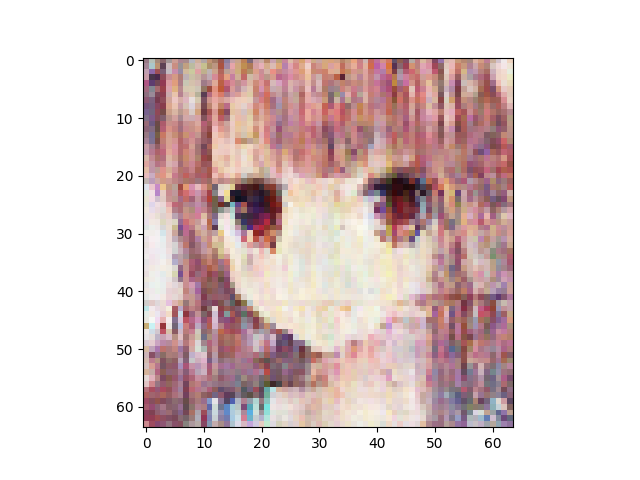
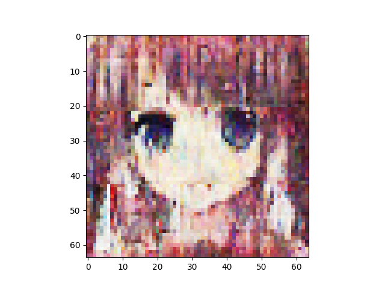
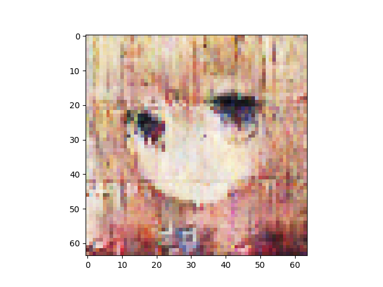
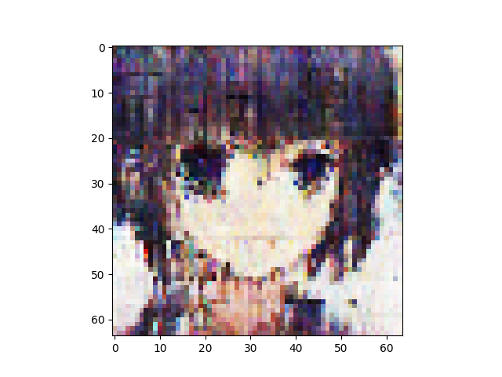
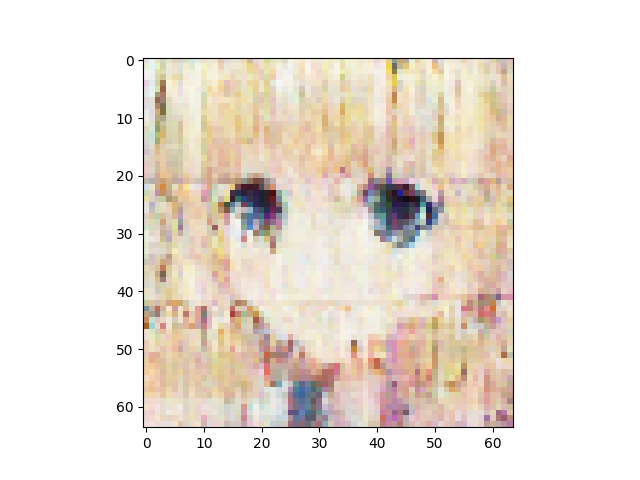
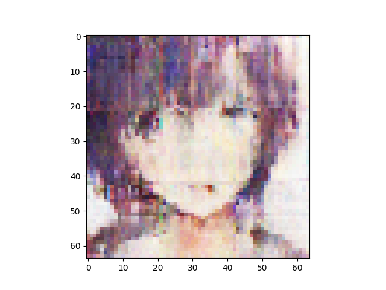
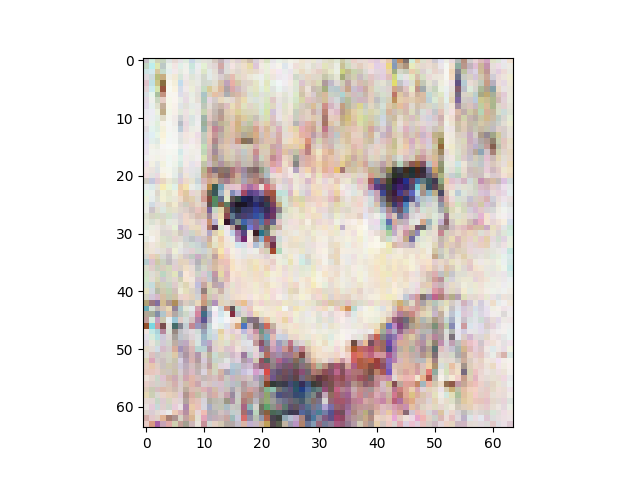
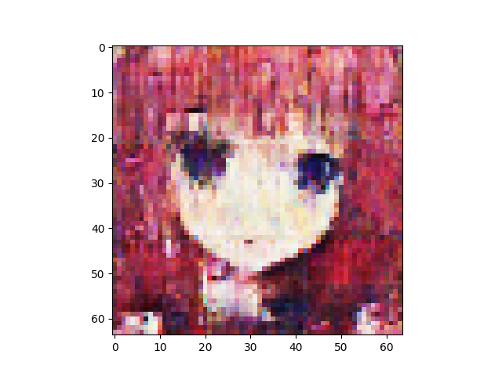
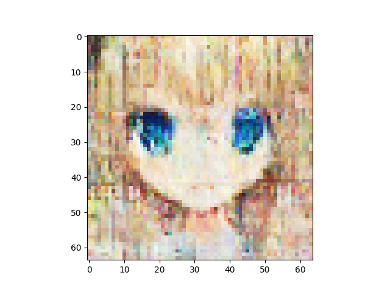
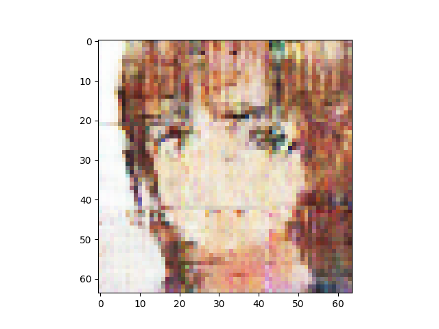

n_latent:512 

n_base_channels:32 

pixel-by-pixel loss weight initially 1 and decay by 0.9 every 25 combo epochs 

n_solo_epochs:0 

n_combo_epochs:200 

max_disc_loss :999 

Epoch0, VAE Training loss 7228.66748, ResNet Training loss 0.6585848927, Time used 33.59

Epoch1, VAE Training loss 6927.20264, ResNet Training loss 0.3096837997, Time used 30.68

Epoch2, VAE Training loss 6879.17773, ResNet Training loss 0.1998597533, Time used 31.06

Epoch3, VAE Training loss 6807.75391, ResNet Training loss 0.0007340045, Time used 30.74

Epoch4, VAE Training loss 6805.52246, ResNet Training loss 0.0309072677, Time used 30.72

Epoch5, VAE Training loss 6799.46777, ResNet Training loss 0.2738973498, Time used 31.46

Epoch6, VAE Training loss 6786.68164, ResNet Training loss 0.0048083933, Time used 30.97

Epoch7, VAE Training loss 6759.11865, ResNet Training loss 0.1366393864, Time used 31.25

Epoch8, VAE Training loss 6755.11279, ResNet Training loss 0.1468366832, Time used 31.67

Epoch9, VAE Training loss 6776.87891, ResNet Training loss 0.1928961128, Time used 30.55

Epoch10, VAE Training loss 6796.93799, ResNet Training loss 0.1144352555, Time used 31.08

Epoch11, VAE Training loss 6797.52246, ResNet Training loss 0.1595752537, Time used 30.53

Epoch12, VAE Training loss 6786.94434, ResNet Training loss 0.1918129027, Time used 31.12

Epoch13, VAE Training loss 6779.58154, ResNet Training loss 0.0868374929, Time used 30.68

Epoch14, VAE Training loss 6766.65967, ResNet Training loss 0.1637372673, Time used 30.70

Epoch15, VAE Training loss 6781.81494, ResNet Training loss 0.1168584526, Time used 31.03

Epoch16, VAE Training loss 6775.50879, ResNet Training loss 0.2137650996, Time used 30.54

Epoch17, VAE Training loss 6754.14453, ResNet Training loss 0.0383903161, Time used 30.79

Epoch18, VAE Training loss 6749.64746, ResNet Training loss 0.1553119421, Time used 31.32

Epoch19, VAE Training loss 6793.51562, ResNet Training loss 0.1319645941, Time used 30.74

Epoch20, VAE Training loss 6735.79150, ResNet Training loss 0.0006335575, Time used 30.75

Epoch21, VAE Training loss 6758.31201, ResNet Training loss 0.0284217764, Time used 31.47

Epoch22, VAE Training loss 6798.78418, ResNet Training loss 0.2047238201, Time used 31.17

Epoch23, VAE Training loss 6762.09277, ResNet Training loss 0.1844186932, Time used 31.30

Epoch24, VAE Training loss 6807.43896, ResNet Training loss 0.2104170769, Time used 30.78

Epoch25, VAE Training loss 6125.82373, ResNet Training loss 0.2136630863, Time used 31.35

Epoch26, VAE Training loss 6176.90479, ResNet Training loss 0.3317053318, Time used 31.05

Epoch27, VAE Training loss 6140.92041, ResNet Training loss 0.1755670458, Time used 30.82

Epoch28, VAE Training loss 6139.21094, ResNet Training loss 0.2081878781, Time used 30.54

Epoch29, VAE Training loss 6082.56152, ResNet Training loss 0.0026417375, Time used 31.11

Epoch30, VAE Training loss 6129.69434, ResNet Training loss 0.0723143741, Time used 31.54

Epoch31, VAE Training loss 6136.55566, ResNet Training loss 0.1332248896, Time used 30.81

Epoch32, VAE Training loss 6144.24902, ResNet Training loss 0.2063678354, Time used 30.76

Epoch33, VAE Training loss 6155.80566, ResNet Training loss 0.2874616086, Time used 30.58

Epoch34, VAE Training loss 6134.63281, ResNet Training loss 0.1494583488, Time used 31.33

Epoch35, VAE Training loss 6113.90039, ResNet Training loss 0.1891999245, Time used 31.17

Epoch36, VAE Training loss 6111.54004, ResNet Training loss 0.1179393232, Time used 31.19

Epoch37, VAE Training loss 6146.02637, ResNet Training loss 0.2460424304, Time used 30.60

Epoch38, VAE Training loss 6151.07227, ResNet Training loss 0.2370495796, Time used 31.01

Epoch39, VAE Training loss 6090.92383, ResNet Training loss 0.0202256627, Time used 31.85

Epoch40, VAE Training loss 6098.08740, ResNet Training loss 0.0003166010, Time used 30.80

Epoch41, VAE Training loss 6105.53125, ResNet Training loss 0.0001970633, Time used 30.91

Epoch42, VAE Training loss 6118.10938, ResNet Training loss 0.0018366997, Time used 31.10

Epoch43, VAE Training loss 6110.77930, ResNet Training loss 0.2251560390, Time used 30.71

Epoch44, VAE Training loss 6141.60742, ResNet Training loss 0.2635711730, Time used 31.11

Epoch45, VAE Training loss 6141.89551, ResNet Training loss 0.2528093457, Time used 30.98

Epoch46, VAE Training loss 6165.34619, ResNet Training loss 0.2204491198, Time used 31.13

Epoch47, VAE Training loss 6121.07666, ResNet Training loss 0.1660085917, Time used 30.86

Epoch48, VAE Training loss 6086.67578, ResNet Training loss 0.0034681736, Time used 31.05

Epoch49, VAE Training loss 6152.88525, ResNet Training loss 0.2360315174, Time used 30.69

Epoch50, VAE Training loss 5551.60254, ResNet Training loss 0.3144189119, Time used 30.90

Epoch51, VAE Training loss 5560.68896, ResNet Training loss 0.2860142887, Time used 30.79

Epoch52, VAE Training loss 5571.80762, ResNet Training loss 0.3652535379, Time used 30.60

Epoch53, VAE Training loss 5539.87305, ResNet Training loss 0.2336154580, Time used 30.54

Epoch54, VAE Training loss 5524.44922, ResNet Training loss 0.1399145126, Time used 30.83

Epoch55, VAE Training loss 5556.38330, ResNet Training loss 0.3273536861, Time used 30.88

Epoch56, VAE Training loss 5554.63330, ResNet Training loss 0.1786436141, Time used 31.31

Epoch57, VAE Training loss 5560.24512, ResNet Training loss 0.2389723659, Time used 30.67

Epoch58, VAE Training loss 5577.76123, ResNet Training loss 0.4308832586, Time used 30.85

Epoch59, VAE Training loss 5526.67676, ResNet Training loss 0.1294524670, Time used 31.15

Epoch60, VAE Training loss 5542.42920, ResNet Training loss 0.1450640708, Time used 30.93

Epoch61, VAE Training loss 5553.20850, ResNet Training loss 0.1875312179, Time used 30.63

Epoch62, VAE Training loss 5527.97510, ResNet Training loss 0.1771695316, Time used 30.84

Epoch63, VAE Training loss 5564.03271, ResNet Training loss 0.3086105883, Time used 31.41

Epoch64, VAE Training loss 5572.98047, ResNet Training loss 0.3869955242, Time used 30.90

Epoch65, VAE Training loss 5541.18164, ResNet Training loss 0.1449241936, Time used 31.35

Epoch66, VAE Training loss 5553.43750, ResNet Training loss 0.1785556376, Time used 31.10

Epoch67, VAE Training loss 5558.70947, ResNet Training loss 0.3006917238, Time used 30.48

Epoch68, VAE Training loss 5583.26318, ResNet Training loss 0.3514927030, Time used 30.92

Epoch69, VAE Training loss 5577.87695, ResNet Training loss 0.3517045081, Time used 30.50

Epoch70, VAE Training loss 5540.32324, ResNet Training loss 0.0744755268, Time used 31.21

Epoch71, VAE Training loss 5546.09912, ResNet Training loss 0.2700679004, Time used 31.01

Epoch72, VAE Training loss 5564.38965, ResNet Training loss 0.2668697834, Time used 31.27

Epoch73, VAE Training loss 5575.26758, ResNet Training loss 0.2216986418, Time used 30.77

Epoch74, VAE Training loss 5543.38477, ResNet Training loss 0.3020039201, Time used 30.98

Epoch75, VAE Training loss 5028.66406, ResNet Training loss 0.2773333192, Time used 31.08

Epoch76, VAE Training loss 5018.17334, ResNet Training loss 0.2362688631, Time used 30.81

Epoch77, VAE Training loss 5030.57959, ResNet Training loss 0.3565064669, Time used 31.46

Epoch78, VAE Training loss 5010.83984, ResNet Training loss 0.2452173233, Time used 31.31

Epoch79, VAE Training loss 5038.12793, ResNet Training loss 0.2690004110, Time used 30.98

Epoch80, VAE Training loss 5050.06104, ResNet Training loss 0.5070632100, Time used 31.08

Epoch81, VAE Training loss 4986.50195, ResNet Training loss 0.0630027428, Time used 30.69

Epoch82, VAE Training loss 5050.52441, ResNet Training loss 0.3212120235, Time used 31.48

Epoch83, VAE Training loss 5016.60107, ResNet Training loss 0.2997701764, Time used 30.84

Epoch84, VAE Training loss 4999.74561, ResNet Training loss 0.1764424145, Time used 30.63

Epoch85, VAE Training loss 5023.74365, ResNet Training loss 0.1990624666, Time used 30.55

Epoch86, VAE Training loss 5009.01221, ResNet Training loss 0.1550178230, Time used 31.00

Epoch87, VAE Training loss 5033.44434, ResNet Training loss 0.3727082312, Time used 31.35

Epoch88, VAE Training loss 5030.36865, ResNet Training loss 0.2805353403, Time used 30.57

Epoch89, VAE Training loss 5045.44629, ResNet Training loss 0.3315468729, Time used 31.04

Epoch90, VAE Training loss 5062.39111, ResNet Training loss 0.5428872705, Time used 30.58

Epoch91, VAE Training loss 5029.17041, ResNet Training loss 0.2826797962, Time used 30.51

Epoch92, VAE Training loss 5034.74756, ResNet Training loss 0.2467752546, Time used 30.49

Epoch93, VAE Training loss 5050.72656, ResNet Training loss 0.4925010502, Time used 30.86

Epoch94, VAE Training loss 5010.44922, ResNet Training loss 0.3043086231, Time used 30.79

Epoch95, VAE Training loss 4944.02588, ResNet Training loss 0.0015689434, Time used 31.25

Epoch96, VAE Training loss 4991.67432, ResNet Training loss 0.0795521438, Time used 30.83

Epoch97, VAE Training loss 5001.47754, ResNet Training loss 0.1383689940, Time used 30.84

Epoch98, VAE Training loss 5004.30566, ResNet Training loss 0.2049966305, Time used 30.55

Epoch99, VAE Training loss 5014.02686, ResNet Training loss 0.2428541929, Time used 30.78

Epoch100, VAE Training loss 4525.32568, ResNet Training loss 0.2223110348, Time used 30.77

Epoch101, VAE Training loss 4475.29590, ResNet Training loss 0.1897830069, Time used 30.53

Epoch102, VAE Training loss 4552.19043, ResNet Training loss 0.4305561483, Time used 30.51

Epoch103, VAE Training loss 4551.59375, ResNet Training loss 0.3934596777, Time used 31.01

Epoch104, VAE Training loss 4525.38818, ResNet Training loss 0.2403910905, Time used 30.47

Epoch105, VAE Training loss 4523.81006, ResNet Training loss 0.1830435097, Time used 30.53

Epoch106, VAE Training loss 4542.98145, ResNet Training loss 0.3259769380, Time used 30.67

Epoch107, VAE Training loss 4565.95752, ResNet Training loss 0.5199981332, Time used 30.64

Epoch108, VAE Training loss 4565.00195, ResNet Training loss 0.4446763098, Time used 30.82

Epoch109, VAE Training loss 4558.15918, ResNet Training loss 0.3860464096, Time used 30.48

Epoch110, VAE Training loss 4569.38525, ResNet Training loss 0.4329786599, Time used 30.62

Epoch111, VAE Training loss 4564.47119, ResNet Training loss 0.4056126773, Time used 31.19

Epoch112, VAE Training loss 4572.27295, ResNet Training loss 0.3934782743, Time used 30.74

Epoch113, VAE Training loss 4566.14990, ResNet Training loss 0.3814856708, Time used 30.90

Epoch114, VAE Training loss 4554.98438, ResNet Training loss 0.4581010044, Time used 31.27

Epoch115, VAE Training loss 4485.75684, ResNet Training loss 0.0509619601, Time used 30.66

Epoch116, VAE Training loss 4564.07568, ResNet Training loss 0.3636641502, Time used 30.89

Epoch117, VAE Training loss 4561.33447, ResNet Training loss 0.3382520080, Time used 30.52

Epoch118, VAE Training loss 4566.31738, ResNet Training loss 0.3506430686, Time used 30.65

Epoch119, VAE Training loss 4568.33594, ResNet Training loss 0.3966752291, Time used 30.70

Epoch120, VAE Training loss 4579.94092, ResNet Training loss 0.4948989451, Time used 31.08

Epoch121, VAE Training loss 4581.69092, ResNet Training loss 0.5365125537, Time used 31.43

Epoch122, VAE Training loss 4548.91504, ResNet Training loss 0.3185111582, Time used 31.00

Epoch123, VAE Training loss 4556.72217, ResNet Training loss 0.2430685312, Time used 30.52

Epoch124, VAE Training loss 4572.61670, ResNet Training loss 0.4196467698, Time used 30.56

Epoch125, VAE Training loss 4109.63867, ResNet Training loss 0.2509155273, Time used 30.58

Epoch126, VAE Training loss 4129.52588, ResNet Training loss 0.4464970231, Time used 30.88

Epoch127, VAE Training loss 4142.39795, ResNet Training loss 0.5250319242, Time used 31.19

Epoch128, VAE Training loss 4126.90039, ResNet Training loss 0.3462928534, Time used 31.07

Epoch129, VAE Training loss 4138.95996, ResNet Training loss 0.5067405701, Time used 31.18

Epoch130, VAE Training loss 4140.44824, ResNet Training loss 0.4764178097, Time used 30.63

Epoch131, VAE Training loss 4155.79443, ResNet Training loss 0.6030880809, Time used 31.20

Epoch132, VAE Training loss 4146.21289, ResNet Training loss 0.4456199408, Time used 30.74

Epoch133, VAE Training loss 4132.26709, ResNet Training loss 0.3958150148, Time used 31.17

Epoch134, VAE Training loss 4146.34180, ResNet Training loss 0.4606538117, Time used 30.72

Epoch135, VAE Training loss 4139.53564, ResNet Training loss 0.3933841288, Time used 31.13

Epoch136, VAE Training loss 4131.82031, ResNet Training loss 0.4299358130, Time used 31.62

Epoch137, VAE Training loss 4165.81836, ResNet Training loss 0.5342071056, Time used 30.77

Epoch138, VAE Training loss 4161.21387, ResNet Training loss 0.5232782364, Time used 31.00

Epoch139, VAE Training loss 4138.51025, ResNet Training loss 0.3507849276, Time used 30.65

Epoch140, VAE Training loss 4145.43848, ResNet Training loss 0.3459996879, Time used 30.64

Epoch141, VAE Training loss 4158.86133, ResNet Training loss 0.4575753808, Time used 31.00

Epoch142, VAE Training loss 4125.63623, ResNet Training loss 0.2574411035, Time used 31.58

Epoch143, VAE Training loss 4115.69434, ResNet Training loss 0.2475748062, Time used 31.08

Epoch144, VAE Training loss 4109.32178, ResNet Training loss 0.1772096753, Time used 30.63

Epoch145, VAE Training loss 4141.45068, ResNet Training loss 0.3319276571, Time used 31.22

Epoch146, VAE Training loss 4121.25830, ResNet Training loss 0.3990353048, Time used 31.07

Epoch147, VAE Training loss 4055.59814, ResNet Training loss 0.0365085416, Time used 30.67

Epoch148, VAE Training loss 4124.32568, ResNet Training loss 0.1921641976, Time used 30.93

Epoch149, VAE Training loss 4120.26807, ResNet Training loss 0.2940585017, Time used 30.64

Epoch150, VAE Training loss 3732.80322, ResNet Training loss 0.2856355906, Time used 31.03

Epoch151, VAE Training loss 3722.43481, ResNet Training loss 0.2793281376, Time used 30.54

Epoch152, VAE Training loss 3757.12695, ResNet Training loss 0.4781889617, Time used 31.06

Epoch153, VAE Training loss 3749.34204, ResNet Training loss 0.4173755646, Time used 31.09

Epoch154, VAE Training loss 3739.39185, ResNet Training loss 0.2991635799, Time used 30.85

Epoch155, VAE Training loss 3775.47046, ResNet Training loss 0.4826032817, Time used 30.69

Epoch156, VAE Training loss 3763.77783, ResNet Training loss 0.3894087672, Time used 30.68

Epoch157, VAE Training loss 3748.54077, ResNet Training loss 0.3421556354, Time used 31.13

Epoch158, VAE Training loss 3748.20923, ResNet Training loss 0.2132973969, Time used 30.48

Epoch159, VAE Training loss 3754.03223, ResNet Training loss 0.3248815536, Time used 30.71

Epoch160, VAE Training loss 3771.79858, ResNet Training loss 0.3458231091, Time used 30.61

Epoch161, VAE Training loss 3779.69946, ResNet Training loss 0.4062118530, Time used 30.77

Epoch162, VAE Training loss 3781.49536, ResNet Training loss 0.4423481226, Time used 31.02

Epoch163, VAE Training loss 3792.84399, ResNet Training loss 0.4414782524, Time used 30.94

Epoch164, VAE Training loss 3761.59253, ResNet Training loss 0.3066887558, Time used 30.48

Epoch165, VAE Training loss 3758.06152, ResNet Training loss 0.2917437851, Time used 30.99

Epoch166, VAE Training loss 3773.29346, ResNet Training loss 0.3625848591, Time used 31.45

Epoch167, VAE Training loss 3775.83081, ResNet Training loss 0.2886828482, Time used 31.68

Epoch168, VAE Training loss 3792.18799, ResNet Training loss 0.4087183774, Time used 31.43

Epoch169, VAE Training loss 3793.90381, ResNet Training loss 0.3867309690, Time used 30.66

Epoch170, VAE Training loss 3780.83521, ResNet Training loss 0.4863250852, Time used 31.18

Epoch171, VAE Training loss 3784.02539, ResNet Training loss 0.2811460495, Time used 30.88

Epoch172, VAE Training loss 3810.17627, ResNet Training loss 0.3459902406, Time used 30.47

Epoch173, VAE Training loss 3799.31714, ResNet Training loss 0.2967928946, Time used 30.60

Epoch174, VAE Training loss 3807.05835, ResNet Training loss 0.2752061784, Time used 30.85

Epoch175, VAE Training loss 3449.12842, ResNet Training loss 0.3341609538, Time used 31.51

Epoch176, VAE Training loss 3446.38110, ResNet Training loss 0.3458682895, Time used 30.69

Epoch177, VAE Training loss 3448.84717, ResNet Training loss 0.3288195133, Time used 31.16

Epoch178, VAE Training loss 3444.32349, ResNet Training loss 0.2110277116, Time used 31.25

Epoch179, VAE Training loss 3460.60425, ResNet Training loss 0.3755747974, Time used 31.14

Epoch180, VAE Training loss 3459.69702, ResNet Training loss 0.3510846496, Time used 31.30

Epoch181, VAE Training loss 3443.93652, ResNet Training loss 0.3116207123, Time used 30.70

Epoch182, VAE Training loss 3444.12402, ResNet Training loss 0.2898588479, Time used 30.97

Epoch183, VAE Training loss 3448.54492, ResNet Training loss 0.2327423096, Time used 31.03

Epoch184, VAE Training loss 3434.71533, ResNet Training loss 0.2031018138, Time used 30.91

Epoch185, VAE Training loss 3469.71118, ResNet Training loss 0.2693263292, Time used 30.92

Epoch186, VAE Training loss 3462.00854, ResNet Training loss 0.2807970345, Time used 30.98

Epoch187, VAE Training loss 3454.93823, ResNet Training loss 0.3197514713, Time used 30.74

Epoch188, VAE Training loss 3447.61060, ResNet Training loss 0.2596074045, Time used 31.01

Epoch189, VAE Training loss 3449.81470, ResNet Training loss 0.2100046575, Time used 30.50

Epoch190, VAE Training loss 3434.60205, ResNet Training loss 0.2335705757, Time used 30.86

Epoch191, VAE Training loss 3467.96533, ResNet Training loss 0.2911725044, Time used 30.82

Epoch192, VAE Training loss 3427.93286, ResNet Training loss 0.1379764378, Time used 30.65

Epoch193, VAE Training loss 3465.56616, ResNet Training loss 0.2375823706, Time used 30.85

Epoch194, VAE Training loss 3456.24854, ResNet Training loss 0.2611633241, Time used 31.01

Epoch195, VAE Training loss 3477.65283, ResNet Training loss 0.2059288323, Time used 30.52

Epoch196, VAE Training loss 3477.76538, ResNet Training loss 0.2782528996, Time used 31.25

Epoch197, VAE Training loss 3474.34888, ResNet Training loss 0.2473652363, Time used 30.75

Epoch198, VAE Training loss 3486.16870, ResNet Training loss 0.2607807219, Time used 30.49

Epoch199, VAE Training loss 3480.05054, ResNet Training loss 0.2113365531, Time used 30.55

