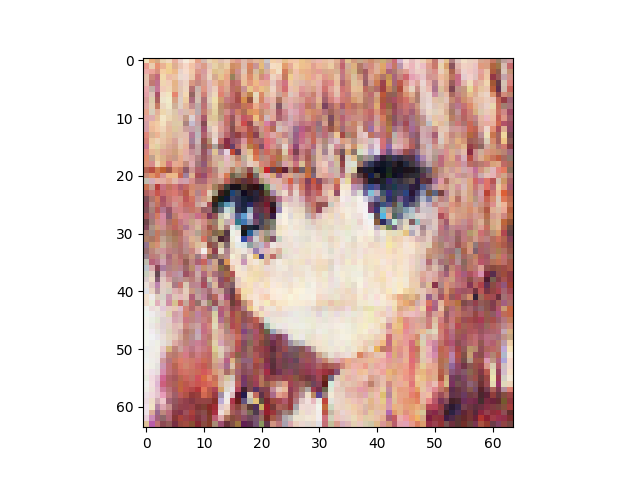

n_latent:512 

n_base_channels:32 

pixel-by-pixel loss weight initially 1 and decay by 0.95 every 25 combo epochs 

n_solo_epochs:0 

n_combo_epochs:200 

max_disc_loss :999 

Epoch0, VAE Training loss 7247.87598, ResNet Training loss 0.5286530256, Time used 34.33

Epoch1, VAE Training loss 6959.84082, ResNet Training loss 0.3067403138, Time used 31.17

Epoch2, VAE Training loss 6897.92236, ResNet Training loss 0.1907014996, Time used 31.09

Epoch3, VAE Training loss 6895.80811, ResNet Training loss 0.3761577010, Time used 31.18

Epoch4, VAE Training loss 6952.17480, ResNet Training loss 0.5160758495, Time used 31.13

Epoch5, VAE Training loss 6932.10205, ResNet Training loss 0.3535281718, Time used 31.39

Epoch6, VAE Training loss 6924.45020, ResNet Training loss 0.3081338108, Time used 31.32

Epoch7, VAE Training loss 6843.03711, ResNet Training loss 0.1909332126, Time used 31.37

Epoch8, VAE Training loss 6754.22559, ResNet Training loss 0.0005432583, Time used 31.13

Epoch9, VAE Training loss 6754.51758, ResNet Training loss 0.0003231850, Time used 31.13

Epoch10, VAE Training loss 6755.62598, ResNet Training loss 0.0002756028, Time used 31.01

Epoch11, VAE Training loss 6761.39795, ResNet Training loss 0.0003448077, Time used 31.51

Epoch12, VAE Training loss 6783.49609, ResNet Training loss 0.0327723622, Time used 31.22

Epoch13, VAE Training loss 6815.27832, ResNet Training loss 0.2982872427, Time used 31.08

Epoch14, VAE Training loss 6880.50732, ResNet Training loss 0.3776233494, Time used 31.12

Epoch15, VAE Training loss 6769.97607, ResNet Training loss 0.2300271988, Time used 31.16

Epoch16, VAE Training loss 6786.65723, ResNet Training loss 0.2117033452, Time used 31.47

Epoch17, VAE Training loss 6869.37207, ResNet Training loss 0.3169246018, Time used 31.20

Epoch18, VAE Training loss 6861.82275, ResNet Training loss 0.2216738760, Time used 31.06

Epoch19, VAE Training loss 6904.92383, ResNet Training loss 0.3665711582, Time used 31.49

Epoch20, VAE Training loss 6862.83105, ResNet Training loss 0.2205554843, Time used 31.61

Epoch21, VAE Training loss 6889.80371, ResNet Training loss 0.3790940344, Time used 31.13

Epoch22, VAE Training loss 6881.79639, ResNet Training loss 0.2264421135, Time used 31.20

Epoch23, VAE Training loss 6895.40625, ResNet Training loss 0.3051108420, Time used 31.26

Epoch24, VAE Training loss 6905.90234, ResNet Training loss 0.3188245893, Time used 30.96

Epoch25, VAE Training loss 6567.58594, ResNet Training loss 0.4262854457, Time used 31.25

Epoch26, VAE Training loss 6569.49170, ResNet Training loss 0.3472581506, Time used 31.19

Epoch27, VAE Training loss 6568.68213, ResNet Training loss 0.3353944719, Time used 31.36

Epoch28, VAE Training loss 6575.16113, ResNet Training loss 0.2884088159, Time used 30.99

Epoch29, VAE Training loss 6564.69531, ResNet Training loss 0.2597351670, Time used 31.08

Epoch30, VAE Training loss 6575.35449, ResNet Training loss 0.2393888384, Time used 31.01

Epoch31, VAE Training loss 6566.63184, ResNet Training loss 0.2272128314, Time used 31.63

Epoch32, VAE Training loss 6593.10889, ResNet Training loss 0.3828133941, Time used 31.33

Epoch33, VAE Training loss 6573.73389, ResNet Training loss 0.2858712673, Time used 31.44

Epoch34, VAE Training loss 6570.46777, ResNet Training loss 0.3207736015, Time used 31.69

Epoch35, VAE Training loss 6574.25000, ResNet Training loss 0.3176386058, Time used 31.19

Epoch36, VAE Training loss 6569.63867, ResNet Training loss 0.3108206987, Time used 31.21

Epoch37, VAE Training loss 6560.07422, ResNet Training loss 0.2497097403, Time used 30.93

Epoch38, VAE Training loss 6568.40137, ResNet Training loss 0.2701513767, Time used 31.16

Epoch39, VAE Training loss 6561.99463, ResNet Training loss 0.2612071931, Time used 31.11

Epoch40, VAE Training loss 6575.40137, ResNet Training loss 0.3264957070, Time used 31.43

Epoch41, VAE Training loss 6570.27100, ResNet Training loss 0.2405203879, Time used 30.98

Epoch42, VAE Training loss 6579.07129, ResNet Training loss 0.2569831312, Time used 31.16

Epoch43, VAE Training loss 6592.73828, ResNet Training loss 0.3026037216, Time used 31.19

Epoch44, VAE Training loss 6594.23242, ResNet Training loss 0.3619149923, Time used 31.17

Epoch45, VAE Training loss 6579.78613, ResNet Training loss 0.2578158975, Time used 31.04

Epoch46, VAE Training loss 6582.62012, ResNet Training loss 0.2826384902, Time used 31.35

Epoch47, VAE Training loss 6568.76660, ResNet Training loss 0.1992562711, Time used 30.92

Epoch48, VAE Training loss 6581.42480, ResNet Training loss 0.2525110245, Time used 31.26

Epoch49, VAE Training loss 6568.20264, ResNet Training loss 0.2769096196, Time used 31.05

Epoch50, VAE Training loss 6247.74268, ResNet Training loss 0.2412612885, Time used 31.24

Epoch51, VAE Training loss 6243.65381, ResNet Training loss 0.2292111367, Time used 30.95

Epoch52, VAE Training loss 6230.87402, ResNet Training loss 0.2730637789, Time used 31.04

Epoch53, VAE Training loss 6253.51318, ResNet Training loss 0.2401531041, Time used 31.06

Epoch54, VAE Training loss 6279.53613, ResNet Training loss 0.2946985960, Time used 31.17

Epoch55, VAE Training loss 6272.47412, ResNet Training loss 0.2775848806, Time used 31.40

Epoch56, VAE Training loss 6283.08154, ResNet Training loss 0.2902188897, Time used 30.86

Epoch57, VAE Training loss 6271.42236, ResNet Training loss 0.2593760192, Time used 30.96

Epoch58, VAE Training loss 6276.62061, ResNet Training loss 0.2755528688, Time used 30.99

Epoch59, VAE Training loss 6258.35352, ResNet Training loss 0.2981810868, Time used 31.21

Epoch60, VAE Training loss 6258.12500, ResNet Training loss 0.1983445287, Time used 31.52

Epoch61, VAE Training loss 6281.47119, ResNet Training loss 0.3064753711, Time used 31.40

Epoch62, VAE Training loss 6280.94824, ResNet Training loss 0.2637705803, Time used 31.09

Epoch63, VAE Training loss 6275.98291, ResNet Training loss 0.3042644262, Time used 30.90

Epoch64, VAE Training loss 6258.17334, ResNet Training loss 0.2131767869, Time used 31.35

Epoch65, VAE Training loss 6242.75635, ResNet Training loss 0.1680310965, Time used 31.16

Epoch66, VAE Training loss 6243.34912, ResNet Training loss 0.2206695229, Time used 31.18

Epoch67, VAE Training loss 6285.70068, ResNet Training loss 0.2999206185, Time used 30.89

Epoch68, VAE Training loss 6265.26855, ResNet Training loss 0.2386432737, Time used 31.31

Epoch69, VAE Training loss 6273.55762, ResNet Training loss 0.2506943643, Time used 31.39

Epoch70, VAE Training loss 6273.63818, ResNet Training loss 0.3236239254, Time used 30.85

Epoch71, VAE Training loss 6279.98730, ResNet Training loss 0.2280688286, Time used 31.41

Epoch72, VAE Training loss 6273.62354, ResNet Training loss 0.2634838521, Time used 30.96

Epoch73, VAE Training loss 6251.67578, ResNet Training loss 0.2521952093, Time used 31.49

Epoch74, VAE Training loss 6233.06201, ResNet Training loss 0.1634353846, Time used 31.34

Epoch75, VAE Training loss 5926.57764, ResNet Training loss 0.1820895970, Time used 31.43

Epoch76, VAE Training loss 5971.92090, ResNet Training loss 0.2581336498, Time used 31.09

Epoch77, VAE Training loss 5893.28320, ResNet Training loss 0.1723640859, Time used 31.09

Epoch78, VAE Training loss 5914.60986, ResNet Training loss 0.0966383740, Time used 30.93

Epoch79, VAE Training loss 5943.94678, ResNet Training loss 0.1835599840, Time used 31.21

Epoch80, VAE Training loss 5939.87793, ResNet Training loss 0.2055238783, Time used 31.07

Epoch81, VAE Training loss 5938.05273, ResNet Training loss 0.2352760583, Time used 31.16

Epoch82, VAE Training loss 5895.06934, ResNet Training loss 0.2091888636, Time used 31.14

Epoch83, VAE Training loss 5906.40576, ResNet Training loss 0.0971190259, Time used 31.03

Epoch84, VAE Training loss 5937.51758, ResNet Training loss 0.2137784958, Time used 31.28

Epoch85, VAE Training loss 5918.52881, ResNet Training loss 0.1771423072, Time used 31.16

Epoch86, VAE Training loss 5932.54346, ResNet Training loss 0.1945829242, Time used 31.06

Epoch87, VAE Training loss 5950.56396, ResNet Training loss 0.2046401203, Time used 31.52

Epoch88, VAE Training loss 5951.21826, ResNet Training loss 0.2085724473, Time used 31.32

Epoch89, VAE Training loss 5945.34766, ResNet Training loss 0.2678048611, Time used 31.08

Epoch90, VAE Training loss 5922.37695, ResNet Training loss 0.3078216612, Time used 31.24

Epoch91, VAE Training loss 5905.65381, ResNet Training loss 0.0808604434, Time used 31.09

Epoch92, VAE Training loss 5940.85254, ResNet Training loss 0.1755368561, Time used 31.33

Epoch93, VAE Training loss 5967.87305, ResNet Training loss 0.2504473627, Time used 31.01

Epoch94, VAE Training loss 5932.17676, ResNet Training loss 0.2345742434, Time used 31.19

Epoch95, VAE Training loss 5934.64795, ResNet Training loss 0.2703849971, Time used 31.20

Epoch96, VAE Training loss 5856.33594, ResNet Training loss 0.0986840352, Time used 31.05

Epoch97, VAE Training loss 5919.69385, ResNet Training loss 0.1440261155, Time used 31.21

Epoch98, VAE Training loss 5963.41211, ResNet Training loss 0.2121471614, Time used 31.13

Epoch99, VAE Training loss 5942.33594, ResNet Training loss 0.2360187620, Time used 31.02

Epoch100, VAE Training loss 5665.16553, ResNet Training loss 0.2362315953, Time used 31.21

Epoch101, VAE Training loss 5647.58203, ResNet Training loss 0.2244591564, Time used 31.47

Epoch102, VAE Training loss 5670.26318, ResNet Training loss 0.2790753543, Time used 31.22

Epoch103, VAE Training loss 5671.98340, ResNet Training loss 0.2298161983, Time used 31.15

Epoch104, VAE Training loss 5678.50439, ResNet Training loss 0.2158376873, Time used 31.29

Epoch105, VAE Training loss 5636.40869, ResNet Training loss 0.1732857525, Time used 31.56

Epoch106, VAE Training loss 5666.17432, ResNet Training loss 0.1971517950, Time used 31.08

Epoch107, VAE Training loss 5671.63867, ResNet Training loss 0.1797977686, Time used 31.32

Epoch108, VAE Training loss 5672.72021, ResNet Training loss 0.2501911819, Time used 30.94

Epoch109, VAE Training loss 5665.98584, ResNet Training loss 0.2033235878, Time used 31.07

Epoch110, VAE Training loss 5672.07178, ResNet Training loss 0.2195324302, Time used 31.22

Epoch111, VAE Training loss 5679.12061, ResNet Training loss 0.2666479945, Time used 31.14

Epoch112, VAE Training loss 5651.87354, ResNet Training loss 0.2055894583, Time used 31.09

Epoch113, VAE Training loss 5649.51367, ResNet Training loss 0.1180075929, Time used 30.77

Epoch114, VAE Training loss 5634.40283, ResNet Training loss 0.2698419690, Time used 31.10

Epoch115, VAE Training loss 5668.21631, ResNet Training loss 0.2009648085, Time used 31.11

Epoch116, VAE Training loss 5669.03223, ResNet Training loss 0.2278435379, Time used 31.07

Epoch117, VAE Training loss 5647.75391, ResNet Training loss 0.2166136354, Time used 31.04

Epoch118, VAE Training loss 5669.82178, ResNet Training loss 0.2071233988, Time used 31.03

Epoch119, VAE Training loss 5629.20557, ResNet Training loss 0.1963503063, Time used 31.41

Epoch120, VAE Training loss 5683.11133, ResNet Training loss 0.2132920474, Time used 31.14

Epoch121, VAE Training loss 5673.24707, ResNet Training loss 0.2336143702, Time used 31.17

Epoch122, VAE Training loss 5680.18896, ResNet Training loss 0.2309130132, Time used 30.79

Epoch123, VAE Training loss 5633.79102, ResNet Training loss 0.1029007435, Time used 31.29

Epoch124, VAE Training loss 5644.56396, ResNet Training loss 0.1530359089, Time used 31.05

Epoch125, VAE Training loss 5395.04248, ResNet Training loss 0.2188919485, Time used 31.19

Epoch126, VAE Training loss 5427.11133, ResNet Training loss 0.2909580171, Time used 31.35

Epoch127, VAE Training loss 5410.47363, ResNet Training loss 0.2346615791, Time used 31.34

Epoch128, VAE Training loss 5385.11475, ResNet Training loss 0.1785476059, Time used 31.01

Epoch129, VAE Training loss 5413.53369, ResNet Training loss 0.1679316908, Time used 31.10

Epoch130, VAE Training loss 5430.01270, ResNet Training loss 0.2733579874, Time used 31.01

Epoch131, VAE Training loss 5407.32568, ResNet Training loss 0.2061588019, Time used 31.16

Epoch132, VAE Training loss 5392.57764, ResNet Training loss 0.1715597510, Time used 31.27

Epoch133, VAE Training loss 5389.43945, ResNet Training loss 0.1378080547, Time used 31.22

Epoch134, VAE Training loss 5396.72168, ResNet Training loss 0.1842805296, Time used 30.89

Epoch135, VAE Training loss 5434.25928, ResNet Training loss 0.2673299015, Time used 31.12

Epoch136, VAE Training loss 5433.34424, ResNet Training loss 0.2340075672, Time used 31.10

Epoch137, VAE Training loss 5406.56250, ResNet Training loss 0.1649515480, Time used 30.92

Epoch138, VAE Training loss 5414.13428, ResNet Training loss 0.1488812119, Time used 31.35

Epoch139, VAE Training loss 5419.91309, ResNet Training loss 0.2227787673, Time used 31.16

Epoch140, VAE Training loss 5434.55371, ResNet Training loss 0.2446521372, Time used 31.35

Epoch141, VAE Training loss 5404.01318, ResNet Training loss 0.1620932668, Time used 31.22

Epoch142, VAE Training loss 5425.69141, ResNet Training loss 0.1650777310, Time used 31.31

Epoch143, VAE Training loss 5402.71680, ResNet Training loss 0.1820980161, Time used 31.36

Epoch144, VAE Training loss 5401.90820, ResNet Training loss 0.1100577638, Time used 31.37

Epoch145, VAE Training loss 5426.33496, ResNet Training loss 0.1567359120, Time used 31.07

Epoch146, VAE Training loss 5409.59375, ResNet Training loss 0.1538788527, Time used 31.23

Epoch147, VAE Training loss 5426.82861, ResNet Training loss 0.2129605860, Time used 30.77

Epoch148, VAE Training loss 5422.34814, ResNet Training loss 0.1511743665, Time used 31.23

Epoch149, VAE Training loss 5426.13818, ResNet Training loss 0.1800330430, Time used 30.81

Epoch150, VAE Training loss 5193.46826, ResNet Training loss 0.2739326358, Time used 31.20

Epoch151, VAE Training loss 5131.41406, ResNet Training loss 0.1055603623, Time used 30.93

Epoch152, VAE Training loss 5172.45947, ResNet Training loss 0.2259770185, Time used 31.04

Epoch153, VAE Training loss 5176.47900, ResNet Training loss 0.2529036999, Time used 30.81

Epoch154, VAE Training loss 5190.57129, ResNet Training loss 0.1802686304, Time used 30.88

Epoch155, VAE Training loss 5162.08398, ResNet Training loss 0.1943732351, Time used 31.07

Epoch156, VAE Training loss 5159.06982, ResNet Training loss 0.1851316988, Time used 30.96

Epoch157, VAE Training loss 5168.28809, ResNet Training loss 0.1844559610, Time used 31.17

Epoch158, VAE Training loss 5169.39697, ResNet Training loss 0.1172980070, Time used 31.36

Epoch159, VAE Training loss 5144.32129, ResNet Training loss 0.1563662142, Time used 31.15

Epoch160, VAE Training loss 5160.70752, ResNet Training loss 0.1568270475, Time used 31.01

Epoch161, VAE Training loss 5165.92432, ResNet Training loss 0.1322230399, Time used 31.06

Epoch162, VAE Training loss 5190.03857, ResNet Training loss 0.1849819422, Time used 30.96

Epoch163, VAE Training loss 5194.23633, ResNet Training loss 0.1724765897, Time used 31.35

Epoch164, VAE Training loss 5170.04834, ResNet Training loss 0.1804575920, Time used 31.67

Epoch165, VAE Training loss 5180.83203, ResNet Training loss 0.1401991546, Time used 31.53

Epoch166, VAE Training loss 5165.23779, ResNet Training loss 0.1719970852, Time used 30.89

Epoch167, VAE Training loss 5162.80811, ResNet Training loss 0.1064353958, Time used 30.98

Epoch168, VAE Training loss 5195.27295, ResNet Training loss 0.1673670858, Time used 31.03

Epoch169, VAE Training loss 5192.23242, ResNet Training loss 0.1465970427, Time used 31.25

Epoch170, VAE Training loss 5186.00000, ResNet Training loss 0.1875654906, Time used 31.28

Epoch171, VAE Training loss 5158.57666, ResNet Training loss 0.1182240173, Time used 30.97

Epoch172, VAE Training loss 5167.63916, ResNet Training loss 0.1230136752, Time used 30.91

Epoch173, VAE Training loss 5154.02393, ResNet Training loss 0.1717170179, Time used 30.87

Epoch174, VAE Training loss 5142.01709, ResNet Training loss 0.0512645915, Time used 31.26

Epoch175, VAE Training loss 4914.08057, ResNet Training loss 0.1476839930, Time used 30.94

Epoch176, VAE Training loss 4925.78223, ResNet Training loss 0.1526501775, Time used 30.94

Epoch177, VAE Training loss 4902.83252, ResNet Training loss 0.1780911088, Time used 30.82

Epoch178, VAE Training loss 4897.45020, ResNet Training loss 0.0768364966, Time used 30.89

Epoch179, VAE Training loss 4921.07324, ResNet Training loss 0.0983776972, Time used 30.99

Epoch180, VAE Training loss 4933.94678, ResNet Training loss 0.1980288476, Time used 31.12

Epoch181, VAE Training loss 4955.85205, ResNet Training loss 0.2239266187, Time used 31.18

Epoch182, VAE Training loss 4935.50098, ResNet Training loss 0.1479506642, Time used 31.45

Epoch183, VAE Training loss 4937.42920, ResNet Training loss 0.1281901300, Time used 31.29

Epoch184, VAE Training loss 4950.29883, ResNet Training loss 0.2737550437, Time used 31.16

Epoch185, VAE Training loss 4928.61377, ResNet Training loss 0.1619855762, Time used 31.25

Epoch186, VAE Training loss 4927.91064, ResNet Training loss 0.1051060557, Time used 30.90

Epoch187, VAE Training loss 4936.60449, ResNet Training loss 0.1212072894, Time used 31.01

Epoch188, VAE Training loss 4959.56396, ResNet Training loss 0.1005374044, Time used 31.07

Epoch189, VAE Training loss 4959.37207, ResNet Training loss 0.1312852502, Time used 31.00

Epoch190, VAE Training loss 4926.87793, ResNet Training loss 0.1424562335, Time used 31.24

Epoch191, VAE Training loss 4933.51074, ResNet Training loss 0.1439099908, Time used 31.09

Epoch192, VAE Training loss 4937.96289, ResNet Training loss 0.1529301405, Time used 31.15

Epoch193, VAE Training loss 4894.64844, ResNet Training loss 0.1084461063, Time used 30.91

Epoch194, VAE Training loss 4878.51807, ResNet Training loss 0.1396286339, Time used 31.08

Epoch195, VAE Training loss 4890.40820, ResNet Training loss 0.0901513472, Time used 31.43

Epoch196, VAE Training loss 4880.91260, ResNet Training loss 0.0708294660, Time used 30.93

Epoch197, VAE Training loss 4889.35107, ResNet Training loss 0.1149796396, Time used 31.21

Epoch198, VAE Training loss 4920.88379, ResNet Training loss 0.1621714532, Time used 30.93

Epoch199, VAE Training loss 4926.68164, ResNet Training loss 0.1721048355, Time used 31.20

