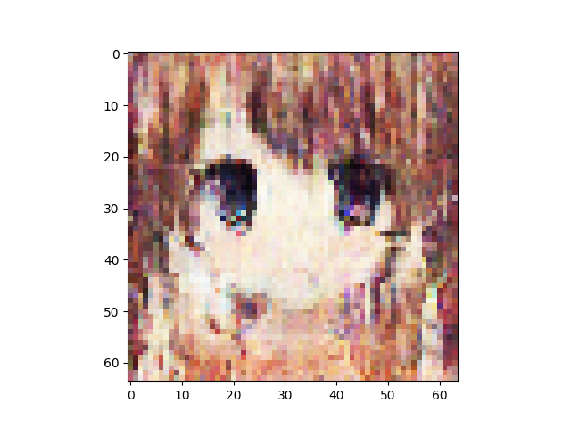
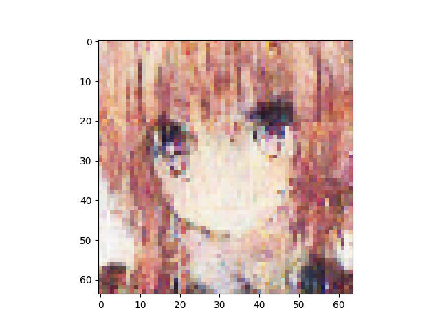
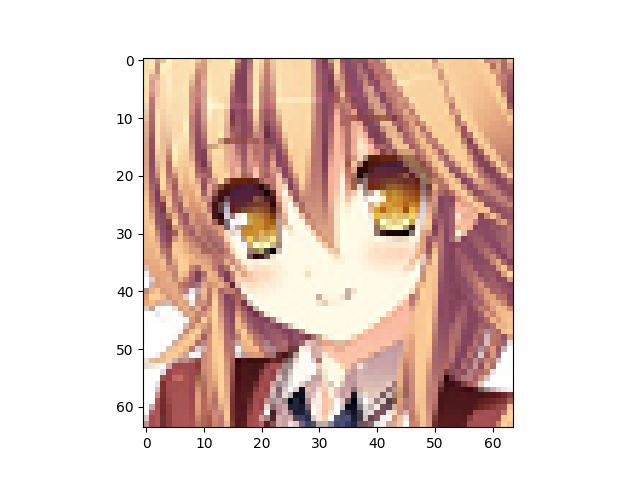
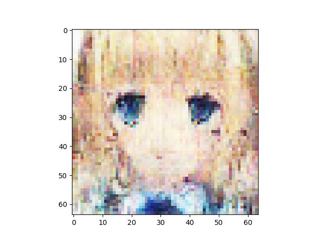
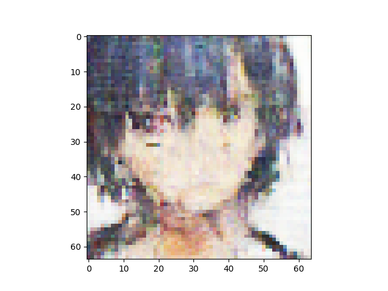
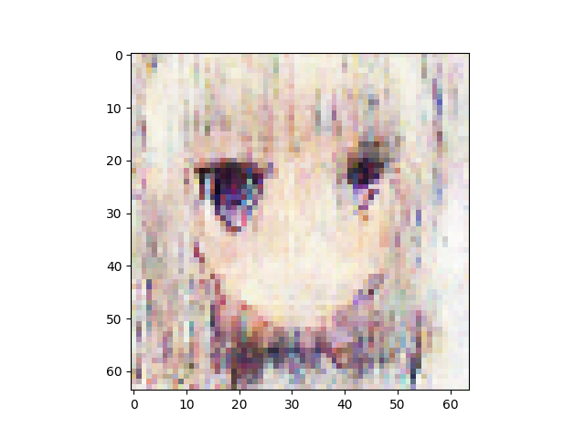

VAE number of latent variables 	512

VAE number of base channels 	32

PBP loss weight is 1

Discriminator is ResNetNumber of epochs trained 	200

Epoch0, VAE Training loss 7251.95312, ResNet Training loss 0.4383762479, Time used 36.47

Epoch1, VAE Training loss 6938.99561, ResNet Training loss 0.1428949088, Time used 33.96

Epoch2, VAE Training loss 6851.28711, ResNet Training loss 0.8766680360, Time used 34.26

Epoch3, VAE Training loss 6813.56006, ResNet Training loss 0.1171128377, Time used 33.84

Epoch4, VAE Training loss 6799.87646, ResNet Training loss 0.7495595217, Time used 33.81

Epoch5, VAE Training loss 6831.24512, ResNet Training loss 0.3146729767, Time used 33.77

Epoch6, VAE Training loss 6786.68555, ResNet Training loss 0.1162868887, Time used 34.08

Epoch7, VAE Training loss 6786.26465, ResNet Training loss 0.1120114326, Time used 33.63

Epoch8, VAE Training loss 6769.10791, ResNet Training loss 0.0002345695, Time used 33.68

Epoch9, VAE Training loss 6761.69434, ResNet Training loss 0.0001781121, Time used 33.53

Epoch10, VAE Training loss 6759.60498, ResNet Training loss 0.0002009589, Time used 33.84

Epoch11, VAE Training loss 6752.06201, ResNet Training loss 0.1425422132, Time used 33.63

Epoch12, VAE Training loss 6762.80811, ResNet Training loss 0.1693192422, Time used 33.74

Epoch13, VAE Training loss 6795.37793, ResNet Training loss 0.2440695912, Time used 33.67

Epoch14, VAE Training loss 6775.45459, ResNet Training loss 0.2341719717, Time used 33.64

Epoch15, VAE Training loss 6733.72412, ResNet Training loss 0.1071518809, Time used 33.58

Epoch16, VAE Training loss 6787.34717, ResNet Training loss 0.1766794324, Time used 33.76

Epoch17, VAE Training loss 6832.76123, ResNet Training loss 0.2761971354, Time used 33.80

Epoch18, VAE Training loss 6815.39795, ResNet Training loss 0.1670697629, Time used 33.90

Epoch19, VAE Training loss 6834.75439, ResNet Training loss 0.2890763879, Time used 33.70

Epoch20, VAE Training loss 6791.90088, ResNet Training loss 0.2208571881, Time used 33.66

Epoch21, VAE Training loss 6754.01025, ResNet Training loss 0.0799336508, Time used 33.75

Epoch22, VAE Training loss 6781.97900, ResNet Training loss 0.0808054283, Time used 33.85

Epoch23, VAE Training loss 6816.68506, ResNet Training loss 0.1264432669, Time used 33.71

Epoch24, VAE Training loss 6806.92773, ResNet Training loss 0.2207477391, Time used 33.54

Epoch25, VAE Training loss 6823.39453, ResNet Training loss 0.1519608051, Time used 33.81

Epoch26, VAE Training loss 6825.94727, ResNet Training loss 0.1923962981, Time used 33.57

Epoch27, VAE Training loss 6756.35547, ResNet Training loss 0.0869442895, Time used 33.64

Epoch28, VAE Training loss 6775.06641, ResNet Training loss 0.0503997654, Time used 33.52

Epoch29, VAE Training loss 6813.79395, ResNet Training loss 0.0450160056, Time used 33.84

Epoch30, VAE Training loss 6778.21680, ResNet Training loss 0.1503830105, Time used 33.97

Epoch31, VAE Training loss 6790.25098, ResNet Training loss 0.1971508116, Time used 34.07

Epoch32, VAE Training loss 6814.79932, ResNet Training loss 0.2486480922, Time used 33.87

Epoch33, VAE Training loss 6828.47754, ResNet Training loss 0.2338242382, Time used 33.70

Epoch34, VAE Training loss 6809.93799, ResNet Training loss 0.2142981440, Time used 33.48

Epoch35, VAE Training loss 6811.16211, ResNet Training loss 0.2698263526, Time used 33.64

Epoch36, VAE Training loss 6741.56787, ResNet Training loss 0.0745714009, Time used 33.81

Epoch37, VAE Training loss 6776.73633, ResNet Training loss 0.0906397477, Time used 33.57

Epoch38, VAE Training loss 6804.25928, ResNet Training loss 0.1322901696, Time used 33.82

Epoch39, VAE Training loss 6777.64355, ResNet Training loss 0.0833358541, Time used 33.77

Epoch40, VAE Training loss 6740.25000, ResNet Training loss 0.0009550089, Time used 33.68

Epoch41, VAE Training loss 6797.16309, ResNet Training loss 0.1267730147, Time used 33.58

Epoch42, VAE Training loss 6792.58984, ResNet Training loss 0.1836459935, Time used 33.58

Epoch43, VAE Training loss 6808.87842, ResNet Training loss 0.2980842292, Time used 34.00

Epoch44, VAE Training loss 6799.01123, ResNet Training loss 0.1912353784, Time used 34.13

Epoch45, VAE Training loss 6730.27148, ResNet Training loss 0.0015247624, Time used 33.69

Epoch46, VAE Training loss 6750.79980, ResNet Training loss 0.0008059808, Time used 34.50

Epoch47, VAE Training loss 6787.15967, ResNet Training loss 0.0429274365, Time used 33.69

Epoch48, VAE Training loss 6788.82422, ResNet Training loss 0.0578573942, Time used 34.01

Epoch49, VAE Training loss 6753.56201, ResNet Training loss 0.1888765991, Time used 33.67

Epoch50, VAE Training loss 6747.76953, ResNet Training loss 0.0229662266, Time used 33.66

Epoch51, VAE Training loss 6731.88525, ResNet Training loss 0.0001722618, Time used 33.95

Epoch52, VAE Training loss 6740.56738, ResNet Training loss 0.0001602376, Time used 33.82

Epoch53, VAE Training loss 6760.84521, ResNet Training loss 0.0572510026, Time used 33.91

Epoch54, VAE Training loss 6753.06543, ResNet Training loss 0.1012106612, Time used 33.58

Epoch55, VAE Training loss 6806.39893, ResNet Training loss 0.3459037542, Time used 33.59

Epoch56, VAE Training loss 6807.73975, ResNet Training loss 0.2523996830, Time used 34.01

Epoch57, VAE Training loss 6806.06201, ResNet Training loss 0.2299294919, Time used 33.89

Epoch58, VAE Training loss 6828.18799, ResNet Training loss 0.2833411396, Time used 34.09

Epoch59, VAE Training loss 6710.91553, ResNet Training loss 0.0063284943, Time used 33.76

Epoch60, VAE Training loss 6729.63574, ResNet Training loss 0.0006304427, Time used 33.64

Epoch61, VAE Training loss 6830.42773, ResNet Training loss 0.4294961989, Time used 33.77

Epoch62, VAE Training loss 6724.20947, ResNet Training loss 0.0507997721, Time used 33.54

Epoch63, VAE Training loss 6783.24902, ResNet Training loss 0.1834057868, Time used 33.56

Epoch64, VAE Training loss 6750.02246, ResNet Training loss 0.1894228011, Time used 33.67

Epoch65, VAE Training loss 6741.13086, ResNet Training loss 0.0678515509, Time used 34.00

Epoch66, VAE Training loss 6811.27686, ResNet Training loss 0.1462260336, Time used 33.60

Epoch67, VAE Training loss 6802.01611, ResNet Training loss 0.3715296090, Time used 33.90

Epoch68, VAE Training loss 6829.02295, ResNet Training loss 0.3785263896, Time used 34.36

Epoch69, VAE Training loss 6782.78760, ResNet Training loss 0.2879037261, Time used 33.95

Epoch70, VAE Training loss 6782.50537, ResNet Training loss 0.1908942014, Time used 33.96

Epoch71, VAE Training loss 6757.67676, ResNet Training loss 0.0021437621, Time used 34.10

Epoch72, VAE Training loss 6804.97119, ResNet Training loss 0.1782989502, Time used 33.72

Epoch73, VAE Training loss 6818.64648, ResNet Training loss 0.4124616086, Time used 33.83

Epoch74, VAE Training loss 6758.84814, ResNet Training loss 0.1392660886, Time used 34.12

Epoch75, VAE Training loss 6782.40625, ResNet Training loss 0.1819246113, Time used 33.96

Epoch76, VAE Training loss 6813.10840, ResNet Training loss 0.2827597857, Time used 33.98

Epoch77, VAE Training loss 6799.35645, ResNet Training loss 0.2221452147, Time used 33.67

Epoch78, VAE Training loss 6814.51367, ResNet Training loss 0.2527088523, Time used 33.69

Epoch79, VAE Training loss 6804.56006, ResNet Training loss 0.1980836987, Time used 33.69

Epoch80, VAE Training loss 6810.91162, ResNet Training loss 0.2020929158, Time used 34.15

Epoch81, VAE Training loss 6810.68311, ResNet Training loss 0.1576683670, Time used 33.84

Epoch82, VAE Training loss 6808.19727, ResNet Training loss 0.1267123520, Time used 33.66

Epoch83, VAE Training loss 6789.58350, ResNet Training loss 0.0938494280, Time used 33.78

Epoch84, VAE Training loss 6805.46484, ResNet Training loss 0.2912578881, Time used 33.55

Epoch85, VAE Training loss 6809.71191, ResNet Training loss 0.1335761398, Time used 33.68

Epoch86, VAE Training loss 6732.79492, ResNet Training loss 0.1911429018, Time used 33.60

Epoch87, VAE Training loss 6742.25439, ResNet Training loss 0.0016314622, Time used 33.47

Epoch88, VAE Training loss 6801.66846, ResNet Training loss 0.1974095702, Time used 33.74

Epoch89, VAE Training loss 6777.03320, ResNet Training loss 0.2095977664, Time used 33.63

Epoch90, VAE Training loss 6784.84961, ResNet Training loss 0.1191972345, Time used 34.20

Epoch91, VAE Training loss 6774.57129, ResNet Training loss 0.0569601282, Time used 34.21

Epoch92, VAE Training loss 6846.81592, ResNet Training loss 0.3855651915, Time used 33.58

Epoch93, VAE Training loss 6808.38818, ResNet Training loss 0.2575293183, Time used 33.71

Epoch94, VAE Training loss 6759.64893, ResNet Training loss 0.2125682831, Time used 33.89

Epoch95, VAE Training loss 6703.03076, ResNet Training loss 0.0046138740, Time used 33.92

Epoch96, VAE Training loss 6766.41797, ResNet Training loss 0.1105267256, Time used 33.97

Epoch97, VAE Training loss 6792.53711, ResNet Training loss 0.1877767742, Time used 33.48

Epoch98, VAE Training loss 6768.22705, ResNet Training loss 0.1342295408, Time used 33.63

Epoch99, VAE Training loss 6797.21436, ResNet Training loss 0.3716405928, Time used 34.06

Epoch100, VAE Training loss 6788.30908, ResNet Training loss 0.2226930112, Time used 33.61

Epoch101, VAE Training loss 6782.69531, ResNet Training loss 0.1880690157, Time used 33.82

Epoch102, VAE Training loss 6834.86377, ResNet Training loss 0.3563199341, Time used 33.66

Epoch103, VAE Training loss 6821.39648, ResNet Training loss 0.2657571435, Time used 33.65

Epoch104, VAE Training loss 6832.53320, ResNet Training loss 0.3182578385, Time used 33.56

Epoch105, VAE Training loss 6772.07031, ResNet Training loss 0.0062373942, Time used 33.61

Epoch106, VAE Training loss 6819.81934, ResNet Training loss 0.2845988572, Time used 34.32

Epoch107, VAE Training loss 6841.79443, ResNet Training loss 0.3742235601, Time used 33.87

Epoch108, VAE Training loss 6813.52588, ResNet Training loss 0.1865133494, Time used 33.74

Epoch109, VAE Training loss 6734.54346, ResNet Training loss 0.0742363185, Time used 33.49

Epoch110, VAE Training loss 6752.74561, ResNet Training loss 0.0247640200, Time used 33.52

Epoch111, VAE Training loss 6767.44043, ResNet Training loss 0.0011590780, Time used 33.48

Epoch112, VAE Training loss 6776.37061, ResNet Training loss 0.0710555315, Time used 33.58

Epoch113, VAE Training loss 6762.94092, ResNet Training loss 0.0800283328, Time used 33.64

Epoch114, VAE Training loss 6771.01953, ResNet Training loss 0.1166942269, Time used 33.78

Epoch115, VAE Training loss 6813.72754, ResNet Training loss 0.4999655187, Time used 34.51

Epoch116, VAE Training loss 6816.79980, ResNet Training loss 0.3272317946, Time used 34.08

Epoch117, VAE Training loss 6814.40771, ResNet Training loss 0.2763595283, Time used 33.62

Epoch118, VAE Training loss 6817.62891, ResNet Training loss 0.2783458531, Time used 33.50

Epoch119, VAE Training loss 6839.47607, ResNet Training loss 0.3849770427, Time used 34.01

Epoch120, VAE Training loss 6853.55811, ResNet Training loss 0.4046889246, Time used 33.59

Epoch121, VAE Training loss 6855.57275, ResNet Training loss 0.4194007516, Time used 33.74

Epoch122, VAE Training loss 6843.65918, ResNet Training loss 0.2967234850, Time used 33.94

Epoch123, VAE Training loss 6831.92480, ResNet Training loss 0.3204593658, Time used 34.01

Epoch124, VAE Training loss 6850.88330, ResNet Training loss 0.3629650474, Time used 34.14

Epoch125, VAE Training loss 6856.38525, ResNet Training loss 0.3634388149, Time used 33.72

Epoch126, VAE Training loss 6855.63428, ResNet Training loss 0.3480005264, Time used 34.01

Epoch127, VAE Training loss 6863.54053, ResNet Training loss 0.3036690652, Time used 33.74

Epoch128, VAE Training loss 6837.73535, ResNet Training loss 0.2766499817, Time used 33.72

Epoch129, VAE Training loss 6830.88623, ResNet Training loss 0.3467931151, Time used 33.89

Epoch130, VAE Training loss 6870.19629, ResNet Training loss 0.3754104674, Time used 33.92

Epoch131, VAE Training loss 6871.53418, ResNet Training loss 0.3655714393, Time used 34.23

Epoch132, VAE Training loss 6875.14551, ResNet Training loss 0.3722879589, Time used 33.68

Epoch133, VAE Training loss 6865.24316, ResNet Training loss 0.3527494669, Time used 33.91

Epoch134, VAE Training loss 6875.82129, ResNet Training loss 0.3752956390, Time used 33.77

Epoch135, VAE Training loss 6858.93799, ResNet Training loss 0.3502984643, Time used 33.86

Epoch136, VAE Training loss 6870.22217, ResNet Training loss 0.3911553919, Time used 33.52

Epoch137, VAE Training loss 6873.64600, ResNet Training loss 0.3179380000, Time used 34.40

Epoch138, VAE Training loss 6887.95361, ResNet Training loss 0.3751021326, Time used 34.13

Epoch139, VAE Training loss 6857.21973, ResNet Training loss 0.3358306587, Time used 33.67

Epoch140, VAE Training loss 6860.48145, ResNet Training loss 0.2520586252, Time used 34.13

Epoch141, VAE Training loss 6879.80762, ResNet Training loss 0.2875885367, Time used 33.92

Epoch142, VAE Training loss 6883.01807, ResNet Training loss 0.3515499234, Time used 34.37

Epoch143, VAE Training loss 6858.12207, ResNet Training loss 0.2975021899, Time used 33.82

Epoch144, VAE Training loss 6876.28320, ResNet Training loss 0.2511140108, Time used 33.71

Epoch145, VAE Training loss 6872.34277, ResNet Training loss 0.3281681240, Time used 33.76

Epoch146, VAE Training loss 6864.09180, ResNet Training loss 0.2555743158, Time used 33.63

Epoch147, VAE Training loss 6864.86572, ResNet Training loss 0.2156509608, Time used 33.74

Epoch148, VAE Training loss 6889.05371, ResNet Training loss 0.2610475421, Time used 34.26

Epoch149, VAE Training loss 6880.93164, ResNet Training loss 0.2790582180, Time used 34.34

Epoch150, VAE Training loss 6892.87695, ResNet Training loss 0.3175495565, Time used 33.92

Epoch151, VAE Training loss 6880.59033, ResNet Training loss 0.2389581203, Time used 33.77

Epoch152, VAE Training loss 6873.16895, ResNet Training loss 0.2564194500, Time used 33.49

Epoch153, VAE Training loss 6867.54248, ResNet Training loss 0.2972978354, Time used 34.13

Epoch154, VAE Training loss 6832.17090, ResNet Training loss 0.1169901788, Time used 33.91

Epoch155, VAE Training loss 6859.48486, ResNet Training loss 0.2433968782, Time used 33.68

Epoch156, VAE Training loss 6868.21924, ResNet Training loss 0.2479780912, Time used 33.53

Epoch157, VAE Training loss 6884.15137, ResNet Training loss 0.2407330573, Time used 33.51

Epoch158, VAE Training loss 6887.96631, ResNet Training loss 0.2984360158, Time used 34.03

Epoch159, VAE Training loss 6882.50830, ResNet Training loss 0.3063916564, Time used 33.73

Epoch160, VAE Training loss 6859.59277, ResNet Training loss 0.2647084594, Time used 33.60

Epoch161, VAE Training loss 6858.41406, ResNet Training loss 0.1473113149, Time used 33.57

Epoch162, VAE Training loss 6871.83691, ResNet Training loss 0.2220079005, Time used 33.78

Epoch163, VAE Training loss 6868.42383, ResNet Training loss 0.3182944357, Time used 33.69

Epoch164, VAE Training loss 6855.09180, ResNet Training loss 0.1663668603, Time used 33.74

Epoch165, VAE Training loss 6881.78320, ResNet Training loss 0.2554907203, Time used 34.06

Epoch166, VAE Training loss 6872.34180, ResNet Training loss 0.2261671424, Time used 33.95

Epoch167, VAE Training loss 6887.31055, ResNet Training loss 0.2380367070, Time used 33.76

Epoch168, VAE Training loss 6894.19531, ResNet Training loss 0.2902089655, Time used 33.71

Epoch169, VAE Training loss 6891.43604, ResNet Training loss 0.2640027106, Time used 34.04

Epoch170, VAE Training loss 6885.55664, ResNet Training loss 0.2229660898, Time used 33.90

Epoch171, VAE Training loss 6886.96582, ResNet Training loss 0.2689640820, Time used 33.51

Epoch172, VAE Training loss 6884.69971, ResNet Training loss 0.2057194114, Time used 33.83

Epoch173, VAE Training loss 6875.05273, ResNet Training loss 0.2069189698, Time used 33.73

Epoch174, VAE Training loss 6895.92920, ResNet Training loss 0.2454161495, Time used 34.07

Epoch175, VAE Training loss 6899.50488, ResNet Training loss 0.2514151633, Time used 33.72

Epoch176, VAE Training loss 6894.80225, ResNet Training loss 0.2825918198, Time used 33.67

Epoch177, VAE Training loss 6912.55566, ResNet Training loss 0.2929543853, Time used 33.67

Epoch178, VAE Training loss 6906.61328, ResNet Training loss 0.2837429941, Time used 33.88

Epoch179, VAE Training loss 6913.75537, ResNet Training loss 0.2485110760, Time used 33.50

Epoch180, VAE Training loss 6895.08496, ResNet Training loss 0.2561026812, Time used 33.95

Epoch181, VAE Training loss 6896.86182, ResNet Training loss 0.1975774169, Time used 33.74

Epoch182, VAE Training loss 6900.22314, ResNet Training loss 0.2241208404, Time used 33.78

Epoch183, VAE Training loss 6893.50635, ResNet Training loss 0.2340378910, Time used 34.31

Epoch184, VAE Training loss 6892.24658, ResNet Training loss 0.2097761035, Time used 33.65

Epoch185, VAE Training loss 6899.03320, ResNet Training loss 0.2426988631, Time used 34.29

Epoch186, VAE Training loss 6897.19922, ResNet Training loss 0.2167941332, Time used 34.29

Epoch187, VAE Training loss 6897.02686, ResNet Training loss 0.1698092818, Time used 33.75

Epoch188, VAE Training loss 6929.93311, ResNet Training loss 0.2742303610, Time used 34.29

Epoch189, VAE Training loss 6901.97266, ResNet Training loss 0.2472840548, Time used 34.25

Epoch190, VAE Training loss 6865.39453, ResNet Training loss 0.0971800238, Time used 33.56

Epoch191, VAE Training loss 6895.15918, ResNet Training loss 0.1701667011, Time used 33.68

Epoch192, VAE Training loss 6893.40186, ResNet Training loss 0.2745749056, Time used 33.90

Epoch193, VAE Training loss 6878.12939, ResNet Training loss 0.1878317893, Time used 33.88

Epoch194, VAE Training loss 6893.22510, ResNet Training loss 0.1391866505, Time used 33.45

Epoch195, VAE Training loss 6891.19189, ResNet Training loss 0.2161635458, Time used 33.63

Epoch196, VAE Training loss 6874.27588, ResNet Training loss 0.0944431871, Time used 34.02

Epoch197, VAE Training loss 6907.76270, ResNet Training loss 0.1973919421, Time used 33.59

Epoch198, VAE Training loss 6912.10205, ResNet Training loss 0.2889119685, Time used 33.70

Epoch199, VAE Training loss 6905.37061, ResNet Training loss 0.1928151548, Time used 33.62

