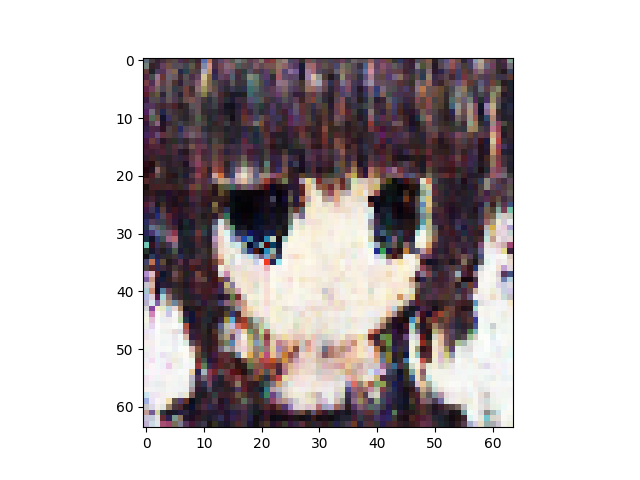
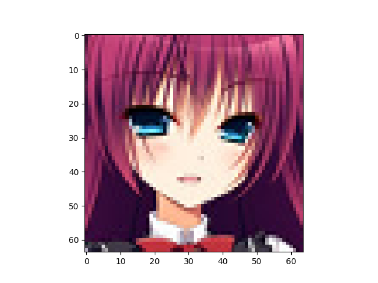

VAE number of latent variables 	512

VAE number of base channels 	32

PBP loss weight is 1

Discriminator is ResNetNumber of epochs trained 	1

Epoch0, VAE Training loss 7262.27734, ResNet Training loss 0.5865836143, Time used 36.26

