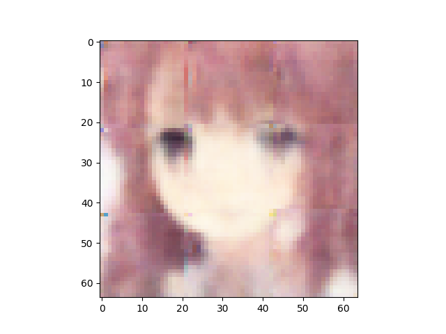
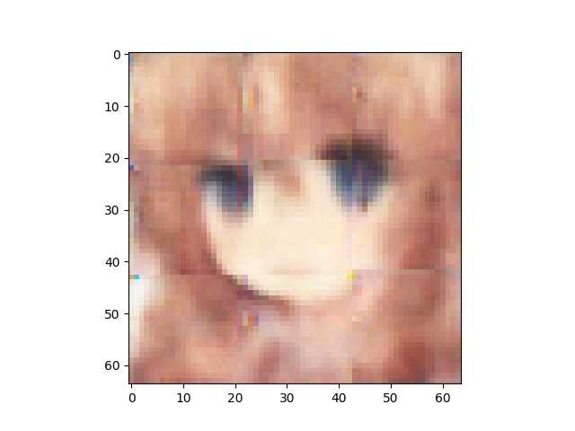
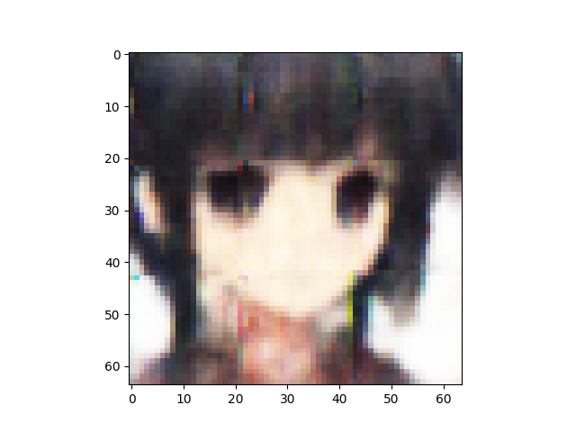
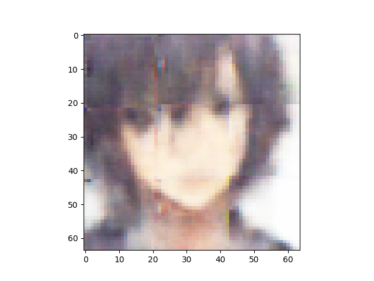
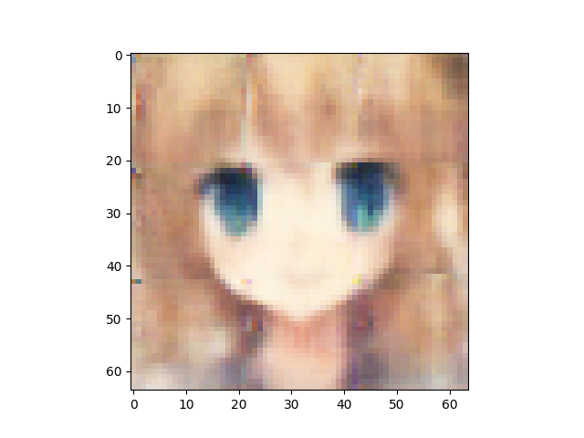
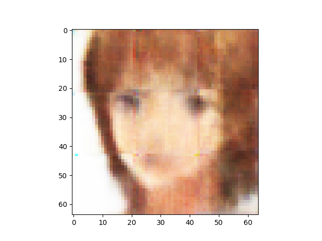

n_latent:512 

n_base_channels:32 

PBP weight:1 

n_solo_epochs:0 

n_combo_epochs:200 

max_disc_loss :999 

Epoch0, VAE Training loss 7162.50732, ResNet Training loss 0.3256934881, Time used 35.89

Epoch1, VAE Training loss 6824.01123, ResNet Training loss 0.0640577003, Time used 33.52

Epoch2, VAE Training loss 6748.29492, ResNet Training loss 0.2508124709, Time used 33.71

Epoch3, VAE Training loss 6722.61914, ResNet Training loss 0.0007891326, Time used 33.54

Epoch4, VAE Training loss 6703.22119, ResNet Training loss 0.1134647131, Time used 33.52

Epoch5, VAE Training loss 6689.90918, ResNet Training loss 0.0019796190, Time used 33.54

Epoch6, VAE Training loss 6678.80908, ResNet Training loss 0.0003402250, Time used 33.78

Epoch7, VAE Training loss 6672.78418, ResNet Training loss 0.0002038121, Time used 33.48

Epoch8, VAE Training loss 6667.61182, ResNet Training loss 0.0001242033, Time used 33.69

Epoch9, VAE Training loss 6657.85645, ResNet Training loss 0.0000733333, Time used 34.02

Epoch10, VAE Training loss 6653.79541, ResNet Training loss 0.0000577395, Time used 33.84

Epoch11, VAE Training loss 6650.22412, ResNet Training loss 0.0000415359, Time used 33.73

Epoch12, VAE Training loss 6644.14453, ResNet Training loss 0.0000312964, Time used 34.08

Epoch13, VAE Training loss 6641.79150, ResNet Training loss 0.0000246062, Time used 33.58

Epoch14, VAE Training loss 6637.68604, ResNet Training loss 0.0000294328, Time used 33.51

Epoch15, VAE Training loss 6634.29053, ResNet Training loss 0.0000209933, Time used 33.87

Epoch16, VAE Training loss 6629.52490, ResNet Training loss 0.0000136275, Time used 33.53

Epoch17, VAE Training loss 6627.90723, ResNet Training loss 0.0000122036, Time used 33.94

Epoch18, VAE Training loss 6625.47949, ResNet Training loss 0.0000081948, Time used 33.84

Epoch19, VAE Training loss 6622.60156, ResNet Training loss 0.0000076151, Time used 33.58

Epoch20, VAE Training loss 6620.85107, ResNet Training loss 0.0000062080, Time used 34.03

Epoch21, VAE Training loss 6620.38232, ResNet Training loss 0.0000048103, Time used 33.88

Epoch22, VAE Training loss 6616.39893, ResNet Training loss 0.0000041607, Time used 34.00

Epoch23, VAE Training loss 6613.71484, ResNet Training loss 0.0000028284, Time used 34.02

Epoch24, VAE Training loss 6612.25342, ResNet Training loss 0.0000034896, Time used 33.69

Epoch25, VAE Training loss 6611.17676, ResNet Training loss 0.0000029579, Time used 34.12

Epoch26, VAE Training loss 6603.75635, ResNet Training loss 0.4248719513, Time used 34.07

Epoch27, VAE Training loss 6599.15088, ResNet Training loss 0.0008744633, Time used 33.78

Epoch28, VAE Training loss 6599.97559, ResNet Training loss 0.2355950922, Time used 34.04

Epoch29, VAE Training loss 6596.12109, ResNet Training loss 0.0101570794, Time used 33.92

Epoch30, VAE Training loss 6597.76758, ResNet Training loss 0.0000792804, Time used 34.04

Epoch31, VAE Training loss 6597.23828, ResNet Training loss 0.0000547034, Time used 33.64

Epoch32, VAE Training loss 6597.83789, ResNet Training loss 0.0000399322, Time used 33.73

Epoch33, VAE Training loss 6597.86377, ResNet Training loss 0.0000393765, Time used 33.88

Epoch34, VAE Training loss 6600.59912, ResNet Training loss 0.0002237348, Time used 33.96

Epoch35, VAE Training loss 6589.72559, ResNet Training loss 0.2227622569, Time used 33.96

Epoch36, VAE Training loss 6585.48438, ResNet Training loss 0.0003718286, Time used 33.64

Epoch37, VAE Training loss 6585.34424, ResNet Training loss 0.0001476559, Time used 33.53

Epoch38, VAE Training loss 6586.48486, ResNet Training loss 0.0000959499, Time used 33.68

Epoch39, VAE Training loss 6584.73389, ResNet Training loss 0.0000582644, Time used 33.49

Epoch40, VAE Training loss 6584.75342, ResNet Training loss 0.0000540510, Time used 33.71

Epoch41, VAE Training loss 6584.49561, ResNet Training loss 0.0000564304, Time used 33.69

Epoch42, VAE Training loss 6588.59180, ResNet Training loss 0.0000800095, Time used 33.71

Epoch43, VAE Training loss 6580.54590, ResNet Training loss 0.1897867471, Time used 33.55

Epoch44, VAE Training loss 6577.46924, ResNet Training loss 0.0006880143, Time used 33.60

Epoch45, VAE Training loss 6576.84912, ResNet Training loss 0.0002221747, Time used 33.53

Epoch46, VAE Training loss 6577.27686, ResNet Training loss 0.0001077815, Time used 33.62

Epoch47, VAE Training loss 6579.61133, ResNet Training loss 0.0000708249, Time used 33.87

Epoch48, VAE Training loss 6582.81299, ResNet Training loss 0.0001569069, Time used 33.74

Epoch49, VAE Training loss 6582.49561, ResNet Training loss 0.0330387428, Time used 33.98

Epoch50, VAE Training loss 6572.34229, ResNet Training loss 0.0000712635, Time used 33.70

Epoch51, VAE Training loss 6573.43311, ResNet Training loss 0.0000402641, Time used 33.95

Epoch52, VAE Training loss 6572.55371, ResNet Training loss 0.0000262042, Time used 33.78

Epoch53, VAE Training loss 6572.84717, ResNet Training loss 0.0000191280, Time used 33.56

Epoch54, VAE Training loss 6572.73047, ResNet Training loss 0.0000149444, Time used 33.92

Epoch55, VAE Training loss 6570.04834, ResNet Training loss 0.0000111995, Time used 33.95

Epoch56, VAE Training loss 6569.68359, ResNet Training loss 0.0000089289, Time used 33.59

Epoch57, VAE Training loss 6570.31641, ResNet Training loss 0.0000074201, Time used 34.04

Epoch58, VAE Training loss 6571.24170, ResNet Training loss 0.0000064138, Time used 33.69

Epoch59, VAE Training loss 6569.52686, ResNet Training loss 0.0000056707, Time used 33.68

Epoch60, VAE Training loss 6570.71582, ResNet Training loss 0.0000044617, Time used 33.53

Epoch61, VAE Training loss 6568.25391, ResNet Training loss 0.0000039615, Time used 33.76

Epoch62, VAE Training loss 6568.88281, ResNet Training loss 0.0000036675, Time used 33.91

Epoch63, VAE Training loss 6568.64600, ResNet Training loss 0.0000028381, Time used 33.72

Epoch64, VAE Training loss 6568.20703, ResNet Training loss 0.0000022793, Time used 33.64

Epoch65, VAE Training loss 6566.45166, ResNet Training loss 0.0000021712, Time used 33.60

Epoch66, VAE Training loss 6567.84424, ResNet Training loss 0.0000019648, Time used 33.55

Epoch67, VAE Training loss 6566.70850, ResNet Training loss 0.0000016033, Time used 33.45

Epoch68, VAE Training loss 6566.65234, ResNet Training loss 0.0000014488, Time used 33.99

Epoch69, VAE Training loss 6567.27686, ResNet Training loss 0.0000012113, Time used 34.14

Epoch70, VAE Training loss 6566.42432, ResNet Training loss 0.0000012771, Time used 34.14

Epoch71, VAE Training loss 6566.45361, ResNet Training loss 0.0000011078, Time used 33.72

Epoch72, VAE Training loss 6565.30615, ResNet Training loss 0.0000010427, Time used 33.58

Epoch73, VAE Training loss 6563.75635, ResNet Training loss 0.0000008589, Time used 33.55

Epoch74, VAE Training loss 6564.70166, ResNet Training loss 0.0000008423, Time used 33.53

Epoch75, VAE Training loss 6564.33447, ResNet Training loss 0.0000007272, Time used 33.61

Epoch76, VAE Training loss 6562.90967, ResNet Training loss 0.0000007454, Time used 33.56

Epoch77, VAE Training loss 6564.88428, ResNet Training loss 0.0000007422, Time used 33.82

Epoch78, VAE Training loss 6565.27393, ResNet Training loss 0.0000006098, Time used 33.75

Epoch79, VAE Training loss 6563.44824, ResNet Training loss 0.0000019102, Time used 33.81

Epoch80, VAE Training loss 6566.15039, ResNet Training loss 0.0000012896, Time used 33.42

Epoch81, VAE Training loss 6570.05664, ResNet Training loss 0.0003605292, Time used 33.44

Epoch82, VAE Training loss 6555.11670, ResNet Training loss 0.0844447017, Time used 33.70

Epoch83, VAE Training loss 6556.16016, ResNet Training loss 0.0000186392, Time used 33.60

Epoch84, VAE Training loss 6558.78662, ResNet Training loss 0.0000122444, Time used 33.86

Epoch85, VAE Training loss 6563.73779, ResNet Training loss 0.0000328656, Time used 33.89

Epoch86, VAE Training loss 6578.11865, ResNet Training loss 0.4850467145, Time used 33.76

Epoch87, VAE Training loss 6548.06641, ResNet Training loss 0.0661804527, Time used 33.63

Epoch88, VAE Training loss 6549.21777, ResNet Training loss 0.0000110128, Time used 34.06

Epoch89, VAE Training loss 6551.46191, ResNet Training loss 0.0000052501, Time used 33.41

Epoch90, VAE Training loss 6553.17529, ResNet Training loss 0.0000032228, Time used 33.37

Epoch91, VAE Training loss 6554.58252, ResNet Training loss 0.0000018448, Time used 33.63

Epoch92, VAE Training loss 6553.09619, ResNet Training loss 0.0000038721, Time used 33.71

Epoch93, VAE Training loss 6545.00928, ResNet Training loss 0.1314551234, Time used 33.76

Epoch94, VAE Training loss 6544.86084, ResNet Training loss 0.0000126214, Time used 33.82

Epoch95, VAE Training loss 6545.94092, ResNet Training loss 0.0000074102, Time used 33.79

Epoch96, VAE Training loss 6542.67236, ResNet Training loss 0.0000035831, Time used 33.55

Epoch97, VAE Training loss 6544.28076, ResNet Training loss 0.0000037121, Time used 33.50

Epoch98, VAE Training loss 6544.58105, ResNet Training loss 0.0000016314, Time used 33.82

Epoch99, VAE Training loss 6544.94287, ResNet Training loss 0.0000007968, Time used 33.40

Epoch100, VAE Training loss 6544.00684, ResNet Training loss 0.0000017347, Time used 33.78

Epoch101, VAE Training loss 6543.13623, ResNet Training loss 0.0000005053, Time used 33.62

Epoch102, VAE Training loss 6543.29980, ResNet Training loss 0.0000004282, Time used 33.53

Epoch103, VAE Training loss 6543.33691, ResNet Training loss 0.0000003442, Time used 33.36

Epoch104, VAE Training loss 6544.43555, ResNet Training loss 0.0000003301, Time used 33.95

Epoch105, VAE Training loss 6543.55176, ResNet Training loss 0.0000002831, Time used 33.71

Epoch106, VAE Training loss 6543.20117, ResNet Training loss 0.0000002055, Time used 33.36

Epoch107, VAE Training loss 6542.69189, ResNet Training loss 0.0000002918, Time used 33.58

Epoch108, VAE Training loss 6543.87939, ResNet Training loss 0.0000001973, Time used 33.35

Epoch109, VAE Training loss 6543.76758, ResNet Training loss 0.0000001359, Time used 33.56

Epoch110, VAE Training loss 6544.06689, ResNet Training loss 0.0000001517, Time used 33.61

Epoch111, VAE Training loss 6542.93701, ResNet Training loss 0.0000000979, Time used 33.33

Epoch112, VAE Training loss 6541.63916, ResNet Training loss 0.0000001589, Time used 33.30

Epoch113, VAE Training loss 6540.93896, ResNet Training loss 0.0000000933, Time used 33.67

Epoch114, VAE Training loss 6541.62598, ResNet Training loss 0.0000000830, Time used 33.48

Epoch115, VAE Training loss 6541.16113, ResNet Training loss 0.0000001442, Time used 33.73

Epoch116, VAE Training loss 6542.84814, ResNet Training loss 0.0000000861, Time used 33.87

Epoch117, VAE Training loss 6540.50879, ResNet Training loss 0.0000000653, Time used 33.41

Epoch118, VAE Training loss 6541.01318, ResNet Training loss 0.0000000414, Time used 33.33

Epoch119, VAE Training loss 6540.38818, ResNet Training loss 0.0000000327, Time used 33.53

Epoch120, VAE Training loss 6541.80225, ResNet Training loss 0.0000000418, Time used 33.67

Epoch121, VAE Training loss 6540.98291, ResNet Training loss 0.0000000252, Time used 33.57

Epoch122, VAE Training loss 6541.10645, ResNet Training loss 0.0000000263, Time used 33.86

Epoch123, VAE Training loss 6543.07861, ResNet Training loss 0.0000000911, Time used 33.46

Epoch124, VAE Training loss 6540.62695, ResNet Training loss 0.0000000395, Time used 34.17

Epoch125, VAE Training loss 6540.55273, ResNet Training loss 0.0000000261, Time used 33.82

Epoch126, VAE Training loss 6539.54688, ResNet Training loss 0.0000000145, Time used 33.83

Epoch127, VAE Training loss 6538.92529, ResNet Training loss 0.0000000193, Time used 33.65

Epoch128, VAE Training loss 6539.29883, ResNet Training loss 0.0000000158, Time used 33.39

Epoch129, VAE Training loss 6539.51221, ResNet Training loss 0.0000000139, Time used 33.80

Epoch130, VAE Training loss 6541.21191, ResNet Training loss 0.0000000159, Time used 33.65

Epoch131, VAE Training loss 6539.82422, ResNet Training loss 0.0000000080, Time used 33.79

Epoch132, VAE Training loss 6540.32568, ResNet Training loss 0.0000000076, Time used 33.44

Epoch133, VAE Training loss 6539.74023, ResNet Training loss 0.0000000102, Time used 33.54

Epoch134, VAE Training loss 6538.40039, ResNet Training loss 0.0000000086, Time used 33.65

Epoch135, VAE Training loss 6538.61133, ResNet Training loss 0.0000000160, Time used 33.64

Epoch136, VAE Training loss 6538.44629, ResNet Training loss 0.0000000071, Time used 33.73

Epoch137, VAE Training loss 6537.89746, ResNet Training loss 0.0000000137, Time used 33.99

Epoch138, VAE Training loss 6540.12012, ResNet Training loss 0.0000000606, Time used 33.91

Epoch139, VAE Training loss 6537.72363, ResNet Training loss 0.0000000064, Time used 33.45

Epoch140, VAE Training loss 6537.79248, ResNet Training loss 0.0000000033, Time used 33.41

Epoch141, VAE Training loss 6537.55176, ResNet Training loss 0.0000000037, Time used 33.60

Epoch142, VAE Training loss 6537.49072, ResNet Training loss 0.0000000202, Time used 33.63

Epoch143, VAE Training loss 6537.47119, ResNet Training loss 0.0000000094, Time used 33.65

Epoch144, VAE Training loss 6537.45166, ResNet Training loss 0.0000000022, Time used 33.52

Epoch145, VAE Training loss 6537.80176, ResNet Training loss 0.0000000031, Time used 33.59

Epoch146, VAE Training loss 6537.03125, ResNet Training loss 0.0000000076, Time used 33.64

Epoch147, VAE Training loss 6537.63721, ResNet Training loss 0.0000000024, Time used 33.80

Epoch148, VAE Training loss 6539.00293, ResNet Training loss 0.0000000513, Time used 33.88

Epoch149, VAE Training loss 6536.65283, ResNet Training loss 0.0000000380, Time used 33.38

Epoch150, VAE Training loss 6536.40723, ResNet Training loss 0.0000000009, Time used 33.62

Epoch151, VAE Training loss 6537.01025, ResNet Training loss 0.0000000022, Time used 33.56

Epoch152, VAE Training loss 6534.71191, ResNet Training loss 0.0000000007, Time used 33.82

Epoch153, VAE Training loss 6535.77344, ResNet Training loss 0.0000000007, Time used 33.51

Epoch154, VAE Training loss 6536.91699, ResNet Training loss 0.0000000005, Time used 33.42

Epoch155, VAE Training loss 6535.89551, ResNet Training loss 0.0000000006, Time used 33.65

Epoch156, VAE Training loss 6534.13867, ResNet Training loss 0.0000000005, Time used 33.45

Epoch157, VAE Training loss 6536.38623, ResNet Training loss 0.0000000005, Time used 34.08

Epoch158, VAE Training loss 6535.11035, ResNet Training loss 0.0000000012, Time used 33.96

Epoch159, VAE Training loss 6536.24268, ResNet Training loss 0.0000000019, Time used 33.51

Epoch160, VAE Training loss 6536.12109, ResNet Training loss 0.0000000026, Time used 33.72

Epoch161, VAE Training loss 6538.36377, ResNet Training loss 0.0000000055, Time used 33.46

Epoch162, VAE Training loss 6540.85986, ResNet Training loss 0.0000000177, Time used 33.50

Epoch163, VAE Training loss 6543.97949, ResNet Training loss 0.0000000133, Time used 34.04

Epoch164, VAE Training loss 6535.97949, ResNet Training loss 0.3510010242, Time used 33.86

Epoch165, VAE Training loss 6532.28564, ResNet Training loss 0.0287783574, Time used 33.57

Epoch166, VAE Training loss 6525.43945, ResNet Training loss 0.0001448981, Time used 33.83

Epoch167, VAE Training loss 6529.56104, ResNet Training loss 0.0000288431, Time used 33.50

Epoch168, VAE Training loss 6532.21875, ResNet Training loss 0.0000273500, Time used 33.70

Epoch169, VAE Training loss 6537.52100, ResNet Training loss 0.0000387082, Time used 33.51

Epoch170, VAE Training loss 6555.48730, ResNet Training loss 0.1050851569, Time used 33.60

Epoch171, VAE Training loss 6551.10449, ResNet Training loss 0.0000518793, Time used 33.56

Epoch172, VAE Training loss 6550.85352, ResNet Training loss 0.0002098699, Time used 33.71

Epoch173, VAE Training loss 6549.39258, ResNet Training loss 0.0000049188, Time used 33.93

Epoch174, VAE Training loss 6548.09180, ResNet Training loss 0.0000030567, Time used 33.79

Epoch175, VAE Training loss 6545.52832, ResNet Training loss 0.0000017871, Time used 33.66

Epoch176, VAE Training loss 6546.02344, ResNet Training loss 0.0000015320, Time used 34.06

Epoch177, VAE Training loss 6546.33496, ResNet Training loss 0.0000004118, Time used 34.03

Epoch178, VAE Training loss 6543.61523, ResNet Training loss 0.0000048807, Time used 33.55

Epoch179, VAE Training loss 6546.18262, ResNet Training loss 0.0000011876, Time used 33.76

Epoch180, VAE Training loss 6544.10645, ResNet Training loss 0.0000006968, Time used 33.50

Epoch181, VAE Training loss 6544.73145, ResNet Training loss 0.0000004765, Time used 33.74

Epoch182, VAE Training loss 6542.72852, ResNet Training loss 0.0000007020, Time used 33.43

Epoch183, VAE Training loss 6543.64062, ResNet Training loss 0.0000003524, Time used 33.74

Epoch184, VAE Training loss 6542.27148, ResNet Training loss 0.0000002786, Time used 33.58

Epoch185, VAE Training loss 6542.06543, ResNet Training loss 0.0000002889, Time used 33.58

Epoch186, VAE Training loss 6542.22217, ResNet Training loss 0.0000002306, Time used 33.93

Epoch187, VAE Training loss 6540.61328, ResNet Training loss 0.0000001714, Time used 33.61

Epoch188, VAE Training loss 6540.97998, ResNet Training loss 0.0000001482, Time used 33.57

Epoch189, VAE Training loss 6540.05664, ResNet Training loss 0.0000001384, Time used 33.62

Epoch190, VAE Training loss 6540.92529, ResNet Training loss 0.0000000965, Time used 33.66

Epoch191, VAE Training loss 6540.00928, ResNet Training loss 0.0000000945, Time used 33.65

Epoch192, VAE Training loss 6539.01562, ResNet Training loss 0.0000000789, Time used 33.96

Epoch193, VAE Training loss 6540.84521, ResNet Training loss 0.0000000869, Time used 33.55

Epoch194, VAE Training loss 6538.13184, ResNet Training loss 0.0000000631, Time used 33.50

Epoch195, VAE Training loss 6538.49561, ResNet Training loss 0.0000000510, Time used 33.42

Epoch196, VAE Training loss 6538.12012, ResNet Training loss 0.0000000492, Time used 33.29

Epoch197, VAE Training loss 6537.37012, ResNet Training loss 0.0000000369, Time used 33.41

Epoch198, VAE Training loss 6537.91113, ResNet Training loss 0.0000000473, Time used 33.77

Epoch199, VAE Training loss 6537.20068, ResNet Training loss 0.0000000368, Time used 33.45

