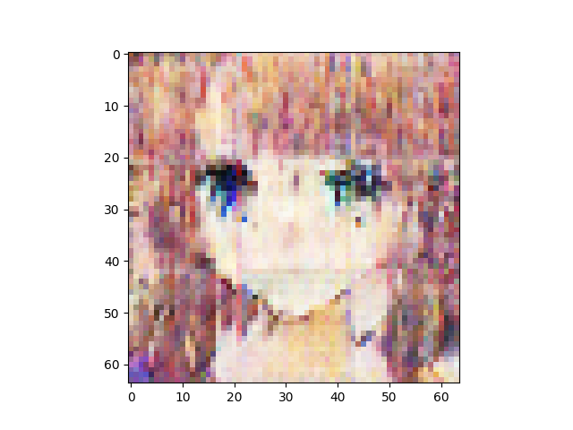
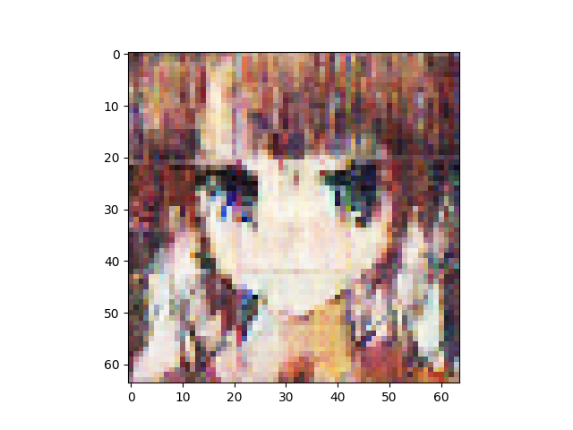
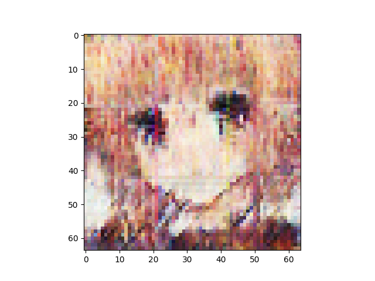
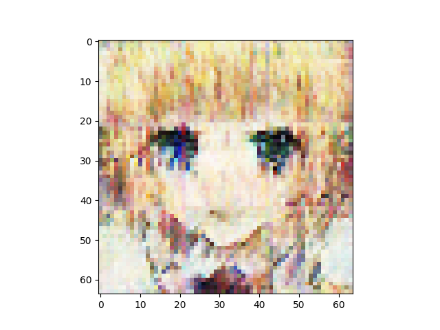
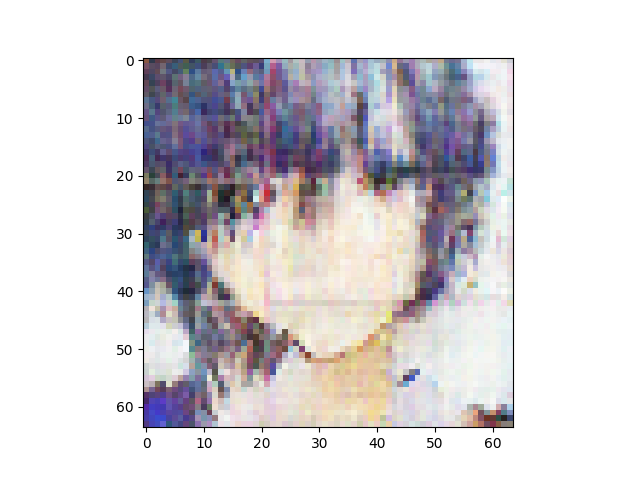
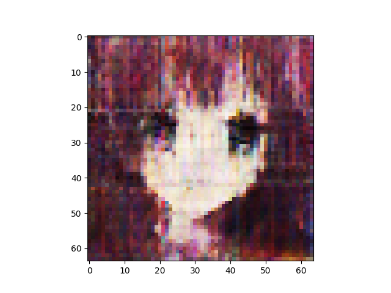

n_latent:512 

n_base_channels:32 

PBP weight:1 

n_solo_epochs:0 

n_combo_epochs:200 

max_disc_loss :999 

Epoch0, VAE Training loss 7394.65137, ResNet Training loss 0.5310741067, Time used 35.94

Epoch1, VAE Training loss 7021.34180, ResNet Training loss 0.5864117742, Time used 33.93

Epoch2, VAE Training loss 6991.64990, ResNet Training loss 0.4313255250, Time used 34.17

Epoch3, VAE Training loss 6953.81006, ResNet Training loss 0.4338076115, Time used 34.07

Epoch4, VAE Training loss 6967.18408, ResNet Training loss 0.3881067932, Time used 34.34

Epoch5, VAE Training loss 6949.89453, ResNet Training loss 0.4918082952, Time used 33.95

Epoch6, VAE Training loss 6907.06934, ResNet Training loss 0.3646014035, Time used 34.06

Epoch7, VAE Training loss 6919.43994, ResNet Training loss 0.2958474755, Time used 34.28

Epoch8, VAE Training loss 6929.58105, ResNet Training loss 0.4198115170, Time used 34.15

Epoch9, VAE Training loss 6955.46582, ResNet Training loss 0.4154726267, Time used 33.93

Epoch10, VAE Training loss 6883.54053, ResNet Training loss 0.2365567237, Time used 33.94

Epoch11, VAE Training loss 6930.46143, ResNet Training loss 0.3742773235, Time used 33.99

Epoch12, VAE Training loss 6862.56006, ResNet Training loss 0.1426402032, Time used 34.06

Epoch13, VAE Training loss 6883.67432, ResNet Training loss 0.2391664535, Time used 34.08

Epoch14, VAE Training loss 6910.28809, ResNet Training loss 0.5429976583, Time used 34.18

Epoch15, VAE Training loss 6912.82812, ResNet Training loss 0.3364464641, Time used 34.17

Epoch16, VAE Training loss 6927.48877, ResNet Training loss 0.4193353653, Time used 34.40

Epoch17, VAE Training loss 6929.43262, ResNet Training loss 0.4405745268, Time used 33.83

Epoch18, VAE Training loss 6962.42041, ResNet Training loss 0.6078758240, Time used 34.26

Epoch19, VAE Training loss 6930.25439, ResNet Training loss 0.3836104870, Time used 34.03

Epoch20, VAE Training loss 6938.72119, ResNet Training loss 0.4806758165, Time used 33.95

Epoch21, VAE Training loss 6951.84375, ResNet Training loss 0.4130427241, Time used 34.00

Epoch22, VAE Training loss 6903.24268, ResNet Training loss 0.4246397913, Time used 34.06

Epoch23, VAE Training loss 6894.26953, ResNet Training loss 0.2439174503, Time used 33.90

Epoch24, VAE Training loss 6897.72314, ResNet Training loss 0.4253730178, Time used 34.21

Epoch25, VAE Training loss 6907.73926, ResNet Training loss 0.3930508494, Time used 34.39

Epoch26, VAE Training loss 6944.77686, ResNet Training loss 0.5720609426, Time used 34.03

Epoch27, VAE Training loss 6957.88037, ResNet Training loss 0.5721382499, Time used 34.12

Epoch28, VAE Training loss 6933.79004, ResNet Training loss 0.5090994835, Time used 33.98

Epoch29, VAE Training loss 6932.43848, ResNet Training loss 0.4498053491, Time used 33.97

Epoch30, VAE Training loss 6956.02637, ResNet Training loss 0.5626356602, Time used 34.16

Epoch31, VAE Training loss 6936.56934, ResNet Training loss 0.5414393544, Time used 34.17

Epoch32, VAE Training loss 6965.44727, ResNet Training loss 0.5488059521, Time used 34.32

Epoch33, VAE Training loss 6983.91504, ResNet Training loss 0.5988472104, Time used 33.94

Epoch34, VAE Training loss 6944.77051, ResNet Training loss 0.4948372245, Time used 34.08

Epoch35, VAE Training loss 6987.33984, ResNet Training loss 0.5049637556, Time used 34.05

Epoch36, VAE Training loss 6971.15869, ResNet Training loss 0.5832062364, Time used 34.29

Epoch37, VAE Training loss 6997.27930, ResNet Training loss 0.4856625497, Time used 34.08

Epoch38, VAE Training loss 7012.66748, ResNet Training loss 0.5163315535, Time used 34.03

Epoch39, VAE Training loss 7022.98389, ResNet Training loss 0.6064227223, Time used 34.11

Epoch40, VAE Training loss 7032.00098, ResNet Training loss 0.5061981082, Time used 34.17

Epoch41, VAE Training loss 6939.41406, ResNet Training loss 0.3174385726, Time used 34.05

Epoch42, VAE Training loss 6987.19580, ResNet Training loss 0.3772902787, Time used 33.75

Epoch43, VAE Training loss 6992.50391, ResNet Training loss 0.4754508138, Time used 34.24

Epoch44, VAE Training loss 7034.93408, ResNet Training loss 0.5050624609, Time used 34.20

Epoch45, VAE Training loss 7031.59570, ResNet Training loss 0.5402542353, Time used 34.02

Epoch46, VAE Training loss 7014.79932, ResNet Training loss 0.5170690417, Time used 34.12

Epoch47, VAE Training loss 7044.64746, ResNet Training loss 0.4708753824, Time used 34.06

Epoch48, VAE Training loss 7071.74902, ResNet Training loss 0.5504212379, Time used 33.93

Epoch49, VAE Training loss 7049.30664, ResNet Training loss 0.5260471106, Time used 33.91

Epoch50, VAE Training loss 7056.13525, ResNet Training loss 0.4219470620, Time used 34.07

Epoch51, VAE Training loss 7041.44824, ResNet Training loss 0.4026991725, Time used 34.08

Epoch52, VAE Training loss 7047.24072, ResNet Training loss 0.4575396776, Time used 33.91

Epoch53, VAE Training loss 7070.36816, ResNet Training loss 0.4450709522, Time used 33.89

Epoch54, VAE Training loss 7059.60742, ResNet Training loss 0.4587910473, Time used 33.94

Epoch55, VAE Training loss 7068.02051, ResNet Training loss 0.3779082596, Time used 33.81

Epoch56, VAE Training loss 7058.56494, ResNet Training loss 0.3922905326, Time used 33.96

Epoch57, VAE Training loss 7022.58594, ResNet Training loss 0.3352384865, Time used 33.80

Epoch58, VAE Training loss 6990.99121, ResNet Training loss 0.2065957189, Time used 33.73

Epoch59, VAE Training loss 7103.69824, ResNet Training loss 0.3689292669, Time used 33.95

Epoch60, VAE Training loss 7041.49658, ResNet Training loss 0.4644646049, Time used 34.17

Epoch61, VAE Training loss 7052.95459, ResNet Training loss 0.3260932565, Time used 34.01

Epoch62, VAE Training loss 7087.88525, ResNet Training loss 0.3423527777, Time used 34.12

Epoch63, VAE Training loss 7058.69092, ResNet Training loss 0.3232058287, Time used 33.99

Epoch64, VAE Training loss 7060.24463, ResNet Training loss 0.2891227305, Time used 34.07

Epoch65, VAE Training loss 7114.76172, ResNet Training loss 0.2893856168, Time used 33.92

Epoch66, VAE Training loss 7090.43945, ResNet Training loss 0.2837414145, Time used 34.09

Epoch67, VAE Training loss 7045.12695, ResNet Training loss 0.2316307575, Time used 34.08

Epoch68, VAE Training loss 7072.97119, ResNet Training loss 0.2669584751, Time used 33.92

Epoch69, VAE Training loss 7157.09521, ResNet Training loss 0.3020419776, Time used 34.00

Epoch70, VAE Training loss 7140.04980, ResNet Training loss 0.2804272771, Time used 33.72

Epoch71, VAE Training loss 7101.51123, ResNet Training loss 0.2856629789, Time used 34.09

Epoch72, VAE Training loss 7094.21875, ResNet Training loss 0.2425726652, Time used 33.97

Epoch73, VAE Training loss 7162.37402, ResNet Training loss 0.2471281886, Time used 33.92

Epoch74, VAE Training loss 7206.15820, ResNet Training loss 0.2507884502, Time used 33.82

Epoch75, VAE Training loss 7166.40723, ResNet Training loss 0.2475047410, Time used 33.96

Epoch76, VAE Training loss 7006.69629, ResNet Training loss 0.1560596675, Time used 33.83

Epoch77, VAE Training loss 7089.09961, ResNet Training loss 0.2395333797, Time used 33.88

Epoch78, VAE Training loss 7062.47119, ResNet Training loss 0.2563762963, Time used 33.95

Epoch79, VAE Training loss 7146.84912, ResNet Training loss 0.2470498532, Time used 33.96

Epoch80, VAE Training loss 7069.74414, ResNet Training loss 0.2206737250, Time used 34.10

Epoch81, VAE Training loss 7163.86865, ResNet Training loss 0.2755409479, Time used 34.00

Epoch82, VAE Training loss 7200.36768, ResNet Training loss 0.1540209502, Time used 33.70

Epoch83, VAE Training loss 7059.77588, ResNet Training loss 0.1970563382, Time used 34.09

Epoch84, VAE Training loss 7155.41406, ResNet Training loss 0.2254417092, Time used 33.83

Epoch85, VAE Training loss 7185.61768, ResNet Training loss 0.2253368795, Time used 34.20

Epoch86, VAE Training loss 7132.51318, ResNet Training loss 0.2254209965, Time used 33.98

Epoch87, VAE Training loss 7110.55371, ResNet Training loss 0.2095896751, Time used 34.21

Epoch88, VAE Training loss 7152.68164, ResNet Training loss 0.1687858850, Time used 33.96

Epoch89, VAE Training loss 7152.30664, ResNet Training loss 0.1430955231, Time used 34.33

Epoch90, VAE Training loss 7213.58594, ResNet Training loss 0.2908973098, Time used 34.19

Epoch91, VAE Training loss 7225.37451, ResNet Training loss 0.1844906807, Time used 33.75

Epoch92, VAE Training loss 7229.66406, ResNet Training loss 0.2226356566, Time used 33.70

Epoch93, VAE Training loss 7172.19922, ResNet Training loss 0.1580345929, Time used 34.13

Epoch94, VAE Training loss 7207.31689, ResNet Training loss 0.1763258874, Time used 33.94

Epoch95, VAE Training loss 7209.40576, ResNet Training loss 0.1985152066, Time used 34.08

Epoch96, VAE Training loss 7213.03271, ResNet Training loss 0.2127617747, Time used 33.89

Epoch97, VAE Training loss 7222.76123, ResNet Training loss 0.1927333176, Time used 33.75

Epoch98, VAE Training loss 7226.14160, ResNet Training loss 0.1764426380, Time used 33.69

Epoch99, VAE Training loss 7222.28662, ResNet Training loss 0.2103604078, Time used 34.12

Epoch100, VAE Training loss 7212.07617, ResNet Training loss 0.1192097440, Time used 33.69

Epoch101, VAE Training loss 7216.06738, ResNet Training loss 0.1622415781, Time used 33.77

Epoch102, VAE Training loss 7226.77588, ResNet Training loss 0.1498564035, Time used 34.08

Epoch103, VAE Training loss 7184.23340, ResNet Training loss 0.1446454972, Time used 33.88

Epoch104, VAE Training loss 7257.54785, ResNet Training loss 0.1641502380, Time used 33.75

Epoch105, VAE Training loss 7203.75537, ResNet Training loss 0.2049525082, Time used 33.83

Epoch106, VAE Training loss 7252.60352, ResNet Training loss 0.1238988787, Time used 33.82

Epoch107, VAE Training loss 7165.29102, ResNet Training loss 0.2000503540, Time used 33.77

Epoch108, VAE Training loss 7144.82666, ResNet Training loss 0.1266767979, Time used 34.05

Epoch109, VAE Training loss 7203.06738, ResNet Training loss 0.2134243697, Time used 33.65

Epoch110, VAE Training loss 7123.52490, ResNet Training loss 0.1052027717, Time used 33.63

Epoch111, VAE Training loss 7186.71191, ResNet Training loss 0.1866373569, Time used 33.93

Epoch112, VAE Training loss 7222.27002, ResNet Training loss 0.1244964302, Time used 33.65

Epoch113, VAE Training loss 7148.08984, ResNet Training loss 0.1289728582, Time used 34.10

Epoch114, VAE Training loss 7058.56445, ResNet Training loss 0.0480255149, Time used 33.71

Epoch115, VAE Training loss 7233.60742, ResNet Training loss 0.1306305081, Time used 33.99

Epoch116, VAE Training loss 7208.53125, ResNet Training loss 0.1271135211, Time used 34.05

Epoch117, VAE Training loss 7267.90625, ResNet Training loss 0.1130111516, Time used 33.94

Epoch118, VAE Training loss 7268.75146, ResNet Training loss 0.2672719955, Time used 33.98

Epoch119, VAE Training loss 7233.08887, ResNet Training loss 0.1040256545, Time used 33.91

Epoch120, VAE Training loss 7249.17529, ResNet Training loss 0.1042371839, Time used 33.99

Epoch121, VAE Training loss 7252.84619, ResNet Training loss 0.1141464636, Time used 34.14

Epoch122, VAE Training loss 7284.85889, ResNet Training loss 0.1450365931, Time used 33.94

Epoch123, VAE Training loss 7213.19189, ResNet Training loss 0.1730128229, Time used 33.82

Epoch124, VAE Training loss 7294.17920, ResNet Training loss 0.1602181345, Time used 33.98

Epoch125, VAE Training loss 7299.79004, ResNet Training loss 0.1059102789, Time used 34.08

Epoch126, VAE Training loss 7288.22412, ResNet Training loss 0.2329427302, Time used 34.10

Epoch127, VAE Training loss 7190.81445, ResNet Training loss 0.0899517164, Time used 34.03

Epoch128, VAE Training loss 7194.53125, ResNet Training loss 0.1244989485, Time used 33.77

Epoch129, VAE Training loss 7161.64795, ResNet Training loss 0.1418173164, Time used 33.77

Epoch130, VAE Training loss 7219.56592, ResNet Training loss 0.1834306717, Time used 33.94

Epoch131, VAE Training loss 7294.87305, ResNet Training loss 0.1035728008, Time used 33.79

Epoch132, VAE Training loss 7159.16602, ResNet Training loss 0.0980297774, Time used 34.07

Epoch133, VAE Training loss 7030.40723, ResNet Training loss 0.0327227302, Time used 33.83

Epoch134, VAE Training loss 7151.22559, ResNet Training loss 0.0637369379, Time used 33.88

Epoch135, VAE Training loss 7143.10693, ResNet Training loss 0.0564484596, Time used 33.89

Epoch136, VAE Training loss 7155.63525, ResNet Training loss 0.1536260545, Time used 33.76

Epoch137, VAE Training loss 7287.06006, ResNet Training loss 0.2170673162, Time used 33.89

Epoch138, VAE Training loss 7121.47754, ResNet Training loss 0.1349687278, Time used 33.85

Epoch139, VAE Training loss 7294.47949, ResNet Training loss 0.1894826591, Time used 33.92

Epoch140, VAE Training loss 7198.04980, ResNet Training loss 0.1402919590, Time used 33.78

Epoch141, VAE Training loss 7239.29980, ResNet Training loss 0.0993355811, Time used 33.90

Epoch142, VAE Training loss 7332.63135, ResNet Training loss 0.1753072888, Time used 34.15

Epoch143, VAE Training loss 7319.45996, ResNet Training loss 0.1265535504, Time used 33.76

Epoch144, VAE Training loss 7322.94678, ResNet Training loss 0.1112169772, Time used 34.08

Epoch145, VAE Training loss 7317.21777, ResNet Training loss 0.1343242228, Time used 33.90

Epoch146, VAE Training loss 7257.40186, ResNet Training loss 0.1708813906, Time used 33.81

Epoch147, VAE Training loss 7238.95166, ResNet Training loss 0.0656441152, Time used 33.79

Epoch148, VAE Training loss 7127.34570, ResNet Training loss 0.0482484251, Time used 34.24

Epoch149, VAE Training loss 7246.42773, ResNet Training loss 0.1033121943, Time used 34.06

Epoch150, VAE Training loss 7348.62500, ResNet Training loss 0.1003966704, Time used 33.94

Epoch151, VAE Training loss 7353.71777, ResNet Training loss 0.1109528542, Time used 33.66

Epoch152, VAE Training loss 7138.94727, ResNet Training loss 0.1295771003, Time used 33.86

Epoch153, VAE Training loss 7132.29980, ResNet Training loss 0.0836818814, Time used 33.86

Epoch154, VAE Training loss 7257.00830, ResNet Training loss 0.1067154035, Time used 33.90

Epoch155, VAE Training loss 7135.00732, ResNet Training loss 0.0667539313, Time used 34.04

Epoch156, VAE Training loss 7143.98340, ResNet Training loss 0.1094191819, Time used 33.78

Epoch157, VAE Training loss 7165.45947, ResNet Training loss 0.1108331010, Time used 34.14

Epoch158, VAE Training loss 7283.15088, ResNet Training loss 0.1265498549, Time used 33.99

Epoch159, VAE Training loss 7208.34619, ResNet Training loss 0.1245907098, Time used 34.06

Epoch160, VAE Training loss 7289.05762, ResNet Training loss 0.1011058390, Time used 33.99

Epoch161, VAE Training loss 7194.93506, ResNet Training loss 0.1203542054, Time used 33.84

Epoch162, VAE Training loss 7214.75439, ResNet Training loss 0.0642747134, Time used 34.04

Epoch163, VAE Training loss 7202.25928, ResNet Training loss 0.0853248760, Time used 33.83

Epoch164, VAE Training loss 7205.52979, ResNet Training loss 0.0877727345, Time used 33.71

Epoch165, VAE Training loss 7037.05566, ResNet Training loss 0.0235660095, Time used 33.79

Epoch166, VAE Training loss 7136.07959, ResNet Training loss 0.1448971778, Time used 33.76

Epoch167, VAE Training loss 7092.05859, ResNet Training loss 0.1266254038, Time used 33.82

Epoch168, VAE Training loss 7327.15771, ResNet Training loss 0.1170070767, Time used 33.79

Epoch169, VAE Training loss 7243.15088, ResNet Training loss 0.1177339628, Time used 33.94

Epoch170, VAE Training loss 7254.67969, ResNet Training loss 0.0518853515, Time used 34.05

Epoch171, VAE Training loss 7180.56836, ResNet Training loss 0.0988151059, Time used 33.84

Epoch172, VAE Training loss 7159.57715, ResNet Training loss 0.0483579300, Time used 33.97

Epoch173, VAE Training loss 7069.56934, ResNet Training loss 0.0473838970, Time used 33.92

Epoch174, VAE Training loss 7061.95947, ResNet Training loss 0.0848282129, Time used 33.81

Epoch175, VAE Training loss 7189.87061, ResNet Training loss 0.1168111265, Time used 33.66

Epoch176, VAE Training loss 7283.91406, ResNet Training loss 0.1324711144, Time used 33.75

Epoch177, VAE Training loss 7421.32178, ResNet Training loss 0.1322978139, Time used 33.81

Epoch178, VAE Training loss 7377.59424, ResNet Training loss 0.0856971592, Time used 33.95

Epoch179, VAE Training loss 7320.89209, ResNet Training loss 0.0634383485, Time used 33.97

Epoch180, VAE Training loss 7342.60693, ResNet Training loss 0.0883808434, Time used 33.74

Epoch181, VAE Training loss 7330.75879, ResNet Training loss 0.1083574519, Time used 33.83

Epoch182, VAE Training loss 7386.63232, ResNet Training loss 0.0961230919, Time used 33.74

Epoch183, VAE Training loss 7295.01709, ResNet Training loss 0.1229435503, Time used 33.88

Epoch184, VAE Training loss 7338.31006, ResNet Training loss 0.0736092851, Time used 33.97

Epoch185, VAE Training loss 7385.34375, ResNet Training loss 0.1022218242, Time used 33.90

Epoch186, VAE Training loss 7259.28711, ResNet Training loss 0.1008365974, Time used 33.89

Epoch187, VAE Training loss 7375.23242, ResNet Training loss 0.1231683791, Time used 33.92

Epoch188, VAE Training loss 7300.91211, ResNet Training loss 0.0855547339, Time used 33.76

Epoch189, VAE Training loss 7359.59082, ResNet Training loss 0.0366799310, Time used 33.81

Epoch190, VAE Training loss 7443.04150, ResNet Training loss 0.0560928211, Time used 33.86

Epoch191, VAE Training loss 7359.87939, ResNet Training loss 0.0760331899, Time used 33.90

Epoch192, VAE Training loss 7237.06543, ResNet Training loss 0.0886367932, Time used 33.92

Epoch193, VAE Training loss 7401.78906, ResNet Training loss 0.0533926338, Time used 33.62

Epoch194, VAE Training loss 7387.95459, ResNet Training loss 0.1258499920, Time used 33.83

Epoch195, VAE Training loss 7422.86475, ResNet Training loss 0.1137013212, Time used 33.73

Epoch196, VAE Training loss 7385.16699, ResNet Training loss 0.1038760543, Time used 34.08

Epoch197, VAE Training loss 7241.80469, ResNet Training loss 0.0486642495, Time used 33.98

Epoch198, VAE Training loss 7307.00439, ResNet Training loss 0.0891085565, Time used 33.76

Epoch199, VAE Training loss 7311.71582, ResNet Training loss 0.1671493798, Time used 33.65

