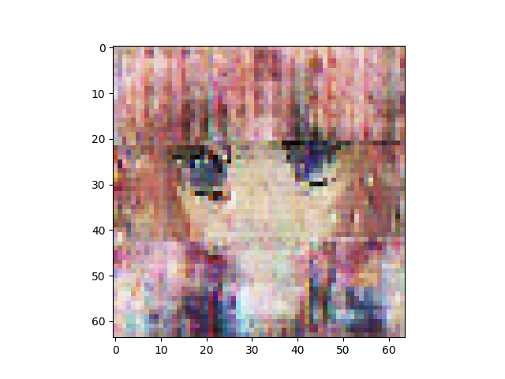
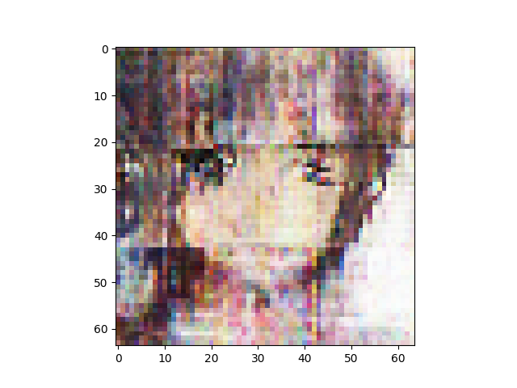
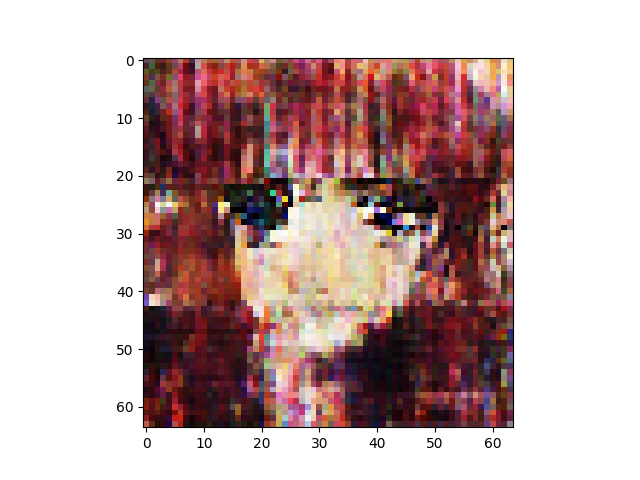
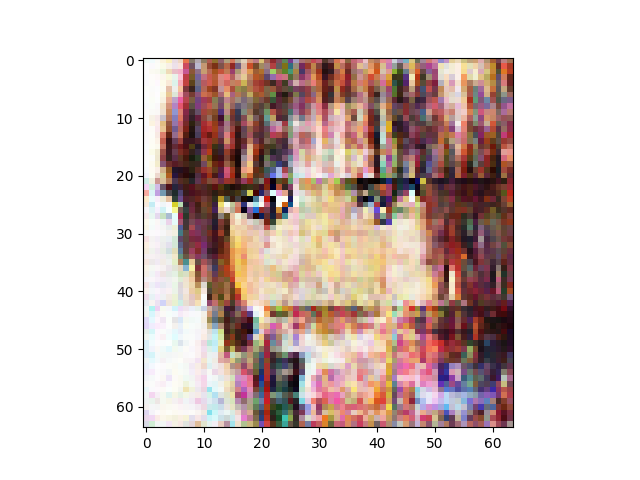

n_latent:512 

n_base_channels:32 

PBP weight:1 

n_solo_epochs:0 

n_combo_epochs:200 

max_disc_loss :999 

Epoch0, VAE Training loss 7820.19189, ResNet Training loss 0.6808480024, Time used 36.21

Epoch1, VAE Training loss 7452.37207, ResNet Training loss 0.6164903641, Time used 33.62

Epoch2, VAE Training loss 7167.90381, ResNet Training loss 0.9033917785, Time used 33.42

Epoch3, VAE Training loss 7272.89258, ResNet Training loss 0.6791640520, Time used 33.34

Epoch4, VAE Training loss 7220.36768, ResNet Training loss 0.9073464870, Time used 33.34

Epoch5, VAE Training loss 7202.43262, ResNet Training loss 0.8905991316, Time used 33.40

Epoch6, VAE Training loss 7176.12500, ResNet Training loss 0.8726707101, Time used 33.79

Epoch7, VAE Training loss 7134.77539, ResNet Training loss 0.7732831240, Time used 33.31

Epoch8, VAE Training loss 7174.76953, ResNet Training loss 1.0018383265, Time used 33.93

Epoch9, VAE Training loss 7189.53223, ResNet Training loss 0.9405549765, Time used 33.38

Epoch10, VAE Training loss 7133.74219, ResNet Training loss 0.8388468623, Time used 33.85

Epoch11, VAE Training loss 7243.11377, ResNet Training loss 0.8421636224, Time used 33.70

Epoch12, VAE Training loss 7244.38525, ResNet Training loss 0.9010771513, Time used 33.33

Epoch13, VAE Training loss 7237.32568, ResNet Training loss 0.8726162314, Time used 33.29

Epoch14, VAE Training loss 7258.59277, ResNet Training loss 0.7581626773, Time used 33.29

Epoch15, VAE Training loss 7378.42529, ResNet Training loss 0.7210655808, Time used 33.34

Epoch16, VAE Training loss 7256.03906, ResNet Training loss 0.6500696540, Time used 33.55

Epoch17, VAE Training loss 7318.75391, ResNet Training loss 0.6876996160, Time used 33.33

Epoch18, VAE Training loss 7490.57520, ResNet Training loss 0.5753273368, Time used 33.91

Epoch19, VAE Training loss 7614.06787, ResNet Training loss 0.4364041388, Time used 33.27

Epoch20, VAE Training loss 7394.69092, ResNet Training loss 0.6663224697, Time used 33.32

Epoch21, VAE Training loss 7488.19043, ResNet Training loss 0.5839469433, Time used 33.95

Epoch22, VAE Training loss 7427.64600, ResNet Training loss 0.5921034217, Time used 33.23

Epoch23, VAE Training loss 7504.00537, ResNet Training loss 0.5408611298, Time used 33.51

Epoch24, VAE Training loss 7573.67676, ResNet Training loss 0.4362407625, Time used 33.25

Epoch25, VAE Training loss 7621.40088, ResNet Training loss 0.5037292242, Time used 34.15

Epoch26, VAE Training loss 7493.56543, ResNet Training loss 0.5356784463, Time used 33.49

Epoch27, VAE Training loss 7492.20850, ResNet Training loss 0.4585777521, Time used 33.69

Epoch28, VAE Training loss 7482.47607, ResNet Training loss 0.4274164736, Time used 33.44

Epoch29, VAE Training loss 7429.05811, ResNet Training loss 0.4554416239, Time used 33.51

Epoch30, VAE Training loss 7591.37988, ResNet Training loss 0.3490407169, Time used 33.39

Epoch31, VAE Training loss 7539.62793, ResNet Training loss 0.4199785888, Time used 33.54

Epoch32, VAE Training loss 7511.05029, ResNet Training loss 0.4308467209, Time used 33.72

Epoch33, VAE Training loss 7508.98242, ResNet Training loss 0.3592308462, Time used 33.67

Epoch34, VAE Training loss 7567.39062, ResNet Training loss 0.3831098080, Time used 33.37

Epoch35, VAE Training loss 7519.02832, ResNet Training loss 0.3355039954, Time used 33.34

Epoch36, VAE Training loss 7478.60547, ResNet Training loss 0.3558804095, Time used 33.68

Epoch37, VAE Training loss 7570.49170, ResNet Training loss 0.2737159431, Time used 33.84

Epoch38, VAE Training loss 7621.09033, ResNet Training loss 0.3978783190, Time used 33.72

Epoch39, VAE Training loss 7579.48340, ResNet Training loss 0.3023276925, Time used 33.84

Epoch40, VAE Training loss 7628.08398, ResNet Training loss 0.2880149484, Time used 33.25

Epoch41, VAE Training loss 7673.60986, ResNet Training loss 0.2438662201, Time used 33.20

Epoch42, VAE Training loss 7618.30811, ResNet Training loss 0.2788238525, Time used 33.36

Epoch43, VAE Training loss 7603.82861, ResNet Training loss 0.2893209457, Time used 33.92

Epoch44, VAE Training loss 7614.11572, ResNet Training loss 0.2878866792, Time used 34.31

Epoch45, VAE Training loss 7549.45703, ResNet Training loss 0.2503720224, Time used 33.95

Epoch46, VAE Training loss 7605.29639, ResNet Training loss 0.2310047001, Time used 33.44

Epoch47, VAE Training loss 7606.48877, ResNet Training loss 0.2988398671, Time used 33.73

Epoch48, VAE Training loss 7605.97803, ResNet Training loss 0.2766111493, Time used 33.64

Epoch49, VAE Training loss 7676.25098, ResNet Training loss 0.2529994547, Time used 33.85

Epoch50, VAE Training loss 7632.26807, ResNet Training loss 0.2813483775, Time used 33.72

Epoch51, VAE Training loss 7609.73193, ResNet Training loss 0.2452193648, Time used 33.38

Epoch52, VAE Training loss 7575.53711, ResNet Training loss 0.2779143453, Time used 33.32

Epoch53, VAE Training loss 7644.64355, ResNet Training loss 0.2118696570, Time used 33.47

Epoch54, VAE Training loss 7654.14746, ResNet Training loss 0.2236264348, Time used 33.75

Epoch55, VAE Training loss 7484.36865, ResNet Training loss 0.3145798147, Time used 34.01

Epoch56, VAE Training loss 7681.33350, ResNet Training loss 0.1407684684, Time used 33.68

Epoch57, VAE Training loss 7619.29443, ResNet Training loss 0.2188919485, Time used 33.41

Epoch58, VAE Training loss 7654.14893, ResNet Training loss 0.1944072247, Time used 33.42

Epoch59, VAE Training loss 7607.65918, ResNet Training loss 0.1840138435, Time used 33.48

Epoch60, VAE Training loss 7611.08936, ResNet Training loss 0.2633492053, Time used 33.47

Epoch61, VAE Training loss 7617.27100, ResNet Training loss 0.2150643319, Time used 33.35

Epoch62, VAE Training loss 7576.23486, ResNet Training loss 0.2271909118, Time used 33.58

Epoch63, VAE Training loss 7508.40967, ResNet Training loss 0.2828634083, Time used 33.59

Epoch64, VAE Training loss 7544.88623, ResNet Training loss 0.1973105818, Time used 33.69

Epoch65, VAE Training loss 7569.06934, ResNet Training loss 0.2893720865, Time used 33.34

Epoch66, VAE Training loss 7838.08984, ResNet Training loss 0.2190359980, Time used 33.77

Epoch67, VAE Training loss 7661.43213, ResNet Training loss 0.2070442736, Time used 33.65

Epoch68, VAE Training loss 7626.08984, ResNet Training loss 0.1815534830, Time used 33.62

Epoch69, VAE Training loss 7594.35107, ResNet Training loss 0.1337217540, Time used 33.66

Epoch70, VAE Training loss 7626.72314, ResNet Training loss 0.1618401706, Time used 33.51

Epoch71, VAE Training loss 7434.18994, ResNet Training loss 0.1611511409, Time used 33.72

Epoch72, VAE Training loss 7577.03857, ResNet Training loss 0.1837658137, Time used 33.86

Epoch73, VAE Training loss 7582.83740, ResNet Training loss 0.1861020476, Time used 33.60

Epoch74, VAE Training loss 7558.91992, ResNet Training loss 0.1645589471, Time used 33.53

Epoch75, VAE Training loss 7644.53320, ResNet Training loss 0.1528702229, Time used 33.49

Epoch76, VAE Training loss 7654.87939, ResNet Training loss 0.1835783571, Time used 33.50

Epoch77, VAE Training loss 7839.88721, ResNet Training loss 0.1589740962, Time used 33.60

Epoch78, VAE Training loss 7549.45996, ResNet Training loss 0.0970544517, Time used 33.67

Epoch79, VAE Training loss 7527.34717, ResNet Training loss 0.1625236571, Time used 33.77

Epoch80, VAE Training loss 7566.01465, ResNet Training loss 0.1512974799, Time used 33.58

Epoch81, VAE Training loss 7597.46875, ResNet Training loss 0.1567440033, Time used 33.50

Epoch82, VAE Training loss 7648.12744, ResNet Training loss 0.1425652951, Time used 33.31

Epoch83, VAE Training loss 7521.77832, ResNet Training loss 0.2045243084, Time used 33.58

Epoch84, VAE Training loss 7497.72070, ResNet Training loss 0.1650452912, Time used 33.51

Epoch85, VAE Training loss 7648.03027, ResNet Training loss 0.2026245743, Time used 34.04

Epoch86, VAE Training loss 7627.29932, ResNet Training loss 0.1663553566, Time used 33.27

Epoch87, VAE Training loss 7588.28027, ResNet Training loss 0.1811504215, Time used 33.66

Epoch88, VAE Training loss 7602.88281, ResNet Training loss 0.1375068277, Time used 33.67

Epoch89, VAE Training loss 7556.64453, ResNet Training loss 0.1788045764, Time used 33.79

Epoch90, VAE Training loss 7618.31152, ResNet Training loss 0.1717148274, Time used 34.27

Epoch91, VAE Training loss 7698.54590, ResNet Training loss 0.1959628165, Time used 33.39

Epoch92, VAE Training loss 7735.89648, ResNet Training loss 0.1777856052, Time used 33.69

Epoch93, VAE Training loss 7783.36475, ResNet Training loss 0.1726468652, Time used 33.73

Epoch94, VAE Training loss 7880.59717, ResNet Training loss 0.1545369029, Time used 33.52

Epoch95, VAE Training loss 7783.67236, ResNet Training loss 0.1340760440, Time used 33.29

Epoch96, VAE Training loss 7682.66943, ResNet Training loss 0.1041088700, Time used 33.51

Epoch97, VAE Training loss 7703.85010, ResNet Training loss 0.1975975335, Time used 33.20

Epoch98, VAE Training loss 7857.82666, ResNet Training loss 0.1127694324, Time used 33.77

Epoch99, VAE Training loss 7788.18311, ResNet Training loss 0.1523897499, Time used 33.71

Epoch100, VAE Training loss 7815.66504, ResNet Training loss 0.1847492009, Time used 33.51

Epoch101, VAE Training loss 7734.64014, ResNet Training loss 0.0952581763, Time used 33.43

Epoch102, VAE Training loss 7609.37939, ResNet Training loss 0.1262626052, Time used 33.59

Epoch103, VAE Training loss 7695.22266, ResNet Training loss 0.1685120016, Time used 33.50

Epoch104, VAE Training loss 7580.24268, ResNet Training loss 0.1178190410, Time used 33.55

Epoch105, VAE Training loss 7637.41797, ResNet Training loss 0.1812849045, Time used 33.75

Epoch106, VAE Training loss 7768.73535, ResNet Training loss 0.1331357360, Time used 33.82

Epoch107, VAE Training loss 7721.72119, ResNet Training loss 0.1356472224, Time used 33.82

Epoch108, VAE Training loss 7638.23877, ResNet Training loss 0.1631564796, Time used 33.90

Epoch109, VAE Training loss 7690.60400, ResNet Training loss 0.1262160689, Time used 34.43

Epoch110, VAE Training loss 7685.40723, ResNet Training loss 0.1136408299, Time used 33.94

Epoch111, VAE Training loss 7625.77295, ResNet Training loss 0.0995678231, Time used 33.32

Epoch112, VAE Training loss 7744.66846, ResNet Training loss 0.1375305355, Time used 33.75

Epoch113, VAE Training loss 7703.80762, ResNet Training loss 0.1454926878, Time used 33.48

Epoch114, VAE Training loss 7741.78662, ResNet Training loss 0.0908082724, Time used 33.97

Epoch115, VAE Training loss 7762.29980, ResNet Training loss 0.0924051628, Time used 33.53

Epoch116, VAE Training loss 7802.65283, ResNet Training loss 0.1294938028, Time used 33.79

Epoch117, VAE Training loss 7595.48828, ResNet Training loss 0.0667417720, Time used 33.49

Epoch118, VAE Training loss 7312.95361, ResNet Training loss 0.1888122559, Time used 33.66

Epoch119, VAE Training loss 7351.74268, ResNet Training loss 0.1067438051, Time used 33.84

Epoch120, VAE Training loss 7505.50635, ResNet Training loss 0.1119594723, Time used 33.65

Epoch121, VAE Training loss 7676.13721, ResNet Training loss 0.1347030103, Time used 33.29

Epoch122, VAE Training loss 7777.36133, ResNet Training loss 0.1371429414, Time used 33.29

Epoch123, VAE Training loss 7446.09912, ResNet Training loss 0.1717094034, Time used 33.53

Epoch124, VAE Training loss 7574.96191, ResNet Training loss 0.0931707993, Time used 33.47

Epoch125, VAE Training loss 7600.77686, ResNet Training loss 0.0992756039, Time used 33.22

Epoch126, VAE Training loss 7576.89746, ResNet Training loss 0.1245104745, Time used 34.13

Epoch127, VAE Training loss 7744.49854, ResNet Training loss 0.0961466059, Time used 33.52

Epoch128, VAE Training loss 7617.27344, ResNet Training loss 0.1044980362, Time used 33.62

Epoch129, VAE Training loss 7438.25000, ResNet Training loss 0.0763306394, Time used 33.25

Epoch130, VAE Training loss 7613.29248, ResNet Training loss 0.1192645580, Time used 33.76

Epoch131, VAE Training loss 7468.03955, ResNet Training loss 0.1061681136, Time used 33.36

Epoch132, VAE Training loss 7665.29248, ResNet Training loss 0.1304748505, Time used 33.34

Epoch133, VAE Training loss 7691.20410, ResNet Training loss 0.2000068724, Time used 33.46

Epoch134, VAE Training loss 7721.33301, ResNet Training loss 0.1704350710, Time used 33.61

Epoch135, VAE Training loss 7743.13477, ResNet Training loss 0.0912074894, Time used 33.53

Epoch136, VAE Training loss 7825.95068, ResNet Training loss 0.1258078963, Time used 33.35

Epoch137, VAE Training loss 7925.61768, ResNet Training loss 0.0883397684, Time used 33.39

Epoch138, VAE Training loss 7831.27148, ResNet Training loss 0.1036960185, Time used 33.69

Epoch139, VAE Training loss 7739.93555, ResNet Training loss 0.1141377985, Time used 33.76

Epoch140, VAE Training loss 7782.95752, ResNet Training loss 0.1294000745, Time used 33.89

Epoch141, VAE Training loss 7670.43311, ResNet Training loss 0.1292150021, Time used 33.30

Epoch142, VAE Training loss 7606.98682, ResNet Training loss 0.0926195607, Time used 33.42

Epoch143, VAE Training loss 7672.25830, ResNet Training loss 0.1078240722, Time used 33.31

Epoch144, VAE Training loss 7759.15527, ResNet Training loss 0.1059511974, Time used 33.50

Epoch145, VAE Training loss 7659.96045, ResNet Training loss 0.1142881289, Time used 33.77

Epoch146, VAE Training loss 7575.44189, ResNet Training loss 0.1032583788, Time used 33.75

Epoch147, VAE Training loss 7505.49512, ResNet Training loss 0.1488968134, Time used 33.55

Epoch148, VAE Training loss 7901.85742, ResNet Training loss 0.1681497693, Time used 33.58

Epoch149, VAE Training loss 7526.14209, ResNet Training loss 0.0623699762, Time used 33.44

Epoch150, VAE Training loss 7746.35010, ResNet Training loss 0.0921726897, Time used 33.64

Epoch151, VAE Training loss 7821.84521, ResNet Training loss 0.1228357106, Time used 33.31

Epoch152, VAE Training loss 7666.01611, ResNet Training loss 0.1073350832, Time used 33.54

Epoch153, VAE Training loss 7726.32764, ResNet Training loss 0.0842144638, Time used 33.63

Epoch154, VAE Training loss 7968.95020, ResNet Training loss 0.1264746934, Time used 33.38

Epoch155, VAE Training loss 7686.88721, ResNet Training loss 0.0714370683, Time used 33.69

Epoch156, VAE Training loss 7829.50391, ResNet Training loss 0.1187822819, Time used 33.42

Epoch157, VAE Training loss 7906.77295, ResNet Training loss 0.0870961621, Time used 33.31

Epoch158, VAE Training loss 7894.67578, ResNet Training loss 0.0967828855, Time used 33.75

Epoch159, VAE Training loss 7994.26367, ResNet Training loss 0.1915168315, Time used 33.62

Epoch160, VAE Training loss 7918.86865, ResNet Training loss 0.0863865018, Time used 33.55

Epoch161, VAE Training loss 7831.52051, ResNet Training loss 0.0676881894, Time used 33.55

Epoch162, VAE Training loss 8210.58398, ResNet Training loss 0.0879256949, Time used 33.49

Epoch163, VAE Training loss 8081.35010, ResNet Training loss 0.0953900069, Time used 33.37

Epoch164, VAE Training loss 7878.99805, ResNet Training loss 0.0772415176, Time used 33.88

Epoch165, VAE Training loss 8132.26318, ResNet Training loss 0.1306533366, Time used 33.76

Epoch166, VAE Training loss 7834.98535, ResNet Training loss 0.0621265471, Time used 33.48

Epoch167, VAE Training loss 7791.56104, ResNet Training loss 0.0766164139, Time used 33.38

Epoch168, VAE Training loss 8021.84082, ResNet Training loss 0.1079368591, Time used 33.46

Epoch169, VAE Training loss 8217.18066, ResNet Training loss 0.0875252932, Time used 33.66

Epoch170, VAE Training loss 7718.29346, ResNet Training loss 0.0423280969, Time used 33.65

Epoch171, VAE Training loss 7686.17041, ResNet Training loss 0.0811553821, Time used 33.70

Epoch172, VAE Training loss 7986.94922, ResNet Training loss 0.0924595594, Time used 33.95

Epoch173, VAE Training loss 8088.31396, ResNet Training loss 0.0937288553, Time used 33.57

Epoch174, VAE Training loss 8265.36816, ResNet Training loss 0.0922367126, Time used 33.25

Epoch175, VAE Training loss 8130.39795, ResNet Training loss 0.0331913196, Time used 33.53

Epoch176, VAE Training loss 7895.87891, ResNet Training loss 0.0547388420, Time used 33.23

Epoch177, VAE Training loss 8240.97168, ResNet Training loss 0.1535757780, Time used 33.67

Epoch178, VAE Training loss 8085.50732, ResNet Training loss 0.1075123474, Time used 33.32

Epoch179, VAE Training loss 8190.93506, ResNet Training loss 0.1051214114, Time used 33.40

Epoch180, VAE Training loss 7894.96094, ResNet Training loss 0.0565816648, Time used 33.67

Epoch181, VAE Training loss 7899.17676, ResNet Training loss 0.0932157561, Time used 33.42

Epoch182, VAE Training loss 8108.60742, ResNet Training loss 0.0674580857, Time used 33.51

Epoch183, VAE Training loss 8081.21094, ResNet Training loss 0.0710636675, Time used 33.88

Epoch184, VAE Training loss 8056.85010, ResNet Training loss 0.0954589993, Time used 33.84

Epoch185, VAE Training loss 7907.78125, ResNet Training loss 0.0800562799, Time used 33.71

Epoch186, VAE Training loss 7951.53320, ResNet Training loss 0.0826962069, Time used 33.33

Epoch187, VAE Training loss 7886.51758, ResNet Training loss 0.0513559356, Time used 33.65

Epoch188, VAE Training loss 8209.18457, ResNet Training loss 0.0675054118, Time used 33.28

Epoch189, VAE Training loss 8318.10156, ResNet Training loss 0.0639667884, Time used 33.32

Epoch190, VAE Training loss 7904.56738, ResNet Training loss 0.0713776648, Time used 33.40

Epoch191, VAE Training loss 8040.32031, ResNet Training loss 0.0945776254, Time used 33.52

Epoch192, VAE Training loss 7745.91650, ResNet Training loss 0.0437999107, Time used 33.36

Epoch193, VAE Training loss 8172.18896, ResNet Training loss 0.1197836995, Time used 33.45

Epoch194, VAE Training loss 8008.23535, ResNet Training loss 0.1012580246, Time used 33.72

Epoch195, VAE Training loss 8148.95020, ResNet Training loss 0.1326342523, Time used 33.33

Epoch196, VAE Training loss 8348.91602, ResNet Training loss 0.0715024173, Time used 33.34

Epoch197, VAE Training loss 8263.82520, ResNet Training loss 0.0498068891, Time used 33.61

Epoch198, VAE Training loss 7906.22754, ResNet Training loss 0.0996678546, Time used 33.60

Epoch199, VAE Training loss 7840.98047, ResNet Training loss 0.0783305541, Time used 33.45

