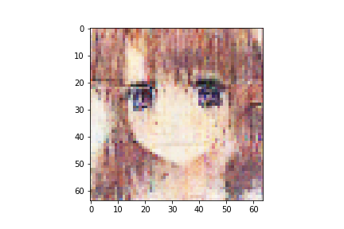
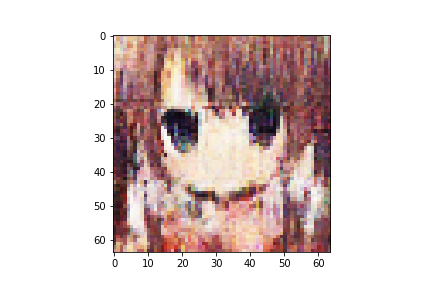
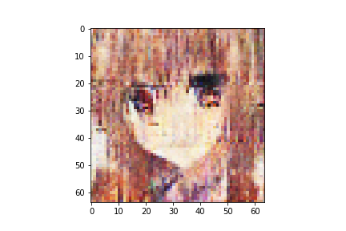
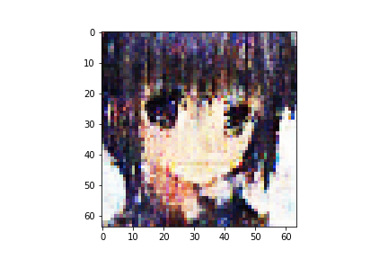
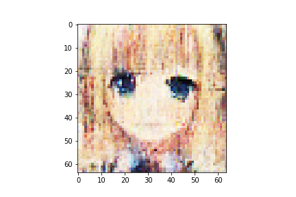
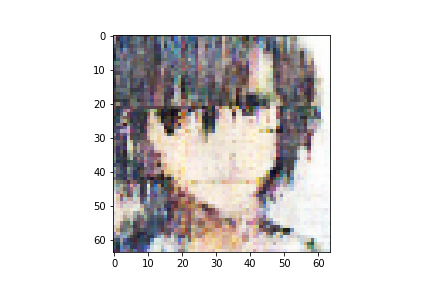
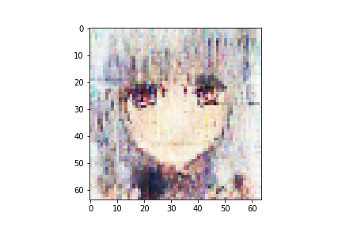
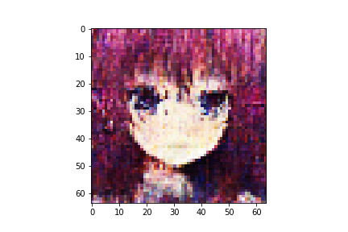
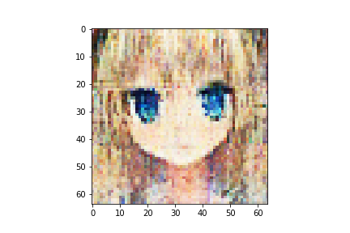
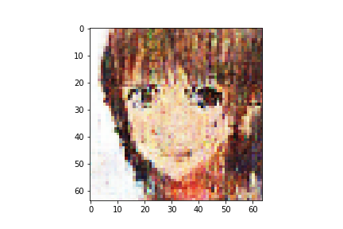

n_latent:512 

n_base_channels:32 

PBP weight:1 

n_solo_epochs:50 

n_combo_epochs:150 

max_disc_loss :999 

Epoch0, Training loss 7169.4160156250, Time used 11.62

Epoch1, Training loss 6814.2592773438, Time used 9.66

Epoch2, Training loss 6741.4575195312, Time used 9.65

Epoch3, Training loss 6710.9394531250, Time used 9.63

Epoch4, Training loss 6692.0307617188, Time used 9.65

Epoch5, Training loss 6679.0786132812, Time used 9.62

Epoch6, Training loss 6667.6489257812, Time used 9.67

Epoch7, Training loss 6658.1992187500, Time used 9.64

Epoch8, Training loss 6651.4062500000, Time used 9.66

Epoch9, Training loss 6646.9960937500, Time used 9.67

Epoch10, Training loss 6641.3349609375, Time used 9.67

Epoch11, Training loss 6635.8383789062, Time used 9.66

Epoch12, Training loss 6630.1816406250, Time used 9.70

Epoch13, Training loss 6625.4135742188, Time used 9.66

Epoch14, Training loss 6621.9184570312, Time used 9.65

Epoch15, Training loss 6617.5410156250, Time used 9.64

Epoch16, Training loss 6614.8779296875, Time used 9.64

Epoch17, Training loss 6612.2128906250, Time used 9.63

Epoch18, Training loss 6608.0336914062, Time used 9.63

Epoch19, Training loss 6605.1035156250, Time used 9.63

Epoch20, Training loss 6601.3730468750, Time used 9.63

Epoch21, Training loss 6600.3442382812, Time used 9.65

Epoch22, Training loss 6598.4174804688, Time used 9.65

Epoch23, Training loss 6596.1645507812, Time used 9.64

Epoch24, Training loss 6594.8554687500, Time used 9.64

Epoch25, Training loss 6590.2788085938, Time used 9.65

Epoch26, Training loss 6592.1958007812, Time used 9.66

Epoch27, Training loss 6588.2402343750, Time used 9.68

Epoch28, Training loss 6586.7421875000, Time used 9.64

Epoch29, Training loss 6585.4990234375, Time used 9.68

Epoch30, Training loss 6583.3530273438, Time used 9.67

Epoch31, Training loss 6581.9858398438, Time used 9.67

Epoch32, Training loss 6580.5903320312, Time used 9.63

Epoch33, Training loss 6577.5224609375, Time used 9.64

Epoch34, Training loss 6576.3115234375, Time used 9.66

Epoch35, Training loss 6576.6025390625, Time used 9.66

Epoch36, Training loss 6573.6279296875, Time used 9.63

Epoch37, Training loss 6572.7470703125, Time used 9.65

Epoch38, Training loss 6571.3759765625, Time used 9.67

Epoch39, Training loss 6568.6235351562, Time used 9.65

Epoch40, Training loss 6568.3525390625, Time used 9.63

Epoch41, Training loss 6568.1425781250, Time used 9.65

Epoch42, Training loss 6567.2529296875, Time used 9.65

Epoch43, Training loss 6567.0083007812, Time used 9.64

Epoch44, Training loss 6563.4472656250, Time used 9.65

Epoch45, Training loss 6563.5737304688, Time used 9.65

Epoch46, Training loss 6562.9599609375, Time used 9.65

Epoch47, Training loss 6561.2587890625, Time used 9.66

Epoch48, Training loss 6558.9438476562, Time used 9.65

Epoch49, Training loss 6559.0507812500, Time used 9.70

Epoch50, VAE Training loss 6629.40479, ResNet Training loss 0.8092781901, Time used 34.36

Epoch51, VAE Training loss 6699.26367, ResNet Training loss 0.4670913815, Time used 33.61

Epoch52, VAE Training loss 6656.75098, ResNet Training loss 0.3543945849, Time used 33.53

Epoch53, VAE Training loss 6641.87842, ResNet Training loss 0.2579376996, Time used 33.50

Epoch54, VAE Training loss 6690.07324, ResNet Training loss 0.6366245151, Time used 33.51

Epoch55, VAE Training loss 6667.35840, ResNet Training loss 0.1842536181, Time used 33.68

Epoch56, VAE Training loss 6638.30273, ResNet Training loss 0.0025966212, Time used 33.49

Epoch57, VAE Training loss 6646.76123, ResNet Training loss 0.0012497769, Time used 33.57

Epoch58, VAE Training loss 6660.17822, ResNet Training loss 0.1521289796, Time used 33.58

Epoch59, VAE Training loss 6648.28320, ResNet Training loss 0.6450024247, Time used 33.47

Epoch60, VAE Training loss 6646.09229, ResNet Training loss 0.1040437743, Time used 33.63

Epoch61, VAE Training loss 6672.18213, ResNet Training loss 0.0803571120, Time used 33.54

Epoch62, VAE Training loss 6688.67773, ResNet Training loss 0.0398582034, Time used 33.58

Epoch63, VAE Training loss 6670.71387, ResNet Training loss 0.0004978015, Time used 33.52

Epoch64, VAE Training loss 6682.48047, ResNet Training loss 0.1042812020, Time used 33.63

Epoch65, VAE Training loss 6666.51465, ResNet Training loss 0.1438162327, Time used 33.39

Epoch66, VAE Training loss 6650.38232, ResNet Training loss 0.0014084228, Time used 33.56

Epoch67, VAE Training loss 6689.95068, ResNet Training loss 0.2422456592, Time used 33.50

Epoch68, VAE Training loss 6699.73926, ResNet Training loss 0.2578579783, Time used 33.50

Epoch69, VAE Training loss 6693.82861, ResNet Training loss 0.1428567022, Time used 33.64

Epoch70, VAE Training loss 6727.76611, ResNet Training loss 0.3241906166, Time used 33.40

Epoch71, VAE Training loss 6680.99365, ResNet Training loss 0.1737249047, Time used 33.59

Epoch72, VAE Training loss 6695.12500, ResNet Training loss 0.0521956123, Time used 33.37

Epoch73, VAE Training loss 6727.32568, ResNet Training loss 0.3051536679, Time used 33.41

Epoch74, VAE Training loss 6768.86768, ResNet Training loss 0.3553717136, Time used 33.52

Epoch75, VAE Training loss 6728.65576, ResNet Training loss 0.2758166194, Time used 33.42

Epoch76, VAE Training loss 6768.51758, ResNet Training loss 0.2466659248, Time used 33.67

Epoch77, VAE Training loss 6732.57129, ResNet Training loss 0.2448614389, Time used 33.46

Epoch78, VAE Training loss 6705.93262, ResNet Training loss 0.1966882199, Time used 33.46

Epoch79, VAE Training loss 6659.95605, ResNet Training loss 0.0014147172, Time used 33.61

Epoch80, VAE Training loss 6694.09912, ResNet Training loss 0.0426008590, Time used 33.49

Epoch81, VAE Training loss 6695.34766, ResNet Training loss 0.0005438876, Time used 33.60

Epoch82, VAE Training loss 6727.18506, ResNet Training loss 0.0573624633, Time used 33.83

Epoch83, VAE Training loss 6713.53125, ResNet Training loss 0.1651108861, Time used 33.43

Epoch84, VAE Training loss 6700.35107, ResNet Training loss 0.4662359357, Time used 33.50

Epoch85, VAE Training loss 6777.12549, ResNet Training loss 0.2839938700, Time used 33.53

Epoch86, VAE Training loss 6766.08740, ResNet Training loss 0.3661635220, Time used 33.57

Epoch87, VAE Training loss 6759.56885, ResNet Training loss 0.2238795906, Time used 33.53

Epoch88, VAE Training loss 6768.64258, ResNet Training loss 0.2817168534, Time used 33.45

Epoch89, VAE Training loss 6801.71582, ResNet Training loss 0.3707655668, Time used 33.50

Epoch90, VAE Training loss 6797.85205, ResNet Training loss 0.2391450405, Time used 33.53

Epoch91, VAE Training loss 6800.65381, ResNet Training loss 0.2785626948, Time used 33.57

Epoch92, VAE Training loss 6772.25439, ResNet Training loss 0.1427243501, Time used 33.64

Epoch93, VAE Training loss 6761.92969, ResNet Training loss 0.0727249309, Time used 33.36

Epoch94, VAE Training loss 6721.88721, ResNet Training loss 0.0988142788, Time used 33.58

Epoch95, VAE Training loss 6777.60010, ResNet Training loss 0.3563650548, Time used 33.50

Epoch96, VAE Training loss 6776.62305, ResNet Training loss 0.0197573621, Time used 33.64

Epoch97, VAE Training loss 6780.88965, ResNet Training loss 0.2847298980, Time used 33.68

Epoch98, VAE Training loss 6768.36768, ResNet Training loss 0.2217388749, Time used 33.65

Epoch99, VAE Training loss 6795.38379, ResNet Training loss 0.2380298525, Time used 33.60

Epoch100, VAE Training loss 6799.00098, ResNet Training loss 0.2322760075, Time used 33.52

Epoch101, VAE Training loss 6816.72412, ResNet Training loss 0.3370933235, Time used 33.48

Epoch102, VAE Training loss 6797.71631, ResNet Training loss 0.2595755756, Time used 33.43

Epoch103, VAE Training loss 6746.11035, ResNet Training loss 0.2905657589, Time used 33.55

Epoch104, VAE Training loss 6737.98779, ResNet Training loss 0.1007270589, Time used 33.41

Epoch105, VAE Training loss 6794.88330, ResNet Training loss 0.2254256010, Time used 33.44

Epoch106, VAE Training loss 6810.95654, ResNet Training loss 0.3324873149, Time used 33.68

Epoch107, VAE Training loss 6800.68311, ResNet Training loss 0.1955265105, Time used 33.40

Epoch108, VAE Training loss 6820.02588, ResNet Training loss 0.3364443183, Time used 33.67

Epoch109, VAE Training loss 6766.90625, ResNet Training loss 0.1764384657, Time used 33.63

Epoch110, VAE Training loss 6803.38037, ResNet Training loss 0.2665899396, Time used 33.34

Epoch111, VAE Training loss 6799.55273, ResNet Training loss 0.2419274002, Time used 33.49

Epoch112, VAE Training loss 6747.64795, ResNet Training loss 0.1433438063, Time used 33.47

Epoch113, VAE Training loss 6766.50732, ResNet Training loss 0.1568411142, Time used 33.45

Epoch114, VAE Training loss 6779.34082, ResNet Training loss 0.2645755708, Time used 33.78

Epoch115, VAE Training loss 6770.86133, ResNet Training loss 0.1516775936, Time used 33.54

Epoch116, VAE Training loss 6783.79639, ResNet Training loss 0.2134989202, Time used 33.55

Epoch117, VAE Training loss 6806.79492, ResNet Training loss 0.2623349130, Time used 33.44

Epoch118, VAE Training loss 6809.65918, ResNet Training loss 0.2403281033, Time used 33.35

Epoch119, VAE Training loss 6746.93066, ResNet Training loss 0.1784545779, Time used 33.28

Epoch120, VAE Training loss 6754.17969, ResNet Training loss 0.1024742424, Time used 33.29

Epoch121, VAE Training loss 6759.25098, ResNet Training loss 0.0606750287, Time used 33.55

Epoch122, VAE Training loss 6790.52686, ResNet Training loss 0.2211772203, Time used 33.44

Epoch123, VAE Training loss 6744.93115, ResNet Training loss 0.2550976574, Time used 33.72

Epoch124, VAE Training loss 6756.37793, ResNet Training loss 0.0235841684, Time used 33.57

Epoch125, VAE Training loss 6774.03711, ResNet Training loss 0.3030472398, Time used 33.56

Epoch126, VAE Training loss 6778.43066, ResNet Training loss 0.1422365755, Time used 33.23

Epoch127, VAE Training loss 6784.71191, ResNet Training loss 0.2068330348, Time used 33.49

Epoch128, VAE Training loss 6791.71582, ResNet Training loss 0.1957709640, Time used 33.42

Epoch129, VAE Training loss 6808.49756, ResNet Training loss 0.2542753518, Time used 33.42

Epoch130, VAE Training loss 6759.21289, ResNet Training loss 0.0013754109, Time used 33.74

Epoch131, VAE Training loss 6797.18262, ResNet Training loss 0.1472048908, Time used 33.57

Epoch132, VAE Training loss 6826.49463, ResNet Training loss 0.3262310028, Time used 33.55

Epoch133, VAE Training loss 6801.00586, ResNet Training loss 0.1862707138, Time used 33.47

Epoch134, VAE Training loss 6724.89648, ResNet Training loss 0.1986675113, Time used 33.43

Epoch135, VAE Training loss 6795.38525, ResNet Training loss 0.2828834355, Time used 33.68

Epoch136, VAE Training loss 6759.37256, ResNet Training loss 0.0862865821, Time used 32.98

Epoch137, VAE Training loss 6716.77490, ResNet Training loss 0.1824641973, Time used 33.31

Epoch138, VAE Training loss 6676.02588, ResNet Training loss 0.0005078365, Time used 33.36

Epoch139, VAE Training loss 6719.04834, ResNet Training loss 0.0409378633, Time used 33.45

Epoch140, VAE Training loss 6731.39697, ResNet Training loss 0.0674113631, Time used 33.42

Epoch141, VAE Training loss 6748.85352, ResNet Training loss 0.0732491910, Time used 33.63

Epoch142, VAE Training loss 6761.90625, ResNet Training loss 0.0924009085, Time used 33.42

Epoch143, VAE Training loss 6718.87646, ResNet Training loss 0.1218413189, Time used 33.45

Epoch144, VAE Training loss 6752.79980, ResNet Training loss 0.1243481934, Time used 33.52

Epoch145, VAE Training loss 6750.00293, ResNet Training loss 0.1307567060, Time used 33.69

Epoch146, VAE Training loss 6759.57227, ResNet Training loss 0.1872391850, Time used 33.54

Epoch147, VAE Training loss 6807.90430, ResNet Training loss 0.2692901194, Time used 33.65

Epoch148, VAE Training loss 6799.44385, ResNet Training loss 0.2502847612, Time used 33.48

Epoch149, VAE Training loss 6788.48047, ResNet Training loss 0.2401411831, Time used 33.57

Epoch150, VAE Training loss 6834.27588, ResNet Training loss 0.3430598974, Time used 33.57

Epoch151, VAE Training loss 6811.76807, ResNet Training loss 0.3230952621, Time used 33.81

Epoch152, VAE Training loss 6711.60254, ResNet Training loss 0.0065126745, Time used 33.56

Epoch153, VAE Training loss 6765.81104, ResNet Training loss 0.1354237944, Time used 33.51

Epoch154, VAE Training loss 6817.85010, ResNet Training loss 0.2623046339, Time used 33.54

Epoch155, VAE Training loss 6790.56104, ResNet Training loss 0.1905351728, Time used 33.59

Epoch156, VAE Training loss 6817.30908, ResNet Training loss 0.3360244334, Time used 33.57

Epoch157, VAE Training loss 6790.33496, ResNet Training loss 0.3675283790, Time used 33.76

Epoch158, VAE Training loss 6748.30371, ResNet Training loss 0.1067350134, Time used 33.62

Epoch159, VAE Training loss 6729.72119, ResNet Training loss 0.1893157810, Time used 33.59

Epoch160, VAE Training loss 6770.55176, ResNet Training loss 0.1007779762, Time used 33.51

Epoch161, VAE Training loss 6767.97559, ResNet Training loss 0.1693414748, Time used 33.59

Epoch162, VAE Training loss 6827.53125, ResNet Training loss 0.3822823465, Time used 33.69

Epoch163, VAE Training loss 6808.12354, ResNet Training loss 0.2556327581, Time used 33.81

Epoch164, VAE Training loss 6818.66113, ResNet Training loss 0.2194735259, Time used 33.58

Epoch165, VAE Training loss 6804.09424, ResNet Training loss 0.2209808379, Time used 33.48

Epoch166, VAE Training loss 6794.37891, ResNet Training loss 0.2060647160, Time used 33.51

Epoch167, VAE Training loss 6779.52295, ResNet Training loss 0.1755542755, Time used 33.53

Epoch168, VAE Training loss 6834.01221, ResNet Training loss 0.4353348315, Time used 33.68

Epoch169, VAE Training loss 6793.25098, ResNet Training loss 0.1807741374, Time used 33.63

Epoch170, VAE Training loss 6815.83984, ResNet Training loss 0.1991300732, Time used 33.43

Epoch171, VAE Training loss 6792.69629, ResNet Training loss 0.2641289830, Time used 33.58

Epoch172, VAE Training loss 6762.51318, ResNet Training loss 0.1738529354, Time used 33.43

Epoch173, VAE Training loss 6803.32471, ResNet Training loss 0.1966389120, Time used 33.67

Epoch174, VAE Training loss 6817.21973, ResNet Training loss 0.2277787924, Time used 33.52

Epoch175, VAE Training loss 6787.95654, ResNet Training loss 0.2357089967, Time used 33.52

Epoch176, VAE Training loss 6821.44336, ResNet Training loss 0.2264251113, Time used 33.64

Epoch177, VAE Training loss 6833.45068, ResNet Training loss 0.2750739455, Time used 33.60

Epoch178, VAE Training loss 6829.16602, ResNet Training loss 0.3072667718, Time used 33.59

Epoch179, VAE Training loss 6835.39746, ResNet Training loss 0.3084940612, Time used 33.55

Epoch180, VAE Training loss 6858.51660, ResNet Training loss 0.3837123811, Time used 33.49

Epoch181, VAE Training loss 6762.30566, ResNet Training loss 0.1410479695, Time used 33.46

Epoch182, VAE Training loss 6805.42090, ResNet Training loss 0.2410415113, Time used 33.59

Epoch183, VAE Training loss 6823.81104, ResNet Training loss 0.2791073024, Time used 33.52

Epoch184, VAE Training loss 6804.33350, ResNet Training loss 0.1711766869, Time used 33.31

Epoch185, VAE Training loss 6835.82422, ResNet Training loss 0.2715595365, Time used 33.30

Epoch186, VAE Training loss 6833.25244, ResNet Training loss 0.2748492062, Time used 33.28

Epoch187, VAE Training loss 6840.35840, ResNet Training loss 0.3362534940, Time used 33.54

Epoch188, VAE Training loss 6843.11328, ResNet Training loss 0.3237224817, Time used 33.64

Epoch189, VAE Training loss 6857.37207, ResNet Training loss 0.4095204175, Time used 33.63

Epoch190, VAE Training loss 6846.99316, ResNet Training loss 0.2578448355, Time used 33.50

Epoch191, VAE Training loss 6871.61035, ResNet Training loss 0.3942684531, Time used 33.54

Epoch192, VAE Training loss 6841.39844, ResNet Training loss 0.2255382389, Time used 33.64

Epoch193, VAE Training loss 6837.22314, ResNet Training loss 0.2290278226, Time used 33.69

Epoch194, VAE Training loss 6811.03516, ResNet Training loss 0.0830219910, Time used 33.68

Epoch195, VAE Training loss 6836.77100, ResNet Training loss 0.2602876723, Time used 33.41

Epoch196, VAE Training loss 6841.04980, ResNet Training loss 0.1791495383, Time used 33.65

Epoch197, VAE Training loss 6833.03711, ResNet Training loss 0.2083852440, Time used 33.65

Epoch198, VAE Training loss 6817.35547, ResNet Training loss 0.1296664774, Time used 33.56

Epoch199, VAE Training loss 6859.50049, ResNet Training loss 0.3273020685, Time used 33.52

