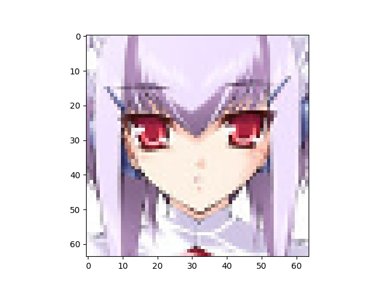

Number of latent variables 	10

Number of base channels 	64

Number of epochs trained 	100

Epoch0, Training loss 7316.3427734375, Time used 6.53

Epoch1, Training loss 7111.2631835938, Time used 6.79

Epoch2, Training loss 7041.8876953125, Time used 6.90

Epoch3, Training loss 6988.3208007812, Time used 7.74

Epoch4, Training loss 6953.2177734375, Time used 9.35

Epoch5, Training loss 6935.1538085938, Time used 11.00

Epoch6, Training loss 6921.7187500000, Time used 12.90

Epoch7, Training loss 6907.4296875000, Time used 13.57

Epoch8, Training loss 6900.2758789062, Time used 12.98

Epoch9, Training loss 6892.6806640625, Time used 14.01

Epoch10, Training loss 6884.6757812500, Time used 13.61

Epoch11, Training loss 6877.5961914062, Time used 13.89

Epoch12, Training loss 6872.4873046875, Time used 14.96

Epoch13, Training loss 6867.2421875000, Time used 14.96

Epoch14, Training loss 6862.7749023438, Time used 14.93

Epoch15, Training loss 6860.8105468750, Time used 14.91

Epoch16, Training loss 6857.3935546875, Time used 14.86

Epoch17, Training loss 6855.8481445312, Time used 14.88

Epoch18, Training loss 6855.9306640625, Time used 14.93

Epoch19, Training loss 6850.2041015625, Time used 14.90

Epoch20, Training loss 6850.6669921875, Time used 14.87

Epoch21, Training loss 6848.9946289062, Time used 14.82

Epoch22, Training loss 6846.4848632812, Time used 14.93

Epoch23, Training loss 6845.0620117188, Time used 14.94

Epoch24, Training loss 6842.5004882812, Time used 14.90

Epoch25, Training loss 6842.6088867188, Time used 14.96

Epoch26, Training loss 6840.7661132812, Time used 14.97

Epoch27, Training loss 6839.4252929688, Time used 15.05

Epoch28, Training loss 6838.2148437500, Time used 14.93

Epoch29, Training loss 6839.6674804688, Time used 14.87

Epoch30, Training loss 6835.6088867188, Time used 14.85

Epoch31, Training loss 6836.6982421875, Time used 14.94

Epoch32, Training loss 6832.9829101562, Time used 14.95

Epoch33, Training loss 6833.4257812500, Time used 14.90

Epoch34, Training loss 6830.1621093750, Time used 14.89

Epoch35, Training loss 6832.0092773438, Time used 14.88

Epoch36, Training loss 6828.6806640625, Time used 14.95

Epoch37, Training loss 6829.8989257812, Time used 14.91

Epoch38, Training loss 6826.9545898438, Time used 14.86

Epoch39, Training loss 6826.6010742188, Time used 14.89

Epoch40, Training loss 6825.3989257812, Time used 14.95

Epoch41, Training loss 6823.5234375000, Time used 14.92

Epoch42, Training loss 6824.8818359375, Time used 14.90

Epoch43, Training loss 6823.8510742188, Time used 14.84

Epoch44, Training loss 6822.3774414062, Time used 14.87

Epoch45, Training loss 6821.3344726562, Time used 14.94

Epoch46, Training loss 6820.0937500000, Time used 14.91

Epoch47, Training loss 6819.4599609375, Time used 14.88

Epoch48, Training loss 6818.8579101562, Time used 14.83

Epoch49, Training loss 6819.2529296875, Time used 14.94

Epoch50, Training loss 6817.2026367188, Time used 14.91

Epoch51, Training loss 6817.9741210938, Time used 14.92

Epoch52, Training loss 6815.5004882812, Time used 14.96

Epoch53, Training loss 6813.8710937500, Time used 14.99

Epoch54, Training loss 6814.5102539062, Time used 15.04

Epoch55, Training loss 6814.5219726562, Time used 15.03

Epoch56, Training loss 6811.7294921875, Time used 14.99

Epoch57, Training loss 6812.1518554688, Time used 14.95

Epoch58, Training loss 6810.3457031250, Time used 15.03

Epoch59, Training loss 6810.3442382812, Time used 15.03

Epoch60, Training loss 6811.1562500000, Time used 15.00

Epoch61, Training loss 6808.2353515625, Time used 14.90

Epoch62, Training loss 6808.2446289062, Time used 14.98

Epoch63, Training loss 6808.5375976562, Time used 15.03

Epoch64, Training loss 6807.1850585938, Time used 14.92

Epoch65, Training loss 6807.2065429688, Time used 14.88

Epoch66, Training loss 6804.3652343750, Time used 26.45

Epoch67, Training loss 6803.1289062500, Time used 26.94

Epoch68, Training loss 6802.2954101562, Time used 26.95

Epoch69, Training loss 6804.0996093750, Time used 15.25

Epoch70, Training loss 6802.4902343750, Time used 15.16

Epoch71, Training loss 6800.6157226562, Time used 15.04

Epoch72, Training loss 6802.1416015625, Time used 14.94

Epoch73, Training loss 6802.2128906250, Time used 15.16

Epoch74, Training loss 6799.9804687500, Time used 15.16

Epoch75, Training loss 6798.9233398438, Time used 15.15

Epoch76, Training loss 6797.7407226562, Time used 15.09

Epoch77, Training loss 6797.4096679688, Time used 15.11

Epoch78, Training loss 6795.8452148438, Time used 15.10

Epoch79, Training loss 6798.2788085938, Time used 15.04

Epoch80, Training loss 6794.8852539062, Time used 15.03

Epoch81, Training loss 6796.0454101562, Time used 15.01

Epoch82, Training loss 6794.0737304688, Time used 15.14

Epoch83, Training loss 6794.3857421875, Time used 15.11

Epoch84, Training loss 6792.1118164062, Time used 14.95

Epoch85, Training loss 6791.6118164062, Time used 15.06

Epoch86, Training loss 6791.8061523438, Time used 15.23

Epoch87, Training loss 6789.3364257812, Time used 15.11

Epoch88, Training loss 6791.8159179688, Time used 15.07

Epoch89, Training loss 6790.9731445312, Time used 15.08

Epoch90, Training loss 6788.6582031250, Time used 15.11

Epoch91, Training loss 6786.6269531250, Time used 15.35

Epoch92, Training loss 6787.2143554688, Time used 15.20

Epoch93, Training loss 6786.9282226562, Time used 15.05

Epoch94, Training loss 6786.6440429688, Time used 14.97

Epoch95, Training loss 6787.1210937500, Time used 15.11

Epoch96, Training loss 6785.0742187500, Time used 15.24

Epoch97, Training loss 6785.6362304688, Time used 15.16

Epoch98, Training loss 6786.0532226562, Time used 14.94

Epoch99, Training loss 6782.2084960938, Time used 15.06

