Number of latent variables 	256

Number of base channels 	16

Number of epochs trained 	200

Epoch0, Training loss 7322.3481445312, Time used 7.43

Epoch1, Training loss 6896.8950195312, Time used 6.55

Epoch2, Training loss 6818.3447265625, Time used 6.26

Epoch3, Training loss 6773.6777343750, Time used 6.25

Epoch4, Training loss 6745.7851562500, Time used 6.25

Epoch5, Training loss 6726.8149414062, Time used 6.26

Epoch6, Training loss 6714.8012695312, Time used 6.35

Epoch7, Training loss 6701.9555664062, Time used 6.43

Epoch8, Training loss 6693.3554687500, Time used 6.65

Epoch9, Training loss 6687.7534179688, Time used 6.67

Epoch10, Training loss 6681.1992187500, Time used 6.66

Epoch11, Training loss 6677.4145507812, Time used 6.67

Epoch12, Training loss 6670.9399414062, Time used 6.61

Epoch13, Training loss 6667.5312500000, Time used 6.58

Epoch14, Training loss 6663.6962890625, Time used 6.57

Epoch15, Training loss 6660.2871093750, Time used 6.22

Epoch16, Training loss 6657.3891601562, Time used 6.42

Epoch17, Training loss 6653.8393554688, Time used 6.65

Epoch18, Training loss 6651.0136718750, Time used 6.65

Epoch19, Training loss 6647.8149414062, Time used 6.62

Epoch20, Training loss 6645.4545898438, Time used 6.42

Epoch21, Training loss 6641.9589843750, Time used 6.42

Epoch22, Training loss 6641.4038085938, Time used 6.24

Epoch23, Training loss 6638.3286132812, Time used 6.44

Epoch24, Training loss 6637.6147460938, Time used 6.61

Epoch25, Training loss 6634.6665039062, Time used 6.67

Epoch26, Training loss 6634.3442382812, Time used 6.54

Epoch27, Training loss 6632.5117187500, Time used 6.32

Epoch28, Training loss 6630.5146484375, Time used 6.28

Epoch29, Training loss 6629.2856445312, Time used 6.23

Epoch30, Training loss 6627.8120117188, Time used 6.22

Epoch31, Training loss 6625.0249023438, Time used 6.23

Epoch32, Training loss 6625.7880859375, Time used 6.22

Epoch33, Training loss 6624.0981445312, Time used 6.35

Epoch34, Training loss 6623.7026367188, Time used 6.23

Epoch35, Training loss 6621.1616210938, Time used 6.47

Epoch36, Training loss 6619.0493164062, Time used 6.23

Epoch37, Training loss 6620.2348632812, Time used 6.22

Epoch38, Training loss 6618.6694335938, Time used 6.25

Epoch39, Training loss 6618.1953125000, Time used 6.24

Epoch40, Training loss 6615.2436523438, Time used 6.48

Epoch41, Training loss 6615.1591796875, Time used 6.24

Epoch42, Training loss 6613.4897460938, Time used 6.33

Epoch43, Training loss 6614.2246093750, Time used 6.39

Epoch44, Training loss 6611.2397460938, Time used 6.41

Epoch45, Training loss 6612.8881835938, Time used 6.23

Epoch46, Training loss 6609.1655273438, Time used 6.22

Epoch47, Training loss 6611.1240234375, Time used 6.23

Epoch48, Training loss 6609.4125976562, Time used 6.25

Epoch49, Training loss 6608.5312500000, Time used 6.24

Epoch50, Training loss 6607.4501953125, Time used 6.24

Epoch51, Training loss 6605.6035156250, Time used 6.34

Epoch52, Training loss 6606.4345703125, Time used 6.22

Epoch53, Training loss 6605.6743164062, Time used 6.23

Epoch54, Training loss 6603.9462890625, Time used 6.23

Epoch55, Training loss 6604.2832031250, Time used 6.35

Epoch56, Training loss 6602.8574218750, Time used 6.23

Epoch57, Training loss 6601.3623046875, Time used 6.25

Epoch58, Training loss 6601.5351562500, Time used 6.37

Epoch59, Training loss 6600.2626953125, Time used 6.34

Epoch60, Training loss 6600.8608398438, Time used 6.23

Epoch61, Training loss 6599.5498046875, Time used 6.22

Epoch62, Training loss 6598.1484375000, Time used 6.35

Epoch63, Training loss 6597.8427734375, Time used 6.46

Epoch64, Training loss 6597.9746093750, Time used 6.43

Epoch65, Training loss 6596.8969726562, Time used 6.23

Epoch66, Training loss 6596.1201171875, Time used 6.21

Epoch67, Training loss 6594.6289062500, Time used 6.24

Epoch68, Training loss 6596.2402343750, Time used 6.25

Epoch69, Training loss 6594.7978515625, Time used 6.25

Epoch70, Training loss 6594.4072265625, Time used 6.24

Epoch71, Training loss 6595.1308593750, Time used 6.23

Epoch72, Training loss 6592.5371093750, Time used 6.24

Epoch73, Training loss 6592.7622070312, Time used 6.24

Epoch74, Training loss 6592.5839843750, Time used 6.23

Epoch75, Training loss 6592.8471679688, Time used 6.37

Epoch76, Training loss 6592.2895507812, Time used 6.49

Epoch77, Training loss 6589.3164062500, Time used 6.28

Epoch78, Training loss 6592.2177734375, Time used 6.34

Epoch79, Training loss 6590.3823242188, Time used 6.23

Epoch80, Training loss 6590.4931640625, Time used 6.63

Epoch81, Training loss 6589.3969726562, Time used 6.64

Epoch82, Training loss 6588.0224609375, Time used 6.66

Epoch83, Training loss 6589.4863281250, Time used 6.68

Epoch84, Training loss 6589.7294921875, Time used 6.69

Epoch85, Training loss 6589.0937500000, Time used 6.44

Epoch86, Training loss 6588.9340820312, Time used 6.25

Epoch87, Training loss 6587.5009765625, Time used 6.24

Epoch88, Training loss 6587.8437500000, Time used 6.22

Epoch89, Training loss 6587.9428710938, Time used 6.23

Epoch90, Training loss 6586.9077148438, Time used 6.19

Epoch91, Training loss 6586.5415039062, Time used 6.21

Epoch92, Training loss 6584.2021484375, Time used 6.37

Epoch93, Training loss 6584.8027343750, Time used 6.42

Epoch94, Training loss 6586.0395507812, Time used 6.29

Epoch95, Training loss 6584.6958007812, Time used 6.24

Epoch96, Training loss 6583.8579101562, Time used 6.23

Epoch97, Training loss 6584.9360351562, Time used 6.24

Epoch98, Training loss 6583.8945312500, Time used 6.24

Epoch99, Training loss 6583.5268554688, Time used 6.24

Epoch100, Training loss 6582.0434570312, Time used 6.22

Epoch101, Training loss 6582.3999023438, Time used 6.23

Epoch102, Training loss 6581.3710937500, Time used 6.25

Epoch103, Training loss 6582.1098632812, Time used 6.24

Epoch104, Training loss 6581.3188476562, Time used 6.24

Epoch105, Training loss 6582.1958007812, Time used 6.26

Epoch106, Training loss 6583.8676757812, Time used 6.41

Epoch107, Training loss 6581.5620117188, Time used 6.33

Epoch108, Training loss 6581.5698242188, Time used 6.24

Epoch109, Training loss 6579.1518554688, Time used 6.24

Epoch110, Training loss 6580.8906250000, Time used 6.23

Epoch111, Training loss 6581.7983398438, Time used 6.23

Epoch112, Training loss 6578.7573242188, Time used 6.24

Epoch113, Training loss 6580.5473632812, Time used 6.24

Epoch114, Training loss 6579.3632812500, Time used 6.24

Epoch115, Training loss 6580.2050781250, Time used 6.23

Epoch116, Training loss 6578.4511718750, Time used 6.25

Epoch117, Training loss 6578.7475585938, Time used 6.24

Epoch118, Training loss 6577.9594726562, Time used 6.23

Epoch119, Training loss 6577.2153320312, Time used 6.22

Epoch120, Training loss 6576.3007812500, Time used 6.21

Epoch121, Training loss 6579.4267578125, Time used 6.41

Epoch122, Training loss 6577.5146484375, Time used 6.23

Epoch123, Training loss 6578.5727539062, Time used 6.23

Epoch124, Training loss 6576.4331054688, Time used 6.23

Epoch125, Training loss 6576.8266601562, Time used 6.23

Epoch126, Training loss 6575.2358398438, Time used 6.24

Epoch127, Training loss 6575.8935546875, Time used 6.30

Epoch128, Training loss 6576.3105468750, Time used 6.41

Epoch129, Training loss 6575.2832031250, Time used 6.41

Epoch130, Training loss 6575.0693359375, Time used 6.41

Epoch131, Training loss 6574.7944335938, Time used 6.36

Epoch132, Training loss 6573.4042968750, Time used 6.39

Epoch133, Training loss 6573.9536132812, Time used 6.42

Epoch134, Training loss 6574.5185546875, Time used 6.42

Epoch135, Training loss 6576.3955078125, Time used 6.41

Epoch136, Training loss 6571.8745117188, Time used 6.42

Epoch137, Training loss 6574.9829101562, Time used 6.42

Epoch138, Training loss 6573.6933593750, Time used 6.41

Epoch139, Training loss 6573.2519531250, Time used 6.41

Epoch140, Training loss 6573.4448242188, Time used 6.25

Epoch141, Training loss 6572.2084960938, Time used 6.24

Epoch142, Training loss 6572.0859375000, Time used 6.24

Epoch143, Training loss 6572.3540039062, Time used 6.24

Epoch144, Training loss 6572.3754882812, Time used 6.25

Epoch145, Training loss 6571.1796875000, Time used 6.23

Epoch146, Training loss 6570.3789062500, Time used 6.24

Epoch147, Training loss 6571.7529296875, Time used 6.23

Epoch148, Training loss 6571.9619140625, Time used 6.23

Epoch149, Training loss 6571.3364257812, Time used 6.27

Epoch150, Training loss 6570.3925781250, Time used 6.62

Epoch151, Training loss 6569.7084960938, Time used 6.59

Epoch152, Training loss 6568.7646484375, Time used 6.43

Epoch153, Training loss 6570.4462890625, Time used 6.34

Epoch154, Training loss 6569.8139648438, Time used 6.21

Epoch155, Training loss 6571.9101562500, Time used 6.23

Epoch156, Training loss 6569.4438476562, Time used 6.24

Epoch157, Training loss 6572.1464843750, Time used 6.22

Epoch158, Training loss 6569.8427734375, Time used 6.21

Epoch159, Training loss 6570.1083984375, Time used 6.20

Epoch160, Training loss 6567.5664062500, Time used 6.22

Epoch161, Training loss 6567.5761718750, Time used 6.23

Epoch162, Training loss 6567.8286132812, Time used 6.24

Epoch163, Training loss 6567.6782226562, Time used 6.23

Epoch164, Training loss 6566.3452148438, Time used 6.23

Epoch165, Training loss 6567.4565429688, Time used 6.23

Epoch166, Training loss 6570.1474609375, Time used 6.23

Epoch167, Training loss 6566.9536132812, Time used 6.28

Epoch168, Training loss 6567.8535156250, Time used 6.41

Epoch169, Training loss 6567.3613281250, Time used 6.38

Epoch170, Training loss 6567.6372070312, Time used 6.25

Epoch171, Training loss 6567.6943359375, Time used 6.25

Epoch172, Training loss 6565.7221679688, Time used 6.25

Epoch173, Training loss 6565.4980468750, Time used 6.24

Epoch174, Training loss 6566.5639648438, Time used 6.23

Epoch175, Training loss 6564.8076171875, Time used 6.24

Epoch176, Training loss 6567.1210937500, Time used 6.24

Epoch177, Training loss 6566.1977539062, Time used 6.24

Epoch178, Training loss 6565.7275390625, Time used 6.45

Epoch179, Training loss 6566.9296875000, Time used 6.23

Epoch180, Training loss 6566.5493164062, Time used 6.23

Epoch181, Training loss 6565.5307617188, Time used 6.43

Epoch182, Training loss 6566.6381835938, Time used 6.28

Epoch183, Training loss 6566.3740234375, Time used 6.54

Epoch184, Training loss 6565.1718750000, Time used 6.64

Epoch185, Training loss 6565.4555664062, Time used 6.57

Epoch186, Training loss 6564.6538085938, Time used 6.28

Epoch187, Training loss 6565.1323242188, Time used 6.58

Epoch188, Training loss 6564.3706054688, Time used 6.61

Epoch189, Training loss 6563.3964843750, Time used 6.29

Epoch190, Training loss 6566.2529296875, Time used 6.23

Epoch191, Training loss 6563.7177734375, Time used 6.24

Epoch192, Training loss 6564.1040039062, Time used 6.22

Epoch193, Training loss 6564.3886718750, Time used 6.22

Epoch194, Training loss 6566.1127929688, Time used 6.21

Epoch195, Training loss 6565.5947265625, Time used 6.29

Epoch196, Training loss 6563.1455078125, Time used 6.41

Epoch197, Training loss 6563.8256835938, Time used 6.42

Epoch198, Training loss 6562.5312500000, Time used 6.42

Epoch199, Training loss 6562.9487304688, Time used 6.41

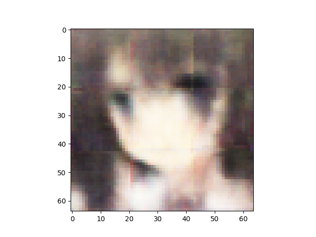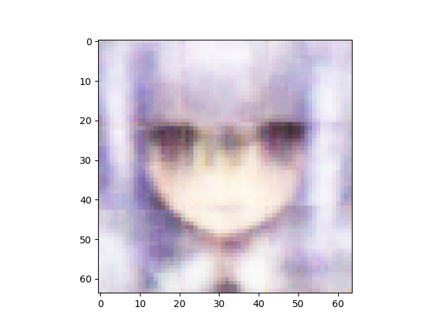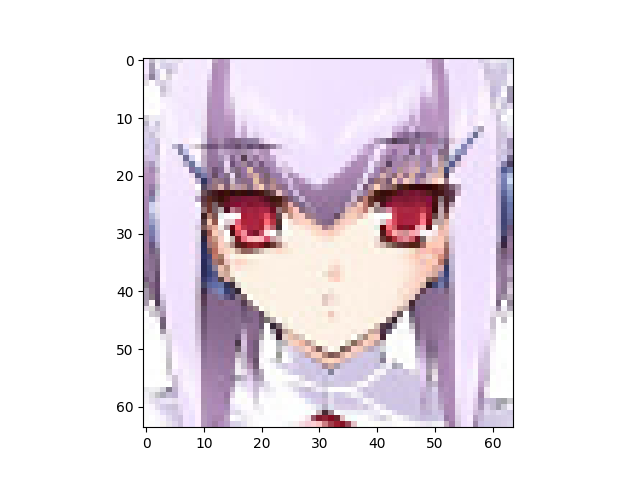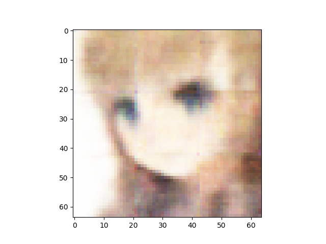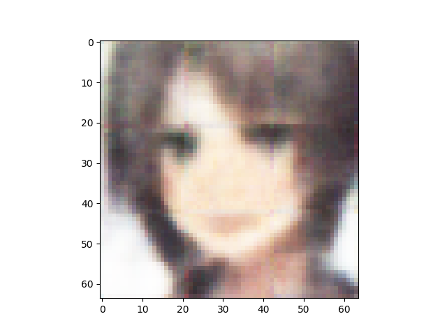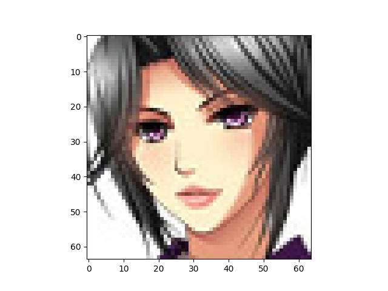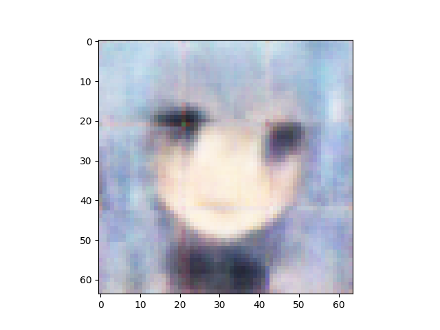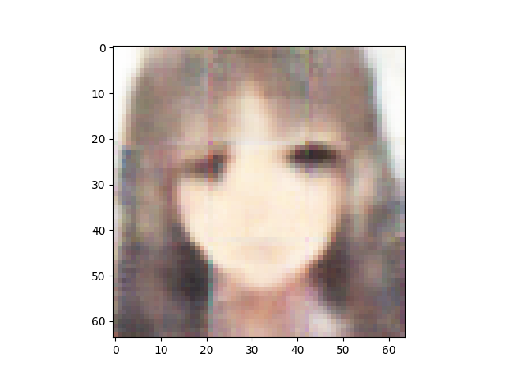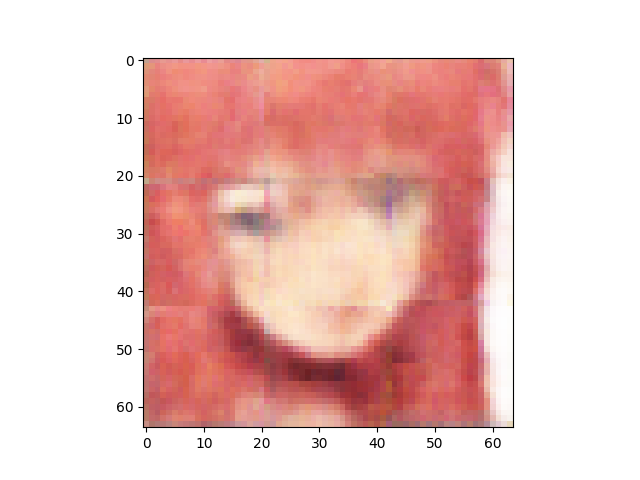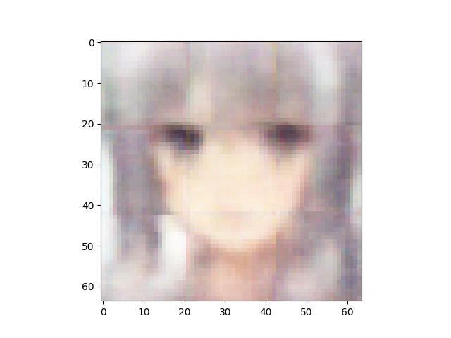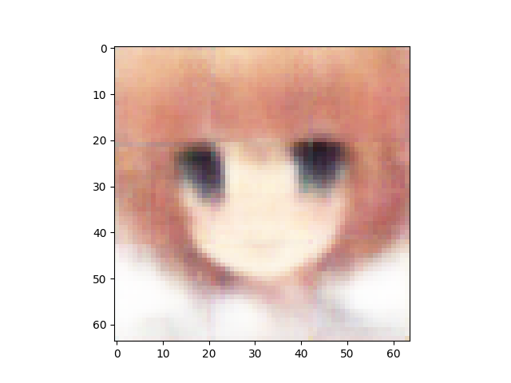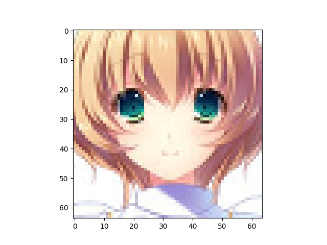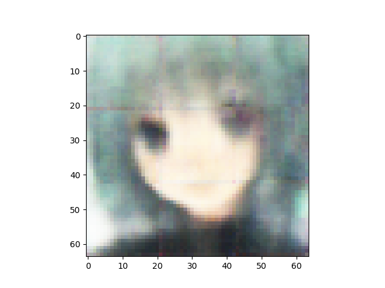