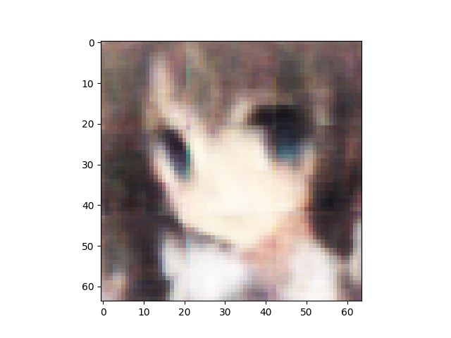
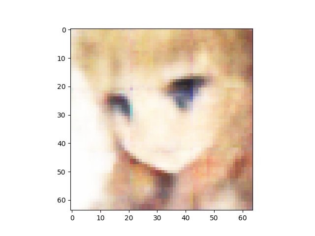
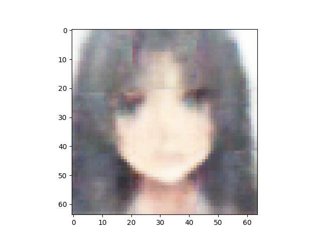
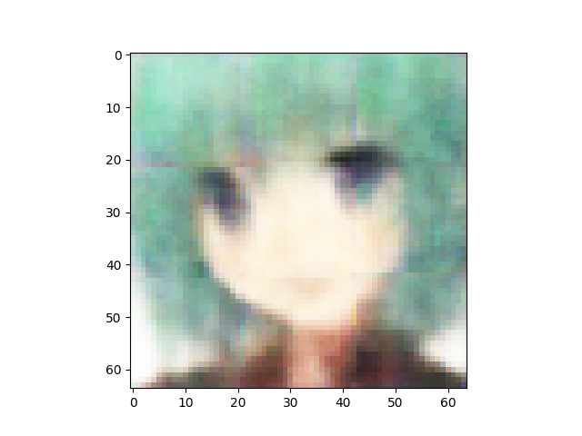

Number of latent variables 	512

Number of base channels 	32

Number of epochs trained 	200

Epoch0, Training loss 7158.0312500000, Time used 11.31

Epoch1, Training loss 6809.3159179688, Time used 9.70

Epoch2, Training loss 6741.0444335938, Time used 9.66

Epoch3, Training loss 6706.4370117188, Time used 9.69

Epoch4, Training loss 6687.8540039062, Time used 9.82

Epoch5, Training loss 6673.7192382812, Time used 9.77

Epoch6, Training loss 6662.7519531250, Time used 9.65

Epoch7, Training loss 6655.6469726562, Time used 9.68

Epoch8, Training loss 6649.3632812500, Time used 9.67

Epoch9, Training loss 6641.8359375000, Time used 9.65

Epoch10, Training loss 6635.1479492188, Time used 9.67

Epoch11, Training loss 6629.8779296875, Time used 9.66

Epoch12, Training loss 6624.4741210938, Time used 9.66

Epoch13, Training loss 6623.6103515625, Time used 9.67

Epoch14, Training loss 6616.0146484375, Time used 9.67

Epoch15, Training loss 6615.7529296875, Time used 9.67

Epoch16, Training loss 6611.9916992188, Time used 9.66

Epoch17, Training loss 6607.7490234375, Time used 9.66

Epoch18, Training loss 6603.8378906250, Time used 9.67

Epoch19, Training loss 6602.0185546875, Time used 9.64

Epoch20, Training loss 6600.6293945312, Time used 9.65

Epoch21, Training loss 6596.1269531250, Time used 9.77

Epoch22, Training loss 6595.3852539062, Time used 9.80

Epoch23, Training loss 6592.5644531250, Time used 9.66

Epoch24, Training loss 6588.9208984375, Time used 9.67

Epoch25, Training loss 6588.8120117188, Time used 9.65

Epoch26, Training loss 6587.3149414062, Time used 9.65

Epoch27, Training loss 6583.9453125000, Time used 9.65

Epoch28, Training loss 6584.3520507812, Time used 9.81

Epoch29, Training loss 6582.1352539062, Time used 9.69

Epoch30, Training loss 6579.4443359375, Time used 9.65

Epoch31, Training loss 6577.6655273438, Time used 9.64

Epoch32, Training loss 6574.9272460938, Time used 9.63

Epoch33, Training loss 6572.9150390625, Time used 9.65

Epoch34, Training loss 6571.5122070312, Time used 9.65

Epoch35, Training loss 6572.7812500000, Time used 9.64

Epoch36, Training loss 6571.3720703125, Time used 9.66

Epoch37, Training loss 6569.9316406250, Time used 9.66

Epoch38, Training loss 6568.2045898438, Time used 9.64

Epoch39, Training loss 6565.0009765625, Time used 9.65

Epoch40, Training loss 6564.3627929688, Time used 9.68

Epoch41, Training loss 6564.6137695312, Time used 9.83

Epoch42, Training loss 6563.1850585938, Time used 9.72

Epoch43, Training loss 6562.3818359375, Time used 9.66

Epoch44, Training loss 6562.4316406250, Time used 9.65

Epoch45, Training loss 6559.4775390625, Time used 9.66

Epoch46, Training loss 6558.5424804688, Time used 9.65

Epoch47, Training loss 6557.7954101562, Time used 9.66

Epoch48, Training loss 6556.2758789062, Time used 9.65

Epoch49, Training loss 6555.2812500000, Time used 9.67

Epoch50, Training loss 6553.8808593750, Time used 9.66

Epoch51, Training loss 6553.4658203125, Time used 9.66

Epoch52, Training loss 6551.7583007812, Time used 9.78

Epoch53, Training loss 6552.5703125000, Time used 9.70

Epoch54, Training loss 6550.6909179688, Time used 9.65

Epoch55, Training loss 6551.1103515625, Time used 9.66

Epoch56, Training loss 6549.4746093750, Time used 9.68

Epoch57, Training loss 6548.9877929688, Time used 9.64

Epoch58, Training loss 6548.6083984375, Time used 9.67

Epoch59, Training loss 6546.6596679688, Time used 9.72

Epoch60, Training loss 6546.8725585938, Time used 9.65

Epoch61, Training loss 6547.0952148438, Time used 9.67

Epoch62, Training loss 6546.9042968750, Time used 9.66

Epoch63, Training loss 6544.6748046875, Time used 9.65

Epoch64, Training loss 6543.8188476562, Time used 9.67

Epoch65, Training loss 6544.6416015625, Time used 9.82

Epoch66, Training loss 6543.2011718750, Time used 9.82

Epoch67, Training loss 6540.3706054688, Time used 9.66

Epoch68, Training loss 6541.4833984375, Time used 9.66

Epoch69, Training loss 6540.8242187500, Time used 9.68

Epoch70, Training loss 6540.0576171875, Time used 9.65

Epoch71, Training loss 6539.0712890625, Time used 9.65

Epoch72, Training loss 6538.7016601562, Time used 9.72

Epoch73, Training loss 6538.2827148438, Time used 9.79

Epoch74, Training loss 6538.0434570312, Time used 9.81

Epoch75, Training loss 6536.8676757812, Time used 9.85

Epoch76, Training loss 6535.0917968750, Time used 9.85

Epoch77, Training loss 6537.0610351562, Time used 9.81

Epoch78, Training loss 6533.7934570312, Time used 9.78

Epoch79, Training loss 6535.4492187500, Time used 9.65

Epoch80, Training loss 6535.0375976562, Time used 9.66

Epoch81, Training loss 6534.7739257812, Time used 9.67

Epoch82, Training loss 6533.7812500000, Time used 9.66

Epoch83, Training loss 6533.2812500000, Time used 9.66

Epoch84, Training loss 6532.9204101562, Time used 9.66

Epoch85, Training loss 6531.7119140625, Time used 9.65

Epoch86, Training loss 6532.4096679688, Time used 9.65

Epoch87, Training loss 6530.3359375000, Time used 9.65

Epoch88, Training loss 6530.2084960938, Time used 9.65

Epoch89, Training loss 6529.7861328125, Time used 9.65

Epoch90, Training loss 6528.9926757812, Time used 9.68

Epoch91, Training loss 6530.1372070312, Time used 9.66

Epoch92, Training loss 6528.5229492188, Time used 9.81

Epoch93, Training loss 6528.8618164062, Time used 9.77

Epoch94, Training loss 6527.8813476562, Time used 9.75

Epoch95, Training loss 6528.1123046875, Time used 9.71

Epoch96, Training loss 6526.6093750000, Time used 9.70

Epoch97, Training loss 6526.6713867188, Time used 9.66

Epoch98, Training loss 6526.2880859375, Time used 9.67

Epoch99, Training loss 6524.9956054688, Time used 9.65

Epoch100, Training loss 6524.7729492188, Time used 9.66

Epoch101, Training loss 6526.5502929688, Time used 9.66

Epoch102, Training loss 6523.6474609375, Time used 9.65

Epoch103, Training loss 6525.1025390625, Time used 9.78

Epoch104, Training loss 6523.3515625000, Time used 9.67

Epoch105, Training loss 6523.5673828125, Time used 9.64

Epoch106, Training loss 6523.9458007812, Time used 9.66

Epoch107, Training loss 6522.6137695312, Time used 9.65

Epoch108, Training loss 6520.9208984375, Time used 9.65

Epoch109, Training loss 6521.3378906250, Time used 9.65

Epoch110, Training loss 6521.2739257812, Time used 9.66

Epoch111, Training loss 6520.6562500000, Time used 9.66

Epoch112, Training loss 6521.7216796875, Time used 9.65

Epoch113, Training loss 6519.7089843750, Time used 9.73

Epoch114, Training loss 6521.7807617188, Time used 9.71

Epoch115, Training loss 6519.6826171875, Time used 9.76

Epoch116, Training loss 6518.8574218750, Time used 9.71

Epoch117, Training loss 6519.3232421875, Time used 9.66

Epoch118, Training loss 6520.1625976562, Time used 9.64

Epoch119, Training loss 6518.3442382812, Time used 9.65

Epoch120, Training loss 6517.5791015625, Time used 9.65

Epoch121, Training loss 6517.2431640625, Time used 9.66

Epoch122, Training loss 6517.8125000000, Time used 9.80

Epoch123, Training loss 6516.7812500000, Time used 9.82

Epoch124, Training loss 6517.8872070312, Time used 9.82

Epoch125, Training loss 6516.1562500000, Time used 9.80

Epoch126, Training loss 6515.7407226562, Time used 9.81

Epoch127, Training loss 6515.3334960938, Time used 9.79

Epoch128, Training loss 6514.2705078125, Time used 9.80

Epoch129, Training loss 6514.5307617188, Time used 9.79

Epoch130, Training loss 6515.8417968750, Time used 9.66

Epoch131, Training loss 6515.0458984375, Time used 9.65

Epoch132, Training loss 6512.9877929688, Time used 9.65

Epoch133, Training loss 6513.1625976562, Time used 9.71

Epoch134, Training loss 6513.0810546875, Time used 9.84

Epoch135, Training loss 6513.5053710938, Time used 9.84

Epoch136, Training loss 6512.9824218750, Time used 9.86

Epoch137, Training loss 6513.0195312500, Time used 9.85

Epoch138, Training loss 6513.3886718750, Time used 9.84

Epoch139, Training loss 6512.0908203125, Time used 9.85

Epoch140, Training loss 6510.6376953125, Time used 9.68

Epoch141, Training loss 6511.2187500000, Time used 9.66

Epoch142, Training loss 6510.6591796875, Time used 9.66

Epoch143, Training loss 6511.9145507812, Time used 9.64

Epoch144, Training loss 6510.5590820312, Time used 9.65

Epoch145, Training loss 6511.4243164062, Time used 9.66

Epoch146, Training loss 6509.2998046875, Time used 9.65

Epoch147, Training loss 6508.4370117188, Time used 9.65

Epoch148, Training loss 6508.5952148438, Time used 9.66

Epoch149, Training loss 6509.6127929688, Time used 9.69

Epoch150, Training loss 6508.5195312500, Time used 9.68

Epoch151, Training loss 6508.3730468750, Time used 9.65

Epoch152, Training loss 6508.1401367188, Time used 9.78

Epoch153, Training loss 6507.7695312500, Time used 9.65

Epoch154, Training loss 6506.3886718750, Time used 9.67

Epoch155, Training loss 6507.3066406250, Time used 9.66

Epoch156, Training loss 6507.2368164062, Time used 9.65

Epoch157, Training loss 6507.8676757812, Time used 9.66

Epoch158, Training loss 6505.0600585938, Time used 9.65

Epoch159, Training loss 6506.6850585938, Time used 9.66

Epoch160, Training loss 6506.8232421875, Time used 9.67

Epoch161, Training loss 6506.5009765625, Time used 9.80

Epoch162, Training loss 6505.1508789062, Time used 9.81

Epoch163, Training loss 6505.4726562500, Time used 9.80

Epoch164, Training loss 6504.9848632812, Time used 9.81

Epoch165, Training loss 6504.1230468750, Time used 9.82

Epoch166, Training loss 6504.8408203125, Time used 9.82

Epoch167, Training loss 6504.7285156250, Time used 9.82

Epoch168, Training loss 6503.0131835938, Time used 9.82

Epoch169, Training loss 6502.2944335938, Time used 9.75

Epoch170, Training loss 6503.7880859375, Time used 9.77

Epoch171, Training loss 6503.0727539062, Time used 9.74

Epoch172, Training loss 6502.8769531250, Time used 9.66

Epoch173, Training loss 6502.5078125000, Time used 9.67

Epoch174, Training loss 6503.1962890625, Time used 9.66

Epoch175, Training loss 6502.5991210938, Time used 9.65

Epoch176, Training loss 6502.2543945312, Time used 9.65

Epoch177, Training loss 6501.2602539062, Time used 9.65

Epoch178, Training loss 6502.3251953125, Time used 9.65

Epoch179, Training loss 6502.9233398438, Time used 9.65

Epoch180, Training loss 6502.5405273438, Time used 9.65

Epoch181, Training loss 6500.1748046875, Time used 9.66

Epoch182, Training loss 6500.8842773438, Time used 9.65

Epoch183, Training loss 6501.1435546875, Time used 9.66

Epoch184, Training loss 6499.7812500000, Time used 9.65

Epoch185, Training loss 6499.2358398438, Time used 9.66

Epoch186, Training loss 6500.5268554688, Time used 9.65

Epoch187, Training loss 6499.5117187500, Time used 9.65

Epoch188, Training loss 6500.2460937500, Time used 9.65

Epoch189, Training loss 6498.2490234375, Time used 9.77

Epoch190, Training loss 6499.5639648438, Time used 9.78

Epoch191, Training loss 6499.9375000000, Time used 9.85

Epoch192, Training loss 6499.6201171875, Time used 9.83

Epoch193, Training loss 6499.2695312500, Time used 9.81

Epoch194, Training loss 6499.0805664062, Time used 9.65

Epoch195, Training loss 6498.7490234375, Time used 9.65

Epoch196, Training loss 6499.8828125000, Time used 9.65

Epoch197, Training loss 6498.0078125000, Time used 9.65

Epoch198, Training loss 6498.0585937500, Time used 9.64

Epoch199, Training loss 6497.9150390625, Time used 9.65

