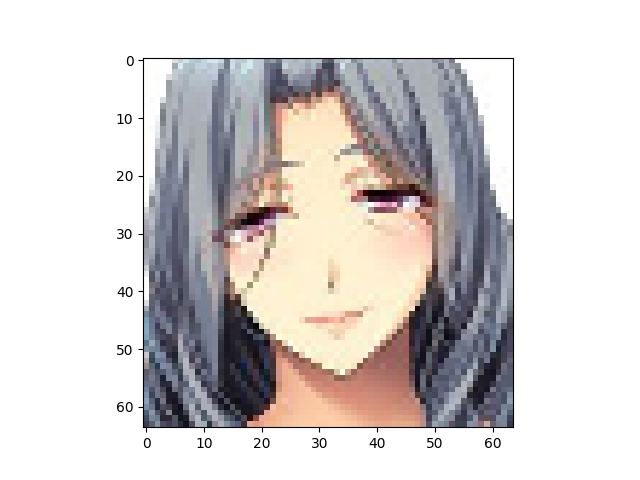

Number of latent variables 	512

Number of base channels 	32

Number of epochs trained 	200

Epoch0, Training loss 7201.2978515625, Time used 53.74

Epoch1, Training loss 6818.4350585938, Time used 55.33

Epoch2, Training loss 6740.5312500000, Time used 57.93

Epoch3, Training loss 6708.3945312500, Time used 58.72

Epoch4, Training loss 6687.6660156250, Time used 60.52

Epoch5, Training loss 6672.6108398438, Time used 61.58

Epoch6, Training loss 6664.0112304688, Time used 61.61

Epoch7, Training loss 6654.2832031250, Time used 63.40

Epoch8, Training loss 6646.6748046875, Time used 66.83

Epoch9, Training loss 6640.1376953125, Time used 74.62

Epoch10, Training loss 6634.9150390625, Time used 73.62

Epoch11, Training loss 6629.7500000000, Time used 57.69

Epoch12, Training loss 6623.9565429688, Time used 57.99

Epoch13, Training loss 6620.1435546875, Time used 60.65

Epoch14, Training loss 6617.3535156250, Time used 63.43

Epoch15, Training loss 6612.9047851562, Time used 63.04

Epoch16, Training loss 6611.7128906250, Time used 62.55

Epoch17, Training loss 6607.6831054688, Time used 64.98

Epoch18, Training loss 6604.1098632812, Time used 63.19

Epoch19, Training loss 6602.3735351562, Time used 69.03

Epoch20, Training loss 6599.1635742188, Time used 76.60

Epoch21, Training loss 6595.8623046875, Time used 60.48

Epoch22, Training loss 6592.3842773438, Time used 57.60

Epoch23, Training loss 6593.5307617188, Time used 59.56

Epoch24, Training loss 6588.3823242188, Time used 59.36

Epoch25, Training loss 6587.7343750000, Time used 61.38

Epoch26, Training loss 6586.2626953125, Time used 62.19

Epoch27, Training loss 6584.3261718750, Time used 62.16

Epoch28, Training loss 6581.4482421875, Time used 62.25

Epoch29, Training loss 6582.2158203125, Time used 61.33

Epoch30, Training loss 6578.9086914062, Time used 62.35

Epoch31, Training loss 6577.1108398438, Time used 63.17

Epoch32, Training loss 6576.5380859375, Time used 76.45

Epoch33, Training loss 6573.8437500000, Time used 75.68

Epoch34, Training loss 6573.6298828125, Time used 57.78

Epoch35, Training loss 6571.2812500000, Time used 58.52

Epoch36, Training loss 6570.3266601562, Time used 56.02

Epoch37, Training loss 6568.7280273438, Time used 55.38

Epoch38, Training loss 6569.2841796875, Time used 55.56

Epoch39, Training loss 6564.9165039062, Time used 55.72

Epoch40, Training loss 6566.3979492188, Time used 57.75

Epoch41, Training loss 6563.3002929688, Time used 57.52

Epoch42, Training loss 6561.1611328125, Time used 59.74

Epoch43, Training loss 6561.2734375000, Time used 58.77

Epoch44, Training loss 6560.6752929688, Time used 58.79

Epoch45, Training loss 6558.5424804688, Time used 59.72

Epoch46, Training loss 6559.4311523438, Time used 59.73

Epoch47, Training loss 6560.0908203125, Time used 60.78

Epoch48, Training loss 6557.2338867188, Time used 71.27

Epoch49, Training loss 6556.5888671875, Time used 73.04

Epoch50, Training loss 6555.2861328125, Time used 73.20

Epoch51, Training loss 6555.0444335938, Time used 73.04

Epoch52, Training loss 6553.7036132812, Time used 73.36

Epoch53, Training loss 6551.6499023438, Time used 73.12

Epoch54, Training loss 6551.5556640625, Time used 73.12

Epoch55, Training loss 6549.5019531250, Time used 73.42

Epoch56, Training loss 6550.7392578125, Time used 73.14

Epoch57, Training loss 6549.8354492188, Time used 73.22

Epoch58, Training loss 6547.9897460938, Time used 73.10

Epoch59, Training loss 6547.4418945312, Time used 73.06

Epoch60, Training loss 6546.1782226562, Time used 73.10

Epoch61, Training loss 6545.4702148438, Time used 73.12

Epoch62, Training loss 6545.6557617188, Time used 73.38

Epoch63, Training loss 6542.8798828125, Time used 73.20

Epoch64, Training loss 6544.6806640625, Time used 73.26

Epoch65, Training loss 6542.9111328125, Time used 73.25

Epoch66, Training loss 6543.2822265625, Time used 73.20

Epoch67, Training loss 6542.2358398438, Time used 73.18

Epoch68, Training loss 6542.6293945312, Time used 73.27

Epoch69, Training loss 6540.3120117188, Time used 73.17

Epoch70, Training loss 6539.5351562500, Time used 73.29

Epoch71, Training loss 6540.1621093750, Time used 73.21

Epoch72, Training loss 6539.3720703125, Time used 73.19

Epoch73, Training loss 6538.6250000000, Time used 73.33

Epoch74, Training loss 6537.5288085938, Time used 73.49

Epoch75, Training loss 6536.6328125000, Time used 73.29

Epoch76, Training loss 6536.2055664062, Time used 73.15

Epoch77, Training loss 6535.4868164062, Time used 73.12

Epoch78, Training loss 6534.6450195312, Time used 62.64

Epoch79, Training loss 6535.3999023438, Time used 54.46

Epoch80, Training loss 6535.0927734375, Time used 57.12

Epoch81, Training loss 6533.4521484375, Time used 55.39

Epoch82, Training loss 6533.8212890625, Time used 55.49

Epoch83, Training loss 6532.4018554688, Time used 57.45

Epoch84, Training loss 6532.9804687500, Time used 57.73

Epoch85, Training loss 6531.8369140625, Time used 57.72

Epoch86, Training loss 6530.4208984375, Time used 64.37

Epoch87, Training loss 6531.5307617188, Time used 67.11

Epoch88, Training loss 6530.3793945312, Time used 55.44

Epoch89, Training loss 6528.8964843750, Time used 55.43

Epoch90, Training loss 6529.3808593750, Time used 56.58

Epoch91, Training loss 6528.7397460938, Time used 55.42

Epoch92, Training loss 6528.0693359375, Time used 64.18

Epoch93, Training loss 6527.5673828125, Time used 57.82

Epoch94, Training loss 6527.2236328125, Time used 56.93

Epoch95, Training loss 6527.4482421875, Time used 57.55

Epoch96, Training loss 6526.6103515625, Time used 57.95

Epoch97, Training loss 6527.1118164062, Time used 57.85

Epoch98, Training loss 6526.7016601562, Time used 57.39

Epoch99, Training loss 6524.0815429688, Time used 58.87

Epoch100, Training loss 6525.9370117188, Time used 58.57

Epoch101, Training loss 6525.5683593750, Time used 71.22

Epoch102, Training loss 6524.2622070312, Time used 71.89

Epoch103, Training loss 6523.7236328125, Time used 53.77

Epoch104, Training loss 6523.3149414062, Time used 52.80

Epoch105, Training loss 6523.8608398438, Time used 55.23

Epoch106, Training loss 6522.6347656250, Time used 57.25

Epoch107, Training loss 6522.2382812500, Time used 55.18

Epoch108, Training loss 6521.7705078125, Time used 57.16

Epoch109, Training loss 6521.7900390625, Time used 57.75

Epoch110, Training loss 6520.3940429688, Time used 56.25

Epoch111, Training loss 6520.7729492188, Time used 56.28

Epoch112, Training loss 6520.3344726562, Time used 58.44

Epoch113, Training loss 6519.9794921875, Time used 56.28

Epoch114, Training loss 6520.2929687500, Time used 55.79

Epoch115, Training loss 6520.2006835938, Time used 56.09

Epoch116, Training loss 6517.2353515625, Time used 59.13

Epoch117, Training loss 6518.3212890625, Time used 56.86

Epoch118, Training loss 6517.9091796875, Time used 55.30

Epoch119, Training loss 6518.3037109375, Time used 56.41

Epoch120, Training loss 6517.2822265625, Time used 55.75

Epoch121, Training loss 6517.7983398438, Time used 55.67

Epoch122, Training loss 6515.5327148438, Time used 55.87

Epoch123, Training loss 6516.7368164062, Time used 56.60

Epoch124, Training loss 6516.6899414062, Time used 57.72

Epoch125, Training loss 6517.1298828125, Time used 55.41

Epoch126, Training loss 6516.0463867188, Time used 56.44

Epoch127, Training loss 6513.7392578125, Time used 57.34

Epoch128, Training loss 6516.0415039062, Time used 58.36

Epoch129, Training loss 6514.5351562500, Time used 54.67

Epoch130, Training loss 6515.3706054688, Time used 54.28

Epoch131, Training loss 6515.4331054688, Time used 68.95

Epoch132, Training loss 6512.9438476562, Time used 55.76

Epoch133, Training loss 6513.4418945312, Time used 55.59

Epoch134, Training loss 6514.1142578125, Time used 56.52

Epoch135, Training loss 6514.0917968750, Time used 56.91

Epoch136, Training loss 6513.4174804688, Time used 57.16

Epoch137, Training loss 6513.0576171875, Time used 59.58

Epoch138, Training loss 6512.6499023438, Time used 57.52

Epoch139, Training loss 6511.3598632812, Time used 57.33

Epoch140, Training loss 6512.2480468750, Time used 57.34

Epoch141, Training loss 6509.5786132812, Time used 56.76

Epoch142, Training loss 6510.6821289062, Time used 56.71

Epoch143, Training loss 6511.1059570312, Time used 54.74

Epoch144, Training loss 6512.1352539062, Time used 55.18

Epoch145, Training loss 6511.3452148438, Time used 56.30

Epoch146, Training loss 6509.8017578125, Time used 56.16

Epoch147, Training loss 6509.1196289062, Time used 56.16

Epoch148, Training loss 6508.8500976562, Time used 57.20

Epoch149, Training loss 6509.1025390625, Time used 55.30

Epoch150, Training loss 6509.3481445312, Time used 56.67

Epoch151, Training loss 6508.4804687500, Time used 54.79

Epoch152, Training loss 6507.8066406250, Time used 55.69

Epoch153, Training loss 6510.1596679688, Time used 56.18

Epoch154, Training loss 6506.9443359375, Time used 55.33

Epoch155, Training loss 6507.9018554688, Time used 55.97

Epoch156, Training loss 6507.1621093750, Time used 55.86

Epoch157, Training loss 6507.2714843750, Time used 56.63

Epoch158, Training loss 6506.3974609375, Time used 57.13

Epoch159, Training loss 6507.3618164062, Time used 55.61

Epoch160, Training loss 6507.1757812500, Time used 54.97

Epoch161, Training loss 6505.8481445312, Time used 57.90

Epoch162, Training loss 6505.7187500000, Time used 55.12

Epoch163, Training loss 6506.8559570312, Time used 53.30

Epoch164, Training loss 6507.1020507812, Time used 55.14

Epoch165, Training loss 6506.0673828125, Time used 52.82

Epoch166, Training loss 6506.1704101562, Time used 55.95

Epoch167, Training loss 6504.6606445312, Time used 56.04

Epoch168, Training loss 6504.8095703125, Time used 54.09

Epoch169, Training loss 6503.1816406250, Time used 55.31

Epoch170, Training loss 6504.2084960938, Time used 55.21

Epoch171, Training loss 6504.3652343750, Time used 56.33

Epoch172, Training loss 6502.9047851562, Time used 57.72

Epoch173, Training loss 6503.5722656250, Time used 56.26

Epoch174, Training loss 6504.1904296875, Time used 55.22

Epoch175, Training loss 6504.1215820312, Time used 54.40

Epoch176, Training loss 6503.0278320312, Time used 55.80

Epoch177, Training loss 6502.8906250000, Time used 56.30

Epoch178, Training loss 6502.0576171875, Time used 53.58

Epoch179, Training loss 6502.7221679688, Time used 55.83

Epoch180, Training loss 6503.1435546875, Time used 55.11

Epoch181, Training loss 6503.0102539062, Time used 55.63

Epoch182, Training loss 6502.2734375000, Time used 55.16

Epoch183, Training loss 6502.3872070312, Time used 57.30

Epoch184, Training loss 6501.1982421875, Time used 57.51

Epoch185, Training loss 6502.8706054688, Time used 56.72

Epoch186, Training loss 6502.6240234375, Time used 56.13

Epoch187, Training loss 6501.4013671875, Time used 55.35

Epoch188, Training loss 6501.0205078125, Time used 55.61

Epoch189, Training loss 6500.4482421875, Time used 54.21

Epoch190, Training loss 6500.1254882812, Time used 57.21

Epoch191, Training loss 6499.4282226562, Time used 54.77

Epoch192, Training loss 6500.9726562500, Time used 54.71

Epoch193, Training loss 6499.9130859375, Time used 54.79

Epoch194, Training loss 6499.6201171875, Time used 55.54

Epoch195, Training loss 6499.1943359375, Time used 57.14

Epoch196, Training loss 6500.1196289062, Time used 55.34

Epoch197, Training loss 6499.8222656250, Time used 55.51

Epoch198, Training loss 6499.5639648438, Time used 54.26

Epoch199, Training loss 6498.8017578125, Time used 56.13

