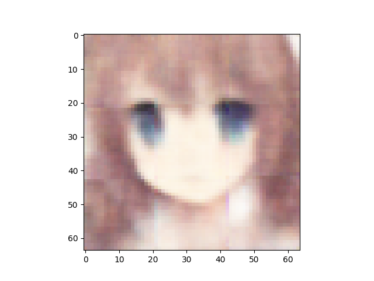
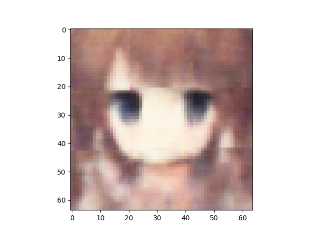
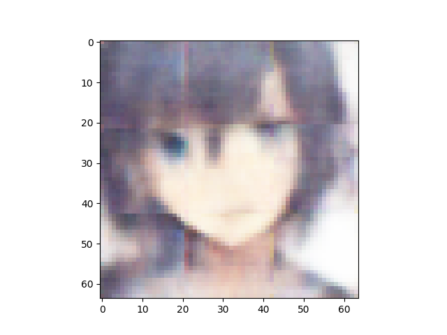
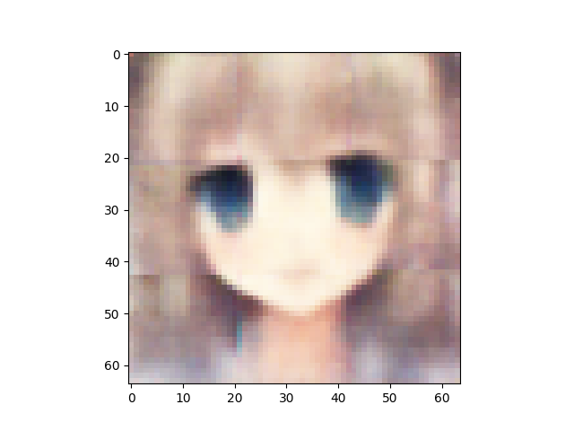
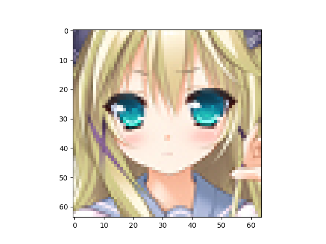

Number of latent variables 	512

Number of base channels 	32

Number of epochs trained 	200

Epoch0, Training loss 7157.4370117188, Time used 12.11

Epoch1, Training loss 6812.0473632812, Time used 9.86

Epoch2, Training loss 6743.8325195312, Time used 9.90

Epoch3, Training loss 6710.4755859375, Time used 9.90

Epoch4, Training loss 6692.8852539062, Time used 9.90

Epoch5, Training loss 6676.1601562500, Time used 9.89

Epoch6, Training loss 6665.5668945312, Time used 9.87

Epoch7, Training loss 6658.3779296875, Time used 9.81

Epoch8, Training loss 6650.3393554688, Time used 9.79

Epoch9, Training loss 6642.0996093750, Time used 9.89

Epoch10, Training loss 6639.2822265625, Time used 9.95

Epoch11, Training loss 6633.2060546875, Time used 9.76

Epoch12, Training loss 6629.2905273438, Time used 9.85

Epoch13, Training loss 6623.9316406250, Time used 9.85

Epoch14, Training loss 6620.8007812500, Time used 9.92

Epoch15, Training loss 6616.7749023438, Time used 9.89

Epoch16, Training loss 6614.9277343750, Time used 9.93

Epoch17, Training loss 6608.4306640625, Time used 9.93

Epoch18, Training loss 6607.6625976562, Time used 9.94

Epoch19, Training loss 6605.2797851562, Time used 9.93

Epoch20, Training loss 6603.0693359375, Time used 9.93

Epoch21, Training loss 6599.6435546875, Time used 9.93

Epoch22, Training loss 6599.1132812500, Time used 9.93

Epoch23, Training loss 6595.0214843750, Time used 9.93

Epoch24, Training loss 6593.4663085938, Time used 9.93

Epoch25, Training loss 6591.3237304688, Time used 9.93

Epoch26, Training loss 6588.6455078125, Time used 9.94

Epoch27, Training loss 6589.2211914062, Time used 9.94

Epoch28, Training loss 6586.6025390625, Time used 9.94

Epoch29, Training loss 6584.8964843750, Time used 9.94

Epoch30, Training loss 6581.6943359375, Time used 9.93

Epoch31, Training loss 6581.5825195312, Time used 9.93

Epoch32, Training loss 6579.0644531250, Time used 9.95

Epoch33, Training loss 6577.5976562500, Time used 9.94

Epoch34, Training loss 6575.1865234375, Time used 9.94

Epoch35, Training loss 6575.5961914062, Time used 9.93

Epoch36, Training loss 6573.5175781250, Time used 9.93

Epoch37, Training loss 6572.4707031250, Time used 9.91

Epoch38, Training loss 6573.0971679688, Time used 9.91

Epoch39, Training loss 6569.5166015625, Time used 9.90

Epoch40, Training loss 6567.6523437500, Time used 9.91

Epoch41, Training loss 6566.2109375000, Time used 9.90

Epoch42, Training loss 6565.3896484375, Time used 9.91

Epoch43, Training loss 6564.6865234375, Time used 9.91

Epoch44, Training loss 6563.9399414062, Time used 9.91

Epoch45, Training loss 6562.5390625000, Time used 9.92

Epoch46, Training loss 6563.4204101562, Time used 9.93

Epoch47, Training loss 6561.0590820312, Time used 9.93

Epoch48, Training loss 6559.7011718750, Time used 9.93

Epoch49, Training loss 6557.7553710938, Time used 9.93

Epoch50, Training loss 6558.1054687500, Time used 9.93

Epoch51, Training loss 6559.0703125000, Time used 9.93

Epoch52, Training loss 6556.4887695312, Time used 9.93

Epoch53, Training loss 6554.0068359375, Time used 9.84

Epoch54, Training loss 6554.6777343750, Time used 9.88

Epoch55, Training loss 6553.8647460938, Time used 9.91

Epoch56, Training loss 6552.7353515625, Time used 9.92

Epoch57, Training loss 6550.8652343750, Time used 9.92

Epoch58, Training loss 6551.8452148438, Time used 9.92

Epoch59, Training loss 6550.7353515625, Time used 9.92

Epoch60, Training loss 6548.3232421875, Time used 9.92

Epoch61, Training loss 6548.6035156250, Time used 9.91

Epoch62, Training loss 6548.7714843750, Time used 9.92

Epoch63, Training loss 6548.6884765625, Time used 9.92

Epoch64, Training loss 6547.4980468750, Time used 9.92

Epoch65, Training loss 6546.3798828125, Time used 9.94

Epoch66, Training loss 6546.5981445312, Time used 9.91

Epoch67, Training loss 6543.9985351562, Time used 9.92

Epoch68, Training loss 6544.1279296875, Time used 9.92

Epoch69, Training loss 6543.8041992188, Time used 9.86

Epoch70, Training loss 6544.0400390625, Time used 9.86

Epoch71, Training loss 6542.6259765625, Time used 9.92

Epoch72, Training loss 6542.4062500000, Time used 9.94

Epoch73, Training loss 6542.1748046875, Time used 9.84

Epoch74, Training loss 6540.7856445312, Time used 9.81

Epoch75, Training loss 6541.5756835938, Time used 9.90

Epoch76, Training loss 6538.8100585938, Time used 9.94

Epoch77, Training loss 6538.0576171875, Time used 9.93

Epoch78, Training loss 6538.7993164062, Time used 9.93

Epoch79, Training loss 6538.4169921875, Time used 9.93

Epoch80, Training loss 6537.2954101562, Time used 9.92

Epoch81, Training loss 6537.3388671875, Time used 9.81

Epoch82, Training loss 6536.9335937500, Time used 9.82

Epoch83, Training loss 6535.2910156250, Time used 9.92

Epoch84, Training loss 6535.8266601562, Time used 9.89

Epoch85, Training loss 6533.7783203125, Time used 9.84

Epoch86, Training loss 6536.1269531250, Time used 9.90

Epoch87, Training loss 6534.1572265625, Time used 9.88

Epoch88, Training loss 6533.1079101562, Time used 9.89

Epoch89, Training loss 6532.9047851562, Time used 9.91

Epoch90, Training loss 6531.7446289062, Time used 9.91

Epoch91, Training loss 6532.1918945312, Time used 9.93

Epoch92, Training loss 6531.7094726562, Time used 9.89

Epoch93, Training loss 6531.7583007812, Time used 9.94

Epoch94, Training loss 6532.0820312500, Time used 9.94

Epoch95, Training loss 6531.0410156250, Time used 9.93

Epoch96, Training loss 6530.3305664062, Time used 9.90

Epoch97, Training loss 6528.6752929688, Time used 9.88

Epoch98, Training loss 6528.5708007812, Time used 9.91

Epoch99, Training loss 6527.4731445312, Time used 9.76

Epoch100, Training loss 6527.2656250000, Time used 9.76

Epoch101, Training loss 6526.8076171875, Time used 9.86

Epoch102, Training loss 6525.7983398438, Time used 9.91

Epoch103, Training loss 6526.5971679688, Time used 9.88

Epoch104, Training loss 6524.9057617188, Time used 9.80

Epoch105, Training loss 6526.2690429688, Time used 9.81

Epoch106, Training loss 6526.2910156250, Time used 9.88

Epoch107, Training loss 6525.7563476562, Time used 9.89

Epoch108, Training loss 6523.9531250000, Time used 9.90

Epoch109, Training loss 6524.5551757812, Time used 9.89

Epoch110, Training loss 6523.7739257812, Time used 9.76

Epoch111, Training loss 6523.6713867188, Time used 9.83

Epoch112, Training loss 6523.3325195312, Time used 9.77

Epoch113, Training loss 6522.9970703125, Time used 9.89

Epoch114, Training loss 6523.3046875000, Time used 9.89

Epoch115, Training loss 6524.1557617188, Time used 9.89

Epoch116, Training loss 6521.0239257812, Time used 9.87

Epoch117, Training loss 6521.7099609375, Time used 9.79

Epoch118, Training loss 6521.2500000000, Time used 9.80

Epoch119, Training loss 6520.7304687500, Time used 9.87

Epoch120, Training loss 6521.2934570312, Time used 9.95

Epoch121, Training loss 6519.7656250000, Time used 9.92

Epoch122, Training loss 6519.3779296875, Time used 9.92

Epoch123, Training loss 6519.3852539062, Time used 9.94

Epoch124, Training loss 6519.1928710938, Time used 9.91

Epoch125, Training loss 6519.5126953125, Time used 9.89

Epoch126, Training loss 6518.7333984375, Time used 9.89

Epoch127, Training loss 6517.5102539062, Time used 9.95

Epoch128, Training loss 6518.2138671875, Time used 9.97

Epoch129, Training loss 6518.4951171875, Time used 9.95

Epoch130, Training loss 6518.1831054688, Time used 9.95

Epoch131, Training loss 6516.1083984375, Time used 9.94

Epoch132, Training loss 6516.4926757812, Time used 9.94

Epoch133, Training loss 6517.4721679688, Time used 9.95

Epoch134, Training loss 6515.1293945312, Time used 9.95

Epoch135, Training loss 6515.9658203125, Time used 9.93

Epoch136, Training loss 6514.0029296875, Time used 9.81

Epoch137, Training loss 6515.5097656250, Time used 9.88

Epoch138, Training loss 6514.7065429688, Time used 9.91

Epoch139, Training loss 6515.4755859375, Time used 9.79

Epoch140, Training loss 6514.1630859375, Time used 9.85

Epoch141, Training loss 6513.9028320312, Time used 9.90

Epoch142, Training loss 6515.2573242188, Time used 9.87

Epoch143, Training loss 6512.8286132812, Time used 9.76

Epoch144, Training loss 6512.5214843750, Time used 9.78

Epoch145, Training loss 6512.5493164062, Time used 9.83

Epoch146, Training loss 6512.0166015625, Time used 9.94

Epoch147, Training loss 6513.7709960938, Time used 9.93

Epoch148, Training loss 6512.4824218750, Time used 9.92

Epoch149, Training loss 6510.7534179688, Time used 9.92

Epoch150, Training loss 6511.2568359375, Time used 9.92

Epoch151, Training loss 6511.0351562500, Time used 9.90

Epoch152, Training loss 6512.1289062500, Time used 9.91

Epoch153, Training loss 6511.4692382812, Time used 9.91

Epoch154, Training loss 6510.8666992188, Time used 9.91

Epoch155, Training loss 6509.7148437500, Time used 9.91

Epoch156, Training loss 6510.6157226562, Time used 9.93

Epoch157, Training loss 6510.9609375000, Time used 9.93

Epoch158, Training loss 6509.7041015625, Time used 9.93

Epoch159, Training loss 6509.3110351562, Time used 9.93

Epoch160, Training loss 6508.2573242188, Time used 9.92

Epoch161, Training loss 6508.8115234375, Time used 9.93

Epoch162, Training loss 6508.1591796875, Time used 9.93

Epoch163, Training loss 6508.6376953125, Time used 9.93

Epoch164, Training loss 6508.1899414062, Time used 9.81

Epoch165, Training loss 6506.5732421875, Time used 9.89

Epoch166, Training loss 6507.2973632812, Time used 9.91

Epoch167, Training loss 6507.5454101562, Time used 9.89

Epoch168, Training loss 6507.3720703125, Time used 9.93

Epoch169, Training loss 6506.1015625000, Time used 9.93

Epoch170, Training loss 6505.7387695312, Time used 9.93

Epoch171, Training loss 6505.4155273438, Time used 9.94

Epoch172, Training loss 6506.5068359375, Time used 9.93

Epoch173, Training loss 6505.5546875000, Time used 9.79

Epoch174, Training loss 6506.4038085938, Time used 9.78

Epoch175, Training loss 6505.4892578125, Time used 9.76

Epoch176, Training loss 6504.0620117188, Time used 9.76

Epoch177, Training loss 6505.5922851562, Time used 9.91

Epoch178, Training loss 6504.4951171875, Time used 9.89

Epoch179, Training loss 6505.1010742188, Time used 9.89

Epoch180, Training loss 6503.5844726562, Time used 9.93

Epoch181, Training loss 6503.3725585938, Time used 9.93

Epoch182, Training loss 6503.9477539062, Time used 9.94

Epoch183, Training loss 6503.2851562500, Time used 9.93

Epoch184, Training loss 6502.5683593750, Time used 9.93

Epoch185, Training loss 6502.7851562500, Time used 9.92

Epoch186, Training loss 6503.4467773438, Time used 9.79

Epoch187, Training loss 6503.0361328125, Time used 9.93

Epoch188, Training loss 6502.2631835938, Time used 9.84

Epoch189, Training loss 6502.1083984375, Time used 9.88

Epoch190, Training loss 6503.5581054688, Time used 9.93

Epoch191, Training loss 6502.6406250000, Time used 9.93

Epoch192, Training loss 6503.0083007812, Time used 9.95

Epoch193, Training loss 6501.2758789062, Time used 9.92

Epoch194, Training loss 6500.5727539062, Time used 9.92

Epoch195, Training loss 6500.1665039062, Time used 9.90

Epoch196, Training loss 6502.8300781250, Time used 9.91

Epoch197, Training loss 6500.0473632812, Time used 9.90

Epoch198, Training loss 6500.0668945312, Time used 9.90

Epoch199, Training loss 6500.4370117188, Time used 9.91

