Number of latent variables 	5

Number of base channels 	32

Number of epochs trained 	100

Epoch0, Training loss 7440.0849609375, Time used 4.74

Epoch1, Training loss 7231.2153320312, Time used 5.48

Epoch2, Training loss 7167.6923828125, Time used 5.16

Epoch3, Training loss 7119.4257812500, Time used 4.94

Epoch4, Training loss 7087.3159179688, Time used 5.76

Epoch5, Training loss 7060.3027343750, Time used 4.89

Epoch6, Training loss 7038.9306640625, Time used 5.75

Epoch7, Training loss 7019.7050781250, Time used 6.81

Epoch8, Training loss 7012.5166015625, Time used 4.90

Epoch9, Training loss 7000.2387695312, Time used 6.67

Epoch10, Training loss 6992.6298828125, Time used 7.75

Epoch11, Training loss 6985.3168945312, Time used 7.51

Epoch12, Training loss 6981.3334960938, Time used 5.40

Epoch13, Training loss 6973.7006835938, Time used 7.17

Epoch14, Training loss 6970.3891601562, Time used 7.82

Epoch15, Training loss 6967.9721679688, Time used 6.86

Epoch16, Training loss 6967.8286132812, Time used 4.74

Epoch17, Training loss 6964.7890625000, Time used 5.84

Epoch18, Training loss 6962.6845703125, Time used 8.67

Epoch19, Training loss 6959.4887695312, Time used 7.52

Epoch20, Training loss 6958.5136718750, Time used 8.61

Epoch21, Training loss 6956.0742187500, Time used 6.77

Epoch22, Training loss 6956.3613281250, Time used 6.92

Epoch23, Training loss 6954.5454101562, Time used 7.29

Epoch24, Training loss 6953.1782226562, Time used 6.82

Epoch25, Training loss 6952.8041992188, Time used 5.61

Epoch26, Training loss 6951.4350585938, Time used 8.34

Epoch27, Training loss 6950.7373046875, Time used 7.16

Epoch28, Training loss 6949.6083984375, Time used 8.62

Epoch29, Training loss 6949.7270507812, Time used 8.61

Epoch30, Training loss 6950.5029296875, Time used 5.55

Epoch31, Training loss 6950.2861328125, Time used 8.51

Epoch32, Training loss 6947.5507812500, Time used 4.92

Epoch33, Training loss 6946.0781250000, Time used 5.98

Epoch34, Training loss 6947.2993164062, Time used 8.68

Epoch35, Training loss 6945.0444335938, Time used 6.78

Epoch36, Training loss 6943.8842773438, Time used 8.63

Epoch37, Training loss 6944.5405273438, Time used 8.62

Epoch38, Training loss 6944.4062500000, Time used 8.62

Epoch39, Training loss 6945.0756835938, Time used 7.26

Epoch40, Training loss 6944.7924804688, Time used 6.40

Epoch41, Training loss 6944.3593750000, Time used 5.60

Epoch42, Training loss 6940.9594726562, Time used 7.37

Epoch43, Training loss 6943.6796875000, Time used 8.01

Epoch44, Training loss 6941.5371093750, Time used 8.65

Epoch45, Training loss 6943.0834960938, Time used 8.63

Epoch46, Training loss 6941.8232421875, Time used 6.17

Epoch47, Training loss 6941.6210937500, Time used 8.73

Epoch48, Training loss 6940.3579101562, Time used 7.81

Epoch49, Training loss 6941.3666992188, Time used 7.46

Epoch50, Training loss 6939.1494140625, Time used 8.28

Epoch51, Training loss 6940.6630859375, Time used 8.78

Epoch52, Training loss 6938.8452148438, Time used 7.17

Epoch53, Training loss 6940.0366210938, Time used 8.64

Epoch54, Training loss 6939.2368164062, Time used 8.64

Epoch55, Training loss 6938.2670898438, Time used 8.63

Epoch56, Training loss 6937.6425781250, Time used 8.65

Epoch57, Training loss 6938.9824218750, Time used 7.40

Epoch58, Training loss 6938.5566406250, Time used 8.67

Epoch59, Training loss 6939.1875000000, Time used 8.68

Epoch60, Training loss 6937.1176757812, Time used 8.65

Epoch61, Training loss 6938.0473632812, Time used 7.46

Epoch62, Training loss 6937.5893554688, Time used 8.21

Epoch63, Training loss 6936.6489257812, Time used 7.45

Epoch64, Training loss 6938.3520507812, Time used 8.60

Epoch65, Training loss 6937.4824218750, Time used 5.70

Epoch66, Training loss 6934.2729492188, Time used 8.68

Epoch67, Training loss 6935.4130859375, Time used 8.57

Epoch68, Training loss 6936.7641601562, Time used 7.20

Epoch69, Training loss 6938.1787109375, Time used 8.70

Epoch70, Training loss 6934.0605468750, Time used 5.32

Epoch71, Training loss 6935.1362304688, Time used 8.64

Epoch72, Training loss 6935.4140625000, Time used 8.61

Epoch73, Training loss 6935.0288085938, Time used 8.63

Epoch74, Training loss 6935.6279296875, Time used 8.68

Epoch75, Training loss 6933.9638671875, Time used 8.67

Epoch76, Training loss 6936.3725585938, Time used 8.66

Epoch77, Training loss 6935.3686523438, Time used 8.64

Epoch78, Training loss 6934.6455078125, Time used 8.25

Epoch79, Training loss 6933.0917968750, Time used 7.05

Epoch80, Training loss 6933.4057617188, Time used 6.20

Epoch81, Training loss 6932.7807617188, Time used 8.69

Epoch82, Training loss 6932.6962890625, Time used 8.71

Epoch83, Training loss 6934.2924804688, Time used 8.37

Epoch84, Training loss 6931.1953125000, Time used 4.75

Epoch85, Training loss 6931.9169921875, Time used 8.71

Epoch86, Training loss 6932.4057617188, Time used 5.97

Epoch87, Training loss 6931.0517578125, Time used 8.68

Epoch88, Training loss 6931.5019531250, Time used 8.67

Epoch89, Training loss 6930.1171875000, Time used 8.65

Epoch90, Training loss 6931.8535156250, Time used 8.70

Epoch91, Training loss 6930.5307617188, Time used 6.56

Epoch92, Training loss 6930.6962890625, Time used 8.68

Epoch93, Training loss 6931.0268554688, Time used 8.68

Epoch94, Training loss 6931.1108398438, Time used 8.67

Epoch95, Training loss 6930.7812500000, Time used 8.63

Epoch96, Training loss 6929.5454101562, Time used 8.62

Epoch97, Training loss 6929.0683593750, Time used 8.60

Epoch98, Training loss 6930.5888671875, Time used 8.66

Epoch99, Training loss 6930.4838867188, Time used 8.67

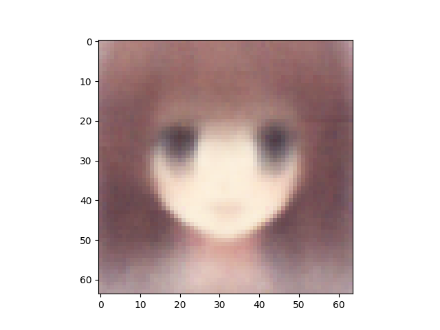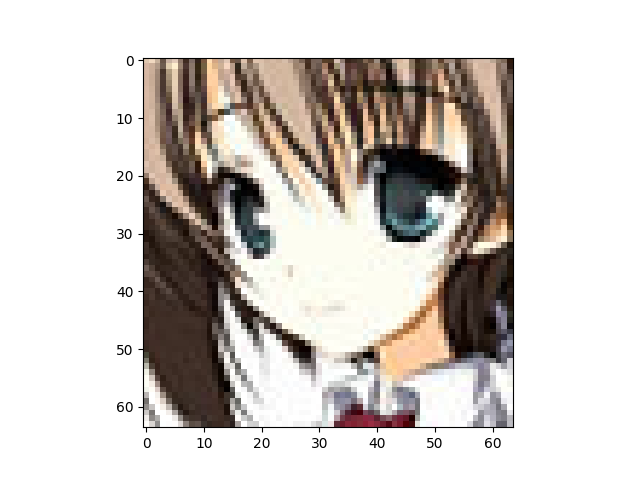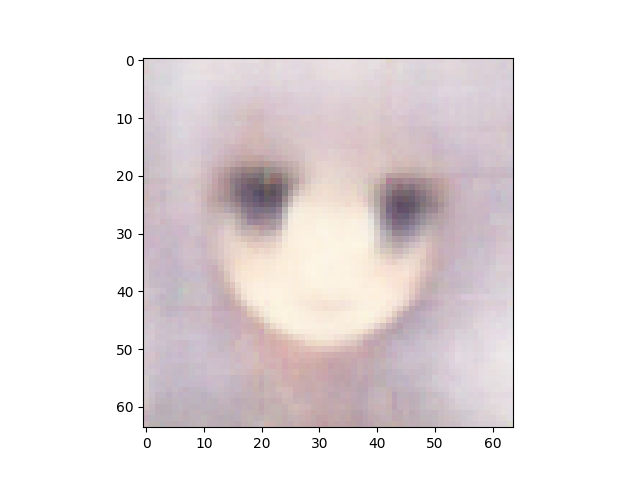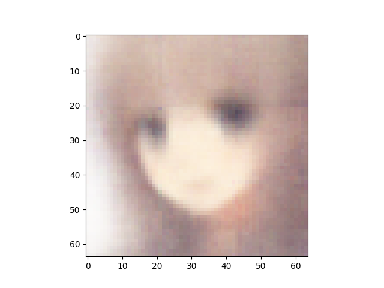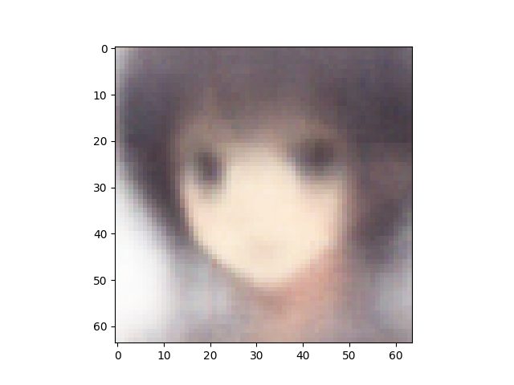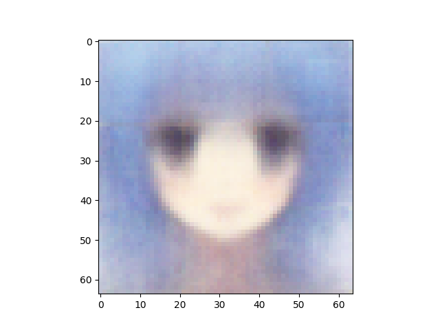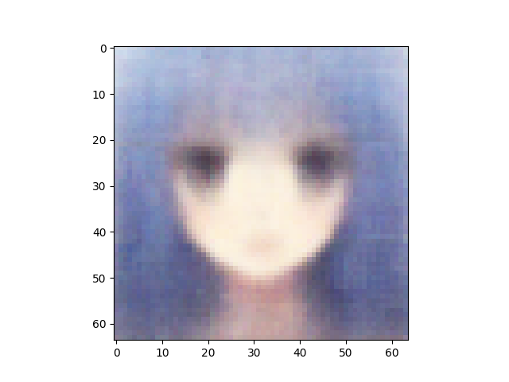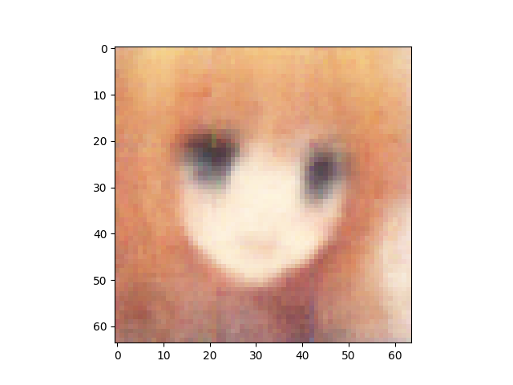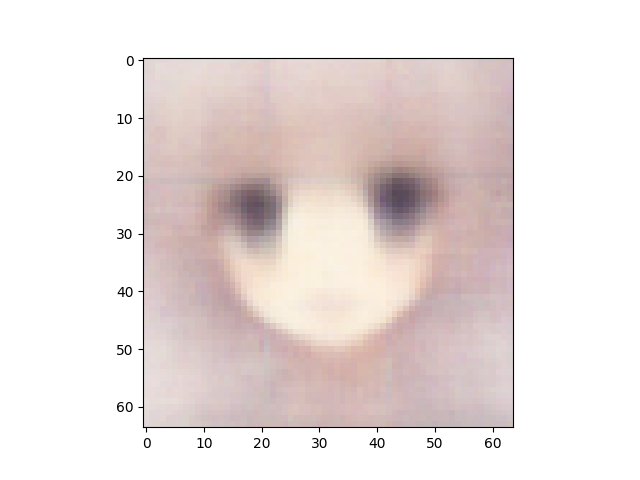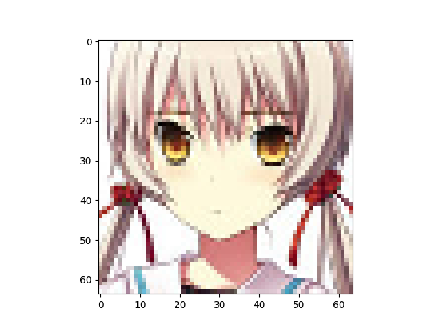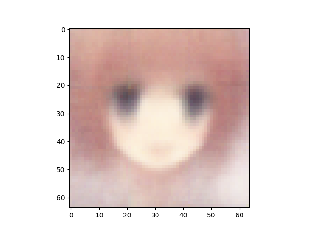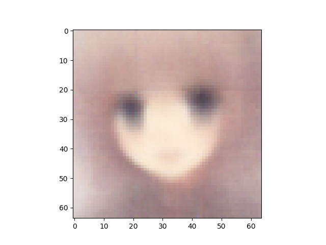