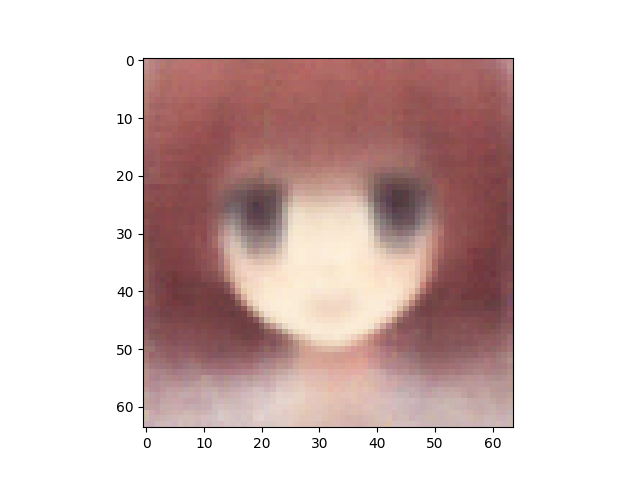
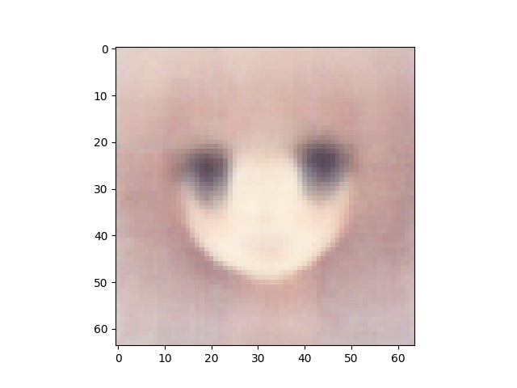
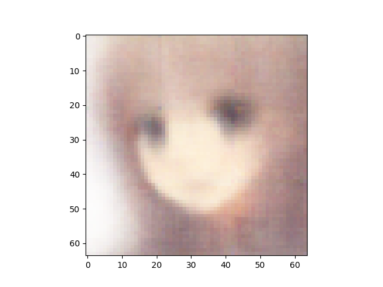
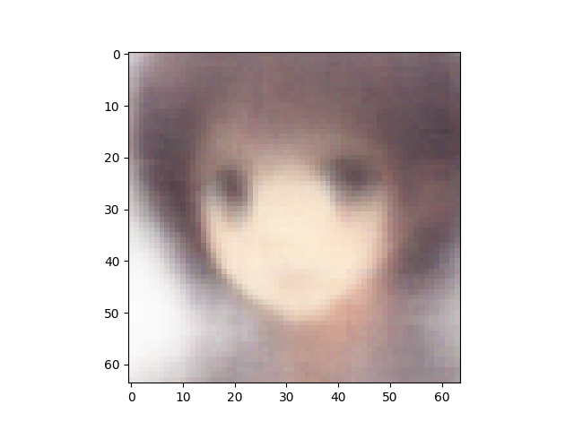
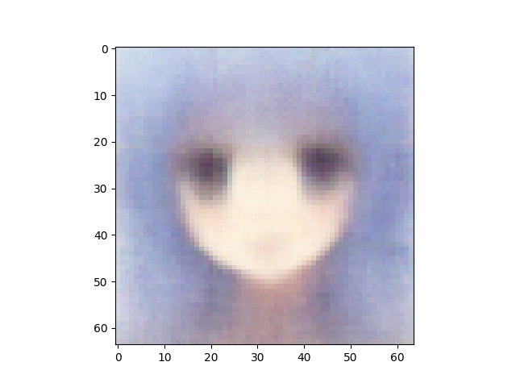
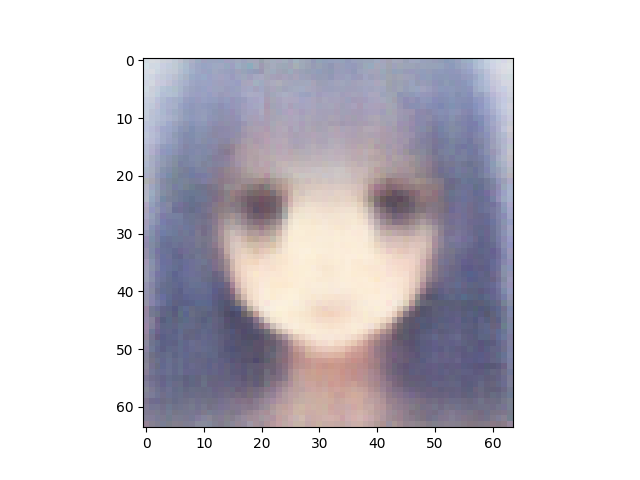
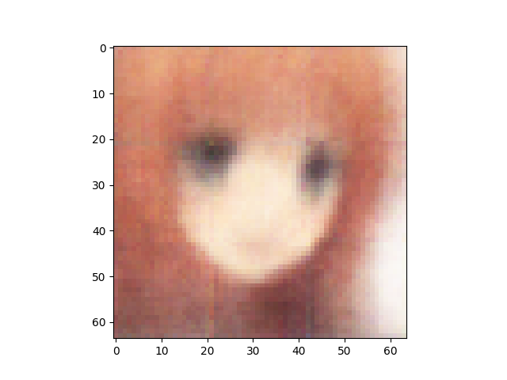
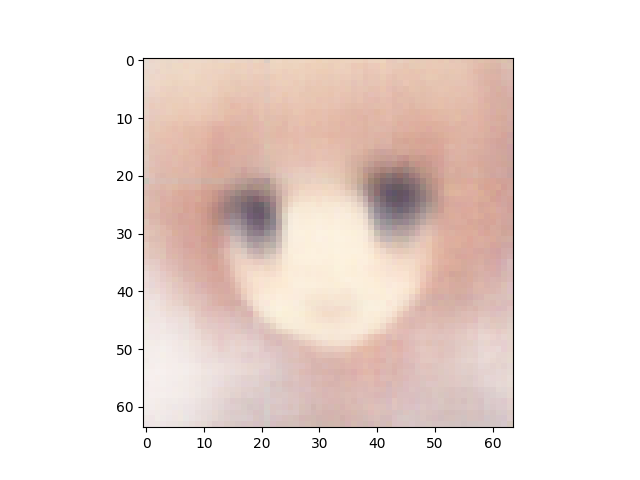
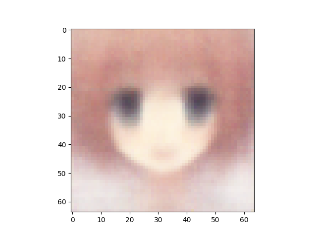
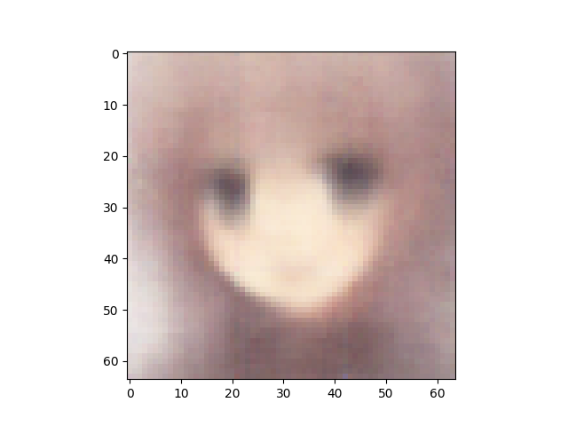

Number of latent variables 	5

Number of base channels 	32

Number of epochs trained 	50

Epoch0, Training loss 7437.0859375000, Time used 3.13

Epoch1, Training loss 7230.4389648438, Time used 2.90

Epoch2, Training loss 7170.6625976562, Time used 2.82

Epoch3, Training loss 7123.6933593750, Time used 3.00

Epoch4, Training loss 7082.6416015625, Time used 2.97

Epoch5, Training loss 7059.1044921875, Time used 2.75

Epoch6, Training loss 7033.6943359375, Time used 2.75

Epoch7, Training loss 7020.2187500000, Time used 2.79

Epoch8, Training loss 7007.0371093750, Time used 2.77

Epoch9, Training loss 6995.7153320312, Time used 2.75

Epoch10, Training loss 6990.1630859375, Time used 2.75

Epoch11, Training loss 6984.8315429688, Time used 2.75

Epoch12, Training loss 6979.7670898438, Time used 2.83

Epoch13, Training loss 6976.9277343750, Time used 2.84

Epoch14, Training loss 6972.0737304688, Time used 2.84

Epoch15, Training loss 6969.8105468750, Time used 2.87

Epoch16, Training loss 6969.0361328125, Time used 2.99

Epoch17, Training loss 6964.2832031250, Time used 2.76

Epoch18, Training loss 6962.7812500000, Time used 2.78

Epoch19, Training loss 6960.7148437500, Time used 2.77

Epoch20, Training loss 6959.2539062500, Time used 2.77

Epoch21, Training loss 6958.2290039062, Time used 2.78

Epoch22, Training loss 6956.3657226562, Time used 2.77

Epoch23, Training loss 6957.8618164062, Time used 2.76

Epoch24, Training loss 6955.1665039062, Time used 2.76

Epoch25, Training loss 6954.3671875000, Time used 2.76

Epoch26, Training loss 6951.4062500000, Time used 2.76

Epoch27, Training loss 6951.1665039062, Time used 2.75

Epoch28, Training loss 6951.1655273438, Time used 2.94

Epoch29, Training loss 6949.9116210938, Time used 2.81

Epoch30, Training loss 6950.4204101562, Time used 2.82

Epoch31, Training loss 6950.0937500000, Time used 2.75

Epoch32, Training loss 6948.9462890625, Time used 2.76

Epoch33, Training loss 6948.7021484375, Time used 2.77

Epoch34, Training loss 6947.5385742188, Time used 2.78

Epoch35, Training loss 6948.5288085938, Time used 2.78

Epoch36, Training loss 6949.4438476562, Time used 2.80

Epoch37, Training loss 6943.9252929688, Time used 3.05

Epoch38, Training loss 6946.7416992188, Time used 2.75

Epoch39, Training loss 6944.1909179688, Time used 3.03

Epoch40, Training loss 6943.4082031250, Time used 3.04

Epoch41, Training loss 6942.0639648438, Time used 2.75

Epoch42, Training loss 6941.8427734375, Time used 2.76

Epoch43, Training loss 6943.7104492188, Time used 2.76

Epoch44, Training loss 6943.4243164062, Time used 2.76

Epoch45, Training loss 6942.0698242188, Time used 2.78

Epoch46, Training loss 6942.3818359375, Time used 2.77

Epoch47, Training loss 6942.2866210938, Time used 2.78

Epoch48, Training loss 6941.3842773438, Time used 2.79

Epoch49, Training loss 6941.0205078125, Time used 2.79

