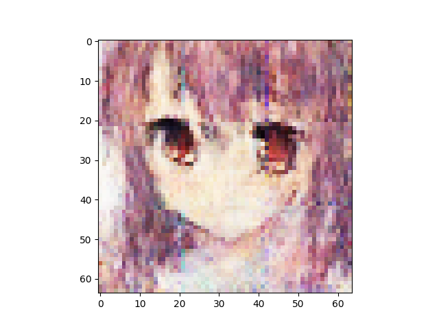
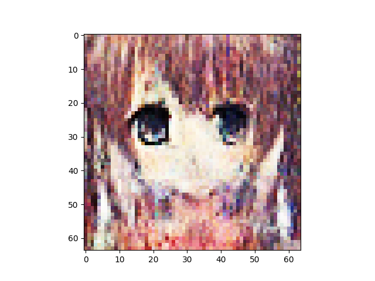
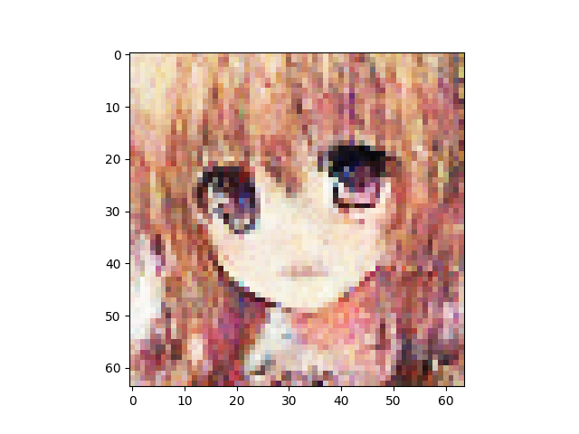
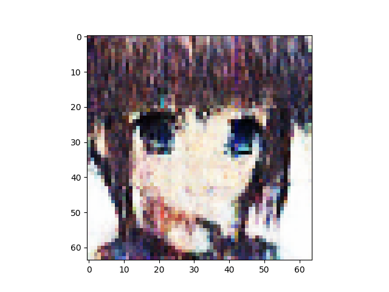
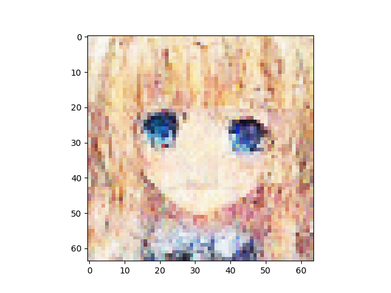
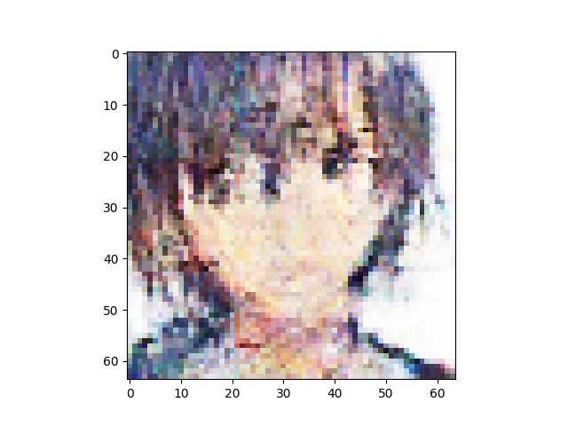
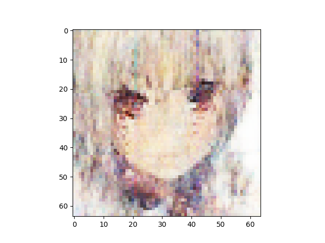
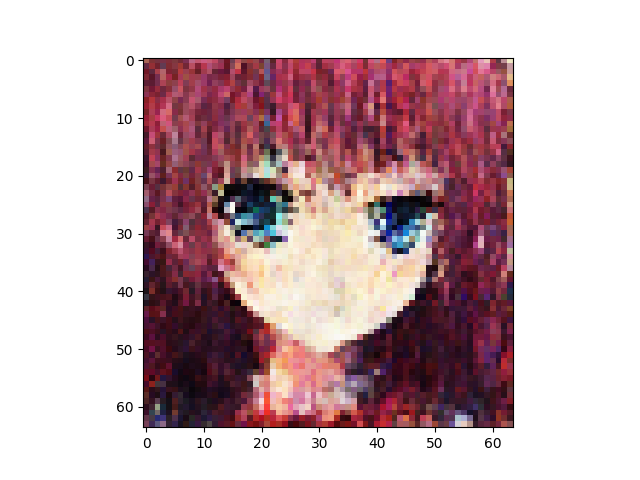
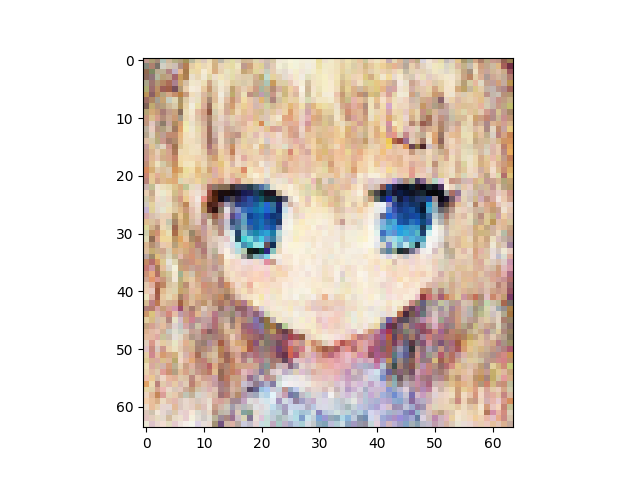
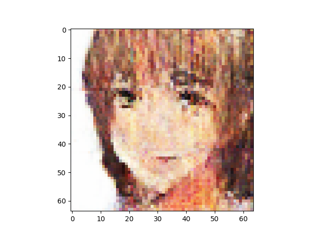

n_latent:1024 

n_base_channels:32 

pixel-by-pixel loss weight:1 

n_solo_epochs:100 

n_combo_epochs:100 

max_disc_loss :999 

Epoch0, Training loss 7303.4936523438, Time used 20.56

Epoch1, Training loss 6891.5351562500, Time used 16.79

Epoch2, Training loss 6800.4506835938, Time used 16.75

Epoch3, Training loss 6751.9550781250, Time used 16.78

Epoch4, Training loss 6721.3266601562, Time used 16.78

Epoch5, Training loss 6698.8056640625, Time used 16.74

Epoch6, Training loss 6682.3901367188, Time used 16.72

Epoch7, Training loss 6668.1723632812, Time used 16.76

Epoch8, Training loss 6656.8535156250, Time used 16.76

Epoch9, Training loss 6648.6396484375, Time used 16.74

Epoch10, Training loss 6641.2202148438, Time used 16.73

Epoch11, Training loss 6635.5063476562, Time used 16.69

Epoch12, Training loss 6627.2675781250, Time used 16.73

Epoch13, Training loss 6625.2119140625, Time used 16.75

Epoch14, Training loss 6617.6064453125, Time used 16.75

Epoch15, Training loss 6613.4970703125, Time used 16.74

Epoch16, Training loss 6610.3916015625, Time used 16.73

Epoch17, Training loss 6604.5981445312, Time used 16.73

Epoch18, Training loss 6601.6542968750, Time used 16.69

Epoch19, Training loss 6598.3056640625, Time used 16.81

Epoch20, Training loss 6594.2138671875, Time used 16.93

Epoch21, Training loss 6592.0351562500, Time used 16.95

Epoch22, Training loss 6588.3535156250, Time used 16.93

Epoch23, Training loss 6585.3188476562, Time used 16.95

Epoch24, Training loss 6582.5927734375, Time used 16.98

Epoch25, Training loss 6579.5390625000, Time used 16.93

Epoch26, Training loss 6579.1630859375, Time used 16.91

Epoch27, Training loss 6575.5673828125, Time used 17.04

Epoch28, Training loss 6571.3525390625, Time used 17.00

Epoch29, Training loss 6571.4399414062, Time used 16.99

Epoch30, Training loss 6570.1303710938, Time used 17.06

Epoch31, Training loss 6565.3354492188, Time used 17.01

Epoch32, Training loss 6563.5029296875, Time used 17.02

Epoch33, Training loss 6561.3544921875, Time used 17.05

Epoch34, Training loss 6559.9721679688, Time used 16.87

Epoch35, Training loss 6558.2744140625, Time used 16.62

Epoch36, Training loss 6556.7319335938, Time used 16.63

Epoch37, Training loss 6554.9130859375, Time used 16.64

Epoch38, Training loss 6552.9287109375, Time used 16.69

Epoch39, Training loss 6550.7607421875, Time used 16.69

Epoch40, Training loss 6548.4799804688, Time used 16.69

Epoch41, Training loss 6546.1425781250, Time used 16.64

Epoch42, Training loss 6543.3598632812, Time used 16.71

Epoch43, Training loss 6545.2749023438, Time used 16.71

Epoch44, Training loss 6544.5424804688, Time used 16.72

Epoch45, Training loss 6540.3593750000, Time used 16.71

Epoch46, Training loss 6541.4936523438, Time used 16.67

Epoch47, Training loss 6538.1962890625, Time used 16.70

Epoch48, Training loss 6536.3989257812, Time used 16.68

Epoch49, Training loss 6535.0390625000, Time used 16.72

Epoch50, Training loss 6534.3310546875, Time used 16.72

Epoch51, Training loss 6531.3930664062, Time used 16.67

Epoch52, Training loss 6530.8256835938, Time used 16.61

Epoch53, Training loss 6529.8779296875, Time used 16.69

Epoch54, Training loss 6528.2265625000, Time used 16.71

Epoch55, Training loss 6527.2822265625, Time used 16.81

Epoch56, Training loss 6525.7885742188, Time used 16.93

Epoch57, Training loss 6523.9531250000, Time used 16.95

Epoch58, Training loss 6524.4599609375, Time used 16.92

Epoch59, Training loss 6521.6220703125, Time used 16.91

Epoch60, Training loss 6520.8999023438, Time used 16.99

Epoch61, Training loss 6521.0932617188, Time used 16.95

Epoch62, Training loss 6519.0893554688, Time used 17.03

Epoch63, Training loss 6518.5312500000, Time used 16.96

Epoch64, Training loss 6516.9731445312, Time used 16.90

Epoch65, Training loss 6516.1230468750, Time used 16.93

Epoch66, Training loss 6514.2944335938, Time used 16.90

Epoch67, Training loss 6513.5703125000, Time used 16.83

Epoch68, Training loss 6512.7158203125, Time used 16.89

Epoch69, Training loss 6510.9794921875, Time used 16.97

Epoch70, Training loss 6510.4531250000, Time used 16.94

Epoch71, Training loss 6510.3183593750, Time used 16.90

Epoch72, Training loss 6509.0483398438, Time used 16.69

Epoch73, Training loss 6507.8369140625, Time used 16.70

Epoch74, Training loss 6507.0605468750, Time used 16.68

Epoch75, Training loss 6506.6323242188, Time used 16.73

Epoch76, Training loss 6506.7265625000, Time used 16.72

Epoch77, Training loss 6503.7036132812, Time used 16.73

Epoch78, Training loss 6502.7236328125, Time used 16.74

Epoch79, Training loss 6502.9111328125, Time used 16.73

Epoch80, Training loss 6501.8833007812, Time used 16.73

Epoch81, Training loss 6500.6987304688, Time used 16.73

Epoch82, Training loss 6500.4277343750, Time used 16.78

Epoch83, Training loss 6498.7055664062, Time used 16.73

Epoch84, Training loss 6499.5756835938, Time used 16.65

Epoch85, Training loss 6497.2563476562, Time used 16.65

Epoch86, Training loss 6497.0278320312, Time used 16.74

Epoch87, Training loss 6495.1860351562, Time used 16.73

Epoch88, Training loss 6495.8544921875, Time used 16.73

Epoch89, Training loss 6493.4833984375, Time used 16.60

Epoch90, Training loss 6493.5166015625, Time used 16.65

Epoch91, Training loss 6492.6474609375, Time used 16.81

Epoch92, Training loss 6491.8251953125, Time used 16.99

Epoch93, Training loss 6491.5996093750, Time used 16.99

Epoch94, Training loss 6490.6582031250, Time used 16.96

Epoch95, Training loss 6489.4003906250, Time used 16.91

Epoch96, Training loss 6488.4257812500, Time used 16.97

Epoch97, Training loss 6487.7934570312, Time used 17.06

Epoch98, Training loss 6489.1621093750, Time used 17.02

Epoch99, Training loss 6487.4780273438, Time used 16.93

Epoch100, VAE Training loss 6640.56006, ResNet Training loss 0.3994709253, Time used 38.76

Epoch101, VAE Training loss 6716.65088, ResNet Training loss 0.3102891147, Time used 38.64

Epoch102, VAE Training loss 6736.47510, ResNet Training loss 0.2653320730, Time used 37.92

Epoch103, VAE Training loss 6754.26709, ResNet Training loss 0.3006434441, Time used 37.81

Epoch104, VAE Training loss 6765.24658, ResNet Training loss 0.2557915449, Time used 37.78

Epoch105, VAE Training loss 6770.00537, ResNet Training loss 0.2572524846, Time used 37.85

Epoch106, VAE Training loss 6788.83936, ResNet Training loss 0.2811105549, Time used 37.85

Epoch107, VAE Training loss 6778.84131, ResNet Training loss 0.2708850503, Time used 37.85

Epoch108, VAE Training loss 6792.23389, ResNet Training loss 0.3100229800, Time used 37.75

Epoch109, VAE Training loss 6782.67188, ResNet Training loss 0.2332368344, Time used 37.83

Epoch110, VAE Training loss 6779.11182, ResNet Training loss 0.2640930116, Time used 37.73

Epoch111, VAE Training loss 6802.41895, ResNet Training loss 0.2811388969, Time used 37.87

Epoch112, VAE Training loss 6789.06299, ResNet Training loss 0.2596605718, Time used 37.83

Epoch113, VAE Training loss 6811.40771, ResNet Training loss 0.2731088102, Time used 37.86

Epoch114, VAE Training loss 6800.50439, ResNet Training loss 0.2647469938, Time used 37.75

Epoch115, VAE Training loss 6820.19922, ResNet Training loss 0.2946254611, Time used 37.88

Epoch116, VAE Training loss 6806.66211, ResNet Training loss 0.2694343328, Time used 37.84

Epoch117, VAE Training loss 6802.57080, ResNet Training loss 0.2727413177, Time used 37.79

Epoch118, VAE Training loss 6814.82275, ResNet Training loss 0.2862652838, Time used 37.82

Epoch119, VAE Training loss 6818.63037, ResNet Training loss 0.2674585879, Time used 37.77

Epoch120, VAE Training loss 6828.05566, ResNet Training loss 0.3090935349, Time used 37.79

Epoch121, VAE Training loss 6816.85107, ResNet Training loss 0.2596391439, Time used 37.83

Epoch122, VAE Training loss 6815.02295, ResNet Training loss 0.3310464323, Time used 37.79

Epoch123, VAE Training loss 6785.68848, ResNet Training loss 0.2438331842, Time used 37.83

Epoch124, VAE Training loss 6818.34180, ResNet Training loss 0.2888413072, Time used 37.78

Epoch125, VAE Training loss 6824.93262, ResNet Training loss 0.2891413867, Time used 37.78

Epoch126, VAE Training loss 6821.09619, ResNet Training loss 0.2743875086, Time used 37.75

Epoch127, VAE Training loss 6796.33496, ResNet Training loss 0.2848102450, Time used 37.99

Epoch128, VAE Training loss 6810.64453, ResNet Training loss 0.3042976260, Time used 38.54

Epoch129, VAE Training loss 6820.16406, ResNet Training loss 0.2820663452, Time used 38.55

Epoch130, VAE Training loss 6802.27588, ResNet Training loss 0.2875177562, Time used 38.62

Epoch131, VAE Training loss 6808.23535, ResNet Training loss 0.2726286054, Time used 38.54

Epoch132, VAE Training loss 6811.27344, ResNet Training loss 0.3079796135, Time used 38.47

Epoch133, VAE Training loss 6829.61572, ResNet Training loss 0.2964985669, Time used 38.65

Epoch134, VAE Training loss 6807.39062, ResNet Training loss 0.2974027395, Time used 38.62

Epoch135, VAE Training loss 6824.17969, ResNet Training loss 0.2903752327, Time used 38.20

Epoch136, VAE Training loss 6814.11035, ResNet Training loss 0.3247925937, Time used 37.75

Epoch137, VAE Training loss 6815.80273, ResNet Training loss 0.2902691364, Time used 37.70

Epoch138, VAE Training loss 6816.83594, ResNet Training loss 0.2727550268, Time used 37.71

Epoch139, VAE Training loss 6806.89941, ResNet Training loss 0.2906427383, Time used 37.72

Epoch140, VAE Training loss 6822.59668, ResNet Training loss 0.3139672875, Time used 37.78

Epoch141, VAE Training loss 6807.08447, ResNet Training loss 0.2960939705, Time used 37.70

Epoch142, VAE Training loss 6812.32861, ResNet Training loss 0.3152466714, Time used 37.78

Epoch143, VAE Training loss 6806.44531, ResNet Training loss 0.2712616622, Time used 38.20

Epoch144, VAE Training loss 6812.72998, ResNet Training loss 0.2922067940, Time used 38.61

Epoch145, VAE Training loss 6804.87207, ResNet Training loss 0.3214907348, Time used 38.54

Epoch146, VAE Training loss 6809.64795, ResNet Training loss 0.2806213796, Time used 38.53

Epoch147, VAE Training loss 6815.17432, ResNet Training loss 0.2933075428, Time used 38.48

Epoch148, VAE Training loss 6811.87842, ResNet Training loss 0.3000704646, Time used 38.56

Epoch149, VAE Training loss 6808.70166, ResNet Training loss 0.2951060534, Time used 38.29

Epoch150, VAE Training loss 6808.91553, ResNet Training loss 0.3108821213, Time used 37.93

Epoch151, VAE Training loss 6812.10400, ResNet Training loss 0.2502314150, Time used 37.74

Epoch152, VAE Training loss 6793.45068, ResNet Training loss 0.2999852598, Time used 37.71

Epoch153, VAE Training loss 6804.95752, ResNet Training loss 0.2444560826, Time used 37.69

Epoch154, VAE Training loss 6796.94189, ResNet Training loss 0.2817104459, Time used 37.83

Epoch155, VAE Training loss 6799.87646, ResNet Training loss 0.2760644853, Time used 37.82

Epoch156, VAE Training loss 6799.26465, ResNet Training loss 0.3015063703, Time used 37.74

Epoch157, VAE Training loss 6807.45947, ResNet Training loss 0.2770303488, Time used 37.63

Epoch158, VAE Training loss 6806.04248, ResNet Training loss 0.2876893282, Time used 37.75

Epoch159, VAE Training loss 6799.96680, ResNet Training loss 0.2577505410, Time used 38.45

Epoch160, VAE Training loss 6798.57031, ResNet Training loss 0.2521056235, Time used 38.66

Epoch161, VAE Training loss 6807.99902, ResNet Training loss 0.2601808310, Time used 38.52

Epoch162, VAE Training loss 6795.03076, ResNet Training loss 0.2416600585, Time used 38.54

Epoch163, VAE Training loss 6802.40625, ResNet Training loss 0.2655391693, Time used 38.48

Epoch164, VAE Training loss 6807.98389, ResNet Training loss 0.2876591682, Time used 38.43

Epoch165, VAE Training loss 6805.30957, ResNet Training loss 0.2796426713, Time used 38.59

Epoch166, VAE Training loss 6803.96240, ResNet Training loss 0.2636617124, Time used 37.80

Epoch167, VAE Training loss 6802.09717, ResNet Training loss 0.2856570184, Time used 37.68

Epoch168, VAE Training loss 6801.25732, ResNet Training loss 0.2475368083, Time used 37.78

Epoch169, VAE Training loss 6812.65625, ResNet Training loss 0.3040366471, Time used 37.72

Epoch170, VAE Training loss 6797.68018, ResNet Training loss 0.2431181669, Time used 37.77

Epoch171, VAE Training loss 6804.29102, ResNet Training loss 0.2233344764, Time used 37.79

Epoch172, VAE Training loss 6793.59082, ResNet Training loss 0.2459144294, Time used 37.81

Epoch173, VAE Training loss 6801.61035, ResNet Training loss 0.2408673912, Time used 37.82

Epoch174, VAE Training loss 6796.13623, ResNet Training loss 0.2441657782, Time used 37.84

Epoch175, VAE Training loss 6801.83057, ResNet Training loss 0.2276882082, Time used 38.48

Epoch176, VAE Training loss 6803.84180, ResNet Training loss 0.2222297788, Time used 38.66

Epoch177, VAE Training loss 6797.87061, ResNet Training loss 0.2609888613, Time used 38.69

Epoch178, VAE Training loss 6799.70996, ResNet Training loss 0.2607199550, Time used 38.56

Epoch179, VAE Training loss 6797.91211, ResNet Training loss 0.2167073339, Time used 38.67

Epoch180, VAE Training loss 6795.95996, ResNet Training loss 0.2325171977, Time used 38.54

Epoch181, VAE Training loss 6796.44043, ResNet Training loss 0.2654886246, Time used 37.78

Epoch182, VAE Training loss 6787.63818, ResNet Training loss 0.2165255696, Time used 37.79

Epoch183, VAE Training loss 6792.89160, ResNet Training loss 0.2423612773, Time used 37.85

Epoch184, VAE Training loss 6793.04980, ResNet Training loss 0.2185907960, Time used 37.82

Epoch185, VAE Training loss 6795.19727, ResNet Training loss 0.2233524770, Time used 37.81

Epoch186, VAE Training loss 6795.05176, ResNet Training loss 0.2261035591, Time used 37.72

Epoch187, VAE Training loss 6794.24951, ResNet Training loss 0.2136617303, Time used 37.81

Epoch188, VAE Training loss 6790.43408, ResNet Training loss 0.1829311103, Time used 37.80

Epoch189, VAE Training loss 6794.57568, ResNet Training loss 0.2281027585, Time used 37.78

Epoch190, VAE Training loss 6794.58154, ResNet Training loss 0.2181414962, Time used 37.91

Epoch191, VAE Training loss 6797.65283, ResNet Training loss 0.2267449051, Time used 38.62

Epoch192, VAE Training loss 6798.51953, ResNet Training loss 0.2112398893, Time used 38.60

Epoch193, VAE Training loss 6790.66211, ResNet Training loss 0.2099018097, Time used 38.57

Epoch194, VAE Training loss 6788.22998, ResNet Training loss 0.2035174221, Time used 38.58

Epoch195, VAE Training loss 6784.58154, ResNet Training loss 0.2070317268, Time used 38.43

Epoch196, VAE Training loss 6800.77002, ResNet Training loss 0.2185277194, Time used 38.49

Epoch197, VAE Training loss 6788.40137, ResNet Training loss 0.2257437706, Time used 38.43

Epoch198, VAE Training loss 6788.93311, ResNet Training loss 0.1877566725, Time used 38.05

Epoch199, VAE Training loss 6794.54102, ResNet Training loss 0.1861533225, Time used 37.78

