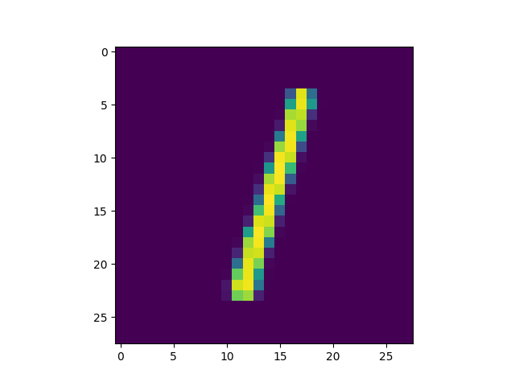
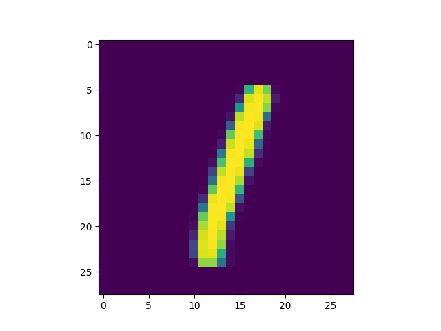

VAE number of latent variables 	5

VAE number of hidden layers 	3

VAE number of hidden nodes per layer 	400

LogReg number of hidden layers 	1

LogReg number of hidden nodes per layer 	200

Number of epochs trained 	50

Epoch0, VAE Training loss 160.44768, LogReg Training loss 0.5123975277, LogReg Training Acc 0.936, Time used 15.45

Epoch1, VAE Training loss 132.92728, LogReg Training loss 0.3199676573, LogReg Training Acc 0.947, Time used 15.47

Epoch2, VAE Training loss 128.52544, LogReg Training loss 0.2793494165, LogReg Training Acc 0.957, Time used 15.49

Epoch3, VAE Training loss 126.05097, LogReg Training loss 0.2663137913, LogReg Training Acc 0.969, Time used 15.50

Epoch4, VAE Training loss 124.50854, LogReg Training loss 0.2656011283, LogReg Training Acc 0.963, Time used 15.39

Epoch5, VAE Training loss 123.44779, LogReg Training loss 0.2702503204, LogReg Training Acc 0.962, Time used 15.38

Epoch6, VAE Training loss 122.63647, LogReg Training loss 0.2652993798, LogReg Training Acc 0.952, Time used 15.39

Epoch7, VAE Training loss 122.06966, LogReg Training loss 0.2701441050, LogReg Training Acc 0.953, Time used 15.42

Epoch8, VAE Training loss 121.49578, LogReg Training loss 0.2714539766, LogReg Training Acc 0.956, Time used 15.68

Epoch9, VAE Training loss 121.13158, LogReg Training loss 0.2718443274, LogReg Training Acc 0.940, Time used 15.86

Epoch10, VAE Training loss 120.82111, LogReg Training loss 0.2747193575, LogReg Training Acc 0.954, Time used 15.55

Epoch11, VAE Training loss 120.63617, LogReg Training loss 0.2751176953, LogReg Training Acc 0.928, Time used 15.63

Epoch12, VAE Training loss 120.41593, LogReg Training loss 0.2841952443, LogReg Training Acc 0.963, Time used 15.73

Epoch13, VAE Training loss 120.24129, LogReg Training loss 0.2834327817, LogReg Training Acc 0.954, Time used 15.77

Epoch14, VAE Training loss 120.06708, LogReg Training loss 0.2923772335, LogReg Training Acc 0.941, Time used 15.66

Epoch15, VAE Training loss 119.90665, LogReg Training loss 0.2846859097, LogReg Training Acc 0.940, Time used 16.23

Epoch16, VAE Training loss 119.79498, LogReg Training loss 0.2932223380, LogReg Training Acc 0.934, Time used 16.07

Epoch17, VAE Training loss 119.75301, LogReg Training loss 0.2968588173, LogReg Training Acc 0.938, Time used 16.17

Epoch18, VAE Training loss 119.59572, LogReg Training loss 0.2953657210, LogReg Training Acc 0.948, Time used 16.22

Epoch19, VAE Training loss 119.58149, LogReg Training loss 0.2940256000, LogReg Training Acc 0.949, Time used 15.62

Epoch20, VAE Training loss 119.42850, LogReg Training loss 0.2985639572, LogReg Training Acc 0.944, Time used 15.46

Epoch21, VAE Training loss 119.38739, LogReg Training loss 0.3068319857, LogReg Training Acc 0.937, Time used 15.58

Epoch22, VAE Training loss 119.34062, LogReg Training loss 0.3021485209, LogReg Training Acc 0.939, Time used 15.47

Epoch23, VAE Training loss 119.34680, LogReg Training loss 0.2996775806, LogReg Training Acc 0.938, Time used 15.45

Epoch24, VAE Training loss 119.21309, LogReg Training loss 0.3151869774, LogReg Training Acc 0.935, Time used 15.42

Epoch25, VAE Training loss 119.19304, LogReg Training loss 0.3163976967, LogReg Training Acc 0.941, Time used 15.51

Epoch26, VAE Training loss 119.12647, LogReg Training loss 0.3161116838, LogReg Training Acc 0.947, Time used 15.60

Epoch27, VAE Training loss 119.09417, LogReg Training loss 0.3104919791, LogReg Training Acc 0.913, Time used 15.76

Epoch28, VAE Training loss 119.06213, LogReg Training loss 0.3181481063, LogReg Training Acc 0.947, Time used 16.11

Epoch29, VAE Training loss 118.93893, LogReg Training loss 0.3220795393, LogReg Training Acc 0.926, Time used 15.51

Epoch30, VAE Training loss 118.92504, LogReg Training loss 0.3222967684, LogReg Training Acc 0.940, Time used 15.41

Epoch31, VAE Training loss 118.83470, LogReg Training loss 0.3235830069, LogReg Training Acc 0.929, Time used 15.37

Epoch32, VAE Training loss 118.86026, LogReg Training loss 0.3163617551, LogReg Training Acc 0.942, Time used 15.73

Epoch33, VAE Training loss 118.75835, LogReg Training loss 0.3332349956, LogReg Training Acc 0.935, Time used 15.58

Epoch34, VAE Training loss 118.77227, LogReg Training loss 0.3291104138, LogReg Training Acc 0.948, Time used 15.53

Epoch35, VAE Training loss 118.77338, LogReg Training loss 0.3269389868, LogReg Training Acc 0.938, Time used 15.49

Epoch36, VAE Training loss 118.71312, LogReg Training loss 0.3316164017, LogReg Training Acc 0.939, Time used 15.47

Epoch37, VAE Training loss 118.74052, LogReg Training loss 0.3443414569, LogReg Training Acc 0.926, Time used 16.00

Epoch38, VAE Training loss 118.55852, LogReg Training loss 0.3433398008, LogReg Training Acc 0.933, Time used 16.06

Epoch39, VAE Training loss 118.54105, LogReg Training loss 0.3475954831, LogReg Training Acc 0.936, Time used 16.04

Epoch40, VAE Training loss 118.44825, LogReg Training loss 0.3470422029, LogReg Training Acc 0.940, Time used 16.06

Epoch41, VAE Training loss 118.54471, LogReg Training loss 0.3476268351, LogReg Training Acc 0.930, Time used 16.05

Epoch42, VAE Training loss 118.46882, LogReg Training loss 0.3470509648, LogReg Training Acc 0.924, Time used 16.00

Epoch43, VAE Training loss 118.48465, LogReg Training loss 0.3610104620, LogReg Training Acc 0.908, Time used 15.99

Epoch44, VAE Training loss 118.38573, LogReg Training loss 0.3463791907, LogReg Training Acc 0.938, Time used 16.14

Epoch45, VAE Training loss 118.34499, LogReg Training loss 0.3497046232, LogReg Training Acc 0.932, Time used 16.08

Epoch46, VAE Training loss 118.34994, LogReg Training loss 0.3570315540, LogReg Training Acc 0.939, Time used 15.99

Epoch47, VAE Training loss 118.29050, LogReg Training loss 0.3616282344, LogReg Training Acc 0.935, Time used 16.01

Epoch48, VAE Training loss 118.29213, LogReg Training loss 0.3597907722, LogReg Training Acc 0.933, Time used 15.99

Epoch49, VAE Training loss 118.21084, LogReg Training loss 0.3472578824, LogReg Training Acc 0.932, Time used 15.40

