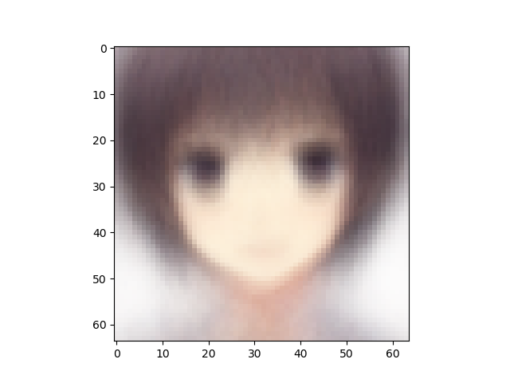

VAE number of latent variables 	10

VAE number of hidden layers 	10

VAE number of hidden nodes per layer 	400

LogReg number of hidden layers 	1

LogReg number of hidden nodes per layer 	200

Number of epochs trained 	50

Epoch0, VAE Training loss 7394.30664, LogReg Training loss 2.6352336407, LogReg Training Acc 0.495, Time used 8.17

Epoch1, VAE Training loss 7197.06201, LogReg Training loss 1.7194300890, LogReg Training Acc 0.641, Time used 7.91

Epoch2, VAE Training loss 7151.55078, LogReg Training loss 1.3758696318, LogReg Training Acc 0.804, Time used 7.85

Epoch3, VAE Training loss 7072.35254, LogReg Training loss 0.8434489965, LogReg Training Acc 0.892, Time used 7.86

Epoch4, VAE Training loss 7055.48975, LogReg Training loss 0.5260939002, LogReg Training Acc 0.908, Time used 7.89

Epoch5, VAE Training loss 7053.89453, LogReg Training loss 0.4988451898, LogReg Training Acc 0.922, Time used 7.81

Epoch6, VAE Training loss 7043.10400, LogReg Training loss 0.6069470644, LogReg Training Acc 0.873, Time used 7.79

Epoch7, VAE Training loss 7051.92480, LogReg Training loss 0.7452819943, LogReg Training Acc 0.875, Time used 7.88

Epoch8, VAE Training loss 7054.07031, LogReg Training loss 0.7423313856, LogReg Training Acc 0.858, Time used 7.90

Epoch9, VAE Training loss 7049.08984, LogReg Training loss 0.7312826514, LogReg Training Acc 0.893, Time used 7.83

Epoch10, VAE Training loss 7031.70264, LogReg Training loss 0.7747972012, LogReg Training Acc 0.882, Time used 7.83

Epoch11, VAE Training loss 7026.29639, LogReg Training loss 0.6976616979, LogReg Training Acc 0.858, Time used 7.82

Epoch12, VAE Training loss 7074.14990, LogReg Training loss 0.4904996455, LogReg Training Acc 0.935, Time used 7.94

Epoch13, VAE Training loss 7043.23535, LogReg Training loss 0.4383678436, LogReg Training Acc 0.939, Time used 7.96

Epoch14, VAE Training loss 7053.33594, LogReg Training loss 0.4617912471, LogReg Training Acc 0.971, Time used 7.88

Epoch15, VAE Training loss 7027.73877, LogReg Training loss 0.4748211801, LogReg Training Acc 0.914, Time used 7.85

Epoch16, VAE Training loss 7064.63037, LogReg Training loss 0.3271293938, LogReg Training Acc 0.918, Time used 7.89

Epoch17, VAE Training loss 7036.67236, LogReg Training loss 0.2631837726, LogReg Training Acc 0.956, Time used 7.87

Epoch18, VAE Training loss 7045.72510, LogReg Training loss 0.3139852881, LogReg Training Acc 0.967, Time used 7.89

Epoch19, VAE Training loss 7114.94434, LogReg Training loss 0.4256444871, LogReg Training Acc 0.981, Time used 7.96

Epoch20, VAE Training loss 7174.73193, LogReg Training loss 0.0704703033, LogReg Training Acc 0.992, Time used 7.88

Epoch21, VAE Training loss 7199.58984, LogReg Training loss 0.1004537791, LogReg Training Acc 0.990, Time used 7.83

Epoch22, VAE Training loss 7073.98535, LogReg Training loss 0.1141029671, LogReg Training Acc 0.988, Time used 7.89

Epoch23, VAE Training loss 7046.93359, LogReg Training loss 0.1836660951, LogReg Training Acc 0.887, Time used 7.92

Epoch24, VAE Training loss 7038.44189, LogReg Training loss 0.3050068617, LogReg Training Acc 0.979, Time used 7.82

Epoch25, VAE Training loss 7038.31689, LogReg Training loss 0.2567520440, LogReg Training Acc 0.977, Time used 8.54

Epoch26, VAE Training loss 7026.04297, LogReg Training loss 0.2678243518, LogReg Training Acc 0.940, Time used 8.02

Epoch27, VAE Training loss 7025.02783, LogReg Training loss 0.2754744291, LogReg Training Acc 0.956, Time used 7.86

Epoch28, VAE Training loss 7049.24414, LogReg Training loss 0.2820164561, LogReg Training Acc 0.963, Time used 7.83

Epoch29, VAE Training loss 7023.19727, LogReg Training loss 0.3033611774, LogReg Training Acc 0.956, Time used 7.86

Epoch30, VAE Training loss 7024.26758, LogReg Training loss 0.2444282323, LogReg Training Acc 0.972, Time used 7.84

Epoch31, VAE Training loss 7035.01123, LogReg Training loss 0.2430488318, LogReg Training Acc 0.922, Time used 7.97

Epoch32, VAE Training loss 7031.17969, LogReg Training loss 0.2497072071, LogReg Training Acc 0.946, Time used 7.88

Epoch33, VAE Training loss 7029.51953, LogReg Training loss 0.2342802882, LogReg Training Acc 0.971, Time used 7.90

Epoch34, VAE Training loss 7030.19531, LogReg Training loss 0.1580287516, LogReg Training Acc 0.978, Time used 7.84

Epoch35, VAE Training loss 7032.46289, LogReg Training loss 0.1890792400, LogReg Training Acc 0.982, Time used 7.89

Epoch36, VAE Training loss 7038.25342, LogReg Training loss 0.2290290147, LogReg Training Acc 0.990, Time used 8.07

Epoch37, VAE Training loss 7022.58496, LogReg Training loss 0.1537066698, LogReg Training Acc 0.966, Time used 7.98

Epoch38, VAE Training loss 7052.46533, LogReg Training loss 0.2378775924, LogReg Training Acc 0.975, Time used 7.82

Epoch39, VAE Training loss 7034.32422, LogReg Training loss 0.1189137772, LogReg Training Acc 0.987, Time used 7.89

Epoch40, VAE Training loss 7039.68311, LogReg Training loss 0.1281382442, LogReg Training Acc 0.974, Time used 8.11

Epoch41, VAE Training loss 7044.58154, LogReg Training loss 0.1736735255, LogReg Training Acc 0.987, Time used 8.08

Epoch42, VAE Training loss 7023.98291, LogReg Training loss 0.1053499132, LogReg Training Acc 0.991, Time used 8.11

Epoch43, VAE Training loss 7020.84033, LogReg Training loss 0.1106143072, LogReg Training Acc 0.990, Time used 8.19

Epoch44, VAE Training loss 7011.25879, LogReg Training loss 0.1357652694, LogReg Training Acc 0.980, Time used 8.12

Epoch45, VAE Training loss 7059.91309, LogReg Training loss 0.1595060527, LogReg Training Acc 0.983, Time used 7.75

Epoch46, VAE Training loss 7029.65381, LogReg Training loss 0.1498227417, LogReg Training Acc 0.956, Time used 7.79

Epoch47, VAE Training loss 7030.69434, LogReg Training loss 0.1273003072, LogReg Training Acc 0.987, Time used 7.76

Epoch48, VAE Training loss 7025.45459, LogReg Training loss 0.0920774415, LogReg Training Acc 0.995, Time used 7.80

Epoch49, VAE Training loss 7018.84082, LogReg Training loss 0.1406410784, LogReg Training Acc 0.977, Time used 7.99

