VAE number of latent variables 	10

VAE number of hidden layers 	10

VAE number of hidden nodes per layer 	400

LogReg number of hidden layers 	2

LogReg number of hidden nodes per layer 	200

Number of epochs trained 	50

Epoch0, VAE Training loss 9484.02441, LogReg Training loss 1.6055200100, LogReg Training Acc 0.631, Time used 8.74

Epoch1, VAE Training loss 7197.81396, LogReg Training loss 0.9083079100, LogReg Training Acc 0.870, Time used 8.93

Epoch2, VAE Training loss 7200.42969, LogReg Training loss 0.5159017444, LogReg Training Acc 0.973, Time used 8.68

Epoch3, VAE Training loss 7178.74170, LogReg Training loss 0.4849619567, LogReg Training Acc 0.928, Time used 8.70

Epoch4, VAE Training loss 7090.73340, LogReg Training loss 0.5373970270, LogReg Training Acc 0.831, Time used 8.68

Epoch5, VAE Training loss 7079.78320, LogReg Training loss 0.4736625254, LogReg Training Acc 0.944, Time used 8.79

Epoch6, VAE Training loss 7072.11865, LogReg Training loss 0.5211082101, LogReg Training Acc 0.857, Time used 8.72

Epoch7, VAE Training loss 7067.79395, LogReg Training loss 0.5789063573, LogReg Training Acc 0.859, Time used 8.76

Epoch8, VAE Training loss 7059.52051, LogReg Training loss 0.5824839473, LogReg Training Acc 0.838, Time used 8.77

Epoch9, VAE Training loss 7082.67480, LogReg Training loss 0.5087497234, LogReg Training Acc 0.919, Time used 8.67

Epoch10, VAE Training loss 7067.46533, LogReg Training loss 0.4828810096, LogReg Training Acc 0.877, Time used 8.72

Epoch11, VAE Training loss 7053.81689, LogReg Training loss 0.4199605286, LogReg Training Acc 0.903, Time used 8.75

Epoch12, VAE Training loss 7064.47021, LogReg Training loss 0.4574075639, LogReg Training Acc 0.928, Time used 8.57

Epoch13, VAE Training loss 7057.66309, LogReg Training loss 0.4502316415, LogReg Training Acc 0.919, Time used 8.67

Epoch14, VAE Training loss 7059.04053, LogReg Training loss 0.4776030481, LogReg Training Acc 0.911, Time used 8.72

Epoch15, VAE Training loss 7068.95068, LogReg Training loss 0.4665480554, LogReg Training Acc 0.938, Time used 8.71

Epoch16, VAE Training loss 7054.93555, LogReg Training loss 0.4458022416, LogReg Training Acc 0.905, Time used 8.74

Epoch17, VAE Training loss 7069.51953, LogReg Training loss 0.5031176805, LogReg Training Acc 0.934, Time used 8.71

Epoch18, VAE Training loss 7063.77246, LogReg Training loss 0.4679053128, LogReg Training Acc 0.775, Time used 8.68

Epoch19, VAE Training loss 7096.25195, LogReg Training loss 0.5442880392, LogReg Training Acc 0.946, Time used 8.67

Epoch20, VAE Training loss 7086.52295, LogReg Training loss 0.4207192957, LogReg Training Acc 0.915, Time used 8.69

Epoch21, VAE Training loss 7089.46582, LogReg Training loss 0.4453191757, LogReg Training Acc 0.874, Time used 8.81

Epoch22, VAE Training loss 7096.79639, LogReg Training loss 0.4890144765, LogReg Training Acc 0.908, Time used 8.75

Epoch23, VAE Training loss 7074.13916, LogReg Training loss 0.5196197629, LogReg Training Acc 0.903, Time used 8.37

Epoch24, VAE Training loss 7120.51123, LogReg Training loss 0.4654760361, LogReg Training Acc 0.929, Time used 8.80

Epoch25, VAE Training loss 7085.20264, LogReg Training loss 0.4664192498, LogReg Training Acc 0.885, Time used 8.68

Epoch26, VAE Training loss 7073.66602, LogReg Training loss 0.4667293429, LogReg Training Acc 0.916, Time used 8.74

Epoch27, VAE Training loss 7053.12939, LogReg Training loss 0.4490427375, LogReg Training Acc 0.941, Time used 8.74

Epoch28, VAE Training loss 7079.41406, LogReg Training loss 0.4078058898, LogReg Training Acc 0.942, Time used 8.69

Epoch29, VAE Training loss 7071.29443, LogReg Training loss 0.4232915342, LogReg Training Acc 0.930, Time used 8.70

Epoch30, VAE Training loss 7060.80273, LogReg Training loss 0.4419091642, LogReg Training Acc 0.927, Time used 8.71

Epoch31, VAE Training loss 7064.20898, LogReg Training loss 0.4084518850, LogReg Training Acc 0.932, Time used 8.73

Epoch32, VAE Training loss 7095.28076, LogReg Training loss 0.4369058013, LogReg Training Acc 0.934, Time used 8.64

Epoch33, VAE Training loss 7126.94385, LogReg Training loss 0.3711979389, LogReg Training Acc 0.960, Time used 8.48

Epoch34, VAE Training loss 7103.95361, LogReg Training loss 0.3371400535, LogReg Training Acc 0.932, Time used 8.36

Epoch35, VAE Training loss 7085.84717, LogReg Training loss 0.3684711456, LogReg Training Acc 0.947, Time used 8.30

Epoch36, VAE Training loss 7079.05518, LogReg Training loss 0.4200152457, LogReg Training Acc 0.933, Time used 8.32

Epoch37, VAE Training loss 7087.09814, LogReg Training loss 0.4208905995, LogReg Training Acc 0.937, Time used 8.37

Epoch38, VAE Training loss 7075.40039, LogReg Training loss 0.4174374640, LogReg Training Acc 0.878, Time used 8.33

Epoch39, VAE Training loss 7063.75244, LogReg Training loss 0.4177374244, LogReg Training Acc 0.865, Time used 8.58

Epoch40, VAE Training loss 7071.36133, LogReg Training loss 0.4037792683, LogReg Training Acc 0.940, Time used 8.63

Epoch41, VAE Training loss 7075.59082, LogReg Training loss 0.3984232843, LogReg Training Acc 0.923, Time used 8.31

Epoch42, VAE Training loss 7081.67871, LogReg Training loss 0.3941245675, LogReg Training Acc 0.960, Time used 8.34

Epoch43, VAE Training loss 7062.59375, LogReg Training loss 0.3694605231, LogReg Training Acc 0.942, Time used 8.35

Epoch44, VAE Training loss 7042.58838, LogReg Training loss 0.3985762298, LogReg Training Acc 0.924, Time used 8.30

Epoch45, VAE Training loss 7050.31055, LogReg Training loss 0.4275747836, LogReg Training Acc 0.917, Time used 8.30

Epoch46, VAE Training loss 7053.75146, LogReg Training loss 0.4212341309, LogReg Training Acc 0.901, Time used 8.32

Epoch47, VAE Training loss 7070.88086, LogReg Training loss 0.3667999804, LogReg Training Acc 0.920, Time used 8.31

Epoch48, VAE Training loss 7066.77393, LogReg Training loss 0.4308788776, LogReg Training Acc 0.948, Time used 8.36

Epoch49, VAE Training loss 7092.49902, LogReg Training loss 0.3451461494, LogReg Training Acc 0.931, Time used 8.29

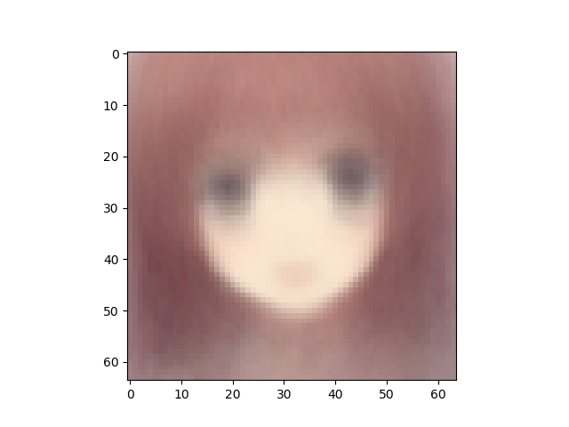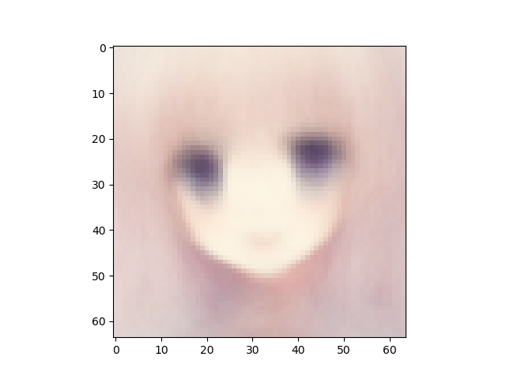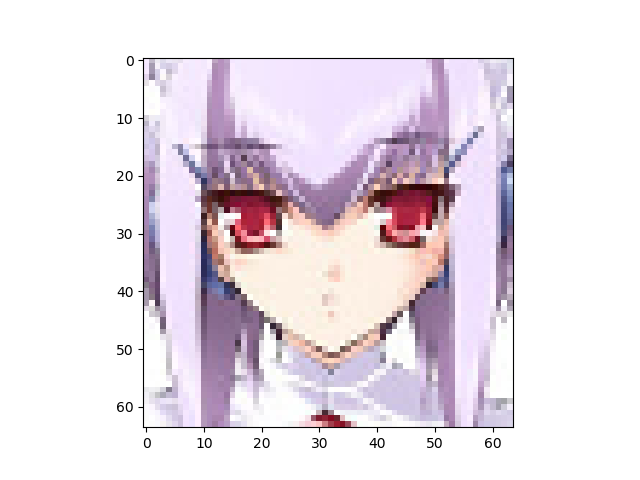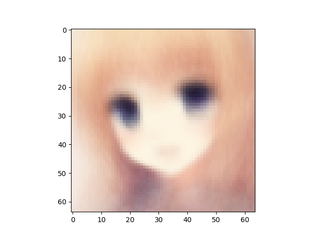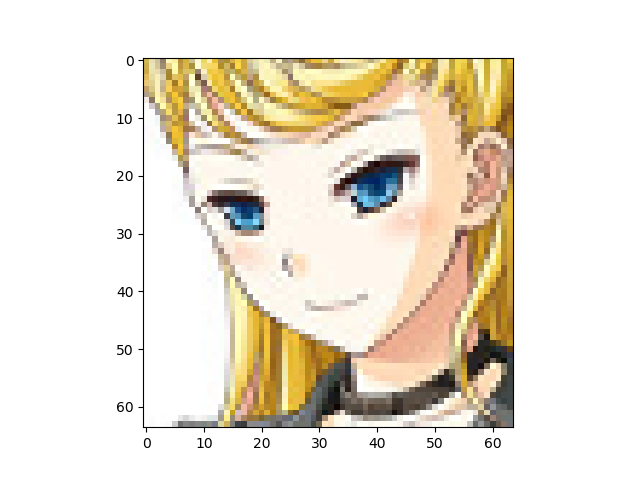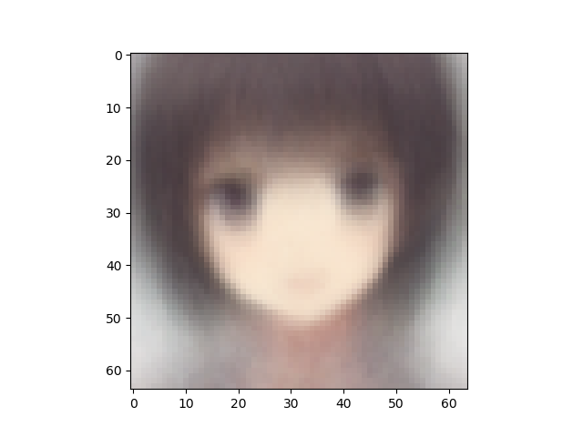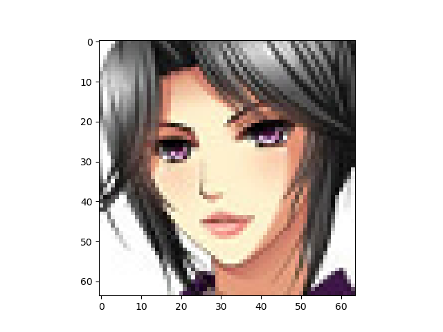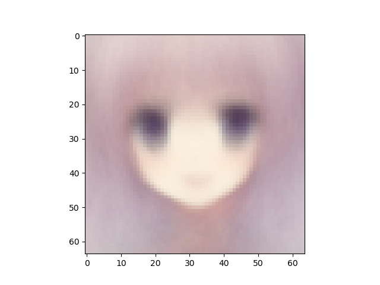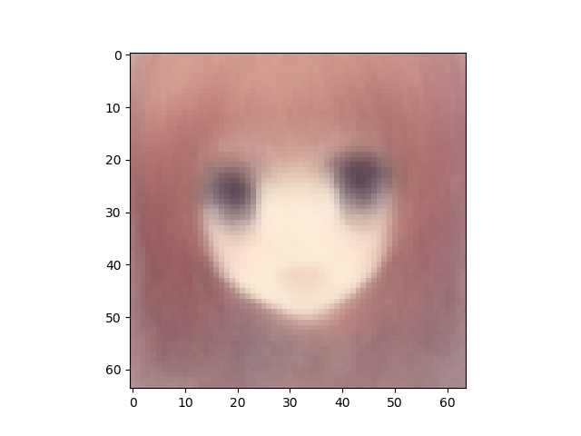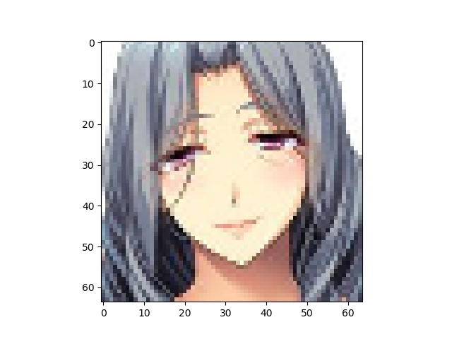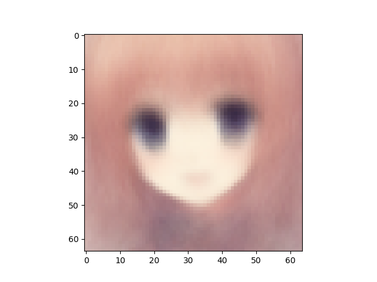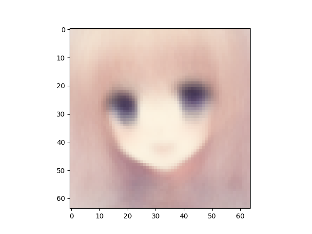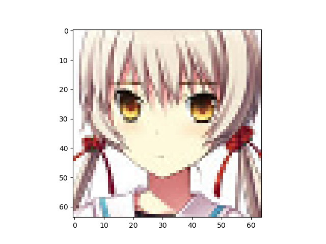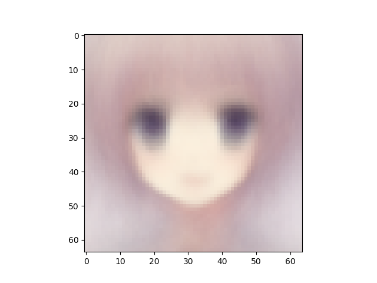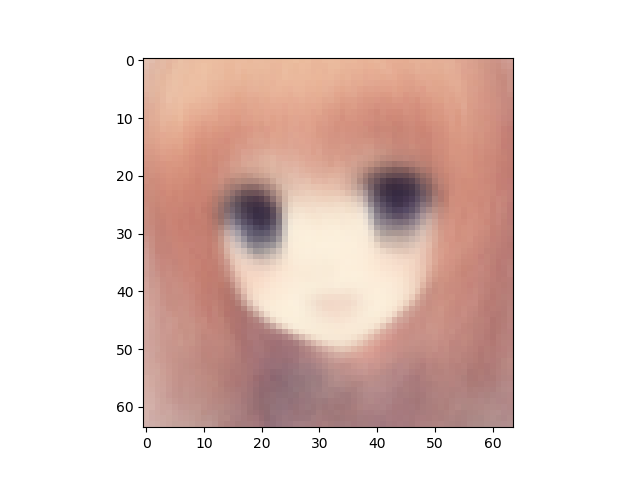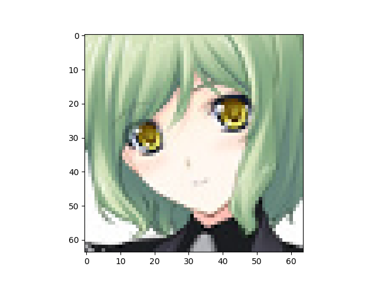