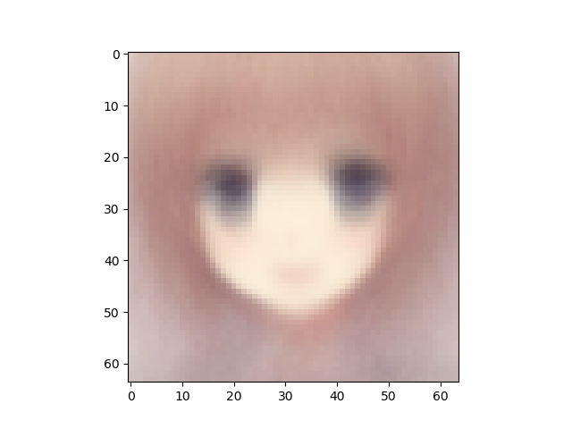
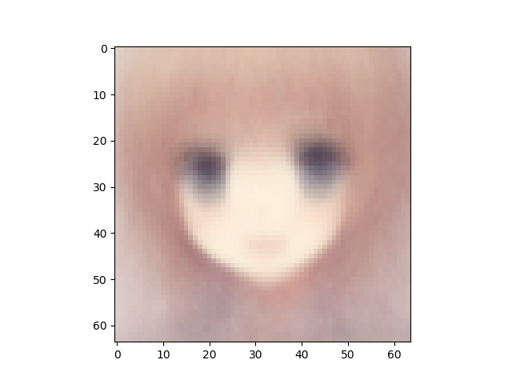
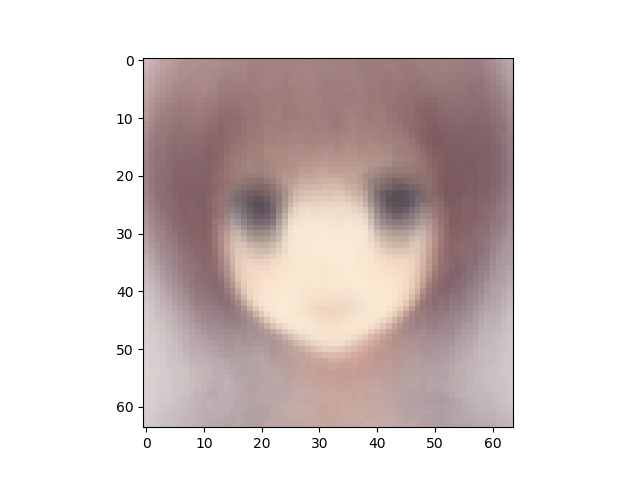
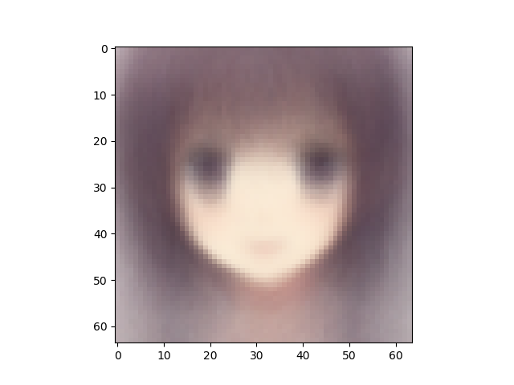
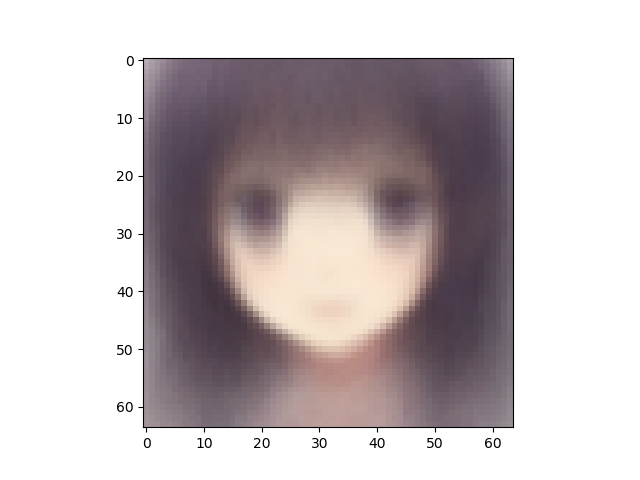
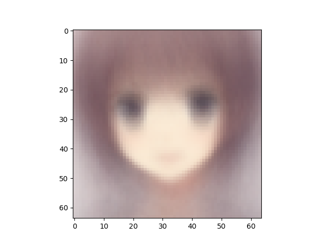

VAE number of latent variables 	10

VAE number of hidden layers 	10

VAE number of hidden nodes per layer 	400

LogReg number of hidden layers 	2

LogReg number of hidden nodes per layer 	200

Number of epochs trained 	50

Epoch0, VAE Training loss 7388.07129, LogReg Training loss 1.5297014713, LogReg Training Acc 0.615, Time used 8.32

Epoch1, VAE Training loss 7202.64062, LogReg Training loss 1.0746301413, LogReg Training Acc 0.885, Time used 8.15

Epoch2, VAE Training loss 7218.43066, LogReg Training loss 0.4689841568, LogReg Training Acc 0.807, Time used 8.11

Epoch3, VAE Training loss 7217.58643, LogReg Training loss 0.4528427720, LogReg Training Acc 0.979, Time used 8.12

Epoch4, VAE Training loss 7224.72705, LogReg Training loss 0.2008922100, LogReg Training Acc 0.986, Time used 8.11

Epoch5, VAE Training loss 7226.96924, LogReg Training loss 0.3559987545, LogReg Training Acc 0.978, Time used 8.11

Epoch6, VAE Training loss 7255.62109, LogReg Training loss 0.1525322944, LogReg Training Acc 0.986, Time used 8.08

Epoch7, VAE Training loss 7182.85254, LogReg Training loss 0.1312491596, LogReg Training Acc 0.989, Time used 8.14

Epoch8, VAE Training loss 7284.17139, LogReg Training loss 0.1366177052, LogReg Training Acc 0.990, Time used 8.12

Epoch9, VAE Training loss 7190.83496, LogReg Training loss 0.0980113596, LogReg Training Acc 0.990, Time used 8.17

Epoch10, VAE Training loss 7188.61719, LogReg Training loss 0.0753782690, LogReg Training Acc 0.986, Time used 8.17

Epoch11, VAE Training loss 7183.12793, LogReg Training loss 0.2769418359, LogReg Training Acc 0.971, Time used 8.14

Epoch12, VAE Training loss 7178.86426, LogReg Training loss 0.1137949079, LogReg Training Acc 0.983, Time used 8.17

Epoch13, VAE Training loss 7179.96094, LogReg Training loss 0.0824714079, LogReg Training Acc 0.986, Time used 8.16

Epoch14, VAE Training loss 7179.13818, LogReg Training loss 0.0648931116, LogReg Training Acc 0.991, Time used 8.70

Epoch15, VAE Training loss 7179.62402, LogReg Training loss 0.0702334493, LogReg Training Acc 0.990, Time used 8.18

Epoch16, VAE Training loss 7180.66992, LogReg Training loss 0.0866767168, LogReg Training Acc 0.985, Time used 8.22

Epoch17, VAE Training loss 7179.38232, LogReg Training loss 0.0608616173, LogReg Training Acc 0.993, Time used 8.12

Epoch18, VAE Training loss 7179.24316, LogReg Training loss 0.0956501439, LogReg Training Acc 0.991, Time used 8.15

Epoch19, VAE Training loss 7178.97412, LogReg Training loss 0.0779953003, LogReg Training Acc 0.993, Time used 8.14

Epoch20, VAE Training loss 7178.07275, LogReg Training loss 0.1007407904, LogReg Training Acc 0.990, Time used 8.17

Epoch21, VAE Training loss 7177.88086, LogReg Training loss 0.2793199718, LogReg Training Acc 0.994, Time used 8.11

Epoch22, VAE Training loss 7178.23242, LogReg Training loss 0.0535391942, LogReg Training Acc 0.994, Time used 8.14

Epoch23, VAE Training loss 7179.13330, LogReg Training loss 0.0861107409, LogReg Training Acc 0.989, Time used 8.12

Epoch24, VAE Training loss 7180.71875, LogReg Training loss 0.0745450333, LogReg Training Acc 0.988, Time used 8.14

Epoch25, VAE Training loss 7178.32178, LogReg Training loss 0.0684721768, LogReg Training Acc 0.992, Time used 8.13

Epoch26, VAE Training loss 7180.54297, LogReg Training loss 0.0700729489, LogReg Training Acc 0.990, Time used 8.24

Epoch27, VAE Training loss 7179.96924, LogReg Training loss 0.0683434382, LogReg Training Acc 0.982, Time used 8.19

Epoch28, VAE Training loss 7179.34912, LogReg Training loss 0.0653456897, LogReg Training Acc 0.997, Time used 8.15

Epoch29, VAE Training loss 7177.86377, LogReg Training loss 0.0919537693, LogReg Training Acc 0.954, Time used 8.15

Epoch30, VAE Training loss 7176.61523, LogReg Training loss 0.0706909671, LogReg Training Acc 0.993, Time used 8.15

Epoch31, VAE Training loss 7177.80029, LogReg Training loss 0.0822674781, LogReg Training Acc 0.992, Time used 8.17

Epoch32, VAE Training loss 7176.85107, LogReg Training loss 0.0896481723, LogReg Training Acc 0.993, Time used 8.21

Epoch33, VAE Training loss 7175.03125, LogReg Training loss 0.1146439239, LogReg Training Acc 0.983, Time used 8.15

Epoch34, VAE Training loss 7173.62061, LogReg Training loss 0.2141660154, LogReg Training Acc 0.948, Time used 8.19

Epoch35, VAE Training loss 7203.89062, LogReg Training loss 0.2316440344, LogReg Training Acc 0.995, Time used 8.15

Epoch36, VAE Training loss 7178.40088, LogReg Training loss 0.0426275618, LogReg Training Acc 0.996, Time used 8.56

Epoch37, VAE Training loss 7176.48682, LogReg Training loss 0.0362792686, LogReg Training Acc 0.994, Time used 8.47

Epoch38, VAE Training loss 7177.73438, LogReg Training loss 0.1509194672, LogReg Training Acc 0.993, Time used 8.47

Epoch39, VAE Training loss 7175.79980, LogReg Training loss 0.0283878688, LogReg Training Acc 0.997, Time used 8.41

Epoch40, VAE Training loss 7177.73584, LogReg Training loss 0.0504683964, LogReg Training Acc 0.981, Time used 8.41

Epoch41, VAE Training loss 7176.28467, LogReg Training loss 0.1051446423, LogReg Training Acc 0.997, Time used 8.06

Epoch42, VAE Training loss 7177.66504, LogReg Training loss 0.0476250984, LogReg Training Acc 0.994, Time used 8.07

Epoch43, VAE Training loss 7179.06592, LogReg Training loss 0.0561790243, LogReg Training Acc 0.995, Time used 8.18

Epoch44, VAE Training loss 7177.93457, LogReg Training loss 0.1734686792, LogReg Training Acc 0.990, Time used 8.08

Epoch45, VAE Training loss 7177.55908, LogReg Training loss 0.0625055805, LogReg Training Acc 0.991, Time used 8.06

Epoch46, VAE Training loss 7178.20996, LogReg Training loss 0.0706640631, LogReg Training Acc 0.989, Time used 8.10

Epoch47, VAE Training loss 7178.39746, LogReg Training loss 0.0514926054, LogReg Training Acc 0.990, Time used 8.09

Epoch48, VAE Training loss 7179.32520, LogReg Training loss 0.0836397633, LogReg Training Acc 0.983, Time used 8.12

Epoch49, VAE Training loss 7176.36865, LogReg Training loss 0.0568339229, LogReg Training Acc 0.989, Time used 8.15

