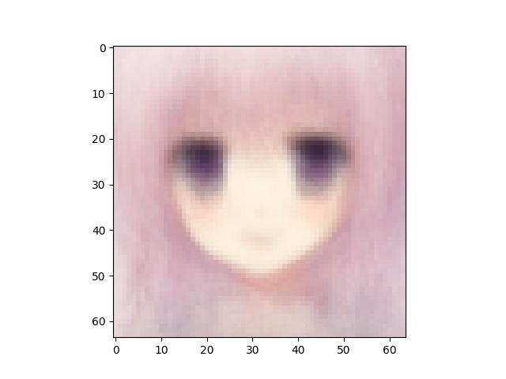

VAE number of latent variables 	256

VAE number of hidden layers 	5

VAE number of hidden nodes per layer 	1024

LogReg number of hidden layers 	1

LogReg number of hidden nodes per layer 	1024

Number of epochs trained 	200

Epoch0, VAE Training loss 7345.87402, LogReg Training loss 7.0190348625, Time used 6.75

Epoch1, VAE Training loss 7118.71094, LogReg Training loss 1.8729838133, Time used 6.36

Epoch2, VAE Training loss 7101.40479, LogReg Training loss 1.4691227674, Time used 6.27

Epoch3, VAE Training loss 7045.55371, LogReg Training loss 1.4750479460, Time used 6.27

Epoch4, VAE Training loss 6988.52881, LogReg Training loss 1.6241263151, Time used 6.33

Epoch5, VAE Training loss 6941.55371, LogReg Training loss 1.4089281559, Time used 6.35

Epoch6, VAE Training loss 6901.29541, LogReg Training loss 1.2345645428, Time used 6.36

Epoch7, VAE Training loss 6877.05078, LogReg Training loss 1.0378763676, Time used 6.18

Epoch8, VAE Training loss 6865.44922, LogReg Training loss 0.8748682141, Time used 6.17

Epoch9, VAE Training loss 6857.58887, LogReg Training loss 0.9193730354, Time used 6.20

Epoch10, VAE Training loss 6842.59619, LogReg Training loss 0.9028230906, Time used 6.24

Epoch11, VAE Training loss 6838.45996, LogReg Training loss 0.9457728863, Time used 6.26

Epoch12, VAE Training loss 6830.18945, LogReg Training loss 0.9137055278, Time used 6.26

Epoch13, VAE Training loss 6830.86768, LogReg Training loss 0.9177938700, Time used 6.20

Epoch14, VAE Training loss 6819.11279, LogReg Training loss 0.9025257826, Time used 6.24

Epoch15, VAE Training loss 6814.67529, LogReg Training loss 0.9559580684, Time used 6.24

Epoch16, VAE Training loss 6808.49268, LogReg Training loss 0.8945255876, Time used 6.20

Epoch17, VAE Training loss 6806.24414, LogReg Training loss 0.8802988529, Time used 6.19

Epoch18, VAE Training loss 6807.16602, LogReg Training loss 0.8847429156, Time used 6.17

Epoch19, VAE Training loss 6803.12842, LogReg Training loss 0.9140502810, Time used 6.25

Epoch20, VAE Training loss 6795.64795, LogReg Training loss 0.9218877554, Time used 6.24

Epoch21, VAE Training loss 6784.71582, LogReg Training loss 0.9435071945, Time used 6.24

Epoch22, VAE Training loss 6783.68408, LogReg Training loss 0.9274792671, Time used 6.23

Epoch23, VAE Training loss 6777.25439, LogReg Training loss 0.9282711148, Time used 6.23

Epoch24, VAE Training loss 6772.32861, LogReg Training loss 0.9141437411, Time used 6.33

Epoch25, VAE Training loss 6770.79736, LogReg Training loss 0.9040431976, Time used 6.59

Epoch26, VAE Training loss 6763.10742, LogReg Training loss 0.9252848029, Time used 6.19

Epoch27, VAE Training loss 6762.28906, LogReg Training loss 0.9323512316, Time used 6.28

Epoch28, VAE Training loss 6756.81592, LogReg Training loss 0.9260451794, Time used 6.34

Epoch29, VAE Training loss 6753.89990, LogReg Training loss 0.9179181457, Time used 6.23

Epoch30, VAE Training loss 6751.08594, LogReg Training loss 0.9137489200, Time used 6.23

Epoch31, VAE Training loss 6746.94824, LogReg Training loss 0.9610248804, Time used 6.20

Epoch32, VAE Training loss 6748.35840, LogReg Training loss 0.8803543448, Time used 6.19

Epoch33, VAE Training loss 6740.57324, LogReg Training loss 0.9131475091, Time used 6.17

Epoch34, VAE Training loss 6740.88379, LogReg Training loss 0.8963856101, Time used 6.21

Epoch35, VAE Training loss 6735.79150, LogReg Training loss 0.9153169990, Time used 6.25

Epoch36, VAE Training loss 6727.25195, LogReg Training loss 0.8982025385, Time used 6.20

Epoch37, VAE Training loss 6725.56396, LogReg Training loss 0.8873623610, Time used 6.18

Epoch38, VAE Training loss 6720.64795, LogReg Training loss 0.9257314801, Time used 6.20

Epoch39, VAE Training loss 6717.08789, LogReg Training loss 0.8861963153, Time used 6.26

Epoch40, VAE Training loss 6718.35010, LogReg Training loss 0.9049623609, Time used 6.23

Epoch41, VAE Training loss 6714.14062, LogReg Training loss 0.8759756684, Time used 6.28

Epoch42, VAE Training loss 6711.51904, LogReg Training loss 0.9036365151, Time used 6.18

Epoch43, VAE Training loss 6703.61963, LogReg Training loss 0.9254448414, Time used 6.20

Epoch44, VAE Training loss 6708.01074, LogReg Training loss 0.9073420763, Time used 6.28

Epoch45, VAE Training loss 6699.84326, LogReg Training loss 0.9389930964, Time used 6.27

Epoch46, VAE Training loss 6700.01465, LogReg Training loss 0.9176708460, Time used 6.21

Epoch47, VAE Training loss 6695.28320, LogReg Training loss 0.9194275737, Time used 6.16

Epoch48, VAE Training loss 6702.18115, LogReg Training loss 0.8802236915, Time used 6.17

Epoch49, VAE Training loss 6693.83984, LogReg Training loss 0.9199885726, Time used 6.24

Epoch50, VAE Training loss 6690.33447, LogReg Training loss 0.9490295649, Time used 6.28

Epoch51, VAE Training loss 6687.69336, LogReg Training loss 0.9014553428, Time used 6.28

Epoch52, VAE Training loss 6684.56885, LogReg Training loss 0.9117256403, Time used 6.25

Epoch53, VAE Training loss 6682.64795, LogReg Training loss 0.9188319445, Time used 6.31

Epoch54, VAE Training loss 6678.13721, LogReg Training loss 0.9529422522, Time used 6.38

Epoch55, VAE Training loss 6681.11133, LogReg Training loss 0.9030238986, Time used 6.18

Epoch56, VAE Training loss 6679.42676, LogReg Training loss 0.9308417439, Time used 6.16

Epoch57, VAE Training loss 6674.51367, LogReg Training loss 0.9565224051, Time used 6.21

Epoch58, VAE Training loss 6673.62939, LogReg Training loss 0.9353733659, Time used 6.13

Epoch59, VAE Training loss 6672.05176, LogReg Training loss 0.9414187074, Time used 6.19

Epoch60, VAE Training loss 6668.93066, LogReg Training loss 0.9365742803, Time used 6.19

Epoch61, VAE Training loss 6673.11816, LogReg Training loss 0.9214193225, Time used 6.22

Epoch62, VAE Training loss 6668.16504, LogReg Training loss 0.9318084717, Time used 6.18

Epoch63, VAE Training loss 6666.29736, LogReg Training loss 0.9440324903, Time used 6.54

Epoch64, VAE Training loss 6664.29736, LogReg Training loss 0.9054489136, Time used 6.24

Epoch65, VAE Training loss 6663.74561, LogReg Training loss 0.9349164367, Time used 6.27

Epoch66, VAE Training loss 6659.25732, LogReg Training loss 0.9560123086, Time used 6.23

Epoch67, VAE Training loss 6657.03809, LogReg Training loss 0.9229006171, Time used 6.17

Epoch68, VAE Training loss 6666.12207, LogReg Training loss 0.9415811896, Time used 6.24

Epoch69, VAE Training loss 6653.41797, LogReg Training loss 1.0174015760, Time used 6.24

Epoch70, VAE Training loss 6645.77295, LogReg Training loss 0.9471765757, Time used 6.23

Epoch71, VAE Training loss 6651.05566, LogReg Training loss 0.9643640518, Time used 6.22

Epoch72, VAE Training loss 6650.23682, LogReg Training loss 0.9492771626, Time used 6.23

Epoch73, VAE Training loss 6650.94629, LogReg Training loss 0.9306362867, Time used 6.25

Epoch74, VAE Training loss 6648.80273, LogReg Training loss 0.9662393332, Time used 6.23

Epoch75, VAE Training loss 6644.98535, LogReg Training loss 0.9343038201, Time used 6.26

Epoch76, VAE Training loss 6644.33447, LogReg Training loss 0.9746981859, Time used 6.26

Epoch77, VAE Training loss 6648.96143, LogReg Training loss 0.9698939323, Time used 6.24

Epoch78, VAE Training loss 6640.91211, LogReg Training loss 0.9550183415, Time used 6.29

Epoch79, VAE Training loss 6640.42822, LogReg Training loss 0.9599810839, Time used 6.23

Epoch80, VAE Training loss 6645.48438, LogReg Training loss 0.9455860853, Time used 6.24

Epoch81, VAE Training loss 6642.93262, LogReg Training loss 0.9733706117, Time used 6.27

Epoch82, VAE Training loss 6636.71826, LogReg Training loss 0.9605502486, Time used 6.28

Epoch83, VAE Training loss 6635.84912, LogReg Training loss 0.9927924275, Time used 6.52

Epoch84, VAE Training loss 6630.97656, LogReg Training loss 0.9724670649, Time used 6.21

Epoch85, VAE Training loss 6637.55371, LogReg Training loss 0.9683268070, Time used 6.26

Epoch86, VAE Training loss 6628.60352, LogReg Training loss 0.9820916057, Time used 6.26

Epoch87, VAE Training loss 6630.56836, LogReg Training loss 1.0053932667, Time used 6.19

Epoch88, VAE Training loss 6627.45850, LogReg Training loss 0.9955123067, Time used 6.20

Epoch89, VAE Training loss 6628.02783, LogReg Training loss 0.9555184841, Time used 6.20

Epoch90, VAE Training loss 6629.59277, LogReg Training loss 0.9949338436, Time used 6.24

Epoch91, VAE Training loss 6629.01172, LogReg Training loss 0.9729259610, Time used 6.26

Epoch92, VAE Training loss 6624.11475, LogReg Training loss 0.9943143725, Time used 6.29

Epoch93, VAE Training loss 6623.62402, LogReg Training loss 1.0025551319, Time used 6.25

Epoch94, VAE Training loss 6621.35645, LogReg Training loss 0.9814584255, Time used 6.26

Epoch95, VAE Training loss 6626.80371, LogReg Training loss 0.9606174231, Time used 6.68

Epoch96, VAE Training loss 6625.65479, LogReg Training loss 0.9871762991, Time used 6.26

Epoch97, VAE Training loss 6618.21924, LogReg Training loss 0.9878717661, Time used 6.65

Epoch98, VAE Training loss 6620.06201, LogReg Training loss 0.9840976000, Time used 6.25

Epoch99, VAE Training loss 6615.82422, LogReg Training loss 0.9730188251, Time used 6.22

Epoch100, VAE Training loss 6617.25000, LogReg Training loss 1.0308653116, Time used 6.41

Epoch101, VAE Training loss 6621.31689, LogReg Training loss 1.0084472895, Time used 6.32

Epoch102, VAE Training loss 6614.87744, LogReg Training loss 0.9859690070, Time used 6.23

Epoch103, VAE Training loss 6614.72852, LogReg Training loss 0.9971641302, Time used 6.23

Epoch104, VAE Training loss 6610.73877, LogReg Training loss 0.9838513136, Time used 6.21

Epoch105, VAE Training loss 6610.14551, LogReg Training loss 1.0391291380, Time used 6.23

Epoch106, VAE Training loss 6617.94971, LogReg Training loss 0.9747260213, Time used 6.24

Epoch107, VAE Training loss 6614.85693, LogReg Training loss 1.0049886703, Time used 6.23

Epoch108, VAE Training loss 6611.65869, LogReg Training loss 0.9941242337, Time used 6.25

Epoch109, VAE Training loss 6606.52246, LogReg Training loss 0.9963653684, Time used 6.25

Epoch110, VAE Training loss 6605.29150, LogReg Training loss 1.0076974630, Time used 6.20

Epoch111, VAE Training loss 6610.66162, LogReg Training loss 1.0145385265, Time used 6.47

Epoch112, VAE Training loss 6602.82275, LogReg Training loss 1.0046066046, Time used 6.66

Epoch113, VAE Training loss 6599.92432, LogReg Training loss 1.0109950304, Time used 6.29

Epoch114, VAE Training loss 6610.30078, LogReg Training loss 1.0056188107, Time used 6.26

Epoch115, VAE Training loss 6601.17578, LogReg Training loss 1.0133876801, Time used 6.26

Epoch116, VAE Training loss 6605.87500, LogReg Training loss 1.0009815693, Time used 6.23

Epoch117, VAE Training loss 6606.64062, LogReg Training loss 1.0371184349, Time used 6.34

Epoch118, VAE Training loss 6604.17969, LogReg Training loss 0.9967870712, Time used 6.28

Epoch119, VAE Training loss 6595.88184, LogReg Training loss 1.0436998606, Time used 6.29

Epoch120, VAE Training loss 6604.26367, LogReg Training loss 1.0105451345, Time used 6.25

Epoch121, VAE Training loss 6598.35156, LogReg Training loss 1.0215446949, Time used 6.21

Epoch122, VAE Training loss 6600.84814, LogReg Training loss 1.0180333853, Time used 6.21

Epoch123, VAE Training loss 6601.02393, LogReg Training loss 1.0113294125, Time used 6.75

Epoch124, VAE Training loss 6597.65479, LogReg Training loss 1.0123499632, Time used 7.14

Epoch125, VAE Training loss 6589.52930, LogReg Training loss 1.0226949453, Time used 6.22

Epoch126, VAE Training loss 6591.18701, LogReg Training loss 1.0495315790, Time used 6.20

Epoch127, VAE Training loss 6595.98584, LogReg Training loss 0.9873085022, Time used 6.23

Epoch128, VAE Training loss 6597.07080, LogReg Training loss 1.0165566206, Time used 6.26

Epoch129, VAE Training loss 6593.71533, LogReg Training loss 1.0231825113, Time used 6.27

Epoch130, VAE Training loss 6597.86182, LogReg Training loss 1.0228675604, Time used 6.24

Epoch131, VAE Training loss 6587.57324, LogReg Training loss 1.0243204832, Time used 6.23

Epoch132, VAE Training loss 6593.97705, LogReg Training loss 1.0027755499, Time used 6.46

Epoch133, VAE Training loss 6591.71680, LogReg Training loss 1.0348312855, Time used 6.43

Epoch134, VAE Training loss 6589.24902, LogReg Training loss 1.0488929749, Time used 6.46

Epoch135, VAE Training loss 6582.77979, LogReg Training loss 1.0366816521, Time used 6.25

Epoch136, VAE Training loss 6582.77588, LogReg Training loss 1.0588449240, Time used 6.24

Epoch137, VAE Training loss 6582.90381, LogReg Training loss 1.0130007267, Time used 6.26

Epoch138, VAE Training loss 6585.97510, LogReg Training loss 1.0769741535, Time used 6.26

Epoch139, VAE Training loss 6589.67480, LogReg Training loss 1.0312463045, Time used 6.71

Epoch140, VAE Training loss 6591.04248, LogReg Training loss 1.0097562075, Time used 6.36

Epoch141, VAE Training loss 6590.19189, LogReg Training loss 1.0228447914, Time used 6.23

Epoch142, VAE Training loss 6583.22607, LogReg Training loss 1.0311100483, Time used 6.18

Epoch143, VAE Training loss 6585.34424, LogReg Training loss 1.0536036491, Time used 6.15

Epoch144, VAE Training loss 6583.47021, LogReg Training loss 1.0595265627, Time used 6.14

Epoch145, VAE Training loss 6583.34180, LogReg Training loss 1.0127724409, Time used 6.20

Epoch146, VAE Training loss 6578.23145, LogReg Training loss 1.0505626202, Time used 6.17

Epoch147, VAE Training loss 6579.59033, LogReg Training loss 1.0244367123, Time used 6.20

Epoch148, VAE Training loss 6584.15039, LogReg Training loss 1.0310496092, Time used 6.20

Epoch149, VAE Training loss 6580.34814, LogReg Training loss 1.0321228504, Time used 6.13

Epoch150, VAE Training loss 6573.27148, LogReg Training loss 1.0701936483, Time used 6.11

Epoch151, VAE Training loss 6575.92188, LogReg Training loss 1.0618737936, Time used 6.07

Epoch152, VAE Training loss 6575.30078, LogReg Training loss 1.0459671021, Time used 6.17

Epoch153, VAE Training loss 6578.98877, LogReg Training loss 1.0635571480, Time used 6.22

Epoch154, VAE Training loss 6581.31836, LogReg Training loss 1.0480390787, Time used 6.23

Epoch155, VAE Training loss 6578.25537, LogReg Training loss 1.0521641970, Time used 6.21

Epoch156, VAE Training loss 6574.48926, LogReg Training loss 1.0589755774, Time used 6.20

Epoch157, VAE Training loss 6579.79248, LogReg Training loss 1.0375663042, Time used 6.22

Epoch158, VAE Training loss 6579.13965, LogReg Training loss 1.0674016476, Time used 6.19

Epoch159, VAE Training loss 6576.34814, LogReg Training loss 1.0231357813, Time used 6.18

Epoch160, VAE Training loss 6572.43115, LogReg Training loss 1.0533368587, Time used 6.48

Epoch161, VAE Training loss 6570.15088, LogReg Training loss 1.0493774414, Time used 6.15

Epoch162, VAE Training loss 6579.62402, LogReg Training loss 1.0744092464, Time used 6.22

Epoch163, VAE Training loss 6568.86035, LogReg Training loss 1.0585112572, Time used 6.16

Epoch164, VAE Training loss 6564.01172, LogReg Training loss 1.0409098864, Time used 6.16

Epoch165, VAE Training loss 6573.10156, LogReg Training loss 1.0508866310, Time used 6.20

Epoch166, VAE Training loss 6582.11768, LogReg Training loss 1.0385315418, Time used 6.23

Epoch167, VAE Training loss 6572.13623, LogReg Training loss 1.0749340057, Time used 6.23

Epoch168, VAE Training loss 6560.04834, LogReg Training loss 1.0675333738, Time used 6.43

Epoch169, VAE Training loss 6570.43701, LogReg Training loss 1.0540375710, Time used 6.19

Epoch170, VAE Training loss 6564.48975, LogReg Training loss 1.0468031168, Time used 6.21

Epoch171, VAE Training loss 6566.00635, LogReg Training loss 1.0805128813, Time used 6.17

Epoch172, VAE Training loss 6565.52588, LogReg Training loss 1.0551849604, Time used 6.29

Epoch173, VAE Training loss 6562.76318, LogReg Training loss 1.0643073320, Time used 6.24

Epoch174, VAE Training loss 6560.79980, LogReg Training loss 1.0494366884, Time used 6.23

Epoch175, VAE Training loss 6561.20020, LogReg Training loss 1.0579204559, Time used 6.23

Epoch176, VAE Training loss 6560.63721, LogReg Training loss 1.0852320194, Time used 6.21

Epoch177, VAE Training loss 6569.00635, LogReg Training loss 1.0839481354, Time used 6.23

Epoch178, VAE Training loss 6567.61963, LogReg Training loss 1.0657951832, Time used 6.22

Epoch179, VAE Training loss 6559.82275, LogReg Training loss 1.0856643915, Time used 6.23

Epoch180, VAE Training loss 6561.22168, LogReg Training loss 1.0741113424, Time used 6.24

Epoch181, VAE Training loss 6561.45361, LogReg Training loss 1.0850025415, Time used 6.23

Epoch182, VAE Training loss 6567.98877, LogReg Training loss 1.0283395052, Time used 6.25

Epoch183, VAE Training loss 6558.58447, LogReg Training loss 1.0475388765, Time used 6.24

Epoch184, VAE Training loss 6557.22852, LogReg Training loss 1.0703859329, Time used 6.22

Epoch185, VAE Training loss 6564.35254, LogReg Training loss 1.0842013359, Time used 6.21

Epoch186, VAE Training loss 6560.59180, LogReg Training loss 1.0708495378, Time used 6.15

Epoch187, VAE Training loss 6548.94189, LogReg Training loss 1.0997601748, Time used 6.17

Epoch188, VAE Training loss 6557.81104, LogReg Training loss 1.0787800550, Time used 6.21

Epoch189, VAE Training loss 6556.40625, LogReg Training loss 1.0727571249, Time used 6.22

Epoch190, VAE Training loss 6553.42920, LogReg Training loss 1.0724068880, Time used 6.21

Epoch191, VAE Training loss 6554.00830, LogReg Training loss 1.0554975271, Time used 6.20

Epoch192, VAE Training loss 6553.80322, LogReg Training loss 1.0978213549, Time used 6.23

Epoch193, VAE Training loss 6556.46533, LogReg Training loss 1.0823186636, Time used 6.21

Epoch194, VAE Training loss 6554.07129, LogReg Training loss 1.0889643431, Time used 6.25

Epoch195, VAE Training loss 6562.19092, LogReg Training loss 1.0777615309, Time used 6.24

Epoch196, VAE Training loss 6556.19336, LogReg Training loss 1.0775209665, Time used 6.18

Epoch197, VAE Training loss 6558.41846, LogReg Training loss 1.0820653439, Time used 6.17

Epoch198, VAE Training loss 6549.27490, LogReg Training loss 1.1058080196, Time used 6.25

Epoch199, VAE Training loss 6554.37354, LogReg Training loss 1.0558658838, Time used 6.22

