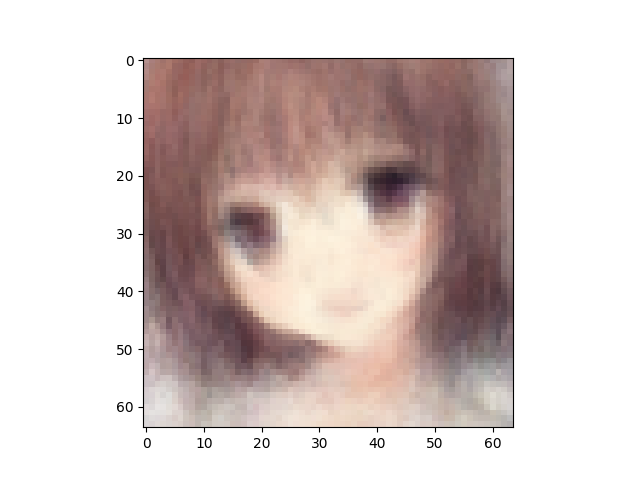
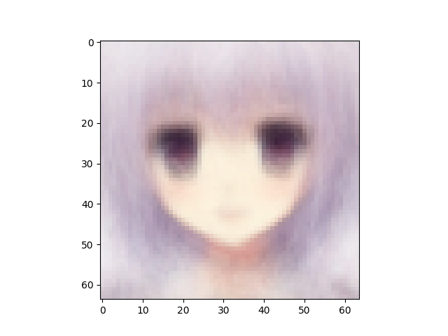
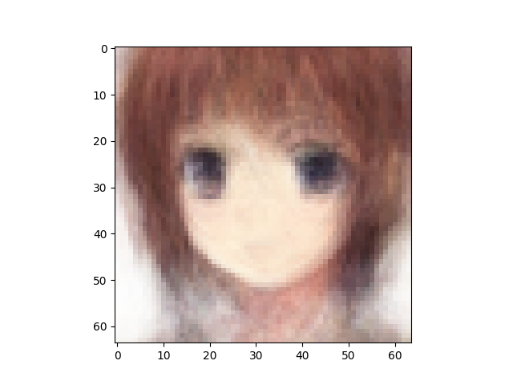
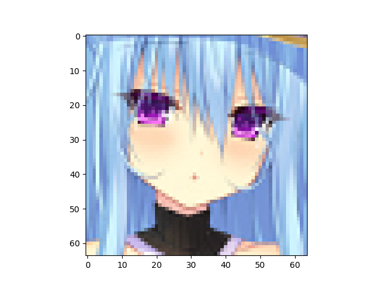
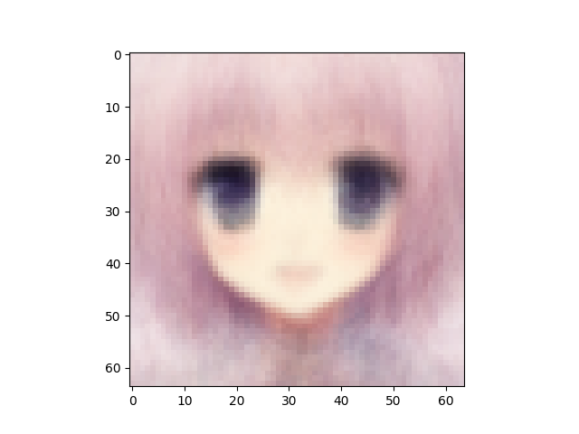
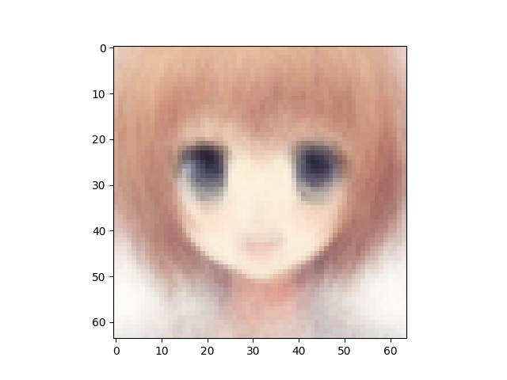
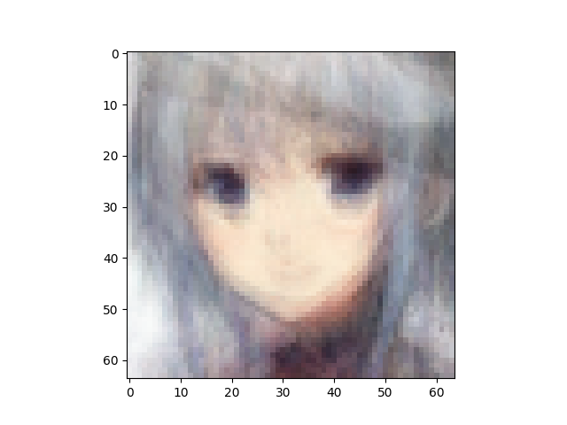

VAE number of latent variables 	512

VAE number of hidden layers 	5

VAE number of hidden nodes per layer 	1024

LogReg number of hidden layers 	1

LogReg number of hidden nodes per layer 	1024

Number of epochs trained 	200

Epoch0, VAE Training loss 7360.04639, LogReg Training loss 5.8430304527, Time used 6.46

Epoch1, VAE Training loss 7134.50195, LogReg Training loss 2.8627169132, Time used 6.15

Epoch2, VAE Training loss 7111.09375, LogReg Training loss 1.7389996052, Time used 6.66

Epoch3, VAE Training loss 7103.33984, LogReg Training loss 1.2047392130, Time used 6.06

Epoch4, VAE Training loss 7070.09424, LogReg Training loss 1.3197119236, Time used 6.10

Epoch5, VAE Training loss 6986.59082, LogReg Training loss 1.3578436375, Time used 6.16

Epoch6, VAE Training loss 6959.84180, LogReg Training loss 1.1389664412, Time used 6.29

Epoch7, VAE Training loss 6943.59424, LogReg Training loss 1.1329356432, Time used 6.05

Epoch8, VAE Training loss 6932.67334, LogReg Training loss 0.9004225135, Time used 6.05

Epoch9, VAE Training loss 6920.19629, LogReg Training loss 0.9259946346, Time used 6.18

Epoch10, VAE Training loss 6908.70850, LogReg Training loss 0.8882451057, Time used 6.07

Epoch11, VAE Training loss 6885.06201, LogReg Training loss 0.8849569559, Time used 6.09

Epoch12, VAE Training loss 6866.32324, LogReg Training loss 0.8736777902, Time used 6.08

Epoch13, VAE Training loss 6855.00879, LogReg Training loss 0.8571773767, Time used 6.01

Epoch14, VAE Training loss 6851.57861, LogReg Training loss 0.8711004257, Time used 6.05

Epoch15, VAE Training loss 6843.00195, LogReg Training loss 0.8537207842, Time used 6.06

Epoch16, VAE Training loss 6843.01221, LogReg Training loss 0.8539322615, Time used 6.06

Epoch17, VAE Training loss 6834.42725, LogReg Training loss 0.8227265477, Time used 6.06

Epoch18, VAE Training loss 6833.35010, LogReg Training loss 0.8134344220, Time used 6.07

Epoch19, VAE Training loss 6823.73340, LogReg Training loss 0.8063006401, Time used 6.03

Epoch20, VAE Training loss 6821.54053, LogReg Training loss 0.8172133565, Time used 6.23

Epoch21, VAE Training loss 6818.25830, LogReg Training loss 0.7951892018, Time used 6.06

Epoch22, VAE Training loss 6813.81396, LogReg Training loss 0.8120403886, Time used 6.06

Epoch23, VAE Training loss 6812.84424, LogReg Training loss 0.8036876917, Time used 6.07

Epoch24, VAE Training loss 6812.57959, LogReg Training loss 0.7725910544, Time used 6.05

Epoch25, VAE Training loss 6808.06299, LogReg Training loss 0.8080700636, Time used 6.07

Epoch26, VAE Training loss 6799.35059, LogReg Training loss 0.7955224514, Time used 6.05

Epoch27, VAE Training loss 6801.74414, LogReg Training loss 0.8034648895, Time used 6.07

Epoch28, VAE Training loss 6794.89795, LogReg Training loss 0.7846829891, Time used 6.07

Epoch29, VAE Training loss 6797.34521, LogReg Training loss 0.7728690505, Time used 6.05

Epoch30, VAE Training loss 6799.31543, LogReg Training loss 0.7953191400, Time used 6.04

Epoch31, VAE Training loss 6787.23389, LogReg Training loss 0.7739514112, Time used 6.03

Epoch32, VAE Training loss 6798.51025, LogReg Training loss 0.7938538194, Time used 6.06

Epoch33, VAE Training loss 6782.97607, LogReg Training loss 0.7889099121, Time used 6.04

Epoch34, VAE Training loss 6782.98926, LogReg Training loss 0.7908985615, Time used 6.00

Epoch35, VAE Training loss 6783.03711, LogReg Training loss 0.7914068103, Time used 5.99

Epoch36, VAE Training loss 6783.59863, LogReg Training loss 0.7899216413, Time used 6.00

Epoch37, VAE Training loss 6778.51758, LogReg Training loss 0.7615176439, Time used 6.04

Epoch38, VAE Training loss 6775.47412, LogReg Training loss 0.7952278256, Time used 6.05

Epoch39, VAE Training loss 6768.26221, LogReg Training loss 0.8190845847, Time used 6.03

Epoch40, VAE Training loss 6769.15820, LogReg Training loss 0.8134601712, Time used 6.06

Epoch41, VAE Training loss 6761.17676, LogReg Training loss 0.8081286550, Time used 6.04

Epoch42, VAE Training loss 6775.98096, LogReg Training loss 0.7917649150, Time used 6.05

Epoch43, VAE Training loss 6778.03369, LogReg Training loss 0.7794815898, Time used 6.05

Epoch44, VAE Training loss 6766.51416, LogReg Training loss 0.8220124245, Time used 6.00

Epoch45, VAE Training loss 6762.45557, LogReg Training loss 0.8139829636, Time used 5.99

Epoch46, VAE Training loss 6751.52393, LogReg Training loss 0.8441743255, Time used 5.99

Epoch47, VAE Training loss 6761.75439, LogReg Training loss 0.7759262919, Time used 6.03

Epoch48, VAE Training loss 6760.90234, LogReg Training loss 0.8171198368, Time used 6.66

Epoch49, VAE Training loss 6756.71143, LogReg Training loss 0.7847135067, Time used 6.01

Epoch50, VAE Training loss 6767.70264, LogReg Training loss 0.8058176041, Time used 6.37

Epoch51, VAE Training loss 6750.61865, LogReg Training loss 0.7910190225, Time used 6.08

Epoch52, VAE Training loss 6748.83154, LogReg Training loss 0.8261133432, Time used 6.06

Epoch53, VAE Training loss 6745.88135, LogReg Training loss 0.8091432452, Time used 6.10

Epoch54, VAE Training loss 6743.95508, LogReg Training loss 0.8226559162, Time used 6.09

Epoch55, VAE Training loss 6744.38721, LogReg Training loss 0.8288647532, Time used 6.09

Epoch56, VAE Training loss 6740.18408, LogReg Training loss 0.7987654209, Time used 6.04

Epoch57, VAE Training loss 6743.04004, LogReg Training loss 0.8464502692, Time used 6.09

Epoch58, VAE Training loss 6739.32715, LogReg Training loss 0.8022449017, Time used 6.03

Epoch59, VAE Training loss 6736.73047, LogReg Training loss 0.8146573305, Time used 6.15

Epoch60, VAE Training loss 6735.76660, LogReg Training loss 0.8441723585, Time used 6.05

Epoch61, VAE Training loss 6734.70264, LogReg Training loss 0.8229858279, Time used 6.04

Epoch62, VAE Training loss 6728.25977, LogReg Training loss 0.8540043831, Time used 6.08

Epoch63, VAE Training loss 6734.13525, LogReg Training loss 0.8646180034, Time used 6.08

Epoch64, VAE Training loss 6724.47754, LogReg Training loss 0.8044841886, Time used 6.05

Epoch65, VAE Training loss 6739.03320, LogReg Training loss 0.8094933629, Time used 6.08

Epoch66, VAE Training loss 6727.18311, LogReg Training loss 0.8897710443, Time used 6.09

Epoch67, VAE Training loss 6724.10010, LogReg Training loss 0.8029900193, Time used 6.09

Epoch68, VAE Training loss 6720.54834, LogReg Training loss 0.8533455133, Time used 6.53

Epoch69, VAE Training loss 6724.32666, LogReg Training loss 0.8376465440, Time used 6.42

Epoch70, VAE Training loss 6724.23486, LogReg Training loss 0.8506184816, Time used 6.05

Epoch71, VAE Training loss 6722.89258, LogReg Training loss 0.8284802437, Time used 6.07

Epoch72, VAE Training loss 6718.41455, LogReg Training loss 0.8312168121, Time used 6.06

Epoch73, VAE Training loss 6714.37305, LogReg Training loss 0.8444325924, Time used 6.09

Epoch74, VAE Training loss 6745.22754, LogReg Training loss 0.7849861383, Time used 6.04

Epoch75, VAE Training loss 6731.87207, LogReg Training loss 0.7988808155, Time used 6.04

Epoch76, VAE Training loss 6714.04150, LogReg Training loss 0.8230730891, Time used 6.06

Epoch77, VAE Training loss 6715.30811, LogReg Training loss 0.8458203077, Time used 6.07

Epoch78, VAE Training loss 6712.11279, LogReg Training loss 0.8485947251, Time used 6.08

Epoch79, VAE Training loss 6713.76270, LogReg Training loss 0.8325866461, Time used 6.21

Epoch80, VAE Training loss 6713.70947, LogReg Training loss 0.8297357559, Time used 6.04

Epoch81, VAE Training loss 6715.87402, LogReg Training loss 0.8207620978, Time used 6.04

Epoch82, VAE Training loss 6703.87598, LogReg Training loss 0.8262087107, Time used 6.05

Epoch83, VAE Training loss 6711.96094, LogReg Training loss 0.8625267744, Time used 6.07

Epoch84, VAE Training loss 6726.67480, LogReg Training loss 0.8062531352, Time used 6.07

Epoch85, VAE Training loss 6732.79248, LogReg Training loss 0.7967402339, Time used 6.02

Epoch86, VAE Training loss 6726.76221, LogReg Training loss 0.8087064624, Time used 6.04

Epoch87, VAE Training loss 6708.96143, LogReg Training loss 0.8429489732, Time used 6.69

Epoch88, VAE Training loss 6702.61816, LogReg Training loss 0.8501091003, Time used 6.63

Epoch89, VAE Training loss 6713.63037, LogReg Training loss 0.8198404312, Time used 6.10

Epoch90, VAE Training loss 6706.17871, LogReg Training loss 0.8562670946, Time used 5.99

Epoch91, VAE Training loss 6703.62891, LogReg Training loss 0.8703491092, Time used 6.02

Epoch92, VAE Training loss 6696.47705, LogReg Training loss 0.8486772776, Time used 6.03

Epoch93, VAE Training loss 6700.87646, LogReg Training loss 0.8405823112, Time used 6.02

Epoch94, VAE Training loss 6691.83105, LogReg Training loss 0.8417590261, Time used 6.05

Epoch95, VAE Training loss 6709.39990, LogReg Training loss 0.8438107967, Time used 6.01

Epoch96, VAE Training loss 6700.94727, LogReg Training loss 0.8556248546, Time used 6.39

Epoch97, VAE Training loss 6695.22705, LogReg Training loss 0.8458483815, Time used 7.54

Epoch98, VAE Training loss 6693.13770, LogReg Training loss 0.8763194680, Time used 6.36

Epoch99, VAE Training loss 6686.39160, LogReg Training loss 0.8518046141, Time used 6.05

Epoch100, VAE Training loss 6707.50391, LogReg Training loss 0.8523075581, Time used 6.02

Epoch101, VAE Training loss 6709.72949, LogReg Training loss 0.8440774083, Time used 6.08

Epoch102, VAE Training loss 6696.19629, LogReg Training loss 0.8565125465, Time used 6.11

Epoch103, VAE Training loss 6694.12012, LogReg Training loss 0.8470100164, Time used 6.07

Epoch104, VAE Training loss 6690.73926, LogReg Training loss 0.8618727922, Time used 6.05

Epoch105, VAE Training loss 6689.37695, LogReg Training loss 0.8746064305, Time used 6.04

Epoch106, VAE Training loss 6688.13379, LogReg Training loss 0.8860903978, Time used 6.08

Epoch107, VAE Training loss 6696.80420, LogReg Training loss 0.8224055767, Time used 6.26

Epoch108, VAE Training loss 6686.25000, LogReg Training loss 0.8761337996, Time used 6.67

Epoch109, VAE Training loss 6682.61230, LogReg Training loss 0.8763894439, Time used 6.11

Epoch110, VAE Training loss 6683.50244, LogReg Training loss 0.8812109232, Time used 5.93

Epoch111, VAE Training loss 6678.64453, LogReg Training loss 0.8955891728, Time used 5.90

Epoch112, VAE Training loss 6690.65625, LogReg Training loss 0.8423834443, Time used 5.92

Epoch113, VAE Training loss 6688.13379, LogReg Training loss 0.8727369308, Time used 5.96

Epoch114, VAE Training loss 6688.21191, LogReg Training loss 0.8784524202, Time used 5.97

Epoch115, VAE Training loss 6681.48242, LogReg Training loss 0.8798047304, Time used 5.99

Epoch116, VAE Training loss 6680.00195, LogReg Training loss 0.8648682833, Time used 6.00

Epoch117, VAE Training loss 6693.06689, LogReg Training loss 0.8783271909, Time used 5.99

Epoch118, VAE Training loss 6679.00098, LogReg Training loss 0.8850234151, Time used 6.00

Epoch119, VAE Training loss 6689.03418, LogReg Training loss 0.8816117048, Time used 6.00

Epoch120, VAE Training loss 6679.03955, LogReg Training loss 0.8741959333, Time used 5.99

Epoch121, VAE Training loss 6684.96680, LogReg Training loss 0.8802039623, Time used 5.99

Epoch122, VAE Training loss 6673.33350, LogReg Training loss 0.8705448508, Time used 6.25

Epoch123, VAE Training loss 6671.55176, LogReg Training loss 0.8813226819, Time used 6.22

Epoch124, VAE Training loss 6687.51660, LogReg Training loss 0.8841751218, Time used 6.47

Epoch125, VAE Training loss 6682.07520, LogReg Training loss 0.8700680137, Time used 6.82

Epoch126, VAE Training loss 6674.51660, LogReg Training loss 0.8998847008, Time used 6.02

Epoch127, VAE Training loss 6681.97314, LogReg Training loss 0.8777440786, Time used 6.01

Epoch128, VAE Training loss 6678.19092, LogReg Training loss 0.8817505836, Time used 6.01

Epoch129, VAE Training loss 6668.55859, LogReg Training loss 0.8928021193, Time used 6.02

Epoch130, VAE Training loss 6674.70361, LogReg Training loss 0.8775502443, Time used 5.99

Epoch131, VAE Training loss 6668.98682, LogReg Training loss 0.9265910983, Time used 6.03

Epoch132, VAE Training loss 6671.35791, LogReg Training loss 0.8842033148, Time used 6.03

Epoch133, VAE Training loss 6688.88330, LogReg Training loss 0.8545314670, Time used 6.00

Epoch134, VAE Training loss 6675.81104, LogReg Training loss 0.8991821408, Time used 6.02

Epoch135, VAE Training loss 6669.89453, LogReg Training loss 0.9057154059, Time used 5.99

Epoch136, VAE Training loss 6661.37793, LogReg Training loss 0.9223943353, Time used 6.00

Epoch137, VAE Training loss 6674.65479, LogReg Training loss 0.8782891631, Time used 6.01

Epoch138, VAE Training loss 6661.32959, LogReg Training loss 0.8975570202, Time used 6.09

Epoch139, VAE Training loss 6666.54541, LogReg Training loss 0.8893510699, Time used 6.04

Epoch140, VAE Training loss 6667.42139, LogReg Training loss 0.9019001722, Time used 6.01

Epoch141, VAE Training loss 6685.44092, LogReg Training loss 0.8541112542, Time used 6.03

Epoch142, VAE Training loss 6664.95996, LogReg Training loss 0.9149210453, Time used 6.02

Epoch143, VAE Training loss 6678.68604, LogReg Training loss 0.8739823103, Time used 5.98

Epoch144, VAE Training loss 6663.12061, LogReg Training loss 0.9091587663, Time used 5.97

Epoch145, VAE Training loss 6663.13428, LogReg Training loss 0.9063477516, Time used 6.02

Epoch146, VAE Training loss 6671.17773, LogReg Training loss 0.8768397570, Time used 6.04

Epoch147, VAE Training loss 6656.27148, LogReg Training loss 0.9039478898, Time used 6.06

Epoch148, VAE Training loss 6660.97754, LogReg Training loss 0.8914061189, Time used 6.00

Epoch149, VAE Training loss 6682.45605, LogReg Training loss 0.8656897545, Time used 5.99

Epoch150, VAE Training loss 6663.14062, LogReg Training loss 0.9103177190, Time used 5.98

Epoch151, VAE Training loss 6650.83691, LogReg Training loss 0.9098082185, Time used 5.97

Epoch152, VAE Training loss 6650.67676, LogReg Training loss 0.9045308232, Time used 6.03

Epoch153, VAE Training loss 6653.94922, LogReg Training loss 0.9089239240, Time used 5.97

Epoch154, VAE Training loss 6660.81494, LogReg Training loss 0.8958280683, Time used 5.98

Epoch155, VAE Training loss 6661.05420, LogReg Training loss 0.9134772420, Time used 6.37

Epoch156, VAE Training loss 6665.32666, LogReg Training loss 0.8730702400, Time used 6.02

Epoch157, VAE Training loss 6663.18359, LogReg Training loss 0.8931007385, Time used 6.01

Epoch158, VAE Training loss 6687.12842, LogReg Training loss 0.8559402823, Time used 5.95

Epoch159, VAE Training loss 6650.38721, LogReg Training loss 0.9113928676, Time used 5.95

Epoch160, VAE Training loss 6654.07568, LogReg Training loss 0.8985953927, Time used 5.99

Epoch161, VAE Training loss 6647.23438, LogReg Training loss 0.9191114902, Time used 5.98

Epoch162, VAE Training loss 6644.62695, LogReg Training loss 0.9139969945, Time used 6.02

Epoch163, VAE Training loss 6647.52686, LogReg Training loss 0.9115406275, Time used 6.00

Epoch164, VAE Training loss 6658.05322, LogReg Training loss 0.9113227725, Time used 6.19

Epoch165, VAE Training loss 6649.03320, LogReg Training loss 0.9113094807, Time used 5.89

Epoch166, VAE Training loss 6663.94727, LogReg Training loss 0.8922505379, Time used 5.90

Epoch167, VAE Training loss 6688.41699, LogReg Training loss 0.8392142057, Time used 5.99

Epoch168, VAE Training loss 6656.72803, LogReg Training loss 0.9134750366, Time used 6.28

Epoch169, VAE Training loss 6655.18018, LogReg Training loss 0.8969106078, Time used 6.00

Epoch170, VAE Training loss 6660.13037, LogReg Training loss 0.8993656039, Time used 5.96

Epoch171, VAE Training loss 6648.05469, LogReg Training loss 0.9109161496, Time used 5.95

Epoch172, VAE Training loss 6638.96094, LogReg Training loss 0.9252821207, Time used 6.01

Epoch173, VAE Training loss 6645.91846, LogReg Training loss 0.9183882475, Time used 6.00

Epoch174, VAE Training loss 6653.86230, LogReg Training loss 0.9112526774, Time used 6.03

Epoch175, VAE Training loss 6636.28662, LogReg Training loss 0.9143148661, Time used 6.02

Epoch176, VAE Training loss 6653.33691, LogReg Training loss 0.9191431999, Time used 6.02

Epoch177, VAE Training loss 6647.18896, LogReg Training loss 0.9119337201, Time used 5.95

Epoch178, VAE Training loss 6641.63037, LogReg Training loss 0.9182525873, Time used 5.92

Epoch179, VAE Training loss 6641.87061, LogReg Training loss 0.9123986363, Time used 5.97

Epoch180, VAE Training loss 6632.66846, LogReg Training loss 0.9444416165, Time used 6.01

Epoch181, VAE Training loss 6657.95361, LogReg Training loss 0.8899478912, Time used 6.03

Epoch182, VAE Training loss 6642.39648, LogReg Training loss 0.9166761637, Time used 6.04

Epoch183, VAE Training loss 6641.03857, LogReg Training loss 0.9516195655, Time used 6.03

Epoch184, VAE Training loss 6673.31006, LogReg Training loss 0.8715977073, Time used 6.02

Epoch185, VAE Training loss 6652.88330, LogReg Training loss 0.9101784229, Time used 6.05

Epoch186, VAE Training loss 6640.84033, LogReg Training loss 0.9138933420, Time used 6.01

Epoch187, VAE Training loss 6643.19971, LogReg Training loss 0.9078933597, Time used 6.01

Epoch188, VAE Training loss 6636.51123, LogReg Training loss 0.9207758307, Time used 6.05

Epoch189, VAE Training loss 6635.50879, LogReg Training loss 0.9381885529, Time used 6.04

Epoch190, VAE Training loss 6645.70654, LogReg Training loss 0.9049251676, Time used 6.13

Epoch191, VAE Training loss 6647.03418, LogReg Training loss 0.9402186871, Time used 5.95

Epoch192, VAE Training loss 6642.73779, LogReg Training loss 0.8993068933, Time used 5.92

Epoch193, VAE Training loss 6655.12695, LogReg Training loss 0.8955524564, Time used 5.96

Epoch194, VAE Training loss 6650.16895, LogReg Training loss 0.9363047481, Time used 6.00

Epoch195, VAE Training loss 6626.44727, LogReg Training loss 0.9570259452, Time used 6.04

Epoch196, VAE Training loss 6623.45020, LogReg Training loss 0.9533544183, Time used 6.02

Epoch197, VAE Training loss 6632.32568, LogReg Training loss 0.8937230110, Time used 6.16

Epoch198, VAE Training loss 6641.27295, LogReg Training loss 0.9128193259, Time used 6.80

Epoch199, VAE Training loss 6640.94482, LogReg Training loss 0.9068558812, Time used 6.16

