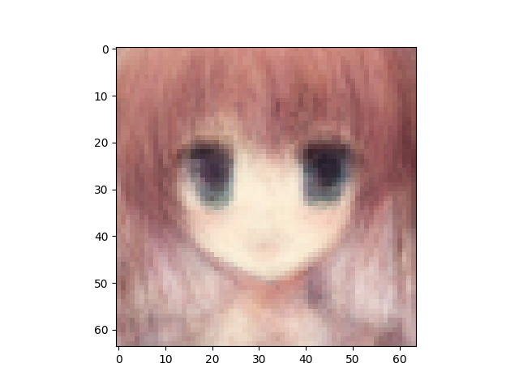
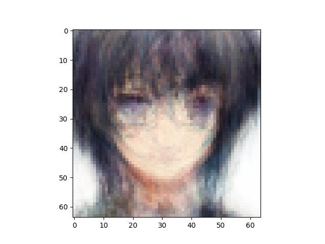
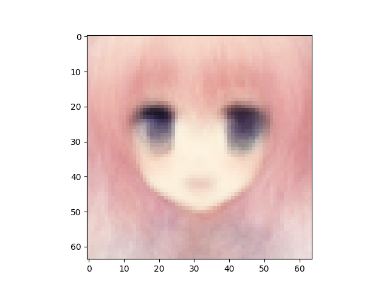

VAE number of latent variables 	512

VAE number of hidden layers 	5

VAE number of hidden nodes per layer 	1024

LogReg number of hidden layers 	1

LogReg number of hidden nodes per layer 	1024

Number of epochs trained 	200

Epoch0, VAE Training loss 7336.83252, LogReg Training loss 6.9240841866, Time used 7.42

Epoch1, VAE Training loss 7134.37939, LogReg Training loss 3.1618425846, Time used 7.00

Epoch2, VAE Training loss 7113.64160, LogReg Training loss 1.7173078060, Time used 6.32

Epoch3, VAE Training loss 7101.75439, LogReg Training loss 1.0673722029, Time used 7.06

Epoch4, VAE Training loss 7057.56201, LogReg Training loss 1.2319082022, Time used 6.45

Epoch5, VAE Training loss 6988.83154, LogReg Training loss 1.3259435892, Time used 6.45

Epoch6, VAE Training loss 6966.56104, LogReg Training loss 1.0561848879, Time used 6.89

Epoch7, VAE Training loss 6954.25098, LogReg Training loss 0.8640276194, Time used 6.84

Epoch8, VAE Training loss 6946.08643, LogReg Training loss 0.7650299072, Time used 6.60

Epoch9, VAE Training loss 6938.41846, LogReg Training loss 0.7453030348, Time used 6.59

Epoch10, VAE Training loss 6922.73438, LogReg Training loss 0.7610694766, Time used 6.57

Epoch11, VAE Training loss 6898.61377, LogReg Training loss 0.7686545849, Time used 6.21

Epoch12, VAE Training loss 6878.34814, LogReg Training loss 0.8148360252, Time used 6.48

Epoch13, VAE Training loss 6866.24707, LogReg Training loss 0.8449863195, Time used 6.43

Epoch14, VAE Training loss 6855.76270, LogReg Training loss 0.8855110407, Time used 6.41

Epoch15, VAE Training loss 6847.48242, LogReg Training loss 0.8459841609, Time used 6.83

Epoch16, VAE Training loss 6840.93066, LogReg Training loss 0.8696848750, Time used 6.89

Epoch17, VAE Training loss 6832.01465, LogReg Training loss 0.8674887419, Time used 7.23

Epoch18, VAE Training loss 6820.16553, LogReg Training loss 0.8933443427, Time used 6.46

Epoch19, VAE Training loss 6807.23975, LogReg Training loss 0.8856073618, Time used 7.13

Epoch20, VAE Training loss 6802.41504, LogReg Training loss 0.8864036202, Time used 6.74

Epoch21, VAE Training loss 6800.15479, LogReg Training loss 0.8662258983, Time used 6.49

Epoch22, VAE Training loss 6790.75244, LogReg Training loss 0.8931531310, Time used 6.55

Epoch23, VAE Training loss 6787.45264, LogReg Training loss 0.8836503029, Time used 6.96

Epoch24, VAE Training loss 6784.28857, LogReg Training loss 0.8715782166, Time used 6.80

Epoch25, VAE Training loss 6776.62500, LogReg Training loss 0.9019985795, Time used 6.58

Epoch26, VAE Training loss 6776.12695, LogReg Training loss 0.8584820628, Time used 6.69

Epoch27, VAE Training loss 6769.62646, LogReg Training loss 0.8824003339, Time used 6.67

Epoch28, VAE Training loss 6765.97119, LogReg Training loss 0.8706299067, Time used 6.69

Epoch29, VAE Training loss 6767.00977, LogReg Training loss 0.8947776556, Time used 6.69

Epoch30, VAE Training loss 6759.84424, LogReg Training loss 0.8745062947, Time used 6.97

Epoch31, VAE Training loss 6752.53516, LogReg Training loss 0.8905798793, Time used 6.88

Epoch32, VAE Training loss 6749.28955, LogReg Training loss 0.8841351271, Time used 6.70

Epoch33, VAE Training loss 6746.87695, LogReg Training loss 0.8710412979, Time used 6.70

Epoch34, VAE Training loss 6744.78809, LogReg Training loss 0.8912543058, Time used 6.68

Epoch35, VAE Training loss 6738.41309, LogReg Training loss 0.8951379657, Time used 6.85

Epoch36, VAE Training loss 6738.06299, LogReg Training loss 0.8915879726, Time used 7.31

Epoch37, VAE Training loss 6734.43604, LogReg Training loss 0.9109563231, Time used 7.34

Epoch38, VAE Training loss 6730.23438, LogReg Training loss 0.9175042510, Time used 6.35

Epoch39, VAE Training loss 6722.45801, LogReg Training loss 0.8897917867, Time used 6.66

Epoch40, VAE Training loss 6727.99707, LogReg Training loss 0.8895102143, Time used 6.63

Epoch41, VAE Training loss 6721.80176, LogReg Training loss 0.8952124715, Time used 6.45

Epoch42, VAE Training loss 6717.56592, LogReg Training loss 0.9217321873, Time used 6.79

Epoch43, VAE Training loss 6716.26758, LogReg Training loss 0.8646475077, Time used 6.80

Epoch44, VAE Training loss 6712.04590, LogReg Training loss 0.9160997272, Time used 6.41

Epoch45, VAE Training loss 6711.74316, LogReg Training loss 0.9178109169, Time used 6.86

Epoch46, VAE Training loss 6710.25293, LogReg Training loss 0.8823249340, Time used 6.53

Epoch47, VAE Training loss 6706.19531, LogReg Training loss 0.9073681831, Time used 6.85

Epoch48, VAE Training loss 6705.37451, LogReg Training loss 0.8930128217, Time used 6.66

Epoch49, VAE Training loss 6700.16992, LogReg Training loss 0.8870395422, Time used 6.52

Epoch50, VAE Training loss 6702.29883, LogReg Training loss 0.9148139954, Time used 6.52

Epoch51, VAE Training loss 6704.59082, LogReg Training loss 0.9028041363, Time used 6.91

Epoch52, VAE Training loss 6702.26270, LogReg Training loss 0.8614565134, Time used 6.56

Epoch53, VAE Training loss 6697.91211, LogReg Training loss 0.9005791545, Time used 6.79

Epoch54, VAE Training loss 6693.06006, LogReg Training loss 0.9106103778, Time used 6.58

Epoch55, VAE Training loss 6686.09082, LogReg Training loss 0.8819913268, Time used 6.97

Epoch56, VAE Training loss 6688.25830, LogReg Training loss 0.9415114522, Time used 6.98

Epoch57, VAE Training loss 6684.03564, LogReg Training loss 0.9244951606, Time used 6.74

Epoch58, VAE Training loss 6688.16211, LogReg Training loss 0.8693130016, Time used 6.60

Epoch59, VAE Training loss 6688.76123, LogReg Training loss 0.8785134554, Time used 6.78

Epoch60, VAE Training loss 6681.94531, LogReg Training loss 0.9291703105, Time used 7.07

Epoch61, VAE Training loss 6677.24219, LogReg Training loss 0.9164818525, Time used 6.44

Epoch62, VAE Training loss 6681.90625, LogReg Training loss 0.8875519633, Time used 6.57

Epoch63, VAE Training loss 6680.64258, LogReg Training loss 0.8996273279, Time used 6.71

Epoch64, VAE Training loss 6677.91504, LogReg Training loss 0.9198650122, Time used 6.57

Epoch65, VAE Training loss 6674.95215, LogReg Training loss 0.9177554250, Time used 6.92

Epoch66, VAE Training loss 6670.63184, LogReg Training loss 0.9394556880, Time used 6.49

Epoch67, VAE Training loss 6674.48535, LogReg Training loss 0.8968960643, Time used 7.14

Epoch68, VAE Training loss 6671.12500, LogReg Training loss 0.9317030311, Time used 6.49

Epoch69, VAE Training loss 6669.05908, LogReg Training loss 0.9042274952, Time used 6.66

Epoch70, VAE Training loss 6669.52295, LogReg Training loss 0.9349164367, Time used 6.87

Epoch71, VAE Training loss 6662.18408, LogReg Training loss 0.9127322435, Time used 6.79

Epoch72, VAE Training loss 6666.28906, LogReg Training loss 0.8974944949, Time used 6.51

Epoch73, VAE Training loss 6659.81396, LogReg Training loss 0.9302395582, Time used 6.29

Epoch74, VAE Training loss 6658.66650, LogReg Training loss 0.9196881056, Time used 6.30

Epoch75, VAE Training loss 6666.26953, LogReg Training loss 0.9186471701, Time used 6.60

Epoch76, VAE Training loss 6663.74072, LogReg Training loss 0.8914264441, Time used 6.81

Epoch77, VAE Training loss 6654.75195, LogReg Training loss 0.9472992420, Time used 6.61

Epoch78, VAE Training loss 6650.46484, LogReg Training loss 0.9514955878, Time used 6.89

Epoch79, VAE Training loss 6654.77783, LogReg Training loss 0.9468050599, Time used 7.01

Epoch80, VAE Training loss 6655.98584, LogReg Training loss 0.9270514846, Time used 6.60

Epoch81, VAE Training loss 6657.74121, LogReg Training loss 0.9005165100, Time used 6.83

Epoch82, VAE Training loss 6654.69678, LogReg Training loss 0.9455130100, Time used 6.38

Epoch83, VAE Training loss 6656.25635, LogReg Training loss 0.9305463433, Time used 6.79

Epoch84, VAE Training loss 6649.72119, LogReg Training loss 0.9009467363, Time used 6.64

Epoch85, VAE Training loss 6648.00439, LogReg Training loss 0.9351813793, Time used 7.04

Epoch86, VAE Training loss 6644.68799, LogReg Training loss 0.9272570610, Time used 6.52

Epoch87, VAE Training loss 6648.83008, LogReg Training loss 0.9222218990, Time used 6.79

Epoch88, VAE Training loss 6645.04834, LogReg Training loss 0.9534040689, Time used 6.93

Epoch89, VAE Training loss 6652.51904, LogReg Training loss 0.9281275868, Time used 6.46

Epoch90, VAE Training loss 6645.69238, LogReg Training loss 0.9353929758, Time used 6.49

Epoch91, VAE Training loss 6653.86279, LogReg Training loss 0.9306878448, Time used 6.39

Epoch92, VAE Training loss 6639.08447, LogReg Training loss 0.8993492126, Time used 6.35

Epoch93, VAE Training loss 6637.32275, LogReg Training loss 0.9423308969, Time used 6.40

Epoch94, VAE Training loss 6637.56055, LogReg Training loss 0.9464045763, Time used 6.69

Epoch95, VAE Training loss 6639.31592, LogReg Training loss 0.9153482914, Time used 6.52

Epoch96, VAE Training loss 6636.44092, LogReg Training loss 0.9315952063, Time used 6.65

Epoch97, VAE Training loss 6635.70215, LogReg Training loss 0.9453392029, Time used 6.93

Epoch98, VAE Training loss 6638.64893, LogReg Training loss 0.9460672140, Time used 6.55

Epoch99, VAE Training loss 6637.13770, LogReg Training loss 0.9222124219, Time used 6.51

Epoch100, VAE Training loss 6631.02783, LogReg Training loss 0.9322490692, Time used 6.54

Epoch101, VAE Training loss 6633.34619, LogReg Training loss 0.9330436587, Time used 6.68

Epoch102, VAE Training loss 6642.44922, LogReg Training loss 0.9302470684, Time used 6.72

Epoch103, VAE Training loss 6638.33691, LogReg Training loss 0.9249622226, Time used 6.57

Epoch104, VAE Training loss 6636.96875, LogReg Training loss 0.9159792066, Time used 6.97

Epoch105, VAE Training loss 6630.49609, LogReg Training loss 0.9767627716, Time used 6.95

Epoch106, VAE Training loss 6629.47803, LogReg Training loss 0.9617218971, Time used 6.53

Epoch107, VAE Training loss 6632.17139, LogReg Training loss 0.9500703216, Time used 6.62

Epoch108, VAE Training loss 6628.43164, LogReg Training loss 0.9181020856, Time used 6.66

Epoch109, VAE Training loss 6624.07520, LogReg Training loss 0.9509682059, Time used 6.34

Epoch110, VAE Training loss 6639.38428, LogReg Training loss 0.9393914342, Time used 6.88

Epoch111, VAE Training loss 6625.18506, LogReg Training loss 0.9611139297, Time used 6.71

Epoch112, VAE Training loss 6626.36035, LogReg Training loss 0.9450228214, Time used 6.60

Epoch113, VAE Training loss 6625.95264, LogReg Training loss 0.9421806335, Time used 6.55

Epoch114, VAE Training loss 6618.74463, LogReg Training loss 0.9628831744, Time used 6.55

Epoch115, VAE Training loss 6623.58154, LogReg Training loss 0.9260178208, Time used 6.83

Epoch116, VAE Training loss 6625.07520, LogReg Training loss 0.9598293900, Time used 6.67

Epoch117, VAE Training loss 6628.62354, LogReg Training loss 0.9420320988, Time used 7.04

Epoch118, VAE Training loss 6626.84863, LogReg Training loss 0.9440063834, Time used 6.97

Epoch119, VAE Training loss 6628.89600, LogReg Training loss 0.9201756716, Time used 6.37

Epoch120, VAE Training loss 6619.82178, LogReg Training loss 0.9851709604, Time used 6.39

Epoch121, VAE Training loss 6613.28760, LogReg Training loss 0.9437241554, Time used 6.76

Epoch122, VAE Training loss 6624.56396, LogReg Training loss 0.9681063294, Time used 6.41

Epoch123, VAE Training loss 6623.38818, LogReg Training loss 0.9472442269, Time used 6.67

Epoch124, VAE Training loss 6612.14258, LogReg Training loss 0.9597241282, Time used 6.66

Epoch125, VAE Training loss 6618.95703, LogReg Training loss 0.9805562496, Time used 6.81

Epoch126, VAE Training loss 6618.64893, LogReg Training loss 0.9290664196, Time used 6.55

Epoch127, VAE Training loss 6613.27441, LogReg Training loss 0.9774369001, Time used 6.63

Epoch128, VAE Training loss 6612.19824, LogReg Training loss 0.9816378951, Time used 6.51

Epoch129, VAE Training loss 6611.64404, LogReg Training loss 0.9413713813, Time used 6.55

Epoch130, VAE Training loss 6613.42285, LogReg Training loss 0.9589579105, Time used 6.25

Epoch131, VAE Training loss 6627.24902, LogReg Training loss 0.9299272299, Time used 6.80

Epoch132, VAE Training loss 6622.13525, LogReg Training loss 0.9669979811, Time used 6.95

Epoch133, VAE Training loss 6610.13184, LogReg Training loss 0.9675421715, Time used 6.76

Epoch134, VAE Training loss 6611.91846, LogReg Training loss 0.9594057202, Time used 6.84

Epoch135, VAE Training loss 6610.58447, LogReg Training loss 0.9863486886, Time used 6.28

Epoch136, VAE Training loss 6607.37109, LogReg Training loss 0.9639933109, Time used 6.76

Epoch137, VAE Training loss 6608.05469, LogReg Training loss 0.9582849741, Time used 6.50

Epoch138, VAE Training loss 6612.78516, LogReg Training loss 0.9782102108, Time used 7.06

Epoch139, VAE Training loss 6611.34375, LogReg Training loss 0.9544655085, Time used 7.12

Epoch140, VAE Training loss 6608.66797, LogReg Training loss 0.9557874799, Time used 6.55

Epoch141, VAE Training loss 6606.15039, LogReg Training loss 0.9602172971, Time used 6.47

Epoch142, VAE Training loss 6604.27490, LogReg Training loss 0.9605555534, Time used 6.39

Epoch143, VAE Training loss 6604.88867, LogReg Training loss 0.9948214889, Time used 7.32

Epoch144, VAE Training loss 6608.56836, LogReg Training loss 0.9632569551, Time used 6.91

Epoch145, VAE Training loss 6612.80908, LogReg Training loss 0.9327768683, Time used 6.79

Epoch146, VAE Training loss 6607.42969, LogReg Training loss 0.9904935360, Time used 6.61

Epoch147, VAE Training loss 6603.35693, LogReg Training loss 0.9908380508, Time used 6.71

Epoch148, VAE Training loss 6603.80225, LogReg Training loss 0.9784554839, Time used 6.87

Epoch149, VAE Training loss 6598.78125, LogReg Training loss 0.9431814551, Time used 6.57

Epoch150, VAE Training loss 6605.41162, LogReg Training loss 0.9673742056, Time used 6.52

Epoch151, VAE Training loss 6610.91504, LogReg Training loss 0.9691453576, Time used 6.86

Epoch152, VAE Training loss 6611.61279, LogReg Training loss 0.9569132328, Time used 6.72

Epoch153, VAE Training loss 6599.22217, LogReg Training loss 0.9817545414, Time used 6.92

Epoch154, VAE Training loss 6603.31104, LogReg Training loss 0.9574940801, Time used 7.28

Epoch155, VAE Training loss 6599.33936, LogReg Training loss 0.9935790896, Time used 6.60

Epoch156, VAE Training loss 6595.35010, LogReg Training loss 0.9639396667, Time used 6.71

Epoch157, VAE Training loss 6600.10107, LogReg Training loss 0.9753832817, Time used 6.63

Epoch158, VAE Training loss 6607.52979, LogReg Training loss 0.9529860020, Time used 6.53

Epoch159, VAE Training loss 6600.26758, LogReg Training loss 0.9918829799, Time used 6.74

Epoch160, VAE Training loss 6607.26465, LogReg Training loss 0.9805069566, Time used 6.92

Epoch161, VAE Training loss 6596.44922, LogReg Training loss 0.9845728278, Time used 6.32

Epoch162, VAE Training loss 6592.52783, LogReg Training loss 0.9820072651, Time used 6.90

Epoch163, VAE Training loss 6593.89014, LogReg Training loss 0.9760633707, Time used 6.45

Epoch164, VAE Training loss 6595.83398, LogReg Training loss 0.9971895814, Time used 7.29

Epoch165, VAE Training loss 6598.32080, LogReg Training loss 0.9549152255, Time used 7.05

Epoch166, VAE Training loss 6588.51953, LogReg Training loss 1.0183274746, Time used 6.77

Epoch167, VAE Training loss 6602.33691, LogReg Training loss 0.9713418484, Time used 6.44

Epoch168, VAE Training loss 6602.82227, LogReg Training loss 0.9555091858, Time used 6.73

Epoch169, VAE Training loss 6597.33447, LogReg Training loss 1.0146979094, Time used 6.71

Epoch170, VAE Training loss 6600.88184, LogReg Training loss 0.9533408880, Time used 6.56

Epoch171, VAE Training loss 6589.72021, LogReg Training loss 1.0007520914, Time used 6.94

Epoch172, VAE Training loss 6593.53516, LogReg Training loss 0.9684814215, Time used 6.54

Epoch173, VAE Training loss 6592.21582, LogReg Training loss 0.9792125821, Time used 6.65

Epoch174, VAE Training loss 6596.16943, LogReg Training loss 0.9787434936, Time used 6.94

Epoch175, VAE Training loss 6587.65137, LogReg Training loss 0.9963330030, Time used 6.88

Epoch176, VAE Training loss 6589.83887, LogReg Training loss 1.0164722204, Time used 6.44

Epoch177, VAE Training loss 6604.11816, LogReg Training loss 0.9595809579, Time used 6.43

Epoch178, VAE Training loss 6609.60449, LogReg Training loss 0.9839366674, Time used 7.12

Epoch179, VAE Training loss 6593.24414, LogReg Training loss 0.9598373771, Time used 6.69

Epoch180, VAE Training loss 6586.51855, LogReg Training loss 0.9802944660, Time used 6.59

Epoch181, VAE Training loss 6581.99609, LogReg Training loss 0.9952174425, Time used 7.27

Epoch182, VAE Training loss 6586.49902, LogReg Training loss 0.9944792390, Time used 6.43

Epoch183, VAE Training loss 6583.95166, LogReg Training loss 1.0240803957, Time used 6.53

Epoch184, VAE Training loss 6588.44629, LogReg Training loss 1.0074614286, Time used 6.88

Epoch185, VAE Training loss 6596.16016, LogReg Training loss 0.9755517840, Time used 6.69

Epoch186, VAE Training loss 6588.90723, LogReg Training loss 0.9995933175, Time used 7.13

Epoch187, VAE Training loss 6587.86865, LogReg Training loss 0.9812434316, Time used 6.89

Epoch188, VAE Training loss 6587.86816, LogReg Training loss 0.9987396002, Time used 6.38

Epoch189, VAE Training loss 6579.40479, LogReg Training loss 0.9921167493, Time used 6.40

Epoch190, VAE Training loss 6581.55811, LogReg Training loss 0.9939957261, Time used 6.60

Epoch191, VAE Training loss 6584.79248, LogReg Training loss 1.0252692699, Time used 6.64

Epoch192, VAE Training loss 6581.72705, LogReg Training loss 0.9910771251, Time used 6.61

Epoch193, VAE Training loss 6590.30176, LogReg Training loss 1.0112367868, Time used 6.94

Epoch194, VAE Training loss 6584.59766, LogReg Training loss 0.9754281640, Time used 6.76

Epoch195, VAE Training loss 6584.12109, LogReg Training loss 0.9931364655, Time used 6.45

Epoch196, VAE Training loss 6580.68408, LogReg Training loss 1.0081400871, Time used 6.67

Epoch197, VAE Training loss 6583.45068, LogReg Training loss 0.9915819168, Time used 6.98

Epoch198, VAE Training loss 6585.04541, LogReg Training loss 0.9711385965, Time used 6.52

Epoch199, VAE Training loss 6586.84619, LogReg Training loss 1.0389926434, Time used 6.53

