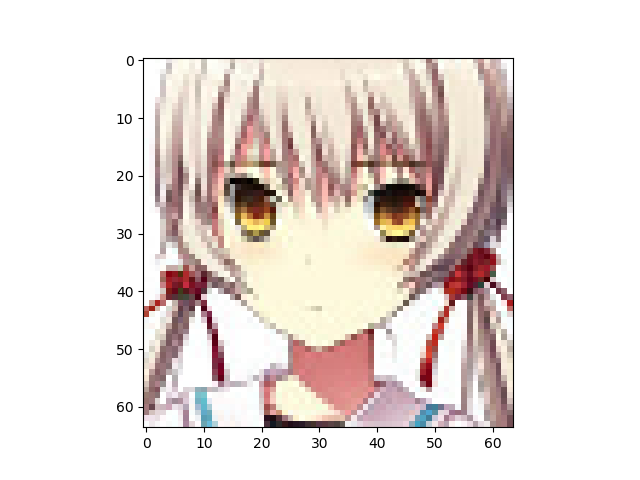
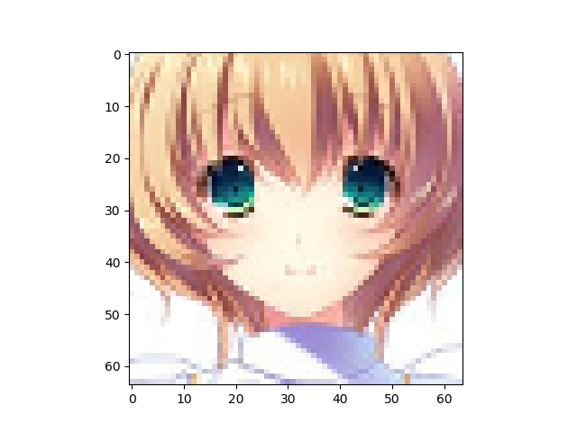

VAE number of latent variables 	5

VAE number of hidden layers 	5

VAE number of hidden nodes per layer 	400

LogReg number of hidden layers 	1

LogReg number of hidden nodes per layer 	200

Number of epochs trained 	50

Epoch0, VAE Training loss 7300.86670, LogReg Training loss 3.2193019390, LogReg Training Acc 0.500, Time used 6.00

Epoch1, VAE Training loss 7030.94580, LogReg Training loss 1.6857972145, LogReg Training Acc 0.504, Time used 5.54

Epoch2, VAE Training loss 6961.92285, LogReg Training loss 1.5724955797, LogReg Training Acc 0.492, Time used 5.50

Epoch3, VAE Training loss 6901.97314, LogReg Training loss 1.4492669106, LogReg Training Acc 0.611, Time used 5.47

Epoch4, VAE Training loss 6867.18359, LogReg Training loss 1.4505943060, LogReg Training Acc 0.535, Time used 5.48

Epoch5, VAE Training loss 6845.04053, LogReg Training loss 1.3775782585, LogReg Training Acc 0.644, Time used 5.48

Epoch6, VAE Training loss 6830.18896, LogReg Training loss 1.4275376797, LogReg Training Acc 0.636, Time used 5.50

Epoch7, VAE Training loss 6824.89453, LogReg Training loss 1.3111968040, LogReg Training Acc 0.613, Time used 6.28

Epoch8, VAE Training loss 6818.05811, LogReg Training loss 1.2921959162, LogReg Training Acc 0.681, Time used 5.47

Epoch9, VAE Training loss 6812.20166, LogReg Training loss 1.2951806784, LogReg Training Acc 0.666, Time used 5.53

Epoch10, VAE Training loss 6804.88379, LogReg Training loss 1.2339299917, LogReg Training Acc 0.587, Time used 5.47

Epoch11, VAE Training loss 6803.98633, LogReg Training loss 1.2376689911, LogReg Training Acc 0.656, Time used 5.44

Epoch12, VAE Training loss 6799.83252, LogReg Training loss 1.1979004145, LogReg Training Acc 0.650, Time used 5.46

Epoch13, VAE Training loss 6799.13330, LogReg Training loss 1.1889164448, LogReg Training Acc 0.700, Time used 5.44

Epoch14, VAE Training loss 6794.20654, LogReg Training loss 1.1457315683, LogReg Training Acc 0.750, Time used 5.45

Epoch15, VAE Training loss 6792.32520, LogReg Training loss 1.1717730761, LogReg Training Acc 0.735, Time used 5.45

Epoch16, VAE Training loss 6788.17871, LogReg Training loss 1.1364587545, LogReg Training Acc 0.625, Time used 5.84

Epoch17, VAE Training loss 6788.26904, LogReg Training loss 1.2133203745, LogReg Training Acc 0.620, Time used 5.47

Epoch18, VAE Training loss 6782.95020, LogReg Training loss 1.1450037956, LogReg Training Acc 0.728, Time used 5.49

Epoch19, VAE Training loss 6783.60254, LogReg Training loss 1.1480380297, LogReg Training Acc 0.729, Time used 5.51

Epoch20, VAE Training loss 6781.44482, LogReg Training loss 1.1633976698, LogReg Training Acc 0.736, Time used 5.69

Epoch21, VAE Training loss 6775.58643, LogReg Training loss 1.1683062315, LogReg Training Acc 0.675, Time used 5.67

Epoch22, VAE Training loss 6773.01855, LogReg Training loss 1.1594984531, LogReg Training Acc 0.735, Time used 5.68

Epoch23, VAE Training loss 6775.04346, LogReg Training loss 1.2604920864, LogReg Training Acc 0.666, Time used 5.65

Epoch24, VAE Training loss 6767.69727, LogReg Training loss 1.2347640991, LogReg Training Acc 0.658, Time used 5.66

Epoch25, VAE Training loss 6766.17480, LogReg Training loss 1.1377813816, LogReg Training Acc 0.742, Time used 5.66

Epoch26, VAE Training loss 6763.94434, LogReg Training loss 1.1902912855, LogReg Training Acc 0.679, Time used 5.65

Epoch27, VAE Training loss 6767.02930, LogReg Training loss 1.1144634485, LogReg Training Acc 0.716, Time used 5.63

Epoch28, VAE Training loss 6761.74219, LogReg Training loss 1.2118679285, LogReg Training Acc 0.662, Time used 5.61

Epoch29, VAE Training loss 6757.96533, LogReg Training loss 1.1176099777, LogReg Training Acc 0.660, Time used 5.53

Epoch30, VAE Training loss 6761.75537, LogReg Training loss 1.1579160690, LogReg Training Acc 0.704, Time used 5.68

Epoch31, VAE Training loss 6753.16211, LogReg Training loss 1.1153837442, LogReg Training Acc 0.731, Time used 5.40

Epoch32, VAE Training loss 6756.76855, LogReg Training loss 1.1274948120, LogReg Training Acc 0.668, Time used 5.39

Epoch33, VAE Training loss 6755.11230, LogReg Training loss 1.1366333961, LogReg Training Acc 0.701, Time used 5.42

Epoch34, VAE Training loss 6749.38721, LogReg Training loss 1.1253716946, LogReg Training Acc 0.721, Time used 5.43

Epoch35, VAE Training loss 6751.60986, LogReg Training loss 1.1630797386, LogReg Training Acc 0.711, Time used 5.38

Epoch36, VAE Training loss 6746.61035, LogReg Training loss 1.1023476124, LogReg Training Acc 0.702, Time used 5.41

Epoch37, VAE Training loss 6743.07861, LogReg Training loss 1.1497038603, LogReg Training Acc 0.731, Time used 5.42

Epoch38, VAE Training loss 6748.23633, LogReg Training loss 1.1664831638, LogReg Training Acc 0.655, Time used 5.40

Epoch39, VAE Training loss 6741.51904, LogReg Training loss 1.1341102123, LogReg Training Acc 0.694, Time used 5.38

Epoch40, VAE Training loss 6741.05566, LogReg Training loss 1.1197600365, LogReg Training Acc 0.719, Time used 5.41

Epoch41, VAE Training loss 6740.99561, LogReg Training loss 1.1653666496, LogReg Training Acc 0.711, Time used 5.40

Epoch42, VAE Training loss 6737.78418, LogReg Training loss 1.1425017118, LogReg Training Acc 0.734, Time used 5.44

Epoch43, VAE Training loss 6736.51221, LogReg Training loss 1.1390010118, LogReg Training Acc 0.713, Time used 5.41

Epoch44, VAE Training loss 6737.67578, LogReg Training loss 1.1473661661, LogReg Training Acc 0.723, Time used 5.44

Epoch45, VAE Training loss 6735.71875, LogReg Training loss 1.1705631018, LogReg Training Acc 0.721, Time used 5.39

Epoch46, VAE Training loss 6729.15820, LogReg Training loss 1.1715509892, LogReg Training Acc 0.658, Time used 5.40

Epoch47, VAE Training loss 6730.67773, LogReg Training loss 1.1690111160, LogReg Training Acc 0.741, Time used 5.38

Epoch48, VAE Training loss 6731.70557, LogReg Training loss 1.1349076033, LogReg Training Acc 0.701, Time used 5.72

Epoch49, VAE Training loss 6724.70215, LogReg Training loss 1.1618402004, LogReg Training Acc 0.703, Time used 5.39

