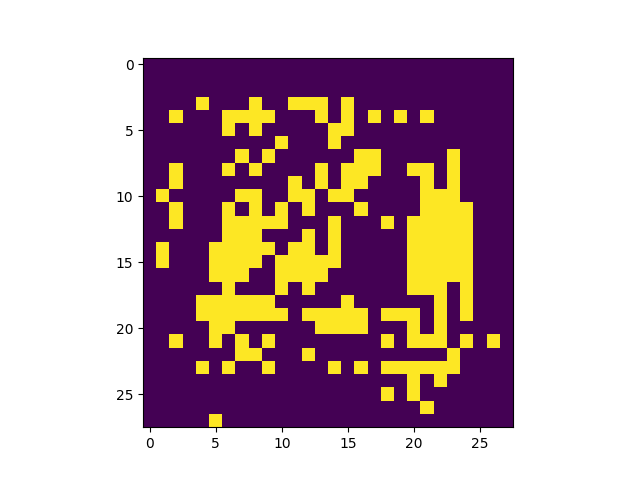

Number of latent variables 	2

Number of hidden layers 	10

Number of hidden nodes per layer 	400

Number of epochs trained 	50

Epoch0, VAE Training loss 201.12419, ResNet Training loss 186.6677093506, Time used 52.45

Epoch1, VAE Training loss 0.09103, ResNet Training loss 0.0000000585, Time used 55.69

Epoch2, VAE Training loss 0.05819, ResNet Training loss 0.0000000045, Time used 56.43

Epoch3, VAE Training loss 0.16382, ResNet Training loss 0.0046775364, Time used 55.85

Epoch4, VAE Training loss 14.73214, ResNet Training loss 14.7320842743, Time used 55.28

Epoch5, VAE Training loss 15.41629, ResNet Training loss 15.4162034988, Time used 55.00

Epoch6, VAE Training loss 15.99831, ResNet Training loss 15.9983215332, Time used 55.28

Epoch7, VAE Training loss 16.40588, ResNet Training loss 16.4059123993, Time used 55.06

Epoch8, VAE Training loss 16.68521, ResNet Training loss 16.6853027344, Time used 54.95

Epoch9, VAE Training loss 17.05655, ResNet Training loss 17.0566425323, Time used 54.83

Epoch10, VAE Training loss 17.42340, ResNet Training loss 17.4234428406, Time used 54.83

Epoch11, VAE Training loss 17.68582, ResNet Training loss 17.6858806610, Time used 54.77

Epoch12, VAE Training loss 18.14883, ResNet Training loss 18.1488838196, Time used 54.99

Epoch13, VAE Training loss 18.58515, ResNet Training loss 18.5852260590, Time used 54.76

Epoch14, VAE Training loss 18.86907, ResNet Training loss 18.8689136505, Time used 55.03

Epoch15, VAE Training loss 19.19480, ResNet Training loss 19.1948299408, Time used 54.66

Epoch16, VAE Training loss 19.40353, ResNet Training loss 19.4034729004, Time used 54.60

Epoch17, VAE Training loss 19.92714, ResNet Training loss 19.9271221161, Time used 54.82

Epoch18, VAE Training loss 20.32690, ResNet Training loss 20.3269176483, Time used 54.74

Epoch19, VAE Training loss 20.69443, ResNet Training loss 20.6943778992, Time used 54.45

Epoch20, VAE Training loss 21.05725, ResNet Training loss 21.0573577881, Time used 53.88

Epoch21, VAE Training loss 21.44354, ResNet Training loss 21.4436550140, Time used 53.74

Epoch22, VAE Training loss 21.85495, ResNet Training loss 21.8549175262, Time used 53.58

Epoch23, VAE Training loss 22.28583, ResNet Training loss 22.2860622406, Time used 54.00

Epoch24, VAE Training loss 22.73227, ResNet Training loss 22.7322120667, Time used 54.84

Epoch25, VAE Training loss 23.17850, ResNet Training loss 23.1783161163, Time used 54.08

Epoch26, VAE Training loss 23.61560, ResNet Training loss 23.6155586243, Time used 54.52

Epoch27, VAE Training loss 24.03818, ResNet Training loss 24.0381755829, Time used 54.14

Epoch28, VAE Training loss 24.44102, ResNet Training loss 24.4409275055, Time used 54.19

Epoch29, VAE Training loss 24.78895, ResNet Training loss 24.7887172699, Time used 54.70

Epoch30, VAE Training loss 25.09917, ResNet Training loss 25.0990810394, Time used 53.87

Epoch31, VAE Training loss 25.47171, ResNet Training loss 25.4718551636, Time used 54.34

Epoch32, VAE Training loss 25.49609, ResNet Training loss 25.4961719513, Time used 53.92

Epoch33, VAE Training loss 25.90109, ResNet Training loss 25.9010028839, Time used 54.54

Epoch34, VAE Training loss 26.27768, ResNet Training loss 26.2776813507, Time used 54.61

Epoch35, VAE Training loss 26.91592, ResNet Training loss 26.9160480499, Time used 53.90

Epoch36, VAE Training loss 27.27258, ResNet Training loss 27.2724399567, Time used 53.95

Epoch37, VAE Training loss 27.85690, ResNet Training loss 27.8567790985, Time used 53.85

Epoch38, VAE Training loss 28.43778, ResNet Training loss 28.4376716614, Time used 54.12

Epoch39, VAE Training loss 26.56582, ResNet Training loss 26.5659198761, Time used 54.37

Epoch40, VAE Training loss 26.84698, ResNet Training loss 26.8469238281, Time used 55.06

Epoch41, VAE Training loss 28.69782, ResNet Training loss 28.6978206635, Time used 54.58

Epoch42, VAE Training loss 26.19686, ResNet Training loss 26.1963729858, Time used 54.28

Epoch43, VAE Training loss 26.37398, ResNet Training loss 26.3730182648, Time used 53.83

Epoch44, VAE Training loss 26.55431, ResNet Training loss 26.5542621613, Time used 54.95

Epoch45, VAE Training loss 26.73944, ResNet Training loss 26.7382793427, Time used 55.07

Epoch46, VAE Training loss 26.92853, ResNet Training loss 26.9294452667, Time used 54.82

Epoch47, VAE Training loss 27.12202, ResNet Training loss 27.1224346161, Time used 55.15

Epoch48, VAE Training loss 27.32006, ResNet Training loss 27.3198261261, Time used 55.14

Epoch49, VAE Training loss 27.52157, ResNet Training loss 27.5206985474, Time used 55.12

