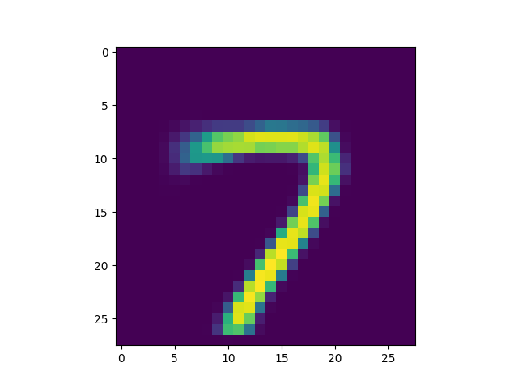
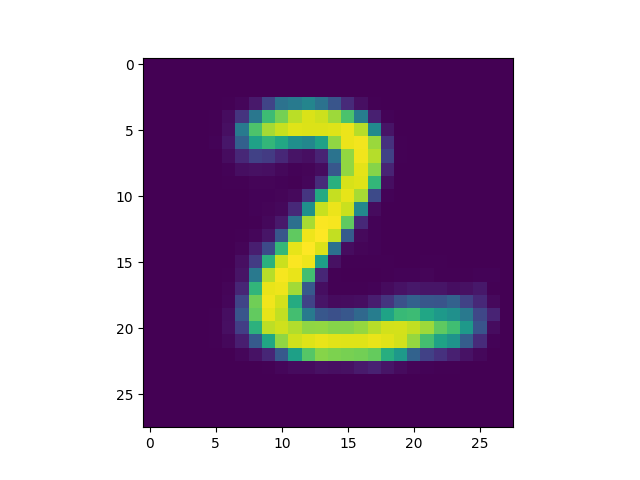
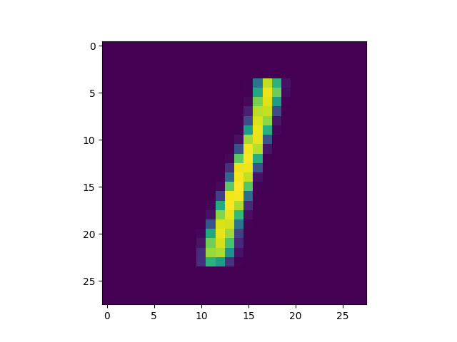
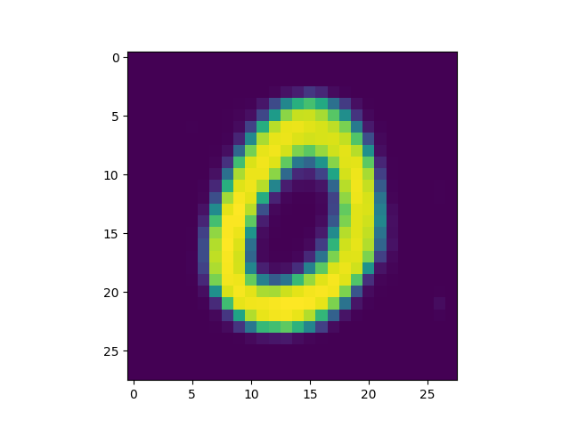
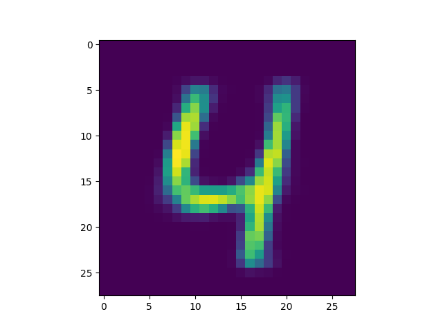
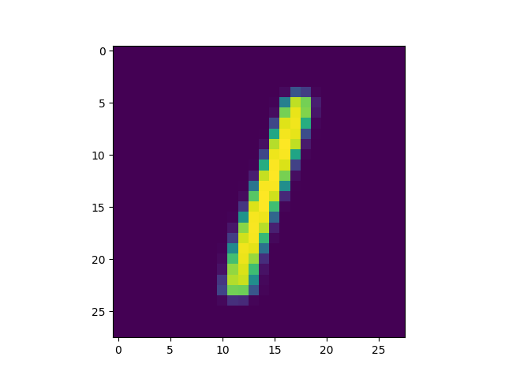
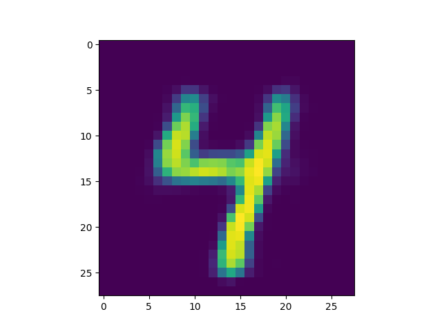
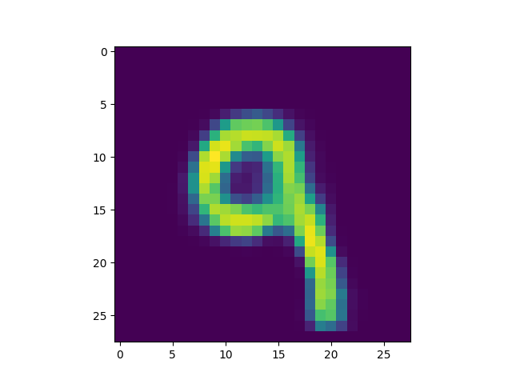
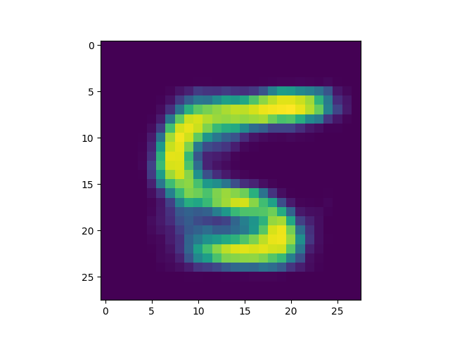
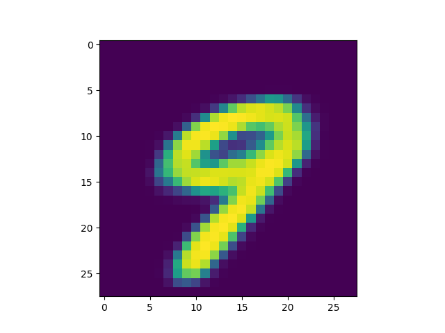

Number of latent variables 	5

Number of hidden layers 	3

Number of hidden nodes per layer 	400

Number of epochs trained 	40

Epoch0, Training loss 159.7716217041, Time used 5.73

Epoch1, Training loss 130.4654388428, Time used 5.61

Epoch2, Training loss 125.4984054565, Time used 5.61

Epoch3, Training loss 122.4458618164, Time used 5.59

Epoch4, Training loss 120.2797088623, Time used 5.54

Epoch5, Training loss 118.5621871948, Time used 5.55

Epoch6, Training loss 117.3968734741, Time used 5.55

Epoch7, Training loss 116.3549804688, Time used 5.57

Epoch8, Training loss 115.5285034180, Time used 5.72

Epoch9, Training loss 114.8114242554, Time used 5.63

Epoch10, Training loss 114.1786727905, Time used 5.63

Epoch11, Training loss 113.6506729126, Time used 5.63

Epoch12, Training loss 113.2344436646, Time used 5.64

Epoch13, Training loss 112.8589096069, Time used 5.72

Epoch14, Training loss 112.4198532104, Time used 5.72

Epoch15, Training loss 112.0133361816, Time used 5.64

Epoch16, Training loss 111.7741546631, Time used 5.64

Epoch17, Training loss 111.5410232544, Time used 5.64

Epoch18, Training loss 111.1593322754, Time used 5.61

Epoch19, Training loss 110.9584884644, Time used 5.64

Epoch20, Training loss 110.7605133057, Time used 5.62

Epoch21, Training loss 110.5798110962, Time used 5.62

Epoch22, Training loss 110.3910827637, Time used 5.63

Epoch23, Training loss 110.1294555664, Time used 5.62

Epoch24, Training loss 109.9468688965, Time used 5.62

Epoch25, Training loss 109.7944335938, Time used 5.62

Epoch26, Training loss 109.6027984619, Time used 5.62

Epoch27, Training loss 109.4842910767, Time used 5.63

Epoch28, Training loss 109.3013992310, Time used 5.55

Epoch29, Training loss 109.2608261108, Time used 5.62

Epoch30, Training loss 109.0389785767, Time used 5.62

Epoch31, Training loss 108.9249954224, Time used 5.57

Epoch32, Training loss 108.7806015015, Time used 5.67

Epoch33, Training loss 108.6886291504, Time used 5.67

Epoch34, Training loss 108.5271987915, Time used 5.68

Epoch35, Training loss 108.4839706421, Time used 5.71

Epoch36, Training loss 108.3226242065, Time used 5.62

Epoch37, Training loss 108.2384948730, Time used 5.64

Epoch38, Training loss 108.1894149780, Time used 5.63

Epoch39, Training loss 108.0365982056, Time used 5.60

