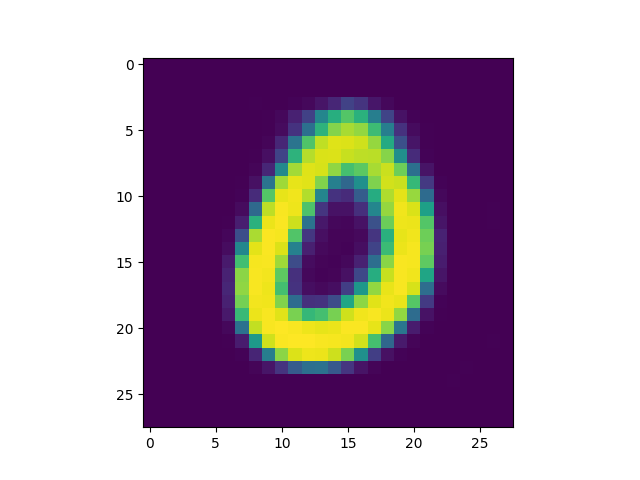
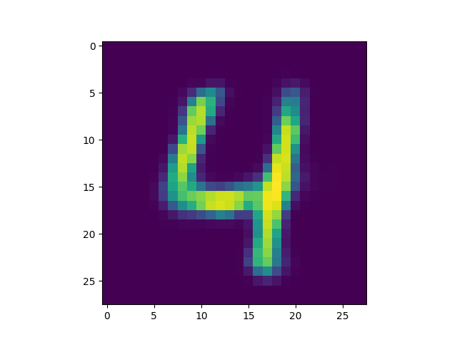

Number of latent variables 	5

Number of hidden layers 	3

Number of hidden nodes per layer 	400

Pixel-by-pixel loss used is binary cross entropyNumber of epochs trained 	50

Epoch10, Training loss 114.4525527954, Time used 5.76

Epoch20, Training loss 110.9658203125, Time used 5.77

Epoch30, Training loss 109.3206863403, Time used 5.72

Epoch40, Training loss 108.1919174194, Time used 5.80

