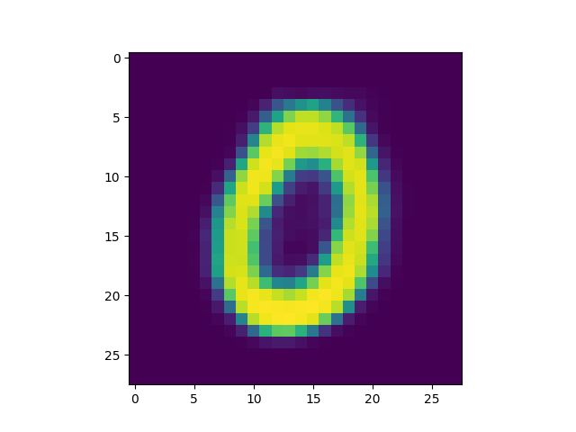

Number of latent variables 	5

Number of hidden layers 	3

Number of hidden nodes per layer 	400

Pixel-by-pixel loss used is L2 lossNumber of epochs trained 	50

Epoch10, Training loss 30.4056854248, Time used 5.69

Epoch20, Training loss 29.4307270050, Time used 5.81

Epoch30, Training loss 28.9836997986, Time used 5.73

Epoch40, Training loss 28.6753768921, Time used 5.73

