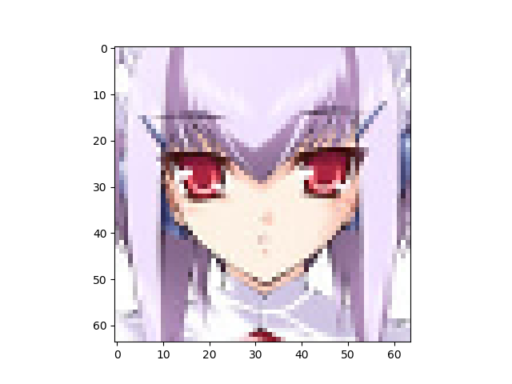
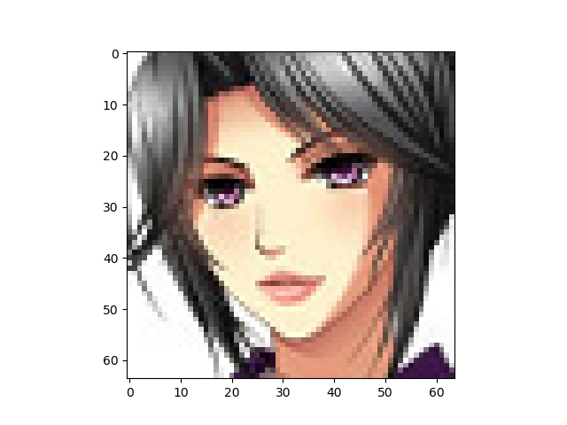
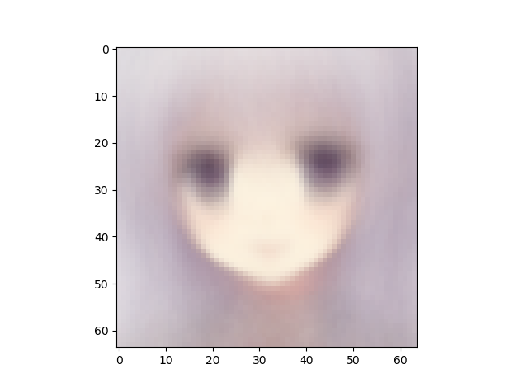
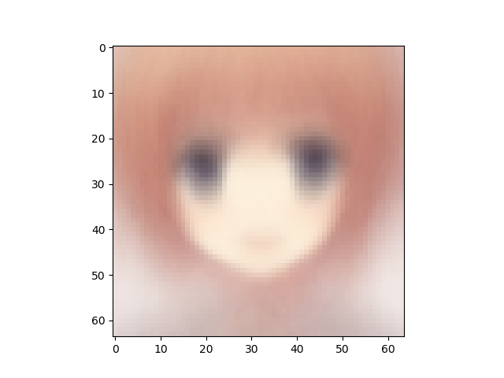
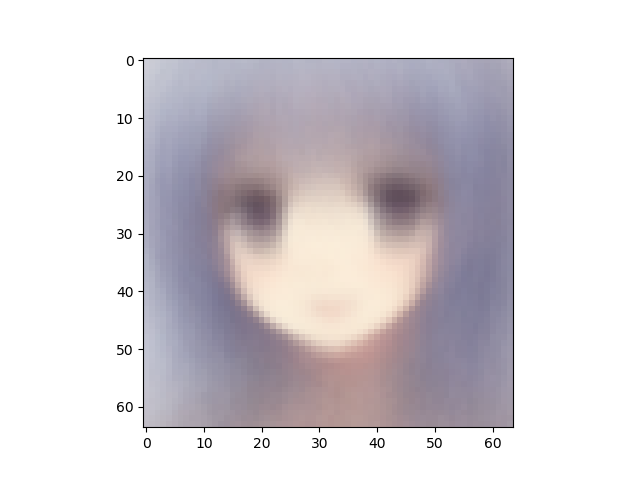

Number of latent variables 	10

Number of hidden layers 	10

Number of hidden nodes per layer 	400

Number of epochs trained 	100

Epoch0, Training loss 8906.5498046875, Time used 3.34

Epoch1, Training loss 7178.5083007812, Time used 3.21

Epoch2, Training loss 7083.2749023438, Time used 3.22

Epoch3, Training loss 7058.5175781250, Time used 3.22

Epoch4, Training loss 7052.2167968750, Time used 3.18

Epoch5, Training loss 7049.9213867188, Time used 3.22

Epoch6, Training loss 7040.9370117188, Time used 3.20

Epoch7, Training loss 7035.1655273438, Time used 3.21

Epoch8, Training loss 7039.6425781250, Time used 3.20

Epoch9, Training loss 7055.1416015625, Time used 3.22

Epoch10, Training loss 7043.5541992188, Time used 3.21

Epoch11, Training loss 7030.8046875000, Time used 3.22

Epoch12, Training loss 7048.1010742188, Time used 3.22

Epoch13, Training loss 7045.2456054688, Time used 3.23

Epoch14, Training loss 7030.4980468750, Time used 3.22

Epoch15, Training loss 7031.8564453125, Time used 3.20

Epoch16, Training loss 7033.5659179688, Time used 3.22

Epoch17, Training loss 7034.8627929688, Time used 3.19

Epoch18, Training loss 7009.6850585938, Time used 3.19

Epoch19, Training loss 7090.1665039062, Time used 3.20

Epoch20, Training loss 7172.3535156250, Time used 3.18

Epoch21, Training loss 7172.3232421875, Time used 3.20

Epoch22, Training loss 7105.9340820312, Time used 3.20

Epoch23, Training loss 7030.0258789062, Time used 3.19

Epoch24, Training loss 7018.6372070312, Time used 3.24

Epoch25, Training loss 7019.1533203125, Time used 3.23

Epoch26, Training loss 7022.4560546875, Time used 3.22

Epoch27, Training loss 7034.1835937500, Time used 3.20

Epoch28, Training loss 7018.8955078125, Time used 3.22

Epoch29, Training loss 7004.9213867188, Time used 3.22

Epoch30, Training loss 7023.7148437500, Time used 3.22

Epoch31, Training loss 7027.1733398438, Time used 3.22

Epoch32, Training loss 6996.5371093750, Time used 3.28

Epoch33, Training loss 7023.5351562500, Time used 3.24

Epoch34, Training loss 7023.4956054688, Time used 3.25

Epoch35, Training loss 7017.5273437500, Time used 3.31

Epoch36, Training loss 7028.0092773438, Time used 3.39

Epoch37, Training loss 7044.0678710938, Time used 3.35

Epoch38, Training loss 7023.0312500000, Time used 3.34

Epoch39, Training loss 7039.3886718750, Time used 3.23

Epoch40, Training loss 7014.8120117188, Time used 3.25

Epoch41, Training loss 7024.2690429688, Time used 3.25

Epoch42, Training loss 7017.4809570312, Time used 3.23

Epoch43, Training loss 7028.3647460938, Time used 3.20

Epoch44, Training loss 7003.6005859375, Time used 3.26

Epoch45, Training loss 7032.9516601562, Time used 3.25

Epoch46, Training loss 7029.3691406250, Time used 3.24

Epoch47, Training loss 7056.4711914062, Time used 3.22

Epoch48, Training loss 7027.1230468750, Time used 3.22

Epoch49, Training loss 7030.7490234375, Time used 3.24

Epoch50, Training loss 7012.5400390625, Time used 3.22

Epoch51, Training loss 7021.2368164062, Time used 3.22

Epoch52, Training loss 7006.1640625000, Time used 3.22

Epoch53, Training loss 7014.1665039062, Time used 3.20

Epoch54, Training loss 7014.5517578125, Time used 3.22

Epoch55, Training loss 7016.8793945312, Time used 3.41

Epoch56, Training loss 7002.3027343750, Time used 3.25

Epoch57, Training loss 7002.7631835938, Time used 3.21

Epoch58, Training loss 7003.6870117188, Time used 3.20

Epoch59, Training loss 6992.6914062500, Time used 3.20

Epoch60, Training loss 7007.0639648438, Time used 3.21

Epoch61, Training loss 7024.9960937500, Time used 3.21

Epoch62, Training loss 7008.6635742188, Time used 3.34

Epoch63, Training loss 7007.8461914062, Time used 3.43

Epoch64, Training loss 7015.2456054688, Time used 3.33

Epoch65, Training loss 6999.7084960938, Time used 3.19

Epoch66, Training loss 7013.3979492188, Time used 3.23

Epoch67, Training loss 7007.0400390625, Time used 3.24

Epoch68, Training loss 7014.9287109375, Time used 3.23

Epoch69, Training loss 7013.8046875000, Time used 3.22

Epoch70, Training loss 7009.0517578125, Time used 3.23

Epoch71, Training loss 7000.4863281250, Time used 3.23

Epoch72, Training loss 7018.2294921875, Time used 3.23

Epoch73, Training loss 7014.0654296875, Time used 3.22

Epoch74, Training loss 7002.2470703125, Time used 3.23

Epoch75, Training loss 7014.9326171875, Time used 3.23

Epoch76, Training loss 7004.1064453125, Time used 3.22

Epoch77, Training loss 7009.7636718750, Time used 3.21

Epoch78, Training loss 7026.0546875000, Time used 3.21

Epoch79, Training loss 6991.1909179688, Time used 3.19

Epoch80, Training loss 6999.6962890625, Time used 3.19

Epoch81, Training loss 7001.7089843750, Time used 3.18

Epoch82, Training loss 7007.8784179688, Time used 3.20

Epoch83, Training loss 7004.6699218750, Time used 3.20

Epoch84, Training loss 7016.2314453125, Time used 3.22

Epoch85, Training loss 7027.8813476562, Time used 3.18

Epoch86, Training loss 7014.2978515625, Time used 3.19

Epoch87, Training loss 6994.9125976562, Time used 3.19

Epoch88, Training loss 6992.6401367188, Time used 3.17

Epoch89, Training loss 6997.6025390625, Time used 3.20

Epoch90, Training loss 6985.7993164062, Time used 3.18

Epoch91, Training loss 6988.8652343750, Time used 3.18

Epoch92, Training loss 7012.7832031250, Time used 3.18

Epoch93, Training loss 7006.8315429688, Time used 3.26

Epoch94, Training loss 7004.0146484375, Time used 3.22

Epoch95, Training loss 7002.0327148438, Time used 3.30

Epoch96, Training loss 7030.2490234375, Time used 3.35

Epoch97, Training loss 7001.7377929688, Time used 3.33

Epoch98, Training loss 6993.6352539062, Time used 3.32

Epoch99, Training loss 7000.5571289062, Time used 3.33

