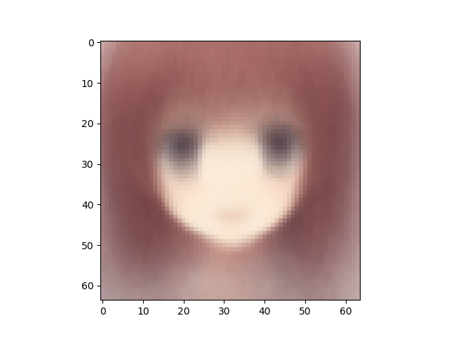
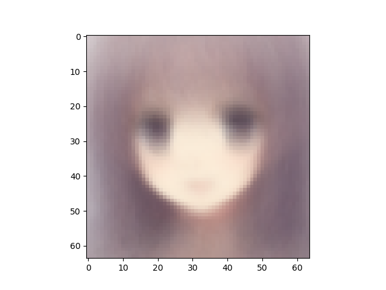

Number of latent variables 	10

Number of hidden layers 	10

Number of hidden nodes per layer 	400

Number of epochs trained 	100

Epoch0, Training loss 7539.8413085938, Time used 3.36

Epoch1, Training loss 7186.5307617188, Time used 3.19

Epoch2, Training loss 7184.2192382812, Time used 3.19

Epoch3, Training loss 7158.1293945312, Time used 3.19

Epoch4, Training loss 7075.9594726562, Time used 3.19

Epoch5, Training loss 7056.4384765625, Time used 3.20

Epoch6, Training loss 7052.3759765625, Time used 3.19

Epoch7, Training loss 7042.5737304688, Time used 3.19

Epoch8, Training loss 7040.7016601562, Time used 3.19

Epoch9, Training loss 7045.2358398438, Time used 3.20

Epoch10, Training loss 7108.2807617188, Time used 3.20

Epoch11, Training loss 7151.9907226562, Time used 3.21

Epoch12, Training loss 7044.9277343750, Time used 3.17

Epoch13, Training loss 7036.4531250000, Time used 3.19

Epoch14, Training loss 7041.7631835938, Time used 3.18

Epoch15, Training loss 7040.2294921875, Time used 3.17

Epoch16, Training loss 7035.1953125000, Time used 3.16

Epoch17, Training loss 7020.4160156250, Time used 3.19

Epoch18, Training loss 7044.4907226562, Time used 3.19

Epoch19, Training loss 7035.1806640625, Time used 3.19

Epoch20, Training loss 7014.2407226562, Time used 3.20

Epoch21, Training loss 7020.2436523438, Time used 3.19

Epoch22, Training loss 7050.8242187500, Time used 3.19

Epoch23, Training loss 7025.0122070312, Time used 3.19

Epoch24, Training loss 7040.4648437500, Time used 3.19

Epoch25, Training loss 7024.1010742188, Time used 3.20

Epoch26, Training loss 7034.7006835938, Time used 3.19

Epoch27, Training loss 7023.9785156250, Time used 3.20

Epoch28, Training loss 7016.1210937500, Time used 3.20

Epoch29, Training loss 7016.1240234375, Time used 3.20

Epoch30, Training loss 7005.8906250000, Time used 3.20

Epoch31, Training loss 7031.3999023438, Time used 3.19

Epoch32, Training loss 7062.6918945312, Time used 3.20

Epoch33, Training loss 7007.9658203125, Time used 3.20

Epoch34, Training loss 7003.9218750000, Time used 3.20

Epoch35, Training loss 7000.5239257812, Time used 3.20

Epoch36, Training loss 7022.4335937500, Time used 3.19

Epoch37, Training loss 7003.0332031250, Time used 3.19

Epoch38, Training loss 6998.3398437500, Time used 3.18

Epoch39, Training loss 7024.7397460938, Time used 3.18

Epoch40, Training loss 7016.8071289062, Time used 3.17

Epoch41, Training loss 7004.0688476562, Time used 3.18

Epoch42, Training loss 7001.2021484375, Time used 3.17

Epoch43, Training loss 6999.8750000000, Time used 3.15

Epoch44, Training loss 7020.5415039062, Time used 3.13

Epoch45, Training loss 7029.4057617188, Time used 3.15

Epoch46, Training loss 7010.3193359375, Time used 3.17

Epoch47, Training loss 7029.1953125000, Time used 3.15

Epoch48, Training loss 7004.8618164062, Time used 3.13

Epoch49, Training loss 7015.6904296875, Time used 3.14

Epoch50, Training loss 7006.0341796875, Time used 3.13

Epoch51, Training loss 7055.4082031250, Time used 3.13

Epoch52, Training loss 7010.2065429688, Time used 3.14

Epoch53, Training loss 7023.4912109375, Time used 3.13

Epoch54, Training loss 7027.7807617188, Time used 3.07

Epoch55, Training loss 7023.2226562500, Time used 3.09

Epoch56, Training loss 7004.8510742188, Time used 3.07

Epoch57, Training loss 6995.4853515625, Time used 3.07

Epoch58, Training loss 7005.1816406250, Time used 3.07

Epoch59, Training loss 7047.9331054688, Time used 3.10

Epoch60, Training loss 7032.1469726562, Time used 3.08

Epoch61, Training loss 7004.5883789062, Time used 3.08

Epoch62, Training loss 6998.0322265625, Time used 3.12

Epoch63, Training loss 7004.1171875000, Time used 3.08

Epoch64, Training loss 7011.0415039062, Time used 3.15

Epoch65, Training loss 7017.0815429688, Time used 3.17

Epoch66, Training loss 7021.5175781250, Time used 3.17

Epoch67, Training loss 7013.9340820312, Time used 3.16

Epoch68, Training loss 7015.1523437500, Time used 3.12

Epoch69, Training loss 7034.3232421875, Time used 3.08

Epoch70, Training loss 7017.1206054688, Time used 3.08

Epoch71, Training loss 7018.3510742188, Time used 3.08

Epoch72, Training loss 7012.4062500000, Time used 3.08

Epoch73, Training loss 7009.8066406250, Time used 3.08

Epoch74, Training loss 7019.1396484375, Time used 3.09

Epoch75, Training loss 7007.5854492188, Time used 3.09

Epoch76, Training loss 7002.6723632812, Time used 3.08

Epoch77, Training loss 7019.2456054688, Time used 3.08

Epoch78, Training loss 7016.0722656250, Time used 3.08

Epoch79, Training loss 7031.9140625000, Time used 3.08

Epoch80, Training loss 7038.1206054688, Time used 3.08

Epoch81, Training loss 7035.7368164062, Time used 3.11

Epoch82, Training loss 7033.5961914062, Time used 3.08

Epoch83, Training loss 7031.7128906250, Time used 3.08

Epoch84, Training loss 7019.4340820312, Time used 3.08

Epoch85, Training loss 7033.7714843750, Time used 3.08

Epoch86, Training loss 7034.4516601562, Time used 3.08

Epoch87, Training loss 7031.4472656250, Time used 3.08

Epoch88, Training loss 7035.2934570312, Time used 3.09

Epoch89, Training loss 7031.1879882812, Time used 3.09

Epoch90, Training loss 7028.4755859375, Time used 3.09

Epoch91, Training loss 7025.6254882812, Time used 3.08

Epoch92, Training loss 7025.5815429688, Time used 3.08

Epoch93, Training loss 7019.5488281250, Time used 3.08

Epoch94, Training loss 7019.0859375000, Time used 3.08

Epoch95, Training loss 7010.5122070312, Time used 3.08

Epoch96, Training loss 7021.2778320312, Time used 3.08

Epoch97, Training loss 7016.3603515625, Time used 3.08

Epoch98, Training loss 6998.7792968750, Time used 3.09

Epoch99, Training loss 7002.2187500000, Time used 3.08

