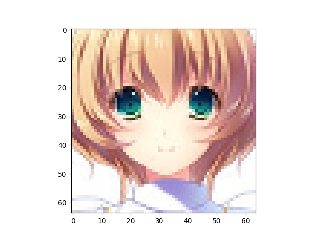

Number of latent variables 	256

Number of hidden layers 	5

Number of hidden nodes per layer 	1024

Number of epochs trained 	200

Epoch0, Training loss 7306.3852539062, Time used 3.09

Epoch1, Training loss 7111.1743164062, Time used 2.70

Epoch2, Training loss 7087.0795898438, Time used 2.81

Epoch3, Training loss 7035.0756835938, Time used 2.78

Epoch4, Training loss 7000.5610351562, Time used 2.69

Epoch5, Training loss 6959.4853515625, Time used 2.68

Epoch6, Training loss 6913.7099609375, Time used 2.71

Epoch7, Training loss 6893.5996093750, Time used 2.97

Epoch8, Training loss 6870.2915039062, Time used 3.07

Epoch9, Training loss 6854.2299804688, Time used 2.68

Epoch10, Training loss 6837.6259765625, Time used 2.71

Epoch11, Training loss 6830.2343750000, Time used 2.68

Epoch12, Training loss 6821.5493164062, Time used 2.68

Epoch13, Training loss 6815.0795898438, Time used 2.75

Epoch14, Training loss 6808.7202148438, Time used 2.77

Epoch15, Training loss 6803.9946289062, Time used 2.69

Epoch16, Training loss 6799.8647460938, Time used 2.75

Epoch17, Training loss 6798.6704101562, Time used 2.70

Epoch18, Training loss 6792.7465820312, Time used 2.69

Epoch19, Training loss 6787.5454101562, Time used 2.69

Epoch20, Training loss 6789.2563476562, Time used 2.69

Epoch21, Training loss 6785.9370117188, Time used 2.98

Epoch22, Training loss 6780.6464843750, Time used 3.10

Epoch23, Training loss 6777.2880859375, Time used 2.80

Epoch24, Training loss 6771.9013671875, Time used 2.72

Epoch25, Training loss 6761.8388671875, Time used 2.70

Epoch26, Training loss 6756.3378906250, Time used 2.69

Epoch27, Training loss 6751.3564453125, Time used 2.69

Epoch28, Training loss 6752.8320312500, Time used 2.71

Epoch29, Training loss 6743.3583984375, Time used 2.68

Epoch30, Training loss 6742.5297851562, Time used 2.68

Epoch31, Training loss 6739.8300781250, Time used 2.75

Epoch32, Training loss 6735.4150390625, Time used 2.78

Epoch33, Training loss 6725.2416992188, Time used 2.67

Epoch34, Training loss 6722.8276367188, Time used 2.78

Epoch35, Training loss 6720.0463867188, Time used 2.66

Epoch36, Training loss 6722.8730468750, Time used 2.67

Epoch37, Training loss 6715.3647460938, Time used 2.66

Epoch38, Training loss 6716.5878906250, Time used 2.70

Epoch39, Training loss 6709.1811523438, Time used 2.78

Epoch40, Training loss 6702.8706054688, Time used 2.66

Epoch41, Training loss 6706.4482421875, Time used 2.68

Epoch42, Training loss 6694.9741210938, Time used 2.66

Epoch43, Training loss 6698.2065429688, Time used 2.67

Epoch44, Training loss 6697.2915039062, Time used 2.66

Epoch45, Training loss 6691.9814453125, Time used 2.66

Epoch46, Training loss 6693.3618164062, Time used 2.65

Epoch47, Training loss 6688.6513671875, Time used 2.67

Epoch48, Training loss 6682.5297851562, Time used 2.66

Epoch49, Training loss 6680.5869140625, Time used 2.65

Epoch50, Training loss 6678.9174804688, Time used 2.64

Epoch51, Training loss 6685.0024414062, Time used 2.64

Epoch52, Training loss 6686.5942382812, Time used 2.64

Epoch53, Training loss 6671.6796875000, Time used 2.63

Epoch54, Training loss 6674.1928710938, Time used 2.67

Epoch55, Training loss 6667.7514648438, Time used 2.95

Epoch56, Training loss 6666.6303710938, Time used 2.66

Epoch57, Training loss 6665.5156250000, Time used 2.84

Epoch58, Training loss 6667.1489257812, Time used 2.68

Epoch59, Training loss 6659.4824218750, Time used 2.65

Epoch60, Training loss 6661.9448242188, Time used 2.77

Epoch61, Training loss 6666.6435546875, Time used 2.65

Epoch62, Training loss 6659.7646484375, Time used 2.66

Epoch63, Training loss 6656.5473632812, Time used 2.66

Epoch64, Training loss 6653.4008789062, Time used 2.74

Epoch65, Training loss 6647.2333984375, Time used 2.68

Epoch66, Training loss 6650.5361328125, Time used 2.69

Epoch67, Training loss 6646.4448242188, Time used 2.68

Epoch68, Training loss 6650.7143554688, Time used 2.69

Epoch69, Training loss 6652.8920898438, Time used 2.68

Epoch70, Training loss 6654.8413085938, Time used 2.70

Epoch71, Training loss 6642.2407226562, Time used 2.72

Epoch72, Training loss 6641.5581054688, Time used 2.68

Epoch73, Training loss 6636.0742187500, Time used 2.67

Epoch74, Training loss 6638.9433593750, Time used 2.75

Epoch75, Training loss 6636.1796875000, Time used 2.72

Epoch76, Training loss 6635.8510742188, Time used 2.71

Epoch77, Training loss 6631.7636718750, Time used 2.73

Epoch78, Training loss 6636.3090820312, Time used 2.73

Epoch79, Training loss 6633.7524414062, Time used 2.76

Epoch80, Training loss 6629.1669921875, Time used 2.72

Epoch81, Training loss 6631.2099609375, Time used 2.70

Epoch82, Training loss 6631.2094726562, Time used 2.72

Epoch83, Training loss 6629.6430664062, Time used 2.73

Epoch84, Training loss 6622.2236328125, Time used 2.71

Epoch85, Training loss 6620.2817382812, Time used 2.71

Epoch86, Training loss 6622.6313476562, Time used 2.68

Epoch87, Training loss 6629.4599609375, Time used 2.65

Epoch88, Training loss 6620.9140625000, Time used 2.67

Epoch89, Training loss 6623.6157226562, Time used 2.68

Epoch90, Training loss 6616.1425781250, Time used 2.72

Epoch91, Training loss 6614.5053710938, Time used 2.69

Epoch92, Training loss 6631.3999023438, Time used 2.66

Epoch93, Training loss 6616.1669921875, Time used 2.68

Epoch94, Training loss 6611.3657226562, Time used 2.68

Epoch95, Training loss 6611.0805664062, Time used 2.68

Epoch96, Training loss 6611.1528320312, Time used 2.67

Epoch97, Training loss 6617.7377929688, Time used 2.67

Epoch98, Training loss 6612.1806640625, Time used 2.68

Epoch99, Training loss 6613.4418945312, Time used 2.66

Epoch100, Training loss 6610.2929687500, Time used 2.68

Epoch101, Training loss 6606.2680664062, Time used 2.67

Epoch102, Training loss 6607.6206054688, Time used 2.68

Epoch103, Training loss 6606.8735351562, Time used 2.75

Epoch104, Training loss 6606.4111328125, Time used 2.72

Epoch105, Training loss 6597.0625000000, Time used 2.68

Epoch106, Training loss 6602.7680664062, Time used 2.92

Epoch107, Training loss 6599.9150390625, Time used 2.69

Epoch108, Training loss 6598.1723632812, Time used 2.66

Epoch109, Training loss 6599.9814453125, Time used 2.69

Epoch110, Training loss 6611.1040039062, Time used 2.64

Epoch111, Training loss 6595.7451171875, Time used 2.62

Epoch112, Training loss 6598.6342773438, Time used 2.63

Epoch113, Training loss 6601.1425781250, Time used 2.64

Epoch114, Training loss 6592.8125000000, Time used 2.66

Epoch115, Training loss 6597.6425781250, Time used 2.66

Epoch116, Training loss 6590.0576171875, Time used 2.76

Epoch117, Training loss 6609.2285156250, Time used 2.71

Epoch118, Training loss 6591.0551757812, Time used 2.69

Epoch119, Training loss 6591.6674804688, Time used 2.63

Epoch120, Training loss 6591.8959960938, Time used 2.64

Epoch121, Training loss 6587.4716796875, Time used 2.64

Epoch122, Training loss 6583.1127929688, Time used 2.63

Epoch123, Training loss 6596.1767578125, Time used 2.63

Epoch124, Training loss 6587.6088867188, Time used 2.62

Epoch125, Training loss 6583.1860351562, Time used 2.60

Epoch126, Training loss 6580.6411132812, Time used 2.61

Epoch127, Training loss 6588.0678710938, Time used 2.61

Epoch128, Training loss 6582.3852539062, Time used 2.62

Epoch129, Training loss 6586.9965820312, Time used 2.63

Epoch130, Training loss 6586.3886718750, Time used 2.62

Epoch131, Training loss 6585.2934570312, Time used 2.63

Epoch132, Training loss 6578.7041015625, Time used 2.64

Epoch133, Training loss 6580.7382812500, Time used 2.65

Epoch134, Training loss 6578.2363281250, Time used 2.67

Epoch135, Training loss 6583.4848632812, Time used 2.71

Epoch136, Training loss 6584.3588867188, Time used 2.82

Epoch137, Training loss 6592.7895507812, Time used 2.67

Epoch138, Training loss 6580.6523437500, Time used 2.66

Epoch139, Training loss 6572.1357421875, Time used 2.65

Epoch140, Training loss 6571.2192382812, Time used 2.67

Epoch141, Training loss 6578.1640625000, Time used 2.88

Epoch142, Training loss 6578.5205078125, Time used 3.06

Epoch143, Training loss 6570.6196289062, Time used 2.67

Epoch144, Training loss 6569.7778320312, Time used 2.73

Epoch145, Training loss 6571.3085937500, Time used 3.06

Epoch146, Training loss 6574.3564453125, Time used 3.02

Epoch147, Training loss 6571.5444335938, Time used 2.66

Epoch148, Training loss 6568.2783203125, Time used 2.71

Epoch149, Training loss 6567.6953125000, Time used 2.94

Epoch150, Training loss 6569.0839843750, Time used 2.68

Epoch151, Training loss 6568.7006835938, Time used 2.72

Epoch152, Training loss 6570.8437500000, Time used 2.66

Epoch153, Training loss 6569.9096679688, Time used 2.66

Epoch154, Training loss 6562.4091796875, Time used 2.69

Epoch155, Training loss 6569.9340820312, Time used 2.73

Epoch156, Training loss 6564.9750976562, Time used 2.69

Epoch157, Training loss 6570.2812500000, Time used 2.68

Epoch158, Training loss 6563.8964843750, Time used 2.69

Epoch159, Training loss 6564.7734375000, Time used 2.69

Epoch160, Training loss 6568.4194335938, Time used 2.74

Epoch161, Training loss 6562.2202148438, Time used 2.67

Epoch162, Training loss 6562.5249023438, Time used 2.69

Epoch163, Training loss 6559.8354492188, Time used 2.68

Epoch164, Training loss 6556.6752929688, Time used 2.66

Epoch165, Training loss 6575.9135742188, Time used 2.68

Epoch166, Training loss 6563.9653320312, Time used 2.68

Epoch167, Training loss 6551.2817382812, Time used 2.68

Epoch168, Training loss 6560.9399414062, Time used 2.68

Epoch169, Training loss 6561.0986328125, Time used 2.71

Epoch170, Training loss 6559.3442382812, Time used 2.71

Epoch171, Training loss 6554.1118164062, Time used 2.68

Epoch172, Training loss 6550.6127929688, Time used 2.73

Epoch173, Training loss 6562.5996093750, Time used 2.73

Epoch174, Training loss 6548.8461914062, Time used 2.69

Epoch175, Training loss 6560.2729492188, Time used 2.69

Epoch176, Training loss 6556.1152343750, Time used 2.69

Epoch177, Training loss 6551.5390625000, Time used 2.67

Epoch178, Training loss 6555.7177734375, Time used 2.67

Epoch179, Training loss 6553.7031250000, Time used 2.67

Epoch180, Training loss 6550.1704101562, Time used 2.71

Epoch181, Training loss 6550.0483398438, Time used 2.76

Epoch182, Training loss 6547.4506835938, Time used 2.65

Epoch183, Training loss 6550.9272460938, Time used 2.68

Epoch184, Training loss 6560.0312500000, Time used 2.70

Epoch185, Training loss 6547.0107421875, Time used 2.76

Epoch186, Training loss 6555.8632812500, Time used 2.66

Epoch187, Training loss 6552.1176757812, Time used 2.67

Epoch188, Training loss 6550.9814453125, Time used 2.71

Epoch189, Training loss 6544.7851562500, Time used 2.66

Epoch190, Training loss 6543.7729492188, Time used 2.67

Epoch191, Training loss 6545.9458007812, Time used 2.67

Epoch192, Training loss 6544.0166015625, Time used 2.65

Epoch193, Training loss 6542.1352539062, Time used 2.64

Epoch194, Training loss 6543.6738281250, Time used 2.64

Epoch195, Training loss 6544.7187500000, Time used 2.65

Epoch196, Training loss 6546.8500976562, Time used 2.67

Epoch197, Training loss 6546.2915039062, Time used 2.69

Epoch198, Training loss 6539.2089843750, Time used 2.64

Epoch199, Training loss 6544.0043945312, Time used 2.65

