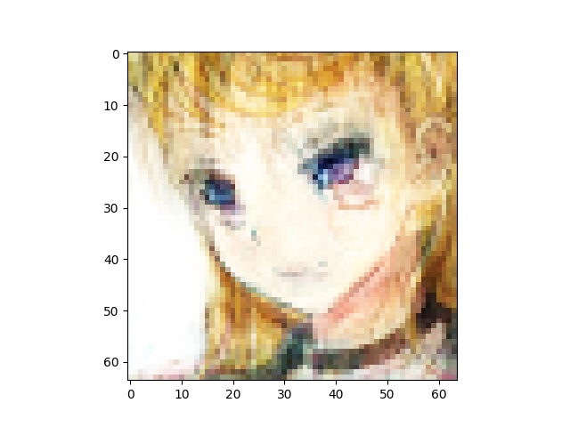
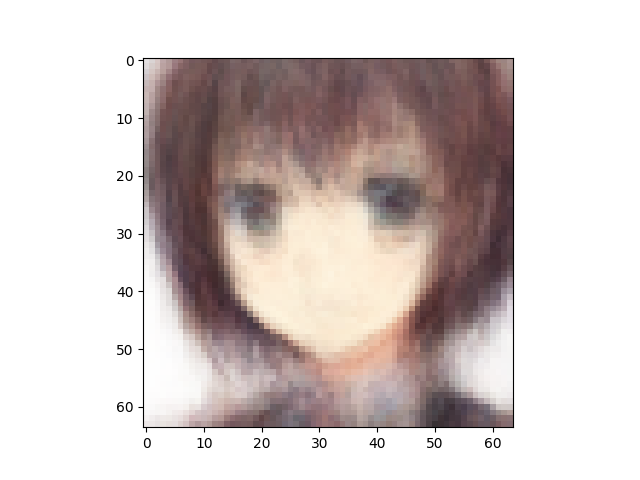
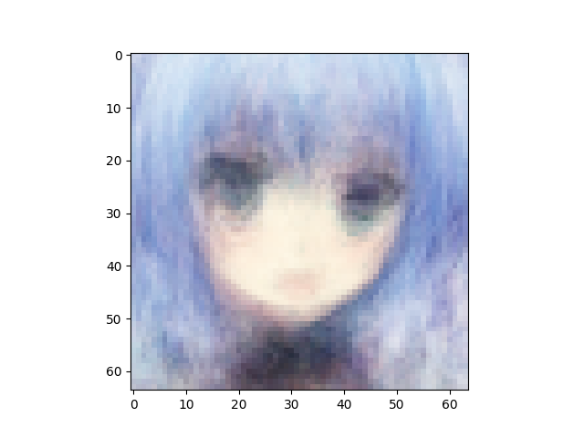
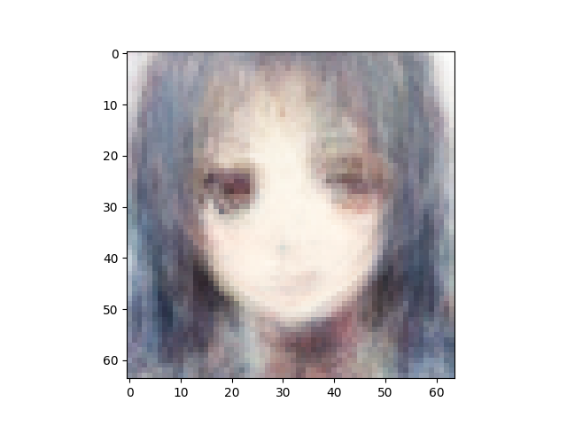
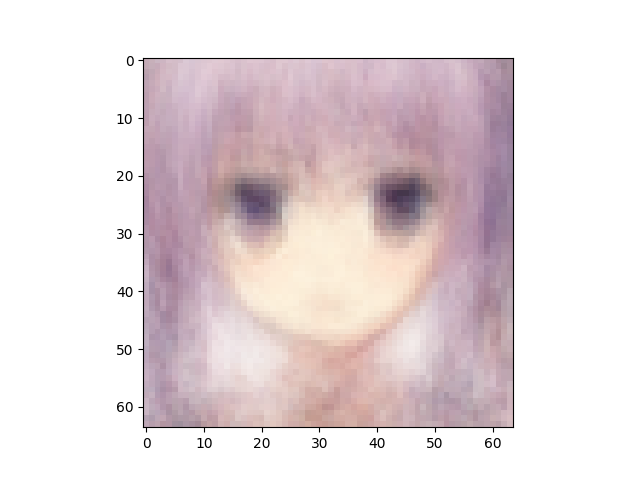
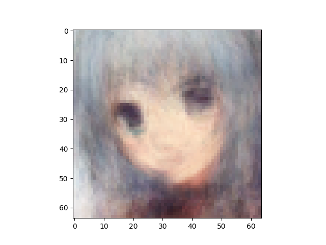

Number of latent variables 	512

Number of hidden layers 	5

Number of hidden nodes per layer 	1024

Number of epochs trained 	200

Epoch0, Training loss 7329.3256835938, Time used 3.08

Epoch1, Training loss 7117.4282226562, Time used 2.70

Epoch2, Training loss 7101.1455078125, Time used 2.64

Epoch3, Training loss 7086.3862304688, Time used 2.68

Epoch4, Training loss 7032.4794921875, Time used 2.70

Epoch5, Training loss 6970.4804687500, Time used 2.70

Epoch6, Training loss 6952.6176757812, Time used 2.71

Epoch7, Training loss 6938.9536132812, Time used 2.69

Epoch8, Training loss 6930.7465820312, Time used 2.86

Epoch9, Training loss 6910.6733398438, Time used 3.09

Epoch10, Training loss 6886.9082031250, Time used 3.10

Epoch11, Training loss 6869.7563476562, Time used 3.11

Epoch12, Training loss 6856.5102539062, Time used 3.10

Epoch13, Training loss 6846.7504882812, Time used 2.88

Epoch14, Training loss 6830.8872070312, Time used 2.68

Epoch15, Training loss 6811.8886718750, Time used 2.69

Epoch16, Training loss 6801.7324218750, Time used 2.77

Epoch17, Training loss 6790.9658203125, Time used 3.03

Epoch18, Training loss 6783.9257812500, Time used 2.68

Epoch19, Training loss 6778.4814453125, Time used 2.67

Epoch20, Training loss 6768.2807617188, Time used 3.06

Epoch21, Training loss 6761.9013671875, Time used 2.77

Epoch22, Training loss 6755.9267578125, Time used 2.68

Epoch23, Training loss 6753.1591796875, Time used 2.69

Epoch24, Training loss 6747.2397460938, Time used 2.67

Epoch25, Training loss 6742.7739257812, Time used 2.68

Epoch26, Training loss 6737.9628906250, Time used 2.69

Epoch27, Training loss 6731.2812500000, Time used 2.78

Epoch28, Training loss 6737.7519531250, Time used 2.75

Epoch29, Training loss 6726.7231445312, Time used 2.68

Epoch30, Training loss 6723.7949218750, Time used 2.69

Epoch31, Training loss 6718.9125976562, Time used 2.67

Epoch32, Training loss 6714.8906250000, Time used 2.69

Epoch33, Training loss 6713.4184570312, Time used 2.68

Epoch34, Training loss 6711.2543945312, Time used 2.70

Epoch35, Training loss 6707.8408203125, Time used 2.72

Epoch36, Training loss 6706.0205078125, Time used 2.67

Epoch37, Training loss 6699.3964843750, Time used 2.69

Epoch38, Training loss 6693.8867187500, Time used 2.69

Epoch39, Training loss 6690.9399414062, Time used 2.68

Epoch40, Training loss 6691.6650390625, Time used 2.69

Epoch41, Training loss 6690.5131835938, Time used 2.70

Epoch42, Training loss 6685.4062500000, Time used 2.70

Epoch43, Training loss 6683.2695312500, Time used 2.70

Epoch44, Training loss 6683.6303710938, Time used 2.70

Epoch45, Training loss 6684.6772460938, Time used 2.69

Epoch46, Training loss 6672.4106445312, Time used 2.69

Epoch47, Training loss 6670.3950195312, Time used 2.67

Epoch48, Training loss 6670.3203125000, Time used 2.69

Epoch49, Training loss 6672.0146484375, Time used 2.70

Epoch50, Training loss 6666.0307617188, Time used 2.69

Epoch51, Training loss 6660.5297851562, Time used 2.68

Epoch52, Training loss 6659.0600585938, Time used 2.68

Epoch53, Training loss 6659.7211914062, Time used 2.70

Epoch54, Training loss 6659.8730468750, Time used 2.67

Epoch55, Training loss 6655.5668945312, Time used 2.68

Epoch56, Training loss 6650.6860351562, Time used 2.68

Epoch57, Training loss 6650.8818359375, Time used 2.68

Epoch58, Training loss 6655.3369140625, Time used 2.69

Epoch59, Training loss 6649.8896484375, Time used 2.65

Epoch60, Training loss 6648.4960937500, Time used 2.68

Epoch61, Training loss 6646.2651367188, Time used 2.68

Epoch62, Training loss 6640.8129882812, Time used 2.70

Epoch63, Training loss 6638.7041015625, Time used 2.67

Epoch64, Training loss 6639.7387695312, Time used 2.66

Epoch65, Training loss 6634.9506835938, Time used 2.67

Epoch66, Training loss 6636.8803710938, Time used 2.69

Epoch67, Training loss 6639.2841796875, Time used 2.70

Epoch68, Training loss 6632.3989257812, Time used 2.69

Epoch69, Training loss 6631.5839843750, Time used 2.67

Epoch70, Training loss 6634.1074218750, Time used 2.65

Epoch71, Training loss 6632.6083984375, Time used 2.66

Epoch72, Training loss 6626.1684570312, Time used 2.71

Epoch73, Training loss 6630.1074218750, Time used 2.70

Epoch74, Training loss 6630.0092773438, Time used 2.70

Epoch75, Training loss 6621.9321289062, Time used 2.70

Epoch76, Training loss 6620.6064453125, Time used 2.70

Epoch77, Training loss 6620.0683593750, Time used 2.72

Epoch78, Training loss 6626.1381835938, Time used 2.61

Epoch79, Training loss 6625.1689453125, Time used 2.62

Epoch80, Training loss 6616.3793945312, Time used 2.67

Epoch81, Training loss 6620.6733398438, Time used 2.62

Epoch82, Training loss 6618.2529296875, Time used 2.63

Epoch83, Training loss 6614.9057617188, Time used 2.64

Epoch84, Training loss 6618.9970703125, Time used 2.64

Epoch85, Training loss 6610.1616210938, Time used 2.65

Epoch86, Training loss 6612.5131835938, Time used 2.64

Epoch87, Training loss 6620.3041992188, Time used 2.63

Epoch88, Training loss 6607.6484375000, Time used 2.64

Epoch89, Training loss 6606.8793945312, Time used 2.67

Epoch90, Training loss 6616.3417968750, Time used 2.65

Epoch91, Training loss 6607.3500976562, Time used 2.64

Epoch92, Training loss 6603.9692382812, Time used 2.65

Epoch93, Training loss 6606.5200195312, Time used 2.64

Epoch94, Training loss 6599.7714843750, Time used 2.65

Epoch95, Training loss 6604.3623046875, Time used 2.71

Epoch96, Training loss 6606.0136718750, Time used 2.64

Epoch97, Training loss 6600.8530273438, Time used 2.63

Epoch98, Training loss 6595.5532226562, Time used 2.64

Epoch99, Training loss 6596.5454101562, Time used 2.75

Epoch100, Training loss 6598.6694335938, Time used 2.75

Epoch101, Training loss 6595.8320312500, Time used 2.65

Epoch102, Training loss 6595.7314453125, Time used 3.04

Epoch103, Training loss 6596.3032226562, Time used 2.79

Epoch104, Training loss 6594.9916992188, Time used 2.73

Epoch105, Training loss 6593.8730468750, Time used 2.67

Epoch106, Training loss 6594.0585937500, Time used 2.84

Epoch107, Training loss 6592.3291015625, Time used 3.05

Epoch108, Training loss 6596.5419921875, Time used 2.73

Epoch109, Training loss 6590.4746093750, Time used 2.66

Epoch110, Training loss 6584.8715820312, Time used 2.67

Epoch111, Training loss 6587.6250000000, Time used 2.67

Epoch112, Training loss 6600.7333984375, Time used 2.67

Epoch113, Training loss 6583.7084960938, Time used 2.67

Epoch114, Training loss 6594.3525390625, Time used 2.72

Epoch115, Training loss 6585.4311523438, Time used 2.77

Epoch116, Training loss 6577.9316406250, Time used 2.64

Epoch117, Training loss 6578.9326171875, Time used 2.68

Epoch118, Training loss 6588.7084960938, Time used 2.72

Epoch119, Training loss 6590.4472656250, Time used 2.85

Epoch120, Training loss 6584.8657226562, Time used 2.68

Epoch121, Training loss 6582.7016601562, Time used 2.71

Epoch122, Training loss 6577.9663085938, Time used 2.67

Epoch123, Training loss 6575.0312500000, Time used 2.65

Epoch124, Training loss 6577.7153320312, Time used 2.66

Epoch125, Training loss 6576.2377929688, Time used 2.67

Epoch126, Training loss 6580.1469726562, Time used 2.66

Epoch127, Training loss 6577.0444335938, Time used 2.67

Epoch128, Training loss 6575.3808593750, Time used 2.64

Epoch129, Training loss 6574.9863281250, Time used 2.66

Epoch130, Training loss 6574.5849609375, Time used 2.66

Epoch131, Training loss 6577.0546875000, Time used 2.64

Epoch132, Training loss 6572.0649414062, Time used 2.75

Epoch133, Training loss 6582.6733398438, Time used 2.65

Epoch134, Training loss 6579.5874023438, Time used 2.64

Epoch135, Training loss 6569.4521484375, Time used 2.88

Epoch136, Training loss 6574.1479492188, Time used 2.62

Epoch137, Training loss 6578.6455078125, Time used 2.63

Epoch138, Training loss 6571.4555664062, Time used 2.65

Epoch139, Training loss 6566.8579101562, Time used 2.64

Epoch140, Training loss 6563.7495117188, Time used 2.66

Epoch141, Training loss 6574.1240234375, Time used 2.66

Epoch142, Training loss 6572.9130859375, Time used 2.67

Epoch143, Training loss 6564.1542968750, Time used 2.66

Epoch144, Training loss 6563.7768554688, Time used 2.66

Epoch145, Training loss 6566.6484375000, Time used 2.65

Epoch146, Training loss 6567.3784179688, Time used 2.65

Epoch147, Training loss 6565.9257812500, Time used 2.71

Epoch148, Training loss 6573.9082031250, Time used 2.73

Epoch149, Training loss 6572.4140625000, Time used 2.72

Epoch150, Training loss 6560.1186523438, Time used 2.67

Epoch151, Training loss 6559.8500976562, Time used 2.69

Epoch152, Training loss 6560.0053710938, Time used 2.72

Epoch153, Training loss 6563.2871093750, Time used 2.72

Epoch154, Training loss 6560.6562500000, Time used 2.76

Epoch155, Training loss 6562.9072265625, Time used 2.69

Epoch156, Training loss 6561.2099609375, Time used 2.66

Epoch157, Training loss 6578.5371093750, Time used 2.63

Epoch158, Training loss 6560.4814453125, Time used 2.64

Epoch159, Training loss 6548.3212890625, Time used 2.62

Epoch160, Training loss 6553.0400390625, Time used 2.64

Epoch161, Training loss 6553.8881835938, Time used 2.65

Epoch162, Training loss 6559.6840820312, Time used 2.77

Epoch163, Training loss 6555.3251953125, Time used 2.64

Epoch164, Training loss 6566.2343750000, Time used 2.97

Epoch165, Training loss 6557.7612304688, Time used 2.62

Epoch166, Training loss 6557.8076171875, Time used 2.61

Epoch167, Training loss 6554.9326171875, Time used 2.61

Epoch168, Training loss 6556.7436523438, Time used 2.69

Epoch169, Training loss 6547.8813476562, Time used 2.63

Epoch170, Training loss 6553.9389648438, Time used 2.62

Epoch171, Training loss 6556.8442382812, Time used 2.73

Epoch172, Training loss 6556.7832031250, Time used 2.64

Epoch173, Training loss 6553.9384765625, Time used 2.65

Epoch174, Training loss 6546.5581054688, Time used 2.64

Epoch175, Training loss 6553.3188476562, Time used 2.68

Epoch176, Training loss 6551.6289062500, Time used 2.67

Epoch177, Training loss 6550.8916015625, Time used 2.67

Epoch178, Training loss 6543.6020507812, Time used 2.67

Epoch179, Training loss 6551.7177734375, Time used 2.66

Epoch180, Training loss 6544.1831054688, Time used 2.72

Epoch181, Training loss 6550.2680664062, Time used 2.72

Epoch182, Training loss 6553.2592773438, Time used 2.68

Epoch183, Training loss 6552.3471679688, Time used 2.65

Epoch184, Training loss 6540.0229492188, Time used 2.66

Epoch185, Training loss 6543.7915039062, Time used 2.65

Epoch186, Training loss 6541.1738281250, Time used 2.67

Epoch187, Training loss 6543.9521484375, Time used 2.62

Epoch188, Training loss 6542.9873046875, Time used 2.64

Epoch189, Training loss 6548.4731445312, Time used 2.64

Epoch190, Training loss 6552.2084960938, Time used 2.65

Epoch191, Training loss 6548.0214843750, Time used 2.65

Epoch192, Training loss 6541.6855468750, Time used 2.67

Epoch193, Training loss 6537.1025390625, Time used 2.69

Epoch194, Training loss 6555.9687500000, Time used 2.66

Epoch195, Training loss 6541.2646484375, Time used 2.66

Epoch196, Training loss 6535.0776367188, Time used 2.65

Epoch197, Training loss 6537.1015625000, Time used 2.65

Epoch198, Training loss 6540.4619140625, Time used 2.65

Epoch199, Training loss 6543.3916015625, Time used 2.66

