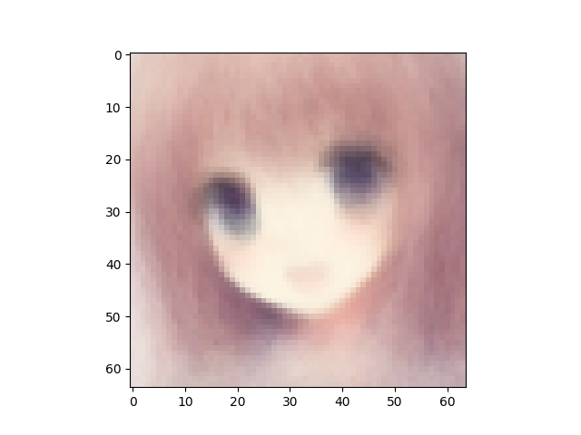
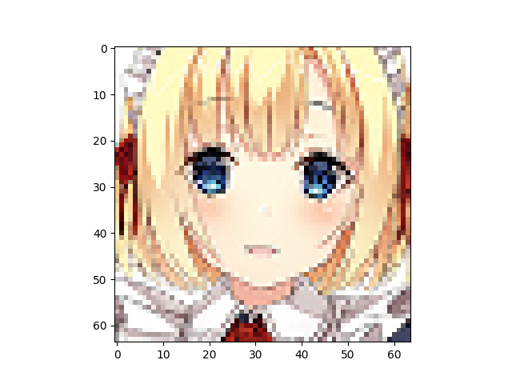
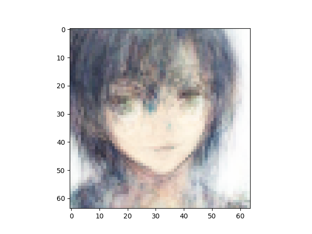
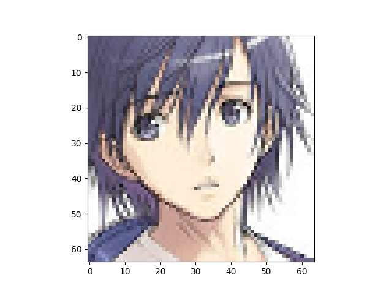
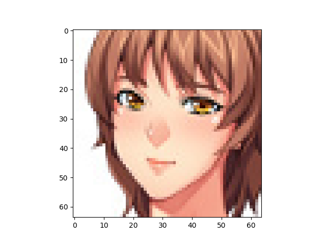

Number of latent variables 	512

Number of hidden layers 	5

Number of hidden nodes per layer 	1024

Number of epochs trained 	200

Epoch0, Training loss 7336.1176757812, Time used 2.96

Epoch1, Training loss 7120.4960937500, Time used 2.60

Epoch2, Training loss 7104.7001953125, Time used 2.58

Epoch3, Training loss 7087.0327148438, Time used 2.59

Epoch4, Training loss 7030.3232421875, Time used 2.71

Epoch5, Training loss 7003.4135742188, Time used 2.78

Epoch6, Training loss 6962.9067382812, Time used 2.93

Epoch7, Training loss 6940.0732421875, Time used 2.67

Epoch8, Training loss 6925.2304687500, Time used 2.55

Epoch9, Training loss 6900.0810546875, Time used 2.53

Epoch10, Training loss 6877.0288085938, Time used 2.72

Epoch11, Training loss 6856.5415039062, Time used 2.53

Epoch12, Training loss 6846.0493164062, Time used 2.53

Epoch13, Training loss 6836.1508789062, Time used 2.54

Epoch14, Training loss 6828.9741210938, Time used 2.61

Epoch15, Training loss 6822.6977539062, Time used 2.61

Epoch16, Training loss 6812.8330078125, Time used 2.61

Epoch17, Training loss 6805.4990234375, Time used 2.61

Epoch18, Training loss 6795.4663085938, Time used 2.61

Epoch19, Training loss 6786.5737304688, Time used 2.61

Epoch20, Training loss 6780.2416992188, Time used 2.61

Epoch21, Training loss 6775.8203125000, Time used 2.62

Epoch22, Training loss 6767.8325195312, Time used 2.67

Epoch23, Training loss 6762.4038085938, Time used 2.70

Epoch24, Training loss 6755.4516601562, Time used 2.74

Epoch25, Training loss 6752.5908203125, Time used 2.82

Epoch26, Training loss 6745.7333984375, Time used 2.81

Epoch27, Training loss 6740.9277343750, Time used 2.55

Epoch28, Training loss 6738.1323242188, Time used 2.53

Epoch29, Training loss 6733.4194335938, Time used 2.53

Epoch30, Training loss 6736.9321289062, Time used 2.74

Epoch31, Training loss 6732.0795898438, Time used 2.85

Epoch32, Training loss 6724.8081054688, Time used 2.53

Epoch33, Training loss 6725.0566406250, Time used 2.91

Epoch34, Training loss 6718.7099609375, Time used 2.68

Epoch35, Training loss 6714.2314453125, Time used 2.59

Epoch36, Training loss 6710.9721679688, Time used 2.59

Epoch37, Training loss 6711.8950195312, Time used 2.58

Epoch38, Training loss 6705.7612304688, Time used 2.59

Epoch39, Training loss 6705.2685546875, Time used 2.59

Epoch40, Training loss 6702.3886718750, Time used 2.59

Epoch41, Training loss 6701.4409179688, Time used 2.83

Epoch42, Training loss 6695.3828125000, Time used 2.55

Epoch43, Training loss 6693.3754882812, Time used 2.58

Epoch44, Training loss 6691.4907226562, Time used 2.58

Epoch45, Training loss 6687.1352539062, Time used 2.59

Epoch46, Training loss 6685.2729492188, Time used 2.62

Epoch47, Training loss 6684.8129882812, Time used 2.53

Epoch48, Training loss 6681.6816406250, Time used 2.50

Epoch49, Training loss 6677.9453125000, Time used 2.51

Epoch50, Training loss 6676.0244140625, Time used 2.50

Epoch51, Training loss 6676.2963867188, Time used 2.51

Epoch52, Training loss 6672.6616210938, Time used 2.51

Epoch53, Training loss 6669.1000976562, Time used 2.50

Epoch54, Training loss 6669.0297851562, Time used 2.51

Epoch55, Training loss 6666.3603515625, Time used 2.51

Epoch56, Training loss 6666.8203125000, Time used 2.51

Epoch57, Training loss 6663.4267578125, Time used 2.51

Epoch58, Training loss 6658.7197265625, Time used 2.51

Epoch59, Training loss 6660.4101562500, Time used 2.50

Epoch60, Training loss 6656.1972656250, Time used 2.50

Epoch61, Training loss 6660.9360351562, Time used 2.56

Epoch62, Training loss 6652.7343750000, Time used 2.57

Epoch63, Training loss 6654.8408203125, Time used 2.59

Epoch64, Training loss 6650.0253906250, Time used 2.58

Epoch65, Training loss 6645.2485351562, Time used 2.58

Epoch66, Training loss 6648.9350585938, Time used 2.59

Epoch67, Training loss 6648.9711914062, Time used 2.59

Epoch68, Training loss 6642.7363281250, Time used 2.58

Epoch69, Training loss 6638.7441406250, Time used 2.69

Epoch70, Training loss 6640.8613281250, Time used 2.54

Epoch71, Training loss 6643.8554687500, Time used 2.50

Epoch72, Training loss 6636.0380859375, Time used 2.62

Epoch73, Training loss 6637.5043945312, Time used 2.58

Epoch74, Training loss 6635.6630859375, Time used 2.62

Epoch75, Training loss 6630.8574218750, Time used 2.64

Epoch76, Training loss 6629.8261718750, Time used 2.76

Epoch77, Training loss 6631.4389648438, Time used 2.66

Epoch78, Training loss 6634.7739257812, Time used 2.68

Epoch79, Training loss 6625.9555664062, Time used 2.52

Epoch80, Training loss 6625.6713867188, Time used 2.57

Epoch81, Training loss 6626.9199218750, Time used 2.60

Epoch82, Training loss 6623.7021484375, Time used 2.59

Epoch83, Training loss 6621.3481445312, Time used 2.53

Epoch84, Training loss 6621.5908203125, Time used 2.55

Epoch85, Training loss 6619.5844726562, Time used 2.60

Epoch86, Training loss 6622.0014648438, Time used 2.55

Epoch87, Training loss 6619.8408203125, Time used 2.55

Epoch88, Training loss 6633.0722656250, Time used 2.53

Epoch89, Training loss 6619.7226562500, Time used 2.54

Epoch90, Training loss 6616.9804687500, Time used 2.52

Epoch91, Training loss 6613.2187500000, Time used 2.53

Epoch92, Training loss 6610.7031250000, Time used 2.61

Epoch93, Training loss 6612.9990234375, Time used 2.85

Epoch94, Training loss 6613.6625976562, Time used 2.93

Epoch95, Training loss 6614.3183593750, Time used 2.96

Epoch96, Training loss 6614.6264648438, Time used 2.60

Epoch97, Training loss 6605.9819335938, Time used 2.61

Epoch98, Training loss 6611.9165039062, Time used 2.60

Epoch99, Training loss 6605.5146484375, Time used 2.60

Epoch100, Training loss 6610.3793945312, Time used 2.82

Epoch101, Training loss 6607.5854492188, Time used 2.94

Epoch102, Training loss 6606.3408203125, Time used 2.84

Epoch103, Training loss 6605.8540039062, Time used 2.50

Epoch104, Training loss 6602.3715820312, Time used 2.50

Epoch105, Training loss 6605.1562500000, Time used 2.50

Epoch106, Training loss 6601.5371093750, Time used 2.50

Epoch107, Training loss 6598.3701171875, Time used 2.53

Epoch108, Training loss 6604.1206054688, Time used 2.87

Epoch109, Training loss 6601.1508789062, Time used 2.83

Epoch110, Training loss 6592.8183593750, Time used 2.80

Epoch111, Training loss 6596.9418945312, Time used 2.80

Epoch112, Training loss 6596.4384765625, Time used 2.93

Epoch113, Training loss 6598.4936523438, Time used 2.93

Epoch114, Training loss 6598.2280273438, Time used 2.79

Epoch115, Training loss 6595.0859375000, Time used 2.66

Epoch116, Training loss 6586.8999023438, Time used 2.67

Epoch117, Training loss 6598.5439453125, Time used 2.65

Epoch118, Training loss 6594.3305664062, Time used 2.60

Epoch119, Training loss 6591.7719726562, Time used 2.61

Epoch120, Training loss 6589.2978515625, Time used 2.61

Epoch121, Training loss 6588.6166992188, Time used 2.61

Epoch122, Training loss 6589.1499023438, Time used 2.61

Epoch123, Training loss 6597.1474609375, Time used 2.61

Epoch124, Training loss 6600.5000000000, Time used 2.62

Epoch125, Training loss 6588.1660156250, Time used 2.61

Epoch126, Training loss 6584.3642578125, Time used 2.79

Epoch127, Training loss 6586.7377929688, Time used 2.61

Epoch128, Training loss 6581.1606445312, Time used 2.61

Epoch129, Training loss 6587.1044921875, Time used 2.62

Epoch130, Training loss 6583.8862304688, Time used 2.61

Epoch131, Training loss 6580.5532226562, Time used 2.61

Epoch132, Training loss 6581.2700195312, Time used 2.62

Epoch133, Training loss 6584.4145507812, Time used 2.61

Epoch134, Training loss 6580.7270507812, Time used 2.61

Epoch135, Training loss 6587.6811523438, Time used 2.61

Epoch136, Training loss 6575.8881835938, Time used 2.61

Epoch137, Training loss 6583.9765625000, Time used 2.61

Epoch138, Training loss 6589.2714843750, Time used 2.61

Epoch139, Training loss 6590.5083007812, Time used 2.61

Epoch140, Training loss 6581.9184570312, Time used 2.61

Epoch141, Training loss 6574.2299804688, Time used 2.59

Epoch142, Training loss 6573.2563476562, Time used 2.59

Epoch143, Training loss 6580.9208984375, Time used 2.50

Epoch144, Training loss 6573.3012695312, Time used 2.56

Epoch145, Training loss 6575.0073242188, Time used 2.50

Epoch146, Training loss 6572.4306640625, Time used 2.65

Epoch147, Training loss 6569.2539062500, Time used 2.50

Epoch148, Training loss 6572.8881835938, Time used 2.85

Epoch149, Training loss 6574.0214843750, Time used 2.98

Epoch150, Training loss 6572.7626953125, Time used 2.98

Epoch151, Training loss 6570.8095703125, Time used 2.97

Epoch152, Training loss 6575.0463867188, Time used 2.97

Epoch153, Training loss 6570.5073242188, Time used 2.92

Epoch154, Training loss 6567.0268554688, Time used 2.86

Epoch155, Training loss 6562.7250976562, Time used 2.86

Epoch156, Training loss 6567.1860351562, Time used 2.64

Epoch157, Training loss 6579.3325195312, Time used 2.55

Epoch158, Training loss 6569.1904296875, Time used 2.55

Epoch159, Training loss 6562.3032226562, Time used 2.54

Epoch160, Training loss 6565.3950195312, Time used 2.58

Epoch161, Training loss 6574.1025390625, Time used 2.57

Epoch162, Training loss 6566.7910156250, Time used 2.86

Epoch163, Training loss 6569.3627929688, Time used 2.91

Epoch164, Training loss 6568.0297851562, Time used 2.87

Epoch165, Training loss 6563.2890625000, Time used 2.87

Epoch166, Training loss 6566.1665039062, Time used 2.74

Epoch167, Training loss 6563.6386718750, Time used 2.51

Epoch168, Training loss 6567.4174804688, Time used 2.50

Epoch169, Training loss 6558.4580078125, Time used 2.72

Epoch170, Training loss 6560.3320312500, Time used 2.60

Epoch171, Training loss 6574.1582031250, Time used 2.51

Epoch172, Training loss 6568.5185546875, Time used 2.51

Epoch173, Training loss 6557.0927734375, Time used 2.50

Epoch174, Training loss 6565.8344726562, Time used 2.50

Epoch175, Training loss 6561.7294921875, Time used 2.81

Epoch176, Training loss 6557.6743164062, Time used 2.82

Epoch177, Training loss 6556.3212890625, Time used 2.84

Epoch178, Training loss 6562.3569335938, Time used 2.82

Epoch179, Training loss 6569.0917968750, Time used 2.82

Epoch180, Training loss 6556.8149414062, Time used 2.82

Epoch181, Training loss 6558.3447265625, Time used 2.82

Epoch182, Training loss 6565.4365234375, Time used 2.82

Epoch183, Training loss 6561.8969726562, Time used 2.65

Epoch184, Training loss 6553.8891601562, Time used 2.56

Epoch185, Training loss 6549.3789062500, Time used 2.54

Epoch186, Training loss 6550.1972656250, Time used 2.56

Epoch187, Training loss 6553.9218750000, Time used 2.56

Epoch188, Training loss 6552.1953125000, Time used 2.56

Epoch189, Training loss 6552.9541015625, Time used 2.54

Epoch190, Training loss 6559.4731445312, Time used 2.51

Epoch191, Training loss 6553.2973632812, Time used 2.53

Epoch192, Training loss 6552.4555664062, Time used 2.58

Epoch193, Training loss 6549.9707031250, Time used 2.58

Epoch194, Training loss 6555.1630859375, Time used 2.58

Epoch195, Training loss 6560.9975585938, Time used 2.58

Epoch196, Training loss 6552.1547851562, Time used 2.59

Epoch197, Training loss 6547.5200195312, Time used 2.58

Epoch198, Training loss 6547.7202148438, Time used 2.59

Epoch199, Training loss 6545.1406250000, Time used 2.59

